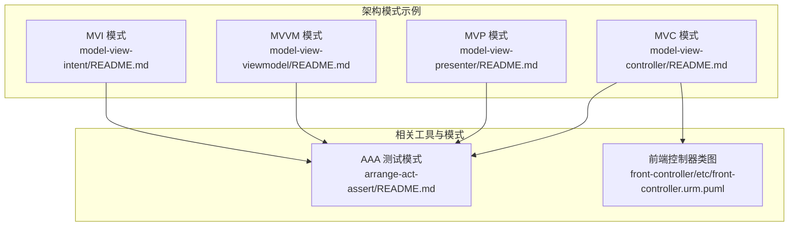
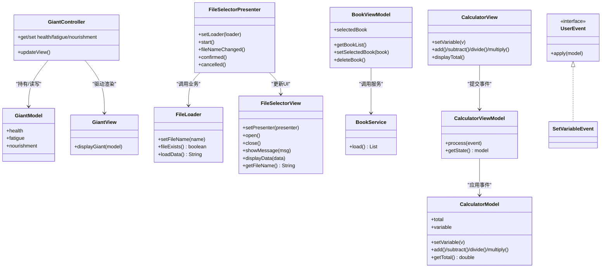
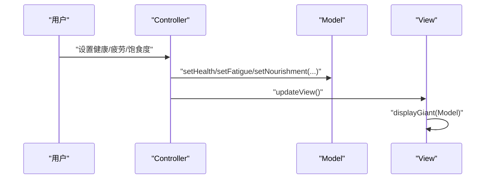
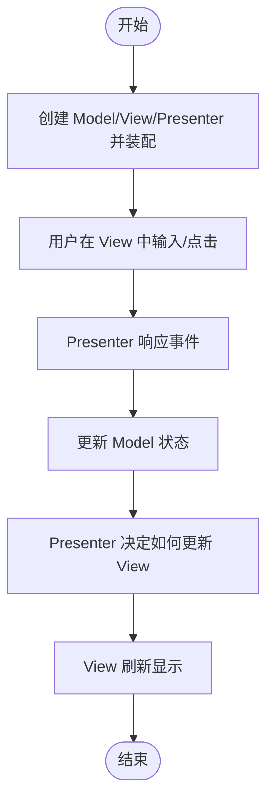
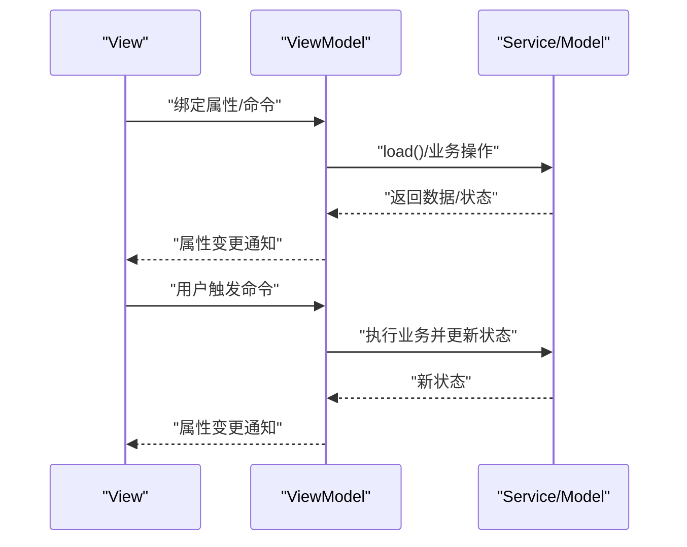
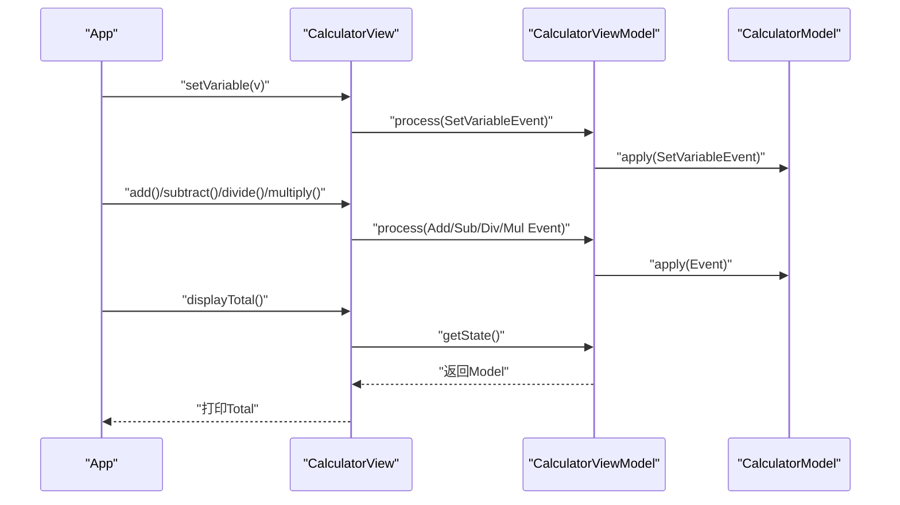
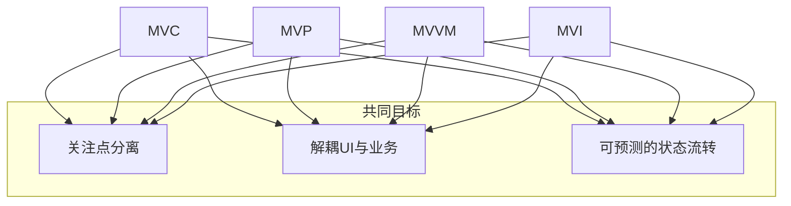
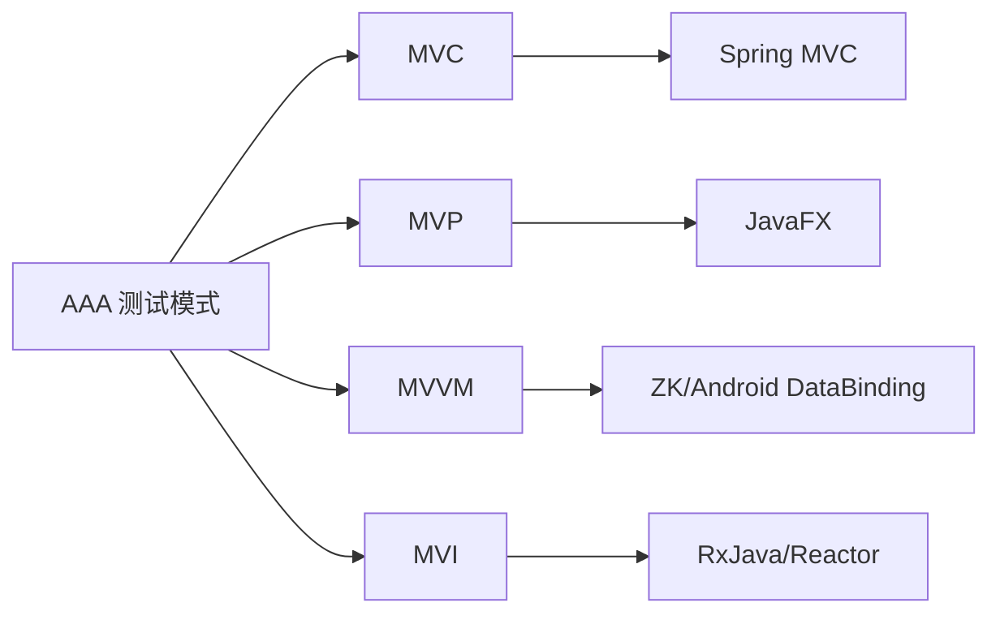

# MVC架构模式

<cite>
**本文档引用的文件**
- [model-view-controller/README.md](file://model-view-controller/README.md)
- [model-view-presenter/README.md](file://model-view-presenter/README.md)
- [model-view-viewmodel/README.md](file://model-view-viewmodel/README.md)
- [model-view-intent/README.md](file://model-view-intent/README.md)
- [model-view-intent/src/main/java/com/iluwatar/model/view/intent/App.java](file://model-view-intent/src/main/java/com/iluwatar/model/view/intent/App.java)
- [front-controller/etc/front-controller.urm.puml](file://front-controller/etc/front-controller.urm.puml)
- [arrange-act-assert/README.md](file://arrange-act-assert/README.md)
</cite>

## 目录
1. [引言](#引言)
2. [项目结构](#项目结构)
3. [核心组件](#核心组件)
4. [架构总览](#架构总览)
5. [详细组件分析](#详细组件分析)
6. [依赖关系分析](#依赖关系分析)
7. [性能考量](#性能考量)
8. [故障排查指南](#故障排查指南)
9. [结论](#结论)
10. [附录](#附录)

## 引言
本指南系统梳理并对比四种主流架构模式：Model-View-Controller（MVC）、Model-View-Presenter（MVP）、Model-View-ViewModel（MVVM）与 Model-View-Intent（MVI）。文档从职责划分、数据流与交互机制入手，结合仓库中已有的Java实现示例，解释各模式在Java Web与桌面应用中的落地方式，并延伸到现代前端框架（如React、Angular、Vue）中的对应实践。同时给出性能优化、可测试性与可维护性的建议。

## 项目结构
该仓库提供了四种架构模式的说明文档与示例，便于对照学习与实践验证。下图展示了与本指南相关的核心模块及其职责定位：

**图表来源**
- [model-view-controller/README.md](file://model-view-controller/README.md#L1-L162)
- [model-view-presenter/README.md](file://model-view-presenter/README.md#L1-L169)
- [model-view-viewmodel/README.md](file://model-view-viewmodel/README.md#L1-L165)
- [model-view-intent/README.md](file://model-view-intent/README.md#L1-L226)
- [front-controller/etc/front-controller.urm.puml](file://front-controller/etc/front-controller.urm.puml#L1-L53)
- [arrange-act-assert/README.md](file://arrange-act-assert/README.md#L38-L164)

**章节来源**
- [model-view-controller/README.md](file://model-view-controller/README.md#L1-L162)
- [model-view-presenter/README.md](file://model-view-presenter/README.md#L1-L169)
- [model-view-viewmodel/README.md](file://model-view-viewmodel/README.md#L1-L165)
- [model-view-intent/README.md](file://model-view-intent/README.md#L1-L226)
- [front-controller/etc/front-controller.urm.puml](file://front-controller/etc/front-controller.urm.puml#L1-L53)
- [arrange-act-assert/README.md](file://arrange-act-assert/README.md#L38-L164)

## 核心组件
- MVC（Model-View-Controller）
  - Model：封装业务数据与规则，负责状态管理与业务逻辑。
  - View：负责渲染与展示，接收来自Model的数据更新。
  - Controller：协调Model与View，处理用户输入并驱动状态变更。
- MVP（Model-View-Presenter）
  - Presenter：承载视图逻辑，作为View与Model之间的中介，处理UI事件并更新视图。
- MVVM（Model-View-ViewModel）
  - ViewModel：暴露数据绑定接口，承载视图状态与命令，通过数据绑定将Model与View解耦。
- MVI（Model-View-Intent）
  - Intent：封装用户意图或事件，驱动Model状态变化。
  - Model：集中保存UI状态，提供纯函数式的状态更新方法。
  - View：被动展示状态，响应Model变化进行刷新。

**章节来源**
- [model-view-controller/README.md](file://model-view-controller/README.md#L19-L36)
- [model-view-presenter/README.md](file://model-view-presenter/README.md#L20-L44)
- [model-view-viewmodel/README.md](file://model-view-viewmodel/README.md#L19-L43)
- [model-view-intent/README.md](file://model-view-intent/README.md#L19-L39)

## 架构总览
下图以类图形式展示MVC/MVP/MVVM/MVI四类模式的典型角色关系与交互方向，帮助快速理解职责边界与数据流。

**图表来源**
- [model-view-controller/README.md](file://model-view-controller/README.md#L41-L114)
- [model-view-presenter/README.md](file://model-view-presenter/README.md#L54-L120)
- [model-view-viewmodel/README.md](file://model-view-viewmodel/README.md#L49-L79)
- [model-view-intent/README.md](file://model-view-intent/README.md#L75-L167)

## 详细组件分析

### MVC（Model-View-Controller）
- 职责划分
  - Model：封装健康、疲劳、饱食度等状态，提供读写访问器。
  - View：接收Model并输出格式化信息。
  - Controller：持有Model与View，提供状态读写入口，并触发视图更新。
- 数据流
  - 用户操作经Controller进入，Controller修改Model，随后通知View刷新。
- 适用场景
  - Web应用（如Spring MVC）与桌面应用（Swing/JavaFX），强调关注点分离与并行开发。
- 优缺点
  - 优点：结构清晰、易于测试、便于扩展。
  - 缺点：初期复杂度较高，小项目可能过度工程化。

**图表来源**
- [model-view-controller/README.md](file://model-view-controller/README.md#L74-L114)

**章节来源**
- [model-view-controller/README.md](file://model-view-controller/README.md#L37-L146)

### MVP（Model-View-Presenter）
- 职责划分
  - Model：封装业务逻辑（如文件加载）。
  - View：定义UI契约（显示消息、展示数据、获取输入）。
  - Presenter：协调View与Model，处理用户交互并驱动UI更新。
- 数据流
  - View回调Presenter；Presenter更新Model；Model状态变化后由Presenter决定如何更新View。
- 适用场景
  - 复杂UI与业务逻辑分离需求，便于单元测试Presenter。
- 优缺点
  - 优点：UI逻辑可独立测试；关注点分离更彻底。
  - 缺点：类与接口增多；Presenter与View耦合需谨慎设计。

**图表来源**
- [model-view-presenter/README.md](file://model-view-presenter/README.md#L96-L134)

**章节来源**
- [model-view-presenter/README.md](file://model-view-presenter/README.md#L46-L160)

### MVVM（Model-View-ViewModel）
- 职责划分
  - ViewModel：暴露属性与命令，承载UI状态与业务逻辑，支持数据绑定。
  - View：声明式绑定ViewModel，自动响应状态变化。
  - Model：业务数据与服务。
- 数据流
  - ViewModel通过数据绑定向View推送状态；View通过命令触发ViewModel执行业务。
- 适用场景
  - 需要强绑定能力的桌面/移动端应用（如JavaFX、Android DataBinding、ZK）。
- 优缺点
  - 优点：UI与业务解耦、可复用性强。
  - 缺点：对绑定框架有依赖，学习成本较高。

**图表来源**
- [model-view-viewmodel/README.md](file://model-view-viewmodel/README.md#L49-L79)

**章节来源**
- [model-view-viewmodel/README.md](file://model-view-viewmodel/README.md#L45-L160)

### MVI（Model-View-Intent）
- 职责划分
  - Intent：封装用户意图（事件），如加减乘除、设置变量。
  - Model：集中保存UI状态，提供纯函数式更新方法。
  - View：仅负责展示与向ViewModel提交事件。
- 数据流
  - View提交Intent → ViewModel将Intent应用到Model → Model状态变化 → View根据新状态刷新。
- 适用场景
  - 复杂交互与状态管理需求，强调单向数据流与可预测性。
- 优缺点
  - 优点：状态可追踪、调试友好、可测试性强。
  - 缺点：对事件建模要求高，简单UI可能过度设计。

**图表来源**
- [model-view-intent/README.md](file://model-view-intent/README.md#L48-L167)
- [model-view-intent/src/main/java/com/iluwatar/model/view/intent/App.java](file://model-view-intent/src/main/java/com/iluwatar/model/view/intent/App.java#L49-L70)

**章节来源**
- [model-view-intent/README.md](file://model-view-intent/README.md#L40-L215)

### 概念总览
下图从概念层面展示四种模式的共同目标与差异点，帮助建立整体认知。

（此图为概念性示意，不直接映射具体源码文件）

## 依赖关系分析
- 组件内聚与耦合
  - MVC：Controller与View松耦合，通过Model桥接；适合分层架构。
  - MVP：Presenter承担较多职责，需避免与View过紧耦合。
  - MVVM：依赖数据绑定框架；ViewModel与View通过绑定解耦。
  - MVI：Intent与Model解耦，单向数据流降低副作用。
- 外部依赖
  - Web框架（如Spring MVC）与桌面框架（如JavaFX/ZK）为模式落地提供基础设施。
  - 测试框架（JUnit）与AAA模式提升可测试性。

（此图为概念性示意，不直接映射具体源码文件）

**章节来源**
- [arrange-act-assert/README.md](file://arrange-act-assert/README.md#L126-L164)

## 性能考量
- 渲染与更新
  - MVC/MVP：按需刷新View，避免全量重绘。
  - MVVM：利用细粒度属性变更通知，减少不必要的绑定更新。
  - MVI：集中状态管理，事件驱动更新，避免重复渲染。
- 绑定与序列化
  - MVVM中避免在绑定表达式中进行昂贵计算；必要时使用缓存或惰性求值。
- 事件风暴
  - MVI中合并/去抖用户事件，防止状态频繁抖动导致的性能问题。
- 测试驱动优化
  - 使用AAA模式组织单元测试，确保关键路径的性能回归可控。

（本节为通用指导，不直接分析具体文件）

## 故障排查指南
- 常见问题
  - UI未更新：检查MVC中Controller是否调用View刷新；MVVM中属性变更通知是否发出；MVI中Intent是否正确应用到Model。
  - 状态不一致：MVI中确认事件顺序与幂等性；MVVM中避免直接修改Model而绕过ViewModel。
  - 测试失败：使用AAA模式规范测试步骤，隔离Setup/Action/Assert阶段，定位失败点。
- 排查步骤
  - 打印关键状态与事件日志，核对数据流路径。
  - 单元测试覆盖核心分支，逐步缩小问题范围。
  - 对比模式文档中的职责边界，检查是否存在职责越界。

**章节来源**
- [arrange-act-assert/README.md](file://arrange-act-assert/README.md#L126-L164)

## 结论
- 选择建议
  - MVC：通用Web/桌面应用，强调关注点分离与并行开发。
  - MVP：复杂UI与业务分离需求，便于测试Presenter。
  - MVVM：强绑定场景（桌面/移动端），追求UI与业务解耦。
  - MVI：复杂交互与状态管理，强调单向数据流与可预测性。
- 实践要点
  - 明确职责边界，避免Presenter/ViewModel过度膨胀。
  - 重视测试策略（AAA模式），保障可维护性。
  - 在简单场景避免过度设计，遵循“够用就好”的原则。

（本节为总结性内容，不直接分析具体文件）

## 附录
- 现代前端框架中的对应实现
  - React：常用Redux或自研状态机，与MVI思想相近（单向数据流+纯函数更新）。
  - Angular：双向绑定与依赖注入，与MVVM理念接近。
  - Vue：响应式系统与组件化，与MVVM/单向数据流兼容。
- 参考资源
  - Spring MVC教程、ZK框架文档、MVI相关文章与书籍推荐见各模式文档末尾。

**章节来源**
- [model-view-controller/README.md](file://model-view-controller/README.md#L124-L161)
- [model-view-viewmodel/README.md](file://model-view-viewmodel/README.md#L130-L164)
- [model-view-intent/README.md](file://model-view-intent/README.md#L192-L226)