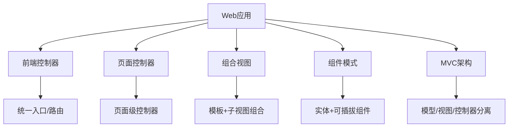
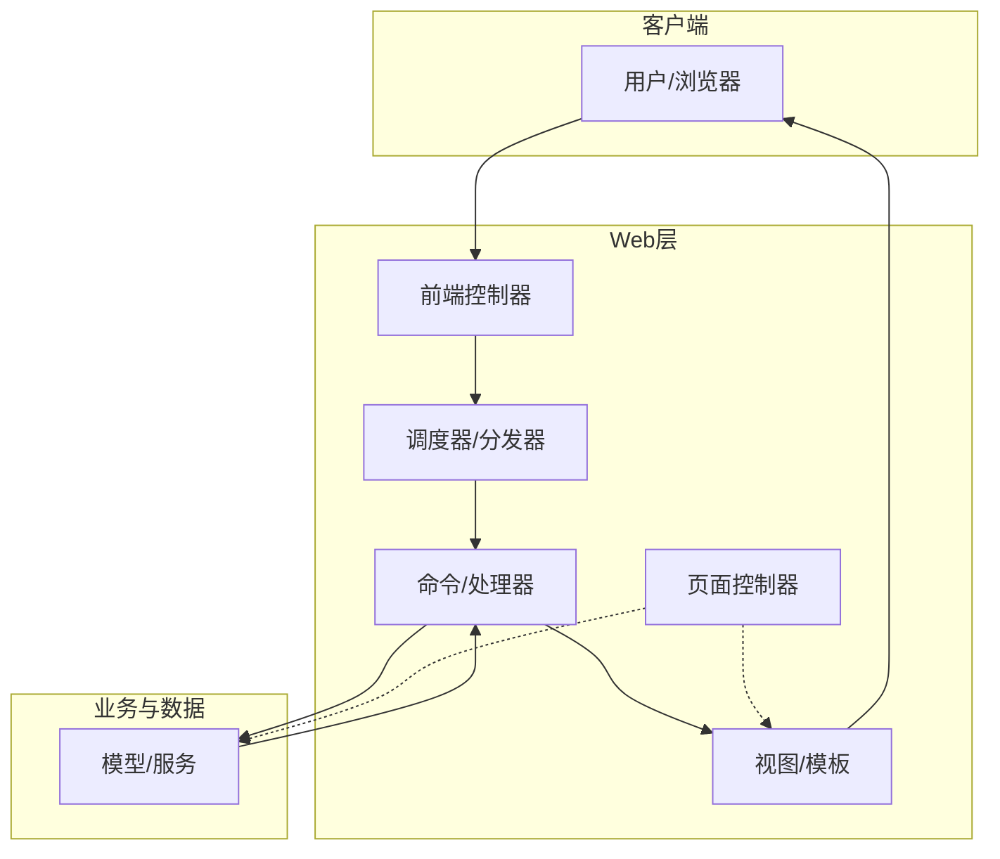
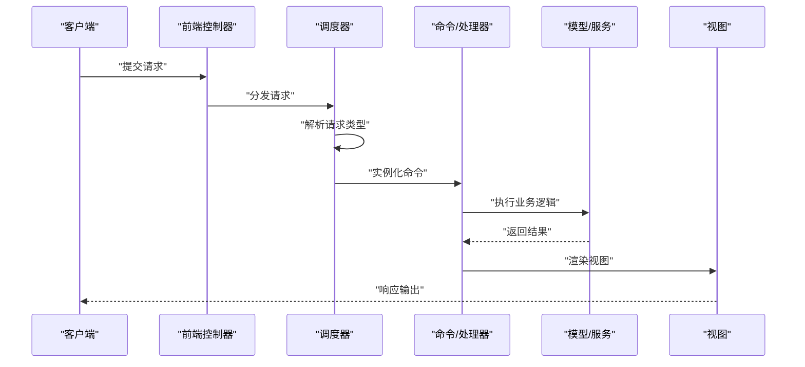
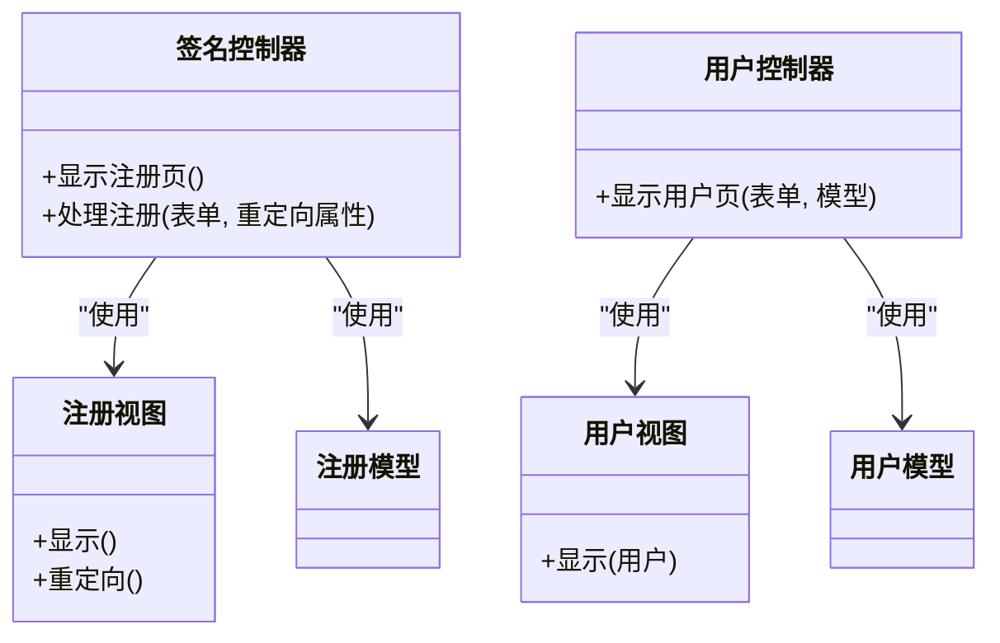
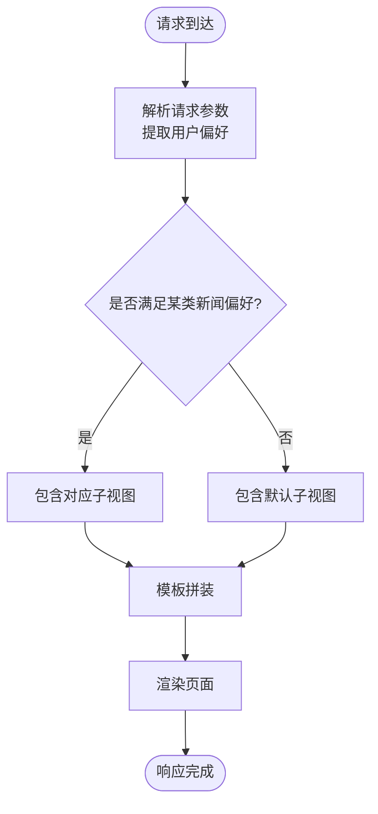
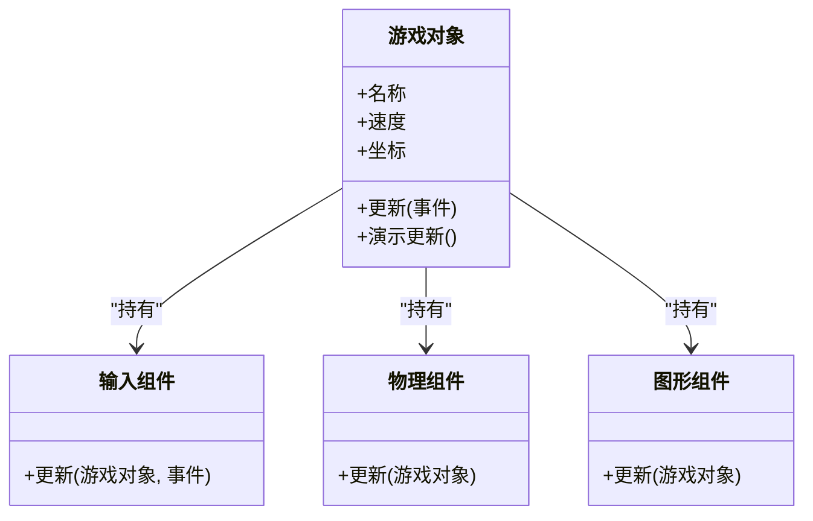
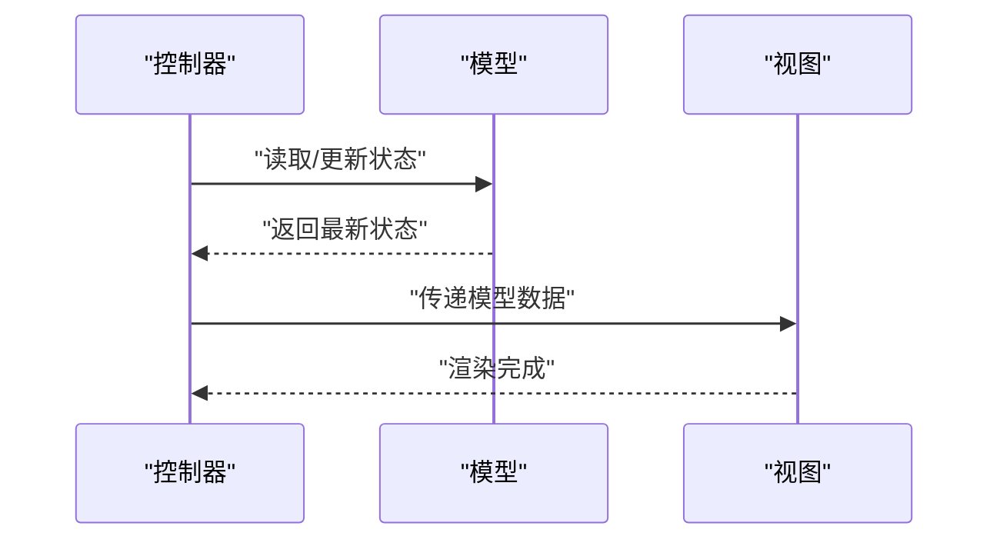
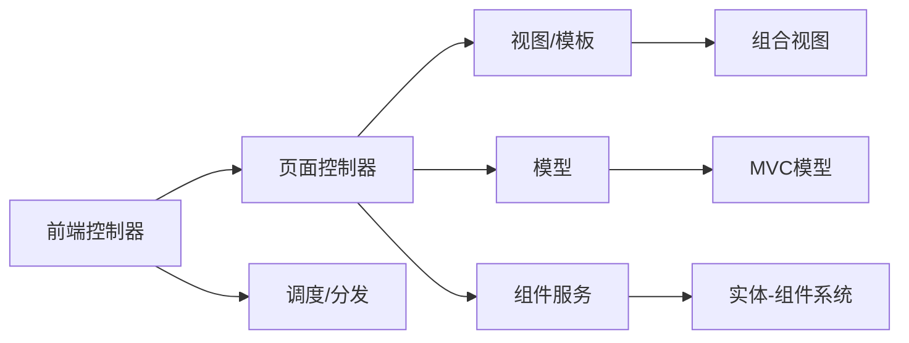

# Web和UI模式

<cite>
**本文引用的文件**
- [README.md](file://README.md)
- [front-controller/README.md](file://front-controller/README.md)
- [page-controller/README.md](file://page-controller/README.md)
- [composite-view/README.md](file://composite-view/README.md)
- [component/README.md](file://component/README.md)
- [model-view-controller/README.md](file://model-view-controller/README.md)
</cite>

## 目录
1. [引言](#引言)
2. [项目结构](#项目结构)
3. [核心组件](#核心组件)
4. [架构总览](#架构总览)
5. [详细组件分析](#详细组件分析)
6. [依赖关系分析](#依赖关系分析)
7. [性能考量](#性能考量)
8. [故障排查指南](#故障排查指南)
9. [结论](#结论)
10. [附录](#附录)

## 引言
本指南聚焦于Web应用与用户界面设计模式，系统梳理前端控制器模式、页面控制器模式等Web请求处理模式，并深入解析MVC、MVP、MVVM、MVI等架构模式在Web开发中的应用；同时提供组合视图模式、组件模式等UI构建模式的实现方案，覆盖视图抽象、状态管理与用户交互的最佳实践，展示现代Web框架中的模式应用与响应式设计模式，并给出用户体验优化、性能监控与可访问性设计的指导原则。

## 项目结构
该仓库以“按模式分模块”的方式组织，每个模式均配有独立README说明其意图、示例、适用场景与优缺点。与Web/UI密切相关的模块包括：
- 前端控制器（Front Controller）：集中式请求入口，统一处理与路由
- 页面控制器（Page Controller）：面向页面/动作的控制器，分离请求处理与视图渲染
- 组合视图（Composite View）：模板化页面由多个子视图组合而成
- 组件（Component）：实体-组件系统，强调可插拔与动态组合
- 模型-视图-控制器（MVC）：经典的三层分离架构

章节来源
- file://README.md#L1-L532

## 核心组件
- 前端控制器（Front Controller）
  - 作用：为所有Web请求提供集中入口，统一执行认证、日志、路由等横切关注点
  - 典型流程：请求进入Front Controller → 路由到Dispatcher → 根据请求类型创建命令对象 → 执行业务逻辑并渲染视图
  - 优点：集中控制、一致行为、便于集成安全与会话管理
  - 风险：可能成为瓶颈，需避免过度耦合
- 页面控制器（Page Controller）
  - 作用：针对特定页面或动作进行处理，分离控制器逻辑与视图
  - 典型流程：控制器接收HTTP请求 → 处理输入/业务 → 决定视图与数据模型
  - 优点：职责单一、可测试性强、便于维护
  - 风险：结构复杂度上升、额外抽象层带来开销
- 组合视图（Composite View）
  - 作用：通过模板与条件包含将多个原子子视图组合成复合视图
  - 典型流程：Servlet转发到JSP模板 → 模板根据用户偏好选择子视图 → 动态拼装页面
  - 优点：灵活扩展、统一布局、复用原子视图
  - 风险：过度通用化导致设计复杂、约束难以强制
- 组件（Component）
  - 作用：将行为拆分为可插拔组件，实体通过组件动态装配能力
  - 典型流程：实体持有若干组件 → 更新时逐个调用组件更新 → 实现解耦与动态行为
  - 优点：高内聚低耦合、运行时动态组合、可复用
  - 风险：架构复杂度提升、性能与通信成本
- MVC
  - 作用：分离业务逻辑（模型）、用户界面（视图）与用户输入（控制器）
  - 典型流程：控制器协调模型与视图 → 模型变更通知视图 → 视图渲染
  - 优点：职责清晰、易于测试、便于并行开发
  - 风险：初始设置复杂、小项目可能过度工程化

章节来源
- file://front-controller/README.md#L19-L144
- file://page-controller/README.md#L18-L161
- file://composite-view/README.md#L14-L347
- file://component/README.md#L19-L162
- file://model-view-controller/README.md#L19-L162

## 架构总览
下图展示了Web请求在前端控制器与页面控制器之间的流转，以及视图层如何通过组合视图与组件模式实现模块化与可扩展性。

图表来源
- [front-controller/README.md](file://front-controller/README.md#L37-L105)
- [page-controller/README.md](file://page-controller/README.md#L34-L122)
- [composite-view/README.md](file://composite-view/README.md#L140-L221)

## 详细组件分析

### 前端控制器（Front Controller）分析
- 设计要点
  - 单一入口：所有请求经由Front Controller，确保横切逻辑一致执行
  - 分发策略：通过调度器根据请求类型映射到具体命令/处理器
  - 可扩展：新增请求类型只需注册对应命令类，不侵入既有流程
- 流程序列

图表来源
- [front-controller/README.md](file://front-controller/README.md#L37-L105)

章节来源
- file://front-controller/README.md#L19-L144

### 页面控制器（Page Controller）分析
- 设计要点
  - 页面级职责：每个页面/动作一个控制器，职责单一
  - 视图与模型：控制器负责准备模型与选择视图，保持视图简洁
  - 与框架结合：Spring MVC等框架天然支持页面控制器模式
- 类关系示意

图表来源
- [page-controller/README.md](file://page-controller/README.md#L34-L122)

章节来源
- file://page-controller/README.md#L18-L161

### 组合视图（Composite View）分析
- 设计要点
  - 模板化布局：定义表格/区域布局，按需插入子视图
  - 条件包含：依据用户偏好或上下文动态选择子视图
  - 原子视图复用：局部组件可独立更新与替换
- 流程图

图表来源
- [composite-view/README.md](file://composite-view/README.md#L140-L221)

章节来源
- file://composite-view/README.md#L14-L347

### 组件（Component）分析
- 设计要点
  - 实体-组件系统：实体仅持有组件引用，行为由组件实现
  - 运行时组合：实体可在运行时增删组件以改变行为
  - 解耦与复用：组件可跨实体复用，降低重复代码
- 类关系示意

图表来源
- [component/README.md](file://component/README.md#L33-L125)

章节来源
- file://component/README.md#L19-L162

### MVC（模型-视图-控制器）分析
- 设计要点
  - 分离关注点：模型负责数据与业务，视图负责展示，控制器协调两者
  - 可观测性：视图可观察模型变化，自动刷新
  - 与框架结合：Spring MVC等广泛采用MVC
- 序列图

图表来源
- [model-view-controller/README.md](file://model-view-controller/README.md#L37-L117)

章节来源
- file://model-view-controller/README.md#L19-L162

## 依赖关系分析
- 前端控制器与页面控制器
  - 前端控制器通常作为统一入口，内部可委托给页面控制器或直接分发到命令
  - 页面控制器更贴近页面语义，适合细粒度控制
- 组合视图与页面控制器
  - 页面控制器可选择不同视图，组合视图强调模板与子视图的动态拼装
- 组件与页面控制器/前端控制器
  - 控制器内部可使用组件化服务，实体-组件系统用于表现层或业务层的动态行为装配
- MVC与上述模式的关系
  - 前端/页面控制器承担控制器职责，视图可采用组合视图，模型承载业务状态

图表来源
- [front-controller/README.md](file://front-controller/README.md#L134-L139)
- [page-controller/README.md](file://page-controller/README.md#L149-L153)
- [composite-view/README.md](file://composite-view/README.md#L335-L340)
- [component/README.md](file://component/README.md#L149-L153)
- [model-view-controller/README.md](file://model-view-controller/README.md#L148-L152)

## 性能考量
- 前端控制器
  - 集中处理带来一致性，但需注意避免成为性能瓶颈；可通过异步处理、缓存与限流缓解
- 页面控制器
  - 控制器粒度越细，测试与维护越便利，但过多层抽象可能引入额外开销
- 组合视图
  - 模板拼装与条件包含需避免深层嵌套与重复计算；合理缓存与懒加载有助于性能
- 组件
  - 组件间通信与调度可能增加间接成本；建议减少跨组件耦合，采用事件/消息机制
- MVC
  - 分层清晰利于测试与演进，但不当的模型-视图绑定可能导致不必要的刷新；应采用增量更新与细粒度订阅

## 故障排查指南
- 请求未被正确路由
  - 检查前端控制器的分发逻辑与命令映射，确认请求类型与命令类匹配
- 视图未按预期渲染
  - 核对组合视图的条件包含逻辑与模板拼装顺序，验证用户偏好参数
- 控制器无法访问模型数据
  - 确认控制器与模型/服务的依赖注入配置，检查模型状态更新路径
- 组件行为异常
  - 排查组件生命周期与更新顺序，确保实体在运行时正确装配所需组件
- 视图未响应模型变化
  - 在MVC中确认控制器是否正确更新视图，或在组合视图中确认模板是否重新渲染

章节来源
- file://front-controller/README.md#L121-L133
- file://page-controller/README.md#L136-L147
- file://composite-view/README.md#L323-L334
- file://component/README.md#L144-L147
- file://model-view-controller/README.md#L143-L146

## 结论
- 前端控制器与页面控制器分别适用于“统一入口”与“页面语义”的场景，二者可配合使用
- 组合视图为视图层提供了强大的模块化与可扩展能力
- 组件模式强调动态装配与解耦，适合需要高灵活性与可演进性的系统
- MVC在Web开发中仍具广泛适用性，建议结合现代框架与响应式思想
- 在实践中应平衡复杂度与收益，避免过度工程化，优先保证可维护性与可测试性

## 附录
- 最佳实践清单
  - 明确职责边界：前端控制器负责横切，页面控制器负责页面语义，视图只做展示
  - 模板与子视图：使用组合视图时，保持模板简洁、子视图职责单一
  - 组件化：实体-组件系统中，尽量减少组件间强耦合，采用事件/消息通信
  - MVC：控制器协调模型与视图，避免视图直接操作模型
  - 响应式与状态管理：在现代Web框架中采用响应式数据流与细粒度状态更新
  - 用户体验：关注首屏性能、骨架屏、渐进增强与无障碍可达性
  - 性能监控：埋点关键路径耗时、错误率与可用性指标，持续优化