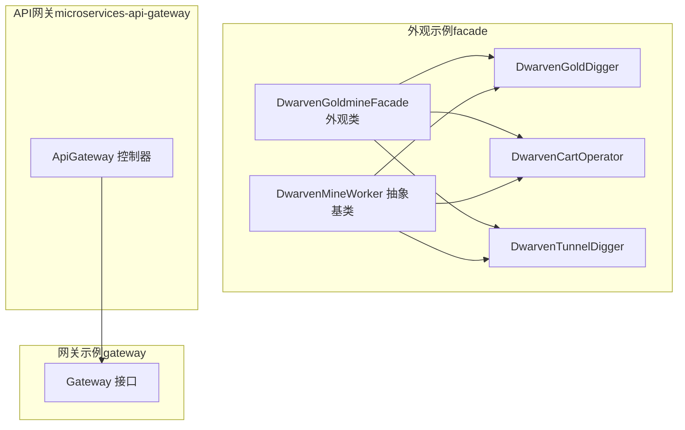
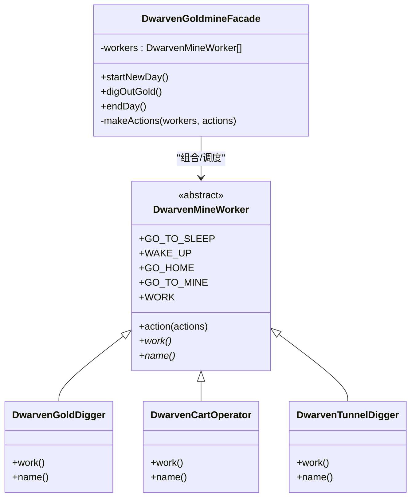
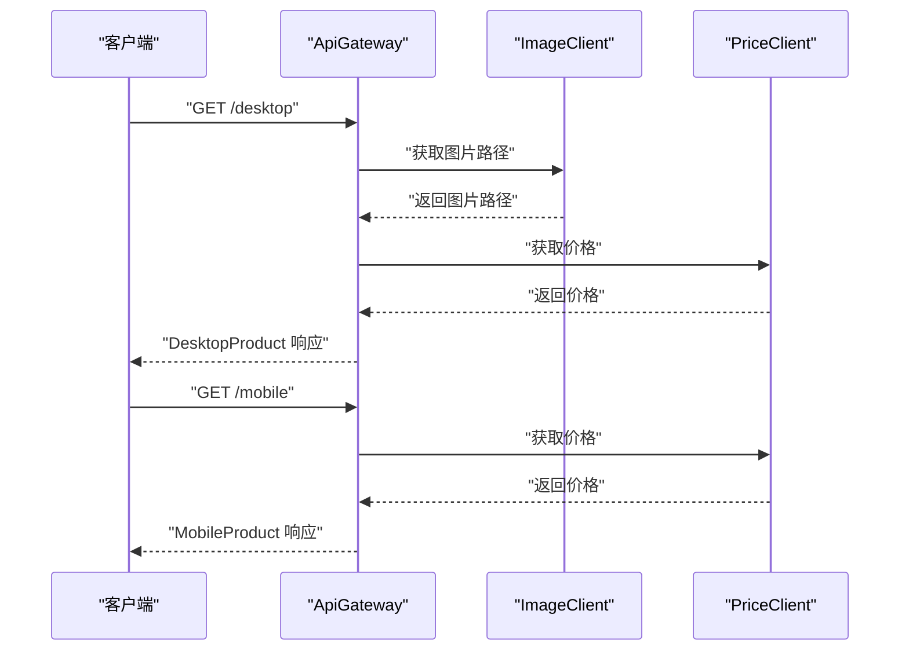
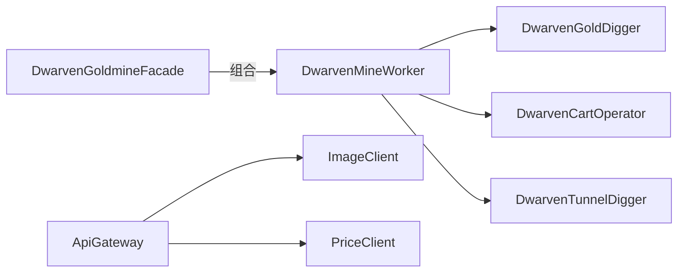

# Web外观模式

<cite>
**本文引用的文件**
- [DwarvenGoldmineFacade.java](file://facade/src/main/java/com/iluwatar/facade/DwarvenGoldmineFacade.java)
- [DwarvenMineWorker.java](file://facade/src/main/java/com/iluwatar/facade/DwarvenMineWorker.java)
- [DwarvenGoldDigger.java](file://facade/src/main/java/com/iluwatar/facade/DwarvenGoldDigger.java)
- [DwarvenCartOperator.java](file://facade/src/main/java/com/iluwatar/facade/DwarvenCartOperator.java)
- [DwarvenTunnelDigger.java](file://facade/src/main/java/com/iluwatar/facade/DwarvenTunnelDigger.java)
- [App.java](file://facade/src/main/java/com/iluwatar/facade/App.java)
- [DwarvenGoldmineFacadeTest.java](file://facade/src/test/java/com/iluwatar/facade/DwarvenGoldmineFacadeTest.java)
- [README.md（外观模式）](file://facade/README.md)
- [Gateway.java](file://gateway/src/main/java/com/iluwatar/gateway/Gateway.java)
- [ApiGateway.java](file://microservices-api-gateway/api-gateway-service/src/main/java/com/iluwatar/api/gateway/ApiGateway.java)
- [README.md（API网关）](file://microservices-api-gateway/README.md)
- [README.md（网关）](file://gateway/README.md)
- [BusinessDelegate.java](file://business-delegate/src/main/java/com/iluwatar/business/delegate/BusinessDelegate.java)
</cite>

## 目录
1. [引言](#引言)
2. [项目结构](#项目结构)
3. [核心组件](#核心组件)
4. [架构总览](#架构总览)
5. [详细组件分析](#详细组件分析)
6. [依赖关系分析](#依赖关系分析)
7. [性能考量](#性能考量)
8. [故障排查指南](#故障排查指南)
9. [结论](#结论)
10. [附录](#附录)

## 引言
本技术文档围绕外观模式在Web应用中的实践展开，以“矮人金矿外观”示例为主线，系统阐述外观模式如何为复杂子系统提供简化的统一接口；随后结合API网关、服务编排与第三方集成等Web常见场景，说明外观模式在微服务架构中的落地方式，并总结适用场景、潜在风险与设计决策要点。

## 项目结构
本仓库包含多个设计模式示例模块。本文聚焦以下与外观模式直接相关或可类比到Web外观实践的模块：
- facade：演示外观模式的经典示例，包含一个外观类与若干子系统Worker类。
- gateway：展示对外部服务的统一入口抽象，体现外观的“统一接口”思想。
- microservices-api-gateway：Spring Web MVC下的API网关示例，将多微服务聚合为面向客户端的统一接口。
- business-delegate：业务委托模式，强调在表现层与业务层之间引入“门面式”的协调者。

图表来源
- [DwarvenGoldmineFacade.java](file://facade/src/main/java/com/iluwatar/facade/DwarvenGoldmineFacade.java#L37-L69)
- [DwarvenMineWorker.java](file://facade/src/main/java/com/iluwatar/facade/DwarvenMineWorker.java#L34-L77)
- [DwarvenGoldDigger.java](file://facade/src/main/java/com/iluwatar/facade/DwarvenGoldDigger.java#L33-L44)
- [DwarvenCartOperator.java](file://facade/src/main/java/com/iluwatar/facade/DwarvenCartOperator.java#L33-L44)
- [DwarvenTunnelDigger.java](file://facade/src/main/java/com/iluwatar/facade/DwarvenTunnelDigger.java#L33-L44)
- [Gateway.java](file://gateway/src/main/java/com/iluwatar/gateway/Gateway.java#L30-L31)
- [ApiGateway.java](file://microservices-api-gateway/api-gateway-service/src/main/java/com/iluwatar/api/gateway/ApiGateway.java#L34-L67)

章节来源
- [README.md（外观模式）](file://facade/README.md#L18-L40)
- [README.md（网关）](file://gateway/README.md)
- [README.md（API网关）](file://microservices-api-gateway/README.md)

## 核心组件
- 外观类（DwarvenGoldmineFacade）
  - 职责：为金矿子系统提供统一入口，封装底层工人操作序列，屏蔽客户端对具体Worker的直接依赖。
  - 关键方法：开始新一天、挖掘黄金、结束一天；内部通过统一调度方法批量触发Action。
- 子系统Worker（DwarvenMineWorker及其子类）
  - 职责：定义通用动作（唤醒、去矿、工作、回家、睡觉），并由具体Worker实现各自的工作行为。
  - 具体Worker：金块挖掘工、矿车操作工、隧道挖掘工，分别承担不同职责。
- 应用入口（App）
  - 职责：演示客户端仅通过外观类完成完整的一天流程，无需关心内部细节。
- 测试（DwarvenGoldmineFacadeTest）
  - 职责：验证外观类在不同阶段触发的Worker动作序列是否符合预期。

章节来源
- [DwarvenGoldmineFacade.java](file://facade/src/main/java/com/iluwatar/facade/DwarvenGoldmineFacade.java#L37-L69)
- [DwarvenMineWorker.java](file://facade/src/main/java/com/iluwatar/facade/DwarvenMineWorker.java#L34-L77)
- [DwarvenGoldDigger.java](file://facade/src/main/java/com/iluwatar/facade/DwarvenGoldDigger.java#L33-L44)
- [DwarvenCartOperator.java](file://facade/src/main/java/com/iluwatar/facade/DwarvenCartOperator.java#L33-L44)
- [DwarvenTunnelDigger.java](file://facade/src/main/java/com/iluwatar/facade/DwarvenTunnelDigger.java#L33-L44)
- [App.java](file://facade/src/main/java/com/iluwatar/facade/App.java#L38-L51)
- [DwarvenGoldmineFacadeTest.java](file://facade/src/test/java/com/iluwatar/facade/DwarvenGoldmineFacadeTest.java#L65-L109)

## 架构总览
外观模式在本示例中的整体架构如下：
- 客户端仅与外观类交互；
- 外观类持有子系统Worker集合；
- 外观类根据业务阶段统一调度Worker执行对应动作；
- Worker抽象出通用生命周期动作，具体Worker实现差异化工作。

图表来源
- [DwarvenGoldmineFacade.java](file://facade/src/main/java/com/iluwatar/facade/DwarvenGoldmineFacade.java#L37-L69)
- [DwarvenMineWorker.java](file://facade/src/main/java/com/iluwatar/facade/DwarvenMineWorker.java#L34-L77)
- [DwarvenGoldDigger.java](file://facade/src/main/java/com/iluwatar/facade/DwarvenGoldDigger.java#L33-L44)
- [DwarvenCartOperator.java](file://facade/src/main/java/com/iluwatar/facade/DwarvenCartOperator.java#L33-L44)
- [DwarvenTunnelDigger.java](file://facade/src/main/java/com/iluwatar/facade/DwarvenTunnelDigger.java#L33-L44)

## 详细组件分析

### 外观类：DwarvenGoldmineFacade
- 设计要点
  - 将多个Worker封装在一个外观对象内，隐藏子系统复杂度；
  - 提供高层语义化方法（开始新一天、挖掘黄金、结束一天），降低客户端耦合；
  - 统一调度逻辑集中于私有辅助方法，便于扩展与维护。
- 扩展性
  - 可通过构造注入或工厂扩展Worker集合；
  - 若需新增阶段，可在外观类中添加新方法并复用统一调度机制。

章节来源
- [DwarvenGoldmineFacade.java](file://facade/src/main/java/com/iluwatar/facade/DwarvenGoldmineFacade.java#L44-L68)

### 抽象Worker与具体Worker
- DwarvenMineWorker
  - 定义通用动作枚举与动作分发逻辑；
  - 暴露抽象工作方法与名称方法，便于子类实现差异化职责。
- 具体Worker
  - 金块挖掘工：负责挖掘黄金；
  - 矿车操作工：负责将金块运出矿井；
  - 隧道挖掘工：负责开凿新的隧道。

章节来源
- [DwarvenMineWorker.java](file://facade/src/main/java/com/iluwatar/facade/DwarvenMineWorker.java#L34-L77)
- [DwarvenGoldDigger.java](file://facade/src/main/java/com/iluwatar/facade/DwarvenGoldDigger.java#L33-L44)
- [DwarvenCartOperator.java](file://facade/src/main/java/com/iluwatar/facade/DwarvenCartOperator.java#L33-L44)
- [DwarvenTunnelDigger.java](file://facade/src/main/java/com/iluwatar/facade/DwarvenTunnelDigger.java#L33-L44)

### 应用入口与测试
- App
  - 展示客户端仅通过外观类完成完整流程，体现“单一职责”与“低耦合”。
- 测试
  - 使用日志捕获验证外观类在不同阶段触发的动作序列，确保行为正确。

章节来源
- [App.java](file://facade/src/main/java/com/iluwatar/facade/App.java#L45-L50)
- [DwarvenGoldmineFacadeTest.java](file://facade/src/test/java/com/iluwatar/facade/DwarvenGoldmineFacadeTest.java#L65-L109)

### Web外观实践：API网关
- 角色映射
  - 外观类 ≈ API网关控制器：统一入口，聚合下游微服务；
  - 子系统Worker ≈ 各微服务客户端（图像、价格等）：按需调用并组装响应。
- 实现要点
  - API网关暴露面向客户端的端点（桌面端/移动端），内部组合多个微服务客户端；
  - 依据客户端类型裁剪所需字段，减少网络传输与前端处理负担；
  - 可扩展鉴权、限流、熔断等横切能力，统一在网关层处理。

图表来源
- [ApiGateway.java](file://microservices-api-gateway/api-gateway-service/src/main/java/com/iluwatar/api/gateway/ApiGateway.java#L48-L66)

章节来源
- [ApiGateway.java](file://microservices-api-gateway/api-gateway-service/src/main/java/com/iluwatar/api/gateway/ApiGateway.java#L34-L67)
- [README.md（API网关）](file://microservices-api-gateway/README.md)

### Web外观实践：外部服务网关
- 角色映射
  - 外观类 ≈ 网关接口实现：统一对外服务抽象；
  - 子系统 ≈ 多个外部服务（A/B/C）：通过网关进行访问与编排。
- 设计价值
  - 对外暴露稳定接口，内部可替换外部服务实现；
  - 统一错误处理与重试策略，提升客户端体验。

章节来源
- [Gateway.java](file://gateway/src/main/java/com/iluwatar/gateway/Gateway.java#L30-L31)
- [README.md（网关）](file://gateway/README.md)

### 与业务委托的关联
- 业务委托模式在表现层与业务层之间引入“门面式”的协调者，与外观模式在“简化接口、解耦客户端”方面理念一致；
- 在Web应用中，可将业务委托作为外观层的上层抽象，进一步封装业务流程。

章节来源
- [BusinessDelegate.java](file://business-delegate/src/main/java/com/iluwatar/business/delegate/BusinessDelegate.java#L32-L41)

## 依赖关系分析
- 外观类依赖Worker集合，Worker继承自抽象基类；
- API网关依赖各微服务客户端；
- 网关模块依赖外部服务接口抽象。

图表来源
- [DwarvenGoldmineFacade.java](file://facade/src/main/java/com/iluwatar/facade/DwarvenGoldmineFacade.java#L39-L48)
- [DwarvenMineWorker.java](file://facade/src/main/java/com/iluwatar/facade/DwarvenMineWorker.java#L34-L77)
- [DwarvenGoldDigger.java](file://facade/src/main/java/com/iluwatar/facade/DwarvenGoldDigger.java#L33-L44)
- [DwarvenCartOperator.java](file://facade/src/main/java/com/iluwatar/facade/DwarvenCartOperator.java#L33-L44)
- [DwarvenTunnelDigger.java](file://facade/src/main/java/com/iluwatar/facade/DwarvenTunnelDigger.java#L33-L44)
- [ApiGateway.java](file://microservices-api-gateway/api-gateway-service/src/main/java/com/iluwatar/api/gateway/ApiGateway.java#L37-L41)

章节来源
- [DwarvenGoldmineFacade.java](file://facade/src/main/java/com/iluwatar/facade/DwarvenGoldmineFacade.java#L37-L69)
- [ApiGateway.java](file://microservices-api-gateway/api-gateway-service/src/main/java/com/iluwatar/api/gateway/ApiGateway.java#L34-L67)

## 性能考量
- 调度开销
  - 外观类统一调度Worker时采用集合遍历，时间复杂度为O(n)，n为Worker数量；通常规模较小，影响有限。
- 并发与线程安全
  - Worker动作当前为无状态日志输出，若后续引入共享资源，需考虑同步与隔离。
- 微服务网关
  - 并行调用多个微服务客户端可缩短总延迟；但需注意超时、熔断与降级策略，避免级联故障。

## 故障排查指南
- 行为验证
  - 使用测试用例验证外观类在不同阶段触发的动作序列是否符合预期。
- 日志定位
  - 通过日志消息确认每个Worker在何时执行何种动作，快速定位异常Worker或未触发动作。
- 常见问题
  - 动作未生效：检查外观类是否正确传入动作参数，以及Worker动作分发逻辑是否覆盖该动作。
  - 新增Worker未生效：确认外观类是否已将其纳入调度集合。

章节来源
- [DwarvenGoldmineFacadeTest.java](file://facade/src/test/java/com/iluwatar/facade/DwarvenGoldmineFacadeTest.java#L65-L109)

## 结论
外观模式通过“统一接口+子系统编排”，显著降低了客户端与复杂子系统的耦合度。在Web应用中，API网关、服务编排与第三方集成均可借鉴外观模式的思想：以单一入口聚合多后端能力，屏蔽实现细节，提升可维护性与可扩展性。同时需警惕“上帝对象”风险，合理拆分职责边界，配合横切关注点（鉴权、限流、熔断）形成稳健的外观层。

## 附录
- 适用场景
  - 需要为复杂子系统提供简单统一入口；
  - 子系统日益复杂且客户端只需部分功能；
  - 需要分层抽象，定义每层的入口。
- 潜在风险
  - 外观类膨胀为“上帝对象”；
  - 过度封装导致调试困难与灵活性下降。
- 设计决策建议
  - 明确外观职责边界，避免承载过多业务逻辑；
  - 保持外观与子系统松耦合，优先组合而非继承；
  - 在Web外观层统一接入横切能力（认证、限流、监控、熔断）。

章节来源
- [README.md（外观模式）](file://facade/README.md#L202-L236)
- [README.md（API网关）](file://microservices-api-gateway/README.md)
- [README.md（网关）](file://gateway/README.md)