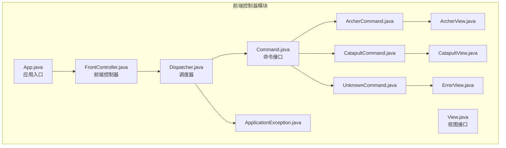
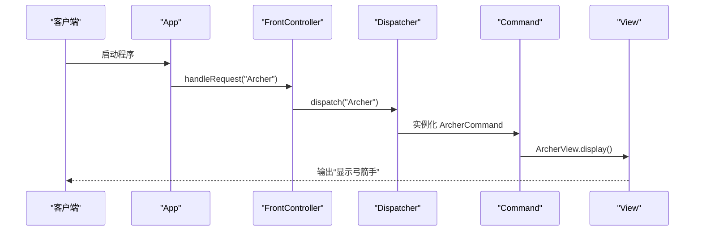
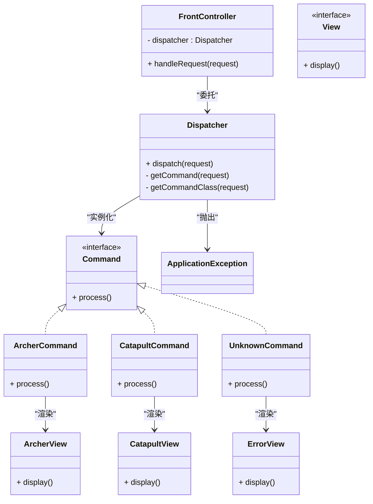
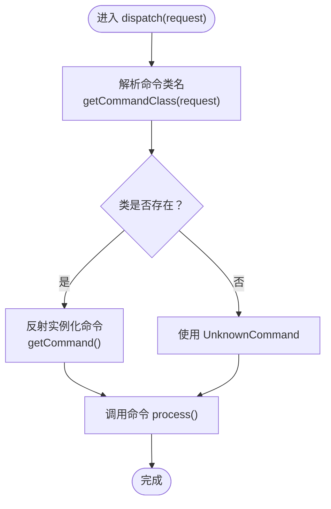
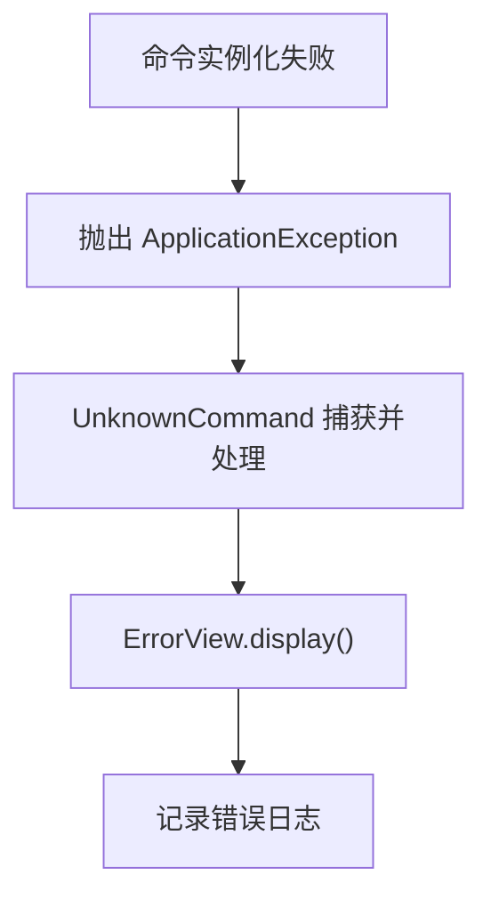
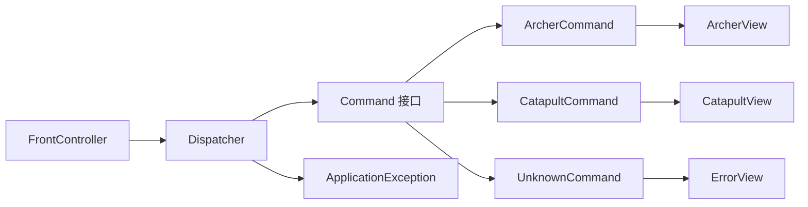

# 前端控制器模式

<cite>
**本文引用的文件**
- [App.java](file://front-controller/src/main/java/com/iluwatar/front/controller/App.java)
- [FrontController.java](file://front-controller/src/main/java/com/iluwatar/front/controller/FrontController.java)
- [Dispatcher.java](file://front-controller/src/main/java/com/iluwatar/front/controller/Dispatcher.java)
- [Command.java](file://front-controller/src/main/java/com/iluwatar/front/controller/Command.java)
- [View.java](file://front-controller/src/main/java/com/iluwatar/front/controller/View.java)
- [ArcherCommand.java](file://front-controller/src/main/java/com/iluwatar/front/controller/ArcherCommand.java)
- [CatapultCommand.java](file://front-controller/src/main/java/com/iluwatar/front/controller/CatapultCommand.java)
- [UnknownCommand.java](file://front-controller/src/main/java/com/iluwatar/front/controller/UnknownCommand.java)
- [ArcherView.java](file://front-controller/src/main/java/com/iluwatar/front/controller/ArcherView.java)
- [CatapultView.java](file://front-controller/src/main/java/com/iluwatar/front/controller/CatapultView.java)
- [ErrorView.java](file://front-controller/src/main/java/com/iluwatar/front/controller/ErrorView.java)
- [ApplicationException.java](file://front-controller/src/main/java/com/iluwatar/front/controller/ApplicationException.java)
</cite>

## 目录
1. [引言](#引言)
2. [项目结构](#项目结构)
3. [核心组件](#核心组件)
4. [架构总览](#架构总览)
5. [详细组件分析](#详细组件分析)
6. [依赖关系分析](#依赖关系分析)
7. [性能考量](#性能考量)
8. [故障排查指南](#故障排查指南)
9. [结论](#结论)
10. [附录：实现示例与最佳实践](#附录实现示例与最佳实践)

## 引言
前端控制器模式是一种表现层设计模式，通过单一入口集中处理所有请求，实现横切关注点（如鉴权、日志、路由）的一致性处理，并将请求映射到对应的业务命令与视图渲染。本仓库以最小可运行示例展示了该模式的关键构件：应用入口、前端控制器、调度器、命令接口与具体命令、视图接口与具体视图，以及异常处理。

## 项目结构
该模块采用按职责分层的包组织方式，核心位于 com.iluwatar.front.controller 包内，包含以下关键文件：
- 入口类：App.java
- 控制层：FrontController.java
- 调度层：Dispatcher.java
- 业务命令与视图：Command.java、View.java 及其实现（ArcherCommand、CatapultCommand、UnknownCommand；ArcherView、CatapultView、ErrorView）
- 异常：ApplicationException.java

图表来源
- [App.java](file://front-controller/src/main/java/com/iluwatar/front/controller/App.java#L50-L55)
- [FrontController.java](file://front-controller/src/main/java/com/iluwatar/front/controller/FrontController.java#L40-L42)
- [Dispatcher.java](file://front-controller/src/main/java/com/iluwatar/front/controller/Dispatcher.java#L39-L42)
- [Command.java](file://front-controller/src/main/java/com/iluwatar/front/controller/Command.java#L30-L33)
- [View.java](file://front-controller/src/main/java/com/iluwatar/front/controller/View.java#L30-L33)
- [ArcherCommand.java](file://front-controller/src/main/java/com/iluwatar/front/controller/ArcherCommand.java#L30-L36)
- [CatapultCommand.java](file://front-controller/src/main/java/com/iluwatar/front/controller/CatapultCommand.java#L30-L36)
- [UnknownCommand.java](file://front-controller/src/main/java/com/iluwatar/front/controller/UnknownCommand.java#L30-L36)
- [ArcherView.java](file://front-controller/src/main/java/com/iluwatar/front/controller/ArcherView.java#L33-L39)
- [CatapultView.java](file://front-controller/src/main/java/com/iluwatar/front/controller/CatapultView.java#L33-L39)
- [ErrorView.java](file://front-controller/src/main/java/com/iluwatar/front/controller/ErrorView.java#L33-L39)
- [ApplicationException.java](file://front-controller/src/main/java/com/iluwatar/front/controller/ApplicationException.java#L32-L40)

章节来源
- [App.java](file://front-controller/src/main/java/com/iluwatar/front/controller/App.java#L43-L56)
- [FrontController.java](file://front-controller/src/main/java/com/iluwatar/front/controller/FrontController.java#L32-L43)
- [Dispatcher.java](file://front-controller/src/main/java/com/iluwatar/front/controller/Dispatcher.java#L32-L72)
- [Command.java](file://front-controller/src/main/java/com/iluwatar/front/controller/Command.java#L27-L34)
- [View.java](file://front-controller/src/main/java/com/iluwatar/front/controller/View.java#L27-L34)
- [ArcherCommand.java](file://front-controller/src/main/java/com/iluwatar/front/controller/ArcherCommand.java#L27-L37)
- [CatapultCommand.java](file://front-controller/src/main/java/com/iluwatar/front/controller/CatapultCommand.java#L27-L37)
- [UnknownCommand.java](file://front-controller/src/main/java/com/iluwatar/front/controller/UnknownCommand.java#L27-L37)
- [ArcherView.java](file://front-controller/src/main/java/com/iluwatar/front/controller/ArcherView.java#L27-L40)
- [CatapultView.java](file://front-controller/src/main/java/com/iluwatar/front/controller/CatapultView.java#L27-L40)
- [ErrorView.java](file://front-controller/src/main/java/com/iluwatar/front/controller/ErrorView.java#L27-L40)
- [ApplicationException.java](file://front-controller/src/main/java/com/iluwatar/front/controller/ApplicationException.java#L29-L41)

## 核心组件
- 应用入口 App：演示如何通过 FrontController 统一处理不同请求类型，并触发对应视图输出。
- 前端控制器 FrontController：对外暴露统一的请求入口，内部委托给调度器进行分发。
- 调度器 Dispatcher：根据请求字符串解析出命令类名并实例化命令，调用其 process 方法执行业务逻辑。
- 命令 Command：定义统一的处理契约，具体命令负责选择并显示相应视图。
- 视图 View：定义统一的渲染契约，ArcherView、CatapultView、ErrorView 实现具体展示。
- 默认命令 UnknownCommand：当请求无法映射到已知命令时，统一转交错误视图。
- 自定义异常 ApplicationException：封装调度过程中反射实例化的异常。

章节来源
- [App.java](file://front-controller/src/main/java/com/iluwatar/front/controller/App.java#L45-L55)
- [FrontController.java](file://front-controller/src/main/java/com/iluwatar/front/controller/FrontController.java#L32-L43)
- [Dispatcher.java](file://front-controller/src/main/java/com/iluwatar/front/controller/Dispatcher.java#L32-L72)
- [Command.java](file://front-controller/src/main/java/com/iluwatar/front/controller/Command.java#L27-L34)
- [View.java](file://front-controller/src/main/java/com/iluwatar/front/controller/View.java#L27-L34)
- [UnknownCommand.java](file://front-controller/src/main/java/com/iluwatar/front/controller/UnknownCommand.java#L27-L37)
- [ApplicationException.java](file://front-controller/src/main/java/com/iluwatar/front/controller/ApplicationException.java#L29-L41)

## 架构总览
下图展示了从应用入口到视图渲染的完整调用链路，体现“集中式入口 + 命令分发 + 视图渲染”的前端控制器架构。

图表来源
- [App.java](file://front-controller/src/main/java/com/iluwatar/front/controller/App.java#L50-L55)
- [FrontController.java](file://front-controller/src/main/java/com/iluwatar/front/controller/FrontController.java#L40-L42)
- [Dispatcher.java](file://front-controller/src/main/java/com/iluwatar/front/controller/Dispatcher.java#L39-L42)
- [ArcherCommand.java](file://front-controller/src/main/java/com/iluwatar/front/controller/ArcherCommand.java#L30-L36)
- [ArcherView.java](file://front-controller/src/main/java/com/iluwatar/front/controller/ArcherView.java#L33-L39)

## 详细组件分析

### 类关系与职责
- FrontController：持有 Dispatcher 并对外提供 handleRequest 接口，实现集中化入口。
- Dispatcher：负责命令解析与实例化，捕获反射异常并抛出自定义异常。
- Command：命令处理契约，ArcherCommand、CatapultCommand、UnknownCommand 分别绑定不同视图。
- View：视图渲染契约，ArcherView、CatapultView、ErrorView 实现具体输出。
- ApplicationException：包装调度期异常，便于上层统一处理。

图表来源
- [FrontController.java](file://front-controller/src/main/java/com/iluwatar/front/controller/FrontController.java#L32-L43)
- [Dispatcher.java](file://front-controller/src/main/java/com/iluwatar/front/controller/Dispatcher.java#L32-L72)
- [Command.java](file://front-controller/src/main/java/com/iluwatar/front/controller/Command.java#L27-L34)
- [View.java](file://front-controller/src/main/java/com/iluwatar/front/controller/View.java#L27-L34)
- [ArcherCommand.java](file://front-controller/src/main/java/com/iluwatar/front/controller/ArcherCommand.java#L27-L37)
- [CatapultCommand.java](file://front-controller/src/main/java/com/iluwatar/front/controller/CatapultCommand.java#L27-L37)
- [UnknownCommand.java](file://front-controller/src/main/java/com/iluwatar/front/controller/UnknownCommand.java#L27-L37)
- [ArcherView.java](file://front-controller/src/main/java/com/iluwatar/front/controller/ArcherView.java#L27-L40)
- [CatapultView.java](file://front-controller/src/main/java/com/iluwatar/front/controller/CatapultView.java#L27-L40)
- [ErrorView.java](file://front-controller/src/main/java/com/iluwatar/front/controller/ErrorView.java#L27-L40)
- [ApplicationException.java](file://front-controller/src/main/java/com/iluwatar/front/controller/ApplicationException.java#L29-L41)

章节来源
- [FrontController.java](file://front-controller/src/main/java/com/iluwatar/front/controller/FrontController.java#L32-L43)
- [Dispatcher.java](file://front-controller/src/main/java/com/iluwatar/front/controller/Dispatcher.java#L32-L72)
- [Command.java](file://front-controller/src/main/java/com/iluwatar/front/controller/Command.java#L27-L34)
- [View.java](file://front-controller/src/main/java/com/iluwatar/front/controller/View.java#L27-L34)
- [ArcherCommand.java](file://front-controller/src/main/java/com/iluwatar/front/controller/ArcherCommand.java#L27-L37)
- [CatapultCommand.java](file://front-controller/src/main/java/com/iluwatar/front/controller/CatapultCommand.java#L27-L37)
- [UnknownCommand.java](file://front-controller/src/main/java/com/iluwatar/front/controller/UnknownCommand.java#L27-L37)
- [ArcherView.java](file://front-controller/src/main/java/com/iluwatar/front/controller/ArcherView.java#L27-L40)
- [CatapultView.java](file://front-controller/src/main/java/com/iluwatar/front/controller/CatapultView.java#L27-L40)
- [ErrorView.java](file://front-controller/src/main/java/com/iluwatar/front/controller/ErrorView.java#L27-L40)
- [ApplicationException.java](file://front-controller/src/main/java/com/iluwatar/front/controller/ApplicationException.java#L29-L41)

### 请求分发流程（Dispatcher）
调度器根据请求字符串动态定位命令类名并实例化，若找不到则回退到 UnknownCommand。该流程体现了“约定优于配置”的思想：请求名与命令类名存在直接映射关系。

图表来源
- [Dispatcher.java](file://front-controller/src/main/java/com/iluwatar/front/controller/Dispatcher.java#L39-L71)

章节来源
- [Dispatcher.java](file://front-controller/src/main/java/com/iluwatar/front/controller/Dispatcher.java#L39-L71)

### 错误处理与回退
当命令类不存在或实例化失败时，调度器抛出自定义异常；默认命令 UnknownCommand 将统一渲染错误视图，确保错误场景的一致性。

图表来源
- [Dispatcher.java](file://front-controller/src/main/java/com/iluwatar/front/controller/Dispatcher.java#L52-L57)
- [UnknownCommand.java](file://front-controller/src/main/java/com/iluwatar/front/controller/UnknownCommand.java#L30-L36)
- [ErrorView.java](file://front-controller/src/main/java/com/iluwatar/front/controller/ErrorView.java#L33-L39)
- [ApplicationException.java](file://front-controller/src/main/java/com/iluwatar/front/controller/ApplicationException.java#L32-L40)

章节来源
- [Dispatcher.java](file://front-controller/src/main/java/com/iluwatar/front/controller/Dispatcher.java#L52-L57)
- [UnknownCommand.java](file://front-controller/src/main/java/com/iluwatar/front/controller/UnknownCommand.java#L30-L36)
- [ErrorView.java](file://front-controller/src/main/java/com/iluwatar/front/controller/ErrorView.java#L33-L39)
- [ApplicationException.java](file://front-controller/src/main/java/com/iluwatar/front/controller/ApplicationException.java#L32-L40)

## 依赖关系分析
- 耦合与内聚
  - FrontController 仅依赖 Dispatcher，保持高内聚、低耦合。
  - Dispatcher 依赖命令类名约定与反射机制，边界清晰但存在运行时依赖。
  - 命令与视图通过接口解耦，新增命令/视图只需遵循契约即可。
- 外部依赖
  - 使用 Java 反射进行命令类加载，需确保类路径正确与可见性。
  - 日志框架用于视图输出，便于调试与生产观测。

图表来源
- [FrontController.java](file://front-controller/src/main/java/com/iluwatar/front/controller/FrontController.java#L32-L43)
- [Dispatcher.java](file://front-controller/src/main/java/com/iluwatar/front/controller/Dispatcher.java#L32-L72)
- [Command.java](file://front-controller/src/main/java/com/iluwatar/front/controller/Command.java#L27-L34)
- [View.java](file://front-controller/src/main/java/com/iluwatar/front/controller/View.java#L27-L34)
- [ArcherCommand.java](file://front-controller/src/main/java/com/iluwatar/front/controller/ArcherCommand.java#L27-L37)
- [CatapultCommand.java](file://front-controller/src/main/java/com/iluwatar/front/controller/CatapultCommand.java#L27-L37)
- [UnknownCommand.java](file://front-controller/src/main/java/com/iluwatar/front/controller/UnknownCommand.java#L27-L37)
- [ArcherView.java](file://front-controller/src/main/java/com/iluwatar/front/controller/ArcherView.java#L27-L40)
- [CatapultView.java](file://front-controller/src/main/java/com/iluwatar/front/controller/CatapultView.java#L27-L40)
- [ErrorView.java](file://front-controller/src/main/java/com/iluwatar/front/controller/ErrorView.java#L27-L40)
- [ApplicationException.java](file://front-controller/src/main/java/com/iluwatar/front/controller/ApplicationException.java#L29-L41)

章节来源
- [FrontController.java](file://front-controller/src/main/java/com/iluwatar/front/controller/FrontController.java#L32-L43)
- [Dispatcher.java](file://front-controller/src/main/java/com/iluwatar/front/controller/Dispatcher.java#L32-L72)
- [Command.java](file://front-controller/src/main/java/com/iluwatar/front/controller/Command.java#L27-L34)
- [View.java](file://front-controller/src/main/java/com/iluwatar/front/controller/View.java#L27-L34)
- [ArcherCommand.java](file://front-controller/src/main/java/com/iluwatar/front/controller/ArcherCommand.java#L27-L37)
- [CatapultCommand.java](file://front-controller/src/main/java/com/iluwatar/front/controller/CatapultCommand.java#L27-L37)
- [UnknownCommand.java](file://front-controller/src/main/java/com/iluwatar/front/controller/UnknownCommand.java#L27-L37)
- [ArcherView.java](file://front-controller/src/main/java/com/iluwatar/front/controller/ArcherView.java#L27-L40)
- [CatapultView.java](file://front-controller/src/main/java/com/iluwatar/front/controller/CatapultView.java#L27-L40)
- [ErrorView.java](file://front-controller/src/main/java/com/iluwatar/front/controller/ErrorView.java#L27-L40)
- [ApplicationException.java](file://front-controller/src/main/java/com/iluwatar/front/controller/ApplicationException.java#L29-L41)

## 性能考量
- 反射开销：命令实例化依赖反射，频繁请求可能带来额外开销。建议在生产环境中引入缓存策略（例如缓存命令类与实例），减少重复反射调用。
- 类加载成本：首次加载命令类会触发类加载与初始化，可通过预热或懒加载结合的方式平衡启动时间与运行时性能。
- 线程安全：当前实现未显式同步，若共享状态存在于命令或视图中，需确保线程安全或使用无状态设计。
- 路由复杂度：请求到命令的映射为 O(1) 字符串拼接与类加载，扩展新命令时需保证命名规范与类路径一致，避免映射歧义。

## 故障排查指南
- 命令类未找到
  - 现象：出现自定义异常并最终渲染错误视图。
  - 排查：确认请求名与命令类名是否符合“请求名 + Command”约定；检查类路径与可见性。
  - 参考
    - [Dispatcher.java](file://front-controller/src/main/java/com/iluwatar/front/controller/Dispatcher.java#L65-L71)
    - [ApplicationException.java](file://front-controller/src/main/java/com/iluwatar/front/controller/ApplicationException.java#L32-L40)
- 命令实例化失败
  - 现象：反射构造失败，抛出自定义异常。
  - 排查：确认命令类具备无参构造函数且可见；检查依赖注入与静态初始化是否阻塞。
  - 参考
    - [Dispatcher.java](file://front-controller/src/main/java/com/iluwatar/front/controller/Dispatcher.java#L52-L57)
- 视图未输出预期内容
  - 现象：日志未打印或输出不符合预期。
  - 排查：确认视图实现是否覆盖 display；检查日志框架配置与级别。
  - 参考
    - [ArcherView.java](file://front-controller/src/main/java/com/iluwatar/front/controller/ArcherView.java#L33-L39)
    - [CatapultView.java](file://front-controller/src/main/java/com/iluwatar/front/controller/CatapultView.java#L33-L39)
    - [ErrorView.java](file://front-controller/src/main/java/com/iluwatar/front/controller/ErrorView.java#L33-L39)

章节来源
- [Dispatcher.java](file://front-controller/src/main/java/com/iluwatar/front/controller/Dispatcher.java#L52-L71)
- [ApplicationException.java](file://front-controller/src/main/java/com/iluwatar/front/controller/ApplicationException.java#L32-L40)
- [ArcherView.java](file://front-controller/src/main/java/com/iluwatar/front/controller/ArcherView.java#L33-L39)
- [CatapultView.java](file://front-controller/src/main/java/com/iluwatar/front/controller/CatapultView.java#L33-L39)
- [ErrorView.java](file://front-controller/src/main/java/com/iluwatar/front/controller/ErrorView.java#L33-L39)

## 结论
前端控制器模式通过集中式入口与命令分发，实现了请求处理的统一与可扩展。在本示例中，FrontController 作为唯一入口，Dispatcher 负责路由与命令实例化，Command/View 遵循契约实现解耦。该模式适合需要统一处理横切关注点与快速扩展页面/功能的场景。实际工程中应关注反射性能、类加载策略与线程安全，并建立完善的错误回退与监控体系。

## 附录：实现示例与最佳实践
- 实现要点
  - 入口统一：在应用入口仅调用 FrontController 的统一方法，避免分散处理。
  - 命令契约：所有业务命令实现统一的处理接口，确保调度器可一致地调用。
  - 视图契约：所有视图实现统一的渲染接口，便于替换与扩展。
  - 错误回退：未知请求统一映射到默认命令与错误视图，保证用户体验与可观测性。
- 最佳实践
  - 命名与路径：严格遵守“请求名 + Command”的类命名约定，确保调度器可正确解析。
  - 缓存策略：对常用命令类与实例进行缓存，降低反射与类加载开销。
  - 线程安全：避免在命令/视图中维护可变共享状态，必要时使用不可变对象或本地化数据。
  - 日志与监控：在视图与命令中埋点日志，结合异常监控，提升可观测性。
  - 测试覆盖：为调度器的类解析与异常分支编写单元测试，保障稳定性。

章节来源
- [App.java](file://front-controller/src/main/java/com/iluwatar/front/controller/App.java#L50-L55)
- [FrontController.java](file://front-controller/src/main/java/com/iluwatar/front/controller/FrontController.java#L40-L42)
- [Dispatcher.java](file://front-controller/src/main/java/com/iluwatar/front/controller/Dispatcher.java#L39-L71)
- [Command.java](file://front-controller/src/main/java/com/iluwatar/front/controller/Command.java#L30-L33)
- [View.java](file://front-controller/src/main/java/com/iluwatar/front/controller/View.java#L30-L33)
- [ArcherCommand.java](file://front-controller/src/main/java/com/iluwatar/front/controller/ArcherCommand.java#L30-L36)
- [CatapultCommand.java](file://front-controller/src/main/java/com/iluwatar/front/controller/CatapultCommand.java#L30-L36)
- [UnknownCommand.java](file://front-controller/src/main/java/com/iluwatar/front/controller/UnknownCommand.java#L30-L36)
- [ArcherView.java](file://front-controller/src/main/java/com/iluwatar/front/controller/ArcherView.java#L33-L39)
- [CatapultView.java](file://front-controller/src/main/java/com/iluwatar/front/controller/CatapultView.java#L33-L39)
- [ErrorView.java](file://front-controller/src/main/java/com/iluwatar/front/controller/ErrorView.java#L33-L39)
- [ApplicationException.java](file://front-controller/src/main/java/com/iluwatar/front/controller/ApplicationException.java#L32-L40)