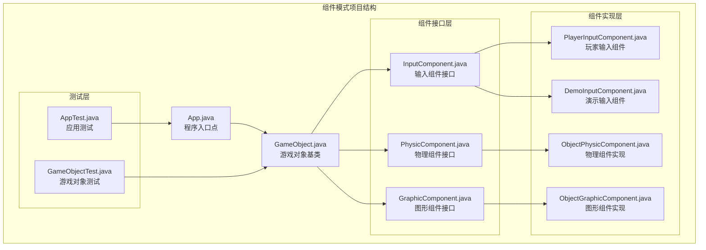
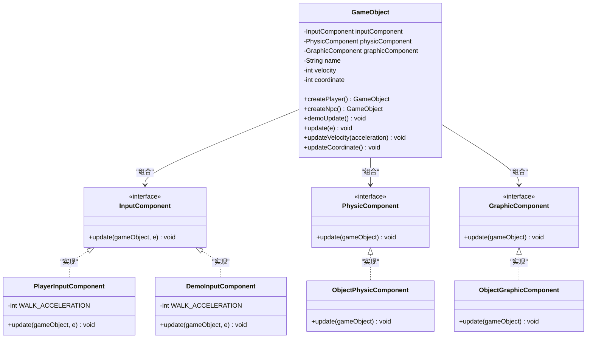
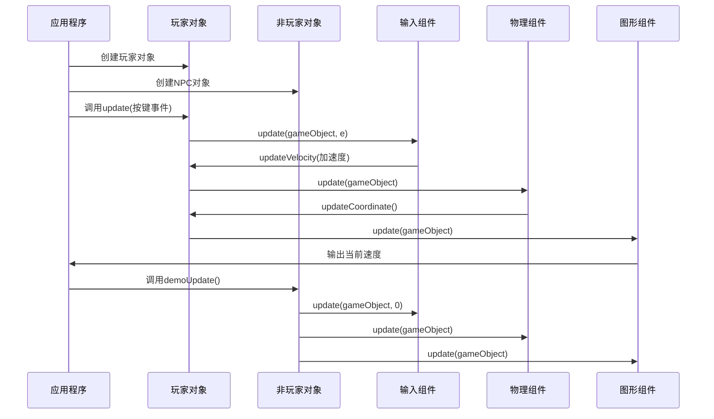
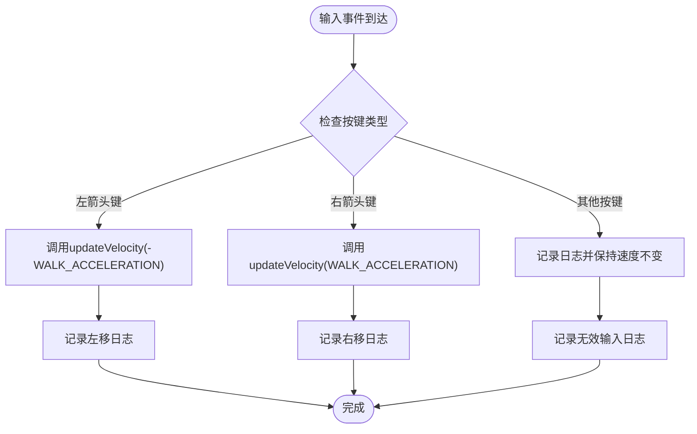
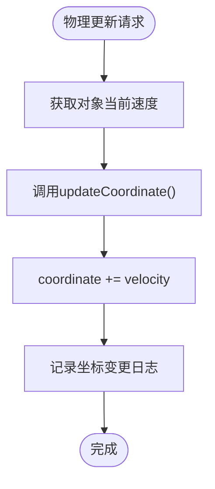
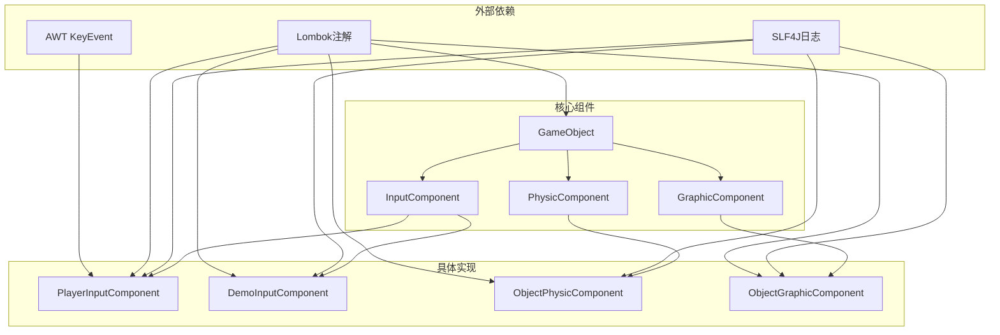

# 组件模式

<cite>
**本文档引用的文件**
- [App.java](file://component/src/main/java/com/iluwatar/component/App.java)
- [GameObject.java](file://component/src/main/java/com/iluwatar/component/GameObject.java)
- [InputComponent.java](file://component/src/main/java/com/iluwatar/component/component/inputcomponent/InputComponent.java)
- [PhysicComponent.java](file://component/src/main/java/com/iluwatar/component/component/physiccomponent/PhysicComponent.java)
- [GraphicComponent.java](file://component/src/main/java/com/iluwatar/component/component/graphiccomponent/GraphicComponent.java)
- [PlayerInputComponent.java](file://component/src/main/java/com/iluwatar/component/component/inputcomponent/PlayerInputComponent.java)
- [DemoInputComponent.java](file://component/src/main/java/com/iluwatar/component/component/inputcomponent/DemoInputComponent.java)
- [ObjectPhysicComponent.java](file://component/src/main/java/com/iluwatar/component/component/physiccomponent/ObjectPhysicComponent.java)
- [ObjectGraphicComponent.java](file://component/src/main/java/com/iluwatar/component/component/graphiccomponent/ObjectGraphicComponent.java)
- [AppTest.java](file://component/src/test/java/com/iluwatar/component/AppTest.java)
- [GameObjectTest.java](file://component/src/test/java/com/iluwatar/component/GameObjectTest.java)
- [README.md](file://component/README.md)
</cite>

## 目录
1. [引言](#引言)
2. [项目结构](#项目结构)
3. [核心组件](#核心组件)
4. [架构概览](#架构概览)
5. [详细组件分析](#详细组件分析)
6. [依赖关系分析](#依赖关系分析)
7. [性能考虑](#性能考虑)
8. [故障排除指南](#故障排除指南)
9. [结论](#结论)
10. [最佳实践](#最佳实践)

## 引言

组件模式（Component Pattern）是游戏开发和复杂系统设计中的重要设计模式。该模式通过将对象的功能分解为独立的、可重用的组件，实现了高度的模块化和灵活性。在本项目中，我们展示了如何使用组件模式构建游戏对象，其中GameObject作为实体容器，通过组合不同的组件（输入、物理、图形）来实现多样化的行为。

组件模式的核心思想是将对象的状态和行为分离到独立的组件中，每个组件负责特定的功能领域。这种设计消除了传统继承层次结构中的代码重复，提供了动态的行为组合能力。

## 项目结构

组件模式项目采用清晰的分层结构，按照功能域组织代码：

**图表来源**
- [App.java](file://component/src/main/java/com/iluwatar/component/App.java#L30-L62)
- [GameObject.java](file://component/src/main/java/com/iluwatar/component/GameObject.java#L37-L118)

**章节来源**
- [App.java](file://component/src/main/java/com/iluwatar/component/App.java#L1-L63)
- [GameObject.java](file://component/src/main/java/com/iluwatar/component/GameObject.java#L1-L119)

## 核心组件

组件模式的核心由三个主要组件构成：输入组件、物理组件和图形组件。每个组件都定义了特定的接口，并有相应的实现类。

### 组件接口设计

组件接口采用最小化设计原则，只定义必要的方法签名：

**图表来源**
- [GameObject.java](file://component/src/main/java/com/iluwatar/component/GameObject.java#L41-L118)
- [InputComponent.java](file://component/src/main/java/com/iluwatar/component/component/inputcomponent/InputComponent.java#L29-L34)
- [PhysicComponent.java](file://component/src/main/java/com/iluwatar/component/component/physiccomponent/PhysicComponent.java#L29-L34)
- [GraphicComponent.java](file://component/src/main/java/com/iluwatar/component/component/graphiccomponent/GraphicComponent.java#L29-L34)

### 游戏对象管理

GameObject类作为组件容器，负责协调各个组件的生命周期和交互：

**章节来源**
- [GameObject.java](file://component/src/main/java/com/iluwatar/component/GameObject.java#L41-L118)

## 架构概览

组件模式的架构体现了松耦合和高内聚的设计原则：

**图表来源**
- [App.java](file://component/src/main/java/com/iluwatar/component/App.java#L52-L61)
- [GameObject.java](file://component/src/main/java/com/iluwatar/component/GameObject.java#L96-L100)

## 详细组件分析

### 输入组件系统

输入组件负责处理用户输入并更新游戏对象的状态。系统提供了两种不同的输入处理策略：

#### 玩家输入组件

PlayerInputComponent专门处理键盘输入事件，支持左右移动控制：

**图表来源**
- [PlayerInputComponent.java](file://component/src/main/java/com/iluwatar/component/component/inputcomponent/PlayerInputComponent.java#L46-L61)

#### 演示输入组件

DemoInputComponent用于非活动状态下的自动控制，提供简单的自动移动逻辑：

**章节来源**
- [PlayerInputComponent.java](file://component/src/main/java/com/iluwatar/component/component/inputcomponent/PlayerInputComponent.java#L31-L62)
- [DemoInputComponent.java](file://component/src/main/java/com/iluwatar/component/component/inputcomponent/DemoInputComponent.java#L30-L52)

### 物理组件系统

ObjectPhysicComponent负责基于速度更新对象的坐标位置：

**图表来源**
- [ObjectPhysicComponent.java](file://component/src/main/java/com/iluwatar/component/component/physiccomponent/ObjectPhysicComponent.java#L41-L45)

**章节来源**
- [ObjectPhysicComponent.java](file://component/src/main/java/com/iluwatar/component/component/physiccomponent/ObjectPhysicComponent.java#L30-L46)

### 图形组件系统

ObjectGraphicComponent负责显示对象的当前状态信息：

**章节来源**
- [ObjectGraphicComponent.java](file://component/src/main/java/com/iluwatar/component/component/graphiccomponent/ObjectGraphicComponent.java#L30-L45)

## 依赖关系分析

组件模式的依赖关系体现了清晰的层次结构：

**图表来源**
- [GameObject.java](file://component/src/main/java/com/iluwatar/component/GameObject.java#L27-L36)
- [PlayerInputComponent.java](file://component/src/main/java/com/iluwatar/component/component/inputcomponent/PlayerInputComponent.java#L27-L29)

**章节来源**
- [GameObject.java](file://component/src/main/java/com/iluwatar/component/GameObject.java#L27-L36)
- [PlayerInputComponent.java](file://component/src/main/java/com/iluwatar/component/component/inputcomponent/PlayerInputComponent.java#L27-L29)

## 性能考虑

组件模式在性能方面具有以下特点：

### 内存效率

- **组件共享**：相同类型的组件可以在多个对象间共享实例
- **零开销抽象**：接口调用的开销相对较小
- **局部性优化**：相关组件的数据可以存储在一起

### 运行时性能

- **函数调用开销**：组件间的间接调用会增加少量开销
- **分支预测**：switch语句在输入组件中可能影响性能
- **日志输出**：调试日志在生产环境中应谨慎使用

### 优化建议

1. **批量更新**：在游戏循环中批量更新所有对象的组件
2. **缓存机制**：缓存频繁访问的对象状态
3. **延迟初始化**：按需创建和初始化组件
4. **内存池**：对临时对象使用对象池减少GC压力

## 故障排除指南

### 常见问题及解决方案

#### 组件未正确更新

**症状**：对象状态不随时间变化
**原因**：物理组件未被调用或坐标更新逻辑错误
**解决**：检查GameObject.update()方法中的组件调用顺序

#### 输入响应异常

**症状**：按键无响应或响应错误
**原因**：输入组件的事件处理逻辑问题
**解决**：验证KeyEvent常量的正确性和switch语句的完整性

#### 性能问题

**症状**：游戏运行缓慢
**原因**：过多的日志输出或不必要的计算
**解决**：优化日志级别，移除不必要的计算步骤

**章节来源**
- [GameObjectTest.java](file://component/src/test/java/com/iluwatar/component/GameObjectTest.java#L63-L83)
- [GameObjectTest.java](file://component/src/test/java/com/iluwatar/component/GameObjectTest.java#L88-L94)

## 结论

组件模式为游戏开发和复杂系统设计提供了强大的架构基础。通过将功能分解为独立的组件，该模式实现了：

- **高度的模块化**：每个组件专注于特定的功能领域
- **灵活的组合**：对象可以通过不同的组件组合实现多样化行为
- **易于维护**：组件的独立性使得修改和测试更加简单
- **可扩展性**：新的功能可以通过添加新组件轻松实现

在大型项目中，组件模式特别有价值，因为它允许团队并行开发不同的组件，而不会产生严重的代码冲突。同时，它也为动态行为配置和运行时修改提供了基础。

## 最佳实践

### 设计原则

1. **单一职责原则**：每个组件应该只有一个改变的理由
2. **接口隔离**：组件接口应该小而专注
3. **依赖倒置**：高层模块不应该依赖低层模块
4. **开闭原则**：对扩展开放，对修改关闭

### 实现建议

1. **组件生命周期管理**：为组件提供明确的初始化和清理方法
2. **事件驱动通信**：使用事件系统替代直接的方法调用
3. **配置驱动**：通过配置文件或数据驱动组件行为
4. **单元测试**：为每个组件编写独立的测试用例

### 扩展场景

组件模式在以下场景中特别适用：

- **游戏引擎**：角色系统、AI系统、渲染系统
- **图形编辑器**：工具系统、图层系统、效果系统
- **复杂表单系统**：字段验证、数据绑定、界面渲染
- **模拟系统**：物理仿真、生物建模、环境模拟

通过遵循这些最佳实践，组件模式可以帮助开发者构建更加健壮、可维护和可扩展的软件系统。