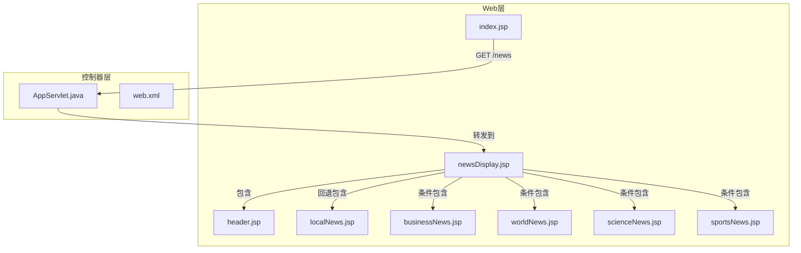
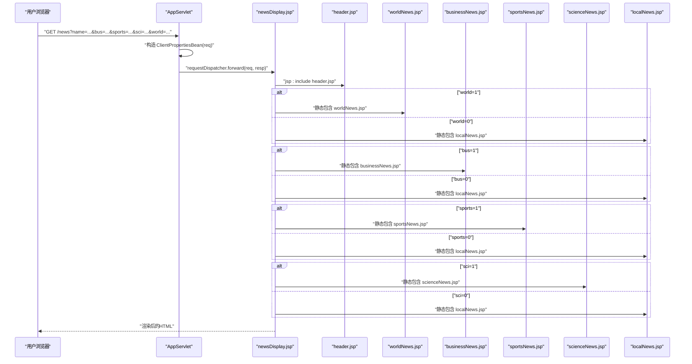
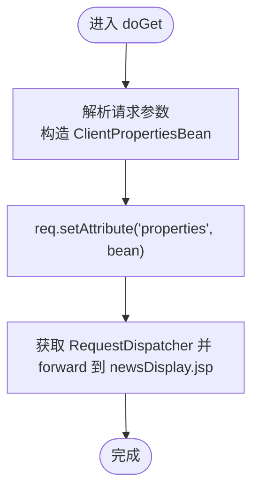
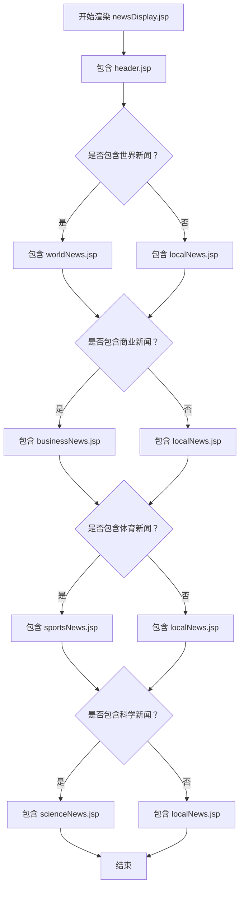
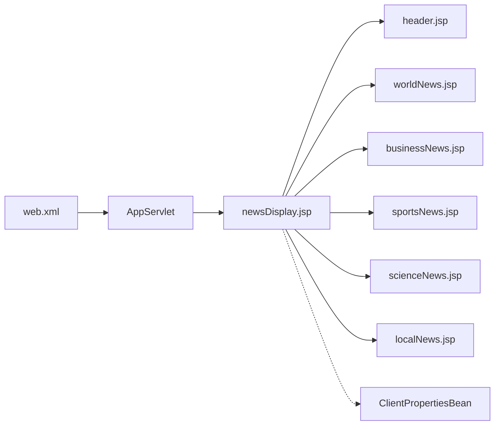

# 组合视图模式

<cite>
**本文引用的文件**
- [README.md](file://composite-view/README.md)
- [AppServlet.java](file://composite-view/src/main/java/com/iluwatar/compositeview/AppServlet.java)
- [AppServletTest.java](file://composite-view/src/test/java/com/iluwatar/compositeview/AppServletTest.java)
- [web.xml](file://composite-view/web/WEB-INF/web.xml)
- [newsDisplay.jsp](file://composite-view/web/newsDisplay.jsp)
- [header.jsp](file://composite-view/web/header.jsp)
- [index.jsp](file://composite-view/web/index.jsp)
- [localNews.jsp](file://composite-view/web/localNews.jsp)
- [businessNews.jsp](file://composite-view/web/businessNews.jsp)
- [worldNews.jsp](file://composite-view/web/worldNews.jsp)
- [scienceNews.jsp](file://composite-view/web/scienceNews.jsp)
- [sportsNews.jsp](file://composite-view/web/sportsNews.jsp)
</cite>

## 目录
1. [引言](#引言)
2. [项目结构](#项目结构)
3. [核心组件](#核心组件)
4. [架构总览](#架构总览)
5. [详细组件分析](#详细组件分析)
6. [依赖分析](#依赖分析)
7. [性能考虑](#性能考虑)
8. [故障排查指南](#故障排查指南)
9. [结论](#结论)
10. [附录](#附录)

## 引言
本文件系统性阐述组合视图模式在Java Web中的落地实践，围绕一个基于Servlet与JSP的新闻门户示例展开：通过Servlet统一接收请求并转发到JSP模板，JSP模板以表格为容器，按行嵌套多个“原子视图”（如本地新闻、体育新闻、商业新闻、世界新闻、科学新闻），并通过条件逻辑动态选择具体子视图。该模式强调“模板 + 视图管理器”的分离：模板负责布局与结构，视图管理器（由请求参数驱动的JavaBean）决定包含哪些子视图及其顺序，从而实现页面布局、导航菜单、内容区域等模块化设计。

## 项目结构
该示例采用经典的Web工程目录结构：
- web根目录下包含多个JSP页面，作为“原子视图”或“复合视图模板”
- web/WEB-INF/web.xml声明Servlet映射
- src/main/java/com/iluwatar/compositeview 下包含Servlet与视图属性Bean
- 测试位于src/test/java/com/iluwatar/compositeview

**图表来源**
- [web.xml](file://composite-view/web/WEB-INF/web.xml#L32-L39)
- [AppServlet.java](file://composite-view/src/main/java/com/iluwatar/compositeview/AppServlet.java#L55-L65)
- [newsDisplay.jsp](file://composite-view/web/newsDisplay.jsp#L47-L81)
- [header.jsp](file://composite-view/web/header.jsp#L44-L48)
- [localNews.jsp](file://composite-view/web/localNews.jsp#L29-L50)
- [businessNews.jsp](file://composite-view/web/businessNews.jsp#L44-L58)
- [worldNews.jsp](file://composite-view/web/worldNews.jsp#L44-L59)
- [scienceNews.jsp](file://composite-view/web/scienceNews.jsp#L36-L60)
- [sportsNews.jsp](file://composite-view/web/sportsNews.jsp#L44-L57)

**章节来源**
- [web.xml](file://composite-view/web/WEB-INF/web.xml#L28-L39)
- [index.jsp](file://composite-view/web/index.jsp#L37-L44)

## 核心组件
- AppServlet：HTTP入口，处理GET请求并将请求转发给newsDisplay.jsp；对POST/PUT/DELETE返回提示信息。
- ClientPropertiesBean：封装用户偏好（布尔开关与名称），用于控制模板中子视图的选择。
- newsDisplay.jsp：复合视图模板，定义三行两列/一列布局，使用JSP指令与脚本片段进行条件包含。
- 原子视图：header.jsp、localNews.jsp、businessNews.jsp、worldNews.jsp、scienceNews.jsp、sportsNews.jsp，分别承担不同内容区域的渲染。

**章节来源**
- [AppServlet.java](file://composite-view/src/main/java/com/iluwatar/compositeview/AppServlet.java#L41-L96)
- [newsDisplay.jsp](file://composite-view/web/newsDisplay.jsp#L44-L83)

## 架构总览
该示例遵循“前端静态页面 + 后端控制器 + 模板 + 子视图”的分层思路。请求从浏览器发起，经由Servlet路由到JSP模板，模板根据Bean属性动态拼装子视图，最终输出HTML。

**图表来源**
- [AppServlet.java](file://composite-view/src/main/java/com/iluwatar/compositeview/AppServlet.java#L55-L65)
- [newsDisplay.jsp](file://composite-view/web/newsDisplay.jsp#L47-L81)
- [header.jsp](file://composite-view/web/header.jsp#L44-L48)
- [localNews.jsp](file://composite-view/web/localNews.jsp#L29-L50)
- [businessNews.jsp](file://composite-view/web/businessNews.jsp#L44-L58)
- [worldNews.jsp](file://composite-view/web/worldNews.jsp#L44-L59)
- [scienceNews.jsp](file://composite-view/web/scienceNews.jsp#L36-L60)
- [sportsNews.jsp](file://composite-view/web/sportsNews.jsp#L44-L57)

## 详细组件分析

### Servlet层：AppServlet
- 职责：接收GET请求，解析参数生成视图属性Bean，设置请求作用域属性并转发至模板JSP。
- 错误处理：捕获转发过程中的异常并记录日志。
- 其他方法：对POST/PUT/DELETE直接输出不支持提示。

**图表来源**
- [AppServlet.java](file://composite-view/src/main/java/com/iluwatar/compositeview/AppServlet.java#L55-L65)

**章节来源**
- [AppServlet.java](file://composite-view/src/main/java/com/iluwatar/compositeview/AppServlet.java#L41-L96)
- [AppServletTest.java](file://composite-view/src/test/java/com/iluwatar/compositeview/AppServletTest.java#L53-L68)

### 视图管理器：ClientPropertiesBean
- 负责从请求中提取布尔型偏好（世界、科学、体育、商业）与字符串名称，并提供默认值。
- 作为模板中条件判断的数据源，决定子视图的包含策略。

**章节来源**
- [newsDisplay.jsp](file://composite-view/web/newsDisplay.jsp#L45-L81)

### 模板与子视图：newsDisplay.jsp 及其包含的JSP
- 模板结构：居中标题、头部包含、三行布局的表格。
- 条件包含策略：
  - 第一行：若用户对世界新闻感兴趣则包含世界新闻，否则回退到本地新闻。
  - 第二行：若用户对商业或体育新闻感兴趣则分别包含对应视图，否则回退到本地新闻。
  - 第三行：若用户对科学新闻感兴趣则包含科学新闻，否则回退到本地新闻。
- 头部：包含header.jsp，显示个性化欢迎语与当前日期。

**图表来源**
- [newsDisplay.jsp](file://composite-view/web/newsDisplay.jsp#L47-L81)
- [header.jsp](file://composite-view/web/header.jsp#L44-L48)
- [localNews.jsp](file://composite-view/web/localNews.jsp#L29-L50)
- [businessNews.jsp](file://composite-view/web/businessNews.jsp#L44-L58)
- [worldNews.jsp](file://composite-view/web/worldNews.jsp#L44-L59)
- [scienceNews.jsp](file://composite-view/web/scienceNews.jsp#L36-L60)
- [sportsNews.jsp](file://composite-view/web/sportsNews.jsp#L44-L57)

**章节来源**
- [newsDisplay.jsp](file://composite-view/web/newsDisplay.jsp#L44-L83)
- [header.jsp](file://composite-view/web/header.jsp#L44-L48)

### 原子视图：局部内容组件
- header.jsp：显示个性化标题与当前日期。
- localNews.jsp：通用本地新闻列表。
- businessNews.jsp：通用商业新闻表格。
- worldNews.jsp：通用世界新闻表格。
- scienceNews.jsp：通用科学新闻列表。
- sportsNews.jsp：通用体育新闻段落。

这些组件彼此独立，可被任意模板复用与替换，体现了组合视图模式中“叶节点”组件的可插拔特性。

**章节来源**
- [header.jsp](file://composite-view/web/header.jsp#L44-L48)
- [localNews.jsp](file://composite-view/web/localNews.jsp#L29-L50)
- [businessNews.jsp](file://composite-view/web/businessNews.jsp#L44-L58)
- [worldNews.jsp](file://composite-view/web/worldNews.jsp#L44-L59)
- [scienceNews.jsp](file://composite-view/web/scienceNews.jsp#L36-L60)
- [sportsNews.jsp](file://composite-view/web/sportsNews.jsp#L44-L57)

## 依赖分析
- Servlet与JSP：web.xml将URL模式映射到AppServlet，Servlet再将请求转发到newsDisplay.jsp。
- 模板与子视图：newsDisplay.jsp通过<jsp:include>/<%@include%>指令包含header.jsp与各原子视图。
- 视图属性Bean：newsDisplay.jsp从请求作用域读取ClientPropertiesBean，驱动条件包含逻辑。

**图表来源**
- [web.xml](file://composite-view/web/WEB-INF/web.xml#L32-L39)
- [AppServlet.java](file://composite-view/src/main/java/com/iluwatar/compositeview/AppServlet.java#L55-L65)
- [newsDisplay.jsp](file://composite-view/web/newsDisplay.jsp#L47-L81)

**章节来源**
- [web.xml](file://composite-view/web/WEB-INF/web.xml#L28-L39)
- [AppServlet.java](file://composite-view/src/main/java/com/iluwatar/compositeview/AppServlet.java#L55-L65)
- [newsDisplay.jsp](file://composite-view/web/newsDisplay.jsp#L47-L81)

## 性能考虑
- 包含策略：JSP的静态包含与动态包含会带来额外的页面拼接成本，建议在高并发场景下：
  - 对频繁访问的子视图进行缓存（如将常用数据预取到请求作用域）。
  - 控制模板层级深度，避免过深的嵌套导致响应时间增长。
- 参数解析：ClientPropertiesBean仅做简单布尔解析，开销极低；可在Servlet层增加参数校验与默认值处理，减少模板分支判断次数。
- 资源优化：CSS/JS尽量外链并启用压缩与缓存，避免在每个JSP重复内联样式。

## 故障排查指南
- 请求未命中Servlet：确认web.xml中URL映射是否正确，以及部署后路径是否匹配。
- 模板无法包含子视图：检查newsDisplay.jsp中的包含路径是否相对于web根目录正确。
- 条件逻辑不生效：核对请求参数名与布尔值格式，确保ClientPropertiesBean能正确解析。
- 日志定位：AppServlet在转发过程中有异常捕获与日志记录，可通过日志定位问题。

**章节来源**
- [web.xml](file://composite-view/web/WEB-INF/web.xml#L32-L39)
- [AppServlet.java](file://composite-view/src/main/java/com/iluwatar/compositeview/AppServlet.java#L55-L65)
- [newsDisplay.jsp](file://composite-view/web/newsDisplay.jsp#L47-L81)

## 结论
该示例清晰展示了组合视图模式在Web应用中的落地方式：以Servlet为入口，以JSP模板为骨架，以视图属性Bean为决策依据，通过条件包含实现页面布局、导航与内容区域的模块化与可复用。该模式在需要按用户偏好动态组装页面的场景（如仪表盘、门户首页、个性化推荐页）具有良好的可维护性与扩展性。

## 附录

### 使用说明与参数
- 访问入口：index.jsp提供参数说明与引导。
- 关键参数：
  - name：字符串，用于个性化欢迎语。
  - bus：布尔，是否包含商业新闻。
  - world：布尔，是否包含世界新闻。
  - sci：布尔，是否包含科学新闻。
  - sport：布尔，是否包含体育新闻。

**章节来源**
- [index.jsp](file://composite-view/web/index.jsp#L37-L44)
- [newsDisplay.jsp](file://composite-view/web/newsDisplay.jsp#L45-L81)

### 与模板引擎的结合
- Thymeleaf/Freemarker等现代模板引擎同样可以承载组合视图思想：
  - 将AppServlet替换为Spring MVC控制器，将newsDisplay.jsp替换为Thymeleaf/Freemarker模板。
  - 将ClientPropertiesBean替换为领域模型或DTO，通过控制器装配到模型。
  - 在模板中使用条件块与片段包含实现与JSP类似的动态组合。
- 优势：
  - 更强的表达能力与调试体验。
  - 更好的国际化与静态资源处理能力。
- 注意事项：
  - 需要评估迁移成本与团队熟悉度。
  - 保持“模板 + 视图管理器”的职责分离，避免模板中出现业务逻辑。

**章节来源**
- [README.md](file://composite-view/README.md#L314-L341)