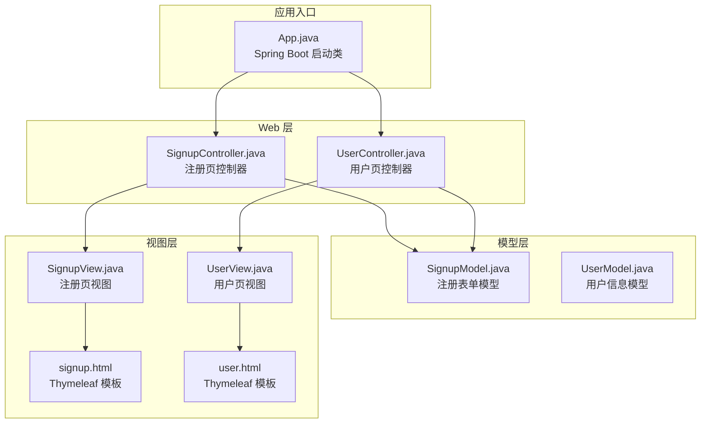
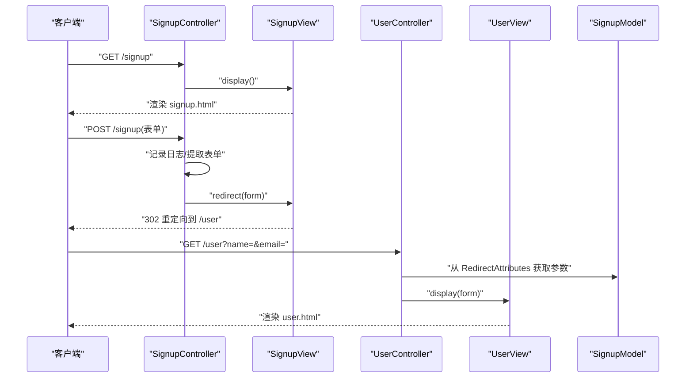
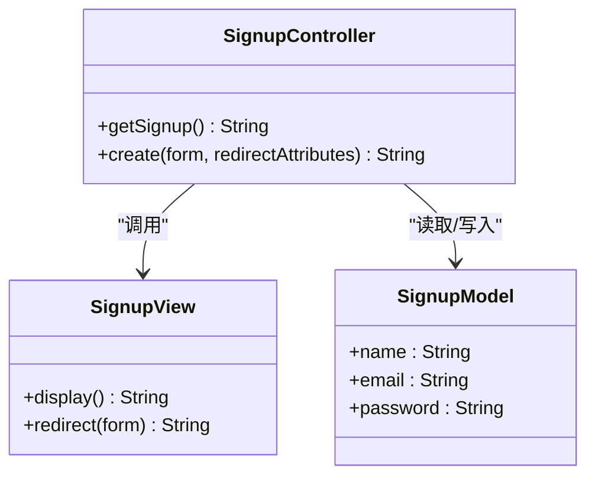
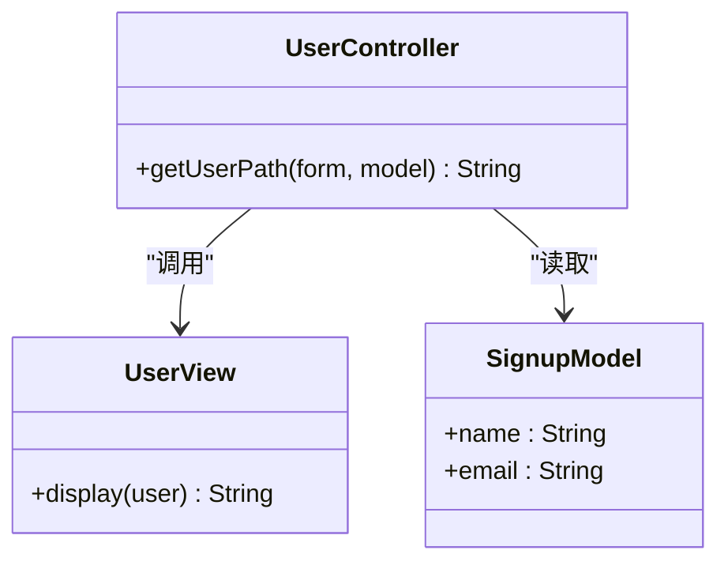
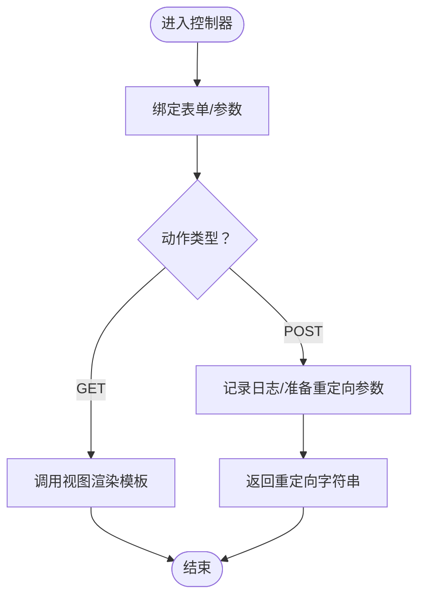
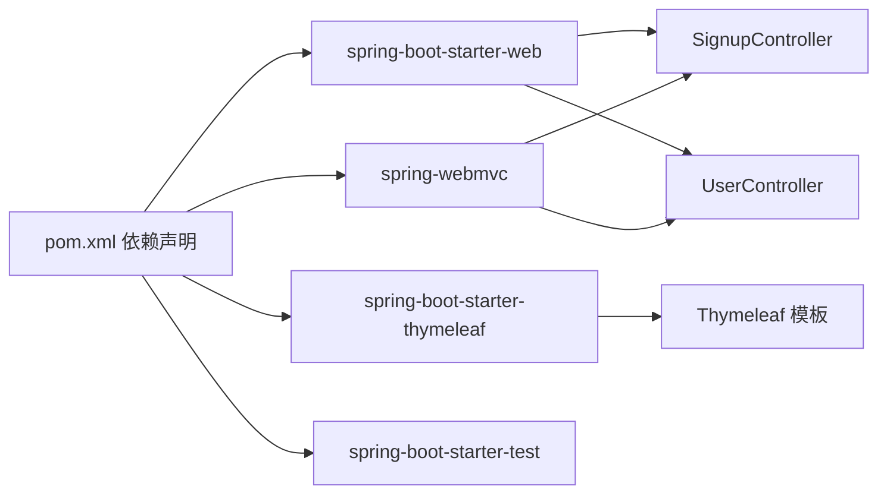

# 页面控制器模式

<cite>
**本文引用的文件**
- [App.java](file://page-controller/src/main/java/com/iluwatar/page/controller/App.java)
- [SignupController.java](file://page-controller/src/main/java/com/iluwatar/page/controller/SignupController.java)
- [UserController.java](file://page-controller/src/main/java/com/iluwatar/page/controller/UserController.java)
- [SignupModel.java](file://page-controller/src/main/java/com/iluwatar/page/controller/SignupModel.java)
- [UserModel.java](file://page-controller/src/main/java/com/iluwatar/page/controller/UserModel.java)
- [SignupView.java](file://page-controller/src/main/java/com/iluwatar/page/controller/SignupView.java)
- [UserView.java](file://page-controller/src/main/java/com/iluwatar/page/controller/UserView.java)
- [signup.html](file://page-controller/src/main/resources/templates/signup.html)
- [user.html](file://page-controller/src/main/resources/templates/user.html)
- [pom.xml](file://page-controller/pom.xml)
- [README.md](file://page-controller/README.md)
- [AppTest.java](file://page-controller/src/test/java/com/iluwatar/page/controller/AppTest.java)
- [SignupControllerTest.java](file://page-controller/src/test/java/com/iluwatar/page/controller/SignupControllerTest.java)
- [UserControllerTest.java](file://page-controller/src/test/java/com/iluwatar/page/controller/UserControllerTest.java)
</cite>

## 目录
1. [引言](#引言)
2. [项目结构](#项目结构)
3. [核心组件](#核心组件)
4. [架构总览](#架构总览)
5. [详细组件分析](#详细组件分析)
6. [依赖分析](#依赖分析)
7. [性能考虑](#性能考虑)
8. [故障排查指南](#故障排查指南)
9. [结论](#结论)
10. [附录](#附录)

## 引言
本文件系统性阐述页面控制器（Page Controller）模式的设计理念、与前端控制器（Front Controller）模式的区别与联系，并结合示例工程 page-controller 的实现，深入解析应用入口、用户注册与用户页面控制器的职责边界、数据模型与视图的协作方式，以及页面级请求处理机制。同时给出适用场景、优缺点与性能考量，帮助读者在现代 Web 开发中正确选择与落地该模式。

## 项目结构
page-controller 示例采用 Spring Boot + Spring MVC + Thymeleaf 技术栈，遵循“每个页面一个控制器”的组织方式：控制器负责请求映射与转发，模型承载页面数据，视图负责渲染输出；模板文件通过 Thymeleaf 渲染。

图表来源
- [App.java](file://page-controller/src/main/java/com/iluwatar/page/controller/App.java#L31-L48)
- [SignupController.java](file://page-controller/src/main/java/com/iluwatar/page/controller/SignupController.java#L34-L68)
- [UserController.java](file://page-controller/src/main/java/com/iluwatar/page/controller/UserController.java#L33-L50)
- [SignupModel.java](file://page-controller/src/main/java/com/iluwatar/page/controller/SignupModel.java#L31-L41)
- [UserModel.java](file://page-controller/src/main/java/com/iluwatar/page/controller/UserModel.java#L30-L38)
- [SignupView.java](file://page-controller/src/main/java/com/iluwatar/page/controller/SignupView.java#L30-L48)
- [UserView.java](file://page-controller/src/main/java/com/iluwatar/page/controller/UserView.java#L29-L41)
- [signup.html](file://page-controller/src/main/resources/templates/signup.html#L28-L53)
- [user.html](file://page-controller/src/main/resources/templates/user.html#L28-L37)

章节来源
- [App.java](file://page-controller/src/main/java/com/iluwatar/page/controller/App.java#L31-L48)
- [pom.xml](file://page-controller/pom.xml#L52-L88)

## 核心组件
- 应用入口与启动
  - App.java 使用 Spring Boot 注解声明应用，作为程序入口启动 Web 容器。
- 控制器
  - SignupController：处理注册页 GET/POST 请求，返回视图或重定向到用户页。
  - UserController：处理用户页 GET 请求，将模型数据注入视图。
- 模型
  - SignupModel：承载注册表单字段（名称、邮箱、密码）。
  - UserModel：承载用户信息（名称、邮箱）。
- 视图
  - SignupView：返回注册页模板路径或重定向字符串。
  - UserView：接收表单模型，返回用户页模板路径。
- 模板
  - signup.html、user.html：Thymeleaf 模板，用于渲染页面内容。

章节来源
- [App.java](file://page-controller/src/main/java/com/iluwatar/page/controller/App.java#L31-L48)
- [SignupController.java](file://page-controller/src/main/java/com/iluwatar/page/controller/SignupController.java#L34-L68)
- [UserController.java](file://page-controller/src/main/java/com/iluwatar/page/controller/UserController.java#L33-L50)
- [SignupModel.java](file://page-controller/src/main/java/com/iluwatar/page/controller/SignupModel.java#L31-L41)
- [UserModel.java](file://page-controller/src/main/java/com/iluwatar/page/controller/UserModel.java#L30-L38)
- [SignupView.java](file://page-controller/src/main/java/com/iluwatar/page/controller/SignupView.java#L30-L48)
- [UserView.java](file://page-controller/src/main/java/com/iluwatar/page/controller/UserView.java#L29-L41)
- [signup.html](file://page-controller/src/main/resources/templates/signup.html#L28-L53)
- [user.html](file://page-controller/src/main/resources/templates/user.html#L28-L37)

## 架构总览
页面控制器模式在本示例中的运行时交互如下：

图表来源
- [SignupController.java](file://page-controller/src/main/java/com/iluwatar/page/controller/SignupController.java#L48-L67)
- [SignupView.java](file://page-controller/src/main/java/com/iluwatar/page/controller/SignupView.java#L37-L48)
- [UserController.java](file://page-controller/src/main/java/com/iluwatar/page/controller/UserController.java#L45-L50)
- [UserView.java](file://page-controller/src/main/java/com/iluwatar/page/controller/UserView.java#L38-L41)
- [signup.html](file://page-controller/src/main/resources/templates/signup.html#L28-L53)
- [user.html](file://page-controller/src/main/resources/templates/user.html#L28-L37)

## 详细组件分析

### 设计理念与与前端控制器的关系
- 页面控制器模式
  - 针对“特定页面或动作”设置独立控制器，集中处理该页面的请求、业务与视图选择。
  - 优点：职责单一、易维护、可测试；缺点：控制器数量可能增多、跨页面逻辑复用需额外设计。
- 与前端控制器的关系
  - 前端控制器统一拦截请求，进行通用预处理（如鉴权、日志、参数预处理），再分派给具体页面控制器。
  - 两者常配合使用：前端控制器负责“共性”，页面控制器负责“个性”。

章节来源
- [README.md](file://page-controller/README.md#L18-L36)
- [README.md](file://page-controller/README.md#L149-L153)

### 应用入口：App.java
- 职责
  - 声明 Spring Boot 应用，启动内嵌 Web 容器，加载上下文。
- 关键点
  - 通过注解启用自动配置与组件扫描，简化部署与启动流程。

章节来源
- [App.java](file://page-controller/src/main/java/com/iluwatar/page/controller/App.java#L31-L48)

### 注册控制器：SignupController
- 职责
  - 处理注册页 GET 请求，返回注册页模板。
  - 处理注册页 POST 请求，记录输入、设置重定向参数与闪存属性，重定向至用户页。
- 数据绑定与重定向
  - 接收表单对象并写入 RedirectAttributes，随后返回重定向字符串，交由框架完成跳转。
- 视图协作
  - 通过 SignupView 返回模板路径或重定向指令。

图表来源
- [SignupController.java](file://page-controller/src/main/java/com/iluwatar/page/controller/SignupController.java#L34-L68)
- [SignupView.java](file://page-controller/src/main/java/com/iluwatar/page/controller/SignupView.java#L30-L48)
- [SignupModel.java](file://page-controller/src/main/java/com/iluwatar/page/controller/SignupModel.java#L31-L41)

章节来源
- [SignupController.java](file://page-controller/src/main/java/com/iluwatar/page/controller/SignupController.java#L34-L68)
- [SignupView.java](file://page-controller/src/main/java/com/iluwatar/page/controller/SignupView.java#L30-L48)
- [SignupModel.java](file://page-controller/src/main/java/com/iluwatar/page/controller/SignupModel.java#L31-L41)

### 用户控制器：UserController
- 职责
  - 处理用户页 GET 请求，从 RedirectAttributes 中获取参数，注入 Model，返回用户页模板。
- 协作关系
  - 依赖 UserView 进行视图选择；与 SignupModel 共享字段，便于跨页传递数据。

图表来源
- [UserController.java](file://page-controller/src/main/java/com/iluwatar/page/controller/UserController.java#L33-L50)
- [UserView.java](file://page-controller/src/main/java/com/iluwatar/page/controller/UserView.java#L29-L41)
- [SignupModel.java](file://page-controller/src/main/java/com/iluwatar/page/controller/SignupModel.java#L31-L41)

章节来源
- [UserController.java](file://page-controller/src/main/java/com/iluwatar/page/controller/UserController.java#L33-L50)
- [UserView.java](file://page-controller/src/main/java/com/iluwatar/page/controller/UserView.java#L29-L41)
- [SignupModel.java](file://page-controller/src/main/java/com/iluwatar/page/controller/SignupModel.java#L31-L41)

### 模型与视图
- 模型
  - SignupModel：包含注册所需字段，供控制器与视图使用。
  - UserModel：用于用户信息展示的轻量模型。
- 视图
  - SignupView：返回注册页模板路径或重定向字符串。
  - UserView：接收表单模型，返回用户页模板路径。

图表来源
- [SignupController.java](file://page-controller/src/main/java/com/iluwatar/page/controller/SignupController.java#L48-L67)
- [UserController.java](file://page-controller/src/main/java/com/iluwatar/page/controller/UserController.java#L45-L50)
- [SignupView.java](file://page-controller/src/main/java/com/iluwatar/page/controller/SignupView.java#L37-L48)
- [UserView.java](file://page-controller/src/main/java/com/iluwatar/page/controller/UserView.java#L38-L41)

章节来源
- [SignupModel.java](file://page-controller/src/main/java/com/iluwatar/page/controller/SignupModel.java#L31-L41)
- [UserModel.java](file://page-controller/src/main/java/com/iluwatar/page/controller/UserModel.java#L30-L38)
- [SignupView.java](file://page-controller/src/main/java/com/iluwatar/page/controller/SignupView.java#L30-L48)
- [UserView.java](file://page-controller/src/main/java/com/iluwatar/page/controller/UserView.java#L29-L41)

### 页面级请求处理机制（代码示例路径）
- 注册 GET 请求
  - 路径：[SignupController.java](file://page-controller/src/main/java/com/iluwatar/page/controller/SignupController.java#L48-L51)
- 注册 POST 请求与重定向
  - 路径：[SignupController.java](file://page-controller/src/main/java/com/iluwatar/page/controller/SignupController.java#L53-L67)
- 用户页 GET 请求与模型注入
  - 路径：[UserController.java](file://page-controller/src/main/java/com/iluwatar/page/controller/UserController.java#L45-L50)
- 视图渲染模板
  - 注册页模板：[signup.html](file://page-controller/src/main/resources/templates/signup.html#L28-L53)
  - 用户页模板：[user.html](file://page-controller/src/main/resources/templates/user.html#L28-L37)

章节来源
- [SignupController.java](file://page-controller/src/main/java/com/iluwatar/page/controller/SignupController.java#L48-L67)
- [UserController.java](file://page-controller/src/main/java/com/iluwatar/page/controller/UserController.java#L45-L50)
- [signup.html](file://page-controller/src/main/resources/templates/signup.html#L28-L53)
- [user.html](file://page-controller/src/main/resources/templates/user.html#L28-L37)

## 依赖分析
- 技术栈与模块
  - Spring Boot Starter Web：提供 Web MVC、内嵌容器与自动配置。
  - Spring MVC：控制器、视图解析、参数绑定与重定向支持。
  - Thymeleaf Starter：模板引擎，与 Spring MVC 集成良好。
  - 测试依赖：JUnit、MockMvc、Spring Boot Test 等。
- 组件耦合
  - 控制器与视图通过字符串返回值解耦；模型作为数据载体被控制器读写。
  - 视图与模板文件通过视图名绑定，模板文件与 Thymeleaf 配置解耦。

图表来源
- [pom.xml](file://page-controller/pom.xml#L52-L88)

章节来源
- [pom.xml](file://page-controller/pom.xml#L52-L88)

## 性能考虑
- 优势
  - 控制器粒度小，职责清晰，便于缓存与异步化改造。
  - 视图与模板分离，利于静态资源优化与 CDN 加速。
- 需关注点
  - 控制器数量增加可能导致上下文切换与路由匹配开销上升，应合理规划路由前缀与命名空间。
  - 重定向与闪存参数会引入一次额外的 HTTP 跳转，需评估延迟与用户体验。
  - 模板渲染与静态资源加载是热点路径，建议开启压缩、合并与缓存策略。

## 故障排查指南
- 启动失败
  - 确认 App.java 正确标注为 Spring Boot 启动类，且主类路径与打包插件一致。
  - 参考：[App.java](file://page-controller/src/main/java/com/iluwatar/page/controller/App.java#L31-L48)
- 控制器未生效
  - 检查控制器是否标注为 @Controller 或 @Component，确保组件扫描范围覆盖。
  - 参考：[SignupController.java](file://page-controller/src/main/java/com/iluwatar/page/controller/SignupController.java#L37-L39)，[UserController.java](file://page-controller/src/main/java/com/iluwatar/page/controller/UserController.java#L36-L38)
- 模板无法渲染
  - 确认视图返回值与模板文件名一致，且模板位于默认模板目录。
  - 参考：[SignupView.java](file://page-controller/src/main/java/com/iluwatar/page/controller/SignupView.java#L37-L40)，[UserView.java](file://page-controller/src/main/java/com/iluwatar/page/controller/UserView.java#L38-L41)，[signup.html](file://page-controller/src/main/resources/templates/signup.html#L28-L53)，[user.html](file://page-controller/src/main/resources/templates/user.html#L28-L37)
- 重定向不生效
  - 确认控制器返回值以 "redirect:" 前缀开头，且目标路径存在。
  - 参考：[SignupController.java](file://page-controller/src/main/java/com/iluwatar/page/controller/SignupController.java#L66-L67)
- 单元测试与集成测试
  - 使用 MockMvc 验证控制器行为与模型注入。
  - 参考：[UserControllerTest.java](file://page-controller/src/test/java/com/iluwatar/page/controller/UserControllerTest.java#L50-L59)，[SignupControllerTest.java](file://page-controller/src/test/java/com/iluwatar/page/controller/SignupControllerTest.java#L40-L48)，[AppTest.java](file://page-controller/src/test/java/com/iluwatar/page/controller/AppTest.java#L33-L38)

章节来源
- [App.java](file://page-controller/src/main/java/com/iluwatar/page/controller/App.java#L31-L48)
- [SignupController.java](file://page-controller/src/main/java/com/iluwatar/page/controller/SignupController.java#L37-L39)
- [UserController.java](file://page-controller/src/main/java/com/iluwatar/page/controller/UserController.java#L36-L38)
- [SignupView.java](file://page-controller/src/main/java/com/iluwatar/page/controller/SignupView.java#L37-L40)
- [UserView.java](file://page-controller/src/main/java/com/iluwatar/page/controller/UserView.java#L38-L41)
- [signup.html](file://page-controller/src/main/resources/templates/signup.html#L28-L53)
- [user.html](file://page-controller/src/main/resources/templates/user.html#L28-L37)
- [UserControllerTest.java](file://page-controller/src/test/java/com/iluwatar/page/controller/UserControllerTest.java#L50-L59)
- [SignupControllerTest.java](file://page-controller/src/test/java/com/iluwatar/page/controller/SignupControllerTest.java#L40-L48)
- [AppTest.java](file://page-controller/src/test/java/com/iluwatar/page/controller/AppTest.java#L33-L38)

## 结论
页面控制器模式通过“按页面划分控制器”的方式，将请求处理、业务逻辑与视图渲染解耦，适合中小型 Web 应用与需要清晰职责边界的场景。结合前端控制器可进一步统一横切关注点；配合 Thymeleaf 等模板引擎，可在保持简洁的同时获得良好的可维护性与扩展性。对于高并发与复杂业务，建议在控制器之外引入服务层与领域模型，以避免控制器膨胀。

## 附录
- 适用场景
  - 静态页面与简单动态页面混合的站点。
  - 需要快速迭代与多人协作的中小型项目。
  - 对视图渲染与参数绑定有明确要求的场景。
- 与前端控制器的协作
  - 前端控制器负责认证、日志、参数校验等通用逻辑；页面控制器聚焦于页面级业务。
- 最佳实践
  - 控制器只做“薄层”，将复杂逻辑下沉到服务层。
  - 使用重定向-转发模式传递数据，避免在 URL 中暴露敏感信息。
  - 将模板与静态资源分离，利用缓存与压缩提升性能。