# 企业应用模式

<cite>
**本文引用的文件**
- [gateway/README.md](file://gateway/README.md)
- [service-locator/README.md](file://service-locator/README.md)
- [business-delegate/README.md](file://business-delegate/README.md)
- [service-layer/README.md](file://service-layer/README.md)
- [notification/README.md](file://notification/README.md)
- [leader-election/README.md](file://leader-election/README.md)
- [leader-followers/README.md](file://leader-followers/README.md)
- [domain-model/README.md](file://domain-model/README.md)
- [type-object/README.md](file://type-object/README.md)
- [parameter-object/README.md](file://parameter-object/README.md)
- [client-session/README.md](file://client-session/README.md)
- [context-object/README.md](file://context-object/README.md)
- [component/README.md](file://component/README.md)
- [README.md](file://README.md)
</cite>

## 目录
1. [引言](#引言)
2. [项目结构](#项目结构)
3. [核心组件](#核心组件)
4. [架构总览](#架构总览)
5. [详细组件分析](#详细组件分析)
6. [依赖关系分析](#依赖关系分析)
7. [性能考量](#性能考量)
8. [故障排查指南](#故障排查指南)
9. [结论](#结论)
10. [附录](#附录)

## 引言
本指南聚焦于企业级应用中的关键设计模式与架构实践，系统梳理并解析以下主题：
- 企业集成与通信：网关模式、服务定位器、业务委托、服务层、通知（事件）模式
- 分布式协调：领导者选举、领导者-跟随者线程池
- 企业建模：领域模型、类型对象、参数对象
- 应用基础设施：会话管理、上下文对象、组件模式（实体-组件-系统）
- 可扩展性、可维护性与性能优化策略

通过仓库中各模式的文档与示例，我们将从架构视角、数据流、处理逻辑、集成点与错误处理等方面进行深入剖析，并提供可视化图示与排障建议。

## 项目结构
该仓库以“按模式分目录”的方式组织，每个模式包含独立的 README 文档与示例代码，便于按需学习与复用。下图给出与本指南目标高度相关的模式集合概览。

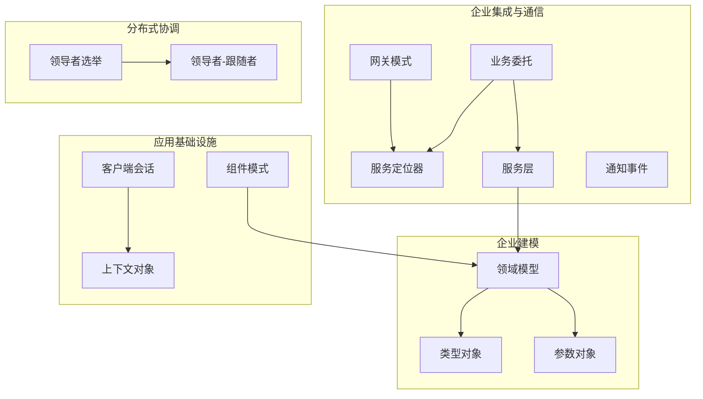

章节来源
- file://README.md#L1-L120

## 核心组件
本节对与企业应用密切相关的模式进行要点提炼，帮助快速建立整体认知。

- 网关模式（Gateway）
  - 角色：统一外部系统接口，封装协议转换与路由
  - 关键点：降低耦合、提升可测试性与可维护性；避免“上帝类”网关
  - 典型场景：微服务 API 网关、数据库网关

- 服务定位器（Service Locator）
  - 角色：集中化服务查找与缓存，解耦客户端与具体实现
  - 关键点：单点风险、查找开销、与依赖注入的权衡
  - 典型场景：传统企业应用、EJB 查找

- 业务委托（Business Delegate）
  - 角色：在表现层与业务层之间引入抽象，屏蔽远程/本地差异
  - 关键点：查找器（lookup）与委托对象的协作
  - 典型场景：Java EE 层次化架构

- 服务层（Service Layer）
  - 角色：封装业务逻辑，为表现层提供清晰 API
  - 关键点：与 DAO/实体的分层边界；事务与一致性
  - 典型场景：三层架构、Spring @Service

- 通知（事件）模式（Notification）
  - 角色：异步解耦事件发布与订阅，支持动态订阅/退订
  - 关键点：生产者-消费者解耦、调试复杂度
  - 典型场景：GUI 事件、微服务事件总线

- 领导者选举（Leader Election）
  - 角色：在分布式节点中选举一个协调者，确保一致性与容错
  - 关键点：算法选择（如 Bully、环形）、网络分区与延迟
  - 典型场景：分布式锁、主从切换

- 领导者-跟随者（Leader-Followers）
  - 角色：在并发环境中由单一领导者分发任务，其他线程跟随等待
  - 关键点：减少上下文切换、提高缓存亲和性
  - 典型场景：事件驱动服务器、I/O 多路复用

- 领域模型（Domain Model）
  - 角色：以富域对象表达业务规则与行为
  - 关键点：与 DAO/仓储的边界；单元工作与一致性
  - 典型场景：DDD、ERP/CRM

- 类型对象（Type Object）
  - 角色：将“类型”作为对象，运行时动态定义与扩展类型族
  - 关键点：与工厂/策略/原型的组合使用
  - 典型场景：游戏角色、配置驱动的行为族

- 参数对象（Parameter Object）
  - 角色：将多个相关参数封装为对象，简化签名与演进
  - 关键点：与构建器的配合；避免“长参列表”
  - 典型场景：查询条件、批量操作参数

- 客户端会话（Client Session）
  - 角色：跨请求保持用户状态，提升个性化体验
  - 关键点：安全性、过期与同步
  - 典型场景：电商购物车、在线平台

- 上下文对象（Context Object）
  - 角色：封装请求/用户上下文，贯穿多层传播
  - 关键点：集中化与复杂度平衡
  - 典型场景：Web 框架、分布式任务上下文

- 组件模式（Component）
  - 角色：以组件组合实体行为，强调灵活性与可插拔
  - 关键点：组件间通信与生命周期管理
  - 典型场景：游戏 ECS、模拟系统

章节来源
- file://gateway/README.md#L18-L167
- file://service-locator/README.md#L18-L134
- file://business-delegate/README.md#L19-L194
- file://service-layer/README.md#L19-L399
- file://notification/README.md#L19-L132
- file://leader-election/README.md#L20-L184
- file://leader-followers/README.md#L14-L172
- file://domain-model/README.md#L23-L277
- file://type-object/README.md#L23-L341
- file://parameter-object/README.md#L19-L173
- file://client-session/README.md#L18-L144
- file://context-object/README.md#L21-L198
- file://component/README.md#L19-L162

## 架构总览
下图展示企业应用中各模式之间的交互关系与职责边界，帮助理解如何在真实系统中协同使用这些模式。

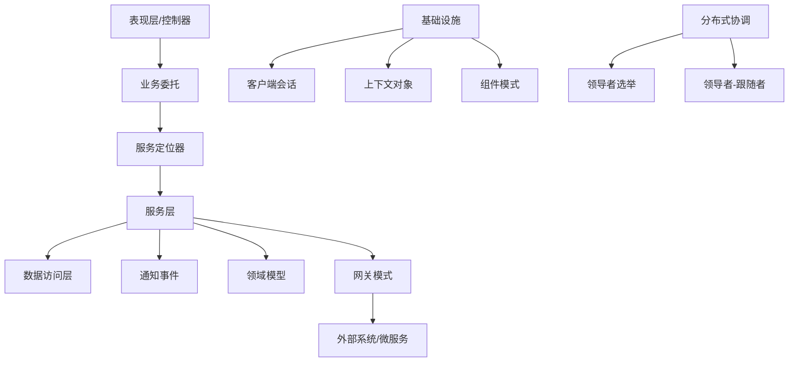

图表来源
- file://business-delegate/README.md#L19-L194
- file://service-locator/README.md#L18-L134
- file://service-layer/README.md#L19-L399
- file://domain-model/README.md#L23-L277
- file://notification/README.md#L19-L132
- file://client-session/README.md#L18-L144
- file://context-object/README.md#L21-L198
- file://component/README.md#L19-L162
- file://leader-election/README.md#L20-L184
- file://leader-followers/README.md#L14-L172
- file://gateway/README.md#L18-L167

## 详细组件分析

### 网关模式（Gateway）
- 设计意图：对外部系统提供统一入口，隐藏协议与数据格式差异
- 关键实现点：接口契约、注册表/工厂、执行与异常处理
- 使用建议：避免“上帝类”，按功能拆分网关；结合超时、熔断与限流

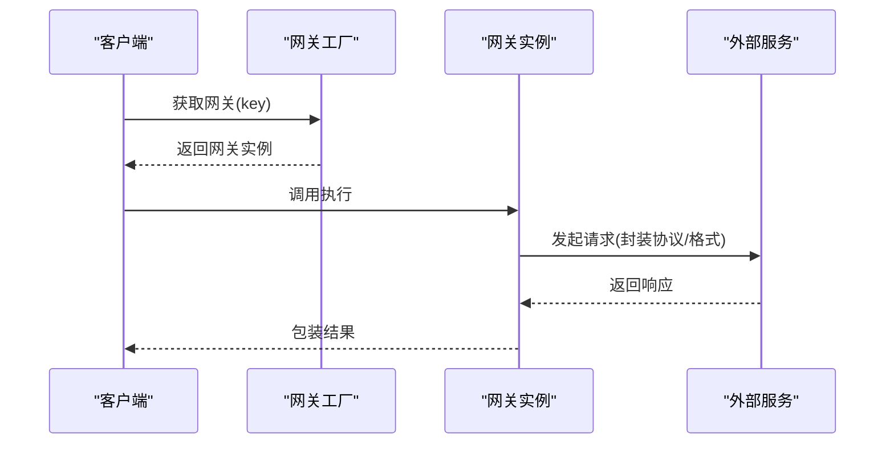

图表来源
- file://gateway/README.md#L38-L131

章节来源
- file://gateway/README.md#L18-L167

### 服务定位器（Service Locator）
- 设计意图：集中化服务发现与缓存，降低客户端对具体实现的耦合
- 关键实现点：定位器、缓存、查找器、单例化
- 使用建议：关注单点风险与性能；在现代容器中优先考虑依赖注入

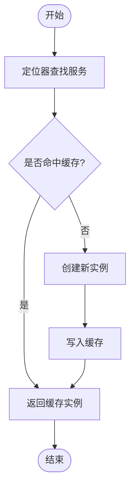

图表来源
- file://service-locator/README.md#L36-L134

章节来源
- file://service-locator/README.md#L18-L134

### 业务委托（Business Delegate）
- 设计意图：在表现层与业务层之间引入抽象，屏蔽远程/本地差异与查找细节
- 关键实现点：委托对象、查找器、业务服务选择
- 使用建议：与服务定位器配合；注意额外间接层带来的性能与复杂度

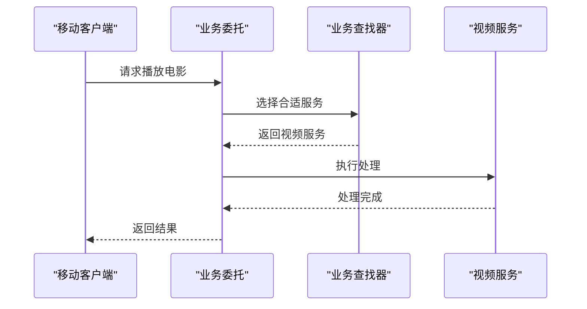

图表来源
- file://business-delegate/README.md#L39-L146

章节来源
- file://business-delegate/README.md#L19-L194

### 服务层（Service Layer）
- 设计意图：封装业务逻辑，为表现层提供稳定 API，隔离数据访问
- 关键实现点：服务接口与实现、DAO 协作、查询与编排
- 使用建议：明确边界，避免“贫血模型”；结合事务与一致性策略

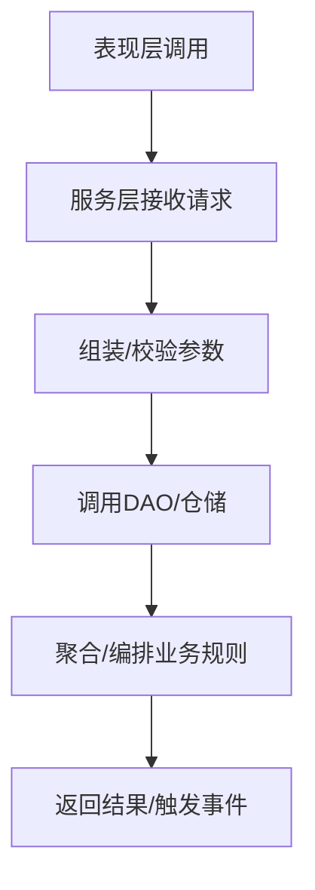

图表来源
- file://service-layer/README.md#L39-L354

章节来源
- file://service-layer/README.md#L19-L399

### 通知（事件）模式（Notification）
- 设计意图：异步解耦事件发布与订阅，支持动态订阅/退订
- 关键实现点：事件发布、订阅管理、错误收集与回传
- 使用建议：避免过度解耦导致调试困难；关注事件风暴与幂等

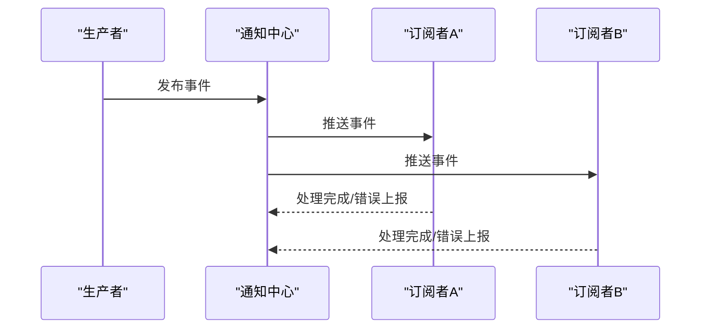

图表来源
- file://notification/README.md#L35-L132

章节来源
- file://notification/README.md#L19-L132

### 领导者选举（Leader Election）
- 设计意图：在分布式节点中选举一个协调者，确保一致性与容错
- 关键实现点：选举算法（Bully、环形）、健康检查、失败转移
- 使用建议：评估网络分区与脑裂风险；结合心跳与仲裁机制

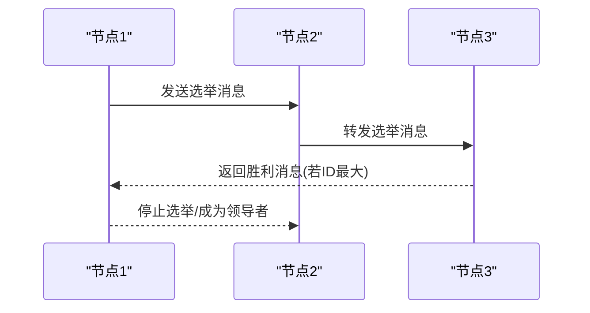

图表来源
- file://leader-election/README.md#L38-L184

章节来源
- file://leader-election/README.md#L20-L184

### 领导者-跟随者（Leader-Followers）
- 设计意图：由单一领导者分发任务，其他线程跟随等待，减少上下文切换
- 关键实现点：领导者轮换、任务队列、同步与唤醒
- 使用建议：平衡负载与资源利用；注意同步开销

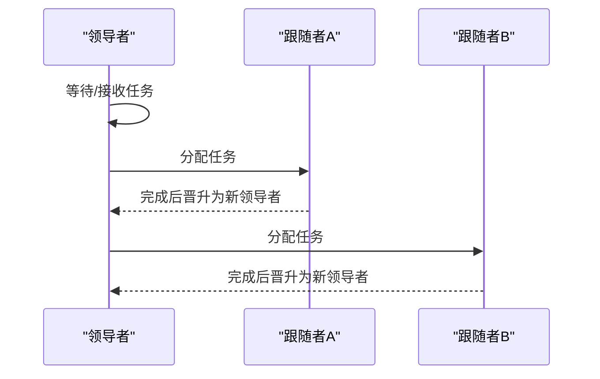

图表来源
- file://leader-followers/README.md#L32-L172

章节来源
- file://leader-followers/README.md#L14-L172

### 领域模型（Domain Model）
- 设计意图：以富域对象表达业务规则与行为，集中业务逻辑
- 关键实现点：实体、值对象、聚合边界、仓储/DAO 边界
- 使用建议：避免“贫血模型”；结合单元工作与一致性策略

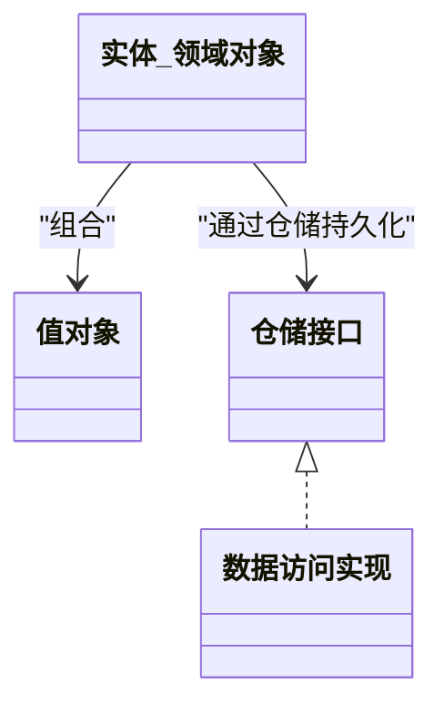

图表来源
- file://domain-model/README.md#L23-L277

章节来源
- file://domain-model/README.md#L23-L277

### 类型对象（Type Object）
- 设计意图：将“类型”作为对象，运行时动态定义与扩展类型族
- 关键实现点：类型描述对象、Typed 对象引用类型、运行时装配
- 使用建议：与工厂/策略/原型组合；注意动态类型检查的性能

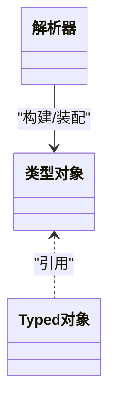

图表来源
- file://type-object/README.md#L41-L341

章节来源
- file://type-object/README.md#L23-L341

### 参数对象（Parameter Object）
- 设计意图：将多个相关参数封装为对象，简化方法签名与演进
- 关键实现点：Builder 模式、默认值、不可变性
- 使用建议：避免过度封装；与 DTO/查询对象区分用途

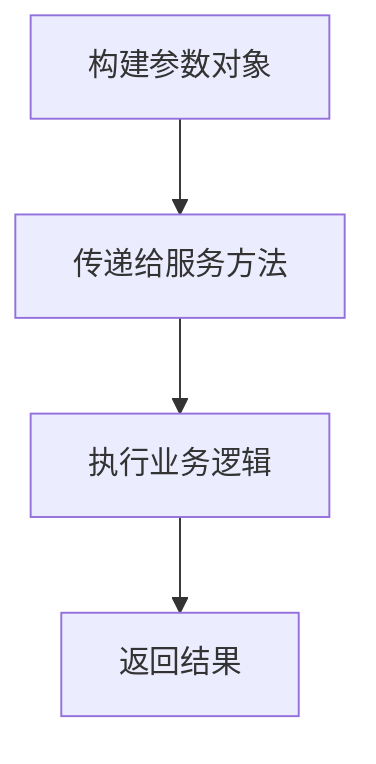

图表来源
- file://parameter-object/README.md#L43-L173

章节来源
- file://parameter-object/README.md#L19-L173

### 客户端会话（Client Session）
- 设计意图：跨请求保持用户状态，提升个性化体验
- 关键实现点：会话创建、状态存储、过期与续期
- 使用建议：安全存储、防篡改、跨设备同步

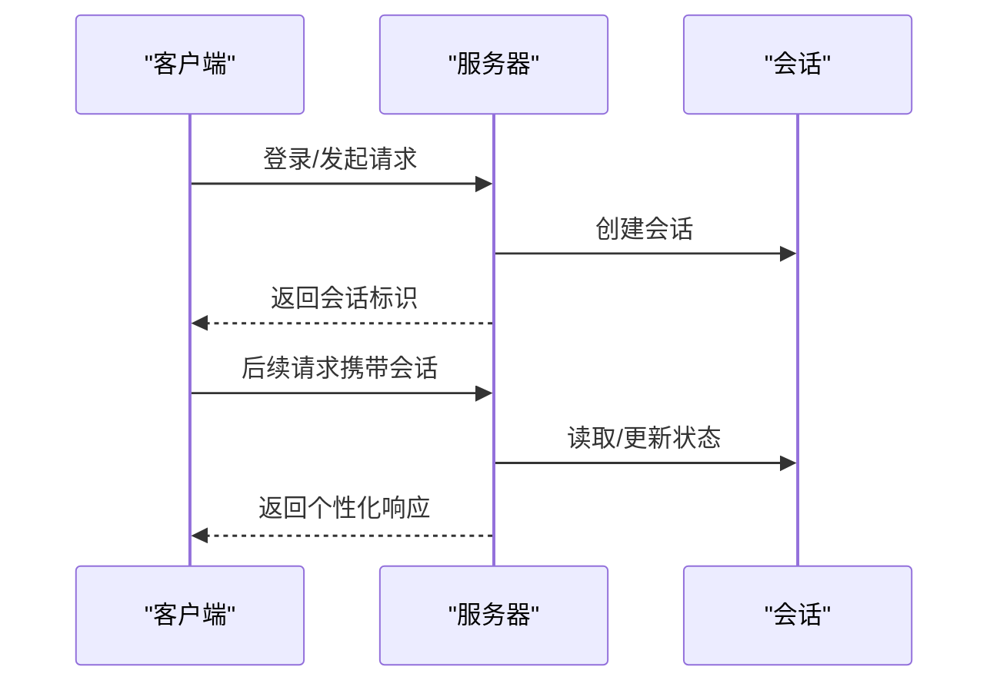

图表来源
- file://client-session/README.md#L36-L144

章节来源
- file://client-session/README.md#L18-L144

### 上下文对象（Context Object）
- 设计意图：封装请求/用户上下文，贯穿多层传播，解耦环境细节
- 关键实现点：上下文创建、多层传递、集中化管理
- 使用建议：避免上下文膨胀；与单例/线程局部存储结合

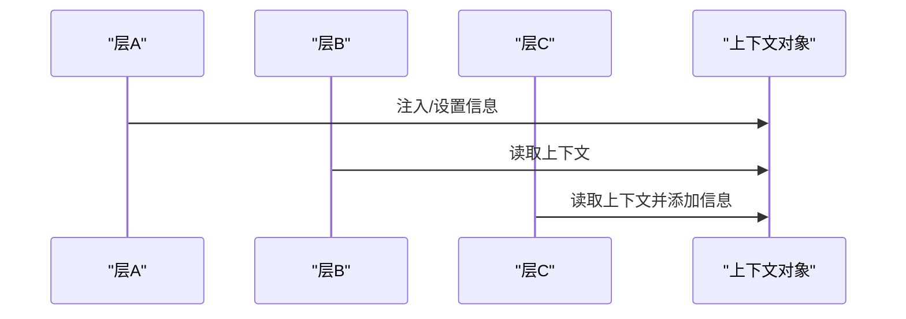

图表来源
- file://context-object/README.md#L39-L198

章节来源
- file://context-object/README.md#L21-L198

### 组件模式（Component）
- 设计意图：以组件组合实体行为，强调灵活性与可插拔
- 关键实现点：组件接口、实体组合、更新/演示流程
- 使用建议：组件间通信与生命周期管理；与观察者/事件结合

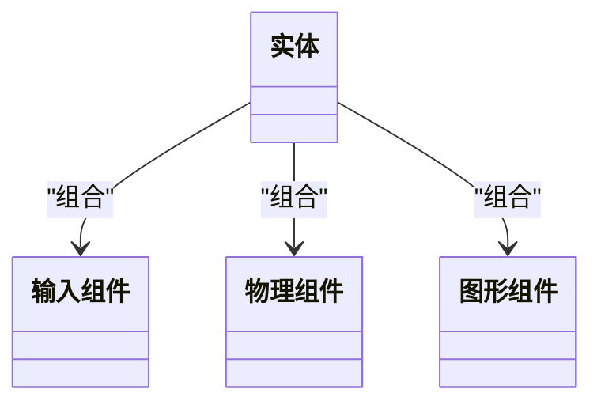

图表来源
- file://component/README.md#L33-L162

章节来源
- file://component/README.md#L19-L162

## 依赖关系分析
- 松耦合与分层
  - 业务委托通过服务定位器解耦客户端与具体服务
  - 服务层隔离表现层与数据访问层
  - 网关模式隔离外部系统差异
- 事件与通知
  - 服务层可触发通知，实现异步解耦
- 分布式与并发
  - 领导者选举与领导者-跟随者共同保障一致性与吞吐
- 建模与基础设施
  - 领域模型承载业务规则；上下文与会话贯穿多层
  - 组件模式支撑灵活的实体行为组合

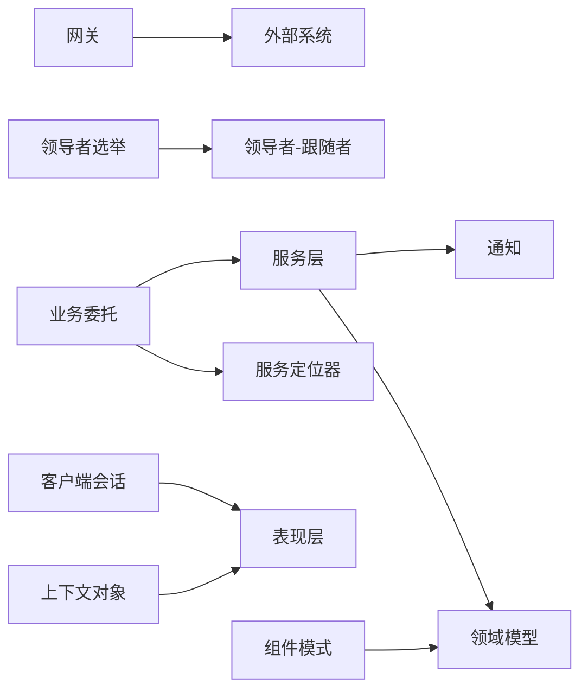

图表来源
- file://business-delegate/README.md#L184-L194
- file://service-locator/README.md#L122-L134
- file://service-layer/README.md#L387-L399
- file://domain-model/README.md#L264-L277
- file://notification/README.md#L121-L132
- file://gateway/README.md#L155-L167
- file://leader-election/README.md#L172-L184
- file://leader-followers/README.md#L163-L172
- file://context-object/README.md#L186-L198
- file://client-session/README.md#L133-L144
- file://component/README.md#L149-L162

## 性能考量
- 减少间接层与查找成本
  - 服务定位器应合理缓存；避免在热路径上频繁查找
- 并发与线程模型
  - 领导者-跟随者减少上下文切换；注意同步与唤醒策略
- 分布式一致性与延迟
  - 领导者选举需权衡一致性与可用性；结合心跳与仲裁
- 事件与通知
  - 控制事件风暴；确保幂等与重试策略
- 网关与外部系统
  - 结合超时、熔断与限流；避免网关成为瓶颈

## 故障排查指南
- 服务定位器
  - 症状：性能下降、查找失败
  - 排查：检查缓存命中率、定位器单点、查找器实现
- 业务委托
  - 症状：调用失败、远程异常
  - 排查：确认查找器返回的服务实例、网络连通性
- 服务层
  - 症状：事务不一致、性能抖动
  - 排查：事务边界、DAO 调用链、缓存一致性
- 通知（事件）
  - 症状：事件丢失、处理延迟
  - 排查：事件总线可用性、订阅者处理能力、重试与死信
- 领导者选举/领导者-跟随者
  - 症状：脑裂、性能下降
  - 排查：网络分区、心跳间隔、领导者轮换策略
- 网关
  - 症状：外部调用超时、协议不匹配
  - 排查：超时与重试、协议转换、外部系统健康度
- 客户端会话/上下文对象
  - 症状：状态不同步、安全问题
  - 排查：会话存储、加密与校验、跨设备同步策略

章节来源
- file://service-locator/README.md#L108-L134
- file://business-delegate/README.md#L170-L194
- file://service-layer/README.md#L372-L399
- file://notification/README.md#L108-L132
- file://leader-election/README.md#L158-L184
- file://leader-followers/README.md#L151-L172
- file://gateway/README.md#L142-L167
- file://client-session/README.md#L119-L144
- file://context-object/README.md#L173-L198

## 结论
本指南从企业集成、分布式协调、建模与基础设施四个维度，系统梳理了网关、服务定位器、业务委托、服务层、通知、领导者选举、领导者-跟随者、领域模型、类型对象、参数对象、客户端会话、上下文对象与组件模式的设计原则与实践要点。通过合理的分层与解耦、事件驱动与分布式协调、以及稳健的建模与基础设施，可以有效提升系统的可扩展性、可维护性与性能表现。

## 附录
- 相关模式与参考
  - 服务定位器与依赖注入、单例的关系
  - 业务委托与会话门面、复合实体的关联
  - 服务层与外观、DAO、MVC 的关系
  - 通知与命令、中介者、观察者的关联
  - 领导者选举与观察者、单例、状态模式的关联
  - 领导者-跟随者与半同步/半异步、线程池的关联
  - 领域模型与 DAO、仓储、单元工作的关联
  - 类型对象与工厂方法、策略、原型的关联
  - 参数对象与建造者、组合、工厂方法的关联
  - 客户端会话与服务端会话、状态、单例、状态模式的关联
  - 上下文对象与单例、策略、装饰器的关联
  - 组件模式与装饰器、享元、观察者的关联

章节来源
- file://service-locator/README.md#L122-L134
- file://business-delegate/README.md#L183-L194
- file://service-layer/README.md#L387-L399
- file://notification/README.md#L121-L132
- file://leader-election/README.md#L172-L184
- file://leader-followers/README.md#L163-L172
- file://domain-model/README.md#L264-L277
- file://type-object/README.md#L329-L341
- file://parameter-object/README.md#L162-L173
- file://client-session/README.md#L133-L144
- file://context-object/README.md#L186-L198
- file://component/README.md#L149-L162