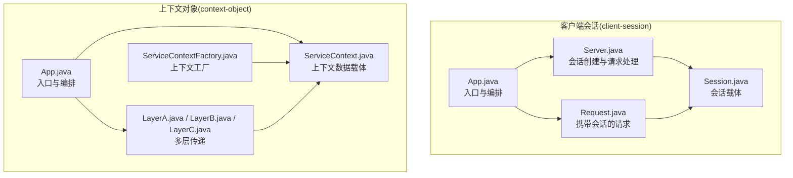
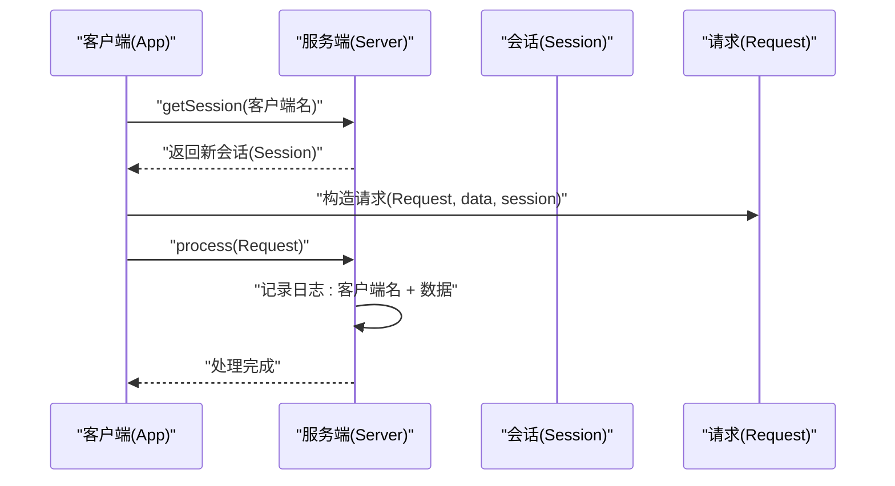
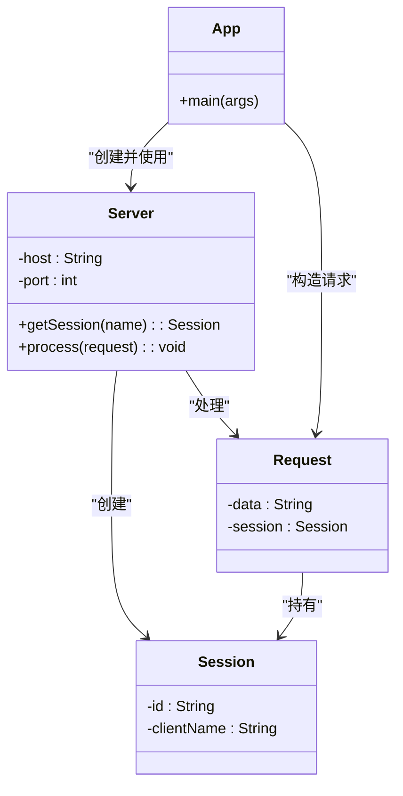
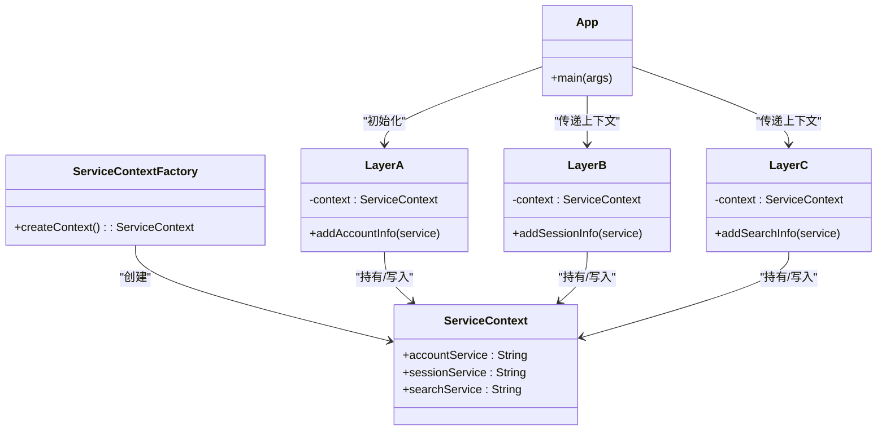
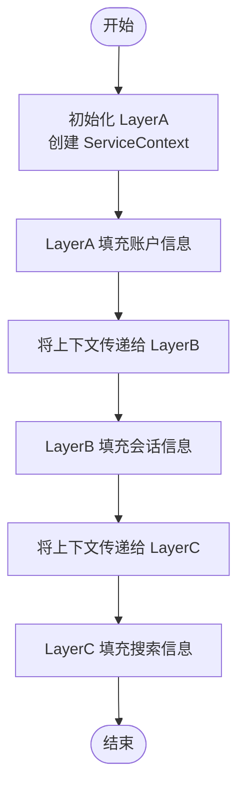
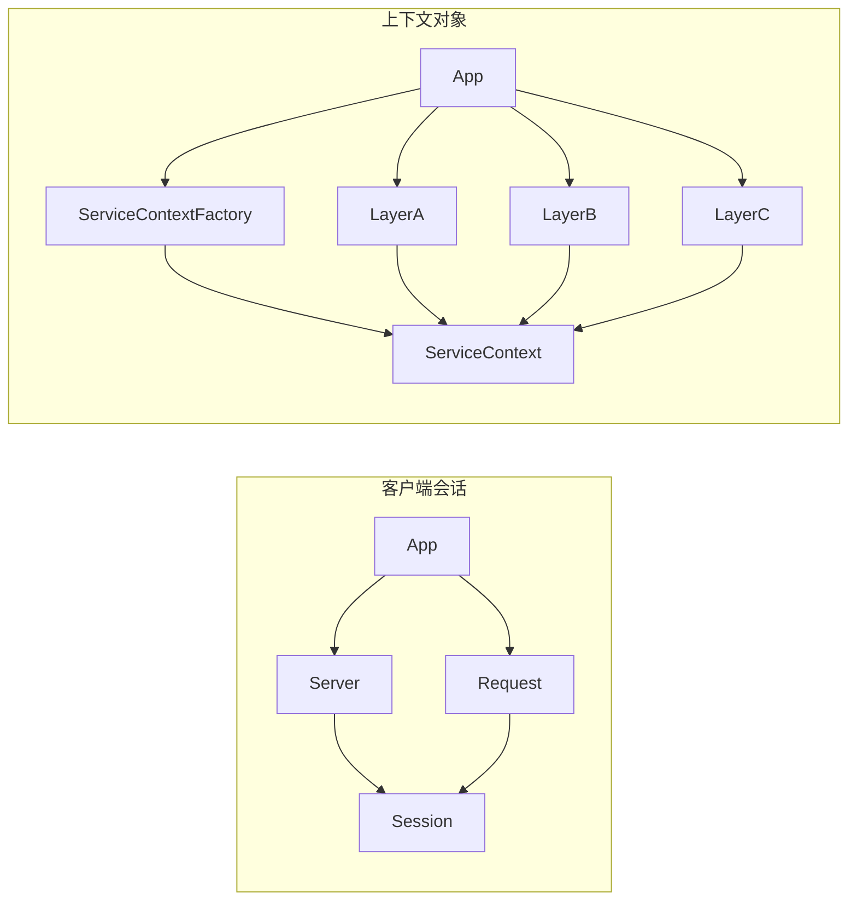

# 会话与上下文模式

<cite>
**本文引用的文件**
- [client-session/App.java](file://client-session/src/main/java/com/iluwatar/client/session/App.java)
- [client-session/Server.java](file://client-session/src/main/java/com/iluwatar/client/session/Server.java)
- [client-session/Session.java](file://client-session/src/main/java/com/iluwatar/client/session/Session.java)
- [client-session/Request.java](file://client-session/src/main/java/com/iluwatar/client/session/Request.java)
- [client-session/README.md](file://client-session/README.md)
- [context-object/App.java](file://context-object/src/main/java/com/iluwatar/context/object/App.java)
- [context-object/ServiceContext.java](file://context-object/src/main/java/com/iluwatar/context/object/ServiceContext.java)
- [context-object/ServiceContextFactory.java](file://context-object/src/main/java/com/iluwatar/context/object/ServiceContextFactory.java)
- [context-object/LayerA.java](file://context-object/src/main/java/com/iluwatar/context/object/LayerA.java)
- [context-object/LayerB.java](file://context-object/src/main/java/com/iluwatar/context/object/LayerB.java)
- [context-object/LayerC.java](file://context-object/src/main/java/com/iluwatar/context/object/LayerC.java)
- [context-object/README.md](file://context-object/README.md)
</cite>

## 目录
1. [引言](#引言)
2. [项目结构](#项目结构)
3. [核心组件](#核心组件)
4. [架构总览](#架构总览)
5. [详细组件分析](#详细组件分析)
6. [依赖关系分析](#依赖关系分析)
7. [性能考虑](#性能考虑)
8. [故障排查指南](#故障排查指南)
9. [结论](#结论)
10. [附录](#附录)

## 引言
本指南聚焦于企业应用中“会话与上下文”两类设计模式：服务器会话模式与客户端会话模式、上下文对象模式。我们将从代码结构、运行时控制流、数据传递与状态管理角度，系统阐述以下主题：
- 服务器会话模式在Web应用状态管理中的实现机制（生命周期与安全策略）
- 客户端会话模式在前后端分离架构中的应用（Cookie、Token等）
- 上下文对象模式在跨组件数据共享与状态传递中的设计原理
- 会话安全、性能优化与分布式会话管理的最佳实践
- 提供可直接参考的代码示例路径与架构设计建议

## 项目结构
本仓库中与“会话与上下文”直接相关的模块为 client-session 与 context-object。二者分别演示了“客户端会话”和“上下文对象”的典型用法。

图表来源
- [client-session/App.java](file://client-session/src/main/java/com/iluwatar/client/session/App.java#L39-L55)
- [client-session/Server.java](file://client-session/src/main/java/com/iluwatar/client/session/Server.java#L36-L65)
- [client-session/Session.java](file://client-session/src/main/java/com/iluwatar/client/session/Session.java#L34-L48)
- [client-session/Request.java](file://client-session/src/main/java/com/iluwatar/client/session/Request.java#L34-L42)
- [context-object/App.java](file://context-object/src/main/java/com/iluwatar/context/object/App.java#L38-L70)
- [context-object/ServiceContext.java](file://context-object/src/main/java/com/iluwatar/context/object/ServiceContext.java#L30-L40)
- [context-object/ServiceContextFactory.java](file://context-object/src/main/java/com/iluwatar/context/object/ServiceContextFactory.java#L27-L35)
- [context-object/LayerA.java](file://context-object/src/main/java/com/iluwatar/context/object/LayerA.java#L29-L44)
- [context-object/LayerB.java](file://context-object/src/main/java/com/iluwatar/context/object/LayerB.java#L29-L44)
- [context-object/LayerC.java](file://context-object/src/main/java/com/iluwatar/context/object/LayerC.java#L29-L44)

章节来源
- [client-session/App.java](file://client-session/src/main/java/com/iluwatar/client/session/App.java#L39-L55)
- [context-object/App.java](file://context-object/src/main/java/com/iluwatar/context/object/App.java#L38-L70)

## 核心组件
- 客户端会话(client-session)
  - Server：负责会话创建与请求处理
  - Session：承载会话标识与客户端名称
  - Request：封装业务数据与会话信息
  - App：演示如何创建多个会话并随请求发送到服务端
- 上下文对象(context-object)
  - ServiceContext：集中承载账户、会话、搜索等服务上下文
  - ServiceContextFactory：统一创建上下文实例
  - LayerA/B/C：按层次逐步填充上下文并在层间传递

章节来源
- [client-session/Server.java](file://client-session/src/main/java/com/iluwatar/client/session/Server.java#L36-L65)
- [client-session/Session.java](file://client-session/src/main/java/com/iluwatar/client/session/Session.java#L34-L48)
- [client-session/Request.java](file://client-session/src/main/java/com/iluwatar/client/session/Request.java#L34-L42)
- [client-session/App.java](file://client-session/src/main/java/com/iluwatar/client/session/App.java#L39-L55)
- [context-object/ServiceContext.java](file://context-object/src/main/java/com/iluwatar/context/object/ServiceContext.java#L30-L40)
- [context-object/ServiceContextFactory.java](file://context-object/src/main/java/com/iluwatar/context/object/ServiceContextFactory.java#L27-L35)
- [context-object/LayerA.java](file://context-object/src/main/java/com/iluwatar/context/object/LayerA.java#L29-L44)
- [context-object/LayerB.java](file://context-object/src/main/java/com/iluwatar/context/object/LayerB.java#L29-L44)
- [context-object/LayerC.java](file://context-object/src/main/java/com/iluwatar/context/object/LayerC.java#L29-L44)

## 架构总览
下面以序列图展示“客户端会话”在请求处理中的调用链路，体现会话生命周期与状态传递：

图表来源
- [client-session/App.java](file://client-session/src/main/java/com/iluwatar/client/session/App.java#L46-L54)
- [client-session/Server.java](file://client-session/src/main/java/com/iluwatar/client/session/Server.java#L52-L63)
- [client-session/Session.java](file://client-session/src/main/java/com/iluwatar/client/session/Session.java#L34-L48)
- [client-session/Request.java](file://client-session/src/main/java/com/iluwatar/client/session/Request.java#L34-L42)

## 详细组件分析

### 客户端会话模式（Client-Session）
该模式将会话数据存储在客户端，并在每次请求时随请求发送至服务端，从而减少服务端状态存储压力。其关键点包括：
- 会话创建：由服务端生成唯一会话标识与客户端名称
- 请求封装：每个请求携带当前会话，便于服务端识别与处理
- 生命周期：会话在服务端仅用于请求处理期间识别用户，不长期驻留

图表来源
- [client-session/App.java](file://client-session/src/main/java/com/iluwatar/client/session/App.java#L39-L55)
- [client-session/Server.java](file://client-session/src/main/java/com/iluwatar/client/session/Server.java#L36-L65)
- [client-session/Session.java](file://client-session/src/main/java/com/iluwatar/client/session/Session.java#L34-L48)
- [client-session/Request.java](file://client-session/src/main/java/com/iluwatar/client/session/Request.java#L34-L42)

章节来源
- [client-session/README.md](file://client-session/README.md#L18-L31)
- [client-session/App.java](file://client-session/src/main/java/com/iluwatar/client/session/App.java#L39-L55)
- [client-session/Server.java](file://client-session/src/main/java/com/iluwatar/client/session/Server.java#L52-L63)
- [client-session/Session.java](file://client-session/src/main/java/com/iluwatar/client/session/Session.java#L34-L48)
- [client-session/Request.java](file://client-session/src/main/java/com/iluwatar/client/session/Request.java#L34-L42)

### 上下文对象模式（Context Object）
该模式通过一个协议无关的上下文对象在不同系统层级之间传递与共享状态，降低环境耦合度，提升可维护性。其关键点包括：
- 集中式上下文：ServiceContext 聚合各层所需信息
- 工厂化创建：ServiceContextFactory 统一创建上下文实例
- 层间传递：LayerA/B/C 逐层填充并向下传递上下文

图表来源
- [context-object/ServiceContext.java](file://context-object/src/main/java/com/iluwatar/context/object/ServiceContext.java#L30-L40)
- [context-object/ServiceContextFactory.java](file://context-object/src/main/java/com/iluwatar/context/object/ServiceContextFactory.java#L27-L35)
- [context-object/LayerA.java](file://context-object/src/main/java/com/iluwatar/context/object/LayerA.java#L29-L44)
- [context-object/LayerB.java](file://context-object/src/main/java/com/iluwatar/context/object/LayerB.java#L29-L44)
- [context-object/LayerC.java](file://context-object/src/main/java/com/iluwatar/context/object/LayerC.java#L29-L44)
- [context-object/App.java](file://context-object/src/main/java/com/iluwatar/context/object/App.java#L38-L70)

章节来源
- [context-object/README.md](file://context-object/README.md#L21-L38)
- [context-object/App.java](file://context-object/src/main/java/com/iluwatar/context/object/App.java#L38-L70)
- [context-object/ServiceContext.java](file://context-object/src/main/java/com/iluwatar/context/object/ServiceContext.java#L30-L40)
- [context-object/ServiceContextFactory.java](file://context-object/src/main/java/com/iluwatar/context/object/ServiceContextFactory.java#L27-L35)
- [context-object/LayerA.java](file://context-object/src/main/java/com/iluwatar/context/object/LayerA.java#L29-L44)
- [context-object/LayerB.java](file://context-object/src/main/java/com/iluwatar/context/object/LayerB.java#L29-L44)
- [context-object/LayerC.java](file://context-object/src/main/java/com/iluwatar/context/object/LayerC.java#L29-L44)

### 复杂逻辑流程（上下文对象在多层传递）
以下流程图展示了上下文对象在三层之间的累积填充过程，体现“按需扩展、按层传递”的设计思想。

图表来源
- [context-object/App.java](file://context-object/src/main/java/com/iluwatar/context/object/App.java#L47-L65)
- [context-object/LayerA.java](file://context-object/src/main/java/com/iluwatar/context/object/LayerA.java#L37-L43)
- [context-object/LayerB.java](file://context-object/src/main/java/com/iluwatar/context/object/LayerB.java#L37-L43)
- [context-object/LayerC.java](file://context-object/src/main/java/com/iluwatar/context/object/LayerC.java#L37-L43)

## 依赖关系分析
- 客户端会话
  - App 依赖 Server 与 Request；Server 依赖 Session；Request 持有 Session
- 上下文对象
  - LayerA/B/C 依赖 ServiceContextFactory 与 ServiceContext；App 依次初始化并传递上下文

图表来源
- [client-session/App.java](file://client-session/src/main/java/com/iluwatar/client/session/App.java#L39-L55)
- [client-session/Server.java](file://client-session/src/main/java/com/iluwatar/client/session/Server.java#L52-L63)
- [client-session/Session.java](file://client-session/src/main/java/com/iluwatar/client/session/Session.java#L34-L48)
- [client-session/Request.java](file://client-session/src/main/java/com/iluwatar/client/session/Request.java#L34-L42)
- [context-object/App.java](file://context-object/src/main/java/com/iluwatar/context/object/App.java#L38-L70)
- [context-object/ServiceContextFactory.java](file://context-object/src/main/java/com/iluwatar/context/object/ServiceContextFactory.java#L30-L34)
- [context-object/ServiceContext.java](file://context-object/src/main/java/com/iluwatar/context/object/ServiceContext.java#L30-L40)
- [context-object/LayerA.java](file://context-object/src/main/java/com/iluwatar/context/object/LayerA.java#L33-L43)
- [context-object/LayerB.java](file://context-object/src/main/java/com/iluwatar/context/object/LayerB.java#L33-L43)
- [context-object/LayerC.java](file://context-object/src/main/java/com/iluwatar/context/object/LayerC.java#L33-L43)

章节来源
- [client-session/App.java](file://client-session/src/main/java/com/iluwatar/client/session/App.java#L39-L55)
- [context-object/App.java](file://context-object/src/main/java/com/iluwatar/context/object/App.java#L38-L70)

## 性能考虑
- 客户端会话
  - 优点：减少服务端内存占用，适合无状态或弱状态的服务端架构
  - 注意：客户端数据传输增加带宽开销；需要对敏感字段进行加密与校验
- 上下文对象
  - 优点：集中管理上下文，避免参数层层传递导致的代码膨胀
  - 注意：上下文过大可能带来序列化/拷贝成本；应按需填充，避免冗余字段

[本节为通用指导，无需列出具体文件来源]

## 故障排查指南
- 客户端会话
  - 现象：服务端无法识别客户端或日志输出异常
  - 排查要点：确认 Request 是否正确携带 Session；确认 Server 的 getSession 返回值是否被正确使用
- 上下文对象
  - 现象：某一层读取不到预期上下文
  - 排查要点：确认 ServiceContextFactory 是否被调用；确认 LayerA/B/C 的上下文传递链路是否完整

章节来源
- [client-session/Server.java](file://client-session/src/main/java/com/iluwatar/client/session/Server.java#L61-L63)
- [context-object/App.java](file://context-object/src/main/java/com/iluwatar/context/object/App.java#L67-L69)

## 结论
- 客户端会话模式适用于前端可控、服务端无状态的场景，通过在请求中携带会话标识实现用户识别与个性化；需重视客户端数据的安全性与完整性校验。
- 上下文对象模式通过集中式上下文在多层之间传递，显著降低耦合度与参数传播复杂度；应遵循“按需填充、最小化上下文”的原则。
- 在企业级应用中，可结合两者：服务端侧采用安全的会话管理（如基于令牌的会话），前端侧通过上下文对象统一传递请求上下文，形成清晰的职责边界与可维护的数据流。

[本节为总结性内容，无需列出具体文件来源]

## 附录
- 参考示例路径
  - 客户端会话
    - [App.java](file://client-session/src/main/java/com/iluwatar/client/session/App.java#L39-L55)
    - [Server.java](file://client-session/src/main/java/com/iluwatar/client/session/Server.java#L52-L63)
    - [Session.java](file://client-session/src/main/java/com/iluwatar/client/session/Session.java#L34-L48)
    - [Request.java](file://client-session/src/main/java/com/iluwatar/client/session/Request.java#L34-L42)
  - 上下文对象
    - [App.java](file://context-object/src/main/java/com/iluwatar/context/object/App.java#L38-L70)
    - [ServiceContext.java](file://context-object/src/main/java/com/iluwatar/context/object/ServiceContext.java#L30-L40)
    - [ServiceContextFactory.java](file://context-object/src/main/java/com/iluwatar/context/object/ServiceContextFactory.java#L27-L35)
    - [LayerA.java](file://context-object/src/main/java/com/iluwatar/context/object/LayerA.java#L29-L44)
    - [LayerB.java](file://context-object/src/main/java/com/iluwatar/context/object/LayerB.java#L29-L44)
    - [LayerC.java](file://context-object/src/main/java/com/iluwatar/context/object/LayerC.java#L29-L44)

[本节为补充说明，无需列出具体文件来源]