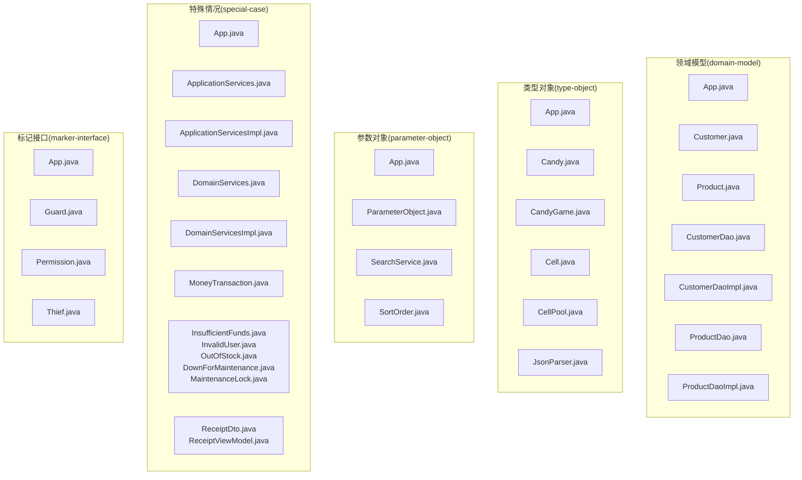
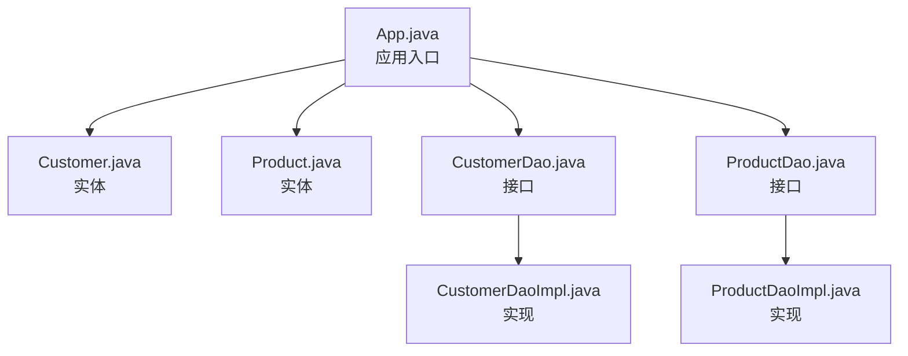
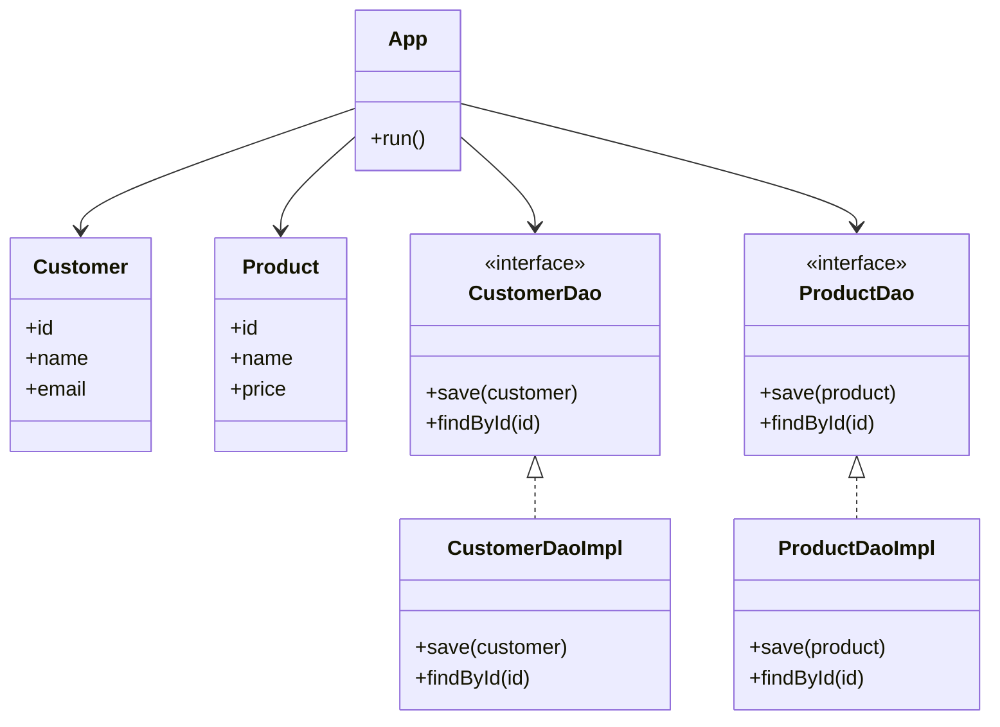
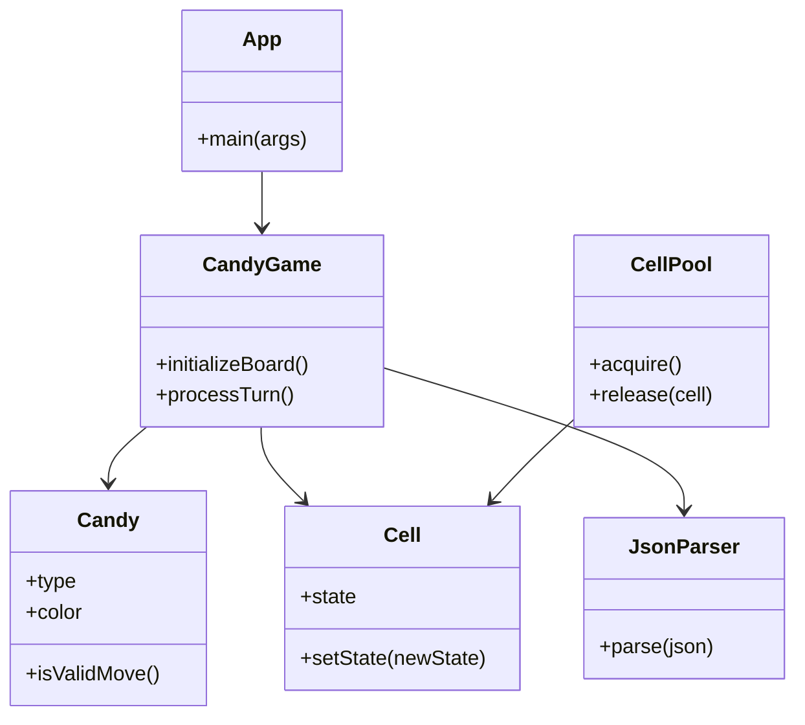
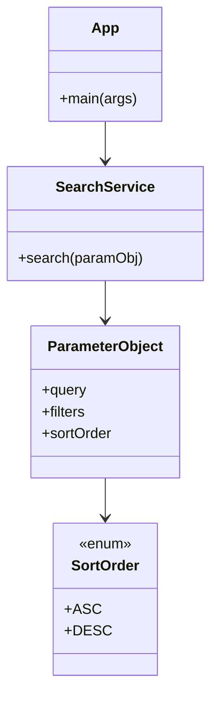
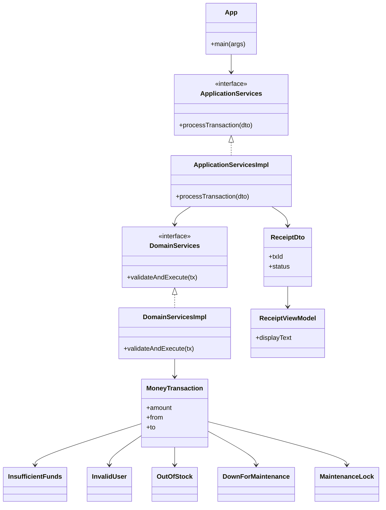
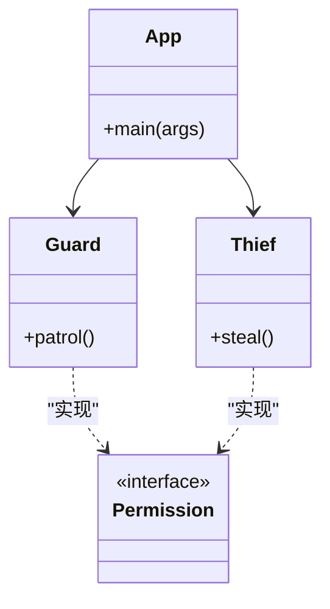
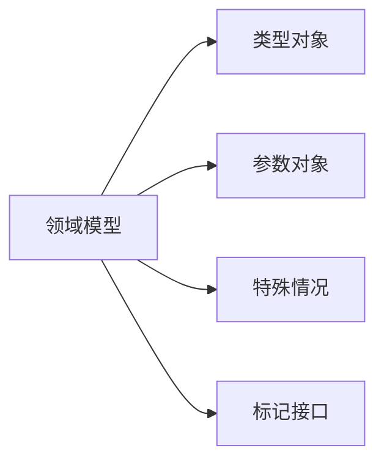

# 建模模式

<cite>
**本文引用的文件**
- [README.md](file://README.md)
- [domain-model/README.md](file://domain-model/README.md)
- [domain-model/src/main/java/com/iluwatar/domainmodel/App.java](file://domain-model/src/main/java/com/iluwatar/domainmodel/App.java)
- [domain-model/src/main/java/com/iluwatar/domainmodel/Customer.java](file://domain-model/src/main/java/com/iluwatar/domainmodel/Customer.java)
- [domain-model/src/main/java/com/iluwatar/domainmodel/Product.java](file://domain-model/src/main/java/com/iluwatar/domainmodel/Product.java)
- [domain-model/src/main/java/com/iluwatar/domainmodel/CustomerDao.java](file://domain-model/src/main/java/com/iluwatar/domainmodel/CustomerDao.java)
- [domain-model/src/main/java/com/iluwatar/domainmodel/CustomerDaoImpl.java](file://domain-model/src/main/java/com/iluwatar/domainmodel/CustomerDaoImpl.java)
- [domain-model/src/main/java/com/iluwatar/domainmodel/ProductDao.java](file://domain-model/src/main/java/com/iluwatar/domainmodel/ProductDao.java)
- [domain-model/src/main/java/com/iluwatar/domainmodel/ProductDaoImpl.java](file://domain-model/src/main/java/com/iluwatar/domainmodel/ProductDaoImpl.java)
- [domain-model/src/test/java/com/iluwatar/domainmodel/CustomerTest.java](file://domain-model/src/test/java/com/iluwatar/domainmodel/CustomerTest.java)
- [domain-model/src/test/java/com/iluwatar/domainmodel/ProductTest.java](file://domain-model/src/test/java/com/iluwatar/domainmodel/ProductTest.java)
- [type-object/README.md](file://type-object/README.md)
- [type-object/src/main/java/com/iluwatar/typeobject/App.java](file://type-object/src/main/java/com/iluwatar/typeobject/App.java)
- [type-object/src/main/java/com/iluwatar/typeobject/Candy.java](file://type-object/src/main/java/com/iluwatar/typeobject/Candy.java)
- [type-object/src/main/java/com/iluwatar/typeobject/CandyGame.java](file://type-object/src/main/java/com/iluwatar/typeobject/CandyGame.java)
- [type-object/src/main/java/com/iluwatar/typeobject/Cell.java](file://type-object/src/main/java/com/iluwatar/typeobject/Cell.java)
- [type-object/src/main/java/com/iluwatar/typeobject/CellPool.java](file://type-object/src/main/java/com/iluwatar/typeobject/CellPool.java)
- [type-object/src/main/java/com/iluwatar/typeobject/JsonParser.java](file://type-object/src/main/java/com/iluwatar/typeobject/JsonParser.java)
- [parameter-object/README.md](file://parameter-object/README.md)
- [parameter-object/src/main/java/com/iluwatar/parameter/object/App.java](file://parameter-object/src/main/java/com/iluwatar/parameter/object/App.java)
- [parameter-object/src/main/java/com/iluwatar/parameter/object/ParameterObject.java](file://parameter-object/src/main/java/com/iluwatar/parameter/object/ParameterObject.java)
- [parameter-object/src/main/java/com/iluwatar/parameter/object/SearchService.java](file://parameter-object/src/main/java/com/iluwatar/parameter/object/SearchService.java)
- [parameter-object/src/main/java/com/iluwatar/parameter/object/SortOrder.java](file://parameter-object/src/main/java/com/iluwatar/parameter/object/SortOrder.java)
- [special-case/README.md](file://special-case/README.md)
- [special-case/src/main/java/com/iluwatar/specialcase/App.java](file://special-case/src/main/java/com/iluwatar/specialcase/App.java)
- [special-case/src/main/java/com/iluwatar/specialcase/ApplicationServices.java](file://special-case/src/main/java/com/iluwatar/specialcase/ApplicationServices.java)
- [special-case/src/main/java/com/iluwatar/specialcase/ApplicationServicesImpl.java](file://special-case/src/main/java/com/iluwatar/specialcase/ApplicationServicesImpl.java)
- [special-case/src/main/java/com/iluwatar/specialcase/DomainServices.java](file://special-case/src/main/java/com/iluwatar/specialcase/DomainServices.java)
- [special-case/src/main/java/com/iluwatar/specialcase/DomainServicesImpl.java](file://special-case/src/main/java/com/iluwatar/specialcase/DomainServicesImpl.java)
- [special-case/src/main/java/com/iluwatar/specialcase/MoneyTransaction.java](file://special-case/src/main/java/com/iluwatar/specialcase/MoneyTransaction.java)
- [special-case/src/main/java/com/iluwatar/specialcase/ReceiptDto.java](file://special-case/src/main/java/com/iluwatar/specialcase/ReceiptDto.java)
- [special-case/src/main/java/com/iluwatar/specialcase/ReceiptViewModel.java](file://special-case/src/main/java/com/iluwatar/specialcase/ReceiptViewModel.java)
- [special-case/src/main/java/com/iluwatar/specialcase/InsufficientFunds.java](file://special-case/src/main/java/com/iluwatar/specialcase/InsufficientFunds.java)
- [special-case/src/main/java/com/iluwatar/specialcase/InvalidUser.java](file://special-case/src/main/java/com/iluwatar/specialcase/InvalidUser.java)
- [special-case/src/main/java/com/iluwatar/specialcase/OutOfStock.java](file://special-case/src/main/java/com/iluwatar/specialcase/OutOfStock.java)
- [special-case/src/main/java/com/iluwatar/specialcase/DownForMaintenance.java](file://special-case/src/main/java/com/iluwatar/specialcase/DownForMaintenance.java)
- [special-case/src/main/java/com/iluwatar/specialcase/MaintenanceLock.java](file://special-case/src/main/java/com/iluwatar/specialcase/MaintenanceLock.java)
- [marker-interface/README.md](file://marker-interface/README.md)
- [marker-interface/src/main/java/App.java](file://marker-interface/src/main/java/App.java)
- [marker-interface/src/main/java/Guard.java](file://marker-interface/src/main/java/Guard.java)
- [marker-interface/src/main/java/Permission.java](file://marker-interface/src/main/java/Permission.java)
- [marker-interface/src/main/java/Thief.java](file://marker-interface/src/main/java/Thief.java)
</cite>

## 目录
1. [引言](#引言)
2. [项目结构](#项目结构)
3. [核心组件](#核心组件)
4. [架构总览](#架构总览)
5. [详细组件分析](#详细组件分析)
6. [依赖分析](#依赖分析)
7. [性能考虑](#性能考虑)
8. [故障排除指南](#故障排除指南)
9. [结论](#结论)
10. [附录](#附录)

## 引言
本指南聚焦于企业应用建模中的关键模式：领域模型模式（实体、值对象、领域服务）、类型对象模式（状态与行为封装）、参数对象模式（简化方法签名与提升可读性）、特殊情况模式（边界与异常处理）、标记接口模式（类型标识与功能标注）。通过仓库中“领域模型”“类型对象”“参数对象”“特殊情况”“标记接口”等模块的源码与测试用例，系统梳理这些模式在业务建模与对象设计中的落地方式，并提供面向实践的最佳实践与排错建议。

## 项目结构
本仓库采用多模块组织，每个模块独立演示一种或一组设计模式。与本指南相关的模块如下：
- 领域模型（domain-model）：演示实体、值对象与DAO协作的典型业务建模。
- 类型对象（type-object）：演示通过“类型对象”管理状态与行为。
- 参数对象（parameter-object）：演示将多个参数封装为对象以简化方法签名。
- 特殊情况（special-case）：演示对异常与边界条件进行建模与处理。
- 标记接口（marker-interface）：演示通过空接口实现类型标识与功能标注。

**图表来源**
- [domain-model/src/main/java/com/iluwatar/domainmodel/App.java](file://domain-model/src/main/java/com/iluwatar/domainmodel/App.java#L1-L200)
- [type-object/src/main/java/com/iluwatar/typeobject/App.java](file://type-object/src/main/java/com/iluwatar/typeobject/App.java#L1-L200)
- [parameter-object/src/main/java/com/iluwatar/parameter/object/App.java](file://parameter-object/src/main/java/com/iluwatar/parameter/object/App.java#L1-L200)
- [special-case/src/main/java/com/iluwatar/specialcase/App.java](file://special-case/src/main/java/com/iluwatar/specialcase/App.java#L1-L200)
- [marker-interface/src/main/java/App.java](file://marker-interface/src/main/java/App.java#L1-L200)

**章节来源**
- [README.md](file://README.md#L1-L200)
- [domain-model/README.md](file://domain-model/README.md#L1-L200)
- [type-object/README.md](file://type-object/README.md#L1-L200)
- [parameter-object/README.md](file://parameter-object/README.md#L1-L200)
- [special-case/README.md](file://special-case/README.md#L1-L200)
- [marker-interface/README.md](file://marker-interface/README.md#L1-L200)

## 核心组件
本节从“领域模型模式”出发，系统阐述实体、值对象与领域服务的设计原则，并结合仓库中的具体类进行说明。

- 实体（Entity）
  - 职责：承载唯一标识与可变状态，贯穿业务生命周期。
  - 设计要点：保持稳定的身份标识；封装可变状态；避免过度暴露内部字段。
  - 示例参考：领域模型模块中的客户与产品实体类，体现身份标识与业务属性分离。

- 值对象（Value Object）
  - 职责：描述业务概念的不可变特征，强调相等性基于属性而非身份。
  - 设计要点：不可变；自包含；可共享；相等性判断仅比较属性。
  - 示例参考：领域模型模块中的地址、货币金额等可作为值对象的候选。

- 领域服务（Domain Service）
  - 职责：封装跨实体或跨值对象的业务逻辑，体现无状态的业务能力。
  - 设计要点：无状态；纯函数式或幂等；关注业务语义而非数据访问。
  - 示例参考：领域模型模块中的DAO实现，承担持久化与查询职责；可进一步抽象出领域服务以封装复杂业务流程。

**章节来源**
- [domain-model/src/main/java/com/iluwatar/domainmodel/Customer.java](file://domain-model/src/main/java/com/iluwatar/domainmodel/Customer.java#L1-L200)
- [domain-model/src/main/java/com/iluwatar/domainmodel/Product.java](file://domain-model/src/main/java/com/iluwatar/domainmodel/Product.java#L1-L200)
- [domain-model/src/main/java/com/iluwatar/domainmodel/CustomerDaoImpl.java](file://domain-model/src/main/java/com/iluwatar/domainmodel/CustomerDaoImpl.java#L1-L200)
- [domain-model/src/main/java/com/iluwatar/domainmodel/ProductDaoImpl.java](file://domain-model/src/main/java/com/iluwatar/domainmodel/ProductDaoImpl.java#L1-L200)

## 架构总览
下图展示了“领域模型”模块中应用、实体与DAO之间的交互关系，体现典型的分层与职责划分。

**图表来源**
- [domain-model/src/main/java/com/iluwatar/domainmodel/App.java](file://domain-model/src/main/java/com/iluwatar/domainmodel/App.java#L1-L200)
- [domain-model/src/main/java/com/iluwatar/domainmodel/Customer.java](file://domain-model/src/main/java/com/iluwatar/domainmodel/Customer.java#L1-L200)
- [domain-model/src/main/java/com/iluwatar/domainmodel/Product.java](file://domain-model/src/main/java/com/iluwatar/domainmodel/Product.java#L1-L200)
- [domain-model/src/main/java/com/iluwatar/domainmodel/CustomerDao.java](file://domain-model/src/main/java/com/iluwatar/domainmodel/CustomerDao.java#L1-L200)
- [domain-model/src/main/java/com/iluwatar/domainmodel/CustomerDaoImpl.java](file://domain-model/src/main/java/com/iluwatar/domainmodel/CustomerDaoImpl.java#L1-L200)
- [domain-model/src/main/java/com/iluwatar/domainmodel/ProductDao.java](file://domain-model/src/main/java/com/iluwatar/domainmodel/ProductDao.java#L1-L200)
- [domain-model/src/main/java/com/iluwatar/domainmodel/ProductDaoImpl.java](file://domain-model/src/main/java/com/iluwatar/domainmodel/ProductDaoImpl.java#L1-L200)

## 详细组件分析

### 领域模型模式：实体、值对象与领域服务
- 实体与值对象的区分
  - 实体应具备唯一标识与可变状态，适合封装在实体类中；值对象强调不可变与属性相等性，适合封装在值对象类中。
  - 在领域模型模块中，实体类与DAO实现体现了“数据持久化”的职责分离。

- 领域服务的抽象
  - 将跨实体的业务逻辑抽取到领域服务中，避免在实体或DAO中堆积业务规则。
  - 可结合测试用例验证业务规则的正确性与可维护性。

- 数据访问与事务
  - DAO接口与实现分离，便于替换存储与扩展事务控制策略。

**图表来源**
- [domain-model/src/main/java/com/iluwatar/domainmodel/App.java](file://domain-model/src/main/java/com/iluwatar/domainmodel/App.java#L1-L200)
- [domain-model/src/main/java/com/iluwatar/domainmodel/Customer.java](file://domain-model/src/main/java/com/iluwatar/domainmodel/Customer.java#L1-L200)
- [domain-model/src/main/java/com/iluwatar/domainmodel/Product.java](file://domain-model/src/main/java/com/iluwatar/domainmodel/Product.java#L1-L200)
- [domain-model/src/main/java/com/iluwatar/domainmodel/CustomerDao.java](file://domain-model/src/main/java/com/iluwatar/domainmodel/CustomerDao.java#L1-L200)
- [domain-model/src/main/java/com/iluwatar/domainmodel/CustomerDaoImpl.java](file://domain-model/src/main/java/com/iluwatar/domainmodel/CustomerDaoImpl.java#L1-L200)
- [domain-model/src/main/java/com/iluwatar/domainmodel/ProductDao.java](file://domain-model/src/main/java/com/iluwatar/domainmodel/ProductDao.java#L1-L200)
- [domain-model/src/main/java/com/iluwatar/domainmodel/ProductDaoImpl.java](file://domain-model/src/main/java/com/iluwatar/domainmodel/ProductDaoImpl.java#L1-L200)

**章节来源**
- [domain-model/src/main/java/com/iluwatar/domainmodel/CustomerTest.java](file://domain-model/src/test/java/com/iluwatar/domainmodel/CustomerTest.java#L1-L200)
- [domain-model/src/main/java/com/iluwatar/domainmodel/ProductTest.java](file://domain-model/src/test/java/com/iluwatar/domainmodel/ProductTest.java#L1-L200)

### 类型对象模式：状态管理与行为封装
- 模式要点
  - 使用“类型对象”统一管理状态与行为，避免分散的状态判断与重复逻辑。
  - 通过池化或工厂减少对象创建开销，提升运行时性能。

- 典型应用
  - 游戏棋盘单元（Cell）与糖果类型（Candy）：通过类型对象封装状态与转换逻辑，使状态机清晰可维护。
  - JSON解析器（JsonParser）：将配置或状态映射为类型对象，便于扩展与测试。

**图表来源**
- [type-object/src/main/java/com/iluwatar/typeobject/App.java](file://type-object/src/main/java/com/iluwatar/typeobject/App.java#L1-L200)
- [type-object/src/main/java/com/iluwatar/typeobject/Candy.java](file://type-object/src/main/java/com/iluwatar/typeobject/Candy.java#L1-L200)
- [type-object/src/main/java/com/iluwatar/typeobject/CandyGame.java](file://type-object/src/main/java/com/iluwatar/typeobject/CandyGame.java#L1-L200)
- [type-object/src/main/java/com/iluwatar/typeobject/Cell.java](file://type-object/src/main/java/com/iluwatar/typeobject/Cell.java#L1-L200)
- [type-object/src/main/java/com/iluwatar/typeobject/CellPool.java](file://type-object/src/main/java/com/iluwatar/typeobject/CellPool.java#L1-L200)
- [type-object/src/main/java/com/iluwatar/typeobject/JsonParser.java](file://type-object/src/main/java/com/iluwatar/typeobject/JsonParser.java#L1-L200)

**章节来源**
- [type-object/README.md](file://type-object/README.md#L1-L200)

### 参数对象模式：简化方法签名与提升可读性
- 模式要点
  - 将多个相关参数封装为单一对象，降低方法签名复杂度，增强可读性与可维护性。
  - 通过枚举或常量定义排序方向等策略，使调用端意图更明确。

- 典型应用
  - 搜索服务（SearchService）接收一个参数对象，集中表达查询条件与排序策略。
  - 排序方向（SortOrder）作为策略枚举，配合参数对象提升可扩展性。

**图表来源**
- [parameter-object/src/main/java/com/iluwatar/parameter/object/App.java](file://parameter-object/src/main/java/com/iluwatar/parameter/object/App.java#L1-L200)
- [parameter-object/src/main/java/com/iluwatar/parameter/object/ParameterObject.java](file://parameter-object/src/main/java/com/iluwatar/parameter/object/ParameterObject.java#L1-L200)
- [parameter-object/src/main/java/com/iluwatar/parameter/object/SearchService.java](file://parameter-object/src/main/java/com/iluwatar/parameter/object/SearchService.java#L1-L200)
- [parameter-object/src/main/java/com/iluwatar/parameter/object/SortOrder.java](file://parameter-object/src/main/java/com/iluwatar/parameter/object/SortOrder.java#L1-L200)

**章节来源**
- [parameter-object/README.md](file://parameter-object/README.md#L1-L200)

### 特殊情况模式：边界条件与异常建模
- 模式要点
  - 将异常与边界条件建模为独立类型，便于统一处理与测试覆盖。
  - 通过DTO与视图模型分离业务数据与展示数据，降低耦合。

- 典型应用
  - 交易流程（MoneyTransaction）与异常类型（资金不足、用户无效、缺货、维护中、锁定）：通过异常类型建模，确保错误路径清晰可控。
  - 应用服务与领域服务分离：前者负责编排与DTO转换，后者专注领域规则。

**图表来源**
- [special-case/src/main/java/com/iluwatar/specialcase/App.java](file://special-case/src/main/java/com/iluwatar/specialcase/App.java#L1-L200)
- [special-case/src/main/java/com/iluwatar/specialcase/ApplicationServices.java](file://special-case/src/main/java/com/iluwatar/specialcase/ApplicationServices.java#L1-L200)
- [special-case/src/main/java/com/iluwatar/specialcase/ApplicationServicesImpl.java](file://special-case/src/main/java/com/iluwatar/specialcase/ApplicationServicesImpl.java#L1-L200)
- [special-case/src/main/java/com/iluwatar/specialcase/DomainServices.java](file://special-case/src/main/java/com/iluwatar/specialcase/DomainServices.java#L1-L200)
- [special-case/src/main/java/com/iluwatar/specialcase/DomainServicesImpl.java](file://special-case/src/main/java/com/iluwatar/specialcase/DomainServicesImpl.java#L1-L200)
- [special-case/src/main/java/com/iluwatar/specialcase/MoneyTransaction.java](file://special-case/src/main/java/com/iluwatar/specialcase/MoneyTransaction.java#L1-L200)
- [special-case/src/main/java/com/iluwatar/specialcase/ReceiptDto.java](file://special-case/src/main/java/com/iluwatar/specialcase/ReceiptDto.java#L1-L200)
- [special-case/src/main/java/com/iluwatar/specialcase/ReceiptViewModel.java](file://special-case/src/main/java/com/iluwatar/specialcase/ReceiptViewModel.java#L1-L200)
- [special-case/src/main/java/com/iluwatar/specialcase/InsufficientFunds.java](file://special-case/src/main/java/com/iluwatar/specialcase/InsufficientFunds.java#L1-L200)
- [special-case/src/main/java/com/iluwatar/specialcase/InvalidUser.java](file://special-case/src/main/java/com/iluwatar/specialcase/InvalidUser.java#L1-L200)
- [special-case/src/main/java/com/iluwatar/specialcase/OutOfStock.java](file://special-case/src/main/java/com/iluwatar/specialcase/OutOfStock.java#L1-L200)
- [special-case/src/main/java/com/iluwatar/specialcase/DownForMaintenance.java](file://special-case/src/main/java/com/iluwatar/specialcase/DownForMaintenance.java#L1-L200)
- [special-case/src/main/java/com/iluwatar/specialcase/MaintenanceLock.java](file://special-case/src/main/java/com/iluwatar/specialcase/MaintenanceLock.java#L1-L200)

**章节来源**
- [special-case/README.md](file://special-case/README.md#L1-L200)

### 标记接口模式：类型标识与功能标注
- 模式要点
  - 使用空接口（标记接口）进行类型标识与功能标注，避免继承层次膨胀。
  - 结合权限控制或行为约束，通过标记接口实现差异化处理。

- 典型应用
  - 权限标记（Permission）：用于标识具备特定权限的对象，便于在运行时进行安全检查或行为裁剪。
  - 角色与行为：守卫（Guard）与小偷（Thief）通过标记接口体现不同角色的行为约束。

**图表来源**
- [marker-interface/src/main/java/App.java](file://marker-interface/src/main/java/App.java#L1-L200)
- [marker-interface/src/main/java/Guard.java](file://marker-interface/src/main/java/Guard.java#L1-L200)
- [marker-interface/src/main/java/Thief.java](file://marker-interface/src/main/java/Thief.java#L1-L200)
- [marker-interface/src/main/java/Permission.java](file://marker-interface/src/main/java/Permission.java#L1-L200)

**章节来源**
- [marker-interface/README.md](file://marker-interface/README.md#L1-L200)

## 依赖分析
- 模块内聚与解耦
  - 各模块均采用清晰的分层与职责划分，接口与实现分离，便于替换与扩展。
- 外部依赖
  - 本指南涉及的模块均为示例性质，未引入外部框架依赖，便于理解核心思想。

**图表来源**
- [domain-model/README.md](file://domain-model/README.md#L1-L200)
- [type-object/README.md](file://type-object/README.md#L1-L200)
- [parameter-object/README.md](file://parameter-object/README.md#L1-L200)
- [special-case/README.md](file://special-case/README.md#L1-L200)
- [marker-interface/README.md](file://marker-interface/README.md#L1-L200)

## 性能考虑
- 对象创建与复用
  - 类型对象模式中的对象池（如CellPool）可显著降低频繁创建/销毁带来的GC压力。
- 方法签名与可读性
  - 参数对象模式通过封装参数，减少方法重载与可选参数的复杂度，间接提升可维护性与测试效率。
- 状态封装与一致性
  - 类型对象与值对象强调不可变性与状态封装，有助于减少竞态与并发问题。

## 故障排除指南
- 领域模型测试
  - 通过实体与DAO的单元测试，验证业务规则与数据一致性，定位持久化与查询问题。
- 特殊情况异常
  - 使用异常类型建模错误场景，结合DTO与视图模型分离，便于定位业务流程中的异常分支。
- 标记接口误用
  - 确保标记接口仅用于类型标识与功能标注，避免承载业务逻辑导致耦合。

**章节来源**
- [domain-model/src/test/java/com/iluwatar/domainmodel/CustomerTest.java](file://domain-model/src/test/java/com/iluwatar/domainmodel/CustomerTest.java#L1-L200)
- [domain-model/src/test/java/com/iluwatar/domainmodel/ProductTest.java](file://domain-model/src/test/java/com/iluwatar/domainmodel/ProductTest.java#L1-L200)
- [special-case/src/main/java/com/iluwatar/specialcase/InsufficientFunds.java](file://special-case/src/main/java/com/iluwatar/specialcase/InsufficientFunds.java#L1-L200)
- [special-case/src/main/java/com/iluwatar/specialcase/InvalidUser.java](file://special-case/src/main/java/com/iluwatar/specialcase/InvalidUser.java#L1-L200)
- [special-case/src/main/java/com/iluwatar/specialcase/OutOfStock.java](file://special-case/src/main/java/com/iluwatar/specialcase/OutOfStock.java#L1-L200)

## 结论
通过本指南，我们系统梳理了企业应用建模中的五种关键模式：领域模型（实体、值对象、领域服务）、类型对象（状态与行为封装）、参数对象（简化方法签名）、特殊情况（边界与异常建模）、标记接口（类型标识与功能标注）。结合仓库中的实际模块与测试用例，读者可以将这些模式应用于真实业务场景，构建清晰、可维护且易于演进的企业级业务模型。

## 附录
- 最佳实践清单
  - 区分实体与值对象：以身份与不变性为核心判断依据。
  - 抽象领域服务：将跨实体的业务逻辑抽取到无状态的服务中。
  - 使用类型对象：统一状态与行为，必要时引入池化优化。
  - 参数对象：合并相关参数，提升可读性与可测试性。
  - 特殊情况：以类型化异常与DTO/VM分离错误与展示。
  - 标记接口：仅用于类型标识与功能标注，避免承载业务逻辑。