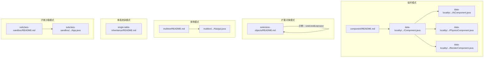
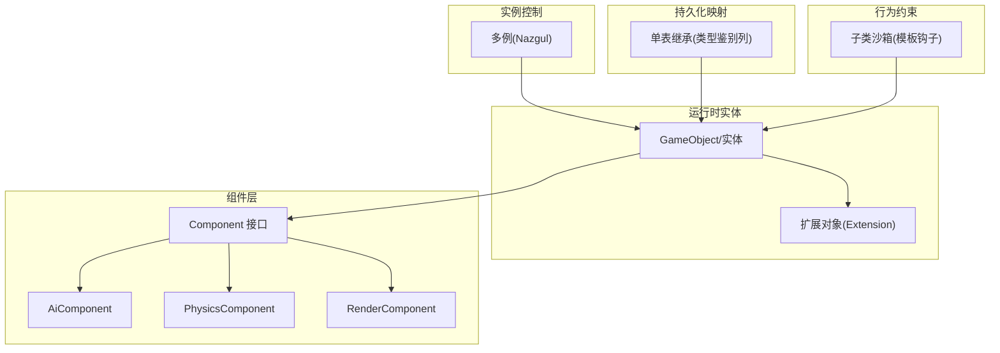
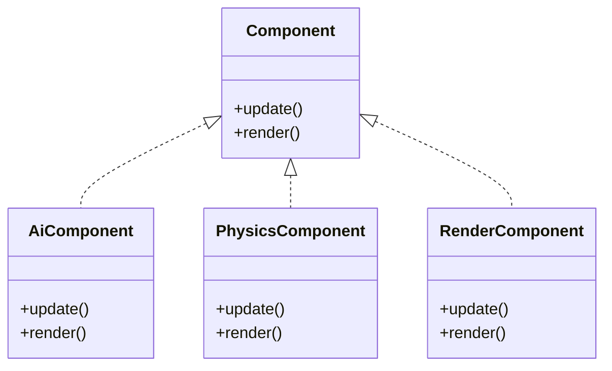
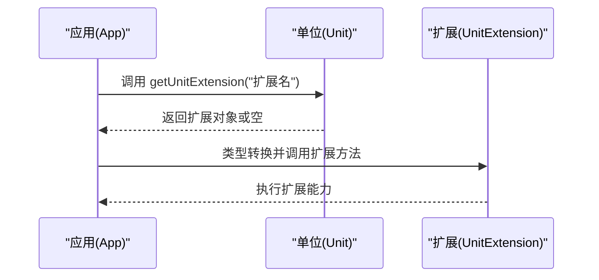
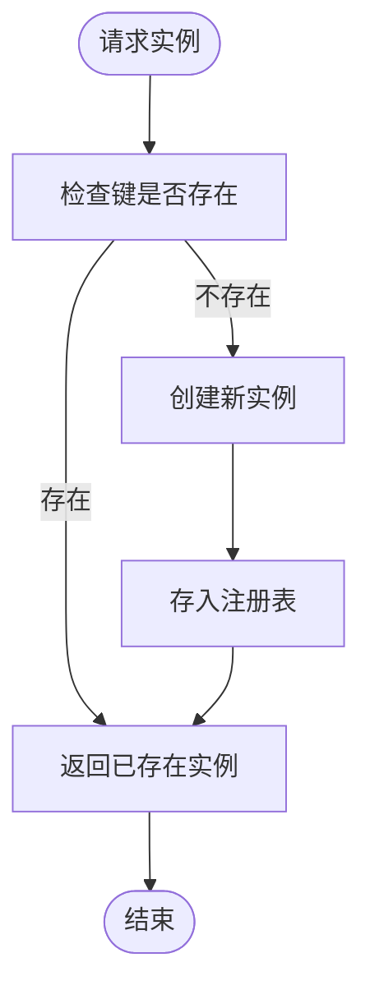
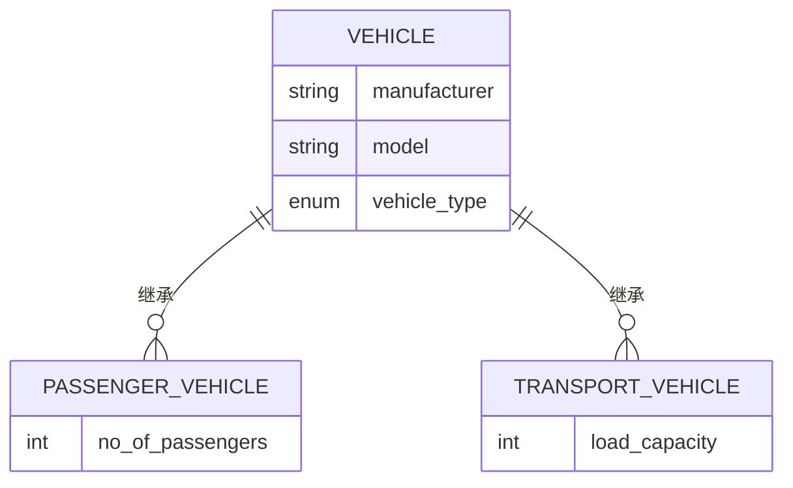
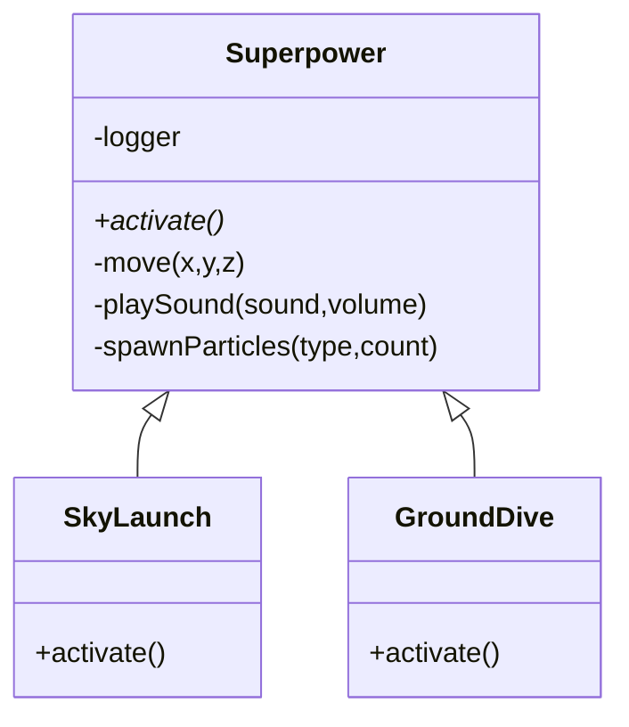
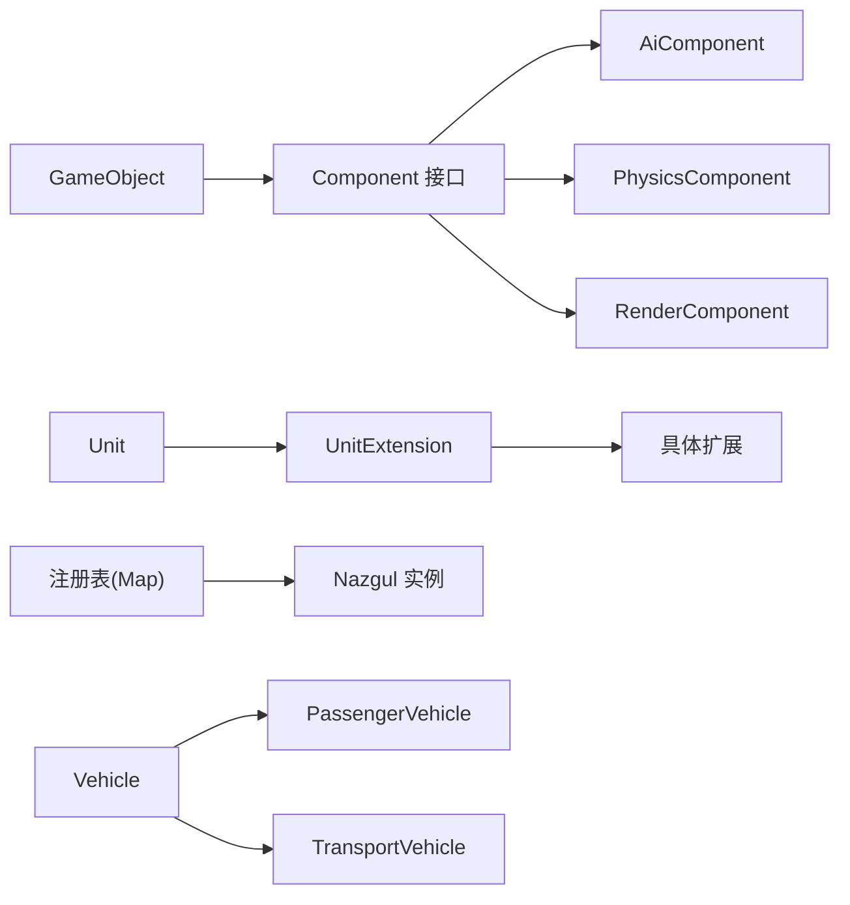

# 组件与扩展模式

<cite>
**本文引用的文件**
- [component/README.md](file://component/README.md)
- [data-locality/src/main/java/com/iluwatar/data/locality/game/component/Component.java](file://data-locality/src/main/java/com/iluwatar/data/locality/game/component/Component.java)
- [data-locality/src/main/java/com/iluwatar/data/locality/game/component/AiComponent.java](file://data-locality/src/main/java/com/iluwatar/data/locality/game/component/AiComponent.java)
- [data-locality/src/main/java/com/iluwatar/data/locality/game/component/PhysicsComponent.java](file://data-locality/src/main/java/com/iluwatar/data/locality/game/component/PhysicsComponent.java)
- [data-locality/src/main/java/com/iluwatar/data/locality/game/component/RenderComponent.java](file://data-locality/src/main/java/com/iluwatar/data/locality/game/component/RenderComponent.java)
- [extension-objects/README.md](file://extension-objects/README.md)
- [multiton/README.md](file://multiton/README.md)
- [multiton/src/main/java/com/iluwatar/multiton/Nazgul.java](file://multiton/src/main/java/com/iluwatar/multiton/Nazgul.java)
- [single-table-inheritance/README.md](file://single-table-inheritance/README.md)
- [subclass-sandbox/README.md](file://subclass-sandbox/README.md)
- [subclass-sandbox/src/main/java/com/iluwatar/subclasssandbox/App.java](file://subclass-sandbox/src/main/java/com/iluwatar/subclasssandbox/App.java)
</cite>

## 目录
1. 引言
2. 项目结构
3. 核心组件
4. 架构总览
5. 详细组件分析
6. 依赖分析
7. 性能考虑
8. 故障排查指南
9. 结论
10. 附录

## 引言
本指南聚焦于企业应用中“组件模式”“扩展对象模式”“多例模式”“单表继承模式”以及“子类沙箱模式”的设计原则与实现策略，结合仓库中的真实示例，系统讲解如何在不破坏既有代码的前提下增强功能、控制实例数量、统一数据模型映射、约束子类行为并提升系统的可扩展性与可维护性。

## 项目结构
本仓库以“按模式分模块”的方式组织，每个模式独立成章，包含：
- 模式说明文档（README）
- 示例代码（src/main/java）
- 可选的测试与演示入口（src/test/java 或 App 入口）

下图给出与本指南相关的关键模块与文件关系概览：

**图表来源**
- [component/README.md](file://component/README.md#L1-L162)
- [data-locality/src/main/java/com/iluwatar/data/locality/game/component/Component.java](file://data-locality/src/main/java/com/iluwatar/data/locality/game/component/Component.java#L1-L36)
- [data-locality/src/main/java/com/iluwatar/data/locality/game/component/AiComponent.java](file://data-locality/src/main/java/com/iluwatar/data/locality/game/component/AiComponent.java#L1-L48)
- [data-locality/src/main/java/com/iluwatar/data/locality/game/component/PhysicsComponent.java](file://data-locality/src/main/java/com/iluwatar/data/locality/game/component/PhysicsComponent.java#L1-L48)
- [data-locality/src/main/java/com/iluwatar/data/locality/game/component/RenderComponent.java](file://data-locality/src/main/java/com/iluwatar/data/locality/game/component/RenderComponent.java#L1-L48)
- [extension-objects/README.md](file://extension-objects/README.md#L1-L186)
- [multiton/README.md](file://multiton/README.md#L1-L132)
- [multiton/src/main/java/com/iluwatar/multiton/Nazgul.java](file://multiton/src/main/java/com/iluwatar/multiton/Nazgul.java#L1-L76)
- [single-table-inheritance/README.md](file://single-table-inheritance/README.md#L1-L249)
- [subclass-sandbox/README.md](file://subclass-sandbox/README.md#L1-L169)
- [subclass-sandbox/src/main/java/com/iluwatar/subclasssandbox/App.java](file://subclass-sandbox/src/main/java/com/iluwatar/subclasssandbox/App.java#L1-L52)

**章节来源**
- [component/README.md](file://component/README.md#L1-L162)
- [extension-objects/README.md](file://extension-objects/README.md#L1-L186)
- [multiton/README.md](file://multiton/README.md#L1-L132)
- [single-table-inheritance/README.md](file://single-table-inheritance/README.md#L1-L249)
- [subclass-sandbox/README.md](file://subclass-sandbox/README.md#L1-L169)

## 核心组件
- 组件接口与实现：定义统一的更新与渲染接口，各子组件实现自身职责，便于组合与替换。
- 扩展对象：通过“附加对象”为已有对象动态注入能力，避免直接修改核心类。
- 多例：限定实例集合，提供全局访问点，保证可控的实例数量。
- 单表继承：将继承层次映射到单一表，使用类型鉴别列区分不同子类。
- 子类沙箱：在父类中提供受控的钩子方法，子类仅需实现特定步骤，保持整体流程一致。

**章节来源**
- [data-locality/src/main/java/com/iluwatar/data/locality/game/component/Component.java](file://data-locality/src/main/java/com/iluwatar/data/locality/game/component/Component.java#L1-L36)
- [data-locality/src/main/java/com/iluwatar/data/locality/game/component/AiComponent.java](file://data-locality/src/main/java/com/iluwatar/data/locality/game/component/AiComponent.java#L1-L48)
- [data-locality/src/main/java/com/iluwatar/data/locality/game/component/PhysicsComponent.java](file://data-locality/src/main/java/com/iluwatar/data/locality/game/component/PhysicsComponent.java#L1-L48)
- [data-locality/src/main/java/com/iluwatar/data/locality/game/component/RenderComponent.java](file://data-locality/src/main/java/com/iluwatar/data/locality/game/component/RenderComponent.java#L1-L48)
- [extension-objects/README.md](file://extension-objects/README.md#L1-L186)
- [multiton/README.md](file://multiton/README.md#L1-L132)
- [multiton/src/main/java/com/iluwatar/multiton/Nazgul.java](file://multiton/src/main/java/com/iluwatar/multiton/Nazgul.java#L1-L76)
- [single-table-inheritance/README.md](file://single-table-inheritance/README.md#L1-L249)
- [subclass-sandbox/README.md](file://subclass-sandbox/README.md#L1-L169)

## 架构总览
下图从系统视角展示“组件模式 + 扩展对象模式 + 多例模式 + 单表继承模式 + 子类沙箱模式”的协同作用：组件层负责行为拆分与组合；扩展对象在运行时为实体注入能力；多例确保关键资源的有限实例；单表继承简化持久化映射；子类沙箱约束子类行为，保护父类不变式。

**图表来源**
- [component/README.md](file://component/README.md#L33-L162)
- [data-locality/src/main/java/com/iluwatar/data/locality/game/component/Component.java](file://data-locality/src/main/java/com/iluwatar/data/locality/game/component/Component.java#L1-L36)
- [data-locality/src/main/java/com/iluwatar/data/locality/game/component/AiComponent.java](file://data-locality/src/main/java/com/iluwatar/data/locality/game/component/AiComponent.java#L1-L48)
- [data-locality/src/main/java/com/iluwatar/data/locality/game/component/PhysicsComponent.java](file://data-locality/src/main/java/com/iluwatar/data/locality/game/component/PhysicsComponent.java#L1-L48)
- [data-locality/src/main/java/com/iluwatar/data/locality/game/component/RenderComponent.java](file://data-locality/src/main/java/com/iluwatar/data/locality/game/component/RenderComponent.java#L1-L48)
- [extension-objects/README.md](file://extension-objects/README.md#L1-L186)
- [multiton/README.md](file://multiton/README.md#L1-L132)
- [multiton/src/main/java/com/iluwatar/multiton/Nazgul.java](file://multiton/src/main/java/com/iluwatar/multiton/Nazgul.java#L1-L76)
- [single-table-inheritance/README.md](file://single-table-inheritance/README.md#L1-L249)
- [subclass-sandbox/README.md](file://subclass-sandbox/README.md#L1-L169)

## 详细组件分析

### 组件模式：可复用、可组合的行为单元
- 设计要点
  - 将实体的行为拆分为独立组件，组件实现统一接口，支持动态装配与替换。
  - 实体持有组件引用，按需调用组件的更新/渲染等方法。
- 关键实现路径
  - 组件接口：[Component.java](file://data-locality/src/main/java/com/iluwatar/data/locality/game/component/Component.java#L30-L35)
  - AI 组件：[AiComponent.java](file://data-locality/src/main/java/com/iluwatar/data/locality/game/component/AiComponent.java#L33-L47)
  - 物理组件：[PhysicsComponent.java](file://data-locality/src/main/java/com/iluwatar/data/locality/game/component/PhysicsComponent.java#L33-L47)
  - 渲染组件：[RenderComponent.java](file://data-locality/src/main/java/com/iluwatar/data/locality/game/component/RenderComponent.java#L33-L47)
- 使用建议
  - 优先以组件化思维拆分领域行为，降低耦合度。
  - 在实体侧集中编排组件生命周期，避免分散逻辑。

**图表来源**
- [data-locality/src/main/java/com/iluwatar/data/locality/game/component/Component.java](file://data-locality/src/main/java/com/iluwatar/data/locality/game/component/Component.java#L30-L35)
- [data-locality/src/main/java/com/iluwatar/data/locality/game/component/AiComponent.java](file://data-locality/src/main/java/com/iluwatar/data/locality/game/component/AiComponent.java#L33-L47)
- [data-locality/src/main/java/com/iluwatar/data/locality/game/component/PhysicsComponent.java](file://data-locality/src/main/java/com/iluwatar/data/locality/game/component/PhysicsComponent.java#L33-L47)
- [data-locality/src/main/java/com/iluwatar/data/locality/game/component/RenderComponent.java](file://data-locality/src/main/java/com/iluwatar/data/locality/game/component/RenderComponent.java#L33-L47)

**章节来源**
- [component/README.md](file://component/README.md#L19-L162)
- [data-locality/src/main/java/com/iluwatar/data/locality/game/component/Component.java](file://data-locality/src/main/java/com/iluwatar/data/locality/game/component/Component.java#L1-L36)
- [data-locality/src/main/java/com/iluwatar/data/locality/game/component/AiComponent.java](file://data-locality/src/main/java/com/iluwatar/data/locality/game/component/AiComponent.java#L1-L48)
- [data-locality/src/main/java/com/iluwatar/data/locality/game/component/PhysicsComponent.java](file://data-locality/src/main/java/com/iluwatar/data/locality/game/component/PhysicsComponent.java#L1-L48)
- [data-locality/src/main/java/com/iluwatar/data/locality/game/component/RenderComponent.java](file://data-locality/src/main/java/com/iluwatar/data/locality/game/component/RenderComponent.java#L1-L48)

### 扩展对象模式：在不修改现有代码基础上添加新功能
- 设计要点
  - 基类提供“扩展查询”入口，返回具体扩展对象；扩展对象封装新增能力。
  - 运行时按需注入扩展，遵循开闭原则，避免对既有类进行重构。
- 关键实现路径
  - 基类与扩展接口：[extension-objects/README.md 示例](file://extension-objects/README.md#L40-L105)
  - 应用入口与调用：[extension-objects/README.md 示例](file://extension-objects/README.md#L107-L128)
- 使用建议
  - 将“可插拔能力”抽象为扩展接口，基类只暴露安全的扩展点。
  - 对扩展对象进行命名约定与工厂化管理，避免散乱注入。

**图表来源**
- [extension-objects/README.md](file://extension-objects/README.md#L40-L128)

**章节来源**
- [extension-objects/README.md](file://extension-objects/README.md#L18-L186)

### 多例模式：有限实例控制
- 设计要点
  - 通过静态注册表（如枚举或并发映射）维护固定集合的实例，按键获取。
  - 适用于“预定义数量”的全局资源，如九个巫师（Nazgûl）。
- 关键实现路径
  - 预热初始化与枚举实现：[multiton/README.md 示例](file://multiton/README.md#L41-L106)
  - 获取实例方法：[Nazgul.java](file://multiton/src/main/java/com/iluwatar/multiton/Nazgul.java#L58-L61)
- 使用建议
  - 明确实例集合的业务边界，避免无限增长。
  - 使用并发安全容器，保证线程安全。

**图表来源**
- [multiton/src/main/java/com/iluwatar/multiton/Nazgul.java](file://multiton/src/main/java/com/iluwatar/multiton/Nazgul.java#L34-L61)

**章节来源**
- [multiton/README.md](file://multiton/README.md#L13-L132)
- [multiton/src/main/java/com/iluwatar/multiton/Nazgul.java](file://multiton/src/main/java/com/iluwatar/multiton/Nazgul.java#L1-L76)

### 单表继承模式：数据库与对象映射的统一表
- 设计要点
  - 将继承层次映射到单一表，使用“类型鉴别列”标识子类。
  - 简化查询与关联，但可能产生稀疏表与性能问题。
- 关键实现路径
  - 概念与示例：[single-table-inheritance/README.md](file://single-table-inheritance/README.md#L19-L249)
- 使用建议
  - 子类字段差异不大时采用；字段差异大时考虑其他策略（如类表继承）。

**图表来源**
- [single-table-inheritance/README.md](file://single-table-inheritance/README.md#L49-L69)

**章节来源**
- [single-table-inheritance/README.md](file://single-table-inheritance/README.md#L1-L249)

### 子类沙箱模式：限制子类行为与保护父类不变式
- 设计要点
  - 父类提供“沙箱方法”与若干受保护的“提供操作”，子类仅实现沙箱方法。
  - 通过受控钩子约束子类行为，保持算法骨架一致。
- 关键实现路径
  - 父类与子类示例：[subclass-sandbox/README.md](file://subclass-sandbox/README.md#L44-L103)
  - 运行入口：[App.java](file://subclass-sandbox/src/main/java/com/iluwatar/subclasssandbox/App.java#L43-L50)
- 使用建议
  - 将通用流程固化在父类，子类专注于差异化步骤。
  - 严格控制受保护方法可见性，避免外部滥用。

**图表来源**
- [subclass-sandbox/README.md](file://subclass-sandbox/README.md#L44-L103)

**章节来源**
- [subclass-sandbox/README.md](file://subclass-sandbox/README.md#L20-L169)
- [subclass-sandbox/src/main/java/com/iluwatar/subclasssandbox/App.java](file://subclass-sandbox/src/main/java/com/iluwatar/subclasssandbox/App.java#L1-L52)

## 依赖分析
- 组件模式内部依赖
  - Component 接口被 Ai/Physics/Render 三个组件实现，GameObject 通过组合持有这些组件并编排其生命周期。
- 扩展对象模式依赖
  - 基类提供扩展查询方法，返回扩展对象；调用方按需进行类型转换与执行。
- 多例模式依赖
  - 注册表（静态 Map/枚举）集中管理实例，getInstance 方法提供全局访问。
- 单表继承模式依赖
  - ORM 层（如 JPA/Hibernate）通过注解与鉴别列完成映射。
- 子类沙箱模式依赖
  - 父类提供受保护的工具方法，子类仅实现沙箱方法，避免破坏父类流程。

**图表来源**
- [component/README.md](file://component/README.md#L55-L99)
- [data-locality/src/main/java/com/iluwatar/data/locality/game/component/Component.java](file://data-locality/src/main/java/com/iluwatar/data/locality/game/component/Component.java#L30-L35)
- [data-locality/src/main/java/com/iluwatar/data/locality/game/component/AiComponent.java](file://data-locality/src/main/java/com/iluwatar/data/locality/game/component/AiComponent.java#L33-L47)
- [data-locality/src/main/java/com/iluwatar/data/locality/game/component/PhysicsComponent.java](file://data-locality/src/main/java/com/iluwatar/data/locality/game/component/PhysicsComponent.java#L33-L47)
- [data-locality/src/main/java/com/iluwatar/data/locality/game/component/RenderComponent.java](file://data-locality/src/main/java/com/iluwatar/data/locality/game/component/RenderComponent.java#L33-L47)
- [extension-objects/README.md](file://extension-objects/README.md#L40-L105)
- [multiton/src/main/java/com/iluwatar/multiton/Nazgul.java](file://multiton/src/main/java/com/iluwatar/multiton/Nazgul.java#L34-L61)
- [single-table-inheritance/README.md](file://single-table-inheritance/README.md#L49-L69)

**章节来源**
- [component/README.md](file://component/README.md#L55-L99)
- [extension-objects/README.md](file://extension-objects/README.md#L40-L105)
- [multiton/src/main/java/com/iluwatar/multiton/Nazgul.java](file://multiton/src/main/java/com/iluwatar/multiton/Nazgul.java#L34-L61)
- [single-table-inheritance/README.md](file://single-table-inheritance/README.md#L49-L69)

## 性能考虑
- 组件模式
  - 动态组合带来一定间接成本，建议在高频循环中减少不必要的组件切换与反射调用。
- 扩展对象模式
  - 扩展对象的查找与类型转换应尽量缓存与复用，避免重复分配。
- 多例模式
  - 注册表应使用并发安全容器，避免锁竞争；实例数量有限，访问成本低。
- 单表继承模式
  - 大量稀疏列可能影响查询性能，建议对热点字段建立索引或拆分表。
- 子类沙箱模式
  - 父类提供的受保护方法应避免复杂计算，保持轻量，子类实现差异化步骤即可。

## 故障排查指南
- 组件未生效
  - 检查实体是否正确持有并调用了对应组件的 update/render。
  - 参考：[Component.java](file://data-locality/src/main/java/com/iluwatar/data/locality/game/component/Component.java#L30-L35)
- 扩展对象为空
  - 确认基类扩展查询方法是否支持该扩展名，或扩展是否正确构造。
  - 参考：[extension-objects/README.md 示例](file://extension-objects/README.md#L76-L83)
- 多例实例缺失
  - 检查注册表初始化是否覆盖了所需键，或 getInstance 的键是否匹配。
  - 参考：[multiton/README.md 示例](file://multiton/README.md#L81-L106), [Nazgul.java](file://multiton/src/main/java/com/iluwatar/multiton/Nazgul.java#L41-L61)
- 单表继承查询异常
  - 确认鉴别列值与子类映射一致，避免类型不匹配导致的查询失败。
  - 参考：[single-table-inheritance/README.md](file://single-table-inheritance/README.md#L39-L69)
- 子类行为异常
  - 检查子类是否仅实现了沙箱方法，未破坏父类受保护方法的前置条件。
  - 参考：[subclass-sandbox/README.md](file://subclass-sandbox/README.md#L44-L103)

**章节来源**
- [data-locality/src/main/java/com/iluwatar/data/locality/game/component/Component.java](file://data-locality/src/main/java/com/iluwatar/data/locality/game/component/Component.java#L30-L35)
- [extension-objects/README.md](file://extension-objects/README.md#L76-L83)
- [multiton/README.md](file://multiton/README.md#L81-L106)
- [multiton/src/main/java/com/iluwatar/multiton/Nazgul.java](file://multiton/src/main/java/com/iluwatar/multiton/Nazgul.java#L41-L61)
- [single-table-inheritance/README.md](file://single-table-inheritance/README.md#L39-L69)
- [subclass-sandbox/README.md](file://subclass-sandbox/README.md#L44-L103)

## 结论
- 组件模式通过“行为拆分 + 动态组合”提升灵活性与可维护性；
- 扩展对象模式在不修改既有代码的前提下注入能力，契合开闭原则；
- 多例模式用于有限实例的全局控制，适合预定义资源；
- 单表继承模式简化 ORM 映射，适合字段差异较小的继承层次；
- 子类沙箱模式约束子类行为，保护父类不变式，提升框架稳定性。
- 将上述模式协同使用，可在企业应用中构建高内聚、低耦合且易于演进的架构。

## 附录
- 设计决策清单
  - 是否可通过组件化拆分行为？优先选择组件模式。
  - 是否需要在运行时动态增强对象能力？采用扩展对象模式。
  - 是否存在“固定数量”的全局资源？采用多例模式。
  - 数据库继承层次字段差异小？采用单表继承。
  - 是否需要在父类中约束子类行为？采用子类沙箱模式。
- 参考示例路径
  - 组件模式：[component/README.md](file://component/README.md#L33-L162)
  - 扩展对象模式：[extension-objects/README.md](file://extension-objects/README.md#L36-L144)
  - 多例模式：[multiton/README.md](file://multiton/README.md#L13-L132), [Nazgul.java](file://multiton/src/main/java/com/iluwatar/multiton/Nazgul.java#L34-L61)
  - 单表继承模式：[single-table-inheritance/README.md](file://single-table-inheritance/README.md#L19-L249)
  - 子类沙箱模式：[subclass-sandbox/README.md](file://subclass-sandbox/README.md#L20-L169), [App.java](file://subclass-sandbox/src/main/java/com/iluwatar/subclasssandbox/App.java#L43-L50)