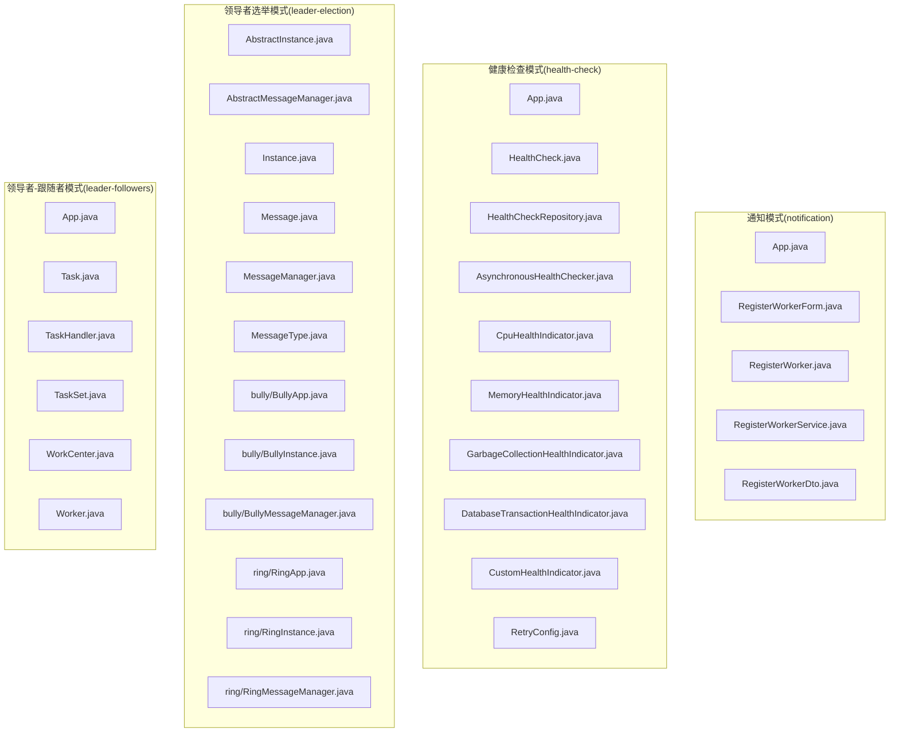
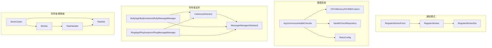
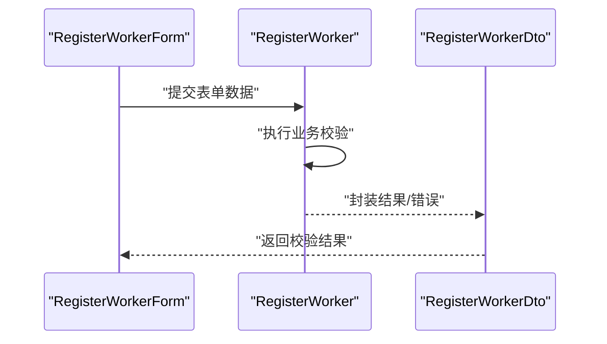
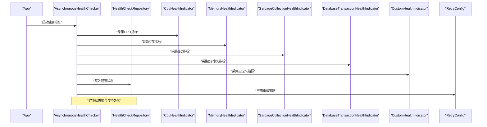
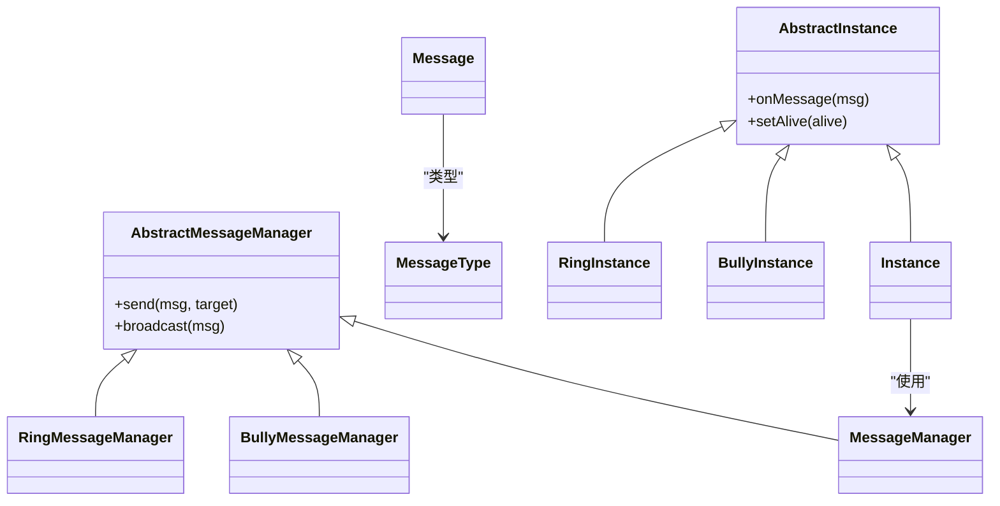
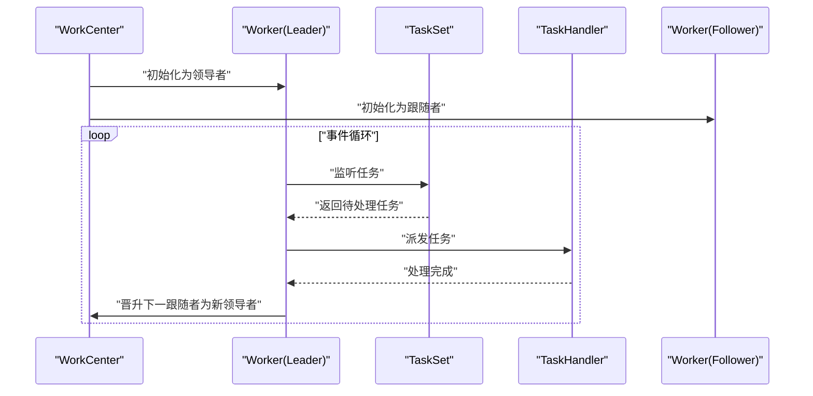
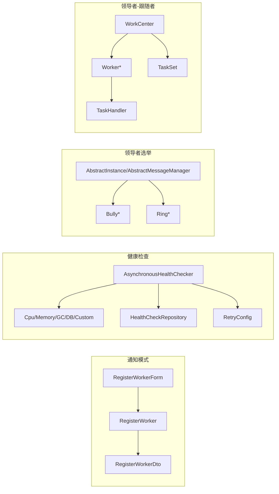

# 通信模式

<cite>
**本文引用的文件**
- [notification/App.java](file://notification/src/main/java/com/iluwatar/App.java)
- [notification/Notification.java](file://notification/src/main/java/com/iluwatar/Notification.java)
- [notification/RegisterWorker.java](file://notification/src/main/java/com/iluwatar/RegisterWorker.java)
- [notification/RegisterWorkerDto.java](file://notification/src/main/java/com/iluwatar/RegisterWorkerDto.java)
- [notification/RegisterWorkerForm.java](file://notification/src/main/java/com/iluwatar/RegisterWorkerForm.java)
- [notification/RegisterWorkerService.java](file://notification/src/main/java/com/iluwatar/RegisterWorkerService.java)
- [health-check/App.java](file://health-check/src/main/java/com/iluwatar/health/check/App.java)
- [health-check/HealthCheck.java](file://health-check/src/main/java/com/iluwatar/health/check/HealthCheck.java)
- [health-check/HealthCheckRepository.java](file://health-check/src/main/java/com/iluwatar/health/check/HealthCheckRepository.java)
- [health-check/AsynchronousHealthChecker.java](file://health-check/src/main/java/com/iluwatar/health/check/AsynchronousHealthChecker.java)
- [health-check/CpuHealthIndicator.java](file://health-check/src/main/java/com/iluwatar/health/check/CpuHealthIndicator.java)
- [health-check/MemoryHealthIndicator.java](file://health-check/src/main/java/com/iluwatar/health/check/MemoryHealthIndicator.java)
- [health-check/GarbageCollectionHealthIndicator.java](file://health-check/src/main/java/com/iluwatar/health/check/GarbageCollectionHealthIndicator.java)
- [health-check/DatabaseTransactionHealthIndicator.java](file://health-check/src/main/java/com/iluwatar/health/check/DatabaseTransactionHealthIndicator.java)
- [health-check/CustomHealthIndicator.java](file://health-check/src/main/java/com/iluwatar/health/check/CustomHealthIndicator.java)
- [health-check/RetryConfig.java](file://health-check/src/main/java/com/iluwatar/health/check/RetryConfig.java)
- [health-check/HealthCheckInterruptedException.java](file://health-check/src/main/java/com/iluwatar/health/check/HealthCheckInterruptedException.java)
- [leader-election/AbstractInstance.java](file://leader-election/src/main/java/com/iluwatar/leaderelection/AbstractInstance.java)
- [leader-election/AbstractMessageManager.java](file://leader-election/src/main/java/com/iluwatar/leaderelection/AbstractMessageManager.java)
- [leader-election/Instance.java](file://leader-election/src/main/java/com/iluwatar/leaderelection/Instance.java)
- [leader-election/Message.java](file://leader-election/src/main/java/com/iluwatar/leaderelection/Message.java)
- [leader-election/MessageManager.java](file://leader-election/src/main/java/com/iluwatar/leaderelection/MessageManager.java)
- [leader-election/MessageType.java](file://leader-election/src/main/java/com/iluwatar/leaderelection/MessageType.java)
- [leader-election/bully/BullyApp.java](file://leader-election/src/main/java/com/iluwatar/leaderelection/bully/BullyApp.java)
- [leader-election/bully/BullyInstance.java](file://leader-election/src/main/java/com/iluwatar/leaderelection/bully/BullyInstance.java)
- [leader-election/bully/BullyMessageManager.java](file://leader-election/src/main/java/com/iluwatar/leaderelection/bully/BullyMessageManager.java)
- [leader-election/ring/RingApp.java](file://leader-election/src/main/java/com/iluwatar/leaderelection/ring/RingApp.java)
- [leader-election/ring/RingInstance.java](file://leader-election/src/main/java/com/iluwatar/leaderelection/ring/RingInstance.java)
- [leader-election/ring/RingMessageManager.java](file://leader-election/src/main/java/com/iluwatar/leaderelection/ring/RingMessageManager.java)
- [leader-followers/App.java](file://leader-followers/src/main/java/com/iluwatar/leaderfollowers/App.java)
- [leader-followers/Task.java](file://leader-followers/src/main/java/com/iluwatar/leaderfollowers/Task.java)
- [leader-followers/TaskHandler.java](file://leader-followers/src/main/java/com/iluwatar/leaderfollowers/TaskHandler.java)
- [leader-followers/TaskSet.java](file://leader-followers/src/main/java/com/iluwatar/leaderfollowers/TaskSet.java)
- [leader-followers/WorkCenter.java](file://leader-followers/src/main/java/com/iluwatar/leaderfollowers/WorkCenter.java)
- [leader-followers/Worker.java](file://leader-followers/src/main/java/com/iluwatar/leaderfollowers/Worker.java)
</cite>

## 目录
1. [引言](#引言)
2. [项目结构](#项目结构)
3. [核心组件](#核心组件)
4. [架构总览](#架构总览)
5. [详细组件分析](#详细组件分析)
6. [依赖关系分析](#依赖关系分析)
7. [性能考量](#性能考量)
8. [故障排查指南](#故障排查指南)
9. [结论](#结论)
10. [附录](#附录)

## 引言
本指南聚焦于企业应用中关键的通信模式：通知模式、健康检查模式、领导者选举模式与领导者-跟随者模式。我们将从系统解耦、事件传播、监控与故障检测、分布式协调与一致性、以及任务分配与负载均衡等维度，系统阐述这些模式的设计原理与实现策略，并结合仓库中的具体实现进行代码级分析与可视化说明，帮助开发者构建可靠、可扩展的分布式通信系统。

## 项目结构
本仓库按“功能域”组织多个设计模式示例模块。与通信模式直接相关的关键模块如下：
- notification：演示通知模式在表单提交到领域层校验、错误回传的流程。
- health-check：演示健康检查模式在微服务中的异步健康指标采集与聚合。
- leader-election：演示领导者选举（Bully算法与环形算法）的消息传递与实例协调。
- leader-followers：演示领导者-跟随者并发模式的任务分发与线程角色轮换。

图表来源
- [notification/App.java](file://notification/src/main/java/com/iluwatar/App.java#L39-L50)
- [health-check/App.java](file://health-check/src/main/java/com/iluwatar/health/check/App.java#L41-L49)
- [leader-election/AbstractInstance.java](file://leader-election/src/main/java/com/iluwatar/leaderelection/AbstractInstance.java)
- [leader-followers/App.java](file://leader-followers/src/main/java/com/iluwatar/leaderfollowers/App.java#L58-L94)

章节来源
- [notification/App.java](file://notification/src/main/java/com/iluwatar/App.java#L29-L38)
- [health-check/App.java](file://health-check/src/main/java/com/iluwatar/health/check/App.java#L32-L40)
- [leader-election/AbstractInstance.java](file://leader-election/src/main/java/com/iluwatar/leaderelection/AbstractInstance.java)
- [leader-followers/App.java](file://leader-followers/src/main/java/com/iluwatar/leaderfollowers/App.java#L31-L57)

## 核心组件
- 通知模式：通过表单层、领域层与DTO的协作，完成数据封装、验证与错误回传，实现跨层解耦。
- 健康检查模式：以异步健康检查器为核心，结合多种健康指示器与重试配置，统一采集与聚合系统健康状态。
- 领导者选举模式：抽象出实例与消息管理器，分别实现Bully与环形两种选举算法，确保分布式一致性。
- 领导者-跟随者模式：通过工作中心与任务集，实现领导者线程监听与分发、跟随者线程处理与角色轮换。

章节来源
- [notification/RegisterWorker.java](file://notification/src/main/java/com/iluwatar/RegisterWorker.java)
- [notification/RegisterWorkerDto.java](file://notification/src/main/java/com/iluwatar/RegisterWorkerDto.java)
- [health-check/AsynchronousHealthChecker.java](file://health-check/src/main/java/com/iluwatar/health/check/AsynchronousHealthChecker.java)
- [health-check/HealthCheckRepository.java](file://health-check/src/main/java/com/iluwatar/health/check/HealthCheckRepository.java)
- [leader-election/Instance.java](file://leader-election/src/main/java/com/iluwatar/leaderelection/Instance.java)
- [leader-election/MessageManager.java](file://leader-election/src/main/java/com/iluwatar/leaderelection/MessageManager.java)
- [leader-followers/WorkCenter.java](file://leader-followers/src/main/java/com/iluwatar/leaderfollowers/WorkCenter.java)
- [leader-followers/TaskSet.java](file://leader-followers/src/main/java/com/iluwatar/leaderfollowers/TaskSet.java)

## 架构总览
下图展示了四种通信模式在系统中的交互关系与职责划分：

图表来源
- [notification/RegisterWorkerForm.java](file://notification/src/main/java/com/iluwatar/RegisterWorkerForm.java)
- [notification/RegisterWorker.java](file://notification/src/main/java/com/iluwatar/RegisterWorker.java)
- [notification/RegisterWorkerDto.java](file://notification/src/main/java/com/iluwatar/RegisterWorkerDto.java)
- [health-check/AsynchronousHealthChecker.java](file://health-check/src/main/java/com/iluwatar/health/check/AsynchronousHealthChecker.java)
- [health-check/HealthCheckRepository.java](file://health-check/src/main/java/com/iluwatar/health/check/HealthCheckRepository.java)
- [health-check/CpuHealthIndicator.java](file://health-check/src/main/java/com/iluwatar/health/check/CpuHealthIndicator.java)
- [health-check/MemoryHealthIndicator.java](file://health-check/src/main/java/com/iluwatar/health/check/MemoryHealthIndicator.java)
- [health-check/GarbageCollectionHealthIndicator.java](file://health-check/src/main/java/com/iluwatar/health/check/GarbageCollectionHealthIndicator.java)
- [health-check/DatabaseTransactionHealthIndicator.java](file://health-check/src/main/java/com/iluwatar/health/check/DatabaseTransactionHealthIndicator.java)
- [health-check/CustomHealthIndicator.java](file://health-check/src/main/java/com/iluwatar/health/check/CustomHealthIndicator.java)
- [health-check/RetryConfig.java](file://health-check/src/main/java/com/iluwatar/health/check/RetryConfig.java)
- [leader-election/AbstractInstance.java](file://leader-election/src/main/java/com/iluwatar/leaderelection/AbstractInstance.java)
- [leader-election/AbstractMessageManager.java](file://leader-election/src/main/java/com/iluwatar/leaderelection/AbstractMessageManager.java)
- [leader-election/bully/BullyApp.java](file://leader-election/src/main/java/com/iluwatar/leaderelection/bully/BullyApp.java)
- [leader-election/ring/RingApp.java](file://leader-election/src/main/java/com/iluwatar/leaderelection/ring/RingApp.java)
- [leader-followers/WorkCenter.java](file://leader-followers/src/main/java/com/iluwatar/leaderfollowers/WorkCenter.java)
- [leader-followers/TaskSet.java](file://leader-followers/src/main/java/com/iluwatar/leaderfollowers/TaskSet.java)
- [leader-followers/TaskHandler.java](file://leader-followers/src/main/java/com/iluwatar/leaderfollowers/TaskHandler.java)
- [leader-followers/Worker.java](file://leader-followers/src/main/java/com/iluwatar/leaderfollowers/Worker.java)

## 详细组件分析

### 通知模式：系统解耦与事件传播
通知模式通过表单层、领域层与DTO的协作，实现信息传递与错误回传，从而降低层间耦合度。其核心流程如下：
- 表单层收集用户输入并提交至领域层。
- 领域层执行业务规则与校验，将结果封装为DTO。
- 错误信息通过DTO返回给表单层，便于UI反馈。

图表来源
- [notification/RegisterWorkerForm.java](file://notification/src/main/java/com/iluwatar/RegisterWorkerForm.java)
- [notification/RegisterWorker.java](file://notification/src/main/java/com/iluwatar/RegisterWorker.java)
- [notification/RegisterWorkerDto.java](file://notification/src/main/java/com/iluwatar/RegisterWorkerDto.java)

章节来源
- [notification/App.java](file://notification/src/main/java/com/iluwatar/App.java#L29-L38)
- [notification/RegisterWorkerForm.java](file://notification/src/main/java/com/iluwatar/RegisterWorkerForm.java)
- [notification/RegisterWorker.java](file://notification/src/main/java/com/iluwatar/RegisterWorker.java)
- [notification/RegisterWorkerDto.java](file://notification/src/main/java/com/iluwatar/RegisterWorkerDto.java)

### 健康检查模式：分布式系统监控与故障检测
健康检查模式通过异步健康检查器与多种健康指示器，对CPU、内存、垃圾回收、数据库事务与自定义指标进行周期性或事件驱动的健康评估，并支持重试配置与中断处理，保障系统的可观测性与可用性。

图表来源
- [health-check/App.java](file://health-check/src/main/java/com/iluwatar/health/check/App.java#L41-L49)
- [health-check/AsynchronousHealthChecker.java](file://health-check/src/main/java/com/iluwatar/health/check/AsynchronousHealthChecker.java)
- [health-check/HealthCheckRepository.java](file://health-check/src/main/java/com/iluwatar/health/check/HealthCheckRepository.java)
- [health-check/CpuHealthIndicator.java](file://health-check/src/main/java/com/iluwatar/health/check/CpuHealthIndicator.java)
- [health-check/MemoryHealthIndicator.java](file://health-check/src/main/java/com/iluwatar/health/check/MemoryHealthIndicator.java)
- [health-check/GarbageCollectionHealthIndicator.java](file://health-check/src/main/java/com/iluwatar/health/check/GarbageCollectionHealthIndicator.java)
- [health-check/DatabaseTransactionHealthIndicator.java](file://health-check/src/main/java/com/iluwatar/health/check/DatabaseTransactionHealthIndicator.java)
- [health-check/CustomHealthIndicator.java](file://health-check/src/main/java/com/iluwatar/health/check/CustomHealthIndicator.java)
- [health-check/RetryConfig.java](file://health-check/src/main/java/com/iluwatar/health/check/RetryConfig.java)

章节来源
- [health-check/App.java](file://health-check/src/main/java/com/iluwatar/health/check/App.java#L32-L40)
- [health-check/AsynchronousHealthChecker.java](file://health-check/src/main/java/com/iluwatar/health/check/AsynchronousHealthChecker.java)
- [health-check/HealthCheckRepository.java](file://health-check/src/main/java/com/iluwatar/health/check/HealthCheckRepository.java)
- [health-check/HealthCheckInterruptedException.java](file://health-check/src/main/java/com/iluwatar/health/check/HealthCheckInterruptedException.java)
- [health-check/RetryConfig.java](file://health-check/src/main/java/com/iluwatar/health/check/RetryConfig.java)

### 领导者选举模式：分布式协调与一致性
领导者选举模式通过抽象实例与消息管理器，分别实现Bully与环形两种选举算法。其核心目标是在节点失效时快速选出新的领导者，维持系统一致性与高可用。

图表来源
- [leader-election/AbstractInstance.java](file://leader-election/src/main/java/com/iluwatar/leaderelection/AbstractInstance.java)
- [leader-election/AbstractMessageManager.java](file://leader-election/src/main/java/com/iluwatar/leaderelection/AbstractMessageManager.java)
- [leader-election/Instance.java](file://leader-election/src/main/java/com/iluwatar/leaderelection/Instance.java)
- [leader-election/Message.java](file://leader-election/src/main/java/com/iluwatar/leaderelection/Message.java)
- [leader-election/MessageManager.java](file://leader-election/src/main/java/com/iluwatar/leaderelection/MessageManager.java)
- [leader-election/MessageType.java](file://leader-election/src/main/java/com/iluwatar/leaderelection/MessageType.java)
- [leader-election/bully/BullyInstance.java](file://leader-election/src/main/java/com/iluwatar/leaderelection/bully/BullyInstance.java)
- [leader-election/bully/BullyMessageManager.java](file://leader-election/src/main/java/com/iluwatar/leaderelection/bully/BullyMessageManager.java)
- [leader-election/ring/RingInstance.java](file://leader-election/src/main/java/com/iluwatar/leaderelection/ring/RingInstance.java)
- [leader-election/ring/RingMessageManager.java](file://leader-election/src/main/java/com/iluwatar/leaderelection/ring/RingMessageManager.java)

章节来源
- [leader-election/bully/BullyApp.java](file://leader-election/src/main/java/com/iluwatar/leaderelection/bully/BullyApp.java#L33-L77)
- [leader-election/ring/RingApp.java](file://leader-election/src/main/java/com/iluwatar/leaderelection/ring/RingApp.java)
- [leader-election/AbstractInstance.java](file://leader-election/src/main/java/com/iluwatar/leaderelection/AbstractInstance.java)
- [leader-election/AbstractMessageManager.java](file://leader-election/src/main/java/com/iluwatar/leaderelection/AbstractMessageManager.java)

### 领导者-跟随者模式：任务分配与负载均衡
领导者-跟随者模式通过工作中心创建固定数量的工作者线程，领导者监听任务集并分发给处理器，处理完成后促进下一个跟随者成为新的领导者，形成轮转式负载均衡与低锁开销的事件处理链路。

图表来源
- [leader-followers/App.java](file://leader-followers/src/main/java/com/iluwatar/leaderfollowers/App.java#L58-L94)
- [leader-followers/WorkCenter.java](file://leader-followers/src/main/java/com/iluwatar/leaderfollowers/WorkCenter.java)
- [leader-followers/Worker.java](file://leader-followers/src/main/java/com/iluwatar/leaderfollowers/Worker.java)
- [leader-followers/TaskSet.java](file://leader-followers/src/main/java/com/iluwatar/leaderfollowers/TaskSet.java)
- [leader-followers/TaskHandler.java](file://leader-followers/src/main/java/com/iluwatar/leaderfollowers/TaskHandler.java)

章节来源
- [leader-followers/App.java](file://leader-followers/src/main/java/com/iluwatar/leaderfollowers/App.java#L31-L57)
- [leader-followers/WorkCenter.java](file://leader-followers/src/main/java/com/iluwatar/leaderfollowers/WorkCenter.java)
- [leader-followers/Worker.java](file://leader-followers/src/main/java/com/iluwatar/leaderfollowers/Worker.java)
- [leader-followers/TaskSet.java](file://leader-followers/src/main/java/com/iluwatar/leaderfollowers/TaskSet.java)
- [leader-followers/TaskHandler.java](file://leader-followers/src/main/java/com/iluwatar/leaderfollowers/TaskHandler.java)

## 依赖关系分析
- 通知模式内部依赖清晰：表单层依赖领域层，领域层依赖DTO；错误与结果通过DTO回传，避免跨层直接耦合。
- 健康检查模式中，异步检查器依赖多种健康指示器与重试配置，最终写入健康检查仓库，形成松耦合的指标采集与存储链路。
- 领导者选举模式通过抽象类隔离实例与消息管理器差异，Bully与环形实现共享同一接口契约，便于替换与扩展。
- 领导者-跟随者模式通过工作中心集中管理工作者生命周期与角色轮换，任务集作为事件源，处理器负责具体业务处理。

图表来源
- [notification/RegisterWorkerForm.java](file://notification/src/main/java/com/iluwatar/RegisterWorkerForm.java)
- [notification/RegisterWorker.java](file://notification/src/main/java/com/iluwatar/RegisterWorker.java)
- [notification/RegisterWorkerDto.java](file://notification/src/main/java/com/iluwatar/RegisterWorkerDto.java)
- [health-check/AsynchronousHealthChecker.java](file://health-check/src/main/java/com/iluwatar/health/check/AsynchronousHealthChecker.java)
- [health-check/HealthCheckRepository.java](file://health-check/src/main/java/com/iluwatar/health/check/HealthCheckRepository.java)
- [health-check/RetryConfig.java](file://health-check/src/main/java/com/iluwatar/health/check/RetryConfig.java)
- [leader-election/AbstractInstance.java](file://leader-election/src/main/java/com/iluwatar/leaderelection/AbstractInstance.java)
- [leader-election/AbstractMessageManager.java](file://leader-election/src/main/java/com/iluwatar/leaderelection/AbstractMessageManager.java)
- [leader-followers/WorkCenter.java](file://leader-followers/src/main/java/com/iluwatar/leaderfollowers/WorkCenter.java)
- [leader-followers/Worker.java](file://leader-followers/src/main/java/com/iluwatar/leaderfollowers/Worker.java)
- [leader-followers/TaskSet.java](file://leader-followers/src/main/java/com/iluwatar/leaderfollowers/TaskSet.java)
- [leader-followers/TaskHandler.java](file://leader-followers/src/main/java/com/iluwatar/leaderfollowers/TaskHandler.java)

章节来源
- [notification/App.java](file://notification/src/main/java/com/iluwatar/App.java#L29-L38)
- [health-check/App.java](file://health-check/src/main/java/com/iluwatar/health/check/App.java#L32-L40)
- [leader-election/AbstractInstance.java](file://leader-election/src/main/java/com/iluwatar/leaderelection/AbstractInstance.java)
- [leader-followers/App.java](file://leader-followers/src/main/java/com/iluwatar/leaderfollowers/App.java#L31-L57)

## 性能考量
- 通知模式：通过DTO承载校验结果与错误，减少跨层对象复制与序列化成本；建议在表单层仅传递必要字段，避免冗余数据传输。
- 健康检查模式：异步采集与重试配置可降低同步阻塞风险；建议根据指标类型设置差异化采样频率与超时阈值，避免热点指标拖累整体性能。
- 领导者选举模式：Bully算法在节点频繁上下线场景表现稳定，但消息开销较大；环形算法在节点数较多时更均衡，需注意消息传播延迟与收敛时间。
- 领导者-跟随者模式：通过角色轮转减少锁竞争与上下文切换；建议合理设置工作者数量与任务批处理大小，平衡吞吐与延迟。

## 故障排查指南
- 通知模式：若表单提交后无响应，优先检查领域层校验逻辑与DTO封装是否正确；确认异常路径是否被DTO捕获并回传。
- 健康检查模式：若健康状态不更新，检查异步检查器是否正常运行、健康指示器是否抛出异常、重试配置是否导致退避过长；关注中断异常的处理与恢复。
- 领导者选举模式：若选举停滞，检查实例存活状态与消息管理器广播/单播是否生效；对比Bully与环形算法的日志，定位消息丢失或延迟问题。
- 领导者-跟随者模式：若任务积压，检查领导者监听与分发逻辑、处理器执行耗时与队列容量；观察工作者晋升是否及时，避免领导者空转。

章节来源
- [health-check/HealthCheckInterruptedException.java](file://health-check/src/main/java/com/iluwatar/health/check/HealthCheckInterruptedException.java)
- [leader-election/AbstractInstance.java](file://leader-election/src/main/java/com/iluwatar/leaderelection/AbstractInstance.java)
- [leader-followers/Worker.java](file://leader-followers/src/main/java/com/iluwatar/leaderfollowers/Worker.java)

## 结论
通知模式、健康检查模式、领导者选举模式与领导者-跟随者模式共同构成了企业应用通信与协调的四大基石。通过明确的职责边界、异步与解耦的设计，以及可插拔的实现策略，这些模式能够有效提升系统的可观测性、一致性与可扩展性。建议在实际工程中结合业务特性选择合适的模式组合，并配套完善的监控与告警体系，持续优化性能与稳定性。

## 附录
- 示例入口类与关键流程参考：
  - 通知模式入口：[notification/App.java](file://notification/src/main/java/com/iluwatar/App.java#L45-L48)
  - 健康检查入口：[health-check/App.java](file://health-check/src/main/java/com/iluwatar/health/check/App.java#L46-L48)
  - 领导者选举入口（Bully）：[leader-election/bully/BullyApp.java](file://leader-election/src/main/java/com/iluwatar/leaderelection/bully/BullyApp.java#L43-L75)
  - 领导者-跟随者入口：[leader-followers/App.java](file://leader-followers/src/main/java/com/iluwatar/leaderfollowers/App.java#L63-L82)