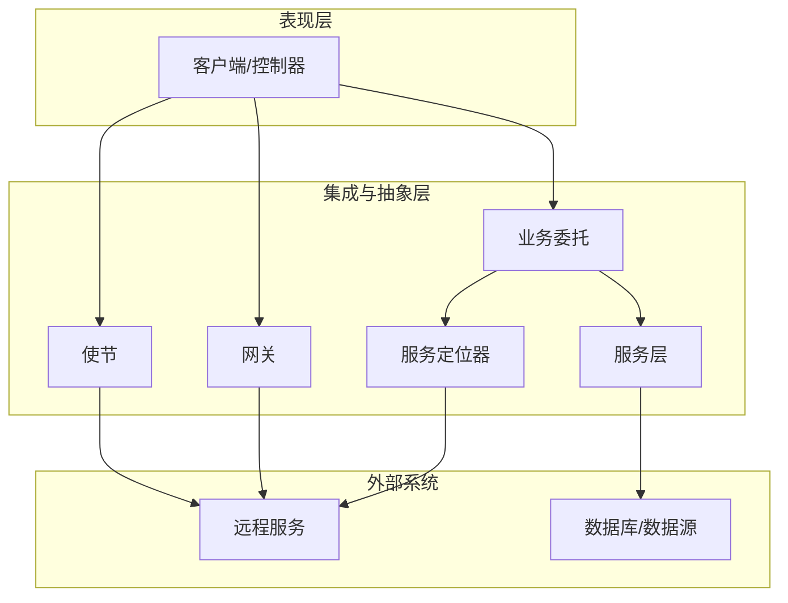
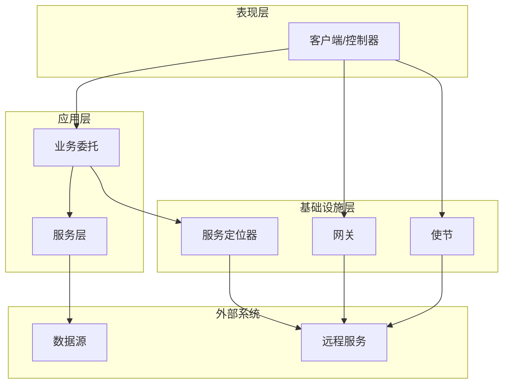
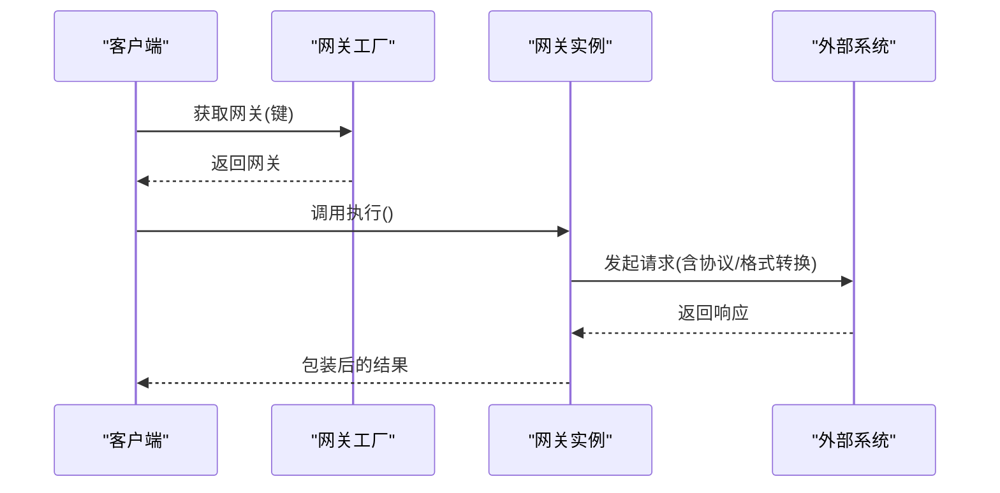
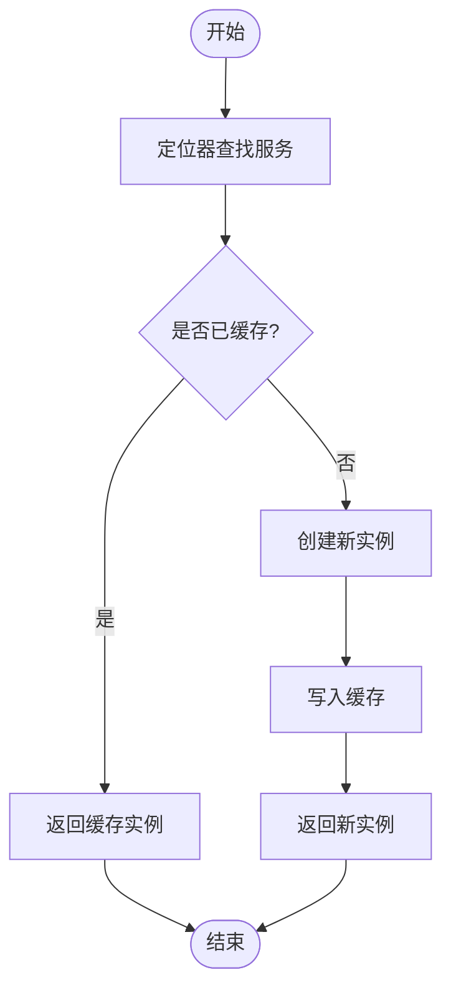
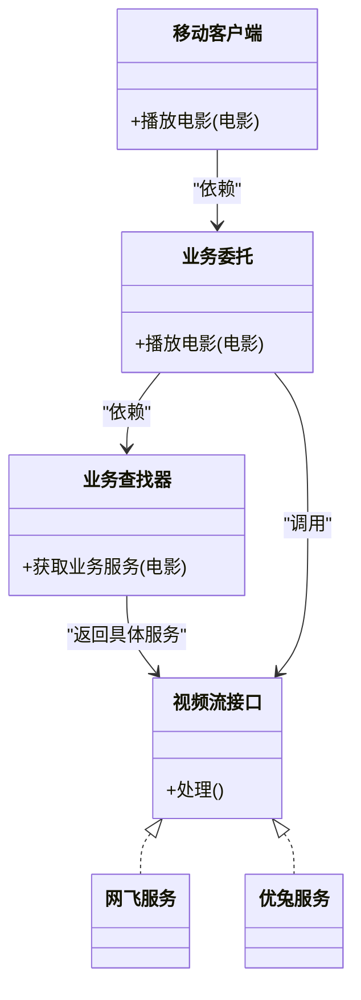
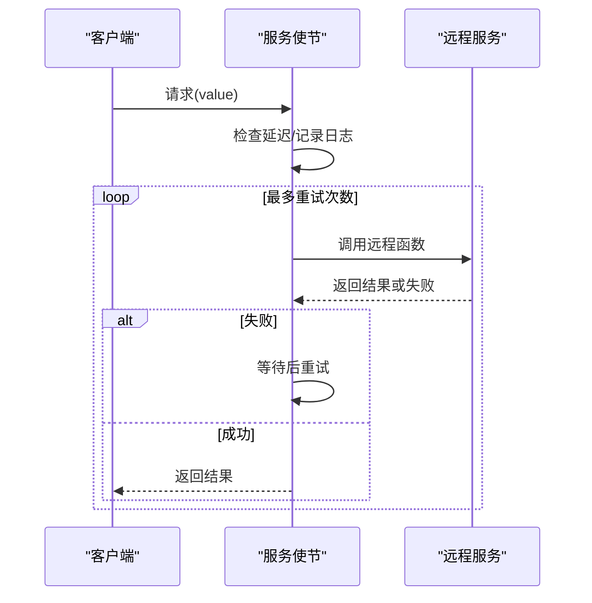
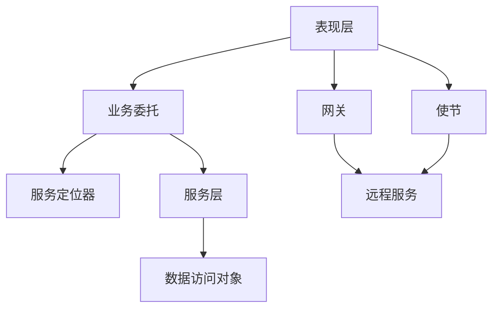

# 集成模式

<cite>
**本文引用的文件**
- [README.md](file://README.md)
- [gateway/README.md](file://gateway/README.md)
- [service-locator/README.md](file://service-locator/README.md)
- [business-delegate/README.md](file://business-delegate/README.md)
- [service-layer/README.md](file://service-layer/README.md)
- [ambassador/README.md](file://ambassador/README.md)
</cite>

## 目录
1. [引言](#引言)
2. [项目结构](#项目结构)
3. [核心组件](#核心组件)
4. [架构总览](#架构总览)
5. [详细组件分析](#详细组件分析)
6. [依赖关系分析](#依赖关系分析)
7. [性能考量](#性能考量)
8. [故障排查指南](#故障排查指南)
9. [结论](#结论)
10. [附录](#附录)

## 引言
本指南聚焦企业应用集成的关键模式：网关模式（API 网关与服务网关）、服务定位器模式、服务委托模式以及服务层模式。通过对仓库中对应模式文档的系统化解读，结合类图与时序图，帮助读者理解这些模式在简化外部系统集成、解耦依赖查找与管理、实现松耦合服务调用、以及构建清晰分层的企业架构中的价值，并提供可操作的最佳实践与排障建议。

## 项目结构
该仓库以“按模式组织”的方式呈现各设计模式的说明与示例。与本指南主题直接相关的模块包括：
- 网关模式：统一外部系统交互入口，封装协议与数据转换，降低耦合度
- 服务定位器模式：集中注册与缓存服务，解耦客户端与具体实现
- 业务委托模式：在表现层与业务层之间增加抽象层，隐藏服务定位细节
- 服务层模式：将业务逻辑封装为独立层，向表现层暴露清晰 API
- 使节（代理）模式：在客户端与远程资源之间引入辅助服务，承载监控、日志、路由等横切关注点

图表来源
- [business-delegate/README.md](file://business-delegate/README.md#L148-L151)
- [service-layer/README.md](file://service-layer/README.md#L358-L359)
- [service-locator/README.md](file://service-locator/README.md#L102-L107)
- [gateway/README.md](file://gateway/README.md#L137-L141)
- [ambassador/README.md](file://ambassador/README.md#L207-L217)

章节来源
- [README.md](file://README.md#L1-L50)

## 核心组件
- 网关（Gateway）
  - 统一外部系统接口，屏蔽协议与数据格式差异，便于扩展与维护
  - 典型场景：微服务 API 网关、数据库网关
- 服务定位器（Service Locator）
  - 中央注册表与缓存机制，集中管理服务实例，降低客户端对具体实现的耦合
- 业务委托（Business Delegate）
  - 在表现层与业务层之间增加抽象层，封装服务定位与调用细节
- 服务层（Service Layer）
  - 将业务逻辑封装为独立层，向上游提供稳定 API，向下屏蔽数据访问复杂性
- 使节（Ambassador）
  - 作为客户端与远程资源之间的代理，承载监控、日志、重试、安全等横切能力

章节来源
- [gateway/README.md](file://gateway/README.md#L18-L37)
- [service-locator/README.md](file://service-locator/README.md#L18-L35)
- [business-delegate/README.md](file://business-delegate/README.md#L19-L38)
- [service-layer/README.md](file://service-layer/README.md#L19-L38)
- [ambassador/README.md](file://ambassador/README.md#L16-L35)

## 架构总览
下图展示了典型的企业应用集成架构：表现层通过业务委托与服务层交互；服务层协调数据访问；服务定位器负责服务发现与缓存；网关与使节分别承担对外部系统的统一接入与横切能力承载。

图表来源
- [business-delegate/README.md](file://business-delegate/README.md#L148-L151)
- [service-layer/README.md](file://service-layer/README.md#L358-L359)
- [service-locator/README.md](file://service-locator/README.md#L102-L107)
- [gateway/README.md](file://gateway/README.md#L137-L141)
- [ambassador/README.md](file://ambassador/README.md#L207-L217)

## 详细组件分析

### 网关模式（Gateway）
- 设计意图
  - 提供统一入口，封装与外部系统的交互细节，降低耦合并提升可维护性
- 关键要点
  - 接口契约：定义统一的执行/调用约定
  - 注册与检索：工厂或注册表负责服务注册与按键检索
  - 执行与异常处理：在统一入口内进行超时、中断等控制
- 实战建议
  - 为不同外部系统提供独立网关实现，避免“上帝对象”
  - 结合限流、熔断、重试等策略，增强鲁棒性
  - 与 API 网关配合，统一请求编排与路由

图表来源
- [gateway/README.md](file://gateway/README.md#L38-L121)

章节来源
- [gateway/README.md](file://gateway/README.md#L18-L37)
- [gateway/README.md](file://gateway/README.md#L133-L154)
- [gateway/README.md](file://gateway/README.md#L155-L161)

### 服务定位器模式（Service Locator）
- 设计意图
  - 通过中央注册表集中管理服务实例，解耦客户端与具体实现
- 关键要点
  - 服务接口与实现分离
  - 定位器负责查找与缓存，支持重复使用与性能优化
  - 可能引入单点风险与配置复杂度
- 实战建议
  - 与依赖注入框架对比选择，权衡测试性与复杂度
  - 对缓存命中率与失效策略进行监控

图表来源
- [service-locator/README.md](file://service-locator/README.md#L36-L95)

章节来源
- [service-locator/README.md](file://service-locator/README.md#L18-L35)
- [service-locator/README.md](file://service-locator/README.md#L96-L121)
- [service-locator/README.md](file://service-locator/README.md#L122-L127)

### 业务委托模式（Business Delegate）
- 设计意图
  - 在表现层与业务层之间增加抽象层，隐藏服务定位与调用细节
- 关键要点
  - 委托者聚合查找器，统一路由到合适业务服务
  - 客户端仅依赖委托者，不感知底层实现变化
- 实战建议
  - 与服务定位器组合，进一步解耦定位与调用
  - 注意额外层次带来的性能与复杂度权衡

图表来源
- [business-delegate/README.md](file://business-delegate/README.md#L47-L120)

章节来源
- [business-delegate/README.md](file://business-delegate/README.md#L19-L38)
- [business-delegate/README.md](file://business-delegate/README.md#L152-L182)
- [business-delegate/README.md](file://business-delegate/README.md#L183-L188)

### 服务层模式（Service Layer）
- 设计意图
  - 将业务逻辑封装为独立层，向上提供稳定 API，向下屏蔽数据访问复杂性
- 关键要点
  - 分层职责清晰：实体、DAO、服务层
  - 服务层聚合 DAO，提供领域用例的编排
- 实战建议
  - 保持服务层无状态与幂等性，便于测试与扩展
  - 与事务边界、异常策略协同设计

图表来源
- [service-layer/README.md](file://service-layer/README.md#L48-L176)

章节来源
- [service-layer/README.md](file://service-layer/README.md#L19-L38)
- [service-layer/README.md](file://service-layer/README.md#L360-L386)
- [service-layer/README.md](file://service-layer/README.md#L387-L392)

### 使节模式（Ambassador）
- 设计意图
  - 在客户端与远程资源之间引入代理，承载监控、日志、重试、安全等横切能力
- 关键要点
  - 适用于遗留系统或难以改造的应用
  - 可与服务网格、API 网关结合
- 实战建议
  - 明确代理职责边界，避免成为“上帝对象”
  - 关注额外网络跳转带来的延迟与资源开销

图表来源
- [ambassador/README.md](file://ambassador/README.md#L36-L177)

章节来源
- [ambassador/README.md](file://ambassador/README.md#L16-L35)
- [ambassador/README.md](file://ambassador/README.md#L178-L206)
- [ambassador/README.md](file://ambassador/README.md#L207-L225)

## 依赖关系分析
- 业务委托与服务定位器
  - 业务委托依赖服务定位器进行服务发现与实例获取
- 服务层与数据访问
  - 服务层依赖 DAO 进行数据持久化与查询
- 网关与使节与外部系统
  - 网关与使节作为统一入口，负责与远程服务交互
- 表现层与集成层
  - 表现层通过业务委托或网关/使节间接访问服务层与外部系统

图表来源
- [business-delegate/README.md](file://business-delegate/README.md#L148-L151)
- [service-layer/README.md](file://service-layer/README.md#L358-L359)
- [service-locator/README.md](file://service-locator/README.md#L102-L107)
- [gateway/README.md](file://gateway/README.md#L137-L141)
- [ambassador/README.md](file://ambassador/README.md#L207-L217)

章节来源
- [business-delegate/README.md](file://business-delegate/README.md#L183-L188)
- [service-layer/README.md](file://service-layer/README.md#L387-L392)
- [service-locator/README.md](file://service-locator/README.md#L122-L127)
- [gateway/README.md](file://gateway/README.md#L155-L161)
- [ambassador/README.md](file://ambassador/README.md#L219-L225)

## 性能考量
- 网关与使节
  - 额外网络跳转与序列化可能带来延迟；应结合连接池、压缩与缓存策略
  - 合理设置超时与重试，避免雪崩效应
- 服务定位器
  - 缓存命中率直接影响性能；需评估缓存失效策略与内存占用
- 服务层
  - 事务与批量操作优化；避免 N+1 查询
- 业务委托
  - 减少不必要的中间层调用；明确职责边界

## 故障排查指南
- 网关
  - 现象：调用超时/中断
  - 排查：检查外部系统可用性、限流与熔断策略、线程中断处理
- 服务定位器
  - 现象：服务查找失败/重复创建
  - 排查：确认注册表状态、缓存一致性、实例生命周期
- 业务委托
  - 现象：路由错误/调用失败
  - 排查：核对查找器规则、委托者装配、异常传播路径
- 服务层
  - 现象：事务回滚/并发冲突
  - 排查：事务边界、锁策略、幂等设计
- 使节
  - 现象：延迟高/重试过多
  - 排查：网络质量、重试间隔、日志与监控指标

章节来源
- [gateway/README.md](file://gateway/README.md#L150-L154)
- [service-locator/README.md](file://service-locator/README.md#L116-L121)
- [business-delegate/README.md](file://business-delegate/README.md#L178-L182)
- [service-layer/README.md](file://service-layer/README.md#L382-L386)
- [ambassador/README.md](file://ambassador/README.md#L192-L206)

## 结论
- 网关模式提供统一的外部系统接入点，适合微服务与多源集成场景
- 服务定位器集中管理服务实例，降低耦合但需关注缓存与配置复杂度
- 业务委托在表现层与业务层之间建立抽象，隐藏服务定位细节
- 服务层将业务逻辑封装为稳定 API，提升可测试性与可维护性
- 使节模式承载横切能力，适用于遗留系统与分布式环境下的可观测性与韧性

## 附录
- 参考资料与扩展阅读
  - 企业集成与架构相关书籍与文章链接见各模式文档末尾

章节来源
- [gateway/README.md](file://gateway/README.md#L162-L167)
- [service-locator/README.md](file://service-locator/README.md#L128-L134)
- [business-delegate/README.md](file://business-delegate/README.md#L189-L194)
- [service-layer/README.md](file://service-layer/README.md#L393-L399)
- [ambassador/README.md](file://ambassador/README.md#L226-L233)