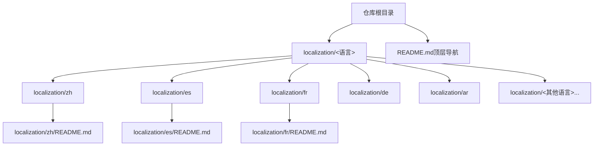
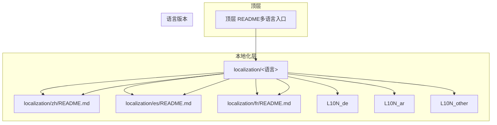
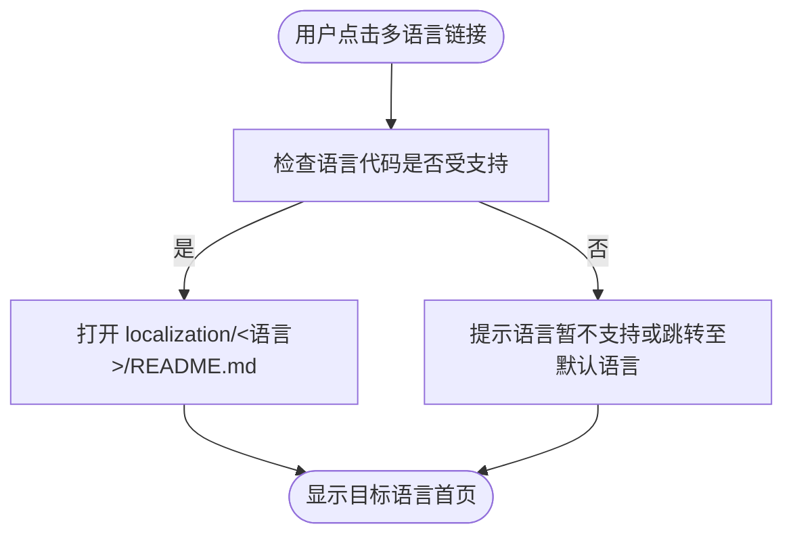
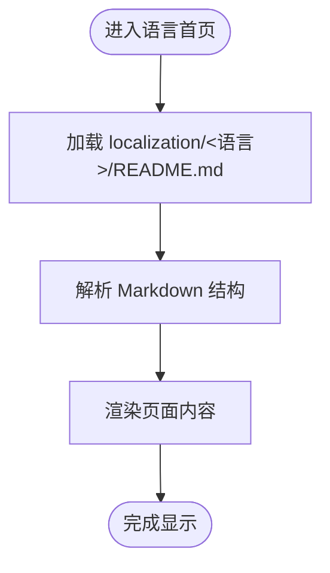
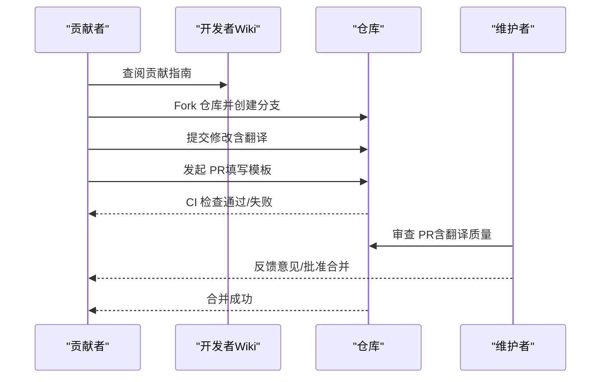
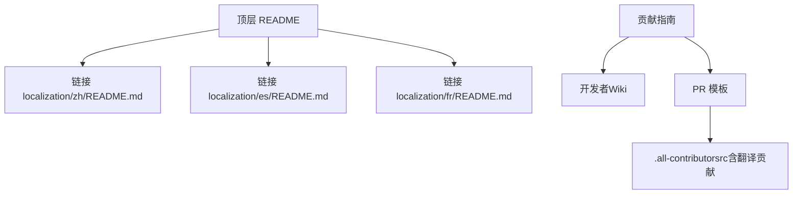

# 多语言支持

<cite>
**本文引用的文件**
- [README.md](file://README.md)
- [CONTRIBUTING.MD](file://CONTRIBUTING.MD)
- [PULL_REQUEST_TEMPLATE.md](file://PULL_REQUEST_TEMPLATE.md)
- [.all-contributorsrc](file://.all-contributorsrc)
- [.github/dependabot.yml](file://.github/dependabot.yml)
- [.github/FUNDING.yml](file://.github/FUNDING.yml)
- [localization/zh/README.md](file://localization/zh/README.md)
- [localization/es/README.md](file://localization/es/README.md)
- [localization/fr/README.md](file://localization/fr/README.md)
</cite>

## 目录
1. [简介](#简介)
2. [项目结构](#项目结构)
3. [核心组件](#核心组件)
4. [架构总览](#架构总览)
5. [详细组件分析](#详细组件分析)
6. [依赖关系分析](#依赖关系分析)
7. [性能考量](#性能考量)
8. [故障排查指南](#故障排查指南)
9. [结论](#结论)
10. [附录](#附录)

## 简介
本项目通过“本地化目录 + 多语言文档”的方式实现了对多种语言的支持。根目录的主文档提供了多语言入口链接，而每个语言的本地化目录（如 localization/zh、localization/es 等）存放对应语言的 README 文档与各设计模式的本地化内容。这种结构清晰地分离了“顶层导航”和“具体语言内容”，便于维护与扩展。

- 多语言入口：根 README 提供了多语言导航链接，覆盖中文、韩语、法语、土耳其语、阿拉伯语、西班牙语、葡萄牙语、印尼语、俄语、德语、日语、越南语、孟加拉语、尼泊尔语、意大利语、丹麦语等。
- 本地化目录：每个语言目录下包含对应语言的 README 以及按模式分组的本地化内容，形成“按语言划分”的文档树。
- 贡献机制：贡献指南指向开发者 Wiki，PR 模板明确了贡献流程；贡献者清单记录了各类贡献类型（含翻译贡献）。

本章节不直接分析具体文件，故无“章节来源”。

## 项目结构
项目采用“顶层 README 导航 + 本地化目录”的组织方式，语言资源按目录隔离，便于独立维护与发布。

图中展示了顶层 README 的多语言入口与 localization 目录的关系，以及部分语言 README 的映射。

**图表来源**
- [README.md](file://README.md#L1-L60)
- [localization/zh/README.md](file://localization/zh/README.md#L1-L42)
- [localization/es/README.md](file://localization/es/README.md#L1-L51)
- [localization/fr/README.md](file://localization/fr/README.md#L1-L72)

**章节来源**
- [README.md](file://README.md#L1-L60)

## 核心组件
- 顶层 README（多语言入口）
  - 提供多语言导航链接，引导用户访问不同语言版本的文档。
  - 链接覆盖范围广，体现了项目的国际化意图。
- 本地化 README（语言版本）
  - 各语言目录下的 README 作为该语言的首页，包含介绍、入门、贡献方式、许可证等信息。
  - 示例：中文 README、西班牙语 README、法语 README。
- 贡献指南与 PR 模板
  - 贡献指南指向开发者 Wiki，明确贡献入口。
  - PR 模板规范了问题描述与解决目标，便于维护者审查。
- 贡献者清单（.all-contributorsrc）
  - 记录了大量贡献者及其贡献类型，其中包含“translation”类型的贡献者，体现翻译工作的组织与认可。
- 依赖与资金支持
  - 依赖自动更新配置（Dependabot）用于维护依赖健康。
  - 资金支持配置（FUNDING）表明项目接受资助。

**章节来源**
- [README.md](file://README.md#L1-L60)
- [localization/zh/README.md](file://localization/zh/README.md#L1-L42)
- [localization/es/README.md](file://localization/es/README.md#L1-L51)
- [localization/fr/README.md](file://localization/fr/README.md#L1-L72)
- [CONTRIBUTING.MD](file://CONTRIBUTING.MD#L1-L4)
- [PULL_REQUEST_TEMPLATE.md](file://PULL_REQUEST_TEMPLATE.md#L1-L15)
- [.all-contributorsrc](file://.all-contributorsrc#L1-L200)
- [.github/dependabot.yml](file://.github/dependabot.yml#L1-L11)
- [.github/FUNDING.yml](file://.github/FUNDING.yml#L1-L2)

## 架构总览
整体架构围绕“顶层导航 + 本地化目录”的双层结构展开，语言版本彼此独立，通过顶层 README 进行统一入口管理。

**图表来源**
- [README.md](file://README.md#L1-L60)
- [localization/zh/README.md](file://localization/zh/README.md#L1-L42)
- [localization/es/README.md](file://localization/es/README.md#L1-L51)
- [localization/fr/README.md](file://localization/fr/README.md#L1-L72)

## 详细组件分析

### 组件A：多语言入口导航
- 功能概述
  - 在顶层 README 中提供多语言导航链接，覆盖多种语言，便于全球用户快速定位到目标语言版本。
- 数据流
  - 用户点击链接 → 定位到对应语言的 localization/<语言>/README.md。
- 复杂度与性能
  - 导航为静态链接，访问开销极低，性能影响可忽略。
- 错误处理与边界
  - 若某语言目录缺失或 README 缺失，链接将失效；建议建立自动化检查以确保链接有效性。
- 优化建议
  - 增加链接可用性检测与定期校验，避免死链。
  - 对于新增语言，自动生成模板 README 并纳入 CI 校验。

**章节来源**
- [README.md](file://README.md#L1-L60)

### 组件B：语言版本首页（示例：中文、西班牙语、法语）
- 功能概述
  - 各语言的 README 作为该语言的首页，包含介绍、入门、贡献方式、许可证等基础信息。
- 内容组织
  - 顶部包含 CI、许可证、覆盖率等徽章。
  - 引言段落介绍设计模式的背景与价值。
  - 入门指引说明如何探索模式与使用资源。
  - 贡献方式与许可证条款清晰标注。
- 复杂度与性能
  - 页面渲染为静态 Markdown，性能优异。
- 错误处理与边界
  - 若 README 缺失或格式异常，需通过 CI 或人工巡检发现并修复。
- 优化建议
  - 统一语言 README 的标题层级与段落结构，提升一致性。
  - 建立语言 README 的模板与校验规则，减少维护成本。

**章节来源**
- [localization/zh/README.md](file://localization/zh/README.md#L1-L42)
- [localization/es/README.md](file://localization/es/README.md#L1-L51)
- [localization/fr/README.md](file://localization/fr/README.md#L1-L72)

### 组件C：贡献流程与翻译贡献者管理
- 功能概述
  - 贡献指南指向开发者 Wiki，PR 模板规范贡献流程；贡献者清单记录各类贡献类型，包括翻译贡献。
- 流程概览
  - 贡献者阅读贡献指南 → Fork 仓库 → 创建分支 → 提交修改 → 发起 PR → 维护者审查与合并。
- 翻译贡献者识别
  - 贡献者清单中包含“translation”贡献类型，表明翻译工作被正式记录与认可。
- 复杂度与性能
  - 贡献流程为人类协作流程，主要影响沟通效率而非系统性能。
- 错误处理与边界
  - PR 内容与模板不符可能导致审查延迟；建议在 CI 中增加模板字段校验。
- 优化建议
  - 在 PR 模板中增加“翻译类变更”的专项说明项。
  - 建立翻译贡献者的激励与追踪机制，提升社区参与度。

**图表来源**
- [CONTRIBUTING.MD](file://CONTRIBUTING.MD#L1-L4)
- [PULL_REQUEST_TEMPLATE.md](file://PULL_REQUEST_TEMPLATE.md#L1-L15)
- [.all-contributorsrc](file://.all-contributorsrc#L1346-L1381)

**章节来源**
- [CONTRIBUTING.MD](file://CONTRIBUTING.MD#L1-L4)
- [PULL_REQUEST_TEMPLATE.md](file://PULL_REQUEST_TEMPLATE.md#L1-L15)
- [.all-contributorsrc](file://.all-contributorsrc#L1346-L1381)

### 组件D：依赖与资金支持
- 功能概述
  - Dependabot 配置用于自动更新依赖，降低安全与兼容风险。
  - 资金支持配置表明项目接受资助，有助于长期维护。
- 复杂度与性能
  - 自动化依赖更新为后台任务，对运行时性能影响极小。
- 错误处理与边界
  - 依赖更新可能引入破坏性变更；建议结合 CI 测试与审阅流程进行控制。
- 优化建议
  - 将依赖更新纳入 CI 流水线，确保更新后构建与测试通过。

**章节来源**
- [.github/dependabot.yml](file://.github/dependabot.yml#L1-L11)
- [.github/FUNDING.yml](file://.github/FUNDING.yml#L1-L2)

## 依赖关系分析
多语言支持的依赖关系主要体现在“顶层 README 导航”与“本地化 README 内容”的耦合，以及“贡献流程”与“贡献者清单”的关联。

**图表来源**
- [README.md](file://README.md#L1-L60)
- [CONTRIBUTING.MD](file://CONTRIBUTING.MD#L1-L4)
- [PULL_REQUEST_TEMPLATE.md](file://PULL_REQUEST_TEMPLATE.md#L1-L15)
- [.all-contributorsrc](file://.all-contributorsrc#L1346-L1381)

**章节来源**
- [README.md](file://README.md#L1-L60)
- [CONTRIBUTING.MD](file://CONTRIBUTING.MD#L1-L4)
- [PULL_REQUEST_TEMPLATE.md](file://PULL_REQUEST_TEMPLATE.md#L1-L15)
- [.all-contributorsrc](file://.all-contributorsrc#L1346-L1381)

## 性能考量
- 静态文档渲染：多语言 README 为静态 Markdown，渲染与访问性能优异。
- CI/CD 影响：顶层 README 的链接有效性与本地化 README 的完整性可通过 CI 校验，避免运行期错误带来的性能回退。
- 维护成本：统一的语言模板与校验规则可显著降低维护成本，间接提升整体性能与稳定性。

本节为通用指导，不直接分析具体文件，故无“章节来源”。

## 故障排查指南
- 多语言链接失效
  - 现象：点击语言链接返回 404。
  - 排查：确认 localization/<语言>/README.md 是否存在；若缺失，补充 README 或移除无效链接。
- README 格式异常
  - 现象：页面渲染错乱或空白。
  - 排查：检查 Markdown 标题层级与语法；必要时使用本地预览工具验证。
- 贡献流程阻塞
  - 现象：PR 无法通过 CI 或被频繁要求修改。
  - 排查：对照 PR 模板逐项检查；确保遵循贡献指南与代码风格。
- 翻译贡献未被记录
  - 现象：翻译贡献未出现在贡献者列表中。
  - 排查：确认贡献者清单中是否存在“translation”贡献类型；如缺失，按流程补充。

**章节来源**
- [README.md](file://README.md#L1-L60)
- [PULL_REQUEST_TEMPLATE.md](file://PULL_REQUEST_TEMPLATE.md#L1-L15)
- [.all-contributorsrc](file://.all-contributorsrc#L1346-L1381)

## 结论
本项目通过“顶层 README 导航 + 本地化目录”的结构，实现了对多语言的良好支持。语言版本彼此独立、易于维护，同时通过贡献指南、PR 模板与贡献者清单形成了较为完善的协作与记录机制。建议进一步完善自动化校验与模板标准化，以提升翻译与维护效率，保障多语言内容的持续更新与质量。

本节为总结性内容，不直接分析具体文件，故无“章节来源”。

## 附录
- 多语言覆盖范围（基于顶层 README 导航链接）
  - 中文、韩语、法语、土耳其语、阿拉伯语、西班牙语、葡萄牙语、印尼语、俄语、德语、日语、越南语、孟加拉语、尼泊尔语、意大利语、丹麦语等。
- 语言版本示例
  - 中文 README、西班牙语 README、法语 README。
- 贡献与资金
  - 贡献指南指向开发者 Wiki；PR 模板规范流程；贡献者清单记录翻译贡献；资金支持配置表明项目接受资助。

**章节来源**
- [README.md](file://README.md#L1-L60)
- [localization/zh/README.md](file://localization/zh/README.md#L1-L42)
- [localization/es/README.md](file://localization/es/README.md#L1-L51)
- [localization/fr/README.md](file://localization/fr/README.md#L1-L72)
- [.all-contributorsrc](file://.all-contributorsrc#L1346-L1381)
- [.github/dependabot.yml](file://.github/dependabot.yml#L1-L11)
- [.github/FUNDING.yml](file://.github/FUNDING.yml#L1-L2)