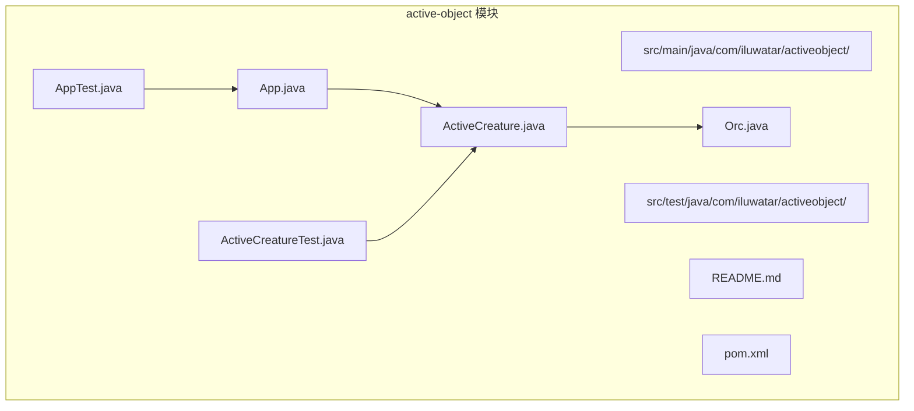
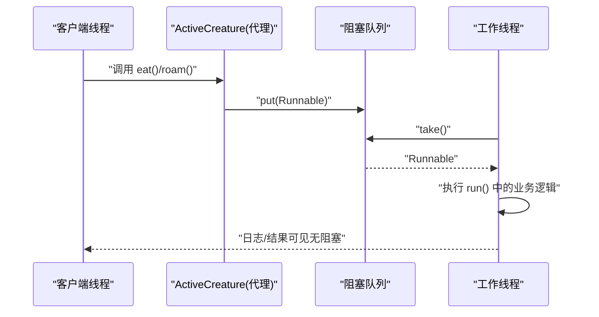
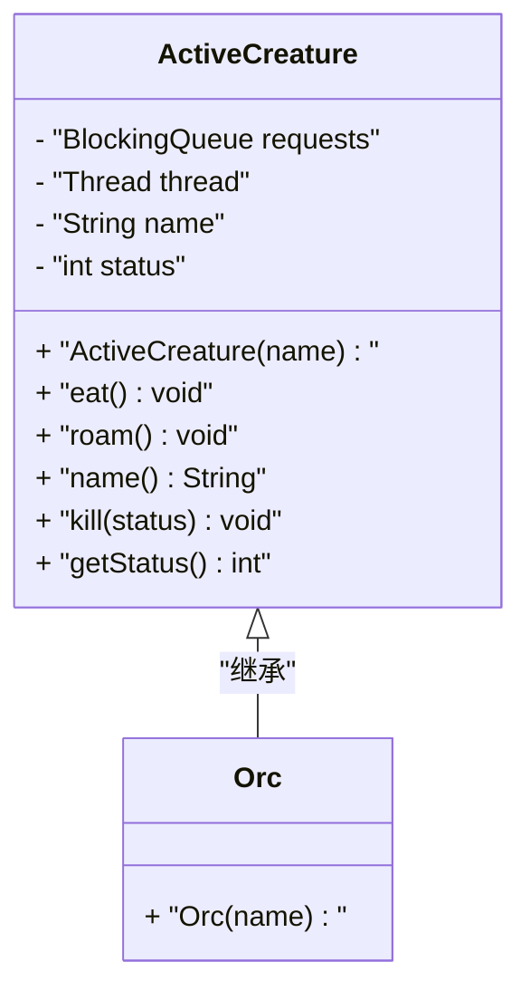
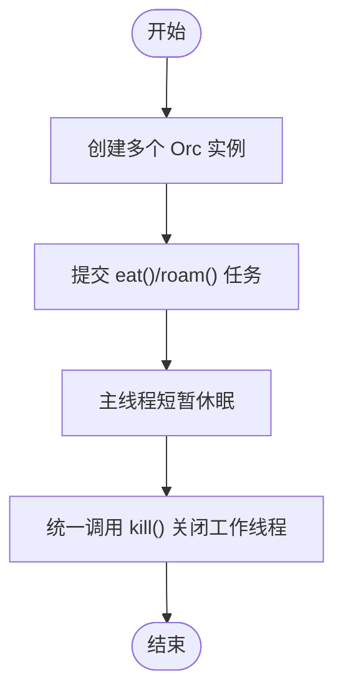
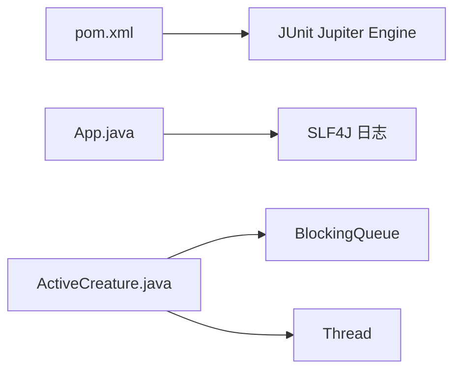

# 主动对象模式

<cite>
**本文引用的文件**
- [ActiveCreature.java](file://active-object/src/main/java/com/iluwatar/activeobject/ActiveCreature.java)
- [App.java](file://active-object/src/main/java/com/iluwatar/activeobject/App.java)
- [Orc.java](file://active-object/src/main/java/com/iluwatar/activeobject/Orc.java)
- [ActiveCreatureTest.java](file://active-object/src/test/java/com/iluwatar/activeobject/ActiveCreatureTest.java)
- [AppTest.java](file://active-object/src/test/java/com/iluwatar/activeobject/AppTest.java)
- [README.md（英文）](file://active-object/README.md)
- [pom.xml](file://active-object/pom.xml)
</cite>

## 目录
1. [引言](#引言)
2. [项目结构](#项目结构)
3. [核心组件](#核心组件)
4. [架构总览](#架构总览)
5. [组件详解](#组件详解)
6. [依赖关系分析](#依赖关系分析)
7. [性能与并发特性](#性能与并发特性)
8. [故障排查指南](#故障排查指南)
9. [结论](#结论)
10. [附录：扩展与参考](#附录扩展与参考)

## 引言
本文件围绕“主动对象模式”的完整技术文档展开，结合仓库中 active-object 模块的实现，系统阐述以下主题：
- 主动对象的设计思想与目标：将方法调用与方法执行解耦，借助独立线程与消息队列实现异步处理，提升响应性与线程安全性。
- 异步方法调用与线程安全机制：通过阻塞队列承载任务请求，由专属工作线程顺序执行，避免共享状态竞争。
- 消息队列、方法调度与线程池管理：在该示例中采用单工作线程与无界阻塞队列；可扩展为多线程与优先级调度。
- 应用场景：游戏开发、实时系统、事件驱动架构等需要高并发与非阻塞交互的领域。
- 方法封装、参数传递与返回值处理：在当前实现中通过 Runnable 封装方法逻辑；返回值可通过回调或 Future/Promise 扩展。
- Actor 模型、消息传递与分布式计算：从主动对象抽象到 Actor 的消息循环与邮箱，再到分布式节点间的消息路由。

## 项目结构
active-object 模块采用标准 Maven 结构，包含主程序入口、基础抽象类与一个具体实现类，并配套单元测试与说明文档。

图表来源
- [ActiveCreature.java](file://active-object/src/main/java/com/iluwatar/activeobject/ActiveCreature.java#L36-L118)
- [Orc.java](file://active-object/src/main/java/com/iluwatar/activeobject/Orc.java#L31-L37)
- [App.java](file://active-object/src/main/java/com/iluwatar/activeobject/App.java#L40-L75)
- [ActiveCreatureTest.java](file://active-object/src/test/java/com/iluwatar/activeobject/ActiveCreatureTest.java#L30-L43)
- [AppTest.java](file://active-object/src/test/java/com/iluwatar/activeobject/AppTest.java#L32-L38)
- [README.md（英文）](file://active-object/README.md#L1-L218)
- [pom.xml](file://active-object/pom.xml#L35-L64)

章节来源
- [README.md（英文）](file://active-object/README.md#L1-L218)
- [pom.xml](file://active-object/pom.xml#L35-L64)

## 核心组件
- ActiveCreature 抽象类：封装线程、阻塞队列与对外接口，负责接收客户端请求并交由内部线程异步执行。
- Orc 具体实现：继承 ActiveCreature，暴露最少必要 API，隐藏执行细节。
- App 程序入口：演示多个 ActiveCreature 实例并发提交任务、短暂休眠观察日志输出、最终中断所有工作线程。

章节来源
- [ActiveCreature.java](file://active-object/src/main/java/com/iluwatar/activeobject/ActiveCreature.java#L36-L118)
- [Orc.java](file://active-object/src/main/java/com/iluwatar/activeobject/Orc.java#L31-L37)
- [App.java](file://active-object/src/main/java/com/iluwatar/activeobject/App.java#L40-L75)

## 架构总览
主动对象模式的关键在于“代理接口 + 内部线程 + 消息队列”的组合：
- 客户端通过 ActiveCreature 的公共方法发起调用（如 eat、roam），这些调用不直接执行业务逻辑，而是封装为 Runnable 并入队。
- 工作线程从队列取出任务并顺序执行，确保线程安全与串行化语义。
- 中断机制通过 kill 触发线程中断，配合状态字段进行优雅退出。

图表来源
- [ActiveCreature.java](file://active-object/src/main/java/com/iluwatar/activeobject/ActiveCreature.java#L51-L91)
- [App.java](file://active-object/src/main/java/com/iluwatar/activeobject/App.java#L57-L73)

## 组件详解

### ActiveCreature 类分析
- 设计要点
  - 内部线程持有并运行消息循环，持续从阻塞队列取任务执行。
  - 对外提供方法（如 eat、roam）仅做“入队”，不阻塞调用线程。
  - 提供 kill 与状态字段，支持优雅关闭。
- 数据结构与复杂度
  - 队列：LinkedBlockingQueue，入队/出队均为 O(1) 均摊。
  - 执行：按 FIFO 顺序串行执行，避免锁竞争。
- 错误处理
  - 捕获中断异常，记录错误日志并在非正常状态时输出。
  - 调用方需正确处理 InterruptedException。
- 可扩展点
  - 引入线程池：将单线程替换为固定大小线程池，提高吞吐。
  - 优先级队列：根据任务类型或优先级调度。
  - 返回值：通过 Future 或回调接口传递结果。

图表来源
- [ActiveCreature.java](file://active-object/src/main/java/com/iluwatar/activeobject/ActiveCreature.java#L36-L118)
- [Orc.java](file://active-object/src/main/java/com/iluwatar/activeobject/Orc.java#L31-L37)

章节来源
- [ActiveCreature.java](file://active-object/src/main/java/com/iluwatar/activeobject/ActiveCreature.java#L36-L118)

### Orc 实现
- 作用：作为 ActiveCreature 的具体实例，展示如何复用代理接口与内部线程机制。
- 行为：构造时启动内部线程；后续通过父类方法提交任务。

章节来源
- [Orc.java](file://active-object/src/main/java/com/iluwatar/activeobject/Orc.java#L31-L37)

### App 程序入口
- 作用：演示多实例并发提交任务、短暂等待后统一中断。
- 关键流程
  - 创建多个 Orc 实例。
  - 交替调用 eat 与 roam，验证异步执行与日志输出。
  - 等待一段时间观察执行完成情况。
  - finally 分支调用 kill 进行优雅关闭。

图表来源
- [App.java](file://active-object/src/main/java/com/iluwatar/activeobject/App.java#L57-L73)

章节来源
- [App.java](file://active-object/src/main/java/com/iluwatar/activeobject/App.java#L40-L75)

### 测试用例
- ActiveCreatureTest：验证名称、状态与基本生命周期（提交任务后 kill）。
- AppTest：验证程序入口可正常运行且不抛出异常。

章节来源
- [ActiveCreatureTest.java](file://active-object/src/test/java/com/iluwatar/activeobject/ActiveCreatureTest.java#L30-L43)
- [AppTest.java](file://active-object/src/test/java/com/iluwatar/activeobject/AppTest.java#L32-L38)

## 依赖关系分析
- 模块依赖
  - active-object 模块依赖 JUnit Jupiter 用于测试。
  - Maven Assembly 插件配置了主类，便于打包执行。
- 运行时依赖
  - 使用 SLF4J 记录日志。
  - 使用 JDK 并发包中的 BlockingQueue 与 Thread。

图表来源
- [pom.xml](file://active-object/pom.xml#L36-L42)
- [App.java](file://active-object/src/main/java/com/iluwatar/activeobject/App.java#L27-L30)
- [ActiveCreature.java](file://active-object/src/main/java/com/iluwatar/activeobject/ActiveCreature.java#L27-L30)

章节来源
- [pom.xml](file://active-object/pom.xml#L36-L42)

## 性能与并发特性
- 吞吐与延迟
  - 单线程执行保证串行化与简单性，但无法利用多核并行；适合轻量任务或需要严格顺序的场景。
  - 若任务耗时较长，建议引入线程池以提升并发度。
- 队列容量
  - 当前使用无界队列，可能在高负载下占用内存；可考虑有界队列与背压策略。
- 中断与优雅停机
  - kill 通过中断工作线程触发退出；注意捕获中断并恢复中断状态，避免上层误判。
- 可观测性
  - 建议在队列长度、任务耗时、线程状态等方面增加监控指标。

[本节为通用性能讨论，不直接分析具体文件]

## 故障排查指南
- 现象：主线程无法退出或资源未释放
  - 排查：确认 finally 分支是否调用 kill；检查线程是否被中断。
- 现象：任务未执行或执行顺序异常
  - 排查：确认调用路径是否通过 ActiveCreature 的公共方法入队；检查队列是否被意外清空。
- 现象：日志缺失或中断异常
  - 排查：检查中断捕获逻辑与状态字段；确保日志框架正确初始化。
- 单元测试失败
  - 排查：ActiveCreatureTest 与 AppTest 均为最小化验证，若失败需检查构建与运行环境。

章节来源
- [ActiveCreature.java](file://active-object/src/main/java/com/iluwatar/activeobject/ActiveCreature.java#L55-L70)
- [App.java](file://active-object/src/main/java/com/iluwatar/activeobject/App.java#L66-L73)
- [ActiveCreatureTest.java](file://active-object/src/test/java/com/iluwatar/activeobject/ActiveCreatureTest.java#L32-L40)
- [AppTest.java](file://active-object/src/test/java/com/iluwatar/activeobject/AppTest.java#L34-L37)

## 结论
active-object 模块以简洁的方式展示了主动对象模式的核心思想：通过“代理接口 + 内部线程 + 消息队列”实现异步方法调用与线程安全。该实现适合入门与教学，亦可在此基础上扩展为多线程、优先级调度与结果回调等高级能力，满足游戏、实时系统与事件驱动架构对高并发与非阻塞交互的需求。

[本节为总结性内容，不直接分析具体文件]

## 附录：扩展与参考
- 与 Actor 模型的关系
  - 主动对象可视为简化版 Actor：每个对象拥有独立线程与消息队列（邮箱）。Actor 的扩展包括：Supervisor 监督、远程消息传递、容错与重试、集群拓扑等。
- 与消息传递和分布式计算
  - 在分布式场景中，可将“工作线程”映射为“节点进程”，“阻塞队列”映射为“消息中间件”，“Runnable”映射为“消息体”。通过网络协议实现跨节点的消息路由与序列化。
- 与 Promise/Future 的结合
  - 当前实现未显式返回值；可在入队时携带回调或 Future，任务完成后设置结果并通知调用方。
- 与命令模式的关系
  - 主动对象中的 Runnable 可视为命令对象，将方法调用封装为对象，便于入队与调度。

章节来源
- [README.md（英文）](file://active-object/README.md#L169-L218)