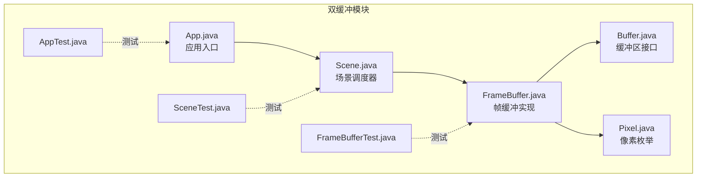
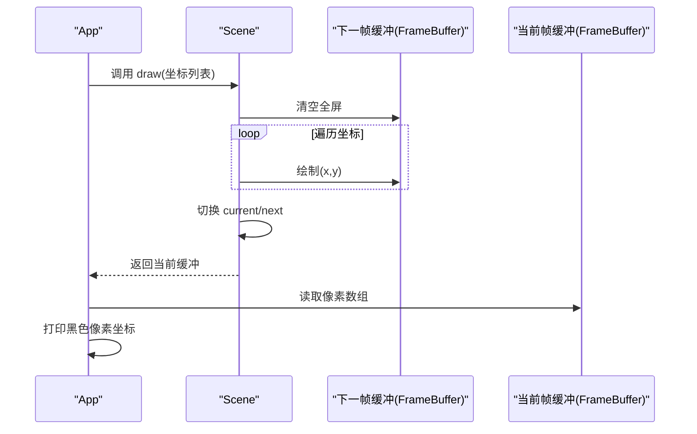
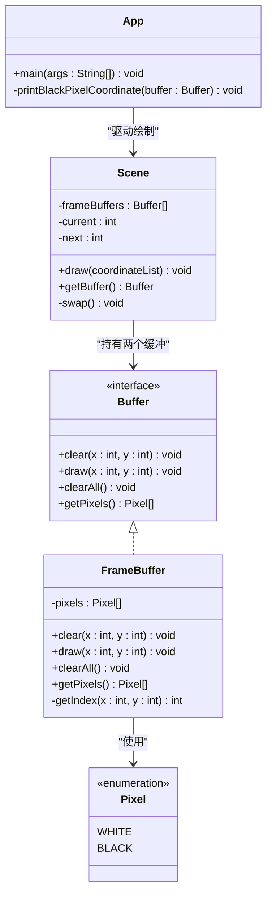
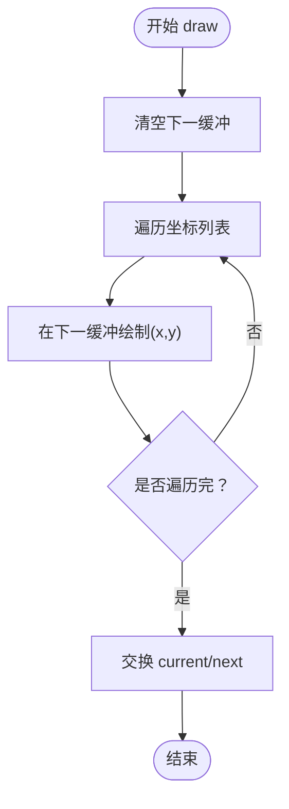
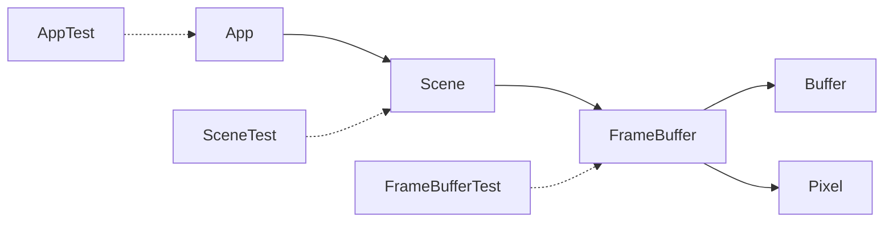

# 双缓冲模式

<cite>
**本文引用的文件**
- [double-buffer/README.md](file://double-buffer/README.md)
- [double-buffer/pom.xml](file://double-buffer/pom.xml)
- [double-buffer/src/main/java/com/iluwatar/doublebuffer/App.java](file://double-buffer/src/main/java/com/iluwatar/doublebuffer/App.java)
- [double-buffer/src/main/java/com/iluwatar/doublebuffer/Buffer.java](file://double-buffer/src/main/java/com/iluwatar/doublebuffer/Buffer.java)
- [double-buffer/src/main/java/com/iluwatar/doublebuffer/FrameBuffer.java](file://double-buffer/src/main/java/com/iluwatar/doublebuffer/FrameBuffer.java)
- [double-buffer/src/main/java/com/iluwatar/doublebuffer/Pixel.java](file://double-buffer/src/main/java/com/iluwatar/doublebuffer/Pixel.java)
- [double-buffer/src/main/java/com/iluwatar/doublebuffer/Scene.java](file://double-buffer/src/main/java/com/iluwatar/doublebuffer/Scene.java)
- [double-buffer/src/test/java/com/iluwatar/doublebuffer/AppTest.java](file://double-buffer/src/test/java/com/iluwatar/doublebuffer/AppTest.java)
- [double-buffer/src/test/java/com/iluwatar/doublebuffer/FrameBufferTest.java](file://double-buffer/src/test/java/com/iluwatar/doublebuffer/FrameBufferTest.java)
- [double-buffer/src/test/java/com/iluwatar/doublebuffer/SceneTest.java](file://double-buffer/src/test/java/com/iluwatar/doublebuffer/SceneTest.java)
- [pom.xml](file://pom.xml)
- [README.md](file://README.md)
</cite>

## 目录
1. [引言](#引言)
2. [项目结构](#项目结构)
3. [核心组件](#核心组件)
4. [架构总览](#架构总览)
5. [详细组件分析](#详细组件分析)
6. [依赖关系分析](#依赖关系分析)
7. [性能考量与优化](#性能考量与优化)
8. [故障排查指南](#故障排查指南)
9. [结论](#结论)
10. [附录：完整实现与测试路径](#附录完整实现与测试路径)

## 引言
本文件系统化阐述双缓冲模式在并发与图形渲染场景中的作用与实现要点，结合仓库中“双缓冲”示例的完整Java实现，深入解析缓冲区切换机制、内存管理策略、性能优化手段，并给出在图形渲染、游戏开发与实时数据处理中的应用建议。同时，文档覆盖多线程环境下的同步与资源竞争解决方案，帮助读者在工程实践中安全、高效地落地该模式。

## 项目结构
双缓冲示例位于独立模块 double-buffer 中，采用标准 Maven 结构组织，包含主程序入口、接口定义、具体实现类、枚举类型以及单元测试。根项目 pom.xml 将其作为子模块纳入统一构建体系。

图表来源
- [double-buffer/src/main/java/com/iluwatar/doublebuffer/App.java](file://double-buffer/src/main/java/com/iluwatar/doublebuffer/App.java#L46-L64)
- [double-buffer/src/main/java/com/iluwatar/doublebuffer/Buffer.java](file://double-buffer/src/main/java/com/iluwatar/doublebuffer/Buffer.java#L30-L60)
- [double-buffer/src/main/java/com/iluwatar/doublebuffer/FrameBuffer.java](file://double-buffer/src/main/java/com/iluwatar/doublebuffer/FrameBuffer.java#L32-L66)
- [double-buffer/src/main/java/com/iluwatar/doublebuffer/Pixel.java](file://double-buffer/src/main/java/com/iluwatar/doublebuffer/Pixel.java#L30-L34)
- [double-buffer/src/main/java/com/iluwatar/doublebuffer/Scene.java](file://double-buffer/src/main/java/com/iluwatar/doublebuffer/Scene.java#L35-L85)
- [double-buffer/src/test/java/com/iluwatar/doublebuffer/AppTest.java](file://double-buffer/src/test/java/com/iluwatar/doublebuffer/AppTest.java#L43-L46)
- [double-buffer/src/test/java/com/iluwatar/doublebuffer/FrameBufferTest.java](file://double-buffer/src/test/java/com/iluwatar/doublebuffer/FrameBufferTest.java#L38-L95)
- [double-buffer/src/test/java/com/iluwatar/doublebuffer/SceneTest.java](file://double-buffer/src/test/java/com/iluwatar/doublebuffer/SceneTest.java#L38-L75)

章节来源
- [double-buffer/pom.xml](file://double-buffer/pom.xml#L1-L67)
- [pom.xml](file://pom.xml#L173-L173)

## 核心组件
- 接口 Buffer：抽象缓冲区能力，提供清屏、绘制单点、全清、获取像素数组等方法。
- 枚举 Pixel：表示像素状态（白/黑），用于简单图形场景。
- 帧缓冲 FrameBuffer：实现 Buffer，内部维护固定尺寸的一维像素数组，提供坐标到索引映射。
- 场景 Scene：持有两个 FrameBuffer，负责在“下一缓冲”上增量绘制，在完成绘制后原子性切换当前/下一缓冲。
- 应用 App：驱动绘制流程，输出当前帧中黑色像素的坐标集合。

章节来源
- [double-buffer/src/main/java/com/iluwatar/doublebuffer/Buffer.java](file://double-buffer/src/main/java/com/iluwatar/doublebuffer/Buffer.java#L30-L60)
- [double-buffer/src/main/java/com/iluwatar/doublebuffer/Pixel.java](file://double-buffer/src/main/java/com/iluwatar/doublebuffer/Pixel.java#L30-L34)
- [double-buffer/src/main/java/com/iluwatar/doublebuffer/FrameBuffer.java](file://double-buffer/src/main/java/com/iluwatar/doublebuffer/FrameBuffer.java#L32-L66)
- [double-buffer/src/main/java/com/iluwatar/doublebuffer/Scene.java](file://double-buffer/src/main/java/com/iluwatar/doublebuffer/Scene.java#L35-L85)
- [double-buffer/src/main/java/com/iluwatar/doublebuffer/App.java](file://double-buffer/src/main/java/com/iluwatar/doublebuffer/App.java#L46-L78)

## 架构总览
双缓冲通过“当前缓冲”与“下一缓冲”的角色分离，确保渲染线程在下一缓冲上进行增量绘制，而显示线程只消费已完成的“当前缓冲”。绘制完成后，通过一次常量时间的交换操作，将“当前/下一”角色互换，从而避免显示过程中的撕裂与部分更新。

图表来源
- [double-buffer/src/main/java/com/iluwatar/doublebuffer/Scene.java](file://double-buffer/src/main/java/com/iluwatar/doublebuffer/Scene.java#L59-L72)
- [double-buffer/src/main/java/com/iluwatar/doublebuffer/FrameBuffer.java](file://double-buffer/src/main/java/com/iluwatar/doublebuffer/FrameBuffer.java#L54-L61)
- [double-buffer/src/main/java/com/iluwatar/doublebuffer/App.java](file://double-buffer/src/main/java/com/iluwatar/doublebuffer/App.java#L66-L77)

## 详细组件分析

### 类图与职责划分

图表来源
- [double-buffer/src/main/java/com/iluwatar/doublebuffer/Buffer.java](file://double-buffer/src/main/java/com/iluwatar/doublebuffer/Buffer.java#L30-L60)
- [double-buffer/src/main/java/com/iluwatar/doublebuffer/FrameBuffer.java](file://double-buffer/src/main/java/com/iluwatar/doublebuffer/FrameBuffer.java#L32-L66)
- [double-buffer/src/main/java/com/iluwatar/doublebuffer/Pixel.java](file://double-buffer/src/main/java/com/iluwatar/doublebuffer/Pixel.java#L30-L34)
- [double-buffer/src/main/java/com/iluwatar/doublebuffer/Scene.java](file://double-buffer/src/main/java/com/iluwatar/doublebuffer/Scene.java#L35-L85)
- [double-buffer/src/main/java/com/iluwatar/doublebuffer/App.java](file://double-buffer/src/main/java/com/iluwatar/doublebuffer/App.java#L46-L78)

章节来源
- [double-buffer/src/main/java/com/iluwatar/doublebuffer/Buffer.java](file://double-buffer/src/main/java/com/iluwatar/doublebuffer/Buffer.java#L30-L60)
- [double-buffer/src/main/java/com/iluwatar/doublebuffer/FrameBuffer.java](file://double-buffer/src/main/java/com/iluwatar/doublebuffer/FrameBuffer.java#L32-L66)
- [double-buffer/src/main/java/com/iluwatar/doublebuffer/Pixel.java](file://double-buffer/src/main/java/com/iluwatar/doublebuffer/Pixel.java#L30-L34)
- [double-buffer/src/main/java/com/iluwatar/doublebuffer/Scene.java](file://double-buffer/src/main/java/com/iluwatar/doublebuffer/Scene.java#L35-L85)
- [double-buffer/src/main/java/com/iluwatar/doublebuffer/App.java](file://double-buffer/src/main/java/com/iluwatar/doublebuffer/App.java#L46-L78)

### 缓冲区切换机制与内存管理
- 双缓冲数组：Scene 内部维护长度为 2 的 FrameBuffer 数组，分别承担“当前”和“下一”角色。
- 切换策略：采用异或三元交换，常数时间完成 current 与 next 的互换，避免额外临时变量与锁开销。
- 内存复用：FrameBuffer 在构造时一次性分配固定大小的像素数组，后续仅进行写入与清空，降低 GC 压力。
- 索引计算：通过行优先索引函数将二维坐标映射到一维数组，保证访问局部性与缓存友好。

图表来源
- [double-buffer/src/main/java/com/iluwatar/doublebuffer/Scene.java](file://double-buffer/src/main/java/com/iluwatar/doublebuffer/Scene.java#L59-L72)
- [double-buffer/src/main/java/com/iluwatar/doublebuffer/FrameBuffer.java](file://double-buffer/src/main/java/com/iluwatar/doublebuffer/FrameBuffer.java#L63-L65)

章节来源
- [double-buffer/src/main/java/com/iluwatar/doublebuffer/Scene.java](file://double-buffer/src/main/java/com/iluwatar/doublebuffer/Scene.java#L79-L83)
- [double-buffer/src/main/java/com/iluwatar/doublebuffer/FrameBuffer.java](file://double-buffer/src/main/java/com/iluwatar/doublebuffer/FrameBuffer.java#L34-L37)

### 多线程环境下的同步与竞态规避
- 单线程模型：示例默认在单线程 main 中顺序执行，避免了显式锁与原子变量。
- 并发扩展建议：
  - 使用 volatile 或原子整型 current/next 字段，确保切换对其他线程可见。
  - 在绘制阶段对“下一缓冲”加写锁，切换时释放；在读取阶段对“当前缓冲”加读锁。
  - 使用无锁队列或信号量协调生产者/消费者，避免阻塞。
- 数据一致性保障：通过“先写后切”的顺序，确保读线程始终看到完整帧，避免中间态被观察到。

章节来源
- [double-buffer/src/main/java/com/iluwatar/doublebuffer/Scene.java](file://double-buffer/src/main/java/com/iluwatar/doublebuffer/Scene.java#L59-L72)

### 图形渲染、游戏开发与实时数据处理的应用
- 图形渲染：在下一缓冲上累积绘制，完成后切换，消除撕裂与闪烁。
- 游戏开发：每帧在下一缓冲增量更新精灵位置与状态，切换后统一呈现。
- 实时数据处理：在下一缓冲聚合采样数据，切换后对外发布完整周期的数据快照。

章节来源
- [double-buffer/README.md](file://double-buffer/README.md#L215-L227)

## 依赖关系分析
双缓冲模块的依赖集中在 Scene 与 FrameBuffer 之间，FrameBuffer 实现 Buffer 接口，App 通过 Scene 获取当前帧进行展示。测试模块验证各组件行为。

图表来源
- [double-buffer/src/main/java/com/iluwatar/doublebuffer/App.java](file://double-buffer/src/main/java/com/iluwatar/doublebuffer/App.java#L46-L64)
- [double-buffer/src/main/java/com/iluwatar/doublebuffer/Scene.java](file://double-buffer/src/main/java/com/iluwatar/doublebuffer/Scene.java#L46-L52)
- [double-buffer/src/main/java/com/iluwatar/doublebuffer/FrameBuffer.java](file://double-buffer/src/main/java/com/iluwatar/doublebuffer/FrameBuffer.java#L32-L41)
- [double-buffer/src/main/java/com/iluwatar/doublebuffer/Buffer.java](file://double-buffer/src/main/java/com/iluwatar/doublebuffer/Buffer.java#L30-L60)
- [double-buffer/src/main/java/com/iluwatar/doublebuffer/Pixel.java](file://double-buffer/src/main/java/com/iluwatar/doublebuffer/Pixel.java#L30-L34)

章节来源
- [double-buffer/src/test/java/com/iluwatar/doublebuffer/AppTest.java](file://double-buffer/src/test/java/com/iluwatar/doublebuffer/AppTest.java#L43-L46)
- [double-buffer/src/test/java/com/iluwatar/doublebuffer/FrameBufferTest.java](file://double-buffer/src/test/java/com/iluwatar/doublebuffer/FrameBufferTest.java#L38-L95)
- [double-buffer/src/test/java/com/iluwatar/doublebuffer/SceneTest.java](file://double-buffer/src/test/java/com/iluwatar/doublebuffer/SceneTest.java#L38-L75)

## 性能考量与优化
- 时间复杂度
  - 每帧绘制：O(N)，N 为本次绘制的像素数量。
  - 切换操作：O(1)，通过异或三元交换完成。
- 空间复杂度
  - 每个帧缓冲占用固定内存，整体空间为 2×(宽×高)×单位像素对象大小。
- 局部性与缓存
  - 行优先索引提升连续写入的缓存命中率。
- 内存优化建议
  - 复用像素数组，避免频繁分配与回收。
  - 对于大分辨率场景，可考虑分块渲染与延迟提交策略。
- 并发优化
  - 使用无锁结构或细粒度锁减少争用。
  - 采用读写锁区分读写路径，提高吞吐。

章节来源
- [double-buffer/src/main/java/com/iluwatar/doublebuffer/FrameBuffer.java](file://double-buffer/src/main/java/com/iluwatar/doublebuffer/FrameBuffer.java#L63-L65)
- [double-buffer/src/main/java/com/iluwatar/doublebuffer/Scene.java](file://double-buffer/src/main/java/com/iluwatar/doublebuffer/Scene.java#L79-L83)

## 故障排查指南
- 绘制结果为空或异常
  - 检查坐标是否越界，确认索引计算逻辑。
  - 确认 draw 调用发生在“下一缓冲”，并在切换前完成。
- 切换后画面不变
  - 核验 swap 是否正确执行，current/next 角色是否互换。
- 测试失败
  - 使用 SceneTest 与 FrameBufferTest 验证 draw/clear/clearAll/getPixels 的行为。
  - 注意测试中对私有字段的反射访问仅用于断言，不应用于生产代码。

章节来源
- [double-buffer/src/test/java/com/iluwatar/doublebuffer/FrameBufferTest.java](file://double-buffer/src/test/java/com/iluwatar/doublebuffer/FrameBufferTest.java#L38-L95)
- [double-buffer/src/test/java/com/iluwatar/doublebuffer/SceneTest.java](file://double-buffer/src/test/java/com/iluwatar/doublebuffer/SceneTest.java#L38-L75)

## 结论
双缓冲模式通过“当前/下一”缓冲的角色分离与原子切换，有效避免了渲染过程中的视觉撕裂与中间态暴露，是图形渲染与实时系统中的关键优化手段。在工程实践中，应结合业务场景选择合适的并发控制策略，配合内存与缓存优化，持续评估性能与稳定性。

## 附录：完整实现与测试路径
- 完整实现路径
  - 接口定义：[Buffer.java](file://double-buffer/src/main/java/com/iluwatar/doublebuffer/Buffer.java#L30-L60)
  - 帧缓冲实现：[FrameBuffer.java](file://double-buffer/src/main/java/com/iluwatar/doublebuffer/FrameBuffer.java#L32-L66)
  - 枚举类型：[Pixel.java](file://double-buffer/src/main/java/com/iluwatar/doublebuffer/Pixel.java#L30-L34)
  - 场景调度：[Scene.java](file://double-buffer/src/main/java/com/iluwatar/doublebuffer/Scene.java#L35-L85)
  - 应用入口：[App.java](file://double-buffer/src/main/java/com/iluwatar/doublebuffer/App.java#L46-L78)
- 测试用例路径
  - 应用测试：[AppTest.java](file://double-buffer/src/test/java/com/iluwatar/doublebuffer/AppTest.java#L43-L46)
  - 帧缓冲测试：[FrameBufferTest.java](file://double-buffer/src/test/java/com/iluwatar/doublebuffer/FrameBufferTest.java#L38-L95)
  - 场景测试：[SceneTest.java](file://double-buffer/src/test/java/com/iluwatar/doublebuffer/SceneTest.java#L38-L75)
- 模块配置
  - 双缓冲模块 POM：[double-buffer/pom.xml](file://double-buffer/pom.xml#L1-L67)
  - 根项目 POM（含模块声明）：[pom.xml](file://pom.xml#L173-L173)
- 说明
  - 示例 README 提供了模式动机、适用场景与参考链接：[double-buffer/README.md](file://double-buffer/README.md#L1-L253)
  - 顶层 README 提供项目概览与贡献信息：[README.md](file://README.md#L1-L200)