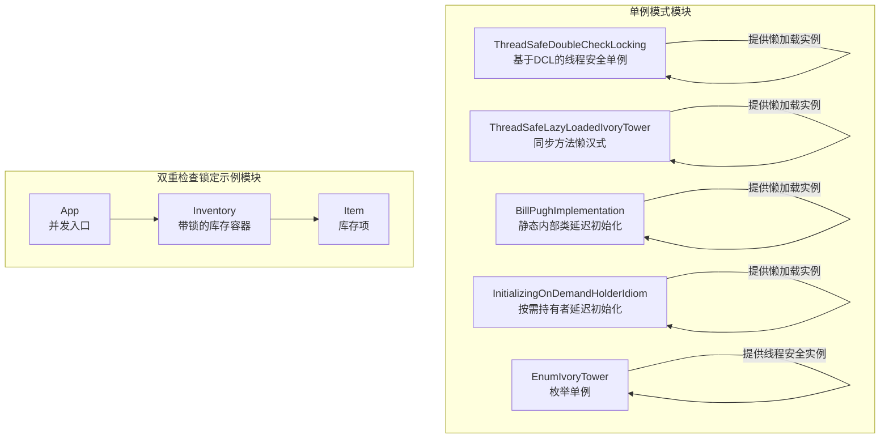
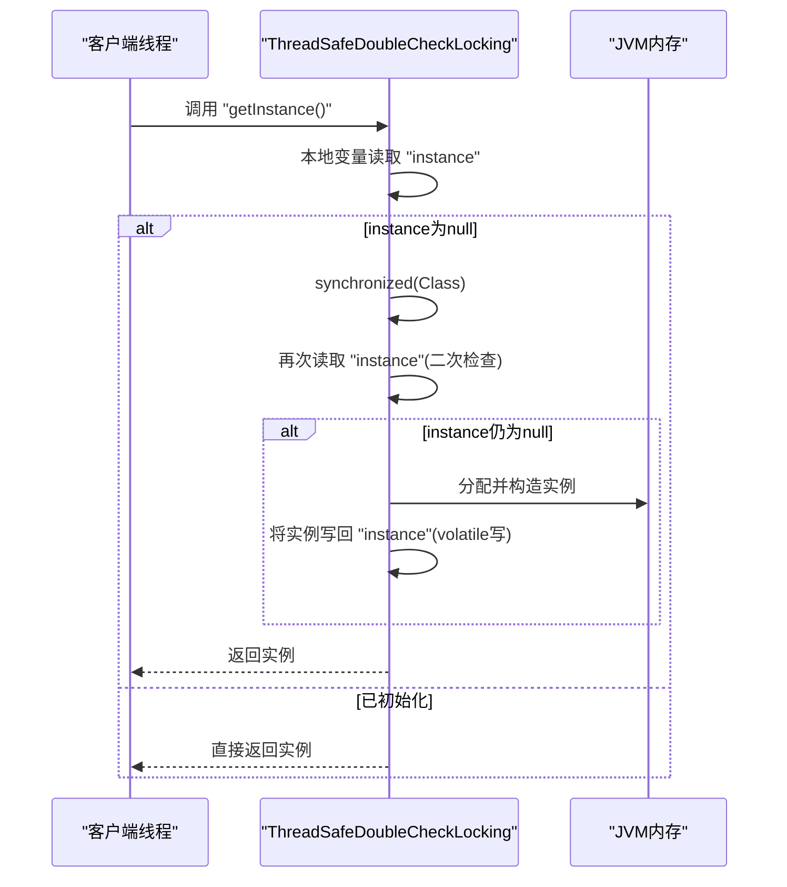
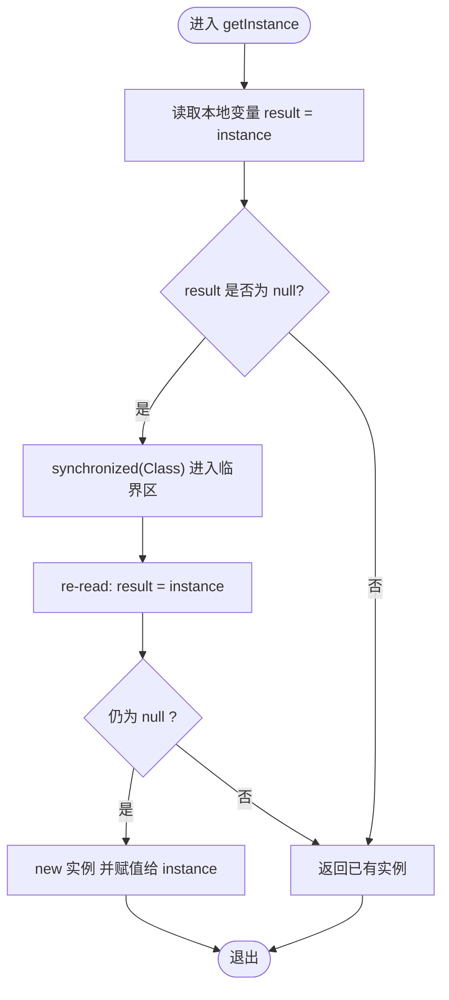
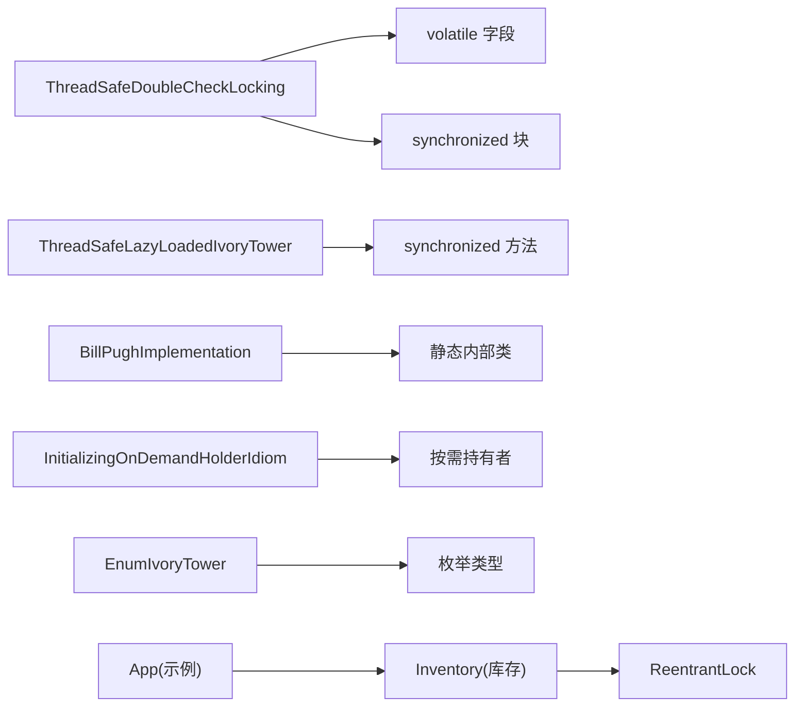

# 双重检查锁定模式

<cite>
**本文引用的文件**
- [ThreadSafeDoubleCheckLocking.java](file://singleton/src/main/java/com/iluwatar/singleton/ThreadSafeDoubleCheckLocking.java)
- [ThreadSafeLazyLoadedIvoryTower.java](file://singleton/src/main/java/com/iluwatar/singleton/ThreadSafeLazyLoadedIvoryTower.java)
- [BillPughImplementation.java](file://singleton/src/main/java/com/iluwatar/singleton/BillPughImplementation.java)
- [InitializingOnDemandHolderIdiom.java](file://singleton/src/main/java/com/iluwatar/singleton/InitializingOnDemandHolderIdiom.java)
- [EnumIvoryTower.java](file://singleton/src/main/java/com/iluwatar/singleton/EnumIvoryTower.java)
- [ThreadSafeDoubleCheckLockingTest.java](file://singleton/src/test/java/com/iluwatar/singleton/ThreadSafeDoubleCheckLockingTest.java)
- [App.java](file://double-checked-locking/src/main/java/com/iluwatar/doublechecked/locking/App.java)
- [Inventory.java](file://double-checked-locking/src/main/java/com/iluwatar/doublechecked/locking/Inventory.java)
- [Item.java](file://double-checked-locking/src/main/java/com/iluwatar/doublechecked/locking/Item.java)
- [README.md（双检查锁定）](file://double-checked-locking/README.md)
- [README.md（单例）](file://singleton/README.md)
</cite>

## 目录
1. [引言](#引言)
2. [项目结构](#项目结构)
3. [核心组件](#核心组件)
4. [架构总览](#架构总览)
5. [详细组件分析](#详细组件分析)
6. [依赖关系分析](#依赖关系分析)
7. [性能考量](#性能考量)
8. [故障排查指南](#故障排查指南)
9. [结论](#结论)
10. [附录](#附录)

## 引言
本文件围绕双重检查锁定（Double-Checked Locking, DCL）模式展开，系统阐述其在线程安全、内存可见性与指令重排序方面的原理与实践，并结合仓库中的单例实现与并发示例，给出正确的实现方式、常见陷阱、替代方案以及性能优化建议。读者可据此在多线程环境中实现高效且安全的懒加载单例或资源初始化。

## 项目结构
本仓库中与DCL直接相关的内容主要分布在两个模块：
- 单例模式模块：提供多种线程安全的单例实现，包括基于DCL的实现与替代方案。
- 双重检查锁定示例模块：通过库存并发写入场景演示“先检查后加锁”的思想，帮助理解DCL在通用并发控制中的应用。

图表来源
- [ThreadSafeDoubleCheckLocking.java](file://singleton/src/main/java/com/iluwatar/singleton/ThreadSafeDoubleCheckLocking.java#L35-L84)
- [ThreadSafeLazyLoadedIvoryTower.java](file://singleton/src/main/java/com/iluwatar/singleton/ThreadSafeLazyLoadedIvoryTower.java#L32-L60)
- [BillPughImplementation.java](file://singleton/src/main/java/com/iluwatar/singleton/BillPughImplementation.java#L37-L73)
- [InitializingOnDemandHolderIdiom.java](file://singleton/src/main/java/com/iluwatar/singleton/InitializingOnDemandHolderIdiom.java#L40-L69)
- [EnumIvoryTower.java](file://singleton/src/main/java/com/iluwatar/singleton/EnumIvoryTower.java#L33-L44)
- [App.java](file://double-checked-locking/src/main/java/com/iluwatar/doublechecked/locking/App.java#L44-L68)
- [Inventory.java](file://double-checked-locking/src/main/java/com/iluwatar/doublechecked/locking/Inventory.java#L37-L82)
- [Item.java](file://double-checked-locking/src/main/java/com/iluwatar/doublechecked/locking/Item.java#L30-L32)

章节来源
- [README.md（双检查锁定）](file://double-checked-locking/README.md#L1-L125)
- [README.md（单例）](file://singleton/README.md#L1-L110)

## 核心组件
- 基于DCL的线程安全单例：通过两次null检查与synchronized块保护关键初始化路径，配合volatile确保可见性与禁止重排序。
- 懒汉式同步单例：通过synchronized方法保证线程安全，但每次获取实例均需竞争锁，性能较低。
- 静态内部类延迟初始化：利用类初始化的线程安全特性，无需显式同步。
- 按需持有者延迟初始化：通过私有静态内部类延迟创建实例，天然避免竞态条件。
- 枚举单例：最简洁可靠的单例实现，天然防止反射与序列化破坏。

章节来源
- [ThreadSafeDoubleCheckLocking.java](file://singleton/src/main/java/com/iluwatar/singleton/ThreadSafeDoubleCheckLocking.java#L35-L84)
- [ThreadSafeLazyLoadedIvoryTower.java](file://singleton/src/main/java/com/iluwatar/singleton/ThreadSafeLazyLoadedIvoryTower.java#L32-L60)
- [BillPughImplementation.java](file://singleton/src/main/java/com/iluwatar/singleton/BillPughImplementation.java#L37-L73)
- [InitializingOnDemandHolderIdiom.java](file://singleton/src/main/java/com/iluwatar/singleton/InitializingOnDemandHolderIdiom.java#L40-L69)
- [EnumIvoryTower.java](file://singleton/src/main/java/com/iluwatar/singleton/EnumIvoryTower.java#L33-L44)

## 架构总览
下图展示DCL在单例获取流程中的调用序列，体现“先无锁快速判断，再加锁二次确认”的核心思想。

图表来源
- [ThreadSafeDoubleCheckLocking.java](file://singleton/src/main/java/com/iluwatar/singleton/ThreadSafeDoubleCheckLocking.java#L56-L83)

## 详细组件分析

### 组件A：基于DCL的线程安全单例
- 关键点
  - volatile字段：确保多线程对实例的可见性与禁止指令重排序，使“写入实例”发生在“构造完成”之后。
  - 两次null检查：首次检查避免不必要的加锁；进入synchronized块后再次检查，防止重复创建。
  - 双重检查+同步块：仅在首次创建时加锁，后续访问只做读操作，显著降低锁开销。
  - 反射防护：在私有构造函数中检测已存在实例，抛出异常以阻止反射创建。
- 算法流程

图表来源
- [ThreadSafeDoubleCheckLocking.java](file://singleton/src/main/java/com/iluwatar/singleton/ThreadSafeDoubleCheckLocking.java#L56-L83)

章节来源
- [ThreadSafeDoubleCheckLocking.java](file://singleton/src/main/java/com/iluwatar/singleton/ThreadSafeDoubleCheckLocking.java#L35-L84)
- [ThreadSafeDoubleCheckLockingTest.java](file://singleton/src/test/java/com/iluwatar/singleton/ThreadSafeDoubleCheckLockingTest.java#L36-L56)

### 组件B：懒汉式同步单例
- 特点
  - 同步方法保证线程安全，但每次调用都需要竞争锁，性能较差。
  - 适合实例创建成本极低或调用频率很低的场景。
- 适用性
  - 不推荐在高并发热点路径上使用；若必须使用，应考虑DCL或静态内部类方案。

章节来源
- [ThreadSafeLazyLoadedIvoryTower.java](file://singleton/src/main/java/com/iluwatar/singleton/ThreadSafeLazyLoadedIvoryTower.java#L32-L60)

### 组件C：静态内部类延迟初始化
- 特点
  - 利用类初始化的线程安全语义，无需volatile或synchronized。
  - 延迟加载，天然避免竞态条件。
- 优势
  - 性能与安全性兼顾，实现简洁。

章节来源
- [BillPughImplementation.java](file://singleton/src/main/java/com/iluwatar/singleton/BillPughImplementation.java#L37-L73)

### 组件D：按需持有者延迟初始化
- 特点
  - 私有静态内部类仅在被引用时才加载，从而延迟实例创建。
  - 天然线程安全，无需额外同步。
- 优势
  - 与静态内部类类似，但更强调“按需触发”。

章节来源
- [InitializingOnDemandHolderIdiom.java](file://singleton/src/main/java/com/iluwatar/singleton/InitializingOnDemandHolderIdiom.java#L40-L69)

### 组件E：枚举单例
- 特点
  - 最简洁可靠的单例实现，天然防止反射与序列化破坏。
- 适用性
  - 推荐作为首选方案，除非需要扩展方法或特殊生命周期管理。

章节来源
- [EnumIvoryTower.java](file://singleton/src/main/java/com/iluwatar/singleton/EnumIvoryTower.java#L33-L44)

### 组件F：双重检查锁定示例（库存并发）
- 场景说明
  - 使用固定大小的库存容器，多个线程并发尝试添加物品。
  - 通过ReentrantLock保护临界区，模拟“先检查容量，再加锁确认”的双重检查思想。
- 与DCL的关系
  - 示例展示了“先检查后加锁”的通用思想，有助于理解DCL在对象初始化中的等价逻辑。

章节来源
- [App.java](file://double-checked-locking/src/main/java/com/iluwatar/doublechecked/locking/App.java#L44-L68)
- [Inventory.java](file://double-checked-locking/src/main/java/com/iluwatar/doublechecked/locking/Inventory.java#L37-L82)
- [Item.java](file://double-checked-locking/src/main/java/com/iluwatar/doublechecked/locking/Item.java#L30-L32)
- [README.md（双检查锁定）](file://double-checked-locking/README.md#L14-L91)

## 依赖关系分析
- 单例实现之间的依赖
  - DCL实现依赖volatile与synchronized；懒汉式实现依赖synchronized方法；静态内部类与按需持有者实现不依赖显式同步。
- 示例模块与单例实现的关联
  - 示例模块通过并发任务驱动库存写入，体现“先检查后加锁”的思想，与DCL在对象初始化上的思路一致。

图表来源
- [ThreadSafeDoubleCheckLocking.java](file://singleton/src/main/java/com/iluwatar/singleton/ThreadSafeDoubleCheckLocking.java#L35-L84)
- [ThreadSafeLazyLoadedIvoryTower.java](file://singleton/src/main/java/com/iluwatar/singleton/ThreadSafeLazyLoadedIvoryTower.java#L32-L60)
- [BillPughImplementation.java](file://singleton/src/main/java/com/iluwatar/singleton/BillPughImplementation.java#L37-L73)
- [InitializingOnDemandHolderIdiom.java](file://singleton/src/main/java/com/iluwatar/singleton/InitializingOnDemandHolderIdiom.java#L40-L69)
- [EnumIvoryTower.java](file://singleton/src/main/java/com/iluwatar/singleton/EnumIvoryTower.java#L33-L44)
- [App.java](file://double-checked-locking/src/main/java/com/iluwatar/doublechecked/locking/App.java#L44-L68)
- [Inventory.java](file://double-checked-locking/src/main/java/com/iluwatar/doublechecked/locking/Inventory.java#L37-L82)

章节来源
- [ThreadSafeDoubleCheckLocking.java](file://singleton/src/main/java/com/iluwatar/singleton/ThreadSafeDoubleCheckLocking.java#L35-L84)
- [ThreadSafeLazyLoadedIvoryTower.java](file://singleton/src/main/java/com/iluwatar/singleton/ThreadSafeLazyLoadedIvoryTower.java#L32-L60)
- [BillPughImplementation.java](file://singleton/src/main/java/com/iluwatar/singleton/BillPughImplementation.java#L37-L73)
- [InitializingOnDemandHolderIdiom.java](file://singleton/src/main/java/com/iluwatar/singleton/InitializingOnDemandHolderIdiom.java#L40-L69)
- [EnumIvoryTower.java](file://singleton/src/main/java/com/iluwatar/singleton/EnumIvoryTower.java#L33-L44)
- [App.java](file://double-checked-locking/src/main/java/com/iluwatar/doublechecked/locking/App.java#L44-L68)
- [Inventory.java](file://double-checked-locking/src/main/java/com/iluwatar/doublechecked/locking/Inventory.java#L37-L82)

## 性能考量
- DCL的优势
  - 首次创建时加锁，后续访问只做读操作，显著降低锁竞争开销。
- 典型权衡
  - volatile写入带来一定内存屏障成本；但在大多数场景下，远小于持续持有锁的成本。
- 替代方案对比
  - 静态内部类与按需持有者：无显式同步，性能优异且实现简单。
  - 枚举单例：实现最简，适用于大多数需求。
  - 懒汉式同步：实现简单但锁开销大，不建议在高并发路径使用。

章节来源
- [README.md（双检查锁定）](file://double-checked-locking/README.md#L104-L119)
- [README.md（单例）](file://singleton/README.md#L81-L96)

## 故障排查指南
- 常见问题
  - 未使用volatile导致的可见性问题：实例可能被其他线程看到部分构造状态。
  - 反射破坏：可通过私有构造函数中检测已存在实例并抛出异常进行防护。
  - Java 1.4及以前版本的DCL缺陷：需配合volatile使用。
- 定位手段
  - 单元测试验证反射防护行为。
  - 并发压力测试观察锁竞争与吞吐表现。
- 修复建议
  - 在DCL实现中确保volatile字段与双重检查+同步块的组合。
  - 优先采用静态内部类或枚举单例以规避复杂性。

章节来源
- [ThreadSafeDoubleCheckLocking.java](file://singleton/src/main/java/com/iluwatar/singleton/ThreadSafeDoubleCheckLocking.java#L35-L49)
- [ThreadSafeDoubleCheckLockingTest.java](file://singleton/src/test/java/com/iluwatar/singleton/ThreadSafeDoubleCheckLockingTest.java#L48-L54)
- [README.md（双检查锁定）](file://double-checked-locking/README.md#L111-L114)

## 结论
- DCL是实现懒加载单例的有效手段，但其实现细节（volatile、双重检查、同步块）必须严谨。
- 在现代Java中，静态内部类与枚举单例通常优于DCL，因为它们更简洁且不易出错。
- 若确需使用DCL，请严格遵循“volatile + 双重检查 + 同步块”的组合，并辅以充分的并发测试与审查。

## 附录
- 相关设计模式
  - 单例模式：DCL常用于实现线程安全的单例。
  - 懒加载：与DCL共享延迟初始化的核心思想。
- 参考资料
  - Java并发编程与Effective Java等经典书籍与文档。

章节来源
- [README.md（双检查锁定）](file://double-checked-locking/README.md#L116-L125)
- [README.md（单例）](file://singleton/README.md#L97-L110)