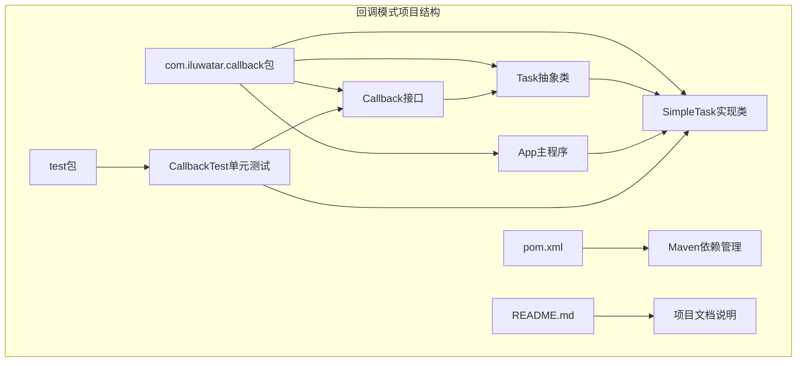
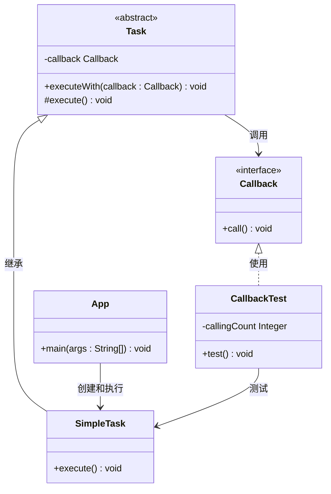
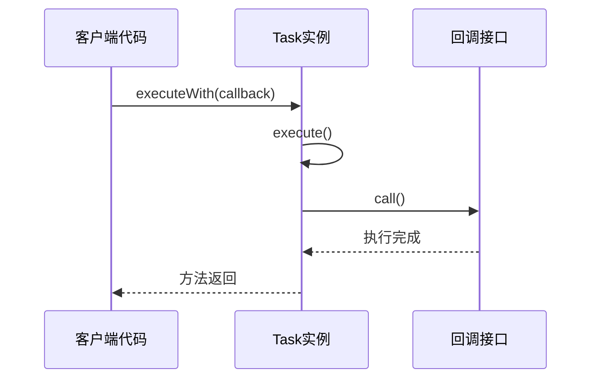
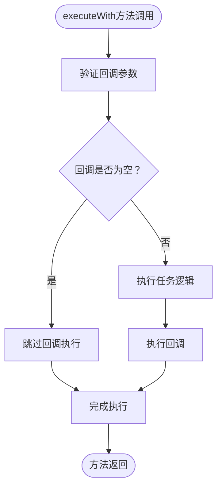
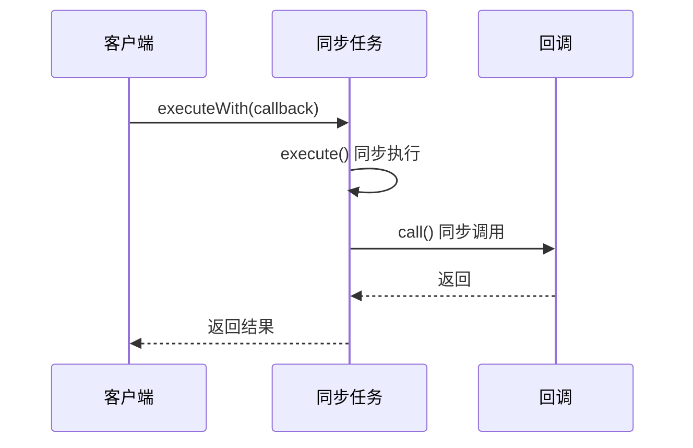
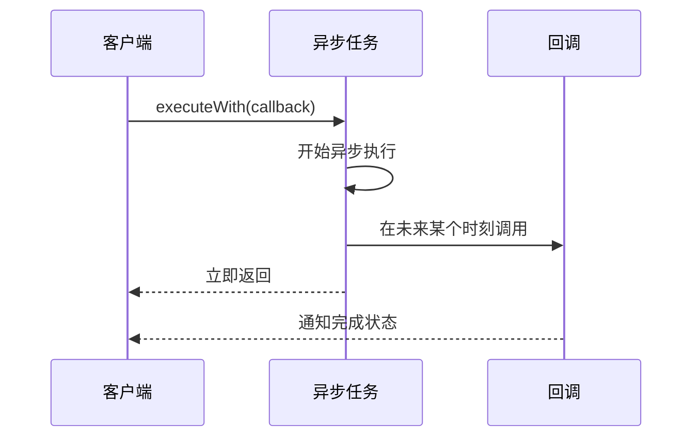
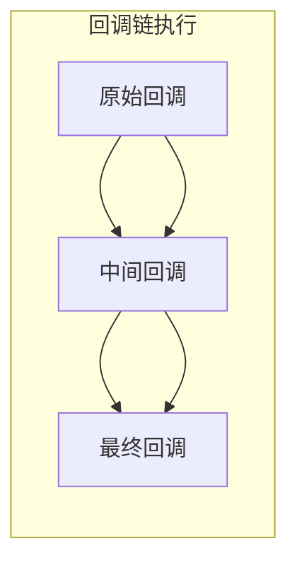
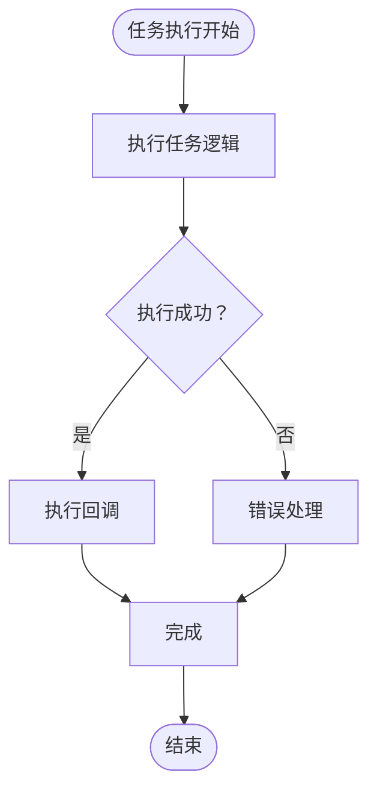
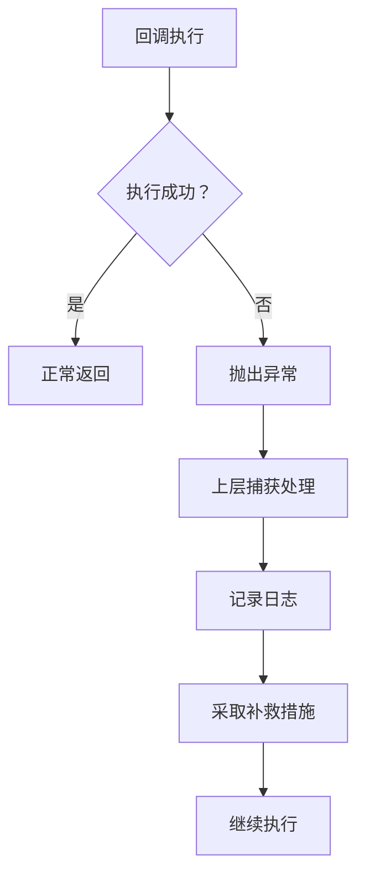
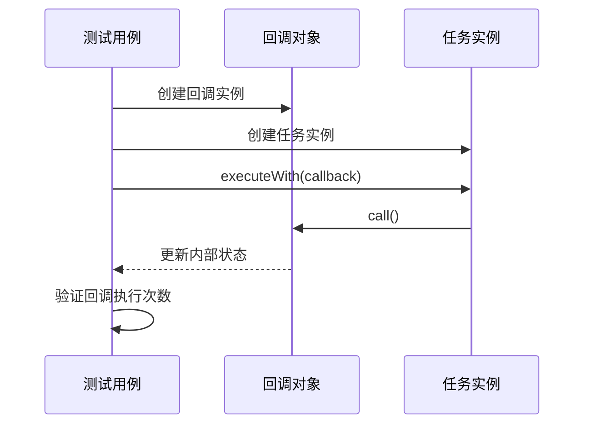

# 回调模式

<cite>
**本文档引用的文件**
- [Callback.java](file://callback/src/main/java/com/iluwatar/callback/Callback.java)
- [Task.java](file://callback/src/main/java/com/iluwatar/callback/Task.java)
- [SimpleTask.java](file://callback/src/main/java/com/iluwatar/callback/SimpleTask.java)
- [App.java](file://callback/src/main/java/com/iluwatar/callback/App.java)
- [CallbackTest.java](file://callback/src/test/java/com/iluwatar/callback/CallbackTest.java)
- [README.md](file://callback/README.md)
- [pom.xml](file://callback/pom.xml)
</cite>

## 目录
1. [简介](#简介)
2. [项目结构](#项目结构)
3. [核心组件](#核心组件)
4. [架构概览](#架构概览)
5. [详细组件分析](#详细组件分析)
6. [回调机制设计原理](#回调机制设计原理)
7. [同步与异步回调对比](#同步与异步回调对比)
8. [回调链与错误传播](#回调链与错误传播)
9. [应用场景与实现示例](#应用场景与实现示例)
10. [接口设计原则](#接口设计原则)
11. [性能分析](#性能分析)
12. [测试策略](#测试策略)
13. [故障排除指南](#故障排除指南)
14. [结论](#结论)

## 简介

回调模式（Callback Pattern）是软件设计中的一种重要机制，它允许将一段可执行代码作为参数传递给其他代码，当特定条件满足时，被调用方会回调（执行）这个传入的代码。这种模式在Java中通过接口实现，在现代Java版本中可以通过Lambda表达式进一步简化使用。

回调模式的核心价值在于：
- **解耦合**：执行逻辑与通知逻辑分离
- **异步处理**：支持非阻塞的操作模式
- **事件驱动**：响应系统状态变化
- **可扩展性**：动态注册不同的回调行为

## 项目结构

回调模式项目采用标准的Maven项目结构，专注于展示回调模式的核心概念和实现方式。

**图表来源**
- [Callback.java](file://callback/src/main/java/com/iluwatar/callback/Callback.java#L25-L34)
- [Task.java](file://callback/src/main/java/com/iluwatar/callback/Task.java#L25-L44)
- [SimpleTask.java](file://callback/src/main/java/com/iluwatar/callback/SimpleTask.java#L25-L40)

**章节来源**
- [pom.xml](file://callback/pom.xml#L28-L63)
- [README.md](file://callback/README.md#L1-L132)

## 核心组件

回调模式由四个核心组件构成，每个组件都有明确的职责和交互关系：

### Callback接口
定义了回调的基本契约，是最小化的函数式接口，仅包含一个`call()`方法。

### Task抽象类
实现了模板方法模式，提供统一的回调执行框架，确保任务执行后能够正确触发回调。

### SimpleTask实现类
具体的任务实现，展示了如何继承Task并实现业务逻辑。

### App主程序
演示了回调模式的实际使用场景和最佳实践。

**章节来源**
- [Callback.java](file://callback/src/main/java/com/iluwatar/callback/Callback.java#L27-L33)
- [Task.java](file://callback/src/main/java/com/iluwatar/callback/Task.java#L29-L43)
- [SimpleTask.java](file://callback/src/main/java/com/iluwatar/callback/SimpleTask.java#L29-L39)
- [App.java](file://callback/src/main/java/com/iluwatar/callback/App.java#L29-L47)

## 架构概览

回调模式采用分层架构设计，体现了良好的关注点分离：

**图表来源**
- [Callback.java](file://callback/src/main/java/com/iluwatar/callback/Callback.java#L30-L32)
- [Task.java](file://callback/src/main/java/com/iluwatar/callback/Task.java#L32-L42)
- [SimpleTask.java](file://callback/src/main/java/com/iluwatar/callback/SimpleTask.java#L33-L38)
- [App.java](file://callback/src/main/java/com/iluwatar/callback/App.java#L35-L46)

## 详细组件分析

### Callback接口设计

Callback接口采用了极简主义设计原则，只包含一个方法签名，这体现了函数式编程的核心理念：

**图表来源**
- [Task.java](file://callback/src/main/java/com/iluwatar/callback/Task.java#L37-L40)
- [Callback.java](file://callback/src/main/java/com/iluwatar/callback/Callback.java#L30-L32)

### Task抽象类实现

Task类实现了模板方法模式，提供了统一的任务执行框架：

**图表来源**
- [Task.java](file://callback/src/main/java/com/iluwatar/callback/Task.java#L37-L40)

**章节来源**
- [Task.java](file://callback/src/main/java/com/iluwatar/callback/Task.java#L29-L43)

### SimpleTask实现类

SimpleTask展示了如何继承Task并实现具体的业务逻辑：

**章节来源**
- [SimpleTask.java](file://callback/src/main/java/com/iluwatar/callback/SimpleTask.java#L29-L39)

### App主程序演示

App类提供了回调模式的完整使用示例，展示了从创建到执行的完整流程。

**章节来源**
- [App.java](file://callback/src/main/java/com/iluwatar/callback/App.java#L29-L47)

## 回调机制设计原理

回调机制的设计遵循以下核心原理：

### 解耦合原理
回调模式通过接口隔离了执行者和观察者，使得两者可以独立演进。

### 延迟绑定原理
回调在任务执行完成后才被调用，实现了时机上的解耦。

### 函数式接口原理
通过单一方法接口，回调可以像参数一样传递，支持高阶函数的概念。

### 模板方法模式
Task类使用模板方法模式，固定了回调执行的时机和流程。

**章节来源**
- [Task.java](file://callback/src/main/java/com/iluwatar/callback/Task.java#L32-L42)
- [Callback.java](file://callback/src/main/java/com/iluwatar/callback/Callback.java#L27-L33)

## 同步与异步回调对比

### 同步回调特点

**图表来源**
- [Task.java](file://callback/src/main/java/com/iluwatar/callback/Task.java#L37-L40)

### 异步回调特点

**图表来源**
- [App.java](file://callback/src/main/java/com/iluwatar/callback/App.java#L43-L46)

## 回调链与错误传播

### 回调链构建

回调链允许多个回调按顺序执行，形成复杂的处理流程：

### 错误传播机制

错误处理是回调模式的重要考虑因素：

**章节来源**
- [CallbackTest.java](file://callback/src/test/java/com/iluwatar/callback/CallbackTest.java#L31-L58)

## 应用场景与实现示例

### GUI编程中的应用

在图形用户界面编程中，回调常用于处理用户交互事件：

- **按钮点击事件**：用户点击按钮时触发相应的处理逻辑
- **窗口关闭事件**：应用程序退出时执行清理操作
- **菜单选择事件**：用户选择菜单项时执行相应功能

### 网络编程中的应用

在网络编程中，回调模式广泛应用于异步I/O操作：

- **HTTP请求完成通知**：网络请求完成后执行回调处理响应
- **文件上传进度报告**：上传过程中定期回调报告进度
- **连接状态监听**：网络连接状态变化时触发回调

### 文件系统中的应用

文件系统操作中也常见回调模式的应用：

- **文件读写完成通知**：文件操作完成后执行回调
- **目录遍历回调**：遍历目录时对每个文件执行回调
- **文件监控回调**：文件变化时触发回调处理

### 第三方集成示例

回调模式在第三方服务集成中发挥重要作用：

- **支付网关回调**：支付完成后接收回调通知
- **消息推送回调**：收到消息推送时执行回调处理
- **数据同步回调**：数据同步完成后触发回调

**章节来源**
- [README.md](file://callback/README.md#L92-L126)

## 接口设计原则

### 参数传递设计

回调接口应该遵循以下参数传递原则：

- **最小化参数**：只传递必要的信息
- **不可变性**：传递的数据应该是不可变的
- **类型安全**：使用强类型确保编译时检查

### 返回值处理

回调接口通常不返回值，因为：

- **异步性质**：回调可能在不同线程中执行
- **执行时机**：回调的执行时机不确定
- **错误处理**：错误应该通过异常或其他机制处理

### 错误处理策略

**章节来源**
- [Callback.java](file://callback/src/main/java/com/iluwatar/callback/Callback.java#L27-L33)

## 性能分析

### 时间复杂度

回调模式的时间复杂度主要取决于：
- **回调执行时间**：O(n)，n为回调数量
- **参数传递开销**：O(1)
- **内存分配**：O(1)

### 空间复杂度

- **回调对象存储**：O(1)
- **调用栈开销**：O(1)
- **闭包捕获变量**：根据实际使用情况而定

### 性能优化建议

1. **避免回调地狱**：合理组织回调层次结构
2. **减少参数传递**：使用共享状态或单例模式
3. **异步执行**：对于耗时操作使用异步回调
4. **缓存结果**：避免重复计算相同的结果

## 测试策略

### 单元测试设计

回调模式的测试需要特别关注：
- **回调执行验证**：确认回调确实被调用
- **参数传递验证**：验证传递给回调的参数正确性
- **异常处理测试**：测试异常情况下的回调行为

### 测试用例分析

**图表来源**
- [CallbackTest.java](file://callback/src/test/java/com/iluwatar/callback/CallbackTest.java#L41-L57)

**章节来源**
- [CallbackTest.java](file://callback/src/test/java/com/iluwatar/callback/CallbackTest.java#L31-L58)

## 故障排除指南

### 常见问题及解决方案

#### 回调未执行
- **检查回调参数**：确保传递的回调不是null
- **验证任务执行**：确认任务确实完成了执行
- **检查线程安全**：确保回调在正确的线程中执行

#### 回调执行异常
- **捕获异常**：在回调中添加适当的异常处理
- **记录日志**：记录异常信息便于调试
- **优雅降级**：提供备用的处理方案

#### 内存泄漏问题
- **及时释放资源**：确保回调不再需要时能够被垃圾回收
- **避免循环引用**：防止回调持有对父对象的引用
- **使用弱引用**：在必要时使用WeakReference

### 调试技巧

1. **添加日志输出**：在关键节点添加详细的日志信息
2. **使用断点调试**：设置断点观察回调的执行流程
3. **单元测试覆盖**：编写全面的测试用例验证回调行为

**章节来源**
- [CallbackTest.java](file://callback/src/test/java/com/iluwatar/callback/CallbackTest.java#L31-L58)

## 结论

回调模式作为一种重要的设计模式，在Java开发中具有广泛的应用价值。通过本文档的深入分析，我们可以看到：

### 核心优势
- **解耦合**：有效分离了执行逻辑和通知逻辑
- **灵活性**：支持动态注册和取消回调
- **可扩展性**：易于扩展新的回调处理逻辑
- **异步支持**：天然支持非阻塞的异步操作

### 实践建议
- **简单优先**：从最简单的回调接口开始
- **错误处理**：始终考虑异常情况的处理
- **性能考量**：避免回调链过长导致的性能问题
- **测试覆盖**：编写充分的单元测试验证回调行为

### 发展趋势
随着Java语言的发展，回调模式也在不断演进：
- **Lambda表达式**：简化回调的创建和使用
- **CompletableFuture**：提供更强大的异步编程支持
- **响应式编程**：结合响应式流处理复杂的异步场景

回调模式将继续在现代Java开发中发挥重要作用，为构建灵活、可扩展的应用程序提供强有力的支持。