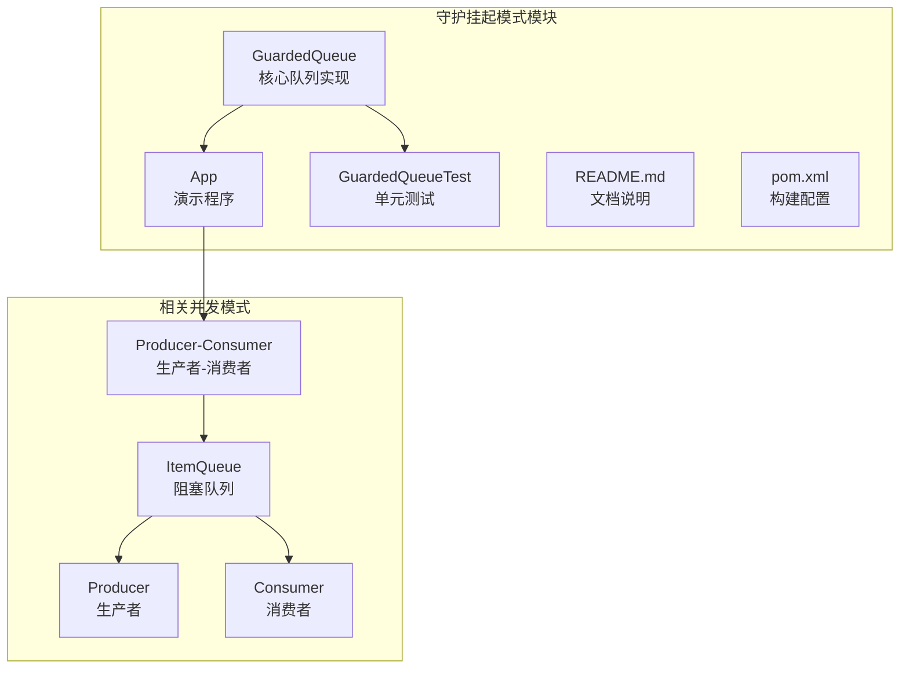
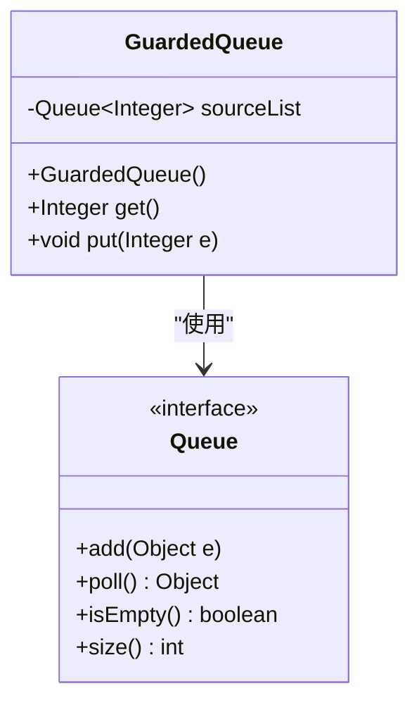
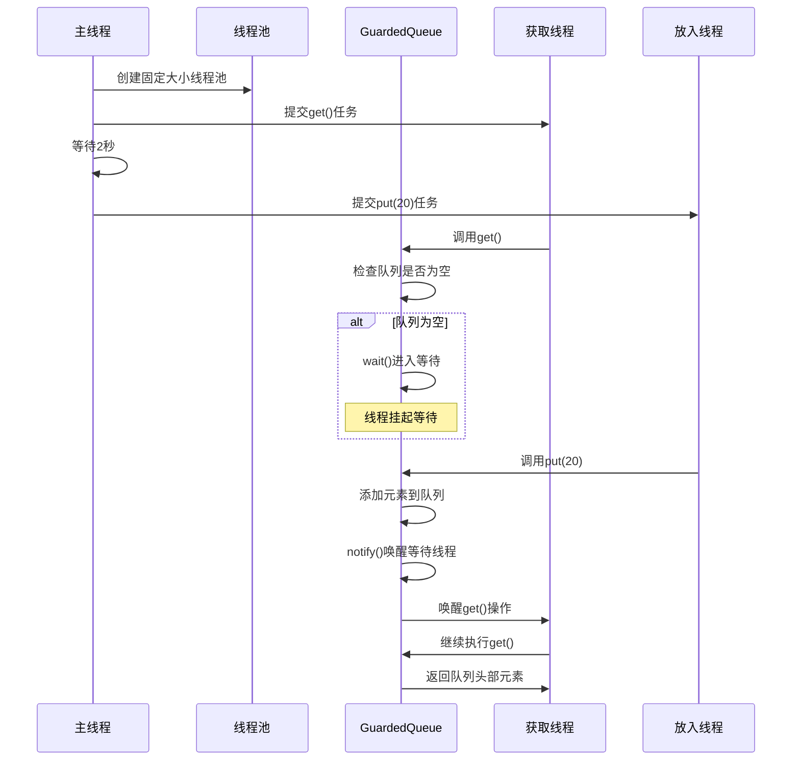
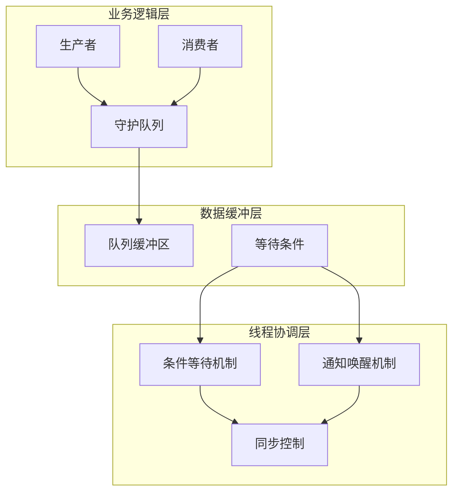
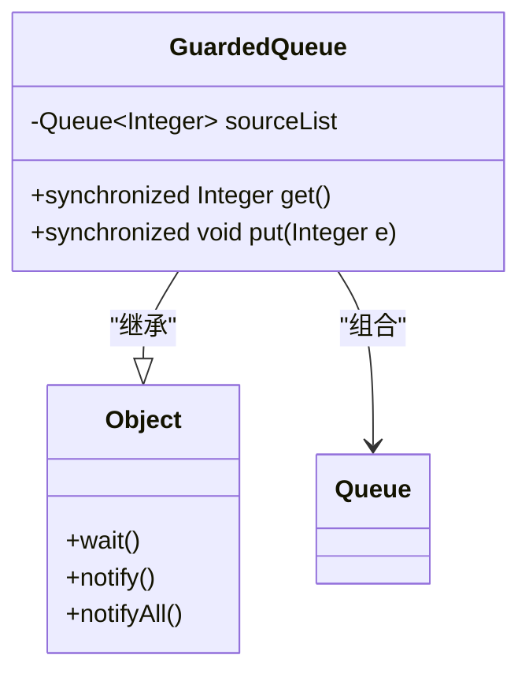
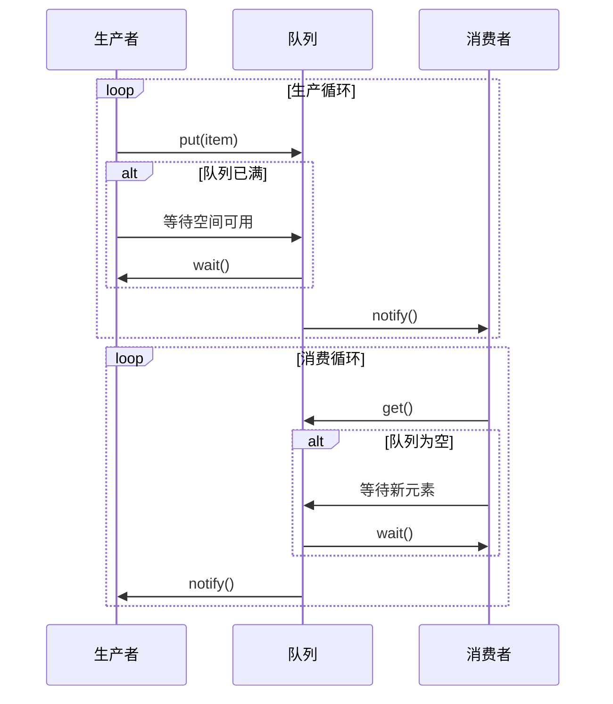
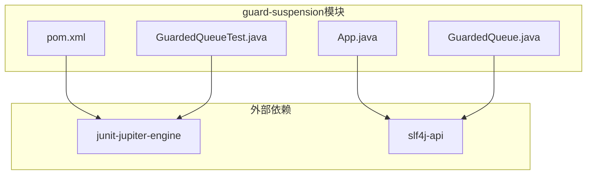

# 守护挂起模式

<cite>
**本文档引用的文件**
- [GuardedQueue.java](file://guarded-suspension/src/main/java/com/iluwatar/guarded/suspension/GuardedQueue.java)
- [App.java](file://guarded-suspension/src/main/java/com/iluwatar/guarded/suspension/App.java)
- [GuardedQueueTest.java](file://guarded-suspension/src/test/java/com/iluwatar/guarded/suspension/GuardedQueueTest.java)
- [README.md](file://guarded-suspension/README.md)
- [pom.xml](file://guarded-suspension/pom.xml)
- [ItemQueue.java](file://producer-consumer/src/main/java/com/iluwatar/producer/consumer/ItemQueue.java)
- [Producer.java](file://producer-consumer/src/main/java/com/iluwatar/producer/consumer/Producer.java)
- [Consumer.java](file://producer-consumer/src/main/java/com/iluwatar/producer/consumer/Consumer.java)
</cite>

## 目录
1. [引言](#引言)
2. [项目结构](#项目结构)
3. [核心组件](#核心组件)
4. [架构概览](#架构概览)
5. [详细组件分析](#详细组件分析)
6. [依赖关系分析](#依赖关系分析)
7. [性能考虑](#性能考虑)
8. [故障排除指南](#故障排除指南)
9. [结论](#结论)
10. [附录](#附录)

## 引言

守护挂起模式（Guarded Suspension Pattern）是Java并发编程中的重要设计模式，用于管理需要同时满足锁和前置条件的操作。该模式通过允许线程等待合适条件的出现来优化并发控制，避免忙等待带来的CPU消耗。

本模式的核心思想是在执行方法前检查对象状态，如果条件不满足，则线程进入等待状态直到条件满足。这种机制在生产者-消费者场景中特别有用，能够有效协调不同线程之间的操作。

## 项目结构

guard-suspension模块提供了守护挂起模式的完整实现，包含以下关键组件：



**图表来源**
- [GuardedQueue.java](file://guarded-suspension/src/main/java/com/iluwatar/guarded/suspension/GuardedQueue.java#L31-L75)
- [App.java](file://guarded-suspension/src/main/java/com/iluwatar/guarded/suspension/App.java#L31-L74)
- [GuardedQueueTest.java](file://guarded-suspension/src/test/java/com/iluwatar/guarded/suspension/GuardedQueueTest.java#L34-L64)

**章节来源**
- [GuardedQueue.java](file://guarded-suspension/src/main/java/com/iluwatar/guarded/suspension/GuardedQueue.java#L31-L75)
- [App.java](file://guarded-suspension/src/main/java/com/iluwatar/guarded/suspension/App.java#L31-L74)
- [GuardedQueueTest.java](file://guarded-suspension/src/test/java/com/iluwatar/guarded/suspension/GuardedQueueTest.java#L34-L64)

## 核心组件

### GuardedQueue类

GuardedQueue是守护挂起模式的核心实现，封装了一个线程安全的队列操作：



**图表来源**
- [GuardedQueue.java](file://guarded-suspension/src/main/java/com/iluwatar/guarded/suspension/GuardedQueue.java#L39-L75)

GuardedQueue提供了两个关键方法：
- `get()`: 当队列为空时等待，条件满足后返回队列头部元素
- `put(Integer e)`: 向队列添加元素并通知等待的线程

**章节来源**
- [GuardedQueue.java](file://guarded-suspension/src/main/java/com/iluwatar/guarded/suspension/GuardedQueue.java#L46-L75)

### 应用演示程序

App类展示了守护挂起模式的实际应用场景：



**图表来源**
- [App.java](file://guarded-suspension/src/main/java/com/iluwatar/guarded/suspension/App.java#L49-L72)
- [GuardedQueue.java](file://guarded-suspension/src/main/java/com/iluwatar/guarded/suspension/GuardedQueue.java#L51-L74)

**章节来源**
- [App.java](file://guarded-suspension/src/main/java/com/iluwatar/guarded/suspension/App.java#L49-L72)

## 架构概览

守护挂起模式的架构基于经典的生产者-消费者模型，但通过条件等待机制实现了更精细的线程协调：



**图表来源**
- [GuardedQueue.java](file://guarded-suspension/src/main/java/com/iluwatar/guarded/suspension/GuardedQueue.java#L51-L74)
- [README.md](file://guarded-suspension/README.md#L20-L37)

## 详细组件分析

### 条件等待机制实现

守护挂起模式的核心在于条件等待机制，通过以下步骤实现：

1. **条件检查**: 在进入临界区前检查前置条件
2. **等待状态**: 条件不满足时调用wait()方法挂起线程
3. **唤醒机制**: 条件满足时调用notify()或notifyAll()唤醒等待线程
4. **重新检查**: 被唤醒后重新检查条件确保安全性

```mermaid
flowchart TD
Start([开始get()操作]) --> CheckEmpty{队列是否为空?}
CheckEmpty --> |是| EnterWait[进入等待状态]
EnterWait --> WaitCall[调用wait()]
WaitCall --> Sleep[线程挂起]
Sleep --> Wakeup[被唤醒]
Wakeup --> Recheck[重新检查条件]
Recheck --> |满足| ReturnElement[返回元素]
Recheck --> |仍不满足| WaitAgain[继续等待]
WaitAgain --> WaitCall
CheckEmpty --> |否| ReturnElement
ReturnElement --> End([结束])
```

**图表来源**
- [GuardedQueue.java](file://guarded-suspension/src/main/java/com/iluwatar/guarded/suspension/GuardedQueue.java#L51-L62)

### 线程同步与资源保护

GuardedQueue通过synchronized关键字确保线程安全：



**图表来源**
- [GuardedQueue.java](file://guarded-suspension/src/main/java/com/iluwatar/guarded/suspension/GuardedQueue.java#L39-L75)

同步机制的关键特性：
- **互斥访问**: synchronized确保同一时间只有一个线程能访问队列
- **条件变量**: wait()/notify()提供条件等待和唤醒功能
- **内存可见性**: synchronized保证线程间内存可见性

**章节来源**
- [GuardedQueue.java](file://guarded-suspension/src/main/java/com/iluwatar/guarded/suspension/GuardedQueue.java#L51-L74)

### 生产者-消费者场景实现

虽然guard-suspension模块使用简单的LinkedList作为队列，但可以轻松扩展为生产者-消费者场景：



**图表来源**
- [ItemQueue.java](file://producer-consumer/src/main/java/com/iluwatar/producer/consumer/ItemQueue.java#L42-L50)
- [Producer.java](file://producer-consumer/src/main/java/com/iluwatar/producer/consumer/Producer.java#L51-L56)
- [Consumer.java](file://producer-consumer/src/main/java/com/iluwatar/producer/consumer/Consumer.java#L47-L52)

**章节来源**
- [ItemQueue.java](file://producer-consumer/src/main/java/com/iluwatar/producer/consumer/ItemQueue.java#L33-L53)
- [Producer.java](file://producer-consumer/src/main/java/com/iluwatar/producer/consumer/Producer.java#L33-L58)
- [Consumer.java](file://producer-consumer/src/main/java/com/iluwatar/producer/consumer/Consumer.java#L29-L54)

### 等待条件判断和唤醒机制

守护挂起模式的等待条件判断采用while循环而非if语句：

```java
// 正确的实现方式
public synchronized Integer get() {
    while (sourceList.isEmpty()) {
        try {
            wait();  // 使用while循环确保条件检查
        } catch (InterruptedException e) {
            // 处理中断异常
        }
    }
    return sourceList.poll();
}

// 错误的实现方式（可能导致问题）
public synchronized Integer get() {
    if (sourceList.isEmpty()) {
        try {
            wait();  // 可能错过其他线程的notify
        } catch (InterruptedException e) {
            // 处理中断异常
        }
    }
    return sourceList.poll();
}
```

这种设计确保了：
- **防止虚假唤醒**: 即使线程被意外唤醒也能重新检查条件
- **线程安全**: 避免竞态条件导致的数据不一致
- **可靠性**: 确保只有在条件真正满足时才继续执行

**章节来源**
- [GuardedQueue.java](file://guarded-suspension/src/main/java/com/iluwatar/guarded/suspension/GuardedQueue.java#L51-L62)

## 依赖关系分析

### Maven依赖配置

guard-suspension模块的依赖关系相对简单，主要依赖JUnit进行测试：



**图表来源**
- [pom.xml](file://guarded-suspension/pom.xml#L37-L43)

### 测试框架集成

单元测试展示了守护挂起模式的核心行为：

```mermaid
graph TB
subgraph "测试场景"
T1[testGet(): 等待后获取]
T2[testPut(): 直接获取]
end
subgraph "测试执行"
E1[ExecutorService]
Q[GuardedQueue]
V[volatile Integer]
end
T1 --> E1
T2 --> E1
E1 --> Q
Q --> V
```

**图表来源**
- [GuardedQueueTest.java](file://guarded-suspension/src/test/java/com/iluwatar/guarded/suspension/GuardedQueueTest.java#L41-L61)

**章节来源**
- [pom.xml](file://guarded-suspension/pom.xml#L37-L43)
- [GuardedQueueTest.java](file://guarded-suspension/src/test/java/com/iluwatar/guarded/suspension/GuardedQueueTest.java#L37-L64)

## 性能考虑

### CPU消耗优化

守护挂起模式通过避免忙等待显著减少CPU消耗：

| 实现方式 | CPU消耗 | 响应性 | 复杂度 |
|---------|---------|--------|--------|
| 忙等待 | 高 | 低 | 简单 |
| 条件等待 | 低 | 高 | 中等 |

### 内存管理

- **队列容量**: 需要根据实际需求设置合适的队列容量
- **对象生命周期**: 注意避免内存泄漏，及时清理不再使用的对象
- **日志开销**: 生产环境中应谨慎使用日志记录

### 并发性能

- **线程数量**: 合理设置线程池大小避免过度竞争
- **锁粒度**: 考虑使用更细粒度的锁提高并发性能
- **阻塞策略**: 在高负载情况下考虑使用有界队列

## 故障排除指南

### 常见问题及解决方案

#### 1. 线程死锁

**症状**: 程序长时间无响应

**原因**: 多个线程相互等待对方释放锁

**解决方案**:
- 使用超时机制避免无限等待
- 确保锁的获取和释放顺序一致
- 使用调试工具分析线程状态

#### 2. 虚假唤醒

**症状**: 线程在条件未满足时被唤醒

**原因**: JVM可能随机唤醒wait()的线程

**解决方案**:
- 使用while循环而非if语句检查条件
- 在被唤醒后重新检查条件

#### 3. 中断异常处理

**症状**: 等待线程被意外中断

**解决方案**:
- 正确处理InterruptedException
- 在catch块中恢复中断状态
- 提供优雅的中断处理机制

**章节来源**
- [GuardedQueue.java](file://guarded-suspension/src/main/java/com/iluwatar/guarded/suspension/GuardedQueue.java#L56-L58)

### 调试技巧

1. **日志记录**: 启用详细的日志输出跟踪线程状态
2. **线程转储**: 使用jstack分析线程阻塞情况
3. **性能监控**: 监控CPU和内存使用情况
4. **单元测试**: 编写覆盖各种边界条件的测试用例

## 结论

守护挂起模式是Java并发编程中的重要设计模式，通过条件等待机制实现了高效的线程协调。其核心优势包括：

1. **降低CPU消耗**: 通过挂起不必要运行的线程减少资源浪费
2. **提高系统响应性**: 线程只在条件满足时才执行相关操作
3. **简化并发逻辑**: 提供清晰的等待-通知机制

在实际应用中，建议结合现代Java并发工具类（如java.util.concurrent包中的BlockingQueue）来实现更复杂和高性能的并发场景。同时要注意正确处理中断、避免死锁，并提供适当的错误处理机制。

## 附录

### 相关设计模式对比

| 模式 | 适用场景 | 优点 | 局限性 |
|------|----------|------|--------|
| 守护挂起 | 条件等待 | 实现简单，CPU效率高 | 复杂条件管理困难 |
| 生产者-消费者 | 数据缓冲 | 解耦生产消费过程 | 需要额外的缓冲管理 |
| Balking | 条件检查 | 避免不必要的操作 | 可能错过某些时机 |

### 最佳实践建议

1. **条件检查**: 始终使用while循环检查条件
2. **异常处理**: 正确处理InterruptedException
3. **资源管理**: 及时释放锁和清理资源
4. **测试验证**: 编写充分的并发测试用例
5. **性能监控**: 持续监控并发性能指标