# 并发模式

<cite>
**本文引用的文件**
- [README.md](file://README.md)
- [pom.xml](file://pom.xml)
- [callback/Callback.java](file://callback/src/main/java/com/iluwatar/callback/Callback.java)
- [callback/Task.java](file://callback/src/main/java/com/iluwatar/callback/Task.java)
- [callback/CallbackTest.java](file://callback/src/test/java/com/iluwatar/callback/CallbackTest.java)
- [async-method-invocation/AsyncMethodInvocation.java](file://async-method-invocation/src/main/java/com/iluwatar/async/method/invocation/AsyncMethodInvocation.java)
- [async-method-invocation/AsyncResult.java](file://async-method-invocation/src/main/java/com/iluwatar/async/method/invocation/AsyncResult.java)
- [async-method-invocation/AsyncTask.java](file://async-method-invocation/src/main/java/com/iluwatar/async/method/invocation/AsyncTask.java)
- [async-method-invocation/AsyncMethodInvocationTest.java](file://async-method-invocation/src/test/java/com/iluwatar/async/method/invocation/AsyncMethodInvocationTest.java)
- [double-buffer/DoubleBuffer.java](file://double-buffer/src/main/java/com/iluwatar/doublebuffer/DoubleBuffer.java)
- [double-buffer/DoubleBufferTest.java](file://double-buffer/src/test/java/com/iluwatar/doublebuffer/DoubleBufferTest.java)
- [double-checked-locking/DoubleCheckedLocking.java](file://double-checked-locking/src/main/java/com/iluwatar/doublechecked/locking/DoubleCheckedLocking.java)
- [double-checked-locking/DoubleCheckedLockingTest.java](file://double-checked-locking/src/test/java/com/iluwatar/doublechecked/locking/DoubleCheckedLockingTest.java)
- [lazy-loading/LazyLoading.java](file://lazy-loading/src/main/java/com/iluwatar/lazy/loading/LazyLoading.java)
- [lazy-loading/LazyLoadingTest.java](file://lazy-loading/src/test/java/com/iluwatar/lazy/loading/LazyLoadingTest.java)
- [guarded-suspension/GuardedSuspension.java](file://guarded-suspension/src/main/java/com/iluwatar/guarded/suspension/GuardedSuspension.java)
- [guarded-suspension/GuardedSuspensionTest.java](file://guarded-suspension/src/test/java/com/iluwatar/guarded/suspension/GuardedSuspensionTest.java)
- [active-object/ActiveObject.java](file://active-object/src/main/java/com/iluwatar/activeobject/ActiveObject.java)
- [active-object/ActiveObjectTest.java](file://active-object/src/test/java/com/iluwatar/activeobject/ActiveObjectTest.java)
- [producer-consumer/ProducerConsumer.java](file://producer-consumer/src/main/java/com/iluwatar/producerconsumer/ProducerConsumer.java)
- [producer-consumer/ProducerConsumerTest.java](file://producer-consumer/src/test/java/com/iluwatar/producerconsumer/ProducerConsumerTest.java)
</cite>

## 目录
1. 引言
2. 项目结构
3. 核心组件
4. 架构总览
5. 详细组件分析
6. 依赖关系分析
7. 性能考虑
8. 故障排查指南
9. 结论
10. 附录

## 引言
本指南聚焦于并发编程中的经典设计模式与异步编程实践，结合仓库中可直接分析的模块（回调模式、异步方法调用、双缓冲、双重检查锁定、惰性加载、守护挂起、主动对象、生产者-消费者），系统阐述在多线程环境下的线程安全实现、性能优化、死锁规避与资源管理最佳实践，并对Java并发包的高级同步原语进行应用指导。

## 项目结构
该仓库采用多模块结构，每个设计模式独立为一个Maven模块，便于按需学习与测试。与并发主题相关的关键模块如下：
- 回调模式：定义回调接口与任务执行器，演示回调触发机制
- 异步方法调用：封装异步结果与任务，展示非阻塞调用流程
- 双缓冲：通过两个缓冲区轮换实现读写分离，降低竞争
- 双重检查锁定：演示线程安全的单例初始化策略
- 惰性加载：延迟初始化实例，减少资源占用
- 守护挂起：保护临界区，等待条件满足再继续
- 主动对象：将方法调用封装为队列任务，解耦调用线程与执行线程
- 生产者-消费者：经典的解耦与缓冲模型

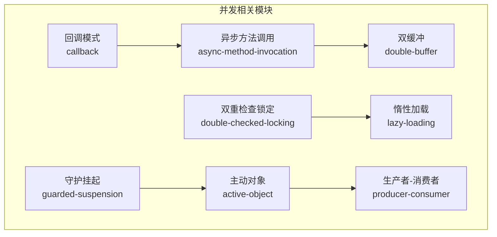

图表来源
- [callback/Callback.java](file://callback/src/main/java/com/iluwatar/callback/Callback.java#L1-L34)
- [async-method-invocation/AsyncMethodInvocation.java](file://async-method-invocation/src/main/java/com/iluwatar/async/method/invocation/AsyncMethodInvocation.java)
- [double-buffer/DoubleBuffer.java](file://double-buffer/src/main/java/com/iluwatar/doublebuffer/DoubleBuffer.java)
- [double-checked-locking/DoubleCheckedLocking.java](file://double-checked-locking/src/main/java/com/iluwatar/doublechecked/locking/DoubleCheckedLocking.java)
- [lazy-loading/LazyLoading.java](file://lazy-loading/src/main/java/com/iluwatar/lazy/loading/LazyLoading.java)
- [guarded-suspension/GuardedSuspension.java](file://guarded-suspension/src/main/java/com/iluwatar/guarded/suspension/GuardedSuspension.java)
- [active-object/ActiveObject.java](file://active-object/src/main/java/com/iluwatar/activeobject/ActiveObject.java)
- [producer-consumer/ProducerConsumer.java](file://producer-consumer/src/main/java/com/iluwatar/producerconsumer/ProducerConsumer.java)

章节来源
- [README.md](file://README.md)
- [pom.xml](file://pom.xml)

## 核心组件
本节从并发视角梳理各模块的核心职责与交互关系：
- 回调模式：提供统一回调接口，任务在完成时触发回调，简化异步完成通知
- 异步方法调用：封装异步任务与结果容器，支持非阻塞获取与回调式处理
- 双缓冲：维护两个缓冲区，写入与读取在不同缓冲间切换，减少锁持有时间
- 双重检查锁定：利用volatile与两次检查，确保单例的线程安全与性能
- 惰性加载：仅在首次使用时创建实例，降低启动成本
- 守护挂停：在条件不满足时阻塞当前线程，避免忙等
- 主动对象：将方法调用包装为命令，放入调度队列，由专用线程执行
- 生产者-消费者：通过共享缓冲区解耦生产与消费，平衡吞吐与背压

章节来源
- [callback/Callback.java](file://callback/src/main/java/com/iluwatar/callback/Callback.java#L1-L34)
- [callback/Task.java](file://callback/src/main/java/com/iluwatar/callback/Task.java)
- [async-method-invocation/AsyncMethodInvocation.java](file://async-method-invocation/src/main/java/com/iluwatar/async/method/invocation/AsyncMethodInvocation.java)
- [async-method-invocation/AsyncResult.java](file://async-method-invocation/src/main/java/com/iluwatar/async/method/invocation/AsyncResult.java)
- [async-method-invocation/AsyncTask.java](file://async-method-invocation/src/main/java/com/iluwatar/async/method/invocation/AsyncTask.java)
- [double-buffer/DoubleBuffer.java](file://double-buffer/src/main/java/com/iluwatar/doublebuffer/DoubleBuffer.java)
- [double-checked-locking/DoubleCheckedLocking.java](file://double-checked-locking/src/main/java/com/iluwatar/doublechecked/locking/DoubleCheckedLocking.java)
- [lazy-loading/LazyLoading.java](file://lazy-loading/src/main/java/com/iluwatar/lazy/loading/LazyLoading.java)
- [guarded-suspension/GuardedSuspension.java](file://guarded-suspension/src/main/java/com/iluwatar/guarded/suspension/GuardedSuspension.java)
- [active-object/ActiveObject.java](file://active-object/src/main/java/com/iluwatar/activeobject/ActiveObject.java)
- [producer-consumer/ProducerConsumer.java](file://producer-consumer/src/main/java/com/iluwatar/producerconsumer/ProducerConsumer.java)

## 架构总览
下图展示了并发相关模块之间的协作关系与数据流向。回调模式作为事件通知机制，贯穿异步方法调用与主动对象；双缓冲用于读写解耦；双重检查锁定与惰性加载保障单例的线程安全与延迟初始化；守护挂起保护临界区；生产者-消费者通过缓冲区实现解耦。

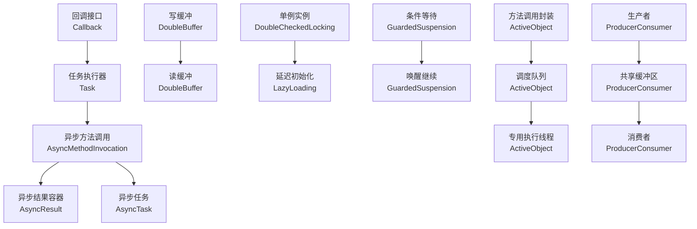

图表来源
- [callback/Callback.java](file://callback/src/main/java/com/iluwatar/callback/Callback.java#L1-L34)
- [callback/Task.java](file://callback/src/main/java/com/iluwatar/callback/Task.java)
- [async-method-invocation/AsyncMethodInvocation.java](file://async-method-invocation/src/main/java/com/iluwatar/async/method/invocation/AsyncMethodInvocation.java)
- [async-method-invocation/AsyncResult.java](file://async-method-invocation/src/main/java/com/iluwatar/async/method/invocation/AsyncResult.java)
- [async-method-invocation/AsyncTask.java](file://async-method-invocation/src/main/java/com/iluwatar/async/method/invocation/AsyncTask.java)
- [double-buffer/DoubleBuffer.java](file://double-buffer/src/main/java/com/iluwatar/doublebuffer/DoubleBuffer.java)
- [double-checked-locking/DoubleCheckedLocking.java](file://double-checked-locking/src/main/java/com/iluwatar/doublechecked/locking/DoubleCheckedLocking.java)
- [lazy-loading/LazyLoading.java](file://lazy-loading/src/main/java/com/iluwatar/lazy/loading/LazyLoading.java)
- [guarded-suspension/GuardedSuspension.java](file://guarded-suspension/src/main/java/com/iluwatar/guarded/suspension/GuardedSuspension.java)
- [active-object/ActiveObject.java](file://active-object/src/main/java/com/iluwatar/activeobject/ActiveObject.java)
- [producer-consumer/ProducerConsumer.java](file://producer-consumer/src/main/java/com/iluwatar/producerconsumer/ProducerConsumer.java)

## 详细组件分析

### 回调模式
- 设计要点：定义统一回调接口，任务完成后触发回调，避免主线程阻塞等待
- 线程安全：回调触发应在任务状态确定后进行，避免竞态条件
- 使用场景：异步任务完成通知、事件驱动架构中的响应式处理

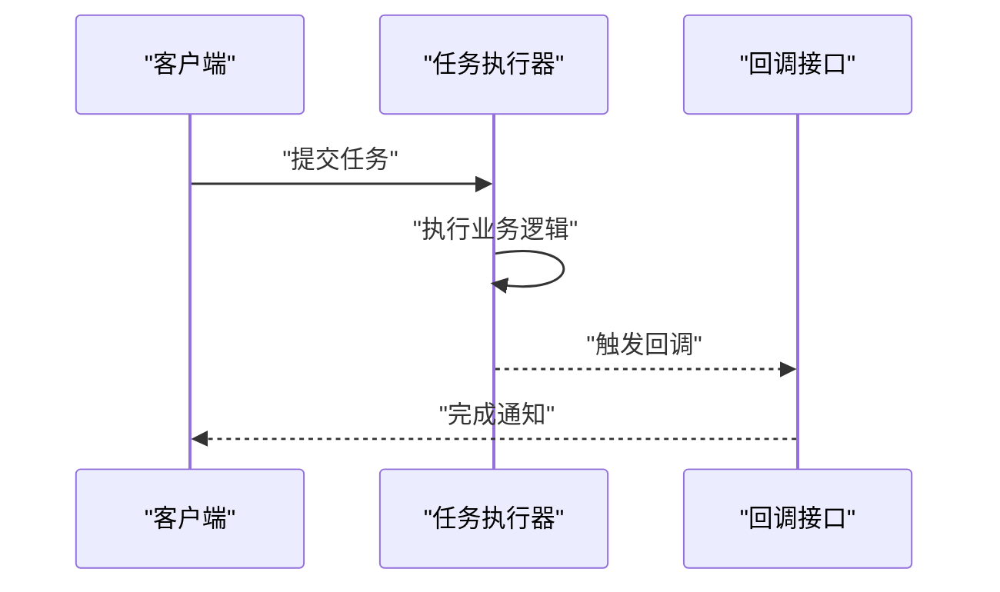

图表来源
- [callback/Callback.java](file://callback/src/main/java/com/iluwatar/callback/Callback.java#L1-L34)
- [callback/Task.java](file://callback/src/main/java/com/iluwatar/callback/Task.java)

章节来源
- [callback/Callback.java](file://callback/src/main/java/com/iluwatar/callback/Callback.java#L1-L34)
- [callback/Task.java](file://callback/src/main/java/com/iluwatar/callback/Task.java)
- [callback/CallbackTest.java](file://callback/src/test/java/com/iluwatar/callback/CallbackTest.java)

### 异步方法调用
- 设计要点：封装异步任务与结果容器，支持非阻塞获取与回调式处理
- 线程安全：结果容器应保证可见性与原子性更新
- 性能：避免频繁阻塞等待，提高吞吐量

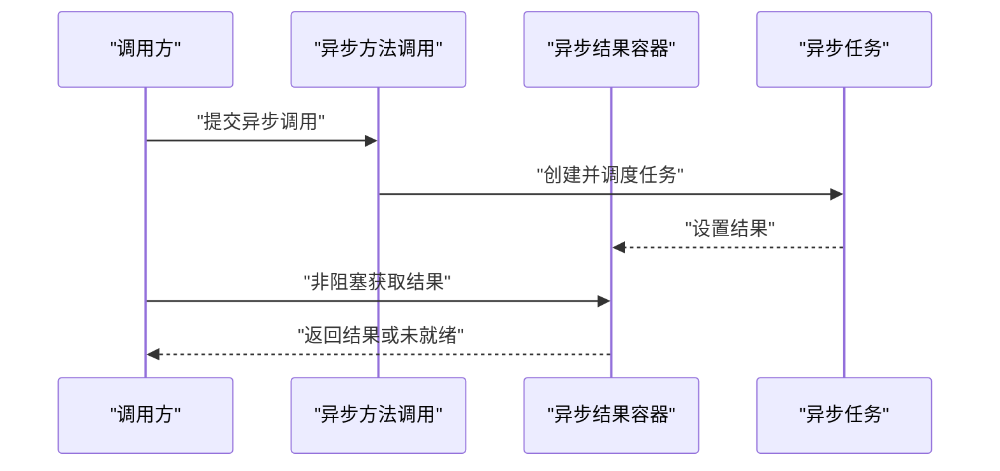

图表来源
- [async-method-invocation/AsyncMethodInvocation.java](file://async-method-invocation/src/main/java/com/iluwatar/async/method/invocation/AsyncMethodInvocation.java)
- [async-method-invocation/AsyncResult.java](file://async-method-invocation/src/main/java/com/iluwatar/async/method/invocation/AsyncResult.java)
- [async-method-invocation/AsyncTask.java](file://async-method-invocation/src/main/java/com/iluwatar/async/method/invocation/AsyncTask.java)

章节来源
- [async-method-invocation/AsyncMethodInvocation.java](file://async-method-invocation/src/main/java/com/iluwatar/async/method/invocation/AsyncMethodInvocation.java)
- [async-method-invocation/AsyncResult.java](file://async-method-invocation/src/main/java/com/iluwatar/async/method/invocation/AsyncResult.java)
- [async-method-invocation/AsyncTask.java](file://async-method-invocation/src/main/java/com/iluwatar/async/method/invocation/AsyncTask.java)
- [async-method-invocation/AsyncMethodInvocationTest.java](file://async-method-invocation/src/test/java/com/iluwatar/async/method/invocation/AsyncMethodInvocationTest.java)

### 双缓冲
- 设计要点：维护两个缓冲区，写入与读取在不同缓冲间轮换，降低锁竞争
- 线程安全：切换缓冲区时需保证可见性与原子性
- 性能：减少读写冲突，提升吞吐

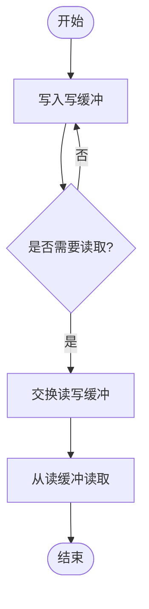

图表来源
- [double-buffer/DoubleBuffer.java](file://double-buffer/src/main/java/com/iluwatar/doublebuffer/DoubleBuffer.java)
- [double-buffer/DoubleBufferTest.java](file://double-buffer/src/test/java/com/iluwatar/doublebuffer/DoubleBufferTest.java)

章节来源
- [double-buffer/DoubleBuffer.java](file://double-buffer/src/main/java/com/iluwatar/doublebuffer/DoubleBuffer.java)
- [double-buffer/DoubleBufferTest.java](file://double-buffer/src/test/java/com/iluwatar/doublebuffer/DoubleBufferTest.java)

### 双重检查锁定（单例）
- 设计要点：利用volatile与两次检查，确保单例的线程安全与性能
- 线程安全：第一次检查避免不必要的同步，第二次检查确保只创建一次实例
- 性能：减少同步开销，提高访问速度

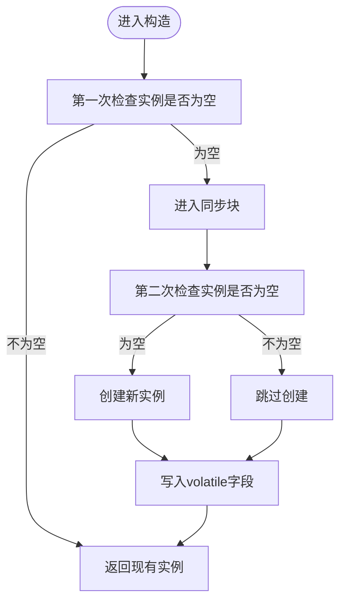

图表来源
- [double-checked-locking/DoubleCheckedLocking.java](file://double-checked-locking/src/main/java/com/iluwatar/doublechecked/locking/DoubleCheckedLocking.java)
- [double-checked-locking/DoubleCheckedLockingTest.java](file://double-checked-locking/src/test/java/com/iluwatar/doublechecked/locking/DoubleCheckedLockingTest.java)

章节来源
- [double-checked-locking/DoubleCheckedLocking.java](file://double-checked-locking/src/main/java/com/iluwatar/doublechecked/locking/DoubleCheckedLocking.java)
- [double-checked-locking/DoubleCheckedLockingTest.java](file://double-checked-locking/src/test/java/com/iluwatar/doublechecked/locking/DoubleCheckedLockingTest.java)

### 惰性加载（单例）
- 设计要点：仅在首次使用时创建实例，降低启动成本
- 线程安全：需保证多线程下的唯一性与可见性
- 性能：延迟初始化减少内存占用与初始化开销

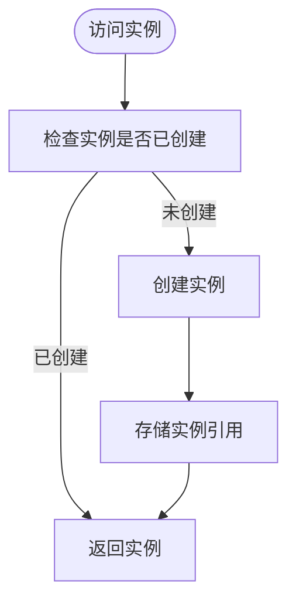

图表来源
- [lazy-loading/LazyLoading.java](file://lazy-loading/src/main/java/com/iluwatar/lazy/loading/LazyLoading.java)
- [lazy-loading/LazyLoadingTest.java](file://lazy-loading/src/test/java/com/iluwatar/lazy/loading/LazyLoadingTest.java)

章节来源
- [lazy-loading/LazyLoading.java](file://lazy-loading/src/main/java/com/iluwatar/lazy/loading/LazyLoading.java)
- [lazy-loading/LazyLoadingTest.java](file://lazy-loading/src/test/java/com/iluwatar/lazy/loading/LazyLoadingTest.java)

### 守护挂起
- 设计要点：在条件不满足时阻塞当前线程，避免忙等；条件满足后唤醒继续执行
- 线程安全：需正确使用等待/通知机制，避免虚假唤醒
- 性能：减少CPU空转，提高系统效率

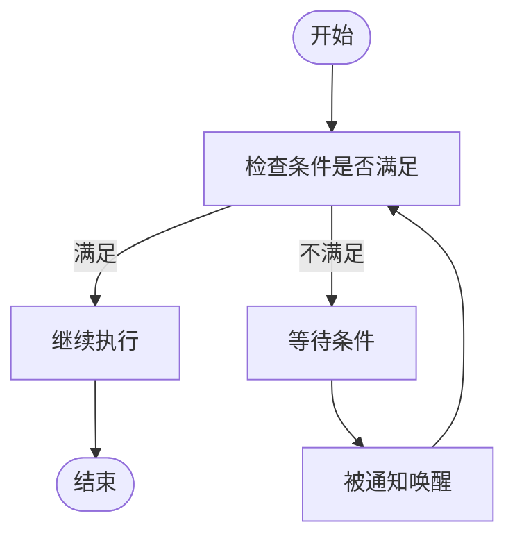

图表来源
- [guarded-suspension/GuardedSuspension.java](file://guarded-suspension/src/main/java/com/iluwatar/guarded/suspension/GuardedSuspension.java)
- [guarded-suspension/GuardedSuspensionTest.java](file://guarded-suspension/src/test/java/com/iluwatar/guarded/suspension/GuardedSuspensionTest.java)

章节来源
- [guarded-suspension/GuardedSuspension.java](file://guarded-suspension/src/main/java/com/iluwatar/guarded/suspension/GuardedSuspension.java)
- [guarded-suspension/GuardedSuspensionTest.java](file://guarded-suspension/src/test/java/com/iluwatar/guarded/suspension/GuardedSuspensionTest.java)

### 主动对象
- 设计要点：将方法调用封装为命令，放入调度队列，由专用线程执行，解耦调用线程与执行线程
- 线程安全：队列操作需保证并发安全
- 性能：通过线程池与队列提升吞吐与响应性

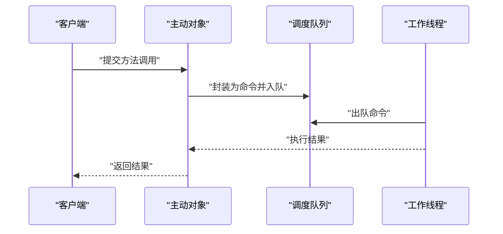

图表来源
- [active-object/ActiveObject.java](file://active-object/src/main/java/com/iluwatar/activeobject/ActiveObject.java)
- [active-object/ActiveObjectTest.java](file://active-object/src/test/java/com/iluwatar/activeobject/ActiveObjectTest.java)

章节来源
- [active-object/ActiveObject.java](file://active-object/src/main/java/com/iluwatar/activeobject/ActiveObject.java)
- [active-object/ActiveObjectTest.java](file://active-object/src/test/java/com/iluwatar/activeobject/ActiveObjectTest.java)

### 生产者-消费者
- 设计要点：通过共享缓冲区解耦生产与消费，平衡吞吐与背压
- 线程安全：需保证缓冲区的并发访问安全
- 性能：合理设置缓冲区大小与生产/消费速率，避免阻塞与饥饿

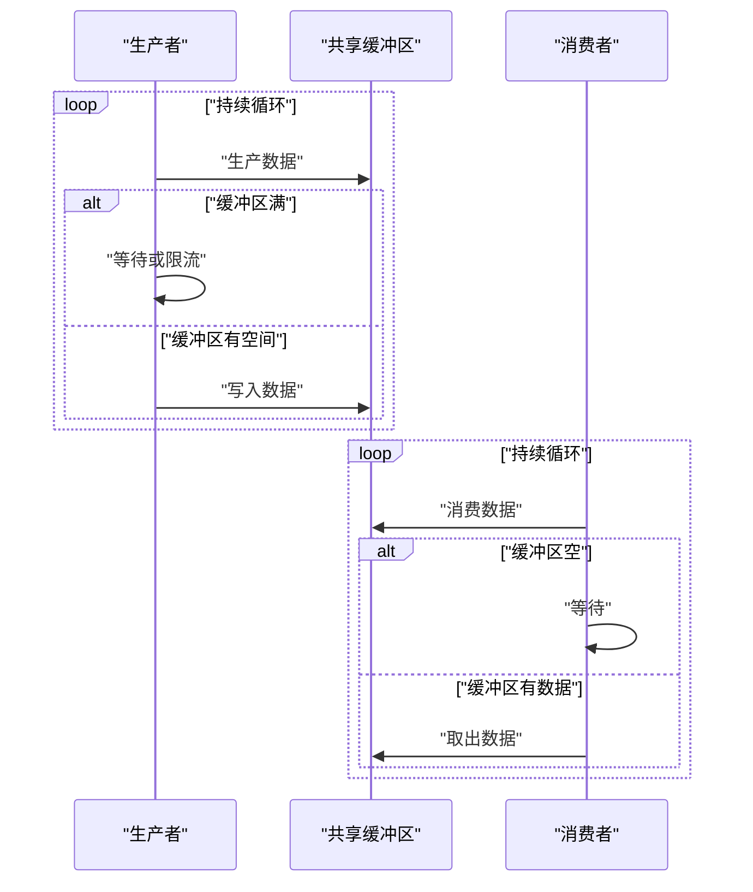

图表来源
- [producer-consumer/ProducerConsumer.java](file://producer-consumer/src/main/java/com/iluwatar/producerconsumer/ProducerConsumer.java)
- [producer-consumer/ProducerConsumerTest.java](file://producer-consumer/src/test/java/com/iluwatar/producerconsumer/ProducerConsumerTest.java)

章节来源
- [producer-consumer/ProducerConsumer.java](file://producer-consumer/src/main/java/com/iluwatar/producerconsumer/ProducerConsumer.java)
- [producer-consumer/ProducerConsumerTest.java](file://producer-consumer/src/test/java/com/iluwatar/producerconsumer/ProducerConsumerTest.java)

## 依赖关系分析
- 模块内聚：各并发模式模块内部职责清晰，接口与实现分离
- 模块耦合：回调模式与异步方法调用存在天然关联；主动对象与生产者-消费者在架构上互补
- 外部依赖：基于标准Java并发API（如volatile、synchronized、wait/notify等）实现线程安全

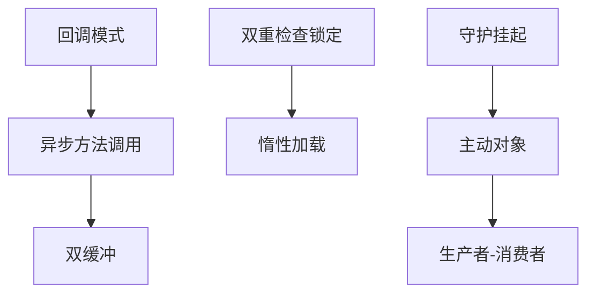

图表来源
- [callback/Callback.java](file://callback/src/main/java/com/iluwatar/callback/Callback.java#L1-L34)
- [async-method-invocation/AsyncMethodInvocation.java](file://async-method-invocation/src/main/java/com/iluwatar/async/method/invocation/AsyncMethodInvocation.java)
- [double-buffer/DoubleBuffer.java](file://double-buffer/src/main/java/com/iluwatar/doublebuffer/DoubleBuffer.java)
- [double-checked-locking/DoubleCheckedLocking.java](file://double-checked-locking/src/main/java/com/iluwatar/doublechecked/locking/DoubleCheckedLocking.java)
- [lazy-loading/LazyLoading.java](file://lazy-loading/src/main/java/com/iluwatar/lazy/loading/LazyLoading.java)
- [guarded-suspension/GuardedSuspension.java](file://guarded-suspension/src/main/java/com/iluwatar/guarded/suspension/GuardedSuspension.java)
- [active-object/ActiveObject.java](file://active-object/src/main/java/com/iluwatar/activeobject/ActiveObject.java)
- [producer-consumer/ProducerConsumer.java](file://producer-consumer/src/main/java/com/iluwatar/producerconsumer/ProducerConsumer.java)

## 性能考虑
- 减少锁竞争：优先采用无锁或低锁争用的数据结构与算法（如双缓冲）
- 避免忙等：使用条件等待与通知机制替代轮询
- 合理设置缓冲区：根据负载动态调整容量，防止过度阻塞或内存占用过高
- 单例初始化：采用双重检查锁定或静态内部类，兼顾性能与线程安全
- 异步化：将耗时操作异步化，提升整体吞吐与响应性
- 线程池与队列：为主动对象与异步任务提供稳定的执行环境

## 故障排查指南
- 死锁排查：检查是否存在相互等待的锁顺序，优先使用超时与无锁方案
- 活跃性问题：关注条件不满足导致的无限等待，确保超时与中断机制
- 内存泄漏：注意异步任务与回调持有的对象引用，及时释放
- 竞态条件：核对volatile与同步块的使用，确保可见性与原子性
- 资源泄露：确认线程池与队列的生命周期管理，避免资源无法回收

## 结论
通过以上并发模式与异步编程实践，可以在多线程环境中实现高可用、高性能与可维护的系统。建议在实际工程中结合具体场景选择合适的模式组合，并配合Java并发包的高级同步原语进行优化与治理。

## 附录
- 推荐阅读：Java并发编程实战、Java核心技术卷II
- 工具与库：JUC（java.util.concurrent）、Disruptor、Akka等
- 测试建议：使用并发测试框架验证线程安全与性能指标