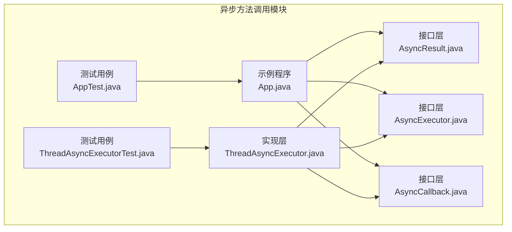
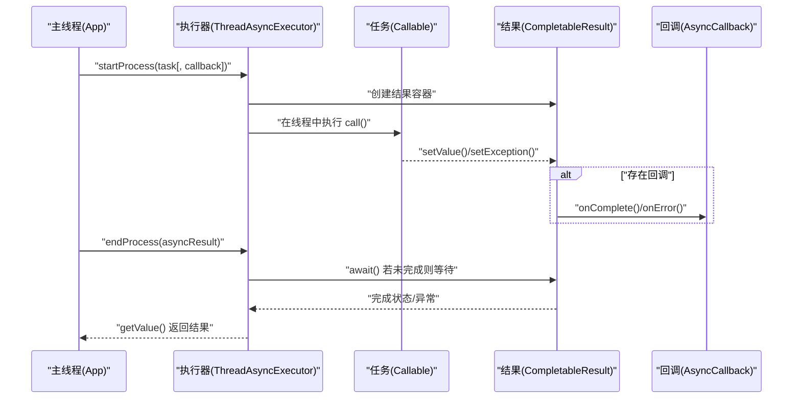
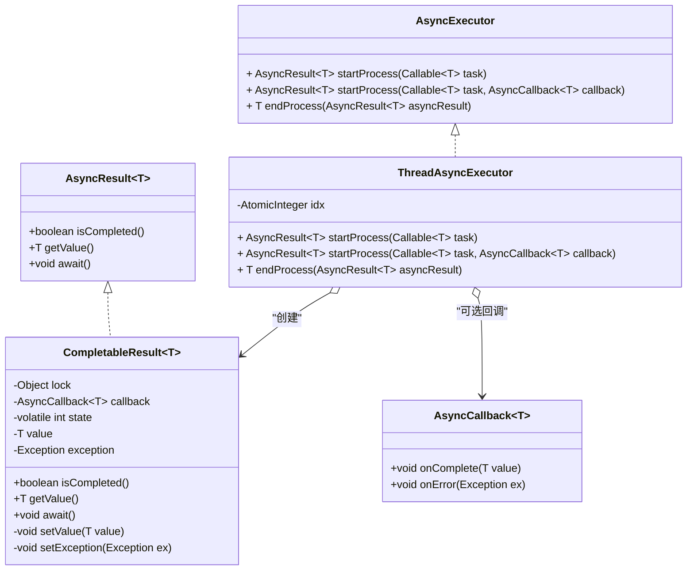
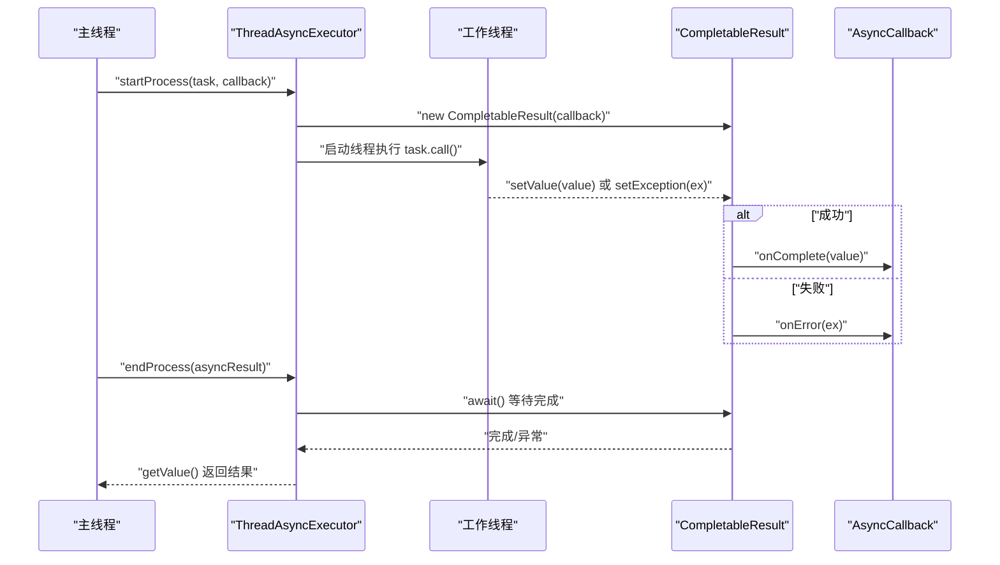
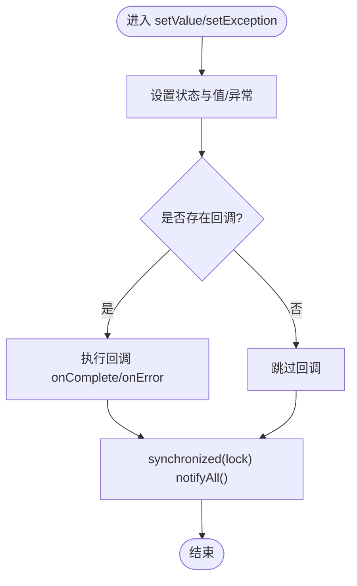
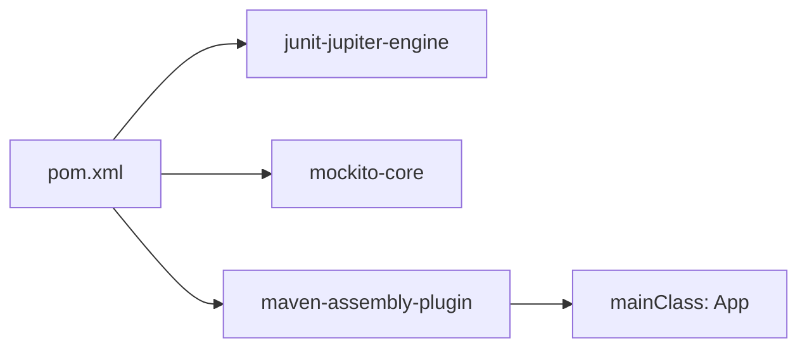

# 异步方法调用模式

<cite>
**本文引用的文件**
- [App.java](file://async-method-invocation/src/main/java/com/iluwatar/async/method/invocation/App.java)
- [AsyncCallback.java](file://async-method-invocation/src/main/java/com/iluwatar/async/method/invocation/AsyncCallback.java)
- [AsyncExecutor.java](file://async-method-invocation/src/main/java/com/iluwatar/async/method/invocation/AsyncExecutor.java)
- [AsyncResult.java](file://async-method-invocation/src/main/java/com/iluwatar/async/method/invocation/AsyncResult.java)
- [ThreadAsyncExecutor.java](file://async-method-invocation/src/main/java/com/iluwatar/async/method/invocation/ThreadAsyncExecutor.java)
- [AppTest.java](file://async-method-invocation/src/test/java/com/iluwatar/async/method/invocation/AppTest.java)
- [ThreadAsyncExecutorTest.java](file://async-method-invocation/src/test/java/com/iluwatar/async/method/invocation/ThreadAsyncExecutorTest.java)
- [README.md](file://async-method-invocation/README.md)
- [pom.xml](file://async-method-invocation/pom.xml)
</cite>

## 目录
1. [简介](#简介)
2. [项目结构](#项目结构)
3. [核心组件](#核心组件)
4. [架构总览](#架构总览)
5. [详细组件分析](#详细组件分析)
6. [依赖关系分析](#依赖关系分析)
7. [性能考量](#性能考量)
8. [故障排查指南](#故障排查指南)
9. [结论](#结论)
10. [附录](#附录)

## 简介
本指南围绕“异步方法调用”设计模式展开，系统讲解异步编程的核心概念、回调机制与Future风格的结果容器实现，剖析异步执行上下文、线程管理与结果获取策略，并结合Web服务调用、数据库操作与文件处理场景给出可落地的实现思路。文档同时覆盖基于Java标准库的FutureTask与CompletableFuture、以及现代响应式库（如RxJava）在异步任务编排中的应用建议。

## 项目结构
该模块采用清晰的分层组织：接口定义（接口层）、具体实现（执行器与结果容器）、示例程序与测试用例。接口层定义了异步调用所需的契约；实现层提供了基于线程池的简单实现；示例程序演示了典型使用流程；测试用例验证了关键行为与边界条件。

图表来源
- [App.java](file://async-method-invocation/src/main/java/com/iluwatar/async/method/invocation/App.java#L69-L97)
- [AsyncExecutor.java](file://async-method-invocation/src/main/java/com/iluwatar/async/method/invocation/AsyncExecutor.java#L33-L63)
- [AsyncResult.java](file://async-method-invocation/src/main/java/com/iluwatar/async/method/invocation/AsyncResult.java#L34-L58)
- [AsyncCallback.java](file://async-method-invocation/src/main/java/com/iluwatar/async/method/invocation/AsyncCallback.java#L32-L47)
- [ThreadAsyncExecutor.java](file://async-method-invocation/src/main/java/com/iluwatar/async/method/invocation/ThreadAsyncExecutor.java#L35-L67)
- [AppTest.java](file://async-method-invocation/src/test/java/com/iluwatar/async/method/invocation/AppTest.java#L43-L48)
- [ThreadAsyncExecutorTest.java](file://async-method-invocation/src/test/java/com/iluwatar/async/method/invocation/ThreadAsyncExecutorTest.java#L70-L89)

章节来源
- [App.java](file://async-method-invocation/src/main/java/com/iluwatar/async/method/invocation/App.java#L69-L97)
- [pom.xml](file://async-method-invocation/pom.xml#L36-L47)

## 核心组件
- 接口层
  - AsyncResult<T>：抽象异步计算结果，提供完成状态查询、阻塞等待与取值能力。
  - AsyncCallback<T>：异步完成/失败回调接口，分别在成功与异常时被调用。
  - AsyncExecutor：异步执行器接口，负责启动异步任务并返回结果容器，支持带回调的启动方式与阻塞收集结果。
- 实现层
  - ThreadAsyncExecutor：为每个任务创建新线程执行，内部通过轻量级结果容器CompletableResult协调状态、通知与回调执行。
- 示例与测试
  - App：展示多任务并发启动、主线程继续工作、最终收集结果与回调触发的完整流程。
  - 测试：覆盖成功路径、长耗时任务、空任务与回调组合等边界条件。

章节来源
- [AsyncResult.java](file://async-method-invocation/src/main/java/com/iluwatar/async/method/invocation/AsyncResult.java#L34-L58)
- [AsyncCallback.java](file://async-method-invocation/src/main/java/com/iluwatar/async/method/invocation/AsyncCallback.java#L32-L47)
- [AsyncExecutor.java](file://async-method-invocation/src/main/java/com/iluwatar/async/method/invocation/AsyncExecutor.java#L33-L63)
- [ThreadAsyncExecutor.java](file://async-method-invocation/src/main/java/com/iluwatar/async/method/invocation/ThreadAsyncExecutor.java#L35-L67)
- [App.java](file://async-method-invocation/src/main/java/com/iluwatar/async/method/invocation/App.java#L69-L97)
- [AppTest.java](file://async-method-invocation/src/test/java/com/iluwatar/async/method/invocation/AppTest.java#L43-L48)
- [ThreadAsyncExecutorTest.java](file://async-method-invocation/src/test/java/com/iluwatar/async/method/invocation/ThreadAsyncExecutorTest.java#L69-L89)

## 架构总览
下图展示了从应用入口到执行器与结果容器的整体交互流程，包括任务启动、回调触发与结果收集的关键节点。

图表来源
- [App.java](file://async-method-invocation/src/main/java/com/iluwatar/async/method/invocation/App.java#L69-L97)
- [ThreadAsyncExecutor.java](file://async-method-invocation/src/main/java/com/iluwatar/async/method/invocation/ThreadAsyncExecutor.java#L42-L67)
- [AsyncResult.java](file://async-method-invocation/src/main/java/com/iluwatar/async/method/invocation/AsyncResult.java#L50-L57)
- [AsyncCallback.java](file://async-method-invocation/src/main/java/com/iluwatar/async/method/invocation/AsyncCallback.java#L39-L46)

## 详细组件分析

### 类关系图（接口与实现）

图表来源
- [AsyncExecutor.java](file://async-method-invocation/src/main/java/com/iluwatar/async/method/invocation/AsyncExecutor.java#L33-L63)
- [AsyncResult.java](file://async-method-invocation/src/main/java/com/iluwatar/async/method/invocation/AsyncResult.java#L34-L58)
- [AsyncCallback.java](file://async-method-invocation/src/main/java/com/iluwatar/async/method/invocation/AsyncCallback.java#L32-L47)
- [ThreadAsyncExecutor.java](file://async-method-invocation/src/main/java/com/iluwatar/async/method/invocation/ThreadAsyncExecutor.java#L35-L67)
- [ThreadAsyncExecutor.java](file://async-method-invocation/src/main/java/com/iluwatar/async/method/invocation/ThreadAsyncExecutor.java#L77-L157)

章节来源
- [AsyncExecutor.java](file://async-method-invocation/src/main/java/com/iluwatar/async/method/invocation/AsyncExecutor.java#L33-L63)
- [AsyncResult.java](file://async-method-invocation/src/main/java/com/iluwatar/async/method/invocation/AsyncResult.java#L34-L58)
- [AsyncCallback.java](file://async-method-invocation/src/main/java/com/iluwatar/async/method/invocation/AsyncCallback.java#L32-L47)
- [ThreadAsyncExecutor.java](file://async-method-invocation/src/main/java/com/iluwatar/async/method/invocation/ThreadAsyncExecutor.java#L35-L67)

### 执行流程与回调序列
以下序列图聚焦于带回调的任务执行路径，展示从启动到回调触发再到结果收集的全过程。

图表来源
- [ThreadAsyncExecutor.java](file://async-method-invocation/src/main/java/com/iluwatar/async/method/invocation/ThreadAsyncExecutor.java#L47-L67)
- [ThreadAsyncExecutor.java](file://async-method-invocation/src/main/java/com/iluwatar/async/method/invocation/ThreadAsyncExecutor.java#L105-L131)
- [AsyncResult.java](file://async-method-invocation/src/main/java/com/iluwatar/async/method/invocation/AsyncResult.java#L50-L57)
- [AsyncCallback.java](file://async-method-invocation/src/main/java/com/iluwatar/async/method/invocation/AsyncCallback.java#L39-L46)

章节来源
- [App.java](file://async-method-invocation/src/main/java/com/iluwatar/async/method/invocation/App.java#L69-L97)
- [ThreadAsyncExecutor.java](file://async-method-invocation/src/main/java/com/iluwatar/async/method/invocation/ThreadAsyncExecutor.java#L47-L67)
- [ThreadAsyncExecutorTest.java](file://async-method-invocation/src/test/java/com/iluwatar/async/method/invocation/ThreadAsyncExecutorTest.java#L95-L119)

### 复杂逻辑流程（结果容器状态机）
CompletableResult通过内部状态机管理运行、失败与完成三种状态，并在完成后通知等待线程与回调。其等待/通知机制采用内置锁与wait/notifyAll实现。

图表来源
- [ThreadAsyncExecutor.java](file://async-method-invocation/src/main/java/com/iluwatar/async/method/invocation/ThreadAsyncExecutor.java#L105-L131)
- [AsyncResult.java](file://async-method-invocation/src/main/java/com/iluwatar/async/method/invocation/AsyncResult.java#L133-L156)

章节来源
- [ThreadAsyncExecutor.java](file://async-method-invocation/src/main/java/com/iluwatar/async/method/invocation/ThreadAsyncExecutor.java#L77-L157)
- [AsyncResult.java](file://async-method-invocation/src/main/java/com/iluwatar/async/method/invocation/AsyncResult.java#L133-L156)

### 使用示例与最佳实践
- 典型用法
  - 并发启动多个任务，主线程继续其他工作，最后统一收集结果或等待回调完成。
  - 对耗时任务提供回调，以便在任务完成时立即感知并进行后续处理。
- 最佳实践
  - 避免为每个任务都创建新线程；在生产环境中应使用线程池以控制资源开销。
  - 回调应在工作线程中执行，注意避免阻塞回调线程；若需长时间处理，应将回调内的重活转交至线程池。
  - 明确区分“等待结果”与“回调触发”的线程归属，防止死锁或上下文错配。
  - 对空任务或异常任务进行显式处理，确保回调能正确收到错误信息。

章节来源
- [App.java](file://async-method-invocation/src/main/java/com/iluwatar/async/method/invocation/App.java#L69-L97)
- [ThreadAsyncExecutor.java](file://async-method-invocation/src/main/java/com/iluwatar/async/method/invocation/ThreadAsyncExecutor.java#L47-L67)
- [README.md](file://async-method-invocation/README.md#L162-L183)

## 依赖关系分析
- 模块依赖
  - 单元测试依赖JUnit Jupiter与Mockito，用于断言与模拟回调行为。
  - 打包插件配置了主类，便于直接运行示例程序。
- 运行时依赖
  - 该模块未声明额外运行时依赖，核心逻辑基于JDK标准库。

图表来源
- [pom.xml](file://async-method-invocation/pom.xml#L36-L66)

章节来源
- [pom.xml](file://async-method-invocation/pom.xml#L36-L66)

## 性能考量
- 线程模型
  - 当前实现为每个任务创建新线程，适合小规模或演示场景；大规模并发会带来线程切换与内存压力。
  - 建议在生产环境使用固定大小的线程池，配合队列与拒绝策略，平衡吞吐与延迟。
- 结果等待
  - 使用阻塞等待（await）时应考虑超时与中断策略，避免无限期阻塞。
- 回调执行
  - 回调可能在工作线程中执行，应尽量保持轻量；重任务应异步转交至专用线程池。
- 资源管理
  - 注意线程命名与生命周期管理，避免线程泄漏；对异常路径进行日志记录与指标上报。

## 故障排查指南
- 常见问题
  - 在任务未完成时调用getValue抛出非法状态异常：需先等待完成或使用endProcess统一收集。
  - 回调未触发：确认任务是否抛出异常导致走错误分支；检查回调对象是否为空。
  - 空任务导致空指针异常：对空任务进行显式处理并在回调中捕获异常。
- 定位手段
  - 使用测试用例覆盖成功/失败/长耗时/空任务等场景，定位边界条件。
  - 在回调与等待点增加日志，观察线程名与时间戳，判断是否出现阻塞或回调错配。

章节来源
- [ThreadAsyncExecutorTest.java](file://async-method-invocation/src/test/java/com/iluwatar/async/method/invocation/ThreadAsyncExecutorTest.java#L141-L146)
- [ThreadAsyncExecutorTest.java](file://async-method-invocation/src/test/java/com/iluwatar/async/method/invocation/ThreadAsyncExecutorTest.java#L258-L266)
- [ThreadAsyncExecutorTest.java](file://async-method-invocation/src/test/java/com/iluwatar/async/method/invocation/ThreadAsyncExecutorTest.java#L284-L290)

## 结论
异步方法调用模式通过“非阻塞启动+结果容器+回调/等待收集”的组合，有效提升系统的并发性与响应性。本模块以简洁实现展示了核心思想：接口抽象、轻量实现与完备测试。在工程实践中，应结合线程池、超时与错误处理策略，进一步完善可靠性与可观测性。

## 附录
- 相关参考
  - Java标准库FutureTask、CompletableFuture与ExecutorService为真实世界实现范式。
  - RxJava等响应式库提供更丰富的组合算子与背压策略，适用于复杂异步编排场景。

章节来源
- [README.md](file://async-method-invocation/README.md#L180-L183)
- [README.md](file://async-method-invocation/README.md#L201-L207)