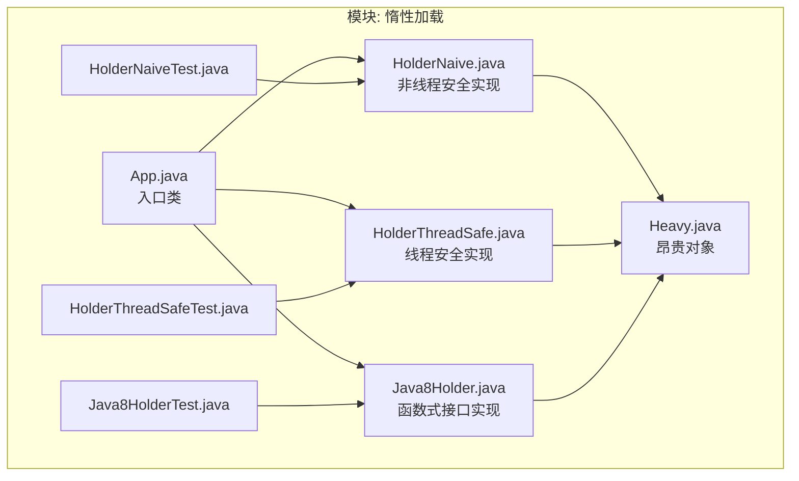
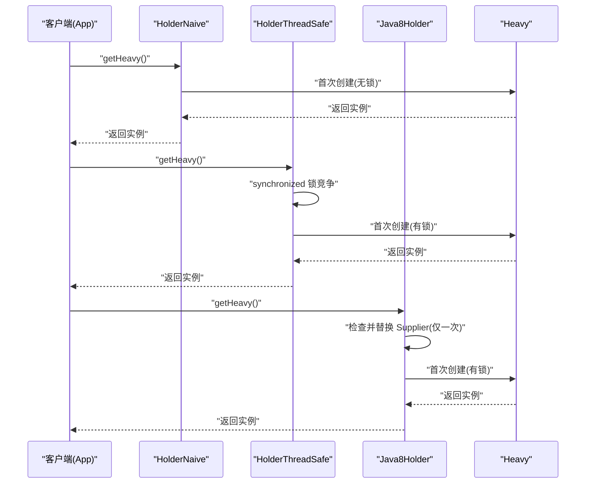
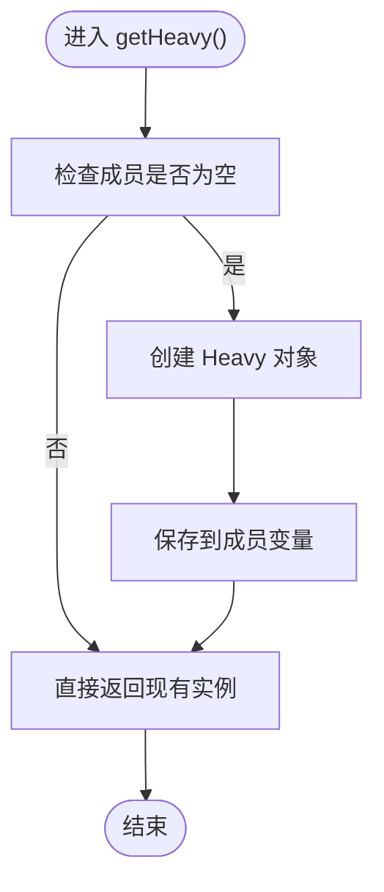
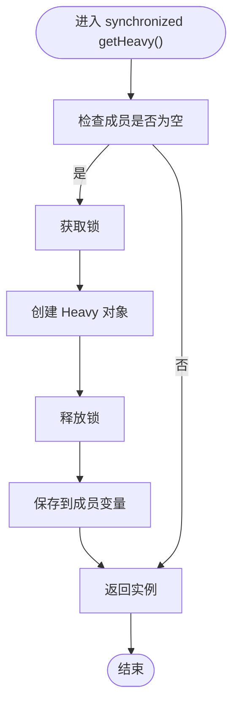
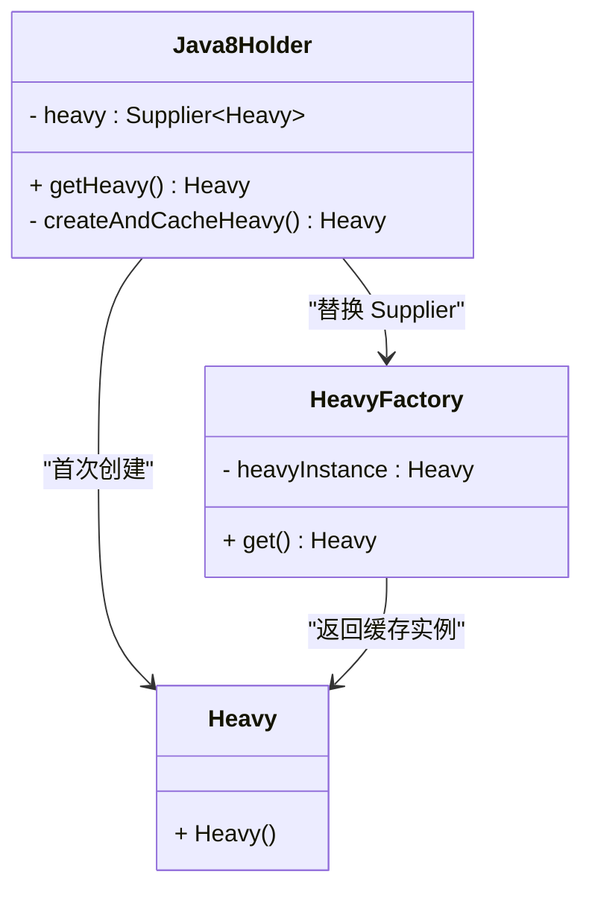
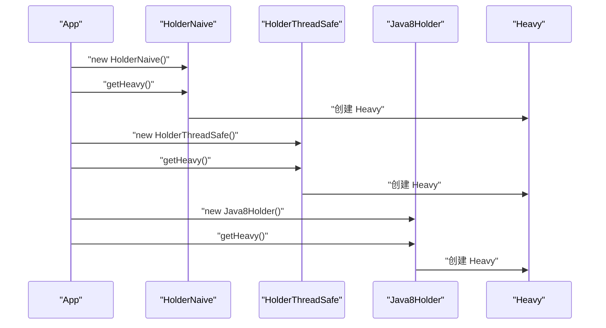
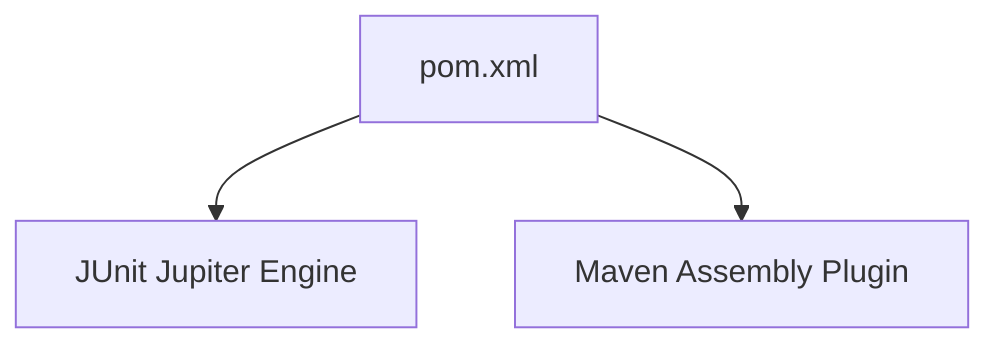

# 惰性加载模式

<cite>
**本文引用的文件**
- [README.md](file://lazy-loading/README.md)
- [pom.xml](file://lazy-loading/pom.xml)
- [App.java](file://lazy-loading/src/main/java/com/iluwatar/lazy/loading/App.java)
- [HolderNaive.java](file://lazy-loading/src/main/java/com/iluwatar/lazy/loading/HolderNaive.java)
- [HolderThreadSafe.java](file://lazy-loading/src/main/java/com/iluwatar/lazy/loading/HolderThreadSafe.java)
- [Java8Holder.java](file://lazy-loading/src/main/java/com/iluwatar/lazy/loading/Java8Holder.java)
- [Heavy.java](file://lazy-loading/src/main/java/com/iluwatar/lazy/loading/Heavy.java)
- [HolderNaiveTest.java](file://lazy-loading/src/test/java/com/iluwatar/lazy/loading/HolderNaiveTest.java)
- [HolderThreadSafeTest.java](file://lazy-loading/src/test/java/com/iluwatar/lazy/loading/HolderThreadSafeTest.java)
- [Java8HolderTest.java](file://lazy-loading/src/test/java/com/iluwatar/lazy/loading/Java8HolderTest.java)
</cite>

## 目录
1. [简介](#简介)
2. [项目结构](#项目结构)
3. [核心组件](#核心组件)
4. [架构总览](#架构总览)
5. [组件详解](#组件详解)
6. [依赖关系分析](#依赖关系分析)
7. [性能与内存优化](#性能与内存优化)
8. [故障排查指南](#故障排查指南)
9. [结论](#结论)
10. [附录：完整实现与测试路径](#附录完整实现与测试路径)

## 简介
惰性加载（Lazy Loading）是一种在需要时才进行对象或资源初始化的性能优化技术。它能显著减少应用启动时间并降低内存占用，尤其适用于昂贵对象的创建、资源加载与网络请求等场景。本指南基于仓库中的示例，系统讲解从基础非线程安全到线程安全再到利用函数式接口的高效实现，并结合测试用例说明其行为特征与适用场景。

## 项目结构
该模块为一个独立的 Maven 工程，包含一个示例程序与三种惰性加载实现，以及对应的测试用例。入口类负责演示三种实现的差异；Heavy 类代表“昂贵对象”，用于模拟初始化成本；各 Holder 实现封装了惰性初始化逻辑。

**图表来源**
- [App.java](file://lazy-loading/src/main/java/com/iluwatar/lazy/loading/App.java#L38-L62)
- [HolderNaive.java](file://lazy-loading/src/main/java/com/iluwatar/lazy/loading/HolderNaive.java#L33-L53)
- [HolderThreadSafe.java](file://lazy-loading/src/main/java/com/iluwatar/lazy/loading/HolderThreadSafe.java#L34-L54)
- [Java8Holder.java](file://lazy-loading/src/main/java/com/iluwatar/lazy/loading/Java8Holder.java#L35-L63)
- [Heavy.java](file://lazy-loading/src/main/java/com/iluwatar/lazy/loading/Heavy.java#L33-L47)
- [HolderNaiveTest.java](file://lazy-loading/src/test/java/com/iluwatar/lazy/loading/HolderNaiveTest.java#L31-L47)
- [HolderThreadSafeTest.java](file://lazy-loading/src/test/java/com/iluwatar/lazy/loading/HolderThreadSafeTest.java#L31-L47)
- [Java8HolderTest.java](file://lazy-loading/src/test/java/com/iluwatar/lazy/loading/Java8HolderTest.java#L33-L62)

**章节来源**
- [pom.xml](file://lazy-loading/pom.xml#L28-L63)
- [README.md](file://lazy-loading/README.md#L1-L175)

## 核心组件
- 入口类 App：演示三种惰性加载实现的使用方式与输出日志。
- HolderNaive：最简实现，非线程安全，适合单线程环境。
- HolderThreadSafe：线程安全但每次访问都加锁，存在同步开销。
- Java8Holder：利用 Supplier 函数式接口，仅在首次访问时创建并替换工厂，后续直接返回已缓存实例。
- Heavy：昂贵对象构造器中模拟耗时操作，便于验证惰性初始化时机。

**章节来源**
- [App.java](file://lazy-loading/src/main/java/com/iluwatar/lazy/loading/App.java#L38-L62)
- [HolderNaive.java](file://lazy-loading/src/main/java/com/iluwatar/lazy/loading/HolderNaive.java#L33-L53)
- [HolderThreadSafe.java](file://lazy-loading/src/main/java/com/iluwatar/lazy/loading/HolderThreadSafe.java#L34-L54)
- [Java8Holder.java](file://lazy-loading/src/main/java/com/iluwatar/lazy/loading/Java8Holder.java#L35-L63)
- [Heavy.java](file://lazy-loading/src/main/java/com/iluwatar/lazy/loading/Heavy.java#L33-L47)

## 架构总览
下图展示了调用链与对象关系：App 调用三个 Holder 的 getHeavy 方法，首次访问触发 Heavy 的创建；随后的访问直接返回缓存实例。

**图表来源**
- [App.java](file://lazy-loading/src/main/java/com/iluwatar/lazy/loading/App.java#L45-L61)
- [HolderNaive.java](file://lazy-loading/src/main/java/com/iluwatar/lazy/loading/HolderNaive.java#L47-L52)
- [HolderThreadSafe.java](file://lazy-loading/src/main/java/com/iluwatar/lazy/loading/HolderThreadSafe.java#L48-L53)
- [Java8Holder.java](file://lazy-loading/src/main/java/com/iluwatar/lazy/loading/Java8Holder.java#L43-L62)
- [Heavy.java](file://lazy-loading/src/main/java/com/iluwatar/lazy/loading/Heavy.java#L38-L46)

## 组件详解

### 基础实现：HolderNaive（非线程安全）
- 设计要点
  - 成员变量惰性保存，首次访问时创建昂贵对象。
  - 无同步机制，多线程环境下可能出现重复创建与竞态条件。
- 适用场景
  - 单线程或可确保串行访问的上下文。
- 风险与权衡
  - 复杂度低，但并发不安全；若对象间存在依赖，可能引发一致性问题。

**图表来源**
- [HolderNaive.java](file://lazy-loading/src/main/java/com/iluwatar/lazy/loading/HolderNaive.java#L47-L52)

**章节来源**
- [HolderNaive.java](file://lazy-loading/src/main/java/com/iluwatar/lazy/loading/HolderNaive.java#L33-L53)

### 线程安全实现：HolderThreadSafe（同步锁）
- 设计要点
  - 使用 synchronized 修饰访问方法，保证同一时刻只有一个线程能创建实例。
  - 同步开销随并发访问增加而放大。
- 适用场景
  - 需要强一致性的多线程环境，但对吞吐量要求不高。
- 风险与权衡
  - 性能瓶颈在于锁竞争；建议在热点路径上评估替代方案。

**图表来源**
- [HolderThreadSafe.java](file://lazy-loading/src/main/java/com/iluwatar/lazy/loading/HolderThreadSafe.java#L48-L53)

**章节来源**
- [HolderThreadSafe.java](file://lazy-loading/src/main/java/com/iluwatar/lazy/loading/HolderThreadSafe.java#L34-L54)

### 高效实现：Java8Holder（函数式接口 + 双重检查）
- 设计要点
  - 初始以 Lambda 表达式作为 Supplier；首次访问时在同步块内替换为本地类工厂，后续直接返回缓存实例。
  - 仅在首次访问时承担同步成本，之后为常量时间访问。
- 适用场景
  - 高并发、高吞吐量且希望最小化锁持有时间的场景。
- 风险与权衡
  - 实现相对复杂，需理解 Supplier 与本地类替换逻辑；测试中通过反射验证替换行为。

**图表来源**
- [Java8Holder.java](file://lazy-loading/src/main/java/com/iluwatar/lazy/loading/Java8Holder.java#L37-L62)
- [Heavy.java](file://lazy-loading/src/main/java/com/iluwatar/lazy/loading/Heavy.java#L38-L46)

**章节来源**
- [Java8Holder.java](file://lazy-loading/src/main/java/com/iluwatar/lazy/loading/Java8Holder.java#L35-L63)

### 入口与昂贵对象
- App：分别创建三种 Holder 并调用 getHeavy，观察日志输出与初始化时机。
- Heavy：构造函数中模拟耗时操作，便于验证惰性初始化的实际效果。

**图表来源**
- [App.java](file://lazy-loading/src/main/java/com/iluwatar/lazy/loading/App.java#L45-L61)
- [Heavy.java](file://lazy-loading/src/main/java/com/iluwatar/lazy/loading/Heavy.java#L38-L46)

**章节来源**
- [App.java](file://lazy-loading/src/main/java/com/iluwatar/lazy/loading/App.java#L38-L62)
- [Heavy.java](file://lazy-loading/src/main/java/com/iluwatar/lazy/loading/Heavy.java#L33-L47)

## 依赖关系分析
- 模块依赖
  - 测试框架：JUnit Jupiter Engine（测试范围）。
  - 打包插件：Maven Assembly Plugin 配置主类入口。
- 运行时依赖
  - 示例代码未引入外部库，完全由 JDK 提供支持（如 Supplier）。

**图表来源**
- [pom.xml](file://lazy-loading/pom.xml#L36-L61)

**章节来源**
- [pom.xml](file://lazy-loading/pom.xml#L28-L63)

## 性能与内存优化
- 设计理念
  - 将昂贵对象的创建推迟到真正需要时，避免应用启动时的峰值内存与 CPU 开销。
- 性能优势
  - HolderNaive：无锁，但并发不安全；适合单线程或受控环境。
  - HolderThreadSafe：强一致，但锁竞争带来额外开销；适合低并发或对一致性敏感场景。
  - Java8Holder：首次访问同步，后续常量时间访问；兼顾性能与线程安全。
- 内存优化
  - 仅在首次访问时分配昂贵对象，避免不必要的堆占用。
  - Java8Holder 通过工厂替换减少重复创建与中间对象的生命周期管理成本。
- 初始化时机控制
  - 三者均在首次调用 getHeavy 时触发 Heavy 创建；后续调用直接返回缓存实例。
- 缓存策略
  - 三者均采用“成员变量缓存 + 首次创建”的策略；Java8Holder 在首次创建后替换 Supplier 为本地工厂，提升后续访问效率。
- 并发安全性保证
  - HolderNaive：非线程安全；需外部同步或单线程使用。
  - HolderThreadSafe：synchronized 保证互斥创建。
  - Java8Holder：在替换 Supplier 的关键路径上加锁，其余访问无锁。

**章节来源**
- [README.md](file://lazy-loading/README.md#L138-L168)
- [HolderNaive.java](file://lazy-loading/src/main/java/com/iluwatar/lazy/loading/HolderNaive.java#L47-L52)
- [HolderThreadSafe.java](file://lazy-loading/src/main/java/com/iluwatar/lazy/loading/HolderThreadSafe.java#L48-L53)
- [Java8Holder.java](file://lazy-loading/src/main/java/com/iluwatar/lazy/loading/Java8Holder.java#L47-L62)

## 故障排查指南
- 日志定位
  - Heavy 构造函数包含创建与完成的日志输出，可通过日志判断惰性初始化发生的时间点。
- 常见问题
  - 多线程下重复创建：优先选择线程安全实现（HolderThreadSafe 或 Java8Holder）。
  - 访问延迟导致的首帧卡顿：将惰性初始化迁移至后台线程或预热阶段。
  - 测试验证替换行为：Java8HolderTest 通过反射读取 Supplier 的本地类字段，确认替换逻辑生效。
- 建议
  - 在高并发场景优先采用 Java8Holder。
  - 若对象创建依赖外部资源（数据库、网络），考虑在初始化前加入超时与降级策略。

**章节来源**
- [Heavy.java](file://lazy-loading/src/main/java/com/iluwatar/lazy/loading/Heavy.java#L38-L46)
- [Java8HolderTest.java](file://lazy-loading/src/test/java/com/iluwatar/lazy/loading/Java8HolderTest.java#L39-L55)

## 结论
惰性加载通过“按需创建”有效降低启动成本与内存占用。在不同并发与性能需求下，可选择非线程安全（简单）、线程安全（保守）或函数式接口（高效）实现。结合测试用例与日志输出，可以清晰验证初始化时机与缓存行为，从而在真实业务中做出合理取舍。

## 附录：完整实现与测试路径
- 入口与演示
  - [App.java](file://lazy-loading/src/main/java/com/iluwatar/lazy/loading/App.java#L38-L62)
- 实现类
  - [HolderNaive.java](file://lazy-loading/src/main/java/com/iluwatar/lazy/loading/HolderNaive.java#L33-L53)
  - [HolderThreadSafe.java](file://lazy-loading/src/main/java/com/iluwatar/lazy/loading/HolderThreadSafe.java#L34-L54)
  - [Java8Holder.java](file://lazy-loading/src/main/java/com/iluwatar/lazy/loading/Java8Holder.java#L35-L63)
- 代价对象
  - [Heavy.java](file://lazy-loading/src/main/java/com/iluwatar/lazy/loading/Heavy.java#L33-L47)
- 测试用例
  - [HolderNaiveTest.java](file://lazy-loading/src/test/java/com/iluwatar/lazy/loading/HolderNaiveTest.java#L31-L47)
  - [HolderThreadSafeTest.java](file://lazy-loading/src/test/java/com/iluwatar/lazy/loading/HolderThreadSafeTest.java#L31-L47)
  - [Java8HolderTest.java](file://lazy-loading/src/test/java/com/iluwatar/lazy/loading/Java8HolderTest.java#L33-L62)
- 文档与构建
  - [README.md](file://lazy-loading/README.md#L1-L175)
  - [pom.xml](file://lazy-loading/pom.xml#L28-L63)