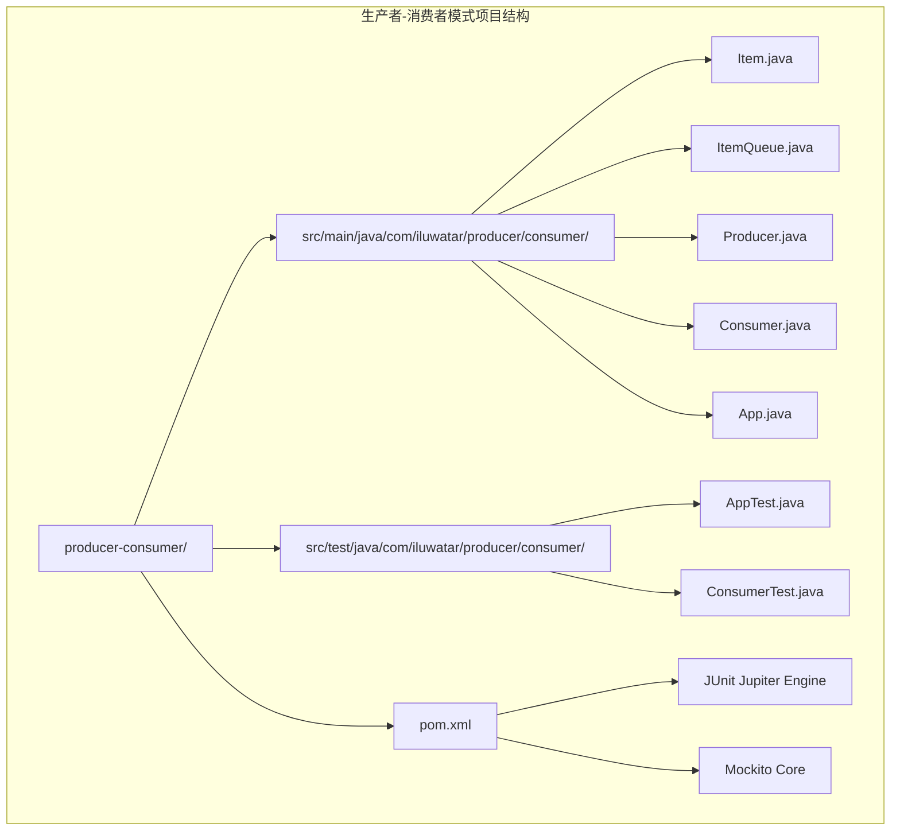
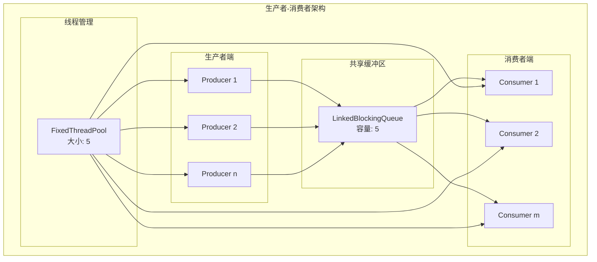
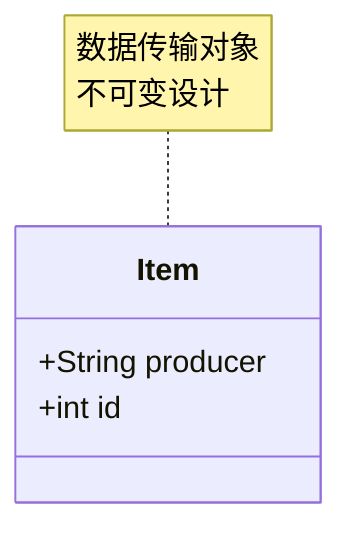
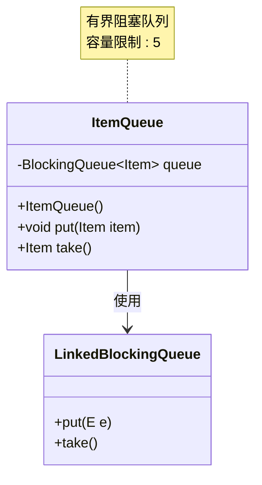
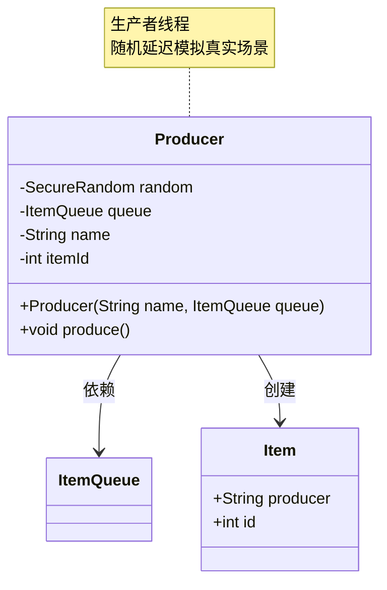
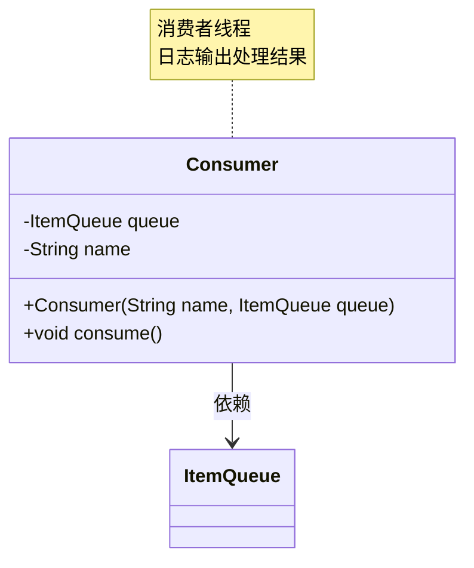
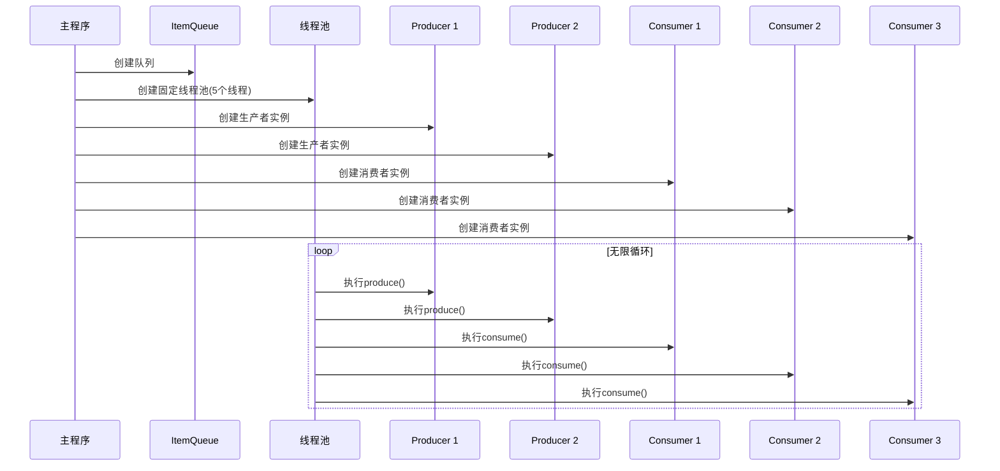
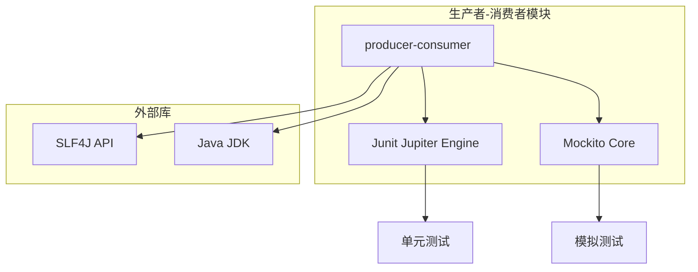

# 生产者-消费者模式

<cite>
**本文档引用的文件**
- [README.md](file://producer-consumer/README.md)
- [Item.java](file://producer-consumer/src/main/java/com/iluwatar/producer/consumer/Item.java)
- [ItemQueue.java](file://producer-consumer/src/main/java/com/iluwatar/producer/consumer/ItemQueue.java)
- [Producer.java](file://producer-consumer/src/main/java/com/iluwatar/producer/consumer/Producer.java)
- [Consumer.java](file://producer-consumer/src/main/java/com/iluwatar/producer/consumer/Consumer.java)
- [App.java](file://producer-consumer/src/main/java/com/iluwatar/producer/consumer/App.java)
- [AppTest.java](file://producer-consumer/src/test/java/com/iluwatar/producer/consumer/AppTest.java)
- [ConsumerTest.java](file://producer-consumer/src/test/java/com/iluwatar/producer/consumer/ConsumerTest.java)
- [pom.xml](file://producer-consumer/pom.xml)
</cite>

## 目录
1. [简介](#简介)
2. [项目结构](#项目结构)
3. [核心组件](#核心组件)
4. [架构概览](#架构概览)
5. [详细组件分析](#详细组件分析)
6. [依赖关系分析](#依赖关系分析)
7. [性能考虑](#性能考虑)
8. [故障排除指南](#故障排除指南)
9. [结论](#结论)
10. [附录](#附录)

## 简介

生产者-消费者模式（Producer-Consumer Pattern）是Java并发编程中的一个经典设计模式，用于解耦数据的生产和消费过程。该模式通过引入缓冲区（通常是队列）来协调生产者和消费者之间的数据交换，使得生产者可以在不直接依赖消费者的情况下产生数据，消费者也可以在不直接依赖生产者的情况下消费数据。

这种模式的核心价值在于：
- **解耦合**：生产者和消费者可以独立开发和部署
- **异步处理**：允许不同速率的数据生产和消费
- **资源管理**：通过缓冲区控制内存使用和系统负载
- **扩展性**：易于添加更多的生产者或消费者

## 项目结构

该项目采用标准的Maven项目结构，专注于展示生产者-消费者模式的实现：



**图表来源**
- [pom.xml](file://producer-consumer/pom.xml#L36-L47)

**章节来源**
- [pom.xml](file://producer-consumer/pom.xml#L1-L68)

## 核心组件

生产者-消费者模式由四个核心组件构成：

### 数据模型组件
- **Item类**：表示生产者产生的数据单元，包含生产者标识和唯一ID
- **ItemQueue类**：作为生产者和消费者之间的共享缓冲区

### 行为组件
- **Producer类**：负责生成数据项并将其放入队列
- **Consumer类**：从队列中取出数据项并进行处理

### 应用入口
- **App类**：演示程序的主入口点，配置线程池并启动生产者和消费者

**章节来源**
- [Item.java](file://producer-consumer/src/main/java/com/iluwatar/producer/consumer/Item.java#L27-L30)
- [ItemQueue.java](file://producer-consumer/src/main/java/com/iluwatar/producer/consumer/ItemQueue.java#L30-L52)
- [Producer.java](file://producer-consumer/src/main/java/com/iluwatar/producer/consumer/Producer.java#L29-L57)
- [Consumer.java](file://producer-consumer/src/main/java/com/iluwatar/producer/consumer/Consumer.java#L29-L53)
- [App.java](file://producer-consumer/src/main/java/com/iluwatar/producer/consumer/App.java#L31-L82)

## 架构概览

生产者-消费者模式的整体架构如下：



**图表来源**
- [App.java](file://producer-consumer/src/main/java/com/iluwatar/producer/consumer/App.java#L53-L71)
- [ItemQueue.java](file://producer-consumer/src/main/java/com/iluwatar/producer/consumer/ItemQueue.java#L37-L40)

该架构的关键特性：
- **固定大小缓冲区**：使用有界阻塞队列防止内存溢出
- **线程池管理**：统一管理所有生产者和消费者的执行
- **异步通信**：通过队列实现生产者和消费者的解耦

## 详细组件分析

### 数据模型层

#### Item类分析
Item类是一个简单的记录类，用于封装生产者产生的数据：



**图表来源**
- [Item.java](file://producer-consumer/src/main/java/com/iluwatar/producer/consumer/Item.java#L27-L30)

**章节来源**
- [Item.java](file://producer-consumer/src/main/java/com/iluwatar/producer/consumer/Item.java#L27-L30)

### 缓冲区管理层

#### ItemQueue类分析
ItemQueue类封装了Java的LinkedBlockingQueue，提供了线程安全的数据存取操作：



**图表来源**
- [ItemQueue.java](file://producer-consumer/src/main/java/com/iluwatar/producer/consumer/ItemQueue.java#L30-L52)

**关键实现要点**：
- 使用有界阻塞队列防止无限增长
- 自动处理生产者和消费者的同步
- 提供简洁的API接口

**章节来源**
- [ItemQueue.java](file://producer-consumer/src/main/java/com/iluwatar/producer/consumer/ItemQueue.java#L30-L52)

### 生产者组件

#### Producer类分析
Producer类负责生成数据项并将其放入共享队列：



**图表来源**
- [Producer.java](file://producer-consumer/src/main/java/com/iluwatar/producer/consumer/Producer.java#L29-L57)

**生产流程**：
1. 创建新的Item对象
2. 调用queue.put()方法
3. 随机睡眠模拟生产时间

**章节来源**
- [Producer.java](file://producer-consumer/src/main/java/com/iluwatar/producer/consumer/Producer.java#L29-L57)

### 消费者组件

#### Consumer类分析
Consumer类从共享队列中取出数据项并进行处理：



**图表来源**
- [Consumer.java](file://producer-consumer/src/main/java/com/iluwatar/producer/consumer/Consumer.java#L29-L53)

**消费流程**：
1. 调用queue.take()方法
2. 记录消费信息的日志
3. 继续等待下一个数据项

**章节来源**
- [Consumer.java](file://producer-consumer/src/main/java/com/iluwatar/producer/consumer/Consumer.java#L29-L53)

### 应用入口组件

#### App类分析
App类展示了如何配置和运行生产者-消费者系统：



**图表来源**
- [App.java](file://producer-consumer/src/main/java/com/iluwatar/producer/consumer/App.java#L53-L71)

**关键配置**：
- 固定大小线程池：5个线程
- 2个生产者线程
- 3个消费者线程
- 有界队列容量：5

**章节来源**
- [App.java](file://producer-consumer/src/main/java/com/iluwatar/producer/consumer/App.java#L49-L81)

### 测试组件

#### 单元测试分析
项目包含两个主要的测试类：

1. **AppTest**：验证应用程序能够正常启动和运行
2. **ConsumerTest**：验证消费者正确地从队列中取出数据项

**章节来源**
- [AppTest.java](file://producer-consumer/src/test/java/com/iluwatar/producer/consumer/AppTest.java#L36-L40)
- [ConsumerTest.java](file://producer-consumer/src/test/java/com/iluwatar/producer/consumer/ConsumerTest.java#L42-L57)

## 依赖关系分析

### Maven依赖关系



**图表来源**
- [pom.xml](file://producer-consumer/pom.xml#L36-L47)

### 运行时依赖

项目的主要运行时依赖包括：
- **Java标准库**：提供并发编程支持
- **SLF4J**：提供日志记录功能
- **JUnit 5**：提供单元测试框架
- **Mockito**：提供测试替身和模拟对象

**章节来源**
- [pom.xml](file://producer-consumer/pom.xml#L36-L47)

## 性能考虑

### 线程池配置优化

1. **线程数量选择**
   - 生产者数量：根据CPU核心数和I/O密集度确定
   - 消费者数量：根据处理能力和数据吞吐量确定
   - 建议：线程总数 = CPU核心数 + I/O密集度系数

2. **队列容量调优**
   - 过小：可能导致生产者频繁阻塞
   - 过大：可能消耗过多内存
   - 建议：根据峰值流量和处理能力设置

### 内存管理策略

1. **有界队列设计**
   ```java
   // 推荐：有界阻塞队列
   private final BlockingQueue<Item> queue = new LinkedBlockingQueue<>(capacity);
   
   // 不推荐：无界队列
   // private final BlockingQueue<Item> queue = new LinkedBlockingQueue<>();
   ```

2. **对象复用**
   - 复用Item对象以减少GC压力
   - 使用对象池管理大型对象

### 并发性能优化

1. **非阻塞操作**
   - 在可能的情况下使用非阻塞队列操作
   - 实现超时机制避免无限等待

2. **批量处理**
   - 实现批量生产/消费以提高效率
   - 使用流式处理减少上下文切换

## 故障排除指南

### 常见问题及解决方案

#### 1. 死锁问题
**症状**：程序停止响应，所有线程都处于等待状态

**原因分析**：
- 生产者和消费者同时等待对方释放资源
- 锁顺序不当导致循环等待

**解决方案**：
- 确保单一职责原则
- 使用无锁数据结构
- 实现超时机制

#### 2. 内存泄漏
**症状**：内存使用持续增长，最终导致OutOfMemoryError

**原因分析**：
- 队列容量过大且未及时消费
- 对象引用未正确释放

**解决方案**：
- 设置合理的队列容量上限
- 实现优雅关闭机制
- 使用弱引用管理长生命周期对象

#### 3. 性能瓶颈
**症状**：系统吞吐量下降，响应时间增加

**原因分析**：
- 线程池配置不当
- 队列长度不合适
- I/O操作阻塞

**解决方案**：
- 调整线程池大小
- 优化队列容量
- 实现异步I/O操作

### 调试技巧

1. **监控队列状态**
   ```java
   // 获取队列当前大小
   int queueSize = queue.size();
   
   // 获取剩余容量
   int remainingCapacity = queue.remainingCapacity();
   ```

2. **日志记录**
   - 记录生产/消费事件的时间戳
   - 监控队列长度变化
   - 记录异常情况

**章节来源**
- [App.java](file://producer-consumer/src/main/java/com/iluwatar/producer/consumer/App.java#L73-L80)

## 结论

生产者-消费者模式是Java并发编程中的重要设计模式，它通过引入缓冲区实现了生产者和消费者的解耦，提高了系统的可扩展性和性能。该模式的核心优势包括：

1. **解耦合**：生产者和消费者可以独立开发和部署
2. **异步处理**：支持不同速率的数据生产和消费
3. **资源管理**：通过缓冲区控制内存使用和系统负载
4. **扩展性**：易于添加更多的生产者或消费者

在实际应用中，需要特别注意以下方面：
- 合理配置线程池大小
- 设置合适的队列容量
- 实现优雅的关闭机制
- 监控系统性能指标

通过遵循这些最佳实践，可以构建高性能、可维护的并发系统。

## 附录

### 实际应用场景

1. **任务调度系统**
   - 生产者：任务提交器
   - 消费者：工作线程池

2. **日志处理系统**
   - 生产者：应用程序日志
   - 消费者：日志处理器

3. **消息队列系统**
   - 生产者：消息发布者
   - 消费者：消息订阅者

### 性能基准测试建议

1. **测试指标**
   - 吞吐量（TPS）
   - 延迟（Latency）
   - 内存使用
   - CPU利用率

2. **测试场景**
   - 稳态负载测试
   - 峰值负载测试
   - 长时间稳定性测试

3. **监控工具**
   - JMH（Java Microbenchmark Harness）
   - JProfiler
   - VisualVM

### 最佳实践总结

1. **设计原则**
   - 单一职责原则
   - 开闭原则
   - 里氏替换原则

2. **实现要点**
   - 使用有界队列
   - 合理配置线程池
   - 实现优雅关闭
   - 添加异常处理

3. **运维考虑**
   - 监控系统健康状况
   - 实施告警机制
   - 定期性能评估
   - 制定应急预案