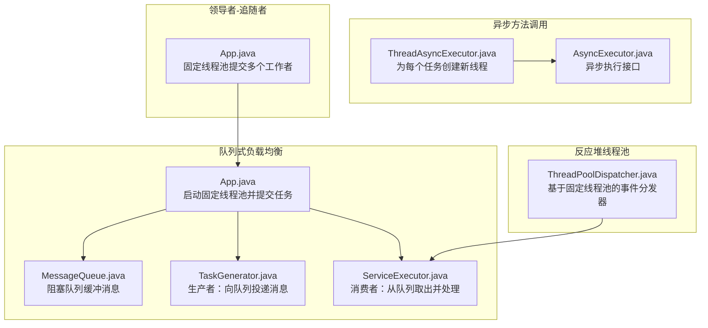
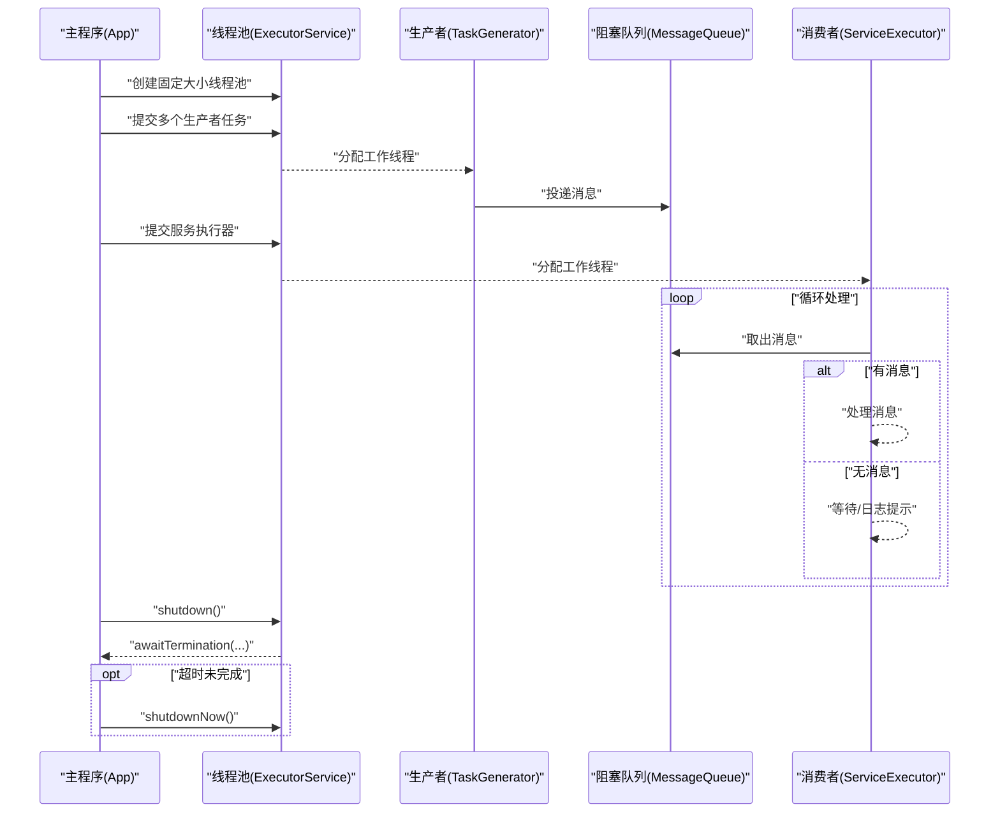
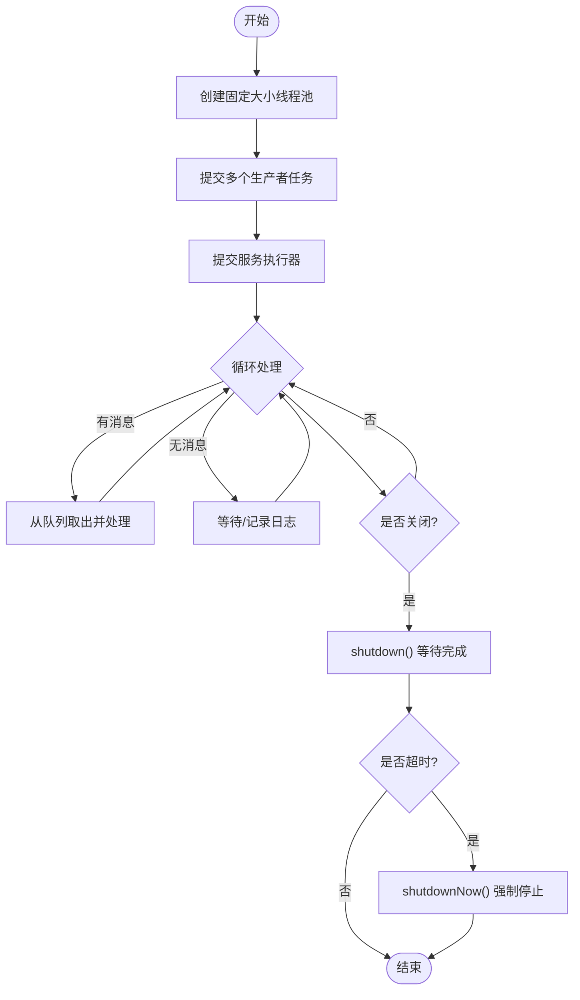
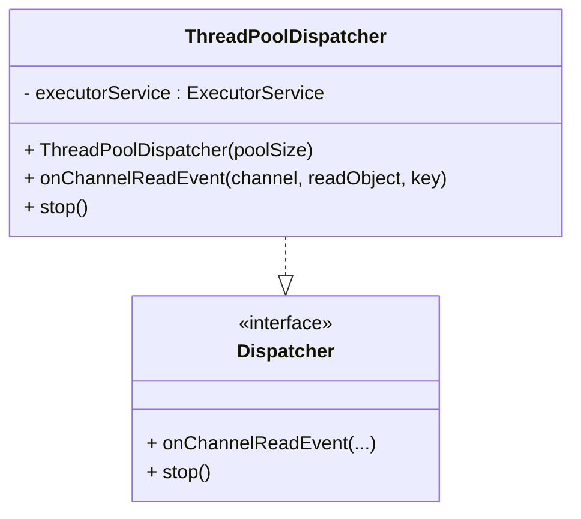
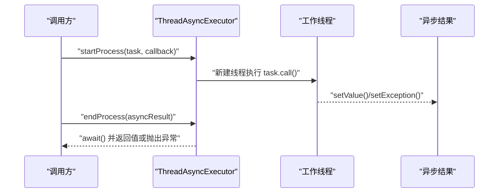
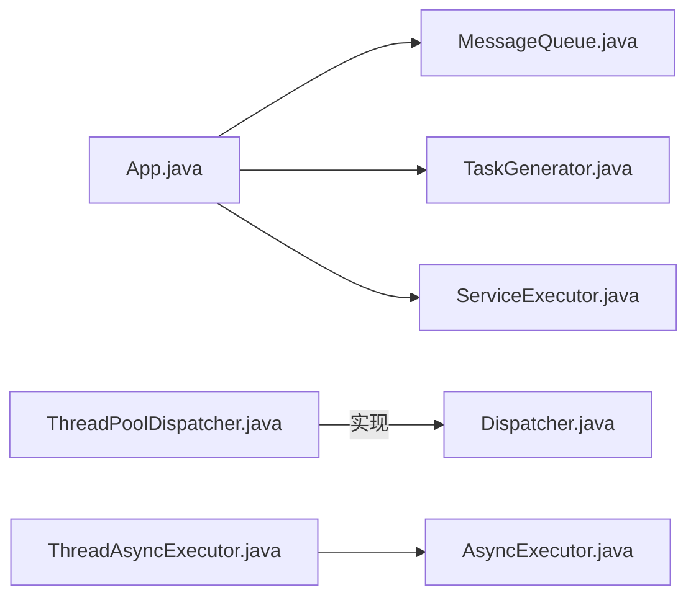

# 线程池模式

<cite>
**本文引用的文件**   
- [App.java](file://queue-based-load-leveling/src/main/java/com/iluwatar/queue/load/leveling/App.java)
- [MessageQueue.java](file://queue-based-load-leveling/src/main/java/com/iluwatar/queue/load/leveling/MessageQueue.java)
- [ServiceExecutor.java](file://queue-based-load-leveling/src/main/java/com/iluwatar/queue/load/leveling/ServiceExecutor.java)
- [TaskGenerator.java](file://queue-based-load-leveling/src/main/java/com/iluwatar/queue/load/leveling/TaskGenerator.java)
- [ThreadPoolDispatcher.java](file://reactor/src/main/java/com/iluwatar/reactor/framework/ThreadPoolDispatcher.java)
- [AsyncExecutor.java](file://async-method-invocation/src/main/java/com/iluwatar/async/method/invocation/AsyncExecutor.java)
- [ThreadAsyncExecutor.java](file://async-method-invocation/src/main/java/com/iluwatar/async/method/invocation/ThreadAsyncExecutor.java)
- [App.java](file://leader-followers/src/main/java/com/iluwatar/leaderfollowers/App.java)
- [README.md](file://queue-based-load-leveling/README.md)
</cite>

## 目录
1. [引言](#引言)
2. [项目结构](#项目结构)
3. [核心组件](#核心组件)
4. [架构总览](#架构总览)
5. [组件详解](#组件详解)
6. [依赖关系分析](#依赖关系分析)
7. [性能与资源控制](#性能与资源控制)
8. [故障排查指南](#故障排查指南)
9. [结论](#结论)
10. [附录：参数调优与最佳实践](#附录参数调优与最佳实践)

## 引言
本文件系统化梳理仓库中与“线程池模式”相关的设计与实现，围绕以下目标展开：
- 设计原理：线程池如何解耦任务提交与执行、提升吞吐与稳定性
- 生命周期管理：创建、运行、优雅关闭与强制终止
- 资源控制：线程数、队列容量、拒绝策略与内存占用
- 类型与场景：固定大小、可变大小、单线程线程池的适用性
- 实践示例：任务提交、执行监控、线程复用
- 工具类与自定义：Executors 工具类、自定义线程池调度器
- 性能与内存：基准测试与内存使用分析建议
- 监控与调优：参数调优、队列管理与拒绝策略

## 项目结构
本仓库中与线程池模式直接相关的示例主要分布在三个模块：
- 队列式负载均衡（queue-based-load-leveling）：演示固定大小线程池与阻塞队列的配合，实现生产者-消费者解耦
- 反应堆线程池（reactor）：演示基于线程池的事件分发器，隔离 I/O 线程与业务处理线程
- 异步方法调用（async-method-invocation）：演示为每个任务创建新线程的异步执行器，体现线程复用与结果回调
- 领导者-追随者（leader-followers）：演示固定大小线程池在并发工作调度中的应用

图表来源
- [App.java](file://queue-based-load-leveling/src/main/java/com/iluwatar/queue/load/leveling/App.java#L72-L117)
- [MessageQueue.java](file://queue-based-load-leveling/src/main/java/com/iluwatar/queue/load/leveling/MessageQueue.java#L36-L71)
- [TaskGenerator.java](file://queue-based-load-leveling/src/main/java/com/iluwatar/queue/load/leveling/TaskGenerator.java#L34-L83)
- [ServiceExecutor.java](file://queue-based-load-leveling/src/main/java/com/iluwatar/queue/load/leveling/ServiceExecutor.java#L34-L63)
- [ThreadPoolDispatcher.java](file://reactor/src/main/java/com/iluwatar/reactor/framework/ThreadPoolDispatcher.java#L37-L72)
- [AsyncExecutor.java](file://async-method-invocation/src/main/java/com/iluwatar/async/method/invocation/AsyncExecutor.java#L33-L63)
- [ThreadAsyncExecutor.java](file://async-method-invocation/src/main/java/com/iluwatar/async/method/invocation/ThreadAsyncExecutor.java#L35-L67)
- [App.java](file://leader-followers/src/main/java/com/iluwatar/leaderfollowers/App.java#L58-L94)

章节来源
- [App.java](file://queue-based-load-leveling/src/main/java/com/iluwatar/queue/load/leveling/App.java#L72-L117)
- [ThreadPoolDispatcher.java](file://reactor/src/main/java/com/iluwatar/reactor/framework/ThreadPoolDispatcher.java#L37-L72)
- [AsyncExecutor.java](file://async-method-invocation/src/main/java/com/iluwatar/async/method/invocation/AsyncExecutor.java#L33-L63)
- [ThreadAsyncExecutor.java](file://async-method-invocation/src/main/java/com/iluwatar/async/method/invocation/ThreadAsyncExecutor.java#L35-L67)
- [App.java](file://leader-followers/src/main/java/com/iluwatar/leaderfollowers/App.java#L58-L94)

## 核心组件
- 固定大小线程池（FixedThreadPool）
  - 在队列式负载均衡与领导者-追随者示例中广泛使用，通过固定线程数平衡吞吐与资源占用
  - 关键点：线程复用、任务排队、优雅关闭与强制终止
- 阻塞队列（BlockingQueue）
  - 作为缓冲区解耦生产者与消费者，避免服务端瞬时过载
- 反应堆线程池（ThreadPoolDispatcher）
  - 将 I/O 事件处理与业务处理分离，提高可扩展性
- 异步执行器（AsyncExecutor）
  - 为每个任务创建独立线程，便于回调与结果获取；适合短小、轻量任务

章节来源
- [App.java](file://queue-based-load-leveling/src/main/java/com/iluwatar/queue/load/leveling/App.java#L94-L112)
- [MessageQueue.java](file://queue-based-load-leveling/src/main/java/com/iluwatar/queue/load/leveling/MessageQueue.java#L38-L43)
- [ThreadPoolDispatcher.java](file://reactor/src/main/java/com/iluwatar/reactor/framework/ThreadPoolDispatcher.java#L47-L58)
- [AsyncExecutor.java](file://async-method-invocation/src/main/java/com/iluwatar/async/method/invocation/AsyncExecutor.java#L41-L62)

## 架构总览
下图展示“队列式负载均衡”与“反应堆线程池”的整体交互流程。

图表来源
- [App.java](file://queue-based-load-leveling/src/main/java/com/iluwatar/queue/load/leveling/App.java#L72-L117)
- [TaskGenerator.java](file://queue-based-load-leveling/src/main/java/com/iluwatar/queue/load/leveling/TaskGenerator.java#L63-L82)
- [MessageQueue.java](file://queue-based-load-leveling/src/main/java/com/iluwatar/queue/load/leveling/MessageQueue.java#L49-L70)
- [ServiceExecutor.java](file://queue-based-load-leveling/src/main/java/com/iluwatar/queue/load/leveling/ServiceExecutor.java#L45-L61)

## 组件详解

### 队列式负载均衡（固定大小线程池 + 阻塞队列）
- 设计要点
  - 使用固定大小线程池处理来自多个生产者的任务，避免瞬时高并发冲击服务端
  - 生产者将任务放入阻塞队列，消费者按序取出并处理，实现削峰填谷
- 生命周期管理
  - 启动：创建线程池并提交生产者与服务执行器
  - 运行：生产者持续投递消息，消费者循环取走并处理
  - 关闭：先 shutdown 等待任务完成，超时则 shutdownNow 强制终止
- 监控与日志
  - 示例输出展示了线程命名、消息提交与服务处理的顺序，便于定位问题

图表来源
- [App.java](file://queue-based-load-leveling/src/main/java/com/iluwatar/queue/load/leveling/App.java#L72-L117)
- [ServiceExecutor.java](file://queue-based-load-leveling/src/main/java/com/iluwatar/queue/load/leveling/ServiceExecutor.java#L45-L61)

章节来源
- [App.java](file://queue-based-load-leveling/src/main/java/com/iluwatar/queue/load/leveling/App.java#L72-L117)
- [MessageQueue.java](file://queue-based-load-leveling/src/main/java/com/iluwatar/queue/load/leveling/MessageQueue.java#L38-L71)
- [TaskGenerator.java](file://queue-based-load-leveling/src/main/java/com/iluwatar/queue/load/leveling/TaskGenerator.java#L34-L83)
- [ServiceExecutor.java](file://queue-based-load-leveling/src/main/java/com/iluwatar/queue/load/leveling/ServiceExecutor.java#L34-L63)
- [README.md](file://queue-based-load-leveling/README.md#L150-L177)

### 反应堆线程池（ThreadPoolDispatcher）
- 设计要点
  - 将 I/O 事件的读取与业务处理分离，避免在 I/O 线程上执行耗时操作
  - 通过固定大小线程池处理事件，具备良好的可扩展性
- 生命周期管理
  - 提供 stop 方法，优雅关闭线程池并在超时后强制终止

图表来源
- [ThreadPoolDispatcher.java](file://reactor/src/main/java/com/iluwatar/reactor/framework/ThreadPoolDispatcher.java#L37-L72)

章节来源
- [ThreadPoolDispatcher.java](file://reactor/src/main/java/com/iluwatar/reactor/framework/ThreadPoolDispatcher.java#L37-L72)

### 异步方法调用（ThreadAsyncExecutor）
- 设计要点
  - 为每个 Callable 任务创建新线程，立即返回异步结果对象
  - 支持回调 onComplete/onError，以及 endProcess 的阻塞等待与异常传播
- 适用场景
  - 短小、轻量、无需长期复用的任务；不适合高并发长生命周期场景

图表来源
- [AsyncExecutor.java](file://async-method-invocation/src/main/java/com/iluwatar/async/method/invocation/AsyncExecutor.java#L41-L62)
- [ThreadAsyncExecutor.java](file://async-method-invocation/src/main/java/com/iluwatar/async/method/invocation/ThreadAsyncExecutor.java#L42-L67)

章节来源
- [AsyncExecutor.java](file://async-method-invocation/src/main/java/com/iluwatar/async/method/invocation/AsyncExecutor.java#L33-L63)
- [ThreadAsyncExecutor.java](file://async-method-invocation/src/main/java/com/iluwatar/async/method/invocation/ThreadAsyncExecutor.java#L35-L67)

### 领导者-追随者（固定大小线程池）
- 设计要点
  - 使用固定大小线程池承载多个工作者，领导者线程负责事件分发与促进追随者晋升
- 生命周期管理
  - 通过 awaitTermination 等待任务完成，随后 shutdownNow 强制终止

章节来源
- [App.java](file://leader-followers/src/main/java/com/iluwatar/leaderfollowers/App.java#L74-L82)

## 依赖关系分析
- 模块内依赖
  - 队列式负载均衡：App 依赖 MessageQueue、TaskGenerator、ServiceExecutor
  - 反应堆线程池：ThreadPoolDispatcher 依赖 ExecutorService，并实现 Dispatcher 接口
  - 异步方法调用：ThreadAsyncExecutor 实现 AsyncExecutor 接口
- 跨模块关系
  - 领导者-追随者示例与队列式负载均衡均使用固定大小线程池，体现统一的线程池模式

图表来源
- [App.java](file://queue-based-load-leveling/src/main/java/com/iluwatar/queue/load/leveling/App.java#L72-L117)
- [ThreadPoolDispatcher.java](file://reactor/src/main/java/com/iluwatar/reactor/framework/ThreadPoolDispatcher.java#L37-L72)
- [AsyncExecutor.java](file://async-method-invocation/src/main/java/com/iluwatar/async/method/invocation/AsyncExecutor.java#L33-L63)
- [ThreadAsyncExecutor.java](file://async-method-invocation/src/main/java/com/iluwatar/async/method/invocation/ThreadAsyncExecutor.java#L35-L67)

章节来源
- [App.java](file://queue-based-load-leveling/src/main/java/com/iluwatar/queue/load/leveling/App.java#L72-L117)
- [ThreadPoolDispatcher.java](file://reactor/src/main/java/com/iluwatar/reactor/framework/ThreadPoolDispatcher.java#L37-L72)
- [AsyncExecutor.java](file://async-method-invocation/src/main/java/com/iluwatar/async/method/invocation/AsyncExecutor.java#L33-L63)
- [ThreadAsyncExecutor.java](file://async-method-invocation/src/main/java/com/iluwatar/async/method/invocation/ThreadAsyncExecutor.java#L35-L67)

## 性能与资源控制
- 线程数选择
  - CPU 密集型：线程数 ≈ CPU 核数，避免上下文切换开销
  - I/O 密集型：适当增大线程数以弥补等待时间
  - 队列式负载均衡示例采用固定大小线程池，便于稳定吞吐
- 队列容量与类型
  - 使用有界阻塞队列（如 ArrayBlockingQueue）限制内存占用与任务堆积
  - 通过队列长度与拒绝策略控制背压
- 拒绝策略
  - 建议结合业务选择：直接抛出异常、丢弃最老/最新任务、回退到同步处理等
- 关闭策略
  - 先 shutdown 等待完成，超时则 shutdownNow 强制终止，确保资源回收

章节来源
- [MessageQueue.java](file://queue-based-load-leveling/src/main/java/com/iluwatar/queue/load/leveling/MessageQueue.java#L42-L43)
- [App.java](file://queue-based-load-leveling/src/main/java/com/iluwatar/queue/load/leveling/App.java#L102-L112)

## 故障排查指南
- 线程池未正确关闭
  - 现象：主线程退出但工作线程仍在运行
  - 处理：使用 shutdown + awaitTermination，必要时 shutdownNow
- 队列阻塞导致处理延迟
  - 现象：消费者长时间处于等待状态
  - 处理：检查队列容量、消费者处理耗时、日志输出定位瓶颈
- 异常未传播
  - 现象：调用 endProcess 未抛出异常
  - 处理：确认任务执行异常被设置到异步结果对象并触发回调

章节来源
- [App.java](file://queue-based-load-leveling/src/main/java/com/iluwatar/queue/load/leveling/App.java#L102-L112)
- [ServiceExecutor.java](file://queue-based-load-leveling/src/main/java/com/iluwatar/queue/load/leveling/ServiceExecutor.java#L45-L61)
- [ThreadAsyncExecutor.java](file://async-method-invocation/src/main/java/com/iluwatar/async/method/invocation/ThreadAsyncExecutor.java#L122-L147)

## 结论
本仓库通过“队列式负载均衡”“反应堆线程池”“异步方法调用”“领导者-追随者”四个示例，完整呈现了线程池模式在不同场景下的落地方式：
- 固定大小线程池用于稳定吞吐与资源控制
- 阻塞队列实现生产者-消费者解耦
- 反应堆线程池将 I/O 与业务处理分离，提升可扩展性
- 异步执行器为每个任务创建线程，适用于轻量任务与回调场景

## 附录：参数调优与最佳实践
- 参数调优
  - 线程数：根据 CPU/IO 特性与 SLA 目标设定
  - 队列长度：结合峰值流量与内存预算
  - 拒绝策略：优先保证系统稳定性与数据一致性
- 最佳实践
  - 明确生命周期：创建、运行、优雅关闭、强制终止
  - 监控与日志：记录线程名、队列长度、处理耗时
  - 资源回收：及时关闭线程池，避免线程泄漏
  - 基准测试与内存分析：建议在真实环境进行压力测试，观察线程数、队列长度、GC 行为与延迟分布