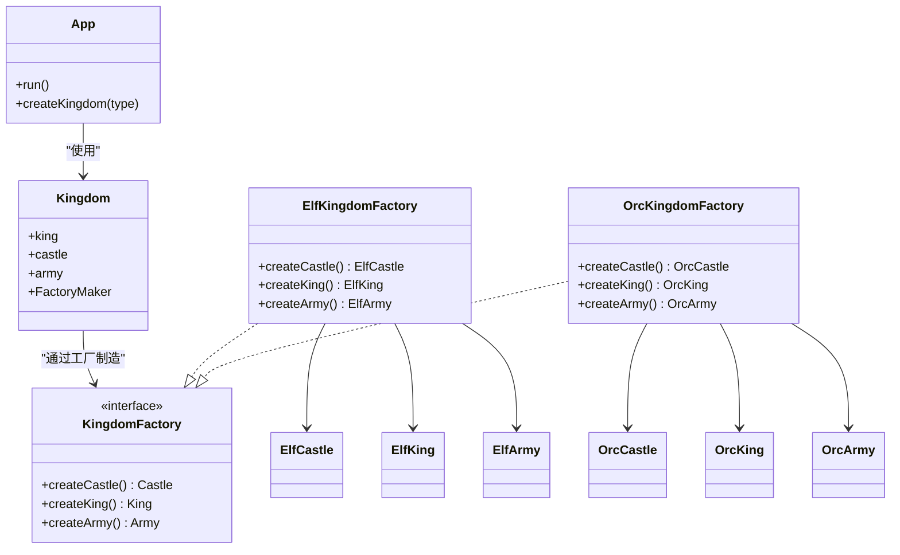
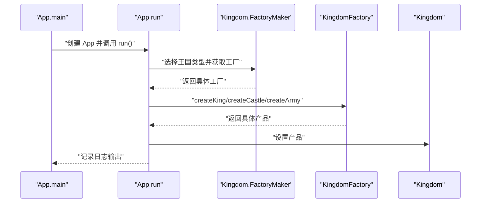
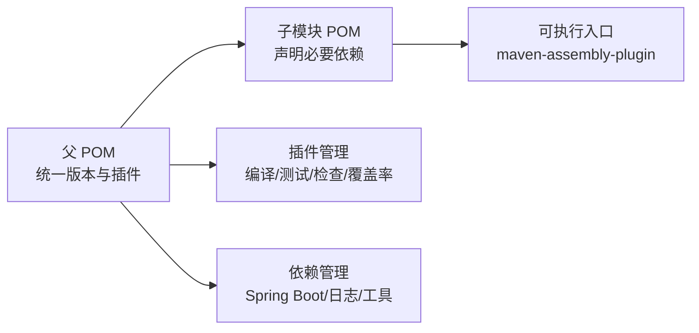

# 快速开始

<cite>
**本文引用的文件**
- [README.md](file://README.md)
- [pom.xml](file://pom.xml)
- [mvnw](file://mvnw)
- [mvnw.cmd](file://mvnw.cmd)
- [.mvn/wrapper/maven-wrapper.properties](file://.mvn/wrapper/maven-wrapper.properties)
- [abstract-factory/README.md](file://abstract-factory/README.md)
- [abstract-factory/pom.xml](file://abstract-factory/pom.xml)
- [abstract-factory/src/main/java/com/iluwatar/abstractfactory/App.java](file://abstract-factory/src/main/java/com/iluwatar/abstractfactory/App.java)
- [abstract-factory/src/main/java/com/iluwatar/abstractfactory/Kingdom.java](file://abstract-factory/src/main/java/com/iluwatar/abstractfactory/Kingdom.java)
- [abstract-factory/src/main/java/com/iluwatar/abstractfactory/KingdomFactory.java](file://abstract-factory/src/main/java/com/iluwatar/abstractfactory/KingdomFactory.java)
- [abstract-factory/src/main/java/com/iluwatar/abstractfactory/ElfKingdomFactory.java](file://abstract-factory/src/main/java/com/iluwatar/abstractfactory/ElfKingdomFactory.java)
- [abstract-factory/src/main/java/com/iluwatar/abstractfactory/OrcKingdomFactory.java](file://abstract-factory/src/main/java/com/iluwatar/abstractfactory/OrcKingdomFactory.java)
</cite>

## 目录
1. [简介](#简介)
2. [项目结构](#项目结构)
3. [核心组件](#核心组件)
4. [架构总览](#架构总览)
5. [详细组件分析](#详细组件分析)
6. [依赖分析](#依赖分析)
7. [性能考虑](#性能考虑)
8. [故障排除指南](#故障排除指南)
9. [结论](#结论)
10. [附录](#附录)

## 简介
本指南面向初学者与进阶开发者，帮助你在本地快速搭建 Java 设计模式学习环境，完成项目克隆、构建与运行，并通过第一个设计模式示例（抽象工厂）快速上手。你将了解项目的模块化组织方式、Maven 配置要点、JDK 版本要求以及常见问题排查方法。

## 项目结构
该仓库是一个多模块 Maven 聚合工程，每个设计模式以独立模块存在，便于按需学习与运行。根 POM 定义了统一的源码版本、测试框架、插件与依赖管理；各子模块仅声明必要的依赖与打包方式。

```mermaid
graph TB
Root["根工程<br/>聚合所有模式模块"] --> AF["抽象工厂模块<br/>abstract-factory"]
Root --> Builder["建造者模块<br/>builder"]
Root --> Singleton["单例模块<br/>singleton"]
Root --> Adapter["适配器模块<br/>adapter"]
Root --> Bridge["桥接模块<br/>bridge"]
Root --> Composite["组合模块<br/>composite"]
Root --> Decorator["装饰器模块<br/>decorator"]
Root --> Facade["外观模块<br/>facade"]
Root --> Flyweight["享元模块<br/>flyweight"]
Root --> Proxy["代理模块<br/>proxy"]
Root --> Chain["职责链模块<br/>chain-of-responsibility"]
Root --> Command["命令模块<br/>command"]
Root --> Interpreter["解释器模块<br/>interpreter"]
Root --> Iterator["迭代器模块<br/>iterator"]
Root --> Mediator["中介者模块<br/>mediator"]
Root --> Memento["备忘录模块<br/>memento"]
Root --> Observer["观察者模块<br/>observer"]
Root --> State["状态模块<br/>state"]
Root --> Strategy["策略模块<br/>strategy"]
Root --> Template["模板方法模块<br/>template-method"]
Root --> Visitor["访问者模块<br/>visitor"]
Root --> Other["更多模块..."]
```

图表来源
- [pom.xml](file://pom.xml#L60-L219)

章节来源
- [pom.xml](file://pom.xml#L1-L436)

## 核心组件
- 多模块聚合工程：根 POM 统一管理版本、插件与依赖，子模块按需继承父配置。
- 模块化示例：每个设计模式在独立模块中提供示例代码、测试与可执行入口。
- 构建工具：使用 Maven Wrapper（mvnw/mvnw.cmd），自动下载指定版本的 Maven，避免环境差异。
- 日志与注解：统一使用 SLF4J + Logback 输出日志，Lombok 简化样板代码。

章节来源
- [pom.xml](file://pom.xml#L37-L59)
- [pom.xml](file://pom.xml#L285-L434)
- [mvnw](file://mvnw#L1-L317)
- [mvnw.cmd](file://mvnw.cmd#L1-L189)
- [.mvn/wrapper/maven-wrapper.properties](file://.mvn/wrapper/maven-wrapper.properties#L17-L19)

## 架构总览
下图展示了“抽象工厂”示例的类关系与运行流程，体现模式的核心思想：通过工厂接口创建一组相关对象，客户端只依赖抽象接口，从而实现解耦与可替换性。

图表来源
- [abstract-factory/src/main/java/com/iluwatar/abstractfactory/App.java](file://abstract-factory/src/main/java/com/iluwatar/abstractfactory/App.java#L46-L85)
- [abstract-factory/src/main/java/com/iluwatar/abstractfactory/Kingdom.java](file://abstract-factory/src/main/java/com/iluwatar/abstractfactory/Kingdom.java#L35-L63)
- [abstract-factory/src/main/java/com/iluwatar/abstractfactory/KingdomFactory.java](file://abstract-factory/src/main/java/com/iluwatar/abstractfactory/KingdomFactory.java#L30-L38)
- [abstract-factory/src/main/java/com/iluwatar/abstractfactory/ElfKingdomFactory.java](file://abstract-factory/src/main/java/com/iluwatar/abstractfactory/ElfKingdomFactory.java#L30-L47)
- [abstract-factory/src/main/java/com/iluwatar/abstractfactory/OrcKingdomFactory.java](file://abstract-factory/src/main/java/com/iluwatar/abstractfactory/OrcKingdomFactory.java#L30-L46)

## 详细组件分析

### 环境准备与工具设置
- JDK 版本要求
  - 根 POM 中编译插件配置了源码与目标版本为 17，因此请确保本地安装 JDK 17 或更高版本。
- Maven 工具
  - 使用 Maven Wrapper（mvnw/mvnw.cmd）进行构建，无需全局安装 Maven。它会自动下载 .mvn/wrapper/maven-wrapper.properties 中指定的 Maven 版本。
- 开发工具
  - 推荐使用支持 Maven 的 IDE（如 IntelliJ IDEA、Eclipse 或 VS Code），以便直接导入与运行模块。

章节来源
- [pom.xml](file://pom.xml#L290-L295)
- [.mvn/wrapper/maven-wrapper.properties](file://.mvn/wrapper/maven-wrapper.properties#L17-L19)
- [mvnw](file://mvnw#L1-L317)
- [mvnw.cmd](file://mvnw.cmd#L1-L189)

### 克隆、构建与运行
- 克隆仓库
  - 使用 Git 将仓库克隆到本地后，进入项目根目录。
- 构建项目
  - 在 Windows 上使用命令行：mvnw.cmd clean install
  - 在 macOS/Linux 上使用命令行：./mvnw clean install
  - 构建完成后，可在各模块的 target 目录生成可执行的 fat jar（由 maven-assembly-plugin 配置生成）。
- 运行第一个示例：抽象工厂
  - 进入 abstract-factory 模块，执行以下命令运行示例：
    - Windows：mvnw.cmd exec:java -Dexec.mainClass="com.iluwatar.abstractfactory.App"
    - macOS/Linux：./mvnw exec:java -Dexec.mainClass="com.iluwatar.abstractfactory.App"
  - 你也可以直接运行模块生成的 fat jar：
    - java -jar abstract-factory/target/abstract-factory.jar

章节来源
- [abstract-factory/pom.xml](file://abstract-factory/pom.xml#L43-L63)
- [abstract-factory/src/main/java/com/iluwatar/abstractfactory/App.java](file://abstract-factory/src/main/java/com/iluwatar/abstractfactory/App.java#L55-L85)

### 目录结构与模块组织
- 根目录
  - pom.xml：聚合所有设计模式模块，统一版本与插件配置。
  - .mvn/wrapper/maven-wrapper.properties：指定 Maven 分发包与 Wrapper 版本。
  - mvnw / mvnw.cmd：跨平台 Maven Wrapper 启动脚本。
- 子模块（示例）
  - abstract-factory：包含抽象工厂模式的示例代码与入口类。
  - 各模块均遵循标准 Maven 结构：src/main/java、src/test/java、pom.xml、README.md 等。

章节来源
- [pom.xml](file://pom.xml#L60-L219)
- [abstract-factory/pom.xml](file://abstract-factory/pom.xml#L28-L63)

### 第一个设计模式示例：抽象工厂
- 示例说明
  - 该示例演示如何通过工厂接口创建一组相关的对象（例如精灵王国与兽人王国的城堡、国王、军队），客户端仅依赖抽象接口，从而实现解耦与可扩展。
- 关键点
  - 工厂接口定义创建方法。
  - 不同的具体工厂负责创建对应风格的对象。
  - 客户端通过工厂制造器选择具体工厂，再创建产品族。
- 运行输出
  - 控制台会打印两种风格的王国信息，验证对象创建与一致性。

图表来源
- [abstract-factory/src/main/java/com/iluwatar/abstractfactory/App.java](file://abstract-factory/src/main/java/com/iluwatar/abstractfactory/App.java#L60-L85)
- [abstract-factory/src/main/java/com/iluwatar/abstractfactory/Kingdom.java](file://abstract-factory/src/main/java/com/iluwatar/abstractfactory/Kingdom.java#L44-L62)
- [abstract-factory/src/main/java/com/iluwatar/abstractfactory/KingdomFactory.java](file://abstract-factory/src/main/java/com/iluwatar/abstractfactory/KingdomFactory.java#L30-L38)
- [abstract-factory/src/main/java/com/iluwatar/abstractfactory/ElfKingdomFactory.java](file://abstract-factory/src/main/java/com/iluwatar/abstractfactory/ElfKingdomFactory.java#L30-L47)
- [abstract-factory/src/main/java/com/iluwatar/abstractfactory/OrcKingdomFactory.java](file://abstract-factory/src/main/java/com/iluwatar/abstractfactory/OrcKingdomFactory.java#L30-L46)

章节来源
- [abstract-factory/README.md](file://abstract-factory/README.md#L1-L228)
- [abstract-factory/src/main/java/com/iluwatar/abstractfactory/App.java](file://abstract-factory/src/main/java/com/iluwatar/abstractfactory/App.java#L30-L85)
- [abstract-factory/src/main/java/com/iluwatar/abstractfactory/Kingdom.java](file://abstract-factory/src/main/java/com/iluwatar/abstractfactory/Kingdom.java#L30-L63)
- [abstract-factory/src/main/java/com/iluwatar/abstractfactory/KingdomFactory.java](file://abstract-factory/src/main/java/com/iluwatar/abstractfactory/KingdomFactory.java#L27-L38)
- [abstract-factory/src/main/java/com/iluwatar/abstractfactory/ElfKingdomFactory.java](file://abstract-factory/src/main/java/com/iluwatar/abstractfactory/ElfKingdomFactory.java#L27-L47)
- [abstract-factory/src/main/java/com/iluwatar/abstractfactory/OrcKingdomFactory.java](file://abstract-factory/src/main/java/com/iluwatar/abstractfactory/OrcKingdomFactory.java#L27-L46)

## 依赖分析
- 统一依赖管理
  - 根 POM 通过 dependencyManagement 引入 Spring Boot 依赖聚合，统一版本控制；同时声明常用测试与工具依赖（如 JUnit、SLF4J、Logback、Lombok 等）。
- 插件管理
  - 编译插件固定 JDK 17；Surefire 用于测试；Jacoco 用于覆盖率；Checkstyle 用于代码规范；URM 插件自动生成类图等。
- 模块依赖
  - 子模块通常仅引入自身示例所需的最小依赖（如示例模块可能仅引入 JUnit 测试引擎），其余由父 POM 提供。

图表来源
- [pom.xml](file://pom.xml#L226-L284)
- [pom.xml](file://pom.xml#L285-L434)
- [abstract-factory/pom.xml](file://abstract-factory/pom.xml#L36-L42)

章节来源
- [pom.xml](file://pom.xml#L226-L284)
- [pom.xml](file://pom.xml#L285-L434)
- [abstract-factory/pom.xml](file://abstract-factory/pom.xml#L36-L63)

## 性能考虑
- 构建性能
  - 使用 Maven Wrapper 可减少环境差异带来的构建失败，提升团队协作效率。
  - 合理划分模块，避免一次性构建过多模块；按需构建特定示例模块。
- 运行性能
  - 示例模块体积小，运行开销低；生产场景建议结合 Spring Boot 插件进行瘦身与优化（若扩展为应用）。
- 日志与调试
  - 默认使用 SLF4J + Logback，日志级别可按需调整；在本地开发时开启详细日志有助于定位问题。

## 故障排除指南
- 找不到 JAVA_HOME 或 JDK 版本不匹配
  - 确认已安装 JDK 17+，并在系统环境变量中正确配置 JAVA_HOME。
  - 若使用 IDE，请确保项目 SDK 指向 JDK 17。
- Maven 构建失败
  - 清理缓存并重试：mvnw clean install
  - 检查网络是否可访问 Maven 中央仓库；必要时配置代理。
- 执行示例报错
  - 确保已在模块内执行命令（如在 abstract-factory 目录下运行 mvnw exec:java）。
  - 若使用 IDE 运行，确保主类路径正确（示例主类为 com.iluwatar.abstractfactory.App）。
- 权限或路径问题（Windows）
  - 使用管理员权限打开终端；确认路径中无空格或特殊字符。
- 无法找到 maven-wrapper.jar
  - 删除 .mvn/wrapper/maven-wrapper.jar 后重新执行构建，Wrapper 将自动下载所需文件。

章节来源
- [mvnw](file://mvnw#L156-L164)
- [mvnw.cmd](file://mvnw.cmd#L61-L80)
- [mvnw.cmd](file://mvnw.cmd#L131-L154)
- [.mvn/wrapper/maven-wrapper.properties](file://.mvn/wrapper/maven-wrapper.properties#L17-L19)

## 结论
通过本指南，你已经完成了环境准备、项目克隆、构建与运行，并成功运行了第一个设计模式示例。建议从“抽象工厂”开始，逐步探索其他模式模块，结合 README 与源码加深理解。遇到问题时，优先检查 JDK 版本、Maven Wrapper 与模块路径，按需启用详细日志定位问题。

## 附录
- 常用命令速查
  - 构建：mvnw clean install
  - 运行示例：mvnw exec:java -Dexec.mainClass="com.iluwatar.abstractfactory.App"
  - 生成类图：mvnw process-classes（由 URM 插件触发）