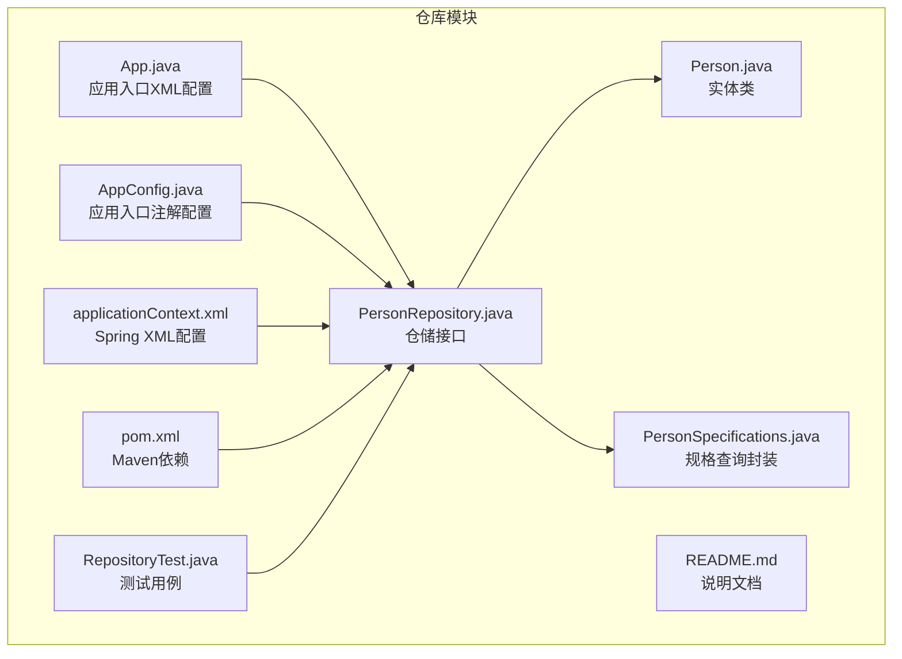
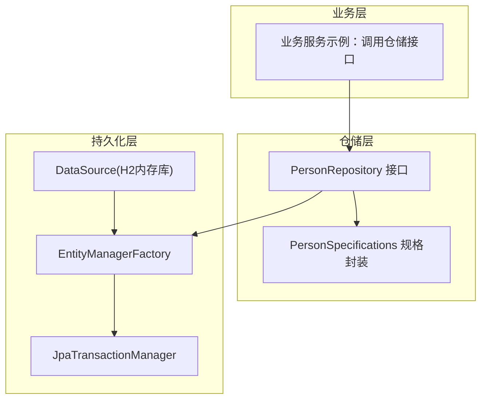
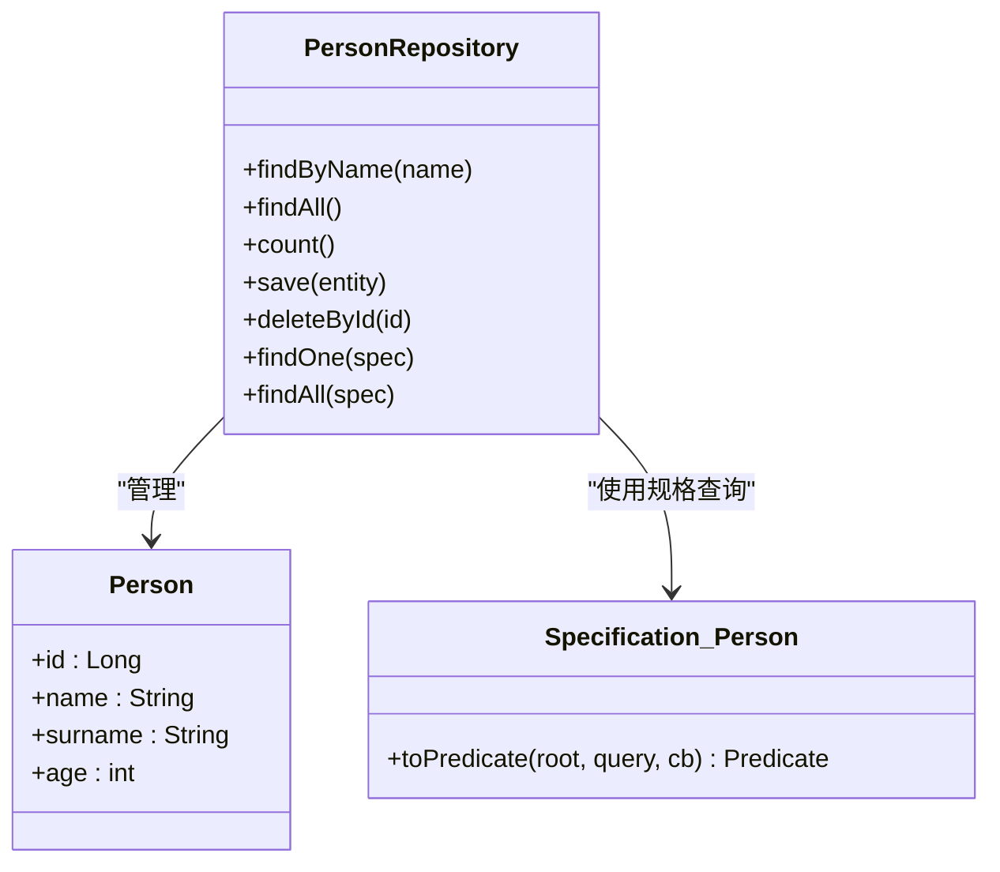
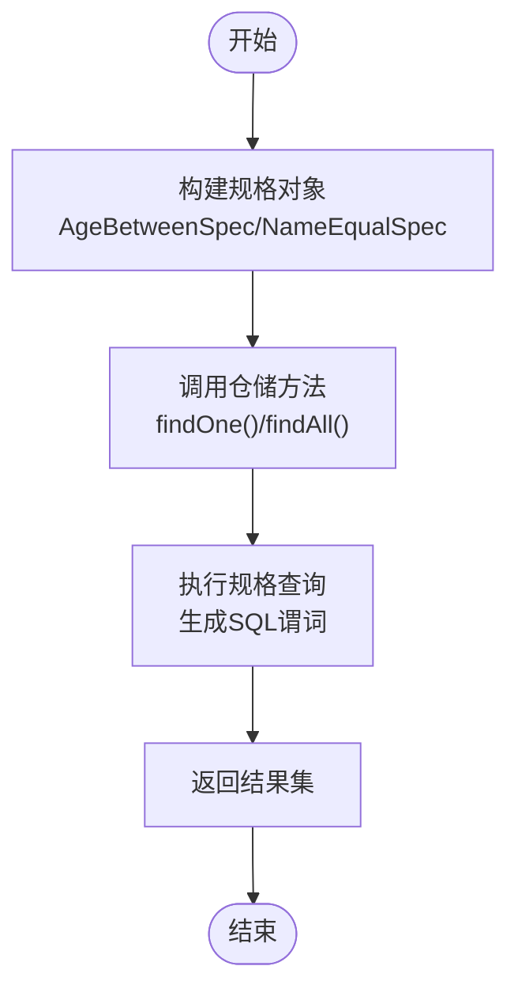
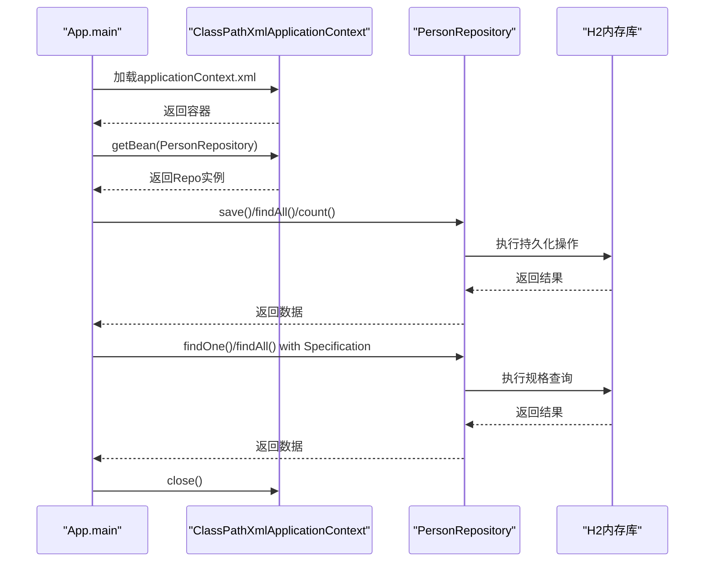
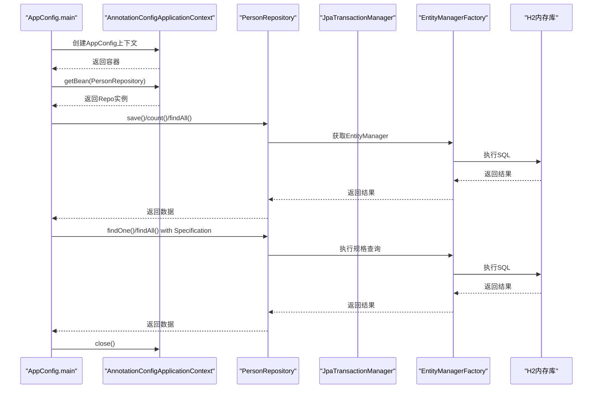
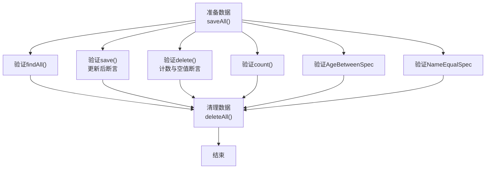
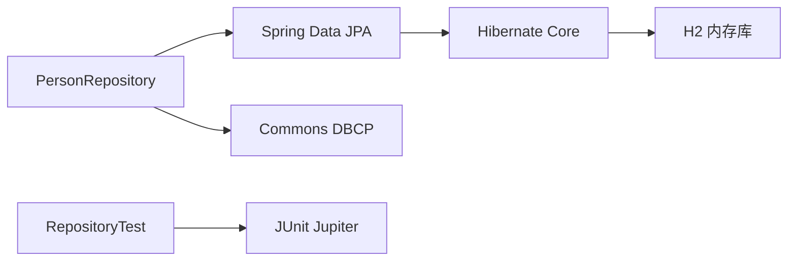

# 仓储模式

<cite>
**本文引用的文件**
- [App.java](file://repository/src/main/java/com/iluwatar/repository/App.java)
- [AppConfig.java](file://repository/src/main/java/com/iluwatar/repository/AppConfig.java)
- [Person.java](file://repository/src/main/java/com/iluwatar/repository/Person.java)
- [PersonRepository.java](file://repository/src/main/java/com/iluwatar/repository/PersonRepository.java)
- [PersonSpecifications.java](file://repository/src/main/java/com/iluwatar/repository/PersonSpecifications.java)
- [applicationContext.xml](file://repository/src/main/resources/applicationContext.xml)
- [pom.xml](file://repository/pom.xml)
- [README.md](file://repository/README.md)
- [RepositoryTest.java](file://repository/src/test/java/com/iluwatar/repository/RepositoryTest.java)
- [App.java](file://data-access-object/src/main/java/com/iluwatar/dao/App.java)
- [Customer.java](file://data-access-object/src/main/java/com/iluwatar/dao/Customer.java)
- [CustomerDao.java](file://data-access-object/src/main/java/com/iluwatar/dao/CustomerDao.java)
- [DbCustomerDao.java](file://data-access-object/src/main/java/com/iluwatar/dao/DbCustomerDao.java)
- [InMemoryCustomerDao.java](file://data-access-object/src/main/java/com/iluwatar/dao/InMemoryCustomerDao.java)
- [README.md](file://data-access-object/README.md)
</cite>

## 目录
1. [引言](#引言)
2. [项目结构](#项目结构)
3. [核心组件](#核心组件)
4. [架构总览](#架构总览)
5. [详细组件分析](#详细组件分析)
6. [依赖分析](#依赖分析)
7. [性能考虑](#性能考虑)
8. [故障排查指南](#故障排查指南)
9. [结论](#结论)
10. [附录](#附录)

## 引言
本指南围绕仓储模式在领域驱动设计中的作用与价值展开，结合仓库模块中的 Spring Data JPA 示例，系统讲解仓储接口设计、规格（Specification）与过滤器（Filter）模式的组合使用，并对仓储模式与传统 DAO 模式的差异进行对比。同时给出扩展性、事务管理与性能优化策略，并讨论与 Spring Data JPA 等 ORM 框架的集成实践。

## 项目结构
仓库模块以 Spring Data JPA 为核心，采用注解配置与 XML 配置两种方式演示仓储的装配与使用；测试模块验证仓储的 CRUD 与规格查询能力；DAO 模块用于与仓储模式进行对比学习。

**图表来源**
- [App.java](file://repository/src/main/java/com/iluwatar/repository/App.java#L48-L106)
- [AppConfig.java](file://repository/src/main/java/com/iluwatar/repository/AppConfig.java#L46-L152)
- [Person.java](file://repository/src/main/java/com/iluwatar/repository/Person.java#L39-L63)
- [PersonRepository.java](file://repository/src/main/java/com/iluwatar/repository/PersonRepository.java#L32-L42)
- [PersonSpecifications.java](file://repository/src/main/java/com/iluwatar/repository/PersonSpecifications.java#L33-L78)
- [applicationContext.xml](file://repository/src/main/resources/applicationContext.xml#L26-L54)
- [pom.xml](file://repository/pom.xml#L52-L86)
- [RepositoryTest.java](file://repository/src/test/java/com/iluwatar/repository/RepositoryTest.java#L44-L118)

**章节来源**
- [README.md](file://repository/README.md#L14-L31)
- [pom.xml](file://repository/pom.xml#L52-L86)

## 核心组件
- 实体类：定义持久化对象的结构与标识字段。
- 仓储接口：继承 Spring Data 的 CrudRepository 与 JpaSpecificationExecutor，提供基础 CRUD 与规格查询能力。
- 规格封装：将查询条件封装为 Specification，支持复用与组合。
- 应用入口：分别通过 XML 与注解方式装配仓储并执行 CRUD 与规格查询。
- 测试用例：覆盖 findAll/save/delete/count/规格查询等场景。

**章节来源**
- [Person.java](file://repository/src/main/java/com/iluwatar/repository/Person.java#L39-L63)
- [PersonRepository.java](file://repository/src/main/java/com/iluwatar/repository/PersonRepository.java#L32-L42)
- [PersonSpecifications.java](file://repository/src/main/java/com/iluwatar/repository/PersonSpecifications.java#L33-L78)
- [App.java](file://repository/src/main/java/com/iluwatar/repository/App.java#L48-L106)
- [AppConfig.java](file://repository/src/main/java/com/iluwatar/repository/AppConfig.java#L46-L152)
- [RepositoryTest.java](file://repository/src/test/java/com/iluwatar/repository/RepositoryTest.java#L44-L118)

## 架构总览
仓储模式在该示例中通过 Spring Data JPA 抽象了底层数据访问逻辑，业务层仅面向仓储接口编程，屏蔽了具体存储实现与 SQL 细节。规格查询通过 Specification 封装，形成可组合的过滤器。

**图表来源**
- [PersonRepository.java](file://repository/src/main/java/com/iluwatar/repository/PersonRepository.java#L32-L42)
- [PersonSpecifications.java](file://repository/src/main/java/com/iluwatar/repository/PersonSpecifications.java#L33-L78)
- [AppConfig.java](file://repository/src/main/java/com/iluwatar/repository/AppConfig.java#L46-L94)
- [applicationContext.xml](file://repository/src/main/resources/applicationContext.xml#L27-L50)

## 详细组件分析

### 仓储接口设计与职责
- 继承关系：通过继承 CrudRepository 提供标准 CRUD 能力；通过继承 JpaSpecificationExecutor 支持规格查询。
- 自定义方法：提供按名称查询的方法签名，便于业务层直接调用。
- 注解：使用 Spring 的 @Repository 标注，纳入容器管理。

**图表来源**
- [PersonRepository.java](file://repository/src/main/java/com/iluwatar/repository/PersonRepository.java#L32-L42)
- [Person.java](file://repository/src/main/java/com/iluwatar/repository/Person.java#L39-L63)
- [PersonSpecifications.java](file://repository/src/main/java/com/iluwatar/repository/PersonSpecifications.java#L33-L78)

**章节来源**
- [PersonRepository.java](file://repository/src/main/java/com/iluwatar/repository/PersonRepository.java#L32-L42)

### 规格查询与过滤器模式
- 年龄区间规格：封装“年龄在某范围”条件，返回 Predicate。
- 名称相等规格：封装“名称等于某值”条件，返回 Predicate。
- 复合使用：业务层通过 findOne/findAll 传入规格对象，实现灵活过滤。

**图表来源**
- [PersonSpecifications.java](file://repository/src/main/java/com/iluwatar/repository/PersonSpecifications.java#L38-L76)
- [App.java](file://repository/src/main/java/com/iluwatar/repository/App.java#L90-L99)
- [AppConfig.java](file://repository/src/main/java/com/iluwatar/repository/AppConfig.java#L136-L145)

**章节来源**
- [PersonSpecifications.java](file://repository/src/main/java/com/iluwatar/repository/PersonSpecifications.java#L33-L78)
- [App.java](file://repository/src/main/java/com/iluwatar/repository/App.java#L90-L99)
- [AppConfig.java](file://repository/src/main/java/com/iluwatar/repository/AppConfig.java#L136-L145)

### 应用入口与控制流（XML 配置）
- 使用 ClassPathXmlApplicationContext 加载 XML 配置。
- 获取 PersonRepository Bean，执行保存、查询、更新、删除与规格查询。
- 关闭上下文释放资源。

**图表来源**
- [App.java](file://repository/src/main/java/com/iluwatar/repository/App.java#L54-L105)
- [applicationContext.xml](file://repository/src/main/resources/applicationContext.xml#L26-L54)

**章节来源**
- [App.java](file://repository/src/main/java/com/iluwatar/repository/App.java#L48-L106)
- [applicationContext.xml](file://repository/src/main/resources/applicationContext.xml#L26-L54)

### 应用入口与控制流（注解配置）
- 使用 AppConfig 作为 Spring Boot 配置类，启用 JPA 仓库扫描。
- 定义 DataSource、EntityManagerFactory、JpaTransactionManager Bean。
- 通过 AnnotationConfigApplicationContext 启动，获取仓储并执行 CRUD 与规格查询。

**图表来源**
- [AppConfig.java](file://repository/src/main/java/com/iluwatar/repository/AppConfig.java#L101-L149)
- [AppConfig.java](file://repository/src/main/java/com/iluwatar/repository/AppConfig.java#L46-L94)

**章节来源**
- [AppConfig.java](file://repository/src/main/java/com/iluwatar/repository/AppConfig.java#L46-L152)

### 测试用例与行为验证
- 准备阶段：批量保存测试数据。
- 行为验证：findAll、save、delete、count、按规格查询（年龄区间、名称相等）。
- 清理阶段：删除所有记录。

**图表来源**
- [RepositoryTest.java](file://repository/src/test/java/com/iluwatar/repository/RepositoryTest.java#L58-L116)

**章节来源**
- [RepositoryTest.java](file://repository/src/test/java/com/iluwatar/repository/RepositoryTest.java#L44-L118)

### 仓储模式与 DAO 模式的区别与优势
- DAO 模式：强调对底层数据源的抽象，通常手写 SQL 或使用 JDBC，适合简单场景或对 SQL 控制要求高的场景。
- 仓储模式：在领域驱动设计中强调“面向集合”的接口，隐藏数据访问细节，提供更高层次的抽象，便于测试与替换实现。
- 本仓库示例：通过 Spring Data JPA 的仓储接口与规格查询，体现仓储模式的简洁性与可组合性。

**章节来源**
- [README.md](file://repository/README.md#L14-L31)
- [README.md](file://data-access-object/README.md#L13-L37)

## 依赖分析
- Spring Data JPA：提供仓储抽象与规格查询能力。
- Hibernate：JPA 提供者，负责实体映射与 SQL 生成。
- Commons DBCP/H2：数据源与内存数据库，用于示例运行。
- JUnit：单元测试框架，验证仓储行为。

**图表来源**
- [pom.xml](file://repository/pom.xml#L52-L86)

**章节来源**
- [pom.xml](file://repository/pom.xml#L52-L86)

## 性能考虑
- 查询优化
  - 使用规格查询替代字符串拼接，减少 SQL 错误与重复代码。
  - 对高频查询建立索引（如 name、age），提升查询效率。
- 分页与投影
  - 对大数据量采用分页查询，避免一次性加载过多数据。
  - 使用 DTO 投影，仅传输必要字段，降低网络与序列化开销。
- 缓存策略
  - 结合二级缓存（如 Hibernate EHCache）缓存热点实体。
  - 对只读查询使用查询缓存，减少数据库压力。
- 事务与批处理
  - 合理划分事务边界，避免长事务占用连接。
  - 对批量插入/更新使用 JDBC 批处理或 JPA 批量刷新策略。
- 连接池与数据库
  - 调整连接池大小与超时参数，匹配应用并发与数据库承载能力。
  - 使用只读副本或读写分离，缓解主库压力。

## 故障排查指南
- 常见问题
  - 无法找到仓储 Bean：检查 XML 中的 jpa:repositories 或注解配置是否正确启用。
  - 规格查询无结果：确认规格对象的属性名与实体字段一致，且查询条件合理。
  - 事务未生效：确认已注入 JpaTransactionManager 并在业务方法上标注事务注解。
- 日志与监控
  - 开启 Hibernate SQL 日志，定位慢查询与异常 SQL。
  - 使用 APM 工具监控仓储层耗时与错误率。
- 单元测试辅助
  - 使用内存数据库或嵌入式 H2，确保测试隔离与可重复性。
  - 通过 @DataJpaTest 或 @AutoConfigureTestDatabase 配置测试环境。

**章节来源**
- [applicationContext.xml](file://repository/src/main/resources/applicationContext.xml#L27-L50)
- [AppConfig.java](file://repository/src/main/java/com/iluwatar/repository/AppConfig.java#L89-L94)
- [RepositoryTest.java](file://repository/src/test/java/com/iluwatar/repository/RepositoryTest.java#L44-L46)

## 结论
仓储模式通过 Spring Data JPA 在本仓库中得到清晰体现：以面向集合的接口屏蔽数据访问细节，借助规格查询实现灵活过滤，配合事务与测试工具链，既保证了可维护性，又提升了开发效率。与 DAO 模式相比，仓储模式更契合领域驱动设计思想，便于测试与演进。

## 附录

### 与 DAO 模式的对比要点
- DAO 更贴近数据源访问，适合简单场景与强 SQL 控制需求。
- 仓储强调领域抽象与可测试性，适合复杂领域模型与多数据源场景。
- 本仓库通过 Spring Data JPA 的仓储接口与规格查询，展示了仓储模式在现代 Java 生态中的最佳实践。

**章节来源**
- [README.md](file://data-access-object/README.md#L13-L37)
- [README.md](file://repository/README.md#L197-L209)