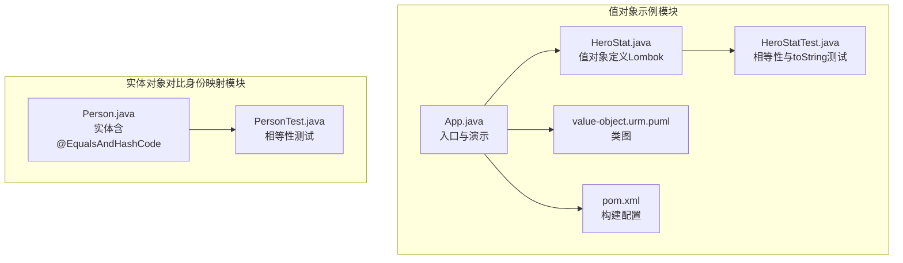
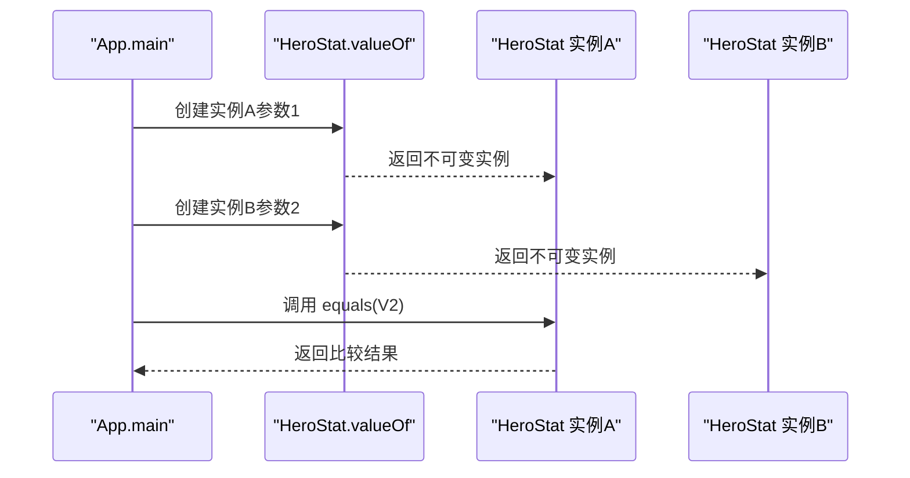
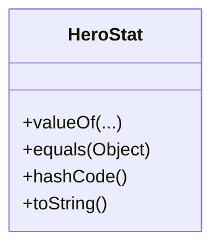
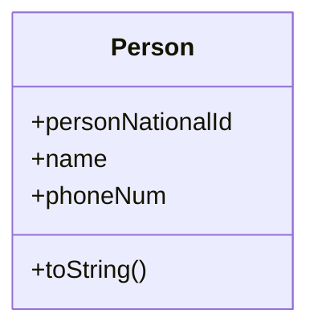
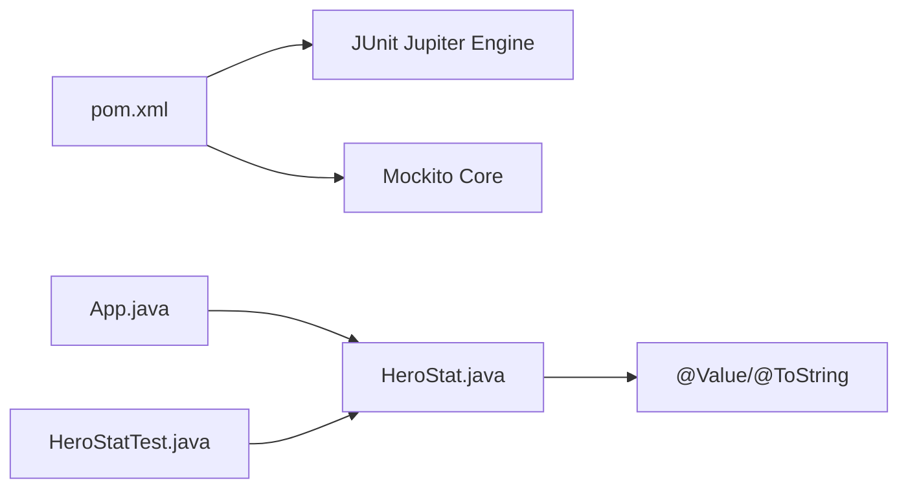

# 值对象模式

<cite>
**本文引用的文件**
- [README.md](file://value-object/README.md)
- [HeroStat.java](file://value-object/src/main/java/com/iluwatar/value/object/HeroStat.java)
- [App.java](file://value-object/src/main/java/com/iluwatar/value/object/App.java)
- [HeroStatTest.java](file://value-object/src/test/java/com/iluwatar/value/object/HeroStatTest.java)
- [value-object.urm.puml](file://value-object/etc/value-object.urm.puml)
- [pom.xml](file://value-object/pom.xml)
- [Person.java](file://identity-map/src/main/java/com/iluwatar/identitymap/Person.java)
- [PersonTest.java](file://identity-map/src/test/java/com/iluwatar/identitymap/PersonTest.java)
</cite>

## 目录
1. [引言](#引言)
2. [项目结构](#项目结构)
3. [核心组件](#核心组件)
4. [架构总览](#架构总览)
5. [详细组件分析](#详细组件分析)
6. [依赖关系分析](#依赖关系分析)
7. [性能考量](#性能考量)
8. [故障排查指南](#故障排查指南)
9. [结论](#结论)
10. [附录](#附录)

## 引言
本设计文档围绕值对象模式展开，系统阐述其不可变性设计原则、equals/hashCode 的正确实现方式、构造与验证策略、转换方法、在领域建模中的作用与适用场景，并通过仓库中已有的 HeroStat 值对象与 Person 实体进行对比分析，帮助读者在实践中正确运用值对象以提升代码的可维护性、线程安全性和性能表现。

## 项目结构
该仓库包含一个独立的“值对象”示例模块，演示如何使用 Lombok 注解声明不可变值对象，并通过单元测试验证相等性与字符串表示的一致性；同时，仓库中的“身份映射”模块提供了 Person 实体作为对比参考，便于理解值对象与实体对象的区别。

图表来源
- [App.java](file://value-object/src/main/java/com/iluwatar/value/object/App.java#L44-L61)
- [HeroStat.java](file://value-object/src/main/java/com/iluwatar/value/object/HeroStat.java#L37-L44)
- [HeroStatTest.java](file://value-object/src/test/java/com/iluwatar/value/object/HeroStatTest.java#L35-L62)
- [value-object.urm.puml](file://value-object/etc/value-object.urm.puml#L1-L22)
- [pom.xml](file://value-object/pom.xml#L28-L67)
- [Person.java](file://identity-map/src/main/java/com/iluwatar/identitymap/Person.java#L37-L58)
- [PersonTest.java](file://identity-map/src/test/java/com/iluwatar/identitymap/PersonTest.java#L30-L42)

章节来源
- [README.md](file://value-object/README.md#L1-L145)
- [pom.xml](file://value-object/pom.xml#L28-L67)

## 核心组件
- 值对象：HeroStat（使用 Lombok 的 @Value 与静态工厂 valueOf）
- 演示入口：App（创建多个值对象并比较相等性）
- 测试：HeroStatTest（验证相等性与 toString 一致性）
- 类图：value-object.urm.puml（展示类与成员关系）

章节来源
- [HeroStat.java](file://value-object/src/main/java/com/iluwatar/value/object/HeroStat.java#L37-L44)
- [App.java](file://value-object/src/main/java/com/iluwatar/value/object/App.java#L49-L60)
- [HeroStatTest.java](file://value-object/src/test/java/com/iluwatar/value/object/HeroStatTest.java#L44-L62)
- [value-object.urm.puml](file://value-object/etc/value-object.urm.puml#L8-L20)

## 架构总览
值对象模式在本示例中的运行流程如下：App 作为入口负责调用值对象的静态工厂方法创建实例，随后通过 equals 比较两个值对象是否相等，体现了“基于值而非标识”的相等语义。

图表来源
- [App.java](file://value-object/src/main/java/com/iluwatar/value/object/App.java#L49-L60)
- [HeroStat.java](file://value-object/src/main/java/com/iluwatar/value/object/HeroStat.java#L37-L44)

## 详细组件分析

### 值对象：HeroStat
- 不可变性：通过 Lombok 的 @Value 注解生成 final 字段与只读访问器，禁止外部修改状态。
- 静态工厂：使用 @Value(staticConstructor = "valueOf") 提供统一的构造入口，便于后续扩展与校验。
- 相等性与哈希：由 Lombok 自动生成 equals/hashCode，遵循“值相等即相等”的原则。
- 字符串表示：@ToString 提供清晰的调试输出。
- 使用场景：角色属性（力量、智力、运气）组合，强调整体值的相等性而非对象身份。

图表来源
- [HeroStat.java](file://value-object/src/main/java/com/iluwatar/value/object/HeroStat.java#L37-L44)
- [value-object.urm.puml](file://value-object/etc/value-object.urm.puml#L8-L20)

章节来源
- [HeroStat.java](file://value-object/src/main/java/com/iluwatar/value/object/HeroStat.java#L37-L44)
- [README.md](file://value-object/README.md#L46-L87)

### 演示入口：App
- 职责：创建多个值对象实例，打印其字符串表示，并比较相等性。
- 关键点：强调值对象的相等性基于属性值，而非内存地址。

章节来源
- [App.java](file://value-object/src/main/java/com/iluwatar/value/object/App.java#L49-L60)

### 单元测试：HeroStatTest
- 相等性测试：使用断言确保相同参数创建的值对象相等。
- toString 一致性：相等值的字符串表示应一致，不同值应不同。
- 测试工具：使用 JUnit 断言框架。

章节来源
- [HeroStatTest.java](file://value-object/src/test/java/com/iluwatar/value/object/HeroStatTest.java#L44-L62)

### 值对象与实体对象的对比：Person
- Person 是实体对象，具有标识（nationalId），相等性基于标识而非属性集合。
- 在 PersonTest 中，通过构造不同 nationalId 的实例来验证相等性规则。
- Person 使用 @EqualsAndHashCode(onlyExplicitlyIncluded = true) 与 @EqualsAndHashCode.Include 显式声明参与相等性的字段。

图表来源
- [Person.java](file://identity-map/src/main/java/com/iluwatar/identitymap/Person.java#L37-L58)

章节来源
- [Person.java](file://identity-map/src/main/java/com/iluwatar/identitymap/Person.java#L37-L58)
- [PersonTest.java](file://identity-map/src/test/java/com/iluwatar/identitymap/PersonTest.java#L32-L42)

### 值对象的构造函数设计、验证与转换
- 构造函数设计：推荐使用静态工厂（valueOf）替代直接构造，便于集中校验与缓存策略。
- 验证逻辑：在静态工厂内对输入参数进行合法性检查，失败时抛出异常，避免创建不合法的值对象。
- 转换方法：提供从其他表示形式（如字符串、DTO）解析为值对象的方法，保持不可变性与幂等性。

说明：以上为通用设计建议，具体实现需根据业务约束补充。

### 值对象在领域建模中的作用与场景
- 领域建模：用于表达无标识的概念实体（如日期、金额、坐标、颜色等），强调“值”的语义。
- 性能与并发：不可变性天然线程安全，减少锁竞争与拷贝成本。
- 可维护性：职责单一、行为纯函数化，易于测试与推理。

章节来源
- [README.md](file://value-object/README.md#L26-L100)

### 值对象与实体对象的区别
- 相等性：值对象按值相等；实体按标识相等。
- 可变性：值对象不可变；实体可变。
- 生命周期：值对象短生命周期、可共享；实体有明确生命周期与状态变更。
- 典型代表：java.time.LocalDate、java.util.Optional 等为值对象；Person、Order 等为实体。

章节来源
- [README.md](file://value-object/README.md#L42-L100)
- [Person.java](file://identity-map/src/main/java/com/iluwatar/identitymap/Person.java#L37-L58)

### 函数式编程中的值对象
- 不可变性契合函数式范式，适合在纯函数之间传递与组合。
- 可与 Optional、Stream 等函数式类型协同，提升表达力与安全性。

章节来源
- [README.md](file://value-object/README.md#L105-L111)

### 与 Lombok 注解的结合使用
- @Value：自动生成不可变类、equals/hashCode、toString、构造器等。
- @ToString：定制字符串表示。
- @EqualsAndHashCode：控制参与相等性的字段集合。
- 注意：@Value 默认生成的 equals/hashCode 已覆盖大多数场景；若需要特定字段参与相等性，可配合 @EqualsAndHashCode.Include 使用。

章节来源
- [HeroStat.java](file://value-object/src/main/java/com/iluwatar/value/object/HeroStat.java#L27-L44)
- [Person.java](file://identity-map/src/main/java/com/iluwatar/identitymap/Person.java#L37-L58)

### 分布式系统中的序列化与传输
- 序列化：值对象通常轻量且不可变，适合在网络间传输；建议实现 Serializable 并保持字段不可变。
- 版本兼容：字段增删需谨慎，避免破坏 equals/hashCode 的稳定性。
- 缓存与共享：在分布式缓存中可安全共享值对象实例，降低内存占用。

章节来源
- [Person.java](file://identity-map/src/main/java/com/iluwatar/identitymap/Person.java#L41-L44)

## 依赖关系分析
- 值对象模块依赖 JUnit 与 Mockito 进行测试；构建插件用于打包可执行 JAR。
- HeroStat 依赖 Lombok 注解生成运行时代码。
- Person 位于 identity-map 模块，与值对象模块相互对照，体现实体与值对象的差异。

图表来源
- [pom.xml](file://value-object/pom.xml#L36-L47)
- [HeroStat.java](file://value-object/src/main/java/com/iluwatar/value/object/HeroStat.java#L27-L44)
- [App.java](file://value-object/src/main/java/com/iluwatar/value/object/App.java#L49-L60)
- [HeroStatTest.java](file://value-object/src/test/java/com/iluwatar/value/object/HeroStatTest.java#L44-L62)

章节来源
- [pom.xml](file://value-object/pom.xml#L36-L47)

## 性能考量
- 内存效率：值对象不可变，可减少拷贝与深浅复制的成本；在高频使用场景下可降低缓存碎片。
- 线程安全：不可变性天然线程安全，避免同步开销。
- 相等性成本：equals/hashCode 的计算应尽量高效；对于复杂值对象，可采用延迟计算或缓存策略（需谨慎处理不可变性）。
- 对象创建：频繁创建新实例可能带来 GC 压力；可通过对象池或享元模式优化（需权衡复杂度与收益）。

章节来源
- [README.md](file://value-object/README.md#L115-L128)

## 故障排查指南
- 相等性不符合预期
  - 检查是否使用了正确的相等性判断（应使用 equals 而非 ==）。
  - 若使用 Lombok，请确认字段均参与 equals/hashCode（必要时显式标注）。
- toString 输出不一致
  - 确保相等值的字符串表示一致；若涉及格式化，应在 toString 中统一处理。
- 测试失败
  - 使用 JUnit 断言验证相等性与 toString 行为；参考现有测试用例。

章节来源
- [App.java](file://value-object/src/main/java/com/iluwatar/value/object/App.java#L58-L59)
- [HeroStatTest.java](file://value-object/src/test/java/com/iluwatar/value/object/HeroStatTest.java#L44-L62)

## 结论
值对象模式通过不可变性与基于值的相等语义，显著提升了系统的可维护性与并发安全性。在本仓库示例中，HeroStat 展示了使用 Lombok 快速实现值对象的最佳实践；而 Person 则提供了实体对象的对比视角。在实际项目中，应根据领域语义选择合适的对象模型，并在构造、验证与转换环节严格遵循不可变原则，以获得更好的性能与可靠性。

## 附录
- 相关资源与参考
  - 值对象概念与实践参考：Effective Java、领域驱动设计、ValueObject 文章。
  - 示例参考：java.util.Optional、java.time.LocalDate、java.awt.Color 等。

章节来源
- [README.md](file://value-object/README.md#L138-L145)