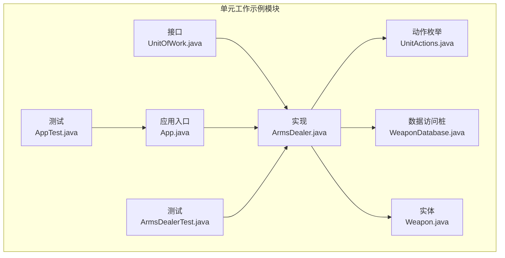
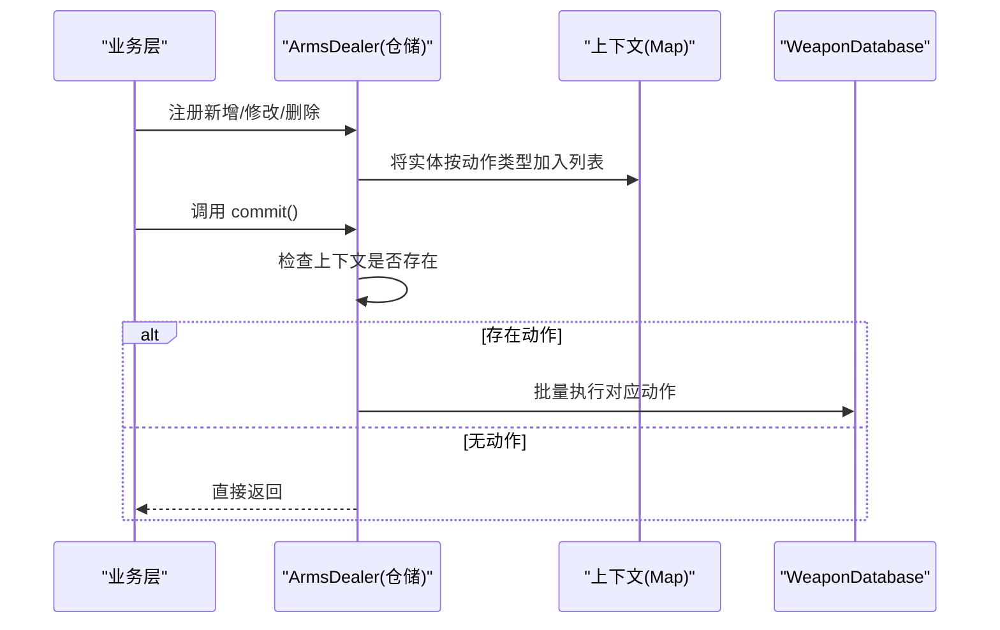
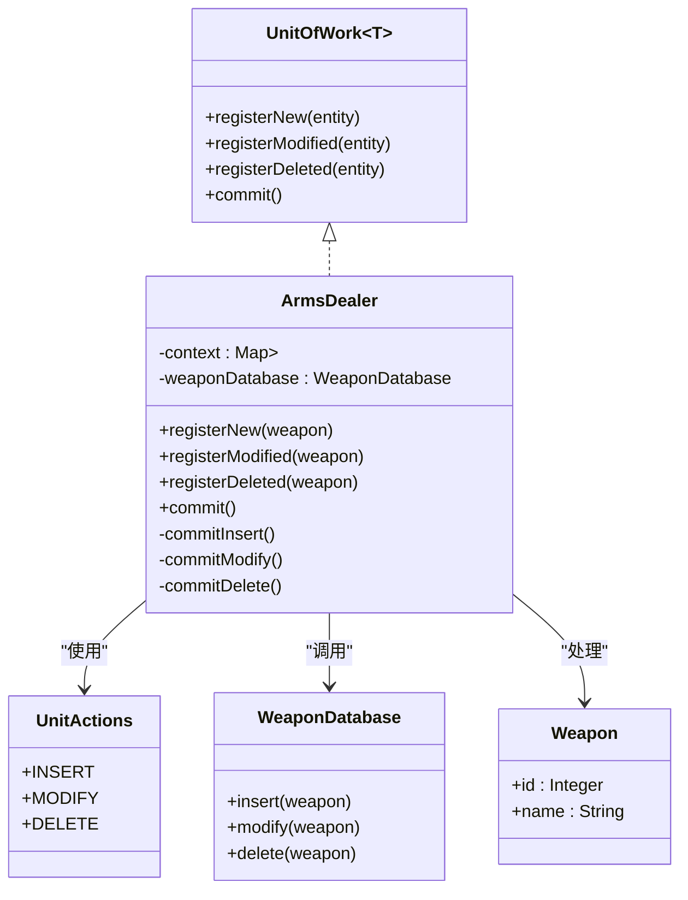
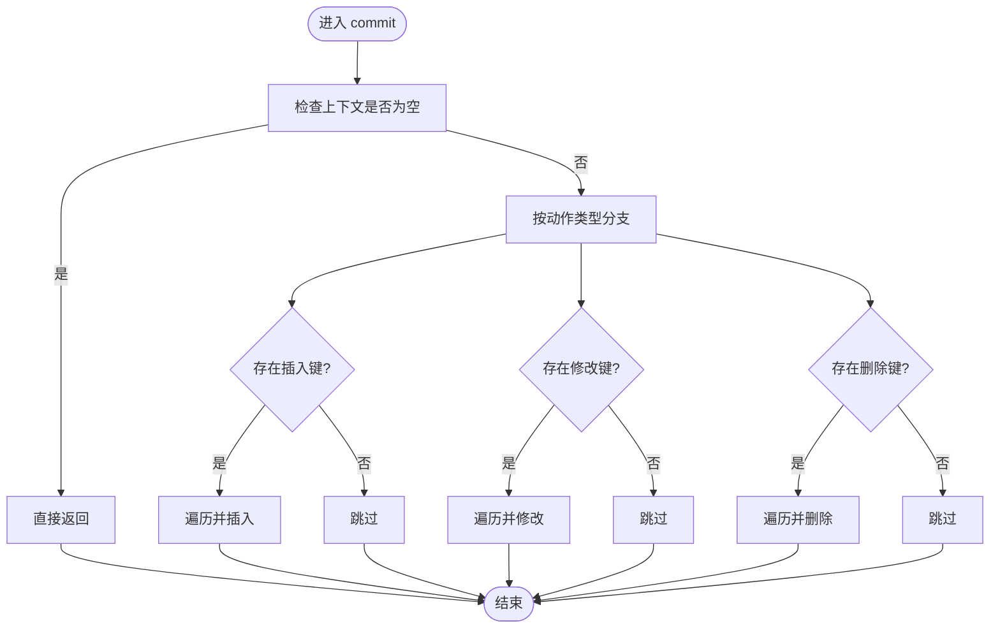
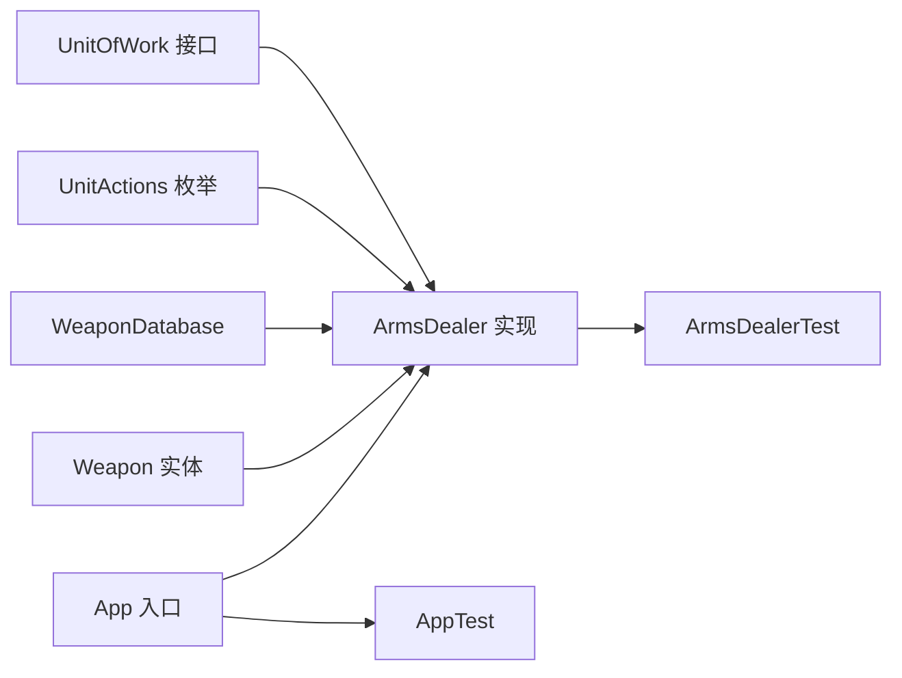

# 单元工作模式

<cite>
**本文引用的文件**   
- [UnitOfWork.java](file://unit-of-work/src/main/java/com/iluwatar/unitofwork/UnitOfWork.java)
- [ArmsDealer.java](file://unit-of-work/src/main/java/com/iluwatar/unitofwork/ArmsDealer.java)
- [Weapon.java](file://unit-of-work/src/main/java/com/iluwatar/unitofwork/Weapon.java)
- [WeaponDatabase.java](file://unit-of-work/src/main/java/com/iluwatar/unitofwork/WeaponDatabase.java)
- [UnitActions.java](file://unit-of-work/src/main/java/com/iluwatar/unitofwork/UnitActions.java)
- [App.java](file://unit-of-work/src/main/java/com/iluwatar/unitofwork/App.java)
- [AppTest.java](file://unit-of-work/src/test/java/com/iluwatar/unitofwork/AppTest.java)
- [ArmsDealerTest.java](file://unit-of-work/src/test/java/com/iluwatar/unitofwork/ArmsDealerTest.java)
- [README.md](file://unit-of-work/README.md)
- [pom.xml](file://unit-of-work/pom.xml)
- [Dirty Flag 模式说明](file://dirty-flag/README.md)
- [Repository 模式说明](file://repository/README.md)
- [Identity Map 模式说明](file://identity-map/README.md)
</cite>

## 目录
1. [简介](#简介)
2. [项目结构](#项目结构)
3. [核心组件](#核心组件)
4. [架构总览](#架构总览)
5. [组件详解](#组件详解)
6. [依赖关系分析](#依赖关系分析)
7. [性能考量](#性能考量)
8. [故障排查指南](#故障排查指南)
9. [结论](#结论)
10. [附录：与主流ORM及微服务集成方案](#附录与主流orm及微服务集成方案)

## 简介
本指南围绕单元工作（Unit of Work, UoW）模式在事务管理中的核心作用展开，结合仓库模块提供的示例，系统讲解如何通过UoW协调多个仓储操作、批量提交以保证一致性，并讨论脏检查、变更跟踪与延迟提交的实现原理。同时给出与JPA/Hibernate、MyBatis等ORM框架的集成建议，以及分布式事务、回滚策略与并发控制的最佳实践，并分析该模式在微服务架构中的应用场景。

## 项目结构
unit-of-work 示例模块包含以下关键文件：
- 接口与实现：UnitOfWork、ArmsDealer（仓储）
- 实体与数据访问：Weapon、WeaponDatabase
- 枚举：UnitActions（INSERT/MODIFY/DELETE）
- 应用入口与测试：App、AppTest、ArmsDealerTest
- 文档与构建：README.md、pom.xml

**图表来源**
- [UnitOfWork.java](file://unit-of-work/src/main/java/com/iluwatar/unitofwork/UnitOfWork.java#L32-L54)
- [ArmsDealer.java](file://unit-of-work/src/main/java/com/iluwatar/unitofwork/ArmsDealer.java#L38-L117)
- [Weapon.java](file://unit-of-work/src/main/java/com/iluwatar/unitofwork/Weapon.java#L30-L40)
- [WeaponDatabase.java](file://unit-of-work/src/main/java/com/iluwatar/unitofwork/WeaponDatabase.java#L27-L44)
- [UnitActions.java](file://unit-of-work/src/main/java/com/iluwatar/unitofwork/UnitActions.java#L30-L42)
- [App.java](file://unit-of-work/src/main/java/com/iluwatar/unitofwork/App.java#L30-L57)
- [AppTest.java](file://unit-of-work/src/test/java/com/iluwatar/unitofwork/AppTest.java#L31-L41)
- [ArmsDealerTest.java](file://unit-of-work/src/test/java/com/iluwatar/unitofwork/ArmsDealerTest.java#L34-L139)

**章节来源**
- [pom.xml](file://unit-of-work/pom.xml#L28-L68)

## 核心组件
- UoW接口：定义注册新增/修改/删除与提交方法，强调“仅在提交时执行”。
- 仓储实现：ArmsDealer 实现 UoW 接口，维护上下文映射（按操作类型分组），在 commit 时批量执行。
- 实体与数据访问：Weapon 表示持久化实体；WeaponDatabase 为数据库访问桩（模拟插入/更新/删除）。
- 动作枚举：UnitActions 统一动作标识，便于上下文键值与分支逻辑复用。
- 应用入口：演示如何注册多条操作并在最后统一提交。

**章节来源**
- [UnitOfWork.java](file://unit-of-work/src/main/java/com/iluwatar/unitofwork/UnitOfWork.java#L32-L54)
- [ArmsDealer.java](file://unit-of-work/src/main/java/com/iluwatar/unitofwork/ArmsDealer.java#L38-L117)
- [Weapon.java](file://unit-of-work/src/main/java/com/iluwatar/unitofwork/Weapon.java#L30-L40)
- [WeaponDatabase.java](file://unit-of-work/src/main/java/com/iluwatar/unitofwork/WeaponDatabase.java#L27-L44)
- [UnitActions.java](file://unit-of-work/src/main/java/com/iluwatar/unitofwork/UnitActions.java#L30-L42)
- [App.java](file://unit-of-work/src/main/java/com/iluwatar/unitofwork/App.java#L30-L57)

## 架构总览
UoW 在本示例中扮演“事务协调者”的角色：业务层通过仓储注册若干对象的新增/修改/删除，仓储将这些变更暂存在上下文中；当调用 commit 时，仓储根据上下文内容批量执行对应数据库操作，从而实现“延迟提交、批量写入”。

**图表来源**
- [ArmsDealer.java](file://unit-of-work/src/main/java/com/iluwatar/unitofwork/ArmsDealer.java#L74-L91)
- [UnitActions.java](file://unit-of-work/src/main/java/com/iluwatar/unitofwork/UnitActions.java#L35-L41)
- [WeaponDatabase.java](file://unit-of-work/src/main/java/com/iluwatar/unitofwork/WeaponDatabase.java#L30-L44)

## 组件详解

### UoW 接口与仓储实现
- UoW 接口定义了三类注册方法与一个提交方法，强调“登记即不立即写库，统一在提交时执行”，这是UoW的核心契约。
- ArmsDealer 实现 UoW，内部持有上下文映射（按动作类型分组）与数据库访问对象。注册方法仅将实体加入对应列表；commit 时按需执行插入/修改/删除。
- 该实现未内置自动脏检查与变更跟踪，但可通过扩展引入（见后文“脏检查与变更跟踪”）。

**图表来源**
- [UnitOfWork.java](file://unit-of-work/src/main/java/com/iluwatar/unitofwork/UnitOfWork.java#L32-L54)
- [ArmsDealer.java](file://unit-of-work/src/main/java/com/iluwatar/unitofwork/ArmsDealer.java#L38-L117)
- [UnitActions.java](file://unit-of-work/src/main/java/com/iluwatar/unitofwork/UnitActions.java#L35-L41)
- [Weapon.java](file://unit-of-work/src/main/java/com/iluwatar/unitofwork/Weapon.java#L30-L40)
- [WeaponDatabase.java](file://unit-of-work/src/main/java/com/iluwatar/unitofwork/WeaponDatabase.java#L30-L44)

**章节来源**
- [UnitOfWork.java](file://unit-of-work/src/main/java/com/iluwatar/unitofwork/UnitOfWork.java#L32-L54)
- [ArmsDealer.java](file://unit-of-work/src/main/java/com/iluwatar/unitofwork/ArmsDealer.java#L38-L117)

### 提交流程与分支逻辑
- commit 前先判断上下文是否为空，避免空提交。
- 若存在某类动作键，则依次执行对应私有方法进行批量处理。
- 各分支内对集合逐一调用数据库访问对象的对应方法。

**图表来源**
- [ArmsDealer.java](file://unit-of-work/src/main/java/com/iluwatar/unitofwork/ArmsDealer.java#L74-L91)

**章节来源**
- [ArmsDealer.java](file://unit-of-work/src/main/java/com/iluwatar/unitofwork/ArmsDealer.java#L74-L91)

### 实体与数据访问
- Weapon 是不可变实体，包含标识与名称字段。
- WeaponDatabase 为数据库访问桩，提供插入/修改/删除方法，实际项目中可替换为具体ORM或JDBC实现。

**章节来源**
- [Weapon.java](file://unit-of-work/src/main/java/com/iluwatar/unitofwork/Weapon.java#L30-L40)
- [WeaponDatabase.java](file://unit-of-work/src/main/java/com/iluwatar/unitofwork/WeaponDatabase.java#L30-L44)

### 应用入口与测试
- App 展示了如何创建实体、构造仓储、注册多种操作并最终提交。
- 测试覆盖了：
  - 注册新增/修改/删除不会立即写库，仅在 commit 时批量执行；
  - 上下文为空或不存在时不会触发数据库交互；
  - 分支条件正确，未注册的动作不会被调用。

**章节来源**
- [App.java](file://unit-of-work/src/main/java/com/iluwatar/unitofwork/App.java#L39-L57)
- [AppTest.java](file://unit-of-work/src/test/java/com/iluwatar/unitofwork/AppTest.java#L31-L41)
- [ArmsDealerTest.java](file://unit-of-work/src/test/java/com/iluwatar/unitofwork/ArmsDealerTest.java#L51-L139)

## 依赖关系分析
- 模块依赖：单元工作示例模块依赖 JUnit 与 Mockito 进行测试。
- 组件耦合：
  - ArmsDealer 依赖 UnitActions 与 WeaponDatabase；
  - 仓储与实体之间为使用关系；
  - UoW 接口与实现解耦，便于替换不同存储后端。

**图表来源**
- [UnitOfWork.java](file://unit-of-work/src/main/java/com/iluwatar/unitofwork/UnitOfWork.java#L32-L54)
- [ArmsDealer.java](file://unit-of-work/src/main/java/com/iluwatar/unitofwork/ArmsDealer.java#L38-L117)
- [UnitActions.java](file://unit-of-work/src/main/java/com/iluwatar/unitofwork/UnitActions.java#L35-L41)
- [WeaponDatabase.java](file://unit-of-work/src/main/java/com/iluwatar/unitofwork/WeaponDatabase.java#L30-L44)
- [Weapon.java](file://unit-of-work/src/main/java/com/iluwatar/unitofwork/Weapon.java#L30-L40)
- [App.java](file://unit-of-work/src/main/java/com/iluwatar/unitofwork/App.java#L39-L57)
- [AppTest.java](file://unit-of-work/src/test/java/com/iluwatar/unitofwork/AppTest.java#L31-L41)
- [ArmsDealerTest.java](file://unit-of-work/src/test/java/com/iluwatar/unitofwork/ArmsDealerTest.java#L34-L139)

**章节来源**
- [pom.xml](file://unit-of-work/pom.xml#L36-L47)

## 性能考量
- 批量提交减少数据库往返次数，降低网络与事务开销。
- 通过上下文聚合操作，可在提交前进行去重、排序或校验，进一步优化性能。
- 对于大事务，应考虑拆分提交边界，避免长时间锁占用与内存压力。

[本节为通用指导，无需列出章节来源]

## 故障排查指南
- 现象：注册后未见数据库写入
  - 可能原因：未调用 commit 或上下文为空
  - 处理：确认调用 commit；检查上下文初始化
- 现象：某些动作未被执行
  - 可能原因：未注册对应动作或上下文中无该键
  - 处理：核对注册调用与 UnitActions 键值
- 现象：空上下文仍触发异常
  - 处理：当前实现已包含空上下文保护，若出现异常请检查外部传参

**章节来源**
- [ArmsDealerTest.java](file://unit-of-work/src/test/java/com/iluwatar/unitofwork/ArmsDealerTest.java#L91-L107)
- [ArmsDealer.java](file://unit-of-work/src/main/java/com/iluwatar/unitofwork/ArmsDealer.java#L74-L91)

## 结论
本示例清晰展示了UoW在事务管理中的价值：通过延迟提交与批量执行，提升一致性与性能。虽然示例未内置脏检查与变更跟踪，但其接口与实现为后续扩展提供了良好基础。结合Repository、Identity Map等模式，UoW可作为企业级应用与微服务架构中事务协调的关键构件。

[本节为总结性内容，无需列出章节来源]

## 附录：与主流ORM及微服务集成方案

### 与 JPA/Hibernate 集成
- 使用 EntityManager/Session 作为 UoW 的“事务协调器”：注册实体变更，统一在 flush/commit 时持久化。
- 与 Repository 模式配合：Repository 负责查询与简单持久化，UoW 负责跨仓储的事务一致性与批量提交。
- 与 Identity Map 配合：Hibernate 的 Session/二级缓存天然承担 Identity Map 角色，避免重复加载与状态不一致。

[本节为概念性说明，无需列出章节来源]

### 与 MyBatis 集成
- 使用 SqlSession 作为 UoW 容器：将多个 Mapper 的更新操作收集到同一会话中，在提交时统一执行。
- 结合 MyBatis-Plus 的仓储抽象，可复用 UoW 的注册与提交语义，实现跨表/跨Mapper的一致性提交。

[本节为概念性说明，无需列出章节来源]

### 脏检查与变更跟踪
- 当前示例未内置脏检查，但可通过以下方式扩展：
  - 在实体上增加“脏标志位”，仅在标记为脏时参与提交；
  - 在仓储中维护“变更集”，按实体维度记录差异；
  - 结合事件总线或观察者模式，在实体状态变化时设置脏标志。
- 参考 Dirty Flag 模式说明，可将“脏”作为提交决策依据，减少不必要的写入。

**章节来源**
- [Dirty Flag 模式说明](file://dirty-flag/README.md#L19-L36)

### 并发控制与回滚策略
- 并发控制：在 UoW 内部维护“已加载对象快照”，提交时比较版本/时间戳，冲突时抛出并发异常并回滚。
- 回滚策略：提交失败时撤销所有已执行的中间态写入；对于跨服务事务，采用 Saga 或 TCC 模式补偿。

[本节为通用指导，无需列出章节来源]

### 微服务架构中的应用
- 服务内事务：每个服务内的 UoW 负责本地事务一致性，批量提交降低对外部系统的调用频率。
- 跨服务一致性：采用 Saga/事件驱动或消息事务，将 UoW 与事件总线结合，实现最终一致性。
- 并发与隔离：在 UoW 中引入乐观锁字段（版本号），在提交阶段检测冲突并重试或报错。

[本节为通用指导，无需列出章节来源]

### 与 Repository、Identity Map 的协同
- Repository：封装数据访问，屏蔽底层存储差异；UoW 协调多个 Repository 的变更。
- Identity Map：确保同一事务内对象实例唯一，避免重复加载与状态漂移。

**章节来源**
- [Repository 模式说明](file://repository/README.md#L29-L31)
- [Identity Map 模式说明](file://identity-map/README.md#L16-L28)