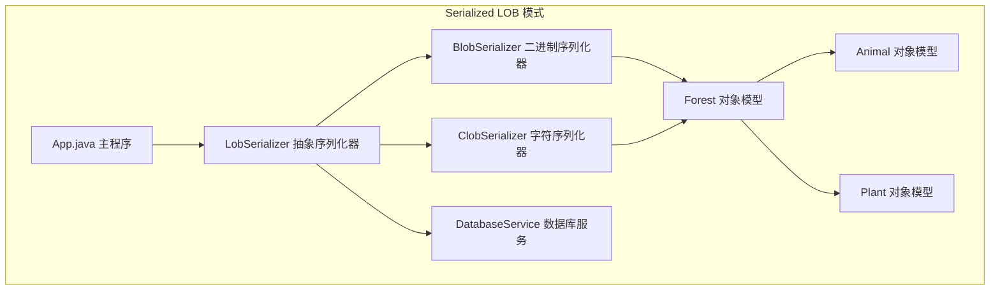
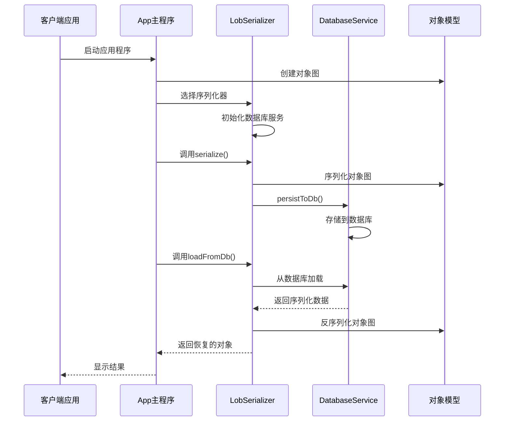
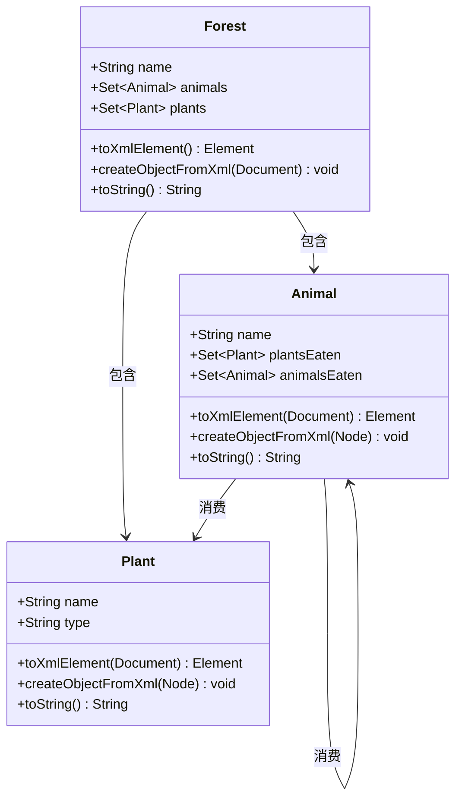
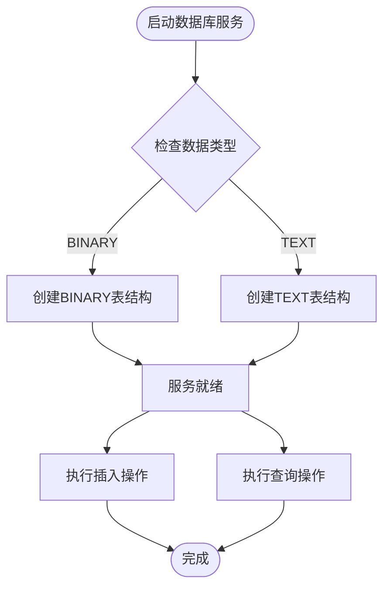
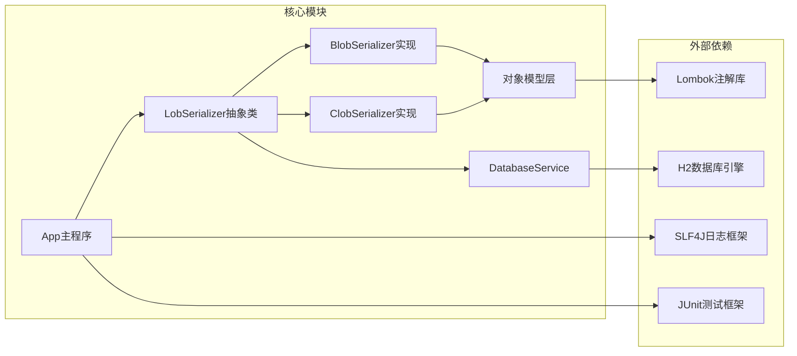

# 序列化大对象模式

<cite>
**本文档引用的文件**
- [README.md](file://serialized-lob/README.md)
- [App.java](file://serialized-lob/src/main/java/com/iluwatar/slob/App.java)
- [LobSerializer.java](file://serialized-lob/src/main/java/com/iluwatar/slob/serializers/LobSerializer.java)
- [BlobSerializer.java](file://serialized-lob/src/main/java/com/iluwatar/slob/serializers/BlobSerializer.java)
- [ClobSerializer.java](file://serialized-lob/src/main/java/com/iluwatar/slob/serializers/ClobSerializer.java)
- [DatabaseService.java](file://serialized-lob/src/main/java/com/iluwatar/slob/dbservice/DatabaseService.java)
- [Forest.java](file://serialized-lob/src/main/java/com/iluwatar/slob/lob/Forest.java)
- [Animal.java](file://serialized-lob/src/main/java/com/iluwatar/slob/lob/Animal.java)
- [Plant.java](file://serialized-lob/src/main/java/com/iluwatar/slob/lob/Plant.java)
- [AppTest.java](file://serialized-lob/src/test/java/com/iluwatar/slob/AppTest.java)
- [pom.xml](file://serialized-lob/pom.xml)
</cite>

## 目录
1. [简介](#简介)
2. [项目结构](#项目结构)
3. [核心组件](#核心组件)
4. [架构概览](#架构概览)
5. [详细组件分析](#详细组件分析)
6. [依赖关系分析](#依赖关系分析)
7. [性能考量](#性能考量)
8. [故障排除指南](#故障排除指南)
9. [结论](#结论)
10. [附录](#附录)

## 简介

序列化大对象（Serialized Large Object，SLOB）模式是一种用于高效管理和存储大型数据对象的设计模式。该模式通过将复杂对象图序列化为单个大对象（BLOB或CLOB），然后直接存储到数据库中，实现了对多媒体文件、大文本文档等大型数据的统一管理。

在本实现中，SLOB模式通过抽象的`LobSerializer`类定义了序列化接口，并提供了两种具体实现：`BlobSerializer`（二进制序列化）和`ClobSerializer`（字符序列化）。这种设计使得应用程序能够灵活地选择最适合的数据存储方式。

## 项目结构

Serialized LOB模式项目采用标准的Maven项目结构，主要包含以下模块：

**图表来源**
- [App.java](file://serialized-lob/src/main/java/com/iluwatar/slob/App.java#L44-L75)
- [LobSerializer.java](file://serialized-lob/src/main/java/com/iluwatar/slob/serializers/LobSerializer.java#L37-L42)
- [DatabaseService.java](file://serialized-lob/src/main/java/com/iluwatar/slob/dbservice/DatabaseService.java#L33-L37)

**章节来源**
- [pom.xml](file://serialized-lob/pom.xml#L32-L58)

## 核心组件

### 抽象序列化器（LobSerializer）

`LobSerializer`是整个SLOB模式的核心抽象类，定义了序列化和反序列化的标准接口：

- **序列化接口**：将复杂对象图转换为适合数据库存储的格式
- **反序列化接口**：从数据库中恢复原始对象图
- **数据库集成**：提供持久化和加载功能
- **资源管理**：实现AutoCloseable接口，确保数据库连接正确关闭

### 具体序列化器实现

#### BlobSerializer（二进制序列化）
- 使用Java对象序列化机制
- 将对象图转换为字节数组流
- 适用于二进制数据和复杂对象图
- 支持完整的对象状态恢复

#### ClobSerializer（字符序列化）
- 使用XML DOM解析和转换
- 将对象图转换为XML字符串
- 适用于文本数据和需要人类可读性的场景
- 提供结构化的数据表示

**章节来源**
- [LobSerializer.java](file://serialized-lob/src/main/java/com/iluwatar/slob/serializers/LobSerializer.java#L37-L116)
- [BlobSerializer.java](file://serialized-lob/src/main/java/com/iluwatar/slob/serializers/BlobSerializer.java#L37-L84)
- [ClobSerializer.java](file://serialized-lob/src/main/java/com/iluwatar/slob/serializers/ClobSerializer.java#L45-L108)

## 架构概览

Serialized LOB模式采用分层架构设计，清晰分离关注点：

**图表来源**
- [App.java](file://serialized-lob/src/main/java/com/iluwatar/slob/App.java#L71-L144)
- [LobSerializer.java](file://serialized-lob/src/main/java/com/iluwatar/slob/serializers/LobSerializer.java#L78-L105)
- [DatabaseService.java](file://serialized-lob/src/main/java/com/iluwatar/slob/dbservice/DatabaseService.java#L112-L156)

## 详细组件分析

### 对象模型设计

#### Forest（森林）类
作为核心业务对象，Forest代表了一个复杂的生态系统，包含动物和植物之间的食物链关系：

**图表来源**
- [Forest.java](file://serialized-lob/src/main/java/com/iluwatar/slob/lob/Forest.java#L41-L122)
- [Animal.java](file://serialized-lob/src/main/java/com/iluwatar/slob/lob/Animal.java#L38-L132)
- [Plant.java](file://serialized-lob/src/main/java/com/iluwatar/slob/lob/Plant.java#L37-L81)

#### 序列化策略对比

| 特性 | BlobSerializer | ClobSerializer |
|------|----------------|----------------|
| **数据类型** | 二进制流 | 文本字符串 |
| **序列化机制** | Java对象序列化 | XML DOM转换 |
| **存储效率** | 高（无额外格式开销） | 中等（XML格式开销） |
| **可读性** | 低（二进制） | 高（XML文本） |
| **跨平台兼容性** | 依赖Java版本 | 跨语言支持 |
| **查询能力** | 有限 | 支持基于XML的查询 |

**章节来源**
- [BlobSerializer.java](file://serialized-lob/src/main/java/com/iluwatar/slob/serializers/BlobSerializer.java#L56-L82)
- [ClobSerializer.java](file://serialized-lob/src/main/java/com/iluwatar/slob/serializers/ClobSerializer.java#L81-L106)

### 数据库集成

#### DatabaseService设计
DatabaseService负责处理所有数据库操作，支持动态表结构创建：

**图表来源**
- [DatabaseService.java](file://serialized-lob/src/main/java/com/iluwatar/slob/dbservice/DatabaseService.java#L91-L101)

**章节来源**
- [DatabaseService.java](file://serialized-lob/src/main/java/com/iluwatar/slob/dbservice/DatabaseService.java#L33-L158)

## 依赖关系分析

Serialized LOB模式的依赖关系体现了清晰的分层设计：

**图表来源**
- [pom.xml](file://serialized-lob/pom.xml#L60-L71)
- [App.java](file://serialized-lob/src/main/java/com/iluwatar/slob/App.java#L27-L42)

**章节来源**
- [pom.xml](file://serialized-lob/pom.xml#L60-L71)

## 性能考量

### 内存管理策略

1. **流式处理**：使用ByteArrayInputStream和ByteArrayOutputStream进行内存优化
2. **资源及时释放**：通过AutoCloseable接口确保数据库连接正确关闭
3. **对象池化**：对于大量数据处理，建议实现对象重用机制

### 垃圾回收优化

- **短生命周期对象**：序列化过程中的临时对象会在方法调用后被及时回收
- **流对象管理**：使用try-with-resources语句确保流对象正确关闭
- **避免内存泄漏**：注意不要在序列化过程中持有不必要的对象引用

### 性能优化建议

1. **批量操作**：对于大量数据，考虑使用批处理插入和更新
2. **索引优化**：为经常查询的字段建立适当的数据库索引
3. **缓存策略**：实现适当的缓存机制减少重复序列化开销
4. **异步处理**：对于大文件处理，考虑使用异步I/O操作

## 故障排除指南

### 常见问题及解决方案

#### 序列化异常
- **问题**：ClassNotFoundException
- **原因**：类路径变化或版本不兼容
- **解决方案**：确保所有相关类都在类路径中，保持版本一致性

#### 数据库连接问题
- **问题**：SQLException
- **原因**：数据库连接失败或表结构不匹配
- **解决方案**：检查数据库配置，确认表结构与序列化器类型匹配

#### 内存溢出错误
- **问题**：OutOfMemoryError
- **原因**：处理超大对象时内存不足
- **解决方案**：考虑使用流式处理或分块存储策略

**章节来源**
- [AppTest.java](file://serialized-lob/src/test/java/com/iluwatar/slob/AppTest.java#L109-L142)

## 结论

Serialized LOB模式为处理大型数据对象提供了一个优雅而实用的解决方案。通过将复杂对象图序列化为单一的大对象，该模式简化了数据存储和检索的复杂性，同时保持了数据的一致性和完整性。

### 主要优势
- **简化数据管理**：统一处理各种类型的大型数据
- **事务一致性**：确保数据操作的原子性和一致性
- **灵活性**：支持多种序列化策略适应不同需求
- **可扩展性**：模块化设计便于功能扩展

### 适用场景
- 多媒体内容管理系统
- 文档和报告存储
- 配置和模板管理
- 日志和审计数据存储

### 最佳实践
1. 根据数据类型选择合适的序列化器
2. 实施适当的错误处理和恢复机制
3. 考虑性能影响并进行必要的优化
4. 建立完善的监控和维护流程

## 附录

### 使用示例

#### 基本使用流程
1. 创建对象图（Forest、Animal、Plant）
2. 选择合适的序列化器（BlobSerializer或ClobSerializer）
3. 执行序列化操作
4. 持久化到数据库
5. 从数据库加载并反序列化

#### 配置选项
- **数据类型选择**：根据数据特性选择BLOB或CLOB
- **数据库配置**：调整H2数据库参数以适应生产环境
- **序列化策略**：根据性能要求选择不同的序列化实现

**章节来源**
- [README.md](file://serialized-lob/README.md#L190-L227)