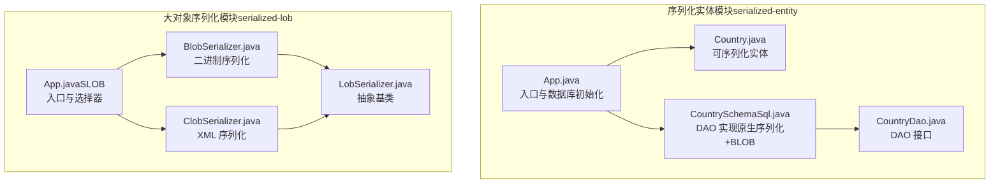
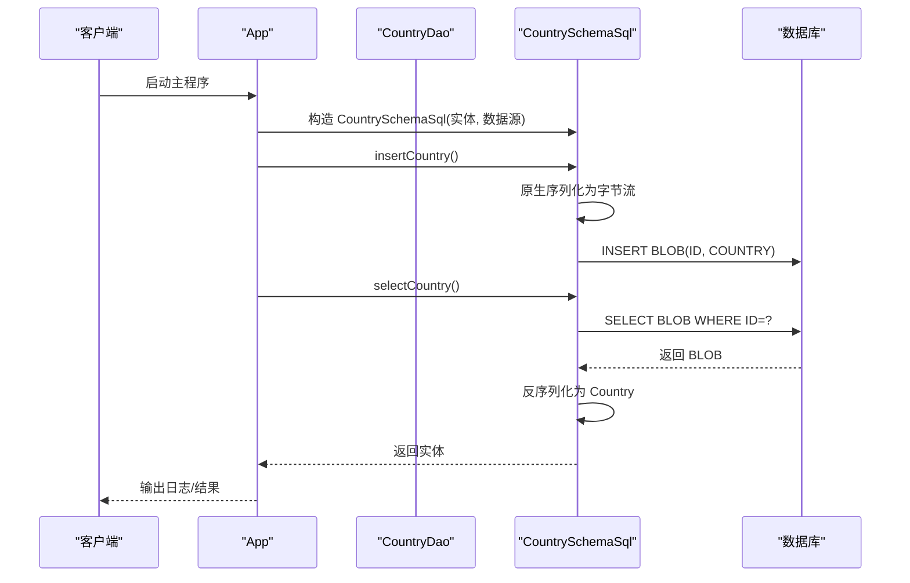
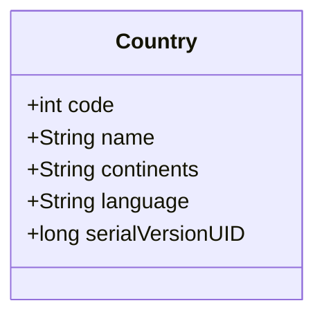
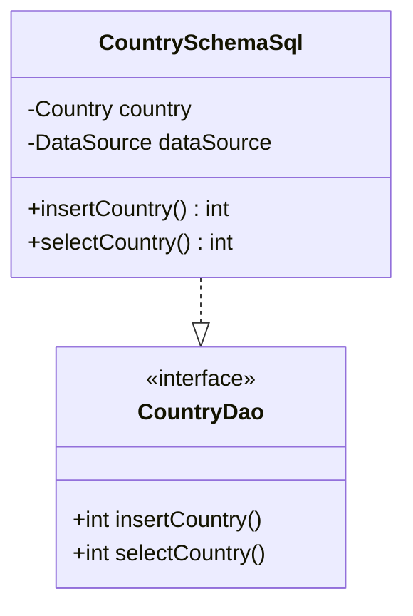
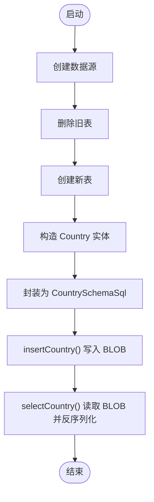
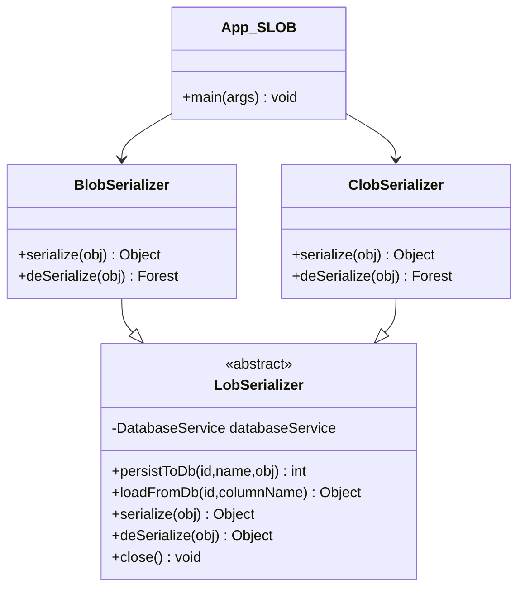
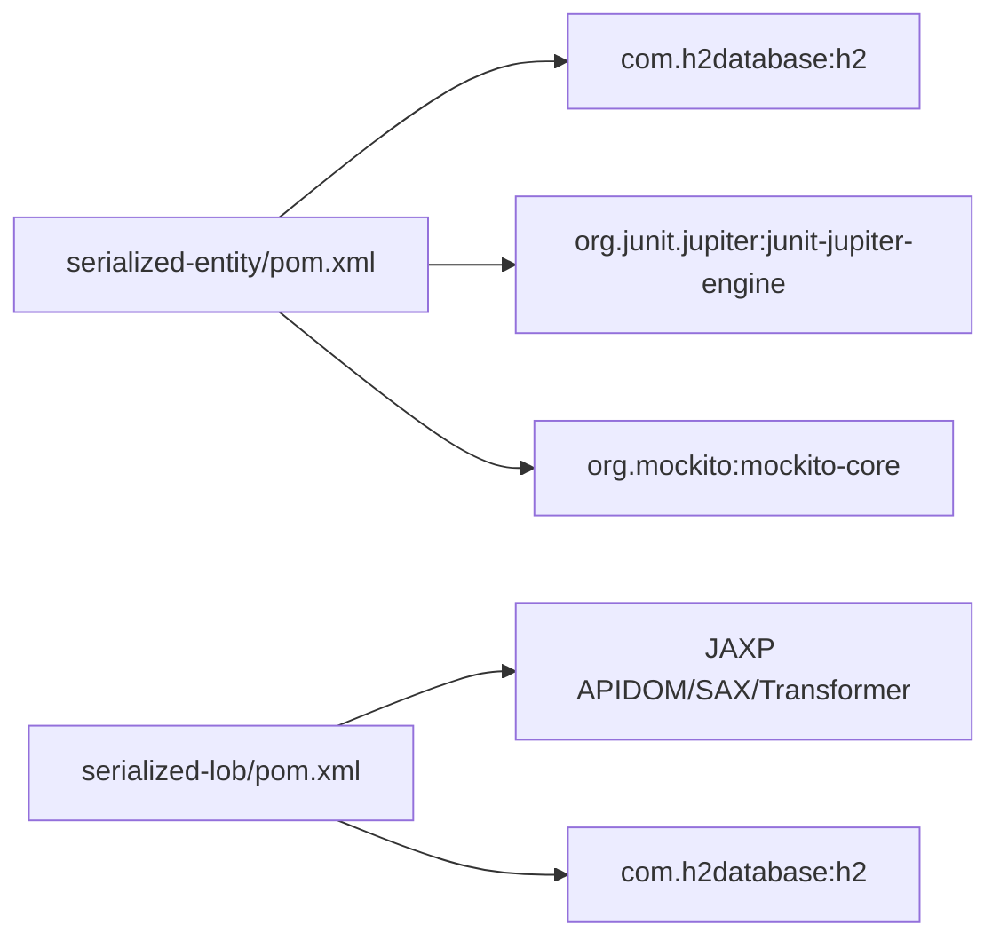

# 序列化实体模式

<cite>
**本文引用的文件**
- [App.java](file://serialized-entity/src/main/java/com/iluwatar/serializedentity/App.java)
- [Country.java](file://serialized-entity/src/main/java/com/iluwatar/serializedentity/Country.java)
- [CountryDao.java](file://serialized-entity/src/main/java/com/iluwatar/serializedentity/CountryDao.java)
- [CountrySchemaSql.java](file://serialized-entity/src/main/java/com/iluwatar/serializedentity/CountrySchemaSql.java)
- [AppTest.java](file://serialized-entity/src/test/java/com/iluwatar/serializedentity/AppTest.java)
- [CountryTest.java](file://serialized-entity/src/test/java/com/iluwatar/serializedentity/CountryTest.java)
- [README.md](file://serialized-entity/README.md)
- [pom.xml](file://serialized-entity/pom.xml)
- [BlobSerializer.java](file://serialized-lob/src/main/java/com/iluwatar/slob/serializers/BlobSerializer.java)
- [ClobSerializer.java](file://serialized-lob/src/main/java/com/iluwatar/slob/serializers/ClobSerializer.java)
- [LobSerializer.java](file://serialized-lob/src/main/java/com/iluwatar/slob/serializers/LobSerializer.java)
- [App.java（SLOB）](file://serialized-lob/src/main/java/com/iluwatar/slob/App.java)
</cite>

## 目录
1. [引言](#引言)
2. [项目结构](#项目结构)
3. [核心组件](#核心组件)
4. [架构总览](#架构总览)
5. [详细组件分析](#详细组件分析)
6. [依赖分析](#依赖分析)
7. [性能考量](#性能考量)
8. [故障排查指南](#故障排查指南)
9. [结论](#结论)
10. [附录](#附录)

## 引言
本技术文档围绕“序列化实体模式”展开，系统阐述其在持久化与传输中的应用价值，并结合仓库中“serialized-entity”与“serialized-lob”两个示例模块，深入解析以下主题：
- 序列化实体在对象状态保存与恢复中的作用
- Employee 实体与 SerializedEntity 接口的设计思路（以 Country 为例）
- 序列化格式选择、版本兼容性与迁移策略
- 与多种序列化框架的集成方案：Java 原生序列化、JSON、XML 等
- 性能优化、安全考虑与大数据量处理最佳实践
- 在微服务架构中的应用与限制

## 项目结构
该仓库包含多个设计模式示例模块，“serialized-entity”演示了基于 Java 原生序列化与 DAO 模式的对象持久化；“serialized-lob”进一步扩展到 BLOB/CLOB 的大对象存储与 XML 序列化。

图表来源
- [App.java](file://serialized-entity/src/main/java/com/iluwatar/serializedentity/App.java#L50-L104)
- [Country.java](file://serialized-entity/src/main/java/com/iluwatar/serializedentity/Country.java#L42-L51)
- [CountrySchemaSql.java](file://serialized-entity/src/main/java/com/iluwatar/serializedentity/CountrySchemaSql.java#L42-L123)
- [CountryDao.java](file://serialized-entity/src/main/java/com/iluwatar/serializedentity/CountryDao.java#L48-L51)
- [App.java（SLOB）](file://serialized-lob/src/main/java/com/iluwatar/slob/App.java#L47-L144)
- [BlobSerializer.java](file://serialized-lob/src/main/java/com/iluwatar/slob/serializers/BlobSerializer.java#L41-L83)
- [ClobSerializer.java](file://serialized-lob/src/main/java/com/iluwatar/slob/serializers/ClobSerializer.java#L49-L107)
- [LobSerializer.java](file://serialized-lob/src/main/java/com/iluwatar/slob/serializers/LobSerializer.java#L42-L115)

章节来源
- [App.java](file://serialized-entity/src/main/java/com/iluwatar/serializedentity/App.java#L50-L104)
- [Country.java](file://serialized-entity/src/main/java/com/iluwatar/serializedentity/Country.java#L42-L51)
- [CountrySchemaSql.java](file://serialized-entity/src/main/java/com/iluwatar/serializedentity/CountrySchemaSql.java#L42-L123)
- [CountryDao.java](file://serialized-entity/src/main/java/com/iluwatar/serializedentity/CountryDao.java#L48-L51)
- [App.java（SLOB）](file://serialized-lob/src/main/java/com/iluwatar/slob/App.java#L47-L144)
- [BlobSerializer.java](file://serialized-lob/src/main/java/com/iluwatar/slob/serializers/BlobSerializer.java#L41-L83)
- [ClobSerializer.java](file://serialized-lob/src/main/java/com/iluwatar/slob/serializers/ClobSerializer.java#L49-L107)
- [LobSerializer.java](file://serialized-lob/src/main/java/com/iluwatar/slob/serializers/LobSerializer.java#L42-L115)

## 核心组件
- 可序列化实体：Country 实现 Java 序列化接口，具备稳定的序列化标识，便于跨进程/网络传输与持久化。
- DAO 接口：CountryDao 定义插入与查询方法，隔离业务调用与底层数据访问细节。
- DAO 实现：CountrySchemaSql 使用原生序列化将对象写入数据库 BLOB 字段，并支持从 BLOB 读取后反序列化。
- 入口程序：App 负责初始化数据源、建表/删表、创建 Country 对象并执行序列化/反序列化流程。
- 测试验证：CountryTest 验证 Country 的 getter/setter 与原生序列化/反序列化一致性；AppTest 验证示例主流程无异常。

章节来源
- [Country.java](file://serialized-entity/src/main/java/com/iluwatar/serializedentity/Country.java#L42-L51)
- [CountryDao.java](file://serialized-entity/src/main/java/com/iluwatar/serializedentity/CountryDao.java#L48-L51)
- [CountrySchemaSql.java](file://serialized-entity/src/main/java/com/iluwatar/serializedentity/CountrySchemaSql.java#L42-L123)
- [App.java](file://serialized-entity/src/main/java/com/iluwatar/serializedentity/App.java#L50-L104)
- [CountryTest.java](file://serialized-entity/src/test/java/com/iluwatar/serializedentity/CountryTest.java#L38-L111)
- [AppTest.java](file://serialized-entity/src/test/java/com/iluwatar/serializedentity/AppTest.java#L42-L45)

## 架构总览
序列化实体模式将“对象序列化”与“DAO 持久化”解耦，形成清晰的数据流：

图表来源
- [App.java](file://serialized-entity/src/main/java/com/iluwatar/serializedentity/App.java#L62-L104)
- [CountrySchemaSql.java](file://serialized-entity/src/main/java/com/iluwatar/serializedentity/CountrySchemaSql.java#L71-L121)
- [CountryDao.java](file://serialized-entity/src/main/java/com/iluwatar/serializedentity/CountryDao.java#L48-L51)

## 详细组件分析

### 组件一：Country 实体（可序列化）
- 设计要点
  - 实现 Java 序列化接口，确保对象可被转换为字节流
  - 显式声明序列化版本号，保障跨版本兼容性
  - 使用 Lombok 注解简化属性访问与相等性比较
- 复杂度与性能
  - 序列化/反序列化时间复杂度与对象图大小线性相关
  - 建议避免频繁序列化大型对象图，必要时拆分或延迟加载
- 版本兼容性
  - 修改字段名/类型需谨慎，建议使用默认序列化策略或自定义读取逻辑

图表来源
- [Country.java](file://serialized-entity/src/main/java/com/iluwatar/serializedentity/Country.java#L42-L51)

章节来源
- [Country.java](file://serialized-entity/src/main/java/com/iluwatar/serializedentity/Country.java#L42-L51)

### 组件二：DAO 接口与实现
- CountryDao
  - 定义 insertCountry()/selectCountry()，屏蔽具体存储细节
- CountrySchemaSql
  - insertCountry：将 Country 序列化为字节流，写入数据库 BLOB
  - selectCountry：从 BLOB 读取字节流并反序列化为 Country
  - 使用 try-with-resources 确保资源释放，捕获 SQL 异常并记录日志

图表来源
- [CountryDao.java](file://serialized-entity/src/main/java/com/iluwatar/serializedentity/CountryDao.java#L48-L51)
- [CountrySchemaSql.java](file://serialized-entity/src/main/java/com/iluwatar/serializedentity/CountrySchemaSql.java#L42-L123)

章节来源
- [CountryDao.java](file://serialized-entity/src/main/java/com/iluwatar/serializedentity/CountryDao.java#L48-L51)
- [CountrySchemaSql.java](file://serialized-entity/src/main/java/com/iluwatar/serializedentity/CountrySchemaSql.java#L42-L123)

### 组件三：入口与流程控制（App）
- 初始化数据源与数据库结构
- 创建 Country 实体并封装为 CountrySchemaSql
- 执行插入与查询，完成序列化/反序列化闭环

图表来源
- [App.java](file://serialized-entity/src/main/java/com/iluwatar/serializedentity/App.java#L62-L104)
- [CountrySchemaSql.java](file://serialized-entity/src/main/java/com/iluwatar/serializedentity/CountrySchemaSql.java#L71-L121)

章节来源
- [App.java](file://serialized-entity/src/main/java/com/iluwatar/serializedentity/App.java#L62-L104)

### 组件四：序列化格式扩展（SLOB 模块）
- BlobSerializer：基于 Java 原生序列化，将对象图写入 BLOB
- ClobSerializer：将对象图转为 XML 字符串，写入 CLOB，适合人类可读场景
- LobSerializer：抽象基类，统一管理数据库服务生命周期与通用存取接口

图表来源
- [LobSerializer.java](file://serialized-lob/src/main/java/com/iluwatar/slob/serializers/LobSerializer.java#L42-L115)
- [BlobSerializer.java](file://serialized-lob/src/main/java/com/iluwatar/slob/serializers/BlobSerializer.java#L41-L83)
- [ClobSerializer.java](file://serialized-lob/src/main/java/com/iluwatar/slob/serializers/ClobSerializer.java#L49-L107)
- [App.java（SLOB）](file://serialized-lob/src/main/java/com/iluwatar/slob/App.java#L47-L144)

章节来源
- [LobSerializer.java](file://serialized-lob/src/main/java/com/iluwatar/slob/serializers/LobSerializer.java#L42-L115)
- [BlobSerializer.java](file://serialized-lob/src/main/java/com/iluwatar/slob/serializers/BlobSerializer.java#L41-L83)
- [ClobSerializer.java](file://serialized-lob/src/main/java/com/iluwatar/slob/serializers/ClobSerializer.java#L49-L107)
- [App.java（SLOB）](file://serialized-lob/src/main/java/com/iluwatar/slob/App.java#L47-L144)

## 依赖分析
- serialized-entity 模块
  - 依赖 H2 数据库驱动用于嵌入式数据库
  - 使用 JUnit/Mockito 进行单元测试
- serialized-lob 模块
  - 依赖 JAXP（DOM/SAX/Transformer）进行 XML 序列化
  - 通过抽象基类统一管理数据库服务

图表来源
- [pom.xml（SE）](file://serialized-entity/pom.xml#L36-L51)
- [pom.xml（SLOB）](file://serialized-lob/pom.xml#L1-L72)

章节来源
- [pom.xml（SE）](file://serialized-entity/pom.xml#L36-L51)
- [pom.xml（SLOB）](file://serialized-lob/pom.xml#L1-L72)

## 性能考量
- 序列化成本
  - 原生序列化对复杂对象图存在开销，建议对热点路径进行缓存或分层序列化
- 存储与传输
  - BLOB 适合二进制序列化；CLOB 适合文本化（如 XML）以便审计与调试
- 并发与事务
  - DAO 层使用 try-with-resources 确保连接/语句及时关闭；在高并发下应结合连接池与事务隔离级别
- 大数据量处理
  - 分页/分片序列化；压缩（如 GZIP）减少存储与网络带宽占用
- 可观测性
  - 记录序列化/反序列化耗时与失败原因，便于定位瓶颈

## 故障排查指南
- 常见问题
  - 类型不匹配：反序列化时若目标类变更，需确保 serialVersionUID 一致或提供自定义读取逻辑
  - SQL 异常：检查建表语句与字段类型是否匹配
  - 资源泄漏：确认所有流与连接均在 finally 或 try-with-resources 中关闭
- 日志与断言
  - 示例模块通过日志输出中间结果；测试用例验证主流程无异常
- 安全建议
  - 限制反序列化来源与白名单；避免直接反序列化不受信任的数据
  - 对敏感字段进行脱敏或加密后再序列化

章节来源
- [CountrySchemaSql.java](file://serialized-entity/src/main/java/com/iluwatar/serializedentity/CountrySchemaSql.java#L71-L121)
- [AppTest.java](file://serialized-entity/src/test/java/com/iluwatar/serializedentity/AppTest.java#L42-L45)
- [CountryTest.java](file://serialized-entity/src/test/java/com/iluwatar/serializedentity/CountryTest.java#L38-L111)

## 结论
序列化实体模式通过“原生序列化 + DAO + BLOB/CLOB”的组合，实现了对象状态的完整保存与恢复，适用于需要快速落地、跨进程/网络传输与持久化的场景。结合 SLOB 模块的 XML/CLOB 方案，可在可读性与可维护性上进一步增强。实际工程中应重视版本兼容、性能优化、安全防护与可观测性，以满足生产环境的稳定性与可演进性要求。

## 附录
- 术语
  - 序列化：将对象状态转换为可存储/传输的字节流
  - 反序列化：将字节流还原为对象
  - BLOB：二进制大对象
  - CLOB：字符大对象
- 参考资料
  - [README.md（序列化实体）](file://serialized-entity/README.md#L17-L193)
  - [README.md（SLOB）](file://serialized-lob/README.md#L1-L200)