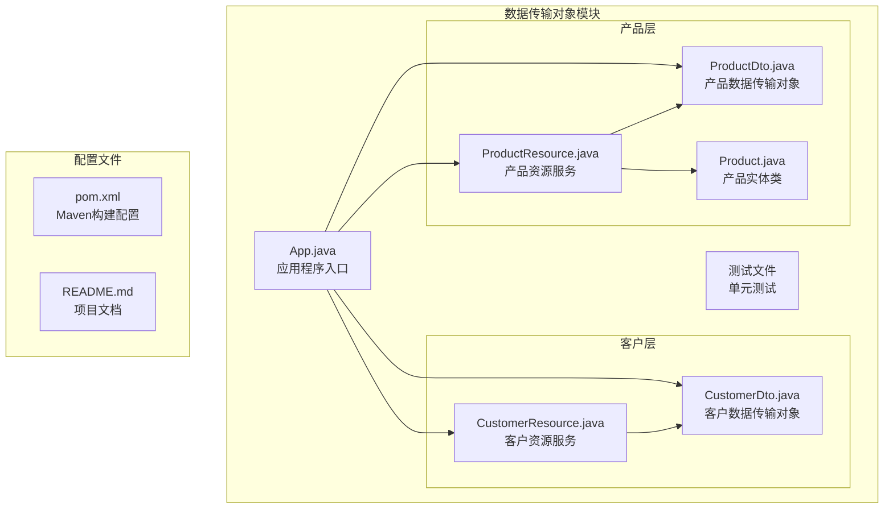
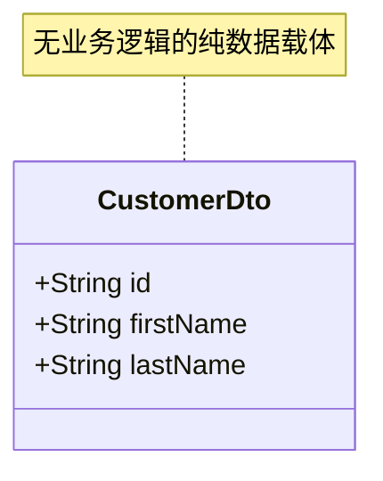
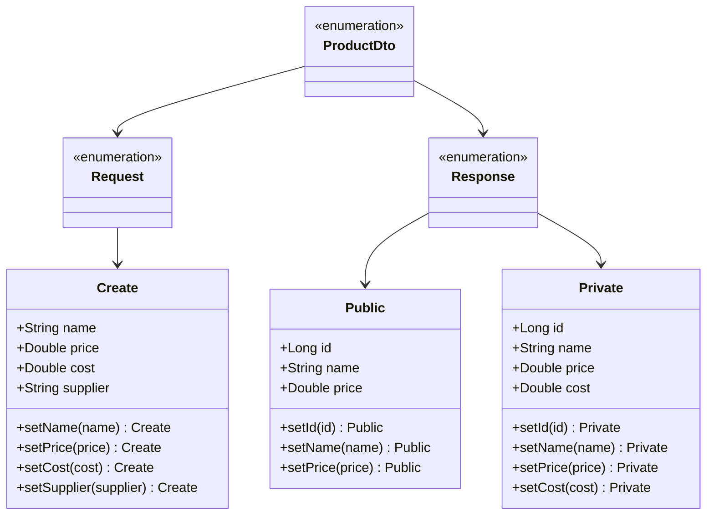
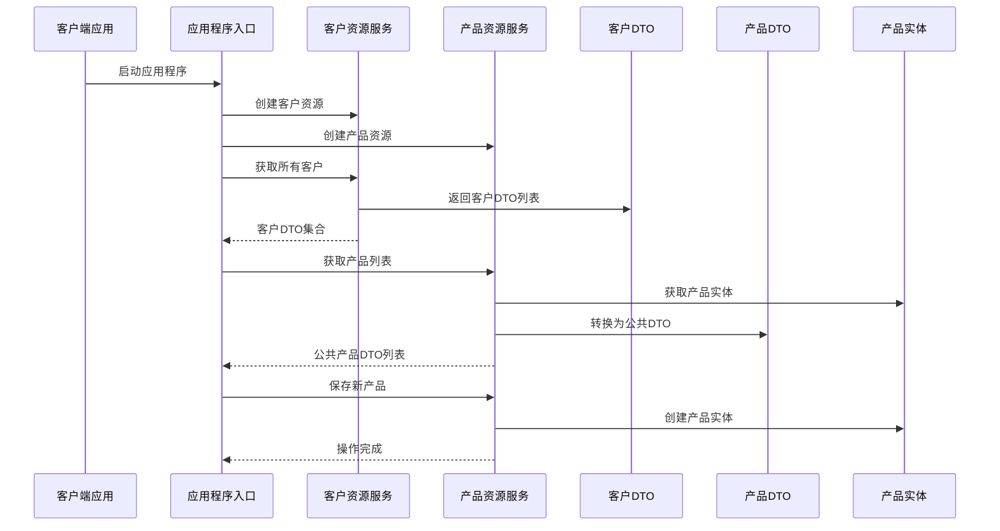
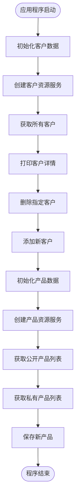
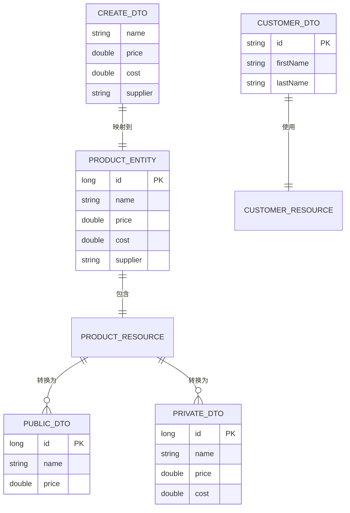
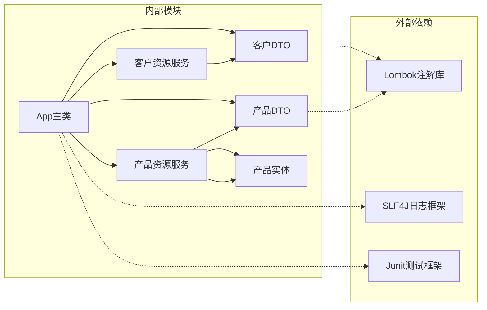
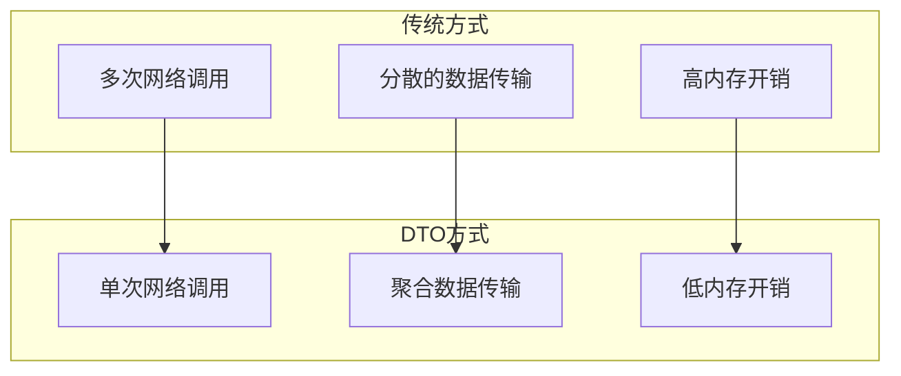

# 数据传输对象模式

<cite>
**本文档引用的文件**
- [CustomerDto.java](file://data-transfer-object/src/main/java/com/iluwatar/datatransfer/customer/CustomerDto.java)
- [ProductDto.java](file://data-transfer-object/src/main/java/com/iluwatar/datatransfer/product/ProductDto.java)
- [Product.java](file://data-transfer-object/src/main/java/com/iluwatar/datatransfer/product/Product.java)
- [CustomerResource.java](file://data-transfer-object/src/main/java/com/iluwatar/datatransfer/customer/CustomerResource.java)
- [ProductResource.java](file://data-transfer-object/src/main/java/com/iluwatar/datatransfer/product/ProductResource.java)
- [App.java](file://data-transfer-object/src/main/java/com/iluwatar/datatransfer/App.java)
- [README.md](file://data-transfer-object/README.md)
- [pom.xml](file://data-transfer-object/pom.xml)
- [AppTest.java](file://data-transfer-object/src/test/java/com/iluwatar/datatransfer/AppTest.java)
- [CustomerResourceTest.java](file://data-transfer-object/src/test/java/com/iluwatar/datatransfer/customer/CustomerResourceTest.java)
</cite>

## 目录
1. [引言](#引言)
2. [项目结构](#项目结构)
3. [核心组件](#核心组件)
4. [架构概览](#架构概览)
5. [详细组件分析](#详细组件分析)
6. [依赖关系分析](#依赖关系分析)
7. [性能考虑](#性能考虑)
8. [故障排除指南](#故障排除指南)
9. [结论](#结论)

## 引言

数据传输对象（Data Transfer Object, DTO）模式是软件架构中用于简化跨层数据传输的重要设计模式。该模式通过将多个相关数据聚合到单个对象中，显著减少了网络调用次数，提高了应用程序性能，并实现了客户端与服务器之间的解耦。

在分布式系统和微服务架构中，DTO模式发挥着至关重要的作用，它解决了远程调用中的数据传输问题，提供了类型安全的数据交换机制，并支持向后兼容性和API版本控制。

本设计文档深入分析了该仓库中实现的DTO模式，重点展示了CustomerDto和ProductDto的设计原则、字段选择策略以及在实际应用中的最佳实践。

## 项目结构

该项目遵循标准的Maven项目结构，采用分层架构设计，清晰地分离了不同职责的组件：

**图表来源**
- [pom.xml](file://data-transfer-object/pom.xml#L28-L63)
- [App.java](file://data-transfer-object/src/main/java/com/iluwatar/datatransfer/App.java#L25-L54)

**章节来源**
- [pom.xml](file://data-transfer-object/pom.xml#L28-L63)
- [README.md](file://data-transfer-object/README.md#L1-L215)

## 核心组件

### 客户DTO（CustomerDto）

CustomerDto是一个简单的记录类（Record），体现了DTO模式的核心理念：最小化数据载体，不包含任何业务逻辑。

**图表来源**
- [CustomerDto.java](file://data-transfer-object/src/main/java/com/iluwatar/datatransfer/customer/CustomerDto.java#L30-L36)

### 产品DTO（ProductDto）

ProductDto采用了枚举+内部类的复杂设计，提供了多种DTO变体以满足不同的安全级别和使用场景。

**图表来源**
- [ProductDto.java](file://data-transfer-object/src/main/java/com/iluwatar/datatransfer/product/ProductDto.java#L34-L288)

**章节来源**
- [CustomerDto.java](file://data-transfer-object/src/main/java/com/iluwatar/datatransfer/customer/CustomerDto.java#L30-L36)
- [ProductDto.java](file://data-transfer-object/src/main/java/com/iluwatar/datatransfer/product/ProductDto.java#L34-L288)

## 架构概览

该系统采用了经典的客户端-服务器架构，通过DTO实现了清晰的边界分离：

**图表来源**
- [App.java](file://data-transfer-object/src/main/java/com/iluwatar/datatransfer/App.java#L61-L135)
- [CustomerResource.java](file://data-transfer-object/src/main/java/com/iluwatar/datatransfer/customer/CustomerResource.java#L35-L53)
- [ProductResource.java](file://data-transfer-object/src/main/java/com/iluwatar/datatransfer/product/ProductResource.java#L33-L75)

## 详细组件分析

### 客户端-服务器交互流程

系统通过App类协调客户端与服务器之间的交互，展示了DTO模式在实际应用中的工作原理：

**图表来源**
- [App.java](file://data-transfer-object/src/main/java/com/iluwatar/datatransfer/App.java#L61-L135)

### DTO设计原则分析

#### CustomerDto设计原则

CustomerDto遵循了DTO模式的基本原则：
- **简单性**：仅包含基本数据字段，无业务逻辑
- **不可变性**：使用record确保数据不可修改
- **序列化友好**：适合网络传输和持久化

#### ProductDto设计策略

ProductDto采用了多层次的设计策略：

1. **安全级别分离**：Public和Private DTO分别处理不同敏感度的数据
2. **请求响应分离**：Request和Response枚举明确区分输入输出
3. **接口组合模式**：通过接口组合实现灵活的字段选择

**章节来源**
- [App.java](file://data-transfer-object/src/main/java/com/iluwatar/datatransfer/App.java#L61-L135)
- [CustomerResource.java](file://data-transfer-object/src/main/java/com/iluwatar/datatransfer/customer/CustomerResource.java#L35-L53)
- [ProductResource.java](file://data-transfer-object/src/main/java/com/iluwatar/datatransfer/product/ProductResource.java#L33-L75)

### 实体对象与DTO的映射关系

系统实现了实体对象与DTO之间的双向映射，确保数据的一致性和安全性：

**图表来源**
- [ProductResource.java](file://data-transfer-object/src/main/java/com/iluwatar/datatransfer/product/ProductResource.java#L39-L74)
- [Product.java](file://data-transfer-object/src/main/java/com/iluwatar/datatransfer/product/Product.java#L39-L44)

**章节来源**
- [ProductResource.java](file://data-transfer-object/src/main/java/com/iluwatar/datatransfer/product/ProductResource.java#L39-L74)
- [Product.java](file://data-transfer-object/src/main/java/com/iluwatar/datatransfer/product/Product.java#L39-L44)

## 依赖关系分析

### 组件间依赖关系

**图表来源**
- [pom.xml](file://data-transfer-object/pom.xml#L36-L42)
- [App.java](file://data-transfer-object/src/main/java/com/iluwatar/datatransfer/App.java#L27-L35)

### Maven依赖配置

项目使用Maven管理依赖，主要依赖包括：
- **Lombok**：提供注解支持，减少样板代码
- **JUnit**：单元测试框架
- **SLF4J**：日志门面接口

**章节来源**
- [pom.xml](file://data-transfer-object/pom.xml#L36-L42)

## 性能考虑

### 网络传输优化

DTO模式在性能方面具有显著优势：

1. **减少网络往返**：通过聚合数据减少客户端-服务器通信次数
2. **序列化效率**：简单的数据结构便于快速序列化和反序列化
3. **内存优化**：避免重复的对象创建和数据复制

### 内存使用分析

### 缓存策略

虽然当前实现未包含缓存机制，但DTO模式天然支持缓存：
- **客户端缓存**：基于DTO的不可变性，可安全缓存
- **服务端缓存**：利用DTO的轻量级特性，提高缓存效率

## 故障排除指南

### 常见问题及解决方案

#### 1. 类型不匹配问题

**问题描述**：DTO字段类型与实体类不一致导致转换异常

**解决方案**：
- 确保DTO与实体类字段类型完全匹配
- 使用泛型确保类型安全
- 在转换过程中进行类型验证

#### 2. 序列化问题

**问题描述**：DTO在序列化过程中丢失数据

**解决方案**：
- 确保所有字段都是可序列化的
- 避免使用不可序列化的数据类型
- 考虑使用标准的序列化库

#### 3. 性能问题

**问题描述**：大量DTO对象导致内存占用过高

**解决方案**：
- 实施DTO复用策略
- 使用对象池技术
- 考虑延迟加载机制

**章节来源**
- [AppTest.java](file://data-transfer-object/src/test/java/com/iluwatar/datatransfer/AppTest.java#L40-L43)
- [CustomerResourceTest.java](file://data-transfer-object/src/test/java/com/iluwatar/datatransfer/customer/CustomerResourceTest.java#L39-L74)

## 结论

数据传输对象模式在该实现中展现了其作为现代软件架构重要组成部分的价值。通过精心设计的CustomerDto和ProductDto，系统成功实现了：

1. **清晰的职责分离**：客户端与服务器通过DTO边界清晰分离
2. **类型安全的数据传输**：强类型的DTO确保了数据完整性
3. **灵活的安全控制**：通过不同级别的DTO实现数据访问控制
4. **良好的扩展性**：模块化设计便于功能扩展和维护

该实现为理解DTO模式在网络传输和系统集成中的重要作用提供了优秀的参考案例，特别是在微服务架构中，DTO模式仍然是实现松耦合、高内聚系统的关键设计模式之一。

在未来的发展中，可以考虑：
- 集成更高级的序列化库（如Jackson、Gson）
- 实现DTO的版本控制机制
- 添加缓存和性能监控功能
- 扩展到更多业务领域的DTO设计