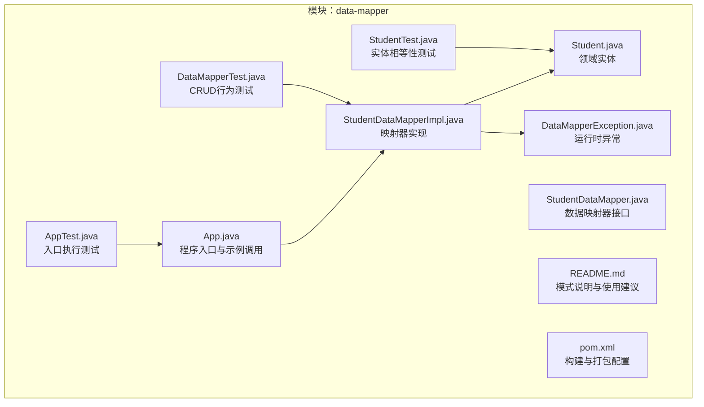
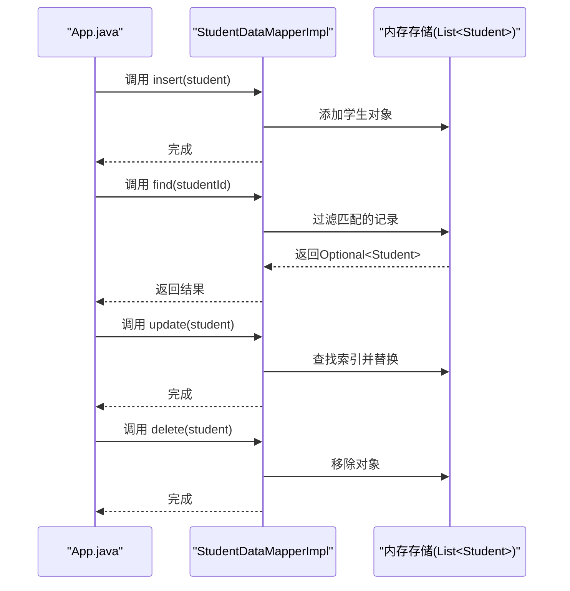
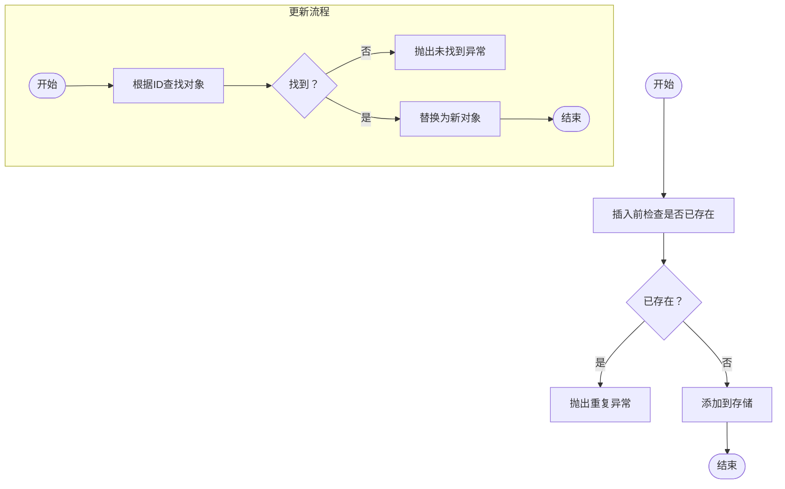
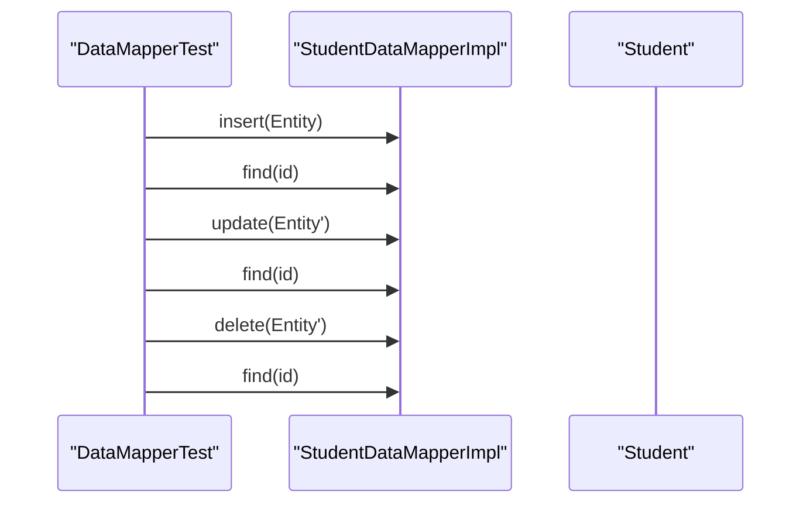

# 数据映射器模式

<cite>
**本文引用的文件**
- [Student.java](file://data-mapper/src/main/java/com/iluwatar/datamapper/Student.java)
- [StudentDataMapper.java](file://data-mapper/src/main/java/com/iluwatar/datamapper/StudentDataMapper.java)
- [StudentDataMapperImpl.java](file://data-mapper/src/main/java/com/iluwatar/datamapper/StudentDataMapperImpl.java)
- [DataMapperException.java](file://data-mapper/src/main/java/com/iluwatar/datamapper/DataMapperException.java)
- [App.java](file://data-mapper/src/main/java/com/iluwatar/datamapper/App.java)
- [AppTest.java](file://data-mapper/src/test/java/com/iluwatar/datamapper/AppTest.java)
- [DataMapperTest.java](file://data-mapper/src/test/java/com/iluwatar/datamapper/DataMapperTest.java)
- [StudentTest.java](file://data-mapper/src/test/java/com/iluwatar/datamapper/StudentTest.java)
- [README.md](file://data-mapper/README.md)
- [pom.xml](file://data-mapper/pom.xml)
</cite>

## 目录
1. [引言](#引言)
2. [项目结构](#项目结构)
3. [核心组件](#核心组件)
4. [架构总览](#架构总览)
5. [详细组件分析](#详细组件分析)
6. [依赖分析](#依赖分析)
7. [性能考虑](#性能考虑)
8. [故障排查指南](#故障排查指南)
9. [结论](#结论)
10. [附录](#附录)

## 引言
本指南围绕数据映射器（Data Mapper）模式在对象关系映射（ORM）中的核心作用展开，结合仓库中“data-mapper”示例模块，系统讲解以下主题：
- 数据映射器如何在业务逻辑与持久化存储之间建立抽象层，实现解耦；
- Student 实体类与 StudentDataMapper 接口的设计意图与职责边界；
- StudentDataMapperImpl 的实现细节：SQL 查询构建思路、结果集映射策略、异常处理与空值处理；
- 复杂查询与批量操作的扩展路径；
- 与 Spring JDBC Template 的集成思路与性能优化策略；
- 在读写分离、分库分表场景下的应用实践；
- 映射错误处理、类型转换与空值处理的最佳实践。

## 项目结构
该模块采用“领域模型 + 映射器 + 示例入口 + 测试”的分层组织方式，便于演示数据映射器的增删改查（CRUD）流程与测试验证。

图表来源
- [App.java](file://data-mapper/src/main/java/com/iluwatar/datamapper/App.java#L49-L78)
- [Student.java](file://data-mapper/src/main/java/com/iluwatar/datamapper/Student.java#L35-L53)
- [StudentDataMapper.java](file://data-mapper/src/main/java/com/iluwatar/datamapper/StudentDataMapper.java#L29-L41)
- [StudentDataMapperImpl.java](file://data-mapper/src/main/java/com/iluwatar/datamapper/StudentDataMapperImpl.java#L32-L76)
- [DataMapperException.java](file://data-mapper/src/main/java/com/iluwatar/datamapper/DataMapperException.java#L29-L49)
- [AppTest.java](file://data-mapper/src/test/java/com/iluwatar/datamapper/AppTest.java#L43-L47)
- [DataMapperTest.java](file://data-mapper/src/test/java/com/iluwatar/datamapper/DataMapperTest.java#L46-L77)
- [StudentTest.java](file://data-mapper/src/test/java/com/iluwatar/datamapper/StudentTest.java#L43-L59)
- [README.md](file://data-mapper/README.md#L1-L168)
- [pom.xml](file://data-mapper/pom.xml#L28-L63)

章节来源
- [README.md](file://data-mapper/README.md#L1-L168)
- [pom.xml](file://data-mapper/pom.xml#L28-L63)

## 核心组件
- 领域实体 Student：封装学生标识、姓名与等级等属性，具备相等性与序列化能力，用于在内存中表示业务对象。
- 数据映射器接口 StudentDataMapper：定义标准的 CRUD 操作契约，隔离业务层与持久化实现。
- 映射器实现 StudentDataMapperImpl：负责将内存中的 Student 对象与底层存储进行双向映射；当前示例以内存列表模拟存储，便于演示模式思想。
- 运行时异常 DataMapperException：统一异常类型，避免对具体实现异常的耦合，提升可替换性。

章节来源
- [Student.java](file://data-mapper/src/main/java/com/iluwatar/datamapper/Student.java#L35-L53)
- [StudentDataMapper.java](file://data-mapper/src/main/java/com/iluwatar/datamapper/StudentDataMapper.java#L29-L41)
- [StudentDataMapperImpl.java](file://data-mapper/src/main/java/com/iluwatar/datamapper/StudentDataMapperImpl.java#L32-L76)
- [DataMapperException.java](file://data-mapper/src/main/java/com/iluwatar/datamapper/DataMapperException.java#L29-L49)

## 架构总览
下图展示了数据映射器在示例中的交互流程：应用通过映射器接口访问实现，实现内部完成查找、插入、更新与删除操作，并在失败时抛出统一异常。

图表来源
- [App.java](file://data-mapper/src/main/java/com/iluwatar/datamapper/App.java#L49-L78)
- [StudentDataMapperImpl.java](file://data-mapper/src/main/java/com/iluwatar/datamapper/StudentDataMapperImpl.java#L41-L74)

## 详细组件分析

### Student 实体类设计
- 设计要点
  - 使用相等性注解仅基于关键字段（如学号）进行比较，确保业务层面的唯一性判断。
  - 提供序列化支持，便于跨进程或持久化传输。
  - 字段覆盖：学号、姓名、等级。
- 最佳实践
  - 避免在实体中直接包含数据库元信息（如表名、列名），保持纯领域模型。
  - 对于可变字段，提供受控的 setter 或使用不可变构造方式，减少并发风险。

章节来源
- [Student.java](file://data-mapper/src/main/java/com/iluwatar/datamapper/Student.java#L35-L53)

### StudentDataMapper 接口
- 职责边界
  - 封装所有与 Student 相关的持久化操作，隐藏具体存储细节。
  - 返回 Optional 类型用于安全地表达“未找到”场景，避免空指针。
- 可扩展性
  - 可在此基础上增加复杂查询方法（如按名称模糊查询、分页查询等）。
  - 可引入泛型参数以适配不同实体类型，形成通用映射器基座。

章节来源
- [StudentDataMapper.java](file://data-mapper/src/main/java/com/iluwatar/datamapper/StudentDataMapper.java#L29-L41)

### StudentDataMapperImpl 实现细节
- 存储介质
  - 当前以内存列表模拟存储，便于演示模式而不依赖真实数据库。
- 查询与映射
  - 查找：基于流式过滤返回 Optional，体现函数式风格与空安全。
  - 插入：先检查重复，再添加，异常路径清晰。
  - 更新：先定位对象，再替换，若未找到则抛出统一异常。
  - 删除：移除对象并校验存在性，不存在时抛出异常。
- 错误处理与空值
  - 统一使用 DataMapperException 抛错，便于上层捕获与处理。
  - 使用 Optional 避免直接返回 null，降低空指针风险。

图表来源
- [StudentDataMapperImpl.java](file://data-mapper/src/main/java/com/iluwatar/datamapper/StudentDataMapperImpl.java#L57-L74)

章节来源
- [StudentDataMapperImpl.java](file://data-mapper/src/main/java/com/iluwatar/datamapper/StudentDataMapperImpl.java#L32-L76)
- [DataMapperException.java](file://data-mapper/src/main/java/com/iluwatar/datamapper/DataMapperException.java#L29-L49)

### App 示例与测试
- App 入口
  - 展示完整的 CRUD 流程：创建、查找、更新、删除。
- 单元测试
  - AppTest：验证主程序不抛异常。
  - DataMapperTest：验证 CRUD 行为与断言。
  - StudentTest：验证实体相等性规则。

图表来源
- [DataMapperTest.java](file://data-mapper/src/test/java/com/iluwatar/datamapper/DataMapperTest.java#L46-L77)
- [StudentDataMapperImpl.java](file://data-mapper/src/main/java/com/iluwatar/datamapper/StudentDataMapperImpl.java#L41-L74)

章节来源
- [App.java](file://data-mapper/src/main/java/com/iluwatar/datamapper/App.java#L49-L78)
- [AppTest.java](file://data-mapper/src/test/java/com/iluwatar/datamapper/AppTest.java#L43-L47)
- [DataMapperTest.java](file://data-mapper/src/test/java/com/iluwatar/datamapper/DataMapperTest.java#L46-L77)
- [StudentTest.java](file://data-mapper/src/test/java/com/iluwatar/datamapper/StudentTest.java#L43-L59)

## 依赖分析
- 模块依赖
  - 测试框架：JUnit Jupiter（测试）
  - 打包插件：Maven Assembly Plugin（设置主类）
- 外部依赖
  - 本示例未引入数据库驱动或 ORM 框架，便于聚焦模式本身。
- 耦合度评估
  - 领域层与持久化层通过接口解耦，符合单一职责与关注点分离原则。
  - 异常类型集中管理，避免对具体实现的依赖。

章节来源
- [pom.xml](file://data-mapper/pom.xml#L36-L61)

## 性能考虑
- 内存存储的局限性
  - 当前实现以内存列表存储，适合演示与小规模数据；大规模数据应接入数据库并优化索引与连接池。
- 查询性能
  - 线性查找的时间复杂度为 O(n)，可通过引入二级缓存或索引结构（如 Map<id, Student>）降低查找成本。
- 批量操作
  - 批量插入/更新/删除建议使用事务包裹，减少往返次数；在真实数据库中可利用批量语句或流式处理。
- Spring JDBC Template 集成建议
  - 使用 JdbcTemplate/NamedParameterJdbcTemplate 执行 SQL，RowMapper 负责将 ResultSet 映射到实体。
  - 利用 NamedParameterJdbcTemplate 支持命名参数，提高可读性与可维护性。
  - 对复杂查询，优先使用条件拼接与分页参数，避免一次性加载全量数据。
- 读写分离与分库分表
  - 读写分离：通过路由策略将读请求分发至只读库，写请求分发至主库；映射器层可注入只读/读写数据源。
  - 分库分表：在映射器层实现分片键计算与目标库/表选择，查询时按分片键路由；聚合查询需在应用层汇总结果。
- 缓存与一致性
  - 引入本地缓存（如 Caffeine）与分布式缓存（如 Redis），注意缓存失效策略与最终一致性。
  - 对热点数据采用多级缓存与预热，降低数据库压力。

## 故障排查指南
- 常见问题与定位
  - 未找到对象：检查 ID 是否正确、是否存在大小写/编码差异；确认映射器实现中的查找逻辑。
  - 重复插入：在插入前执行唯一性校验；对并发场景使用数据库唯一约束或分布式锁。
  - 更新失败：确认对象是否来自同一会话或缓存，避免脏读；必要时重新加载最新状态。
- 异常处理
  - 使用 DataMapperException 统一包装底层异常，保留上下文信息（如对象标识、操作类型）。
  - 对网络/数据库异常进行分类处理，区分可重试与不可重试错误。
- 日志与可观测性
  - 记录关键操作（插入/更新/删除/查询）的输入参数与耗时，便于定位性能瓶颈。
  - 对异常路径补充堆栈日志，但避免泄露敏感信息。

章节来源
- [StudentDataMapperImpl.java](file://data-mapper/src/main/java/com/iluwatar/datamapper/StudentDataMapperImpl.java#L47-L74)
- [DataMapperException.java](file://data-mapper/src/main/java/com/iluwatar/datamapper/DataMapperException.java#L29-L49)

## 结论
数据映射器模式通过在业务对象与持久化存储之间引入抽象层，有效实现了关注点分离与可演进性。示例模块以简洁的方式演示了 CRUD 的核心流程与测试验证，为进一步扩展到真实数据库、复杂查询、批量操作以及读写分离/分库分表提供了清晰的落地路径。结合 Spring JDBC Template 与缓存策略，可在保证灵活性的同时兼顾性能与可靠性。

## 附录
- 模式参考与延伸阅读
  - 参考文档中提供了与 ORM、RowMapper、BeanPropertyRowMapper 等相关的教程链接，便于进一步学习与实践。

章节来源
- [README.md](file://data-mapper/README.md#L130-L135)