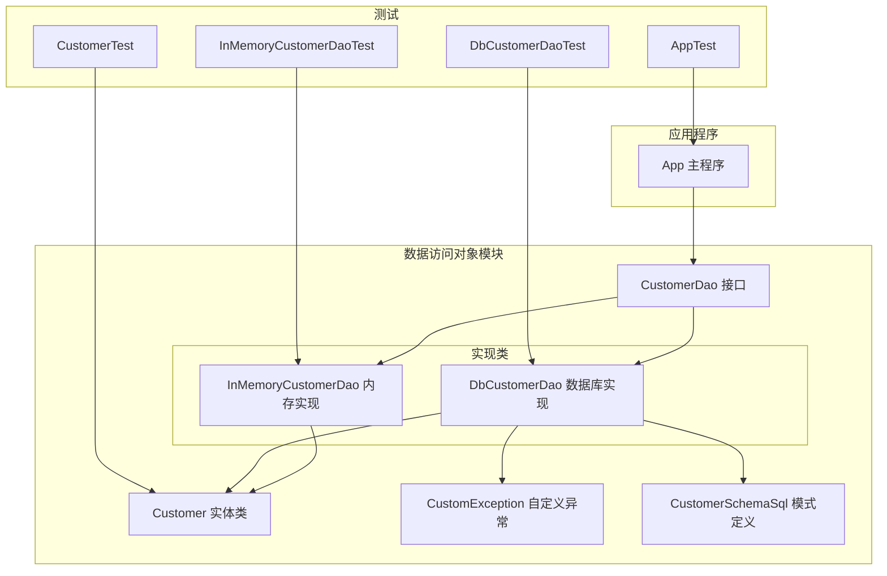
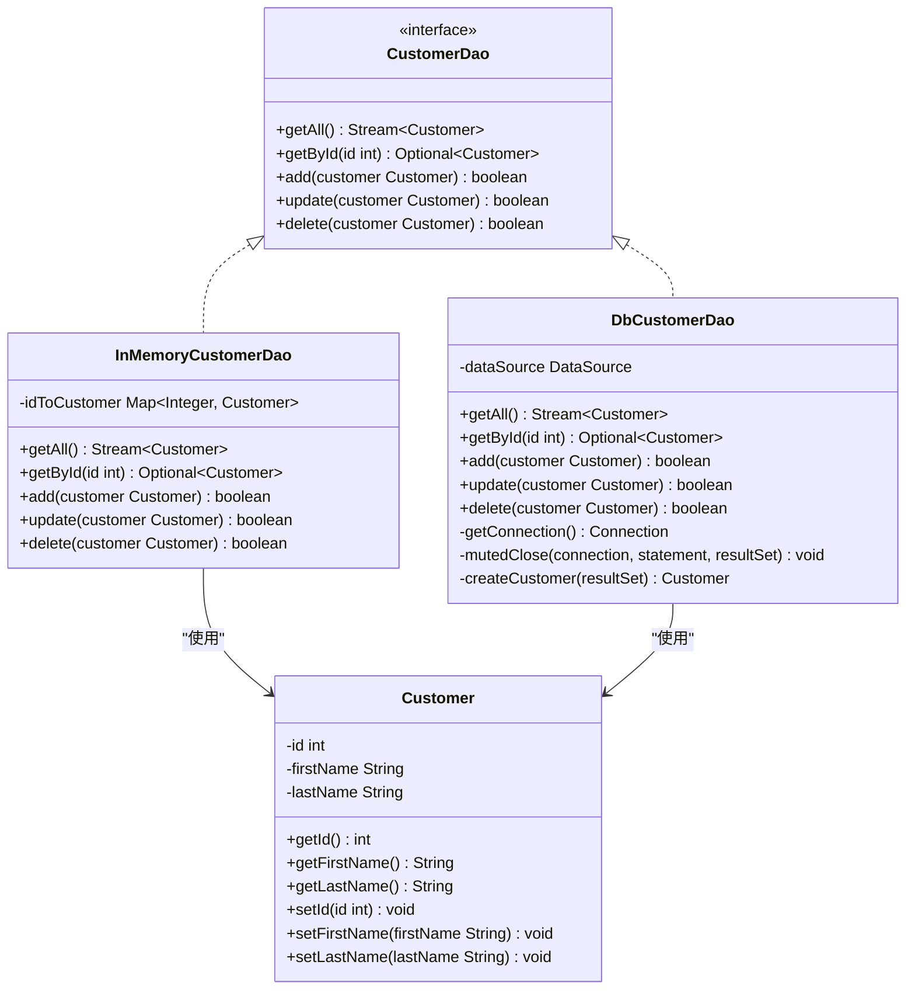
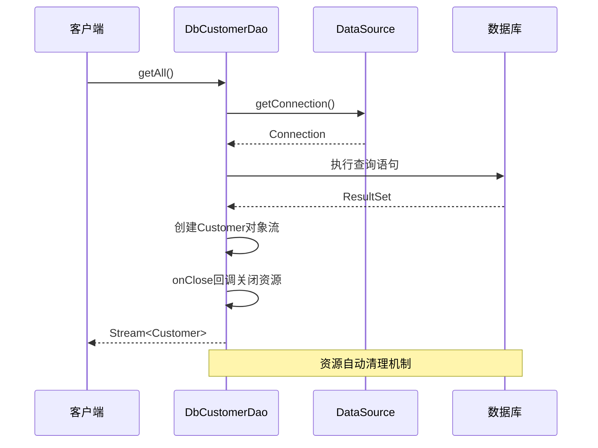
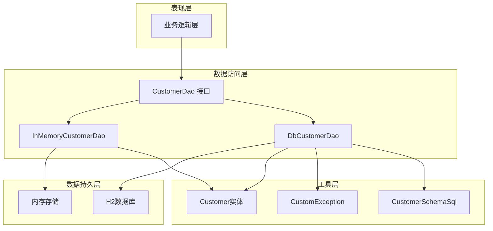
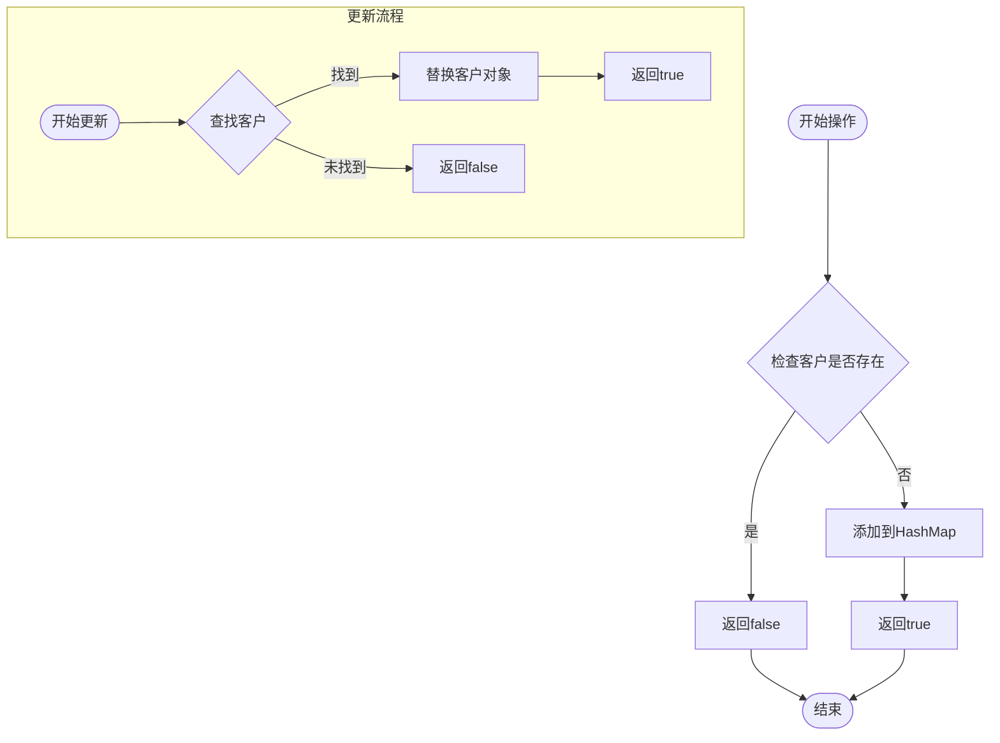
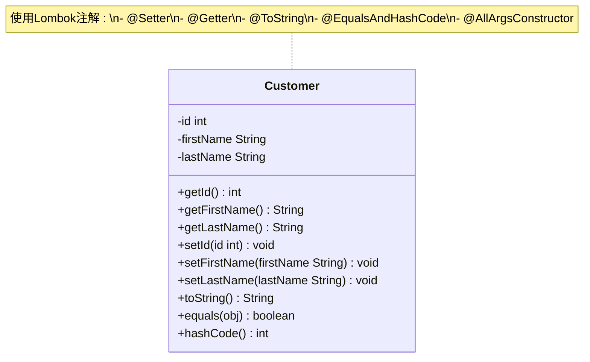
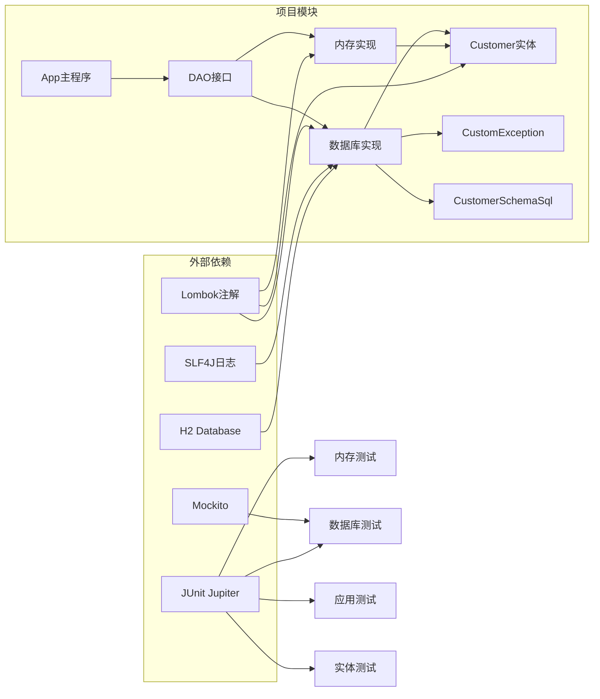

# 数据访问对象模式

<cite>
**本文档引用的文件**
- [CustomerDao.java](file://data-access-object/src/main/java/com/iluwatar/dao/CustomerDao.java)
- [DbCustomerDao.java](file://data-access-object/src/main/java/com/iluwatar/dao/DbCustomerDao.java)
- [InMemoryCustomerDao.java](file://data-access-object/src/main/java/com/iluwatar/dao/InMemoryCustomerDao.java)
- [Customer.java](file://data-access-object/src/main/java/com/iluwatar/dao/Customer.java)
- [App.java](file://data-access-object/src/main/java/com/iluwatar/dao/App.java)
- [CustomException.java](file://data-access-object/src/main/java/com/iluwatar/dao/CustomException.java)
- [CustomerSchemaSql.java](file://data-access-object/src/main/java/com/iluwatar/dao/CustomerSchemaSql.java)
- [DbCustomerDaoTest.java](file://data-access-object/src/test/java/com/iluwatar/dao/DbCustomerDaoTest.java)
- [InMemoryCustomerDaoTest.java](file://data-access-object/src/test/java/com/iluwatar/dao/InMemoryCustomerDaoTest.java)
- [AppTest.java](file://data-access-object/src/test/java/com/iluwatar/dao/AppTest.java)
- [CustomerTest.java](file://data-access-object/src/test/java/com/iluwatar/dao/CustomerTest.java)
- [README.md](file://data-access-object/README.md)
- [pom.xml](file://data-access-object/pom.xml)
</cite>

## 目录
1. [简介](#简介)
2. [项目结构](#项目结构)
3. [核心组件](#核心组件)
4. [架构概览](#架构概览)
5. [详细组件分析](#详细组件分析)
6. [依赖关系分析](#依赖关系分析)
7. [性能考虑](#性能考虑)
8. [故障排除指南](#故障排除指南)
9. [结论](#结论)
10. [附录](#附录)

## 简介

数据访问对象（DAO）模式是一种用于将数据访问逻辑从应用程序业务逻辑中分离的设计模式。该模式通过提供一个抽象的数据访问接口，使得应用程序可以独立于具体的数据库实现进行数据操作。

在本项目中，DAO模式通过以下方式实现：
- 定义统一的CustomerDao接口
- 提供内存存储和数据库存储两种实现
- 使用Customer实体类表示数据模型
- 通过App类演示CRUD操作的完整流程

## 项目结构

**图表来源**
- [CustomerDao.java](file://data-access-object/src/main/java/com/iluwatar/dao/CustomerDao.java#L45-L92)
- [DbCustomerDao.java](file://data-access-object/src/main/java/com/iluwatar/dao/DbCustomerDao.java#L46-L183)
- [InMemoryCustomerDao.java](file://data-access-object/src/main/java/com/iluwatar/dao/InMemoryCustomerDao.java#L38-L74)

**章节来源**
- [pom.xml](file://data-access-object/pom.xml#L28-L71)

## 核心组件

### CustomerDao 接口设计

CustomerDao接口定义了数据访问的标准方法：

**图表来源**
- [CustomerDao.java](file://data-access-object/src/main/java/com/iluwatar/dao/CustomerDao.java#L45-L92)
- [InMemoryCustomerDao.java](file://data-access-object/src/main/java/com/iluwatar/dao/InMemoryCustomerDao.java#L38-L74)
- [DbCustomerDao.java](file://data-access-object/src/main/java/com/iluwatar/dao/DbCustomerDao.java#L46-L183)
- [Customer.java](file://data-access-object/src/main/java/com/iluwatar/dao/Customer.java#L41-L47)

### 数据库连接管理

DbCustomerDao实现了完整的数据库连接管理机制：

**图表来源**
- [DbCustomerDao.java](file://data-access-object/src/main/java/com/iluwatar/dao/DbCustomerDao.java#L57-L82)
- [DbCustomerDao.java](file://data-access-object/src/main/java/com/iluwatar/dao/DbCustomerDao.java#L88-L96)

**章节来源**
- [DbCustomerDao.java](file://data-access-object/src/main/java/com/iluwatar/dao/DbCustomerDao.java#L46-L183)

## 架构概览

**图表来源**
- [App.java](file://data-access-object/src/main/java/com/iluwatar/dao/App.java#L46-L125)
- [CustomerDao.java](file://data-access-object/src/main/java/com/iluwatar/dao/CustomerDao.java#L30-L44)

## 详细组件分析

### CustomerDao 接口设计

CustomerDao接口采用了现代Java特性，提供了类型安全和流式处理能力：

| 方法 | 返回类型 | 描述 | 异常处理 |
|------|----------|------|----------|
| getAll() | Stream<Customer> | 获取所有客户记录 | 抛出Exception |
| getById(id) | Optional<Customer> | 根据ID获取客户 | 抛出Exception |
| add(customer) | boolean | 添加新客户 | 抛出Exception |
| update(customer) | boolean | 更新现有客户 | 抛出Exception |
| delete(customer) | boolean | 删除客户 | 抛出Exception |

**章节来源**
- [CustomerDao.java](file://data-access-object/src/main/java/com/iluwatar/dao/CustomerDao.java#L45-L92)

### InMemoryCustomerDao 实现

内存实现提供了快速原型开发和测试支持：

**图表来源**
- [InMemoryCustomerDao.java](file://data-access-object/src/main/java/com/iluwatar/dao/InMemoryCustomerDao.java#L55-L73)

**章节来源**
- [InMemoryCustomerDao.java](file://data-access-object/src/main/java/com/iluwatar/dao/InMemoryCustomerDao.java#L38-L74)

### DbCustomerDao 实现

数据库实现展示了企业级应用的最佳实践：

#### 连接池管理
- 使用DataSource接口实现连接池管理
- 自动资源清理机制
- 异常转换为自定义异常类型

#### 流式查询处理
- 延迟执行的Stream API
- Spliterator实现自定义迭代逻辑
- onClose回调确保资源释放

**章节来源**
- [DbCustomerDao.java](file://data-access-object/src/main/java/com/iluwatar/dao/DbCustomerDao.java#L46-L183)

### Customer 实体类

Customer类采用Lombok注解简化代码：

**图表来源**
- [Customer.java](file://data-access-object/src/main/java/com/iluwatar/dao/Customer.java#L36-L47)

**章节来源**
- [Customer.java](file://data-access-object/src/main/java/com/iluwatar/dao/Customer.java#L41-L47)

## 依赖关系分析

**图表来源**
- [pom.xml](file://data-access-object/pom.xml#L36-L51)
- [DbCustomerDao.java](file://data-access-object/src/main/java/com/iluwatar/dao/DbCustomerDao.java#L27-L39)

**章节来源**
- [pom.xml](file://data-access-object/pom.xml#L28-L71)

## 性能考虑

### 内存实现 vs 数据库实现

| 特性 | 内存实现 | 数据库实现 |
|------|----------|------------|
| 性能 | O(1)查找，O(n)遍历 | 索引优化查询，连接开销 |
| 内存使用 | JVM内存，进程内 | 可扩展到多实例部署 |
| 数据持久性 | 应用退出即丢失 | 持久化存储，数据安全 |
| 并发支持 | 需要同步机制 | 数据库事务管理 |
| 可扩展性 | 受限于单机内存 | 支持分布式部署 |

### 最佳实践建议

1. **选择合适的实现**
   - 开发和测试阶段使用内存实现
   - 生产环境使用数据库实现
   - 混合使用：缓存层用内存，持久层用数据库

2. **资源管理**
   - 确保Stream正确关闭
   - 使用try-with-resources管理数据库连接
   - 实现onClose回调清理资源

3. **异常处理**
   - 统一异常转换策略
   - 区分业务异常和系统异常
   - 提供有意义的错误信息

## 故障排除指南

### 常见问题及解决方案

#### 数据库连接问题
- **症状**: SQL异常或连接超时
- **原因**: 数据源配置错误或网络问题
- **解决方案**: 检查DataSource配置和数据库服务状态

#### 资源泄漏问题
- **症状**: 内存占用持续增长
- **原因**: Stream未正确关闭
- **解决方案**: 确保使用try-with-resources或onClose回调

#### 数据一致性问题
- **症状**: 查询结果不一致
- **原因**: 并发访问导致的数据竞争
- **解决方案**: 使用适当的锁机制或事务隔离级别

**章节来源**
- [DbCustomerDaoTest.java](file://data-access-object/src/test/java/com/iluwatar/dao/DbCustomerDaoTest.java#L183-L234)
- [DbCustomerDao.java](file://data-access-object/src/main/java/com/iluwatar/dao/DbCustomerDao.java#L88-L96)

## 结论

数据访问对象模式通过以下方式提升了应用程序质量：

### 主要优势
1. **关注点分离**: 将数据访问逻辑与业务逻辑完全分离
2. **可测试性**: 支持单元测试和集成测试
3. **可维护性**: 单一职责原则的应用
4. **灵活性**: 支持多种数据存储后端
5. **可扩展性**: 易于添加新的数据访问策略

### 适用场景
- 企业级应用的数据访问层
- 需要支持多种数据源的系统
- 需要良好测试覆盖的应用
- 复杂业务逻辑与数据访问分离的场景

### 局限性
- 对于简单应用可能增加复杂度
- 学习曲线和开发成本
- 可能引入额外的抽象层次

## 附录

### CRUD操作最佳实践

#### 创建操作
- 验证唯一性约束
- 使用事务保证原子性
- 记录审计信息

#### 读取操作
- 使用流式处理大数据集
- 实现分页查询
- 缓存常用查询结果

#### 更新操作
- 实现乐观锁防止并发冲突
- 使用版本号控制
- 记录变更历史

#### 删除操作
- 软删除支持
- 级联删除处理
- 数据备份策略

### Spring框架集成建议

虽然本项目未直接使用Spring框架，但DAO模式与Spring高度兼容：

1. **依赖注入**: 使用@Autowired注解注入DataSource
2. **事务管理**: 使用@Transactional注解管理数据库事务
3. **异常处理**: 使用@ExceptionHandler统一处理异常
4. **配置管理**: 使用application.properties配置数据源

### 测试策略

#### 单元测试
- 使用Mockito模拟数据源
- 测试边界条件和异常情况
- 验证DAO接口契约

#### 集成测试
- 使用H2内存数据库
- 测试完整的数据流
- 验证SQL语句正确性

**章节来源**
- [README.md](file://data-access-object/README.md#L202-L234)