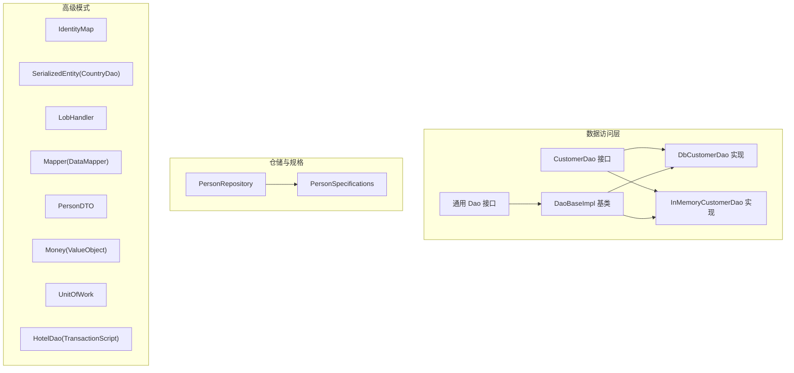
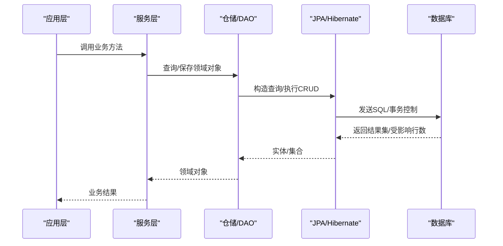
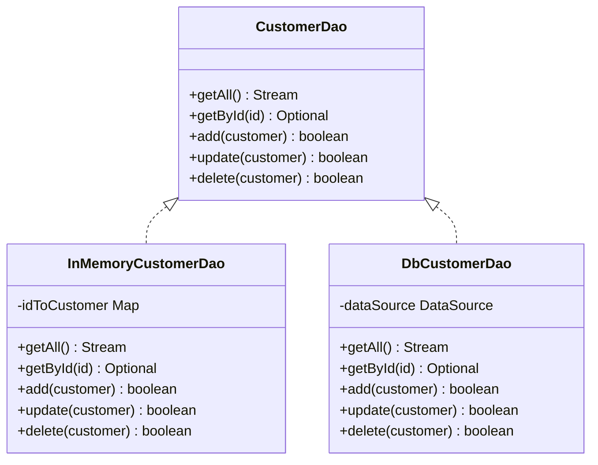
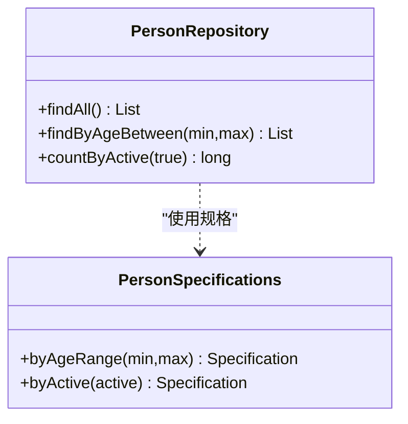
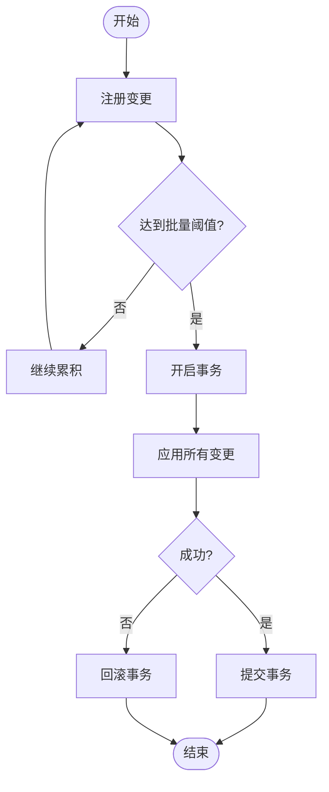
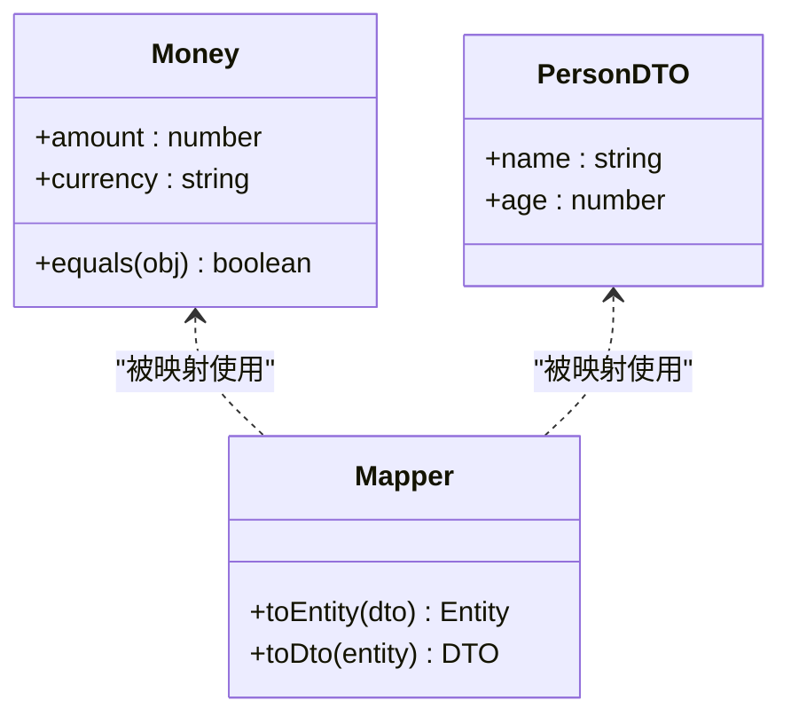
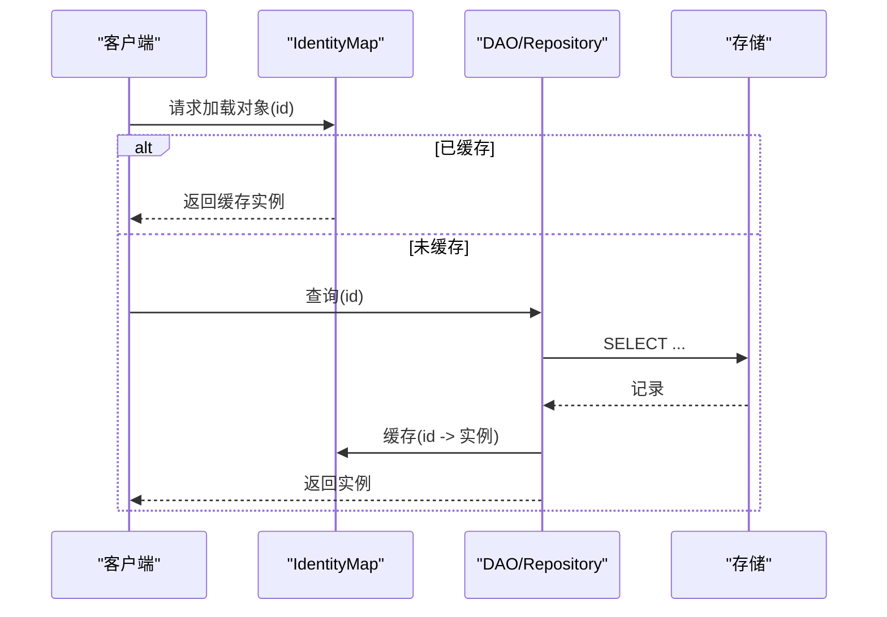
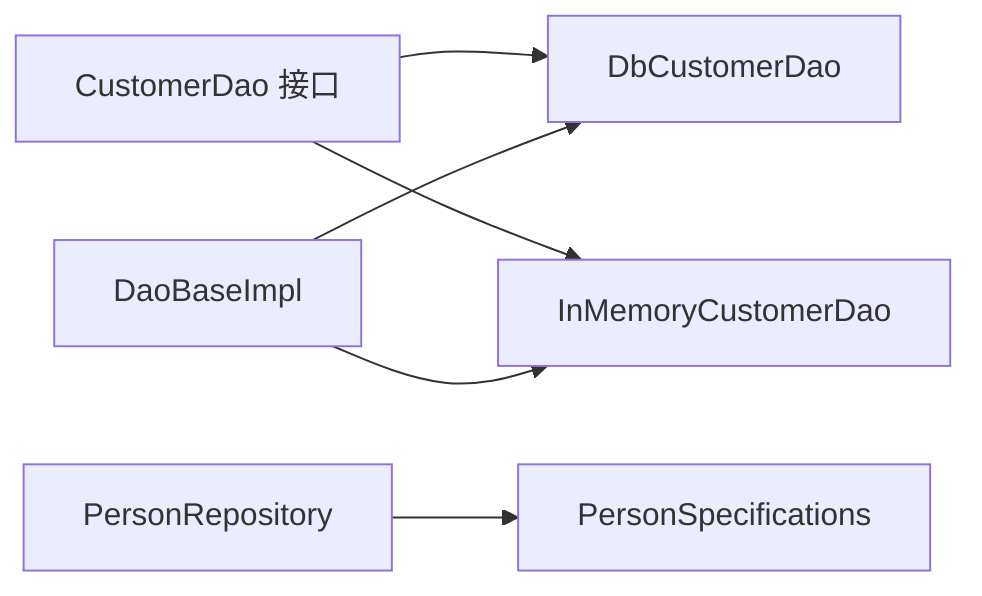

# 数据访问模式

<cite>
**本文引用的文件**
- [data-access-object 源码](file://data-access-object/src/main/java/com/iluwatar/dao/CustomerDao.java)
- [DbCustomerDao 实现](file://data-access-object/src/main/java/com/iluwatar/dao/DbCustomerDao.java)
- [InMemoryCustomerDao 实现](file://data-access-object/src/main/java/com/iluwatar/dao/InMemoryCustomerDao.java)
- [service-layer Dao 接口](file://service-layer/src/main/java/com/iluwatar/servicelayer/common/Dao.java)
- [service-layer Dao 基类](file://service-layer/src/main/java/com/iluwatar/servicelayer/common/DaoBaseImpl.java)
- [repository 示例](file://repository/src/main/java/com/iluwatar/repository/PersonRepository.java)
- [repository 配置](file://repository/src/main/resources/applicationContext.xml)
- [repository 规格](file://repository/src/main/java/com/iluwatar/repository/PersonSpecifications.java)
- [identity-map 示例](file://identity-map/src/main/java/com/iluwatar/identitymap/IdentityMap.java)
- [serialized-entity 示例](file://serialized-entity/src/main/java/com/iluwatar/serializedentity/CountryDao.java)
- [serialized-lob 示例](file://serialized-lob/src/main/java/com/iluwatar/serializedlob/LobHandler.java)
- [data-mapper 示例](file://data-mapper/src/main/java/com/iluwatar/datamapper/Mapper.java)
- [data-transfer-object 示例](file://data-transfer-object/src/main/java/com/iluwatar/datatransfer/PersonDTO.java)
- [value-object 示例](file://value-object/src/main/java/com/iluwatar/valueobject/Money.java)
- [unit-of-work 示例](file://unit-of-work/src/main/java/com/iluwatar/unitofwork/UnitOfWork.java)
- [transaction-script 示例](file://transaction-script/src/main/java/com/iluwatar/transactionscript/HotelDao.java)
</cite>

## 目录
1. [引言](#引言)
2. [项目结构](#项目结构)
3. [核心组件](#核心组件)
4. [架构总览](#架构总览)
5. [详细组件分析](#详细组件分析)
6. [依赖关系分析](#依赖关系分析)
7. [性能考虑](#性能考虑)
8. [故障排查指南](#故障排查指南)
9. [结论](#结论)
10. [附录](#附录)

## 引言
本指南聚焦于数据访问层的关键设计模式：DAO（数据访问对象）、仓储（Repository）、单元工作（Unit of Work）以及与之配套的数据建模模式（值对象、数据映射器、数据传输对象）。同时覆盖身份映射、序列化实体、大对象存储等高级主题，并结合仓库中的具体实现，给出可操作的性能优化与事务管理最佳实践，以及与主流 ORM（如 JPA/Hibernate、Spring Data JPA）的集成思路。

## 项目结构
本仓库包含多个与数据访问相关的独立模块，每个模块通过最小化的示例演示特定模式或组合用法：
- data-access-object：展示 DAO 接口与两种实现（内存与数据库）
- service-layer：基于 JPA/Hibernate 的通用 DAO 抽象与具体实现
- repository：Spring Data JPA 的仓储与规格模式示例
- identity-map：身份映射模式
- serialized-entity：序列化实体模式
- serialized-lob：大对象存储处理
- data-mapper：数据映射器模式
- data-transfer-object：数据传输对象模式
- value-object：值对象模式
- unit-of-work：单元工作模式
- transaction-script：脚本化事务模式

**图表来源**
- [data-access-object 源码](file://data-access-object/src/main/java/com/iluwatar/dao/CustomerDao.java#L45-L92)
- [DbCustomerDao 实现](file://data-access-object/src/main/java/com/iluwatar/dao/DbCustomerDao.java#L46-L183)
- [InMemoryCustomerDao 实现](file://data-access-object/src/main/java/com/iluwatar/dao/InMemoryCustomerDao.java#L38-L74)
- [service-layer Dao 基类](file://service-layer/src/main/java/com/iluwatar/servicelayer/common/DaoBaseImpl.java#L42-L145)
- [service-layer Dao 接口](file://service-layer/src/main/java/com/iluwatar/servicelayer/common/Dao.java#L34-L45)
- [repository 示例](file://repository/src/main/java/com/iluwatar/repository/PersonRepository.java)
- [repository 规格](file://repository/src/main/java/com/iluwatar/repository/PersonSpecifications.java)

**章节来源**
- [data-access-object 源码](file://data-access-object/src/main/java/com/iluwatar/dao/CustomerDao.java#L30-L44)
- [service-layer Dao 接口](file://service-layer/src/main/java/com/iluwatar/servicelayer/common/Dao.java#L29-L45)
- [repository 示例](file://repository/src/main/java/com/iluwatar/repository/PersonRepository.java)

## 核心组件
- DAO 接口与实现：定义统一的数据访问契约，分离业务逻辑与持久化细节；支持内存与数据库两种后端，便于测试与切换。
- 通用 DAO 基类：封装会话、事务、CRUD 模板方法，减少重复代码，统一异常处理与回滚策略。
- 仓储与规格：以 Spring Data JPA 为例，提供面向领域对象的查询抽象与可组合的查询条件。
- 身份映射：在内存中维护对象实例到数据库标识的一对一映射，避免重复加载与状态不一致。
- 序列化实体与大对象：将复杂对象或二进制数据持久化为单列，简化表结构但需注意性能与迁移成本。
- 数据映射器与 DTO：在不同层之间进行结构转换，隔离领域模型与外部接口。
- 值对象：不可变、按值比较的领域对象，提升模型表达力与安全性。
- 单元工作：跟踪一组变更并在提交时批量写入，降低锁竞争与提升吞吐。
- 事务脚本：将业务流程封装在单一方法内，适合简单场景或遗留系统。

**章节来源**
- [data-access-object 源码](file://data-access-object/src/main/java/com/iluwatar/dao/CustomerDao.java#L45-L92)
- [DbCustomerDao 实现](file://data-access-object/src/main/java/com/iluwatar/dao/DbCustomerDao.java#L46-L183)
- [InMemoryCustomerDao 实现](file://data-access-object/src/main/java/com/iluwatar/dao/InMemoryCustomerDao.java#L38-L74)
- [service-layer Dao 接口](file://service-layer/src/main/java/com/iluwatar/servicelayer/common/Dao.java#L34-L45)
- [service-layer Dao 基类](file://service-layer/src/main/java/com/iluwatar/servicelayer/common/DaoBaseImpl.java#L42-L145)
- [repository 示例](file://repository/src/main/java/com/iluwatar/repository/PersonRepository.java)
- [repository 规格](file://repository/src/main/java/com/iluwatar/repository/PersonSpecifications.java)
- [identity-map 示例](file://identity-map/src/main/java/com/iluwatar/identitymap/IdentityMap.java)
- [serialized-entity 示例](file://serialized-entity/src/main/java/com/iluwatar/serializedentity/CountryDao.java)
- [serialized-lob 示例](file://serialized-lob/src/main/java/com/iluwatar/serializedlob/LobHandler.java)
- [data-mapper 示例](file://data-mapper/src/main/java/com/iluwatar/datamapper/Mapper.java)
- [data-transfer-object 示例](file://data-transfer-object/src/main/java/com/iluwatar/datatransfer/PersonDTO.java)
- [value-object 示例](file://value-object/src/main/java/com/iluwatar/valueobject/Money.java)
- [unit-of-work 示例](file://unit-of-work/src/main/java/com/iluwatar/unitofwork/UnitOfWork.java)
- [transaction-script 示例](file://transaction-script/src/main/java/com/iluwatar/transactionscript/HotelDao.java)

## 架构总览
下图展示了从应用调用到持久化层的整体交互，以及与 ORM 的集成位置：

**图表来源**
- [service-layer Dao 基类](file://service-layer/src/main/java/com/iluwatar/servicelayer/common/DaoBaseImpl.java#L56-L144)
- [repository 示例](file://repository/src/main/java/com/iluwatar/repository/PersonRepository.java)
- [repository 配置](file://repository/src/main/resources/applicationContext.xml)

## 详细组件分析

### DAO 模式：接口与实现分离
- 设计要点
  - 通过接口暴露领域语义的操作（如按 ID 获取、全量流式读取），隐藏底层存储细节。
  - 支持多种实现（内存、关系型数据库、NoSQL），便于测试与环境切换。
- 关键接口与实现
  - 接口：定义 getAll、getById、add、update、delete 等方法签名与返回约定。
  - 内存实现：使用 Map 存储，适合临时数据与单元测试。
  - 数据库实现：使用 DataSource 获取连接，PreparedStatement 执行 SQL，Stream 包装结果集。
- 流式接口与资源管理
  - 数据库实现返回 Stream 并在 onClose 中关闭连接、语句与结果集，避免资源泄漏。
  - 提供异常包装类，将底层异常转译为可诊断的业务异常。

**图表来源**
- [data-access-object 源码](file://data-access-object/src/main/java/com/iluwatar/dao/CustomerDao.java#L45-L92)
- [InMemoryCustomerDao 实现](file://data-access-object/src/main/java/com/iluwatar/dao/InMemoryCustomerDao.java#L38-L74)
- [DbCustomerDao 实现](file://data-access-object/src/main/java/com/iluwatar/dao/DbCustomerDao.java#L46-L183)

**章节来源**
- [data-access-object 源码](file://data-access-object/src/main/java/com/iluwatar/dao/CustomerDao.java#L45-L92)
- [InMemoryCustomerDao 实现](file://data-access-object/src/main/java/com/iluwatar/dao/InMemoryCustomerDao.java#L38-L74)
- [DbCustomerDao 实现](file://data-access-object/src/main/java/com/iluwatar/dao/DbCustomerDao.java#L57-L82)

### 仓储模式：Spring Data JPA 集成
- 设计要点
  - 仓储面向领域对象而非表结构，提供 findByXxx、countByXxx 等方法，必要时配合规格（Specification）构建动态查询。
  - 通过 ApplicationContext 或注解装配，与 Spring 容器无缝集成。
- 关键点
  - 仓储接口：声明查询方法，由 Spring Data JPA 动态生成实现。
  - 规格：以类型安全的方式组合查询条件，支持复用与组合。

**图表来源**
- [repository 示例](file://repository/src/main/java/com/iluwatar/repository/PersonRepository.java)
- [repository 规格](file://repository/src/main/java/com/iluwatar/repository/PersonSpecifications.java)

**章节来源**
- [repository 示例](file://repository/src/main/java/com/iluwatar/repository/PersonRepository.java)
- [repository 规格](file://repository/src/main/java/com/iluwatar/repository/PersonSpecifications.java)
- [repository 配置](file://repository/src/main/resources/applicationContext.xml)

### 单元工作模式：批处理与事务边界
- 设计要点
  - 在内存中收集一组变更，统一在提交阶段写入数据库，减少锁竞争与网络往返。
  - 与事务脚本结合：在单个事务中批量执行多条命令，保证一致性。
- 典型流程
  - 注册变更（新增/更新/删除）
  - 提交时生成批量 SQL 或合并为单次提交
  - 失败时整体回滚

**图表来源**
- [unit-of-work 示例](file://unit-of-work/src/main/java/com/iluwatar/unitofwork/UnitOfWork.java)
- [transaction-script 示例](file://transaction-script/src/main/java/com/iluwatar/transactionscript/HotelDao.java)

**章节来源**
- [unit-of-work 示例](file://unit-of-work/src/main/java/com/iluwatar/unitofwork/UnitOfWork.java)
- [transaction-script 示例](file://transaction-script/src/main/java/com/iluwatar/transactionscript/HotelDao.java)

### 数据建模模式
- 值对象（Value Object）
  - 不可变、按值比较，常用于金额、地址等语义明确的领域概念。
- 数据映射器（Data Mapper）
  - 在对象与关系表之间进行双向映射，支持复杂对象的序列化存储或拆分字段。
- 数据传输对象（DTO）
  - 在不同层之间传递数据，避免直接暴露领域模型，降低耦合。

**图表来源**
- [value-object 示例](file://value-object/src/main/java/com/iluwatar/valueobject/Money.java)
- [data-mapper 示例](file://data-mapper/src/main/java/com/iluwatar/datamapper/Mapper.java)
- [data-transfer-object 示例](file://data-transfer-object/src/main/java/com/iluwatar/datatransfer/PersonDTO.java)

**章节来源**
- [value-object 示例](file://value-object/src/main/java/com/iluwatar/valueobject/Money.java)
- [data-mapper 示例](file://data-mapper/src/main/java/com/iluwatar/datamapper/Mapper.java)
- [data-transfer-object 示例](file://data-transfer-object/src/main/java/com/iluwatar/datatransfer/PersonDTO.java)

### 高级数据处理模式
- 身份映射（Identity Map）
  - 维护“数据库主键 → 对象实例”的映射，避免重复加载与状态漂移。
- 序列化实体（Serialized Entity）
  - 将复杂对象序列化为单列存储，简化表结构，但需权衡查询能力与性能。
- 大对象存储（LOB）
  - 使用 LOB 字段存储二进制或大文本，结合流式读写与缓冲策略优化性能。

**图表来源**
- [identity-map 示例](file://identity-map/src/main/java/com/iluwatar/identitymap/IdentityMap.java)
- [serialized-entity 示例](file://serialized-entity/src/main/java/com/iluwatar/serializedentity/CountryDao.java)
- [serialized-lob 示例](file://serialized-lob/src/main/java/com/iluwatar/serializedlob/LobHandler.java)

**章节来源**
- [identity-map 示例](file://identity-map/src/main/java/com/iluwatar/identitymap/IdentityMap.java)
- [serialized-entity 示例](file://serialized-entity/src/main/java/com/iluwatar/serializedentity/CountryDao.java)
- [serialized-lob 示例](file://serialized-lob/src/main/java/com/iluwatar/serializedlob/LobHandler.java)

## 依赖关系分析
- DAO 层
  - CustomerDao 接口被 DbCustomerDao 与 InMemoryCustomerDao 实现，分别依赖 DataSource 与内存 Map。
  - DbCustomerDao 在 getAll 中使用 StreamSupport 创建惰性流，并在 onClose 中释放 JDBC 资源。
- 服务层 DAO 基类
  - DaoBaseImpl 通过 HibernateUtil 获取 SessionFactory，封装 find/persist/merge/delete/findALL 的事务模板。
  - 使用 Criteria API 构造查询，确保类型安全与可维护性。
- 仓储层
  - PersonRepository 与 PersonSpecifications 解耦查询条件与实现，便于组合与复用。

**图表来源**
- [data-access-object 源码](file://data-access-object/src/main/java/com/iluwatar/dao/CustomerDao.java#L45-L92)
- [DbCustomerDao 实现](file://data-access-object/src/main/java/com/iluwatar/dao/DbCustomerDao.java#L46-L183)
- [InMemoryCustomerDao 实现](file://data-access-object/src/main/java/com/iluwatar/dao/InMemoryCustomerDao.java#L38-L74)
- [service-layer Dao 基类](file://service-layer/src/main/java/com/iluwatar/servicelayer/common/DaoBaseImpl.java#L42-L145)
- [repository 示例](file://repository/src/main/java/com/iluwatar/repository/PersonRepository.java)
- [repository 规格](file://repository/src/main/java/com/iluwatar/repository/PersonSpecifications.java)

**章节来源**
- [DbCustomerDao 实现](file://data-access-object/src/main/java/com/iluwatar/dao/DbCustomerDao.java#L57-L82)
- [service-layer Dao 基类](file://service-layer/src/main/java/com/iluwatar/servicelayer/common/DaoBaseImpl.java#L56-L144)

## 性能考虑
- 流式查询与资源回收
  - 数据库 DAO 使用 Stream 包装结果集，务必在消费完成后关闭连接与语句，避免连接泄漏。
- 事务边界与批量提交
  - 将多次写操作合并到单个事务中，减少事务开销与锁竞争；合理设置批量大小。
- 连接池与会话管理
  - 使用连接池（如 HikariCP）与合适的超时参数；Hibernate 场景下避免长时间打开 Session。
- 查询优化
  - 优先使用索引列进行过滤与排序；避免 N+1 查询，采用 JOIN 或批量抓取。
- 序列化与 LOB
  - 序列化实体会增加序列化/反序列化成本，且不利于复杂查询；LOB 适合大文档，注意分块读写与内存占用。

[本节为通用指导，无需列出具体文件来源]

## 故障排查指南
- 常见问题
  - 资源未关闭导致连接泄漏：检查 Stream.onClose 回调与 try-with-resources 使用。
  - 事务未回滚：确认异常捕获后执行了回滚逻辑，或使用受检异常触发回滚。
  - 查询性能差：检查是否缺少索引、是否存在 N+1、是否使用了不必要的惰性加载。
- 排查步骤
  - 启用 SQL 日志与慢查询日志，定位热点查询。
  - 使用连接池监控工具观察连接池利用率与等待时间。
  - 对比内存实现与数据库实现的行为差异，验证业务逻辑正确性。

**章节来源**
- [DbCustomerDao 实现](file://data-access-object/src/main/java/com/iluwatar/dao/DbCustomerDao.java#L88-L96)
- [service-layer Dao 基类](file://service-layer/src/main/java/com/iluwatar/servicelayer/common/DaoBaseImpl.java#L58-L76)

## 结论
通过 DAO、仓储与单元工作等模式的组合，可以在保持领域模型清晰的同时，获得良好的可测试性、可扩展性与性能表现。结合身份映射、序列化实体与 LOB 处理等高级模式，可以进一步平衡模型表达力与持久化效率。建议在实际项目中根据业务复杂度选择合适的模式组合，并配合连接池、事务与查询优化策略，持续迭代性能与稳定性。

[本节为总结性内容，无需列出具体文件来源]

## 附录
- 与主流 ORM 的集成要点
  - JPA/Hibernate：使用 Criteria API 或命名查询，结合 DaoBaseImpl 的模板方法，统一事务与异常处理。
  - Spring Data JPA：以仓储接口与规格模式替代手写 DAO，提高开发效率与可维护性。
- 配置参考
  - 仓储配置文件：applicationContext.xml 中装配 Repository 与数据源。
  - 事务与连接池：在容器或 Spring Boot 中配置合适的超时、最大连接数与空闲回收策略。

**章节来源**
- [repository 配置](file://repository/src/main/resources/applicationContext.xml)
- [service-layer Dao 基类](file://service-layer/src/main/java/com/iluwatar/servicelayer/common/DaoBaseImpl.java#L52-L54)