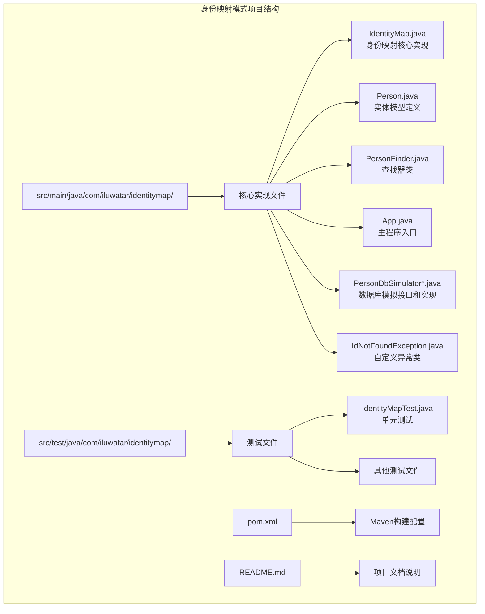
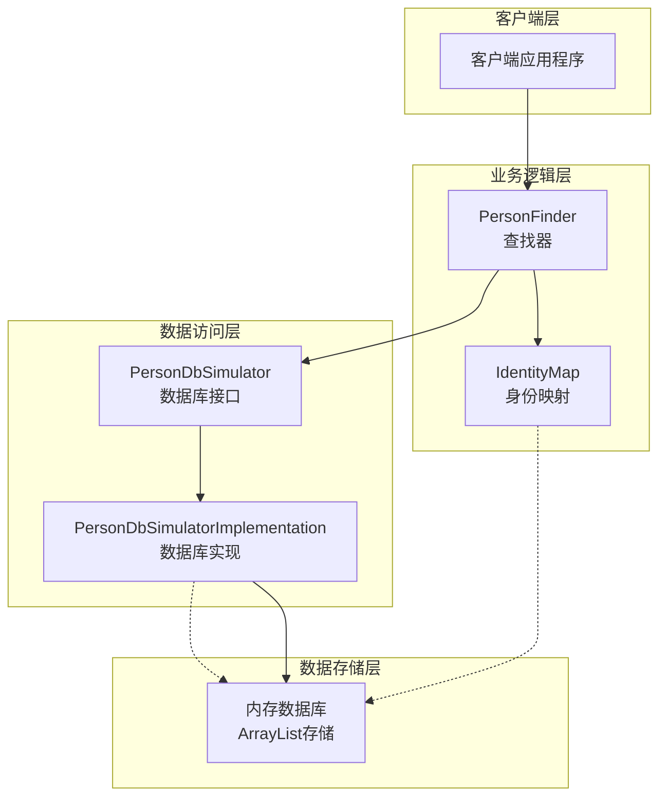
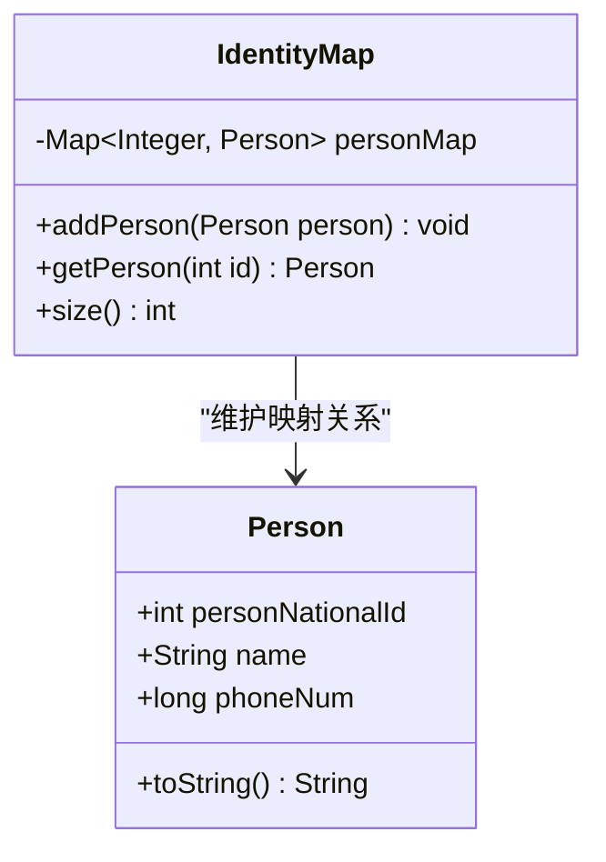
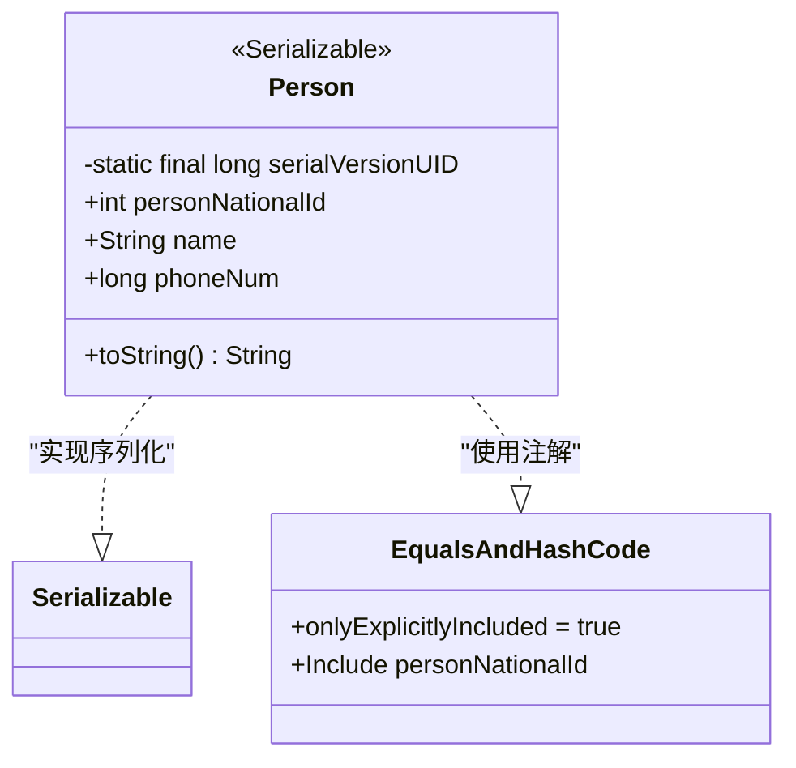
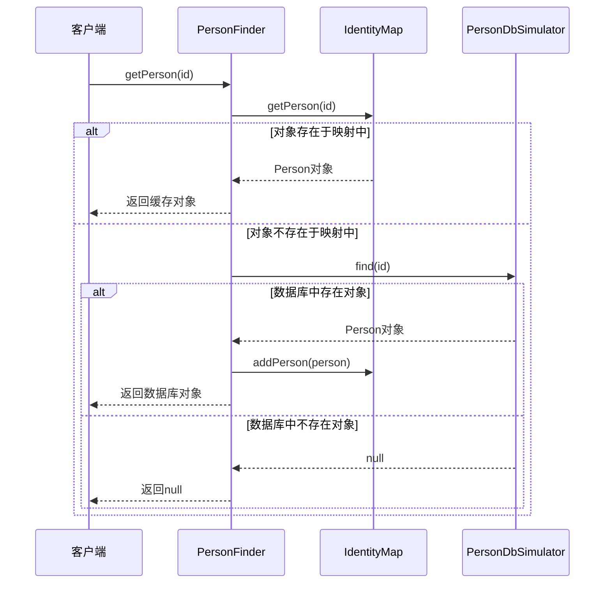
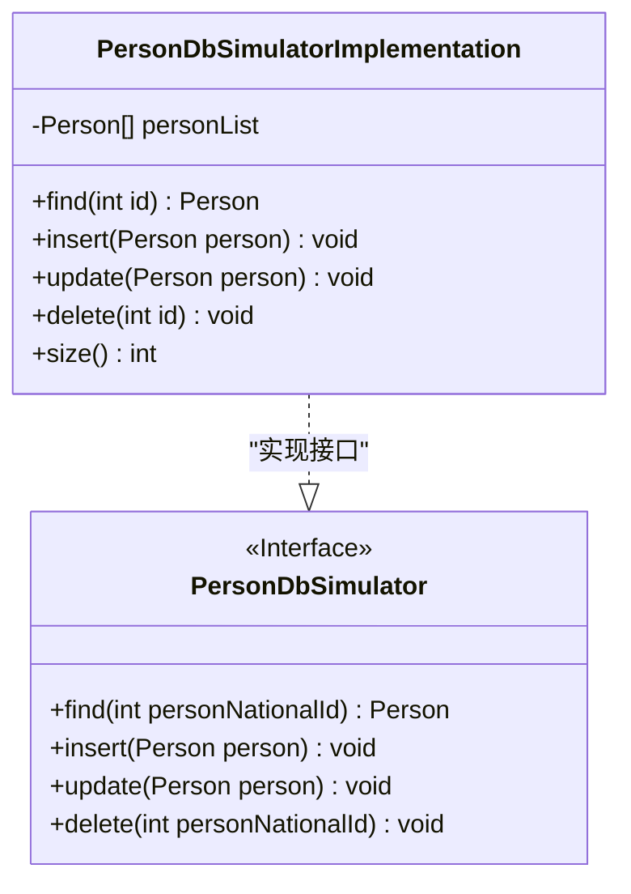
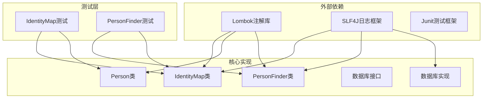
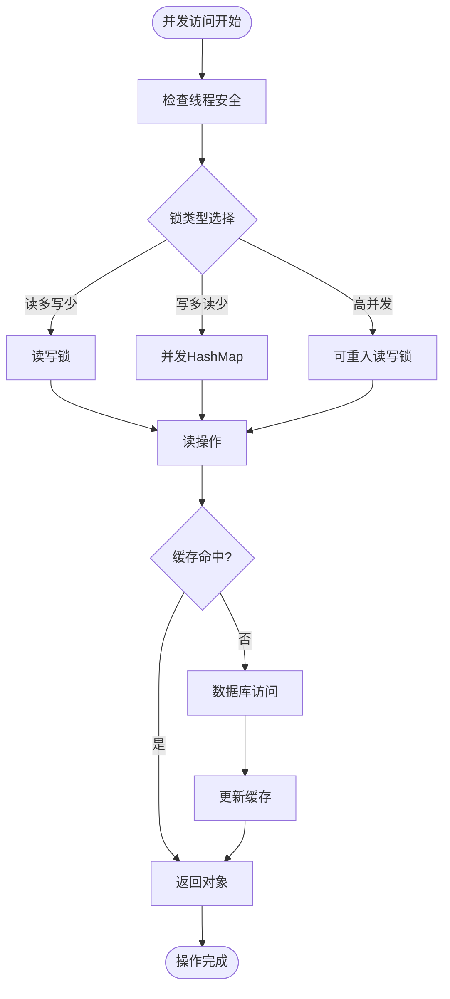
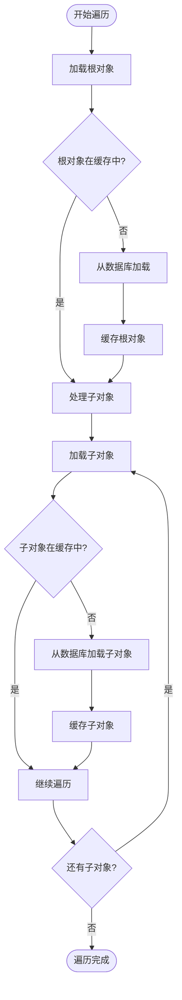

# 身份映射模式

<cite>
**本文档中引用的文件**
- [IdentityMap.java](file://identity-map/src/main/java/com/iluwatar/identitymap/IdentityMap.java)
- [Person.java](file://identity-map/src/main/java/com/iluwatar/identitymap/Person.java)
- [PersonFinder.java](file://identity-map/src/main/java/com/iluwatar/identitymap/PersonFinder.java)
- [App.java](file://identity-map/src/main/java/com/iluwatar/identitymap/App.java)
- [PersonDbSimulator.java](file://identity-map/src/main/java/com/iluwatar/identitymap/PersonDbSimulator.java)
- [PersonDbSimulatorImplementation.java](file://identity-map/src/main/java/com/iluwatar/identitymap/PersonDbSimulatorImplementation.java)
- [IdNotFoundException.java](file://identity-map/src/main/java/com/iluwatar/identitymap/IdNotFoundException.java)
- [IdentityMapTest.java](file://identity-map/src/test/java/com/iluwatar/identitymap/IdentityMapTest.java)
- [README.md](file://identity-map/README.md)
- [pom.xml](file://identity-map/pom.xml)
</cite>

## 目录
1. [简介](#简介)
2. [项目结构](#项目结构)
3. [核心组件](#核心组件)
4. [架构概览](#架构概览)
5. [详细组件分析](#详细组件分析)
6. [依赖关系分析](#依赖关系分析)
7. [性能考虑](#性能考虑)
8. [故障排除指南](#故障排除指南)
9. [结论](#结论)
10. [扩展应用](#扩展应用)

## 简介

身份映射模式（Identity Map Pattern）是Java设计模式中的一个重要行为模式，旨在确保每个唯一对象只被加载一次，并在整个应用程序的内存中保持对象的唯一性。该模式通过维护一个中央注册表（映射表）来防止重复的对象实例，从而提高数据库访问性能并保持数据一致性。

在企业级应用程序中，身份映射模式特别重要，因为它能够：
- 避免重复加载相同的数据，减少数据库查询次数
- 维护对象引用的一致性，防止数据不一致问题
- 提高内存使用效率，避免重复存储相同的对象
- 改善应用程序的整体性能表现

## 项目结构

身份映射模式示例项目采用标准的Maven项目结构，包含完整的实现和测试代码：



**图表来源**
- [IdentityMap.java](file://identity-map/src/main/java/com/iluwatar/identitymap/IdentityMap.java#L1-L77)
- [Person.java](file://identity-map/src/main/java/com/iluwatar/identitymap/Person.java#L1-L59)
- [PersonFinder.java](file://identity-map/src/main/java/com/iluwatar/identitymap/PersonFinder.java#L1-L70)

**章节来源**
- [pom.xml](file://identity-map/pom.xml#L1-L70)
- [README.md](file://identity-map/README.md#L1-L218)

## 核心组件

身份映射模式的核心由以下关键组件构成：

### 1. IdentityMap类
这是身份映射模式的核心实现，负责维护对象的唯一性映射关系。

### 2. Person实体类
代表应用程序中的业务实体，具有唯一标识符和相关属性。

### 3. PersonFinder查找器
协调数据库访问和身份映射逻辑，提供统一的查询接口。

### 4. 数据库模拟层
提供抽象的数据库操作接口，支持查找、插入、更新和删除操作。

**章节来源**
- [IdentityMap.java](file://identity-map/src/main/java/com/iluwatar/identitymap/IdentityMap.java#L32-L77)
- [Person.java](file://identity-map/src/main/java/com/iluwatar/identitymap/Person.java#L34-L59)
- [PersonFinder.java](file://identity-map/src/main/java/com/iluwatar/identitymap/PersonFinder.java#L31-L70)

## 架构概览

身份映射模式的架构设计体现了清晰的关注点分离和职责分配：



**图表来源**
- [PersonFinder.java](file://identity-map/src/main/java/com/iluwatar/identitymap/PersonFinder.java#L31-L70)
- [IdentityMap.java](file://identity-map/src/main/java/com/iluwatar/identitymap/IdentityMap.java#L32-L77)
- [PersonDbSimulatorImplementation.java](file://identity-map/src/main/java/com/iluwatar/identitymap/PersonDbSimulatorImplementation.java#L32-L108)

## 详细组件分析

### IdentityMap类深度分析

IdentityMap类是身份映射模式的核心实现，采用了简单而有效的HashMap数据结构来维护对象映射关系。

#### 类设计特点



**图表来源**
- [IdentityMap.java](file://identity-map/src/main/java/com/iluwatar/identitymap/IdentityMap.java#L38-L77)
- [Person.java](file://identity-map/src/main/java/com/iluwatar/identitymap/Person.java#L41-L59)

#### 关键方法实现

1. **addPerson方法**：添加新对象到映射表中，使用personNationalId作为键
2. **getPerson方法**：从映射表中检索对象，如果不存在则返回null
3. **size方法**：返回映射表中对象的数量

#### 设计决策分析

- 使用HashMap确保O(1)时间复杂度的查找性能
- 键值使用personNationalId而非对象引用，确保基于业务标识符的唯一性
- 添加了重复添加检查，虽然在当前实现中不会触发

**章节来源**
- [IdentityMap.java](file://identity-map/src/main/java/com/iluwatar/identitymap/IdentityMap.java#L40-L74)

### Person实体类分析

Person类作为业务实体，采用了现代Java的最佳实践：

#### 实体设计特征



**图表来源**
- [Person.java](file://identity-map/src/main/java/com/iluwatar/identitymap/Person.java#L37-L59)

#### 关键设计元素

1. **序列化支持**：实现Serializable接口，支持对象持久化
2. **相等性比较**：使用@EqualsAndHashCode注解，仅基于personNationalId进行比较
3. **不可变性**：使用@AllArgsConstructor创建final类，确保数据完整性

**章节来源**
- [Person.java](file://identity-map/src/main/java/com/iluwatar/identitymap/Person.java#L34-L59)

### PersonFinder查找器分析

PersonFinder类协调了身份映射和数据库访问逻辑：

#### 查找流程



**图表来源**
- [PersonFinder.java](file://identity-map/src/main/java/com/iluwatar/identitymap/PersonFinder.java#L51-L68)

#### 核心逻辑分析

1. **缓存优先策略**：首先检查身份映射表，避免不必要的数据库访问
2. **透明缓存机制**：如果数据库中找到对象，自动将其添加到映射表中
3. **错误处理**：优雅处理不存在的标识符，返回null而不是抛出异常

**章节来源**
- [PersonFinder.java](file://identity-map/src/main/java/com/iluwatar/identitymap/PersonFinder.java#L31-L70)

### 数据库模拟层分析

数据库模拟层提供了抽象的数据库操作接口：

#### 接口设计



**图表来源**
- [PersonDbSimulator.java](file://identity-map/src/main/java/com/iluwatar/identitymap/PersonDbSimulator.java#L27-L40)
- [PersonDbSimulatorImplementation.java](file://identity-map/src/main/java/com/iluwatar/identitymap/PersonDbSimulatorImplementation.java#L32-L108)

#### 实现特点

1. **内存存储**：使用ArrayList模拟数据库表
2. **流式查询**：使用Java 8 Stream API进行数据过滤
3. **异常处理**：对于不存在的记录抛出IdNotFoundException

**章节来源**
- [PersonDbSimulator.java](file://identity-map/src/main/java/com/iluwatar/identitymap/PersonDbSimulator.java#L27-L40)
- [PersonDbSimulatorImplementation.java](file://identity-map/src/main/java/com/iluwatar/identitymap/PersonDbSimulatorImplementation.java#L32-L108)

## 依赖关系分析

身份映射模式的依赖关系体现了清晰的层次结构和关注点分离：



**图表来源**
- [pom.xml](file://identity-map/pom.xml#L38-L49)
- [IdentityMap.java](file://identity-map/src/main/java/com/iluwatar/identitymap/IdentityMap.java#L27-L30)
- [Person.java](file://identity-map/src/main/java/com/iluwatar/identitymap/Person.java#L27-L32)

**章节来源**
- [pom.xml](file://identity-map/pom.xml#L38-L49)

## 性能考虑

身份映射模式在性能方面具有显著优势，但也需要考虑一些潜在的性能影响：

### 内存使用优化

1. **对象复用**：通过身份映射避免重复创建相同标识符的对象
2. **缓存策略**：根据应用程序的访问模式调整缓存大小
3. **垃圾回收**：及时清理不再使用的对象引用

### 并发访问处理



### 缓存失效策略

1. **时间驱动失效**：设置对象的生存时间
2. **大小限制**：当缓存达到阈值时清除最旧的对象
3. **手动失效**：在数据更新时主动清除相关缓存

## 故障排除指南

### 常见问题及解决方案

#### 1. 对象不一致问题

**问题描述**：多个线程同时修改同一个对象的不同副本

**解决方案**：
- 确保所有对象访问都通过PersonFinder进行
- 在高并发环境中使用适当的同步机制

#### 2. 内存泄漏问题

**问题描述**：身份映射表不断增长导致内存不足

**解决方案**：
- 实现缓存大小限制
- 定期清理长时间未使用的对象
- 使用弱引用或软引用策略

#### 3. 数据陈旧问题

**问题描述**：缓存中的数据与数据库中的最新数据不一致

**解决方案**：
- 实现缓存失效机制
- 在数据更新后主动清除相关缓存
- 使用版本号或时间戳进行验证

**章节来源**
- [IdNotFoundException.java](file://identity-map/src/main/java/com/iluwatar/identitymap/IdNotFoundException.java#L27-L35)

## 结论

身份映射模式是一个简洁而强大的设计模式，它通过维护对象的唯一性映射关系，在提高应用程序性能的同时确保数据一致性。该模式的核心价值在于：

1. **性能提升**：通过缓存避免重复的数据库访问
2. **内存优化**：确保每个对象只在内存中存在一份
3. **一致性保证**：防止数据不一致问题的发生
4. **透明性**：对上层应用程序完全透明

在实际应用中，身份映射模式通常与其他设计模式结合使用，如数据映射器模式、工作单元模式等，形成更完整的数据访问层架构。

## 扩展应用

### 与ORM框架的集成

身份映射模式与Hibernate等ORM框架有天然的契合度：

#### Hibernate集成要点

1. **Session级别的缓存**：利用Hibernate Session的二级缓存机制
2. **实体状态管理**：结合Hibernate的实体状态跟踪功能
3. **事务边界**：在事务边界内维护身份映射的一致性

#### 配置建议

```xml
<!-- Hibernate配置示例 -->
<property name="hibernate.cache.use_second_level_cache">true</property>
<property name="hibernate.cache.use_query_cache">true</property>
<property name="hibernate.cache.region.factory_class">
    org.hibernate.cache.ehcache.EhCacheRegionFactory
</property>
```

### 分布式系统中的应用

在分布式环境中，身份映射模式面临更大的挑战：

#### 挑战分析

1. **缓存一致性**：多节点间的缓存同步问题
2. **网络延迟**：远程数据库访问的性能影响
3. **分区容错**：网络分区情况下的数据一致性

#### 解决方案

1. **分布式缓存**：使用Redis、Memcached等分布式缓存
2. **最终一致性**：接受短暂的数据不一致，通过补偿机制解决
3. **分区策略**：基于业务规则进行数据分区，减少跨分区访问

### 复杂对象图的应用

身份映射模式在处理复杂对象关系时需要特别注意：

#### 对象图遍历策略



#### 最佳实践

1. **延迟加载**：只在需要时加载关联对象
2. **批量加载**：使用批量查询减少数据库访问次数
3. **缓存预热**：在应用程序启动时预加载常用对象

通过合理运用这些策略，身份映射模式可以在复杂的分布式环境中发挥重要作用，为应用程序提供高效、一致的数据访问能力。