# 事件溯源模式

<cite>
**本文档引用的文件**
- [Account.java](file://event-sourcing/src/main/java/com/iluwatar/event/sourcing/domain/Account.java)
- [AccountAggregate.java](file://event-sourcing/src/main/java/com/iluwatar/event/sourcing/state/AccountAggregate.java)
- [DomainEvent.java](file://event-sourcing/src/main/java/com/iluwatar/event/sourcing/event/DomainEvent.java)
- [AccountCreateEvent.java](file://event-sourcing/src/main/java/com/iluwatar/event/sourcing/event/AccountCreateEvent.java)
- [MoneyDepositEvent.java](file://event-sourcing/src/main/java/com/iluwatar/event/sourcing/event/MoneyDepositEvent.java)
- [MoneyTransferEvent.java](file://event-sourcing/src/main/java/com/iluwatar/event/sourcing/event/MoneyTransferEvent.java)
- [DomainEventProcessor.java](file://event-sourcing/src/main/java/com/iluwatar/event/sourcing/processor/DomainEventProcessor.java)
- [EventJournal.java](file://event-sourcing/src/main/java/com/iluwatar/event/sourcing/processor/EventJournal.java)
- [JsonFileJournal.java](file://event-sourcing/src/main/java/com/iluwatar/event/sourcing/processor/JsonFileJournal.java)
- [App.java](file://event-sourcing/src/main/java/com/iluwatar/event/sourcing/app/App.java)
- [IntegrationTest.java](file://event-sourcing/src/test/java/IntegrationTest.java)
- [README.md](file://event-sourcing/README.md)
- [pom.xml](file://event-sourcing/pom.xml)
</cite>

## 目录
1. [引言](#引言)
2. [项目结构](#项目结构)
3. [核心组件](#核心组件)
4. [架构概览](#架构概览)
5. [详细组件分析](#详细组件分析)
6. [依赖关系分析](#依赖关系分析)
7. [性能考虑](#性能考虑)
8. [故障排除指南](#故障排除指南)
9. [结论](#结论)
10. [附录](#附录)

## 引言

事件溯源（Event Sourcing）是一种软件架构模式，它将系统状态的变化记录为一系列不可变的事件序列，而不是直接更新当前状态。这种模式的核心理念是：**所有对系统状态的更改都以事件的形式被记录下来，这些事件构成了系统的唯一真相来源**。

在传统的数据存储方式中，我们通常直接更新数据库中的记录来反映状态变化。而在事件溯源模式中，每次业务操作都会产生一个事件，这些事件被持久化存储在一个专门的事件存储中。系统状态不是直接存储的，而是通过重放这些事件来重建的。

事件溯源模式的主要优势包括：
- **完整的审计追踪**：每个状态变化都有明确的记录
- **状态恢复能力**：可以轻松地从任意时间点重建系统状态
- **历史查询能力**：支持复杂的业务历史分析
- **可观察性增强**：事件提供了丰富的系统行为洞察

## 项目结构

事件溯源模块采用清晰的分层架构，按照功能职责进行组织：

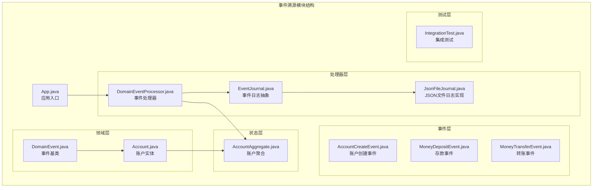

**图表来源**
- [App.java](file://event-sourcing/src/main/java/com/iluwatar/event/sourcing/app/App.java#L54-L113)
- [DomainEventProcessor.java](file://event-sourcing/src/main/java/com/iluwatar/event/sourcing/processor/DomainEventProcessor.java#L35-L69)

**章节来源**
- [pom.xml](file://event-sourcing/pom.xml#L28-L72)

## 核心组件

事件溯源系统由以下核心组件构成：

### 事件存储系统
事件存储负责持久化所有领域事件，提供事件的写入、读取和重放能力。在本实现中，使用JSON文件作为事件存储介质。

### 领域事件模型
定义了不同类型的业务事件，每种事件都包含必要的业务上下文信息，并实现事件处理逻辑。

### 事件处理器
协调事件的处理流程，确保事件被正确处理并持久化到事件存储中。

### 聚合根管理
维护系统当前状态的内存表示，通过事件处理来更新状态。

**章节来源**
- [DomainEvent.java](file://event-sourcing/src/main/java/com/iluwatar/event/sourcing/event/DomainEvent.java#L32-L52)
- [EventJournal.java](file://event-sourcing/src/main/java/com/iluwatar/event/sourcing/processor/EventJournal.java#L31-L61)

## 架构概览

事件溯源系统的整体架构遵循事件驱动的设计原则：

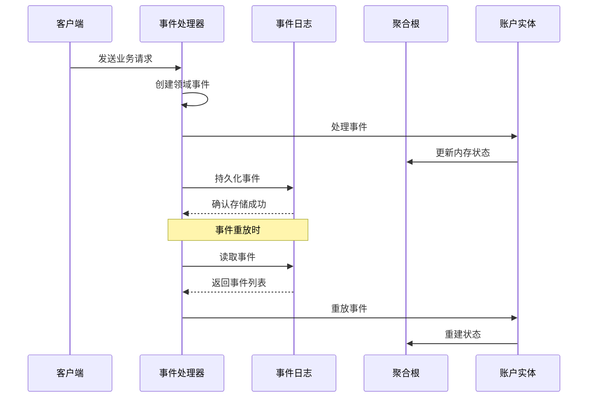

**图表来源**
- [DomainEventProcessor.java](file://event-sourcing/src/main/java/com/iluwatar/event/sourcing/processor/DomainEventProcessor.java#L48-L68)
- [JsonFileJournal.java](file://event-sourcing/src/main/java/com/iluwatar/event/sourcing/processor/JsonFileJournal.java#L82-L124)

该架构的关键特点：
1. **事件驱动**：所有状态变更都通过事件触发
2. **持久化分离**：事件存储与内存状态管理分离
3. **可重放性**：事件可以按顺序重放以重建状态
4. **异步处理**：事件处理可以异步进行

## 详细组件分析

### 事件模型设计

事件模型采用面向对象的设计，所有事件都继承自统一的基类：

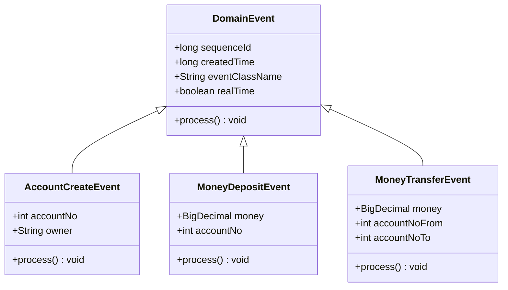

**图表来源**
- [DomainEvent.java](file://event-sourcing/src/main/java/com/iluwatar/event/sourcing/event/DomainEvent.java#L37-L52)
- [AccountCreateEvent.java](file://event-sourcing/src/main/java/com/iluwatar/event/sourcing/event/AccountCreateEvent.java#L41-L72)
- [MoneyDepositEvent.java](file://event-sourcing/src/main/java/com/iluwatar/event/sourcing/event/MoneyDepositEvent.java#L42-L70)
- [MoneyTransferEvent.java](file://event-sourcing/src/main/java/com/iluwatar/event/sourcing/event/MoneyTransferEvent.java#L42-L77)

#### 事件序列化机制

事件采用JSON格式进行序列化，支持动态类型识别：

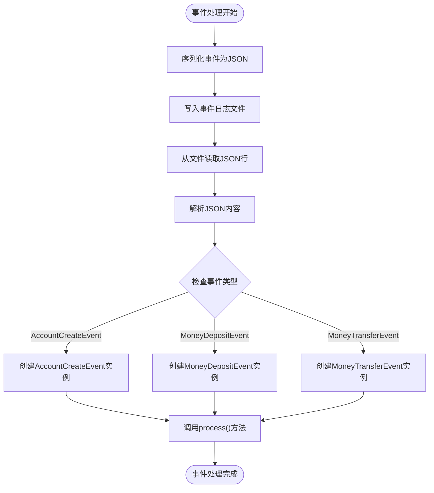

**图表来源**
- [JsonFileJournal.java](file://event-sourcing/src/main/java/com/iluwatar/event/sourcing/processor/JsonFileJournal.java#L82-L124)

**章节来源**
- [AccountCreateEvent.java](file://event-sourcing/src/main/java/com/iluwatar/event/sourcing/event/AccountCreateEvent.java#L54-L71)
- [MoneyDepositEvent.java](file://event-sourcing/src/main/java/com/iluwatar/event/sourcing/event/MoneyDepositEvent.java#L55-L69)
- [MoneyTransferEvent.java](file://event-sourcing/src/main/java/com/iluwatar/event/sourcing/event/MoneyTransferEvent.java#L57-L76)

### 事件处理器实现

事件处理器负责协调事件的完整生命周期：

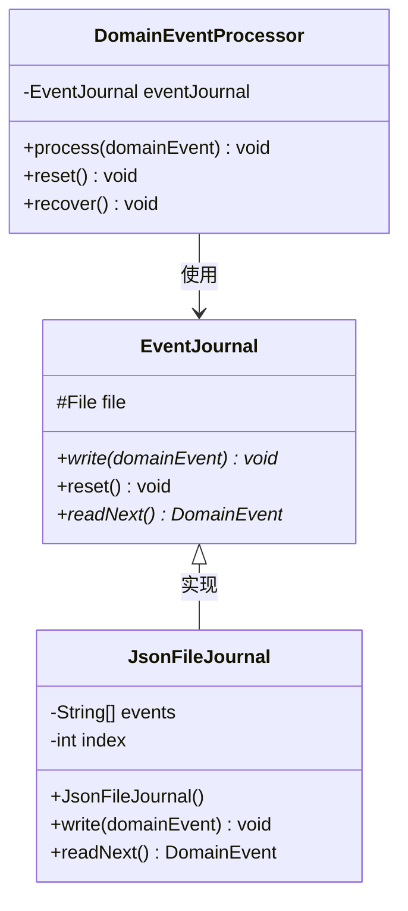

**图表来源**
- [DomainEventProcessor.java](file://event-sourcing/src/main/java/com/iluwatar/event/sourcing/processor/DomainEventProcessor.java#L35-L69)
- [EventJournal.java](file://event-sourcing/src/main/java/com/iluwatar/event/sourcing/processor/EventJournal.java#L35-L61)
- [JsonFileJournal.java](file://event-sourcing/src/main/java/com/iluwatar/event/sourcing/processor/JsonFileJournal.java#L51-L74)

#### 事件处理流程

事件处理遵循严格的顺序执行模式：

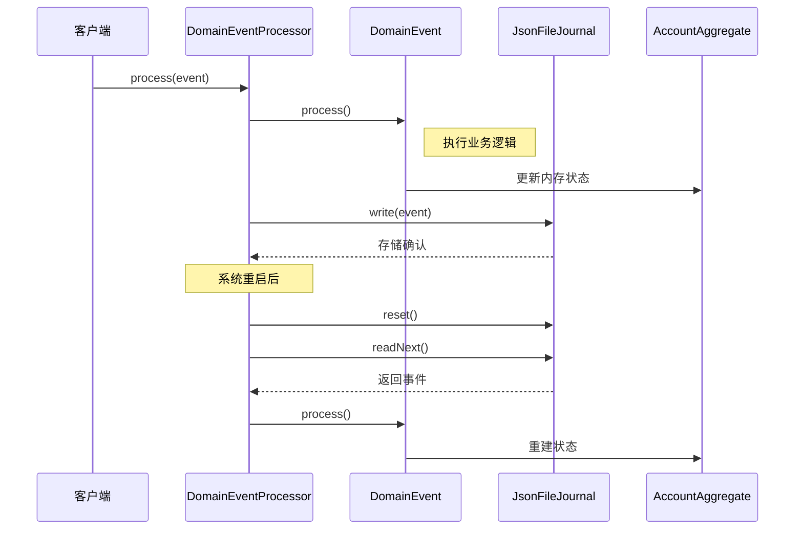

**图表来源**
- [DomainEventProcessor.java](file://event-sourcing/src/main/java/com/iluwatar/event/sourcing/processor/DomainEventProcessor.java#L48-L68)
- [JsonFileJournal.java](file://event-sourcing/src/main/java/com/iluwatar/event/sourcing/processor/JsonFileJournal.java#L59-L74)

**章节来源**
- [DomainEventProcessor.java](file://event-sourcing/src/main/java/com/iluwatar/event/sourcing/processor/DomainEventProcessor.java#L39-L51)
- [JsonFileJournal.java](file://event-sourcing/src/main/java/com/iluwatar/event/sourcing/processor/JsonFileJournal.java#L82-L92)

### 账户系统实现

账户系统展示了事件溯源在实际业务场景中的应用：

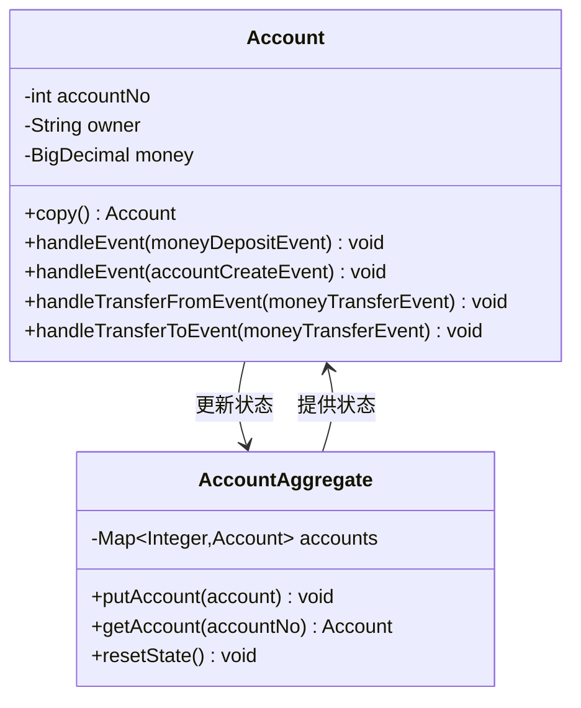

**图表来源**
- [Account.java](file://event-sourcing/src/main/java/com/iluwatar/event/sourcing/domain/Account.java#L48-L146)
- [AccountAggregate.java](file://event-sourcing/src/main/java/com/iluwatar/event/sourcing/state/AccountAggregate.java#L37-L72)

#### 业务逻辑处理

账户实体实现了具体的业务逻辑处理：

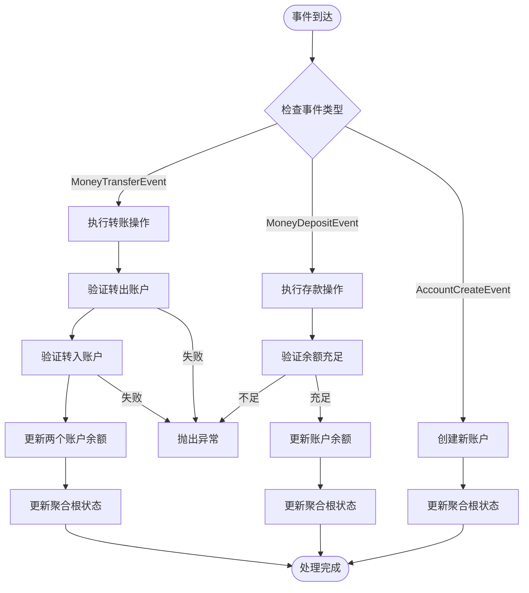

**图表来源**
- [Account.java](file://event-sourcing/src/main/java/com/iluwatar/event/sourcing/domain/Account.java#L110-L143)

**章节来源**
- [Account.java](file://event-sourcing/src/main/java/com/iluwatar/event/sourcing/domain/Account.java#L77-L103)
- [AccountAggregate.java](file://event-sourcing/src/main/java/com/iluwatar/event/sourcing/state/AccountAggregate.java#L49-L64)

### 应用示例演示

应用程序展示了完整的事件溯源工作流程：

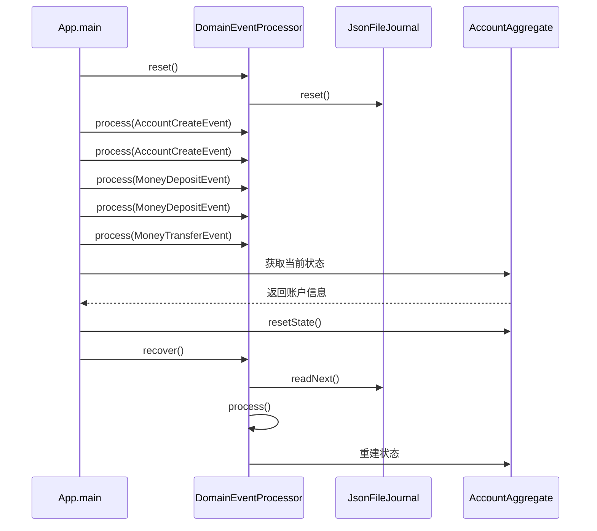

**图表来源**
- [App.java](file://event-sourcing/src/main/java/com/iluwatar/event/sourcing/app/App.java#L70-L112)

**章节来源**
- [App.java](file://event-sourcing/src/main/java/com/iluwatar/event/sourcing/app/App.java#L78-L95)

## 依赖关系分析

事件溯源模块的依赖关系相对简单，主要依赖于Jackson库进行JSON序列化：

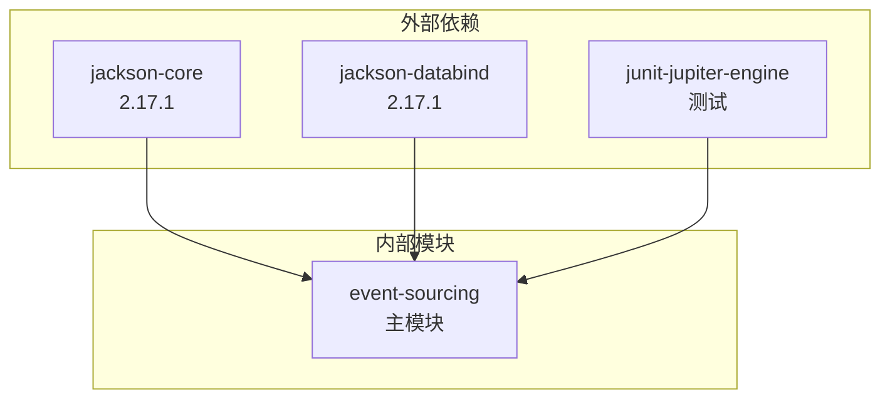

**图表来源**
- [pom.xml](file://event-sourcing/pom.xml#L36-L52)

**章节来源**
- [pom.xml](file://event-sourcing/pom.xml#L42-L51)

## 性能考虑

事件溯源模式在性能方面有其独特的考量：

### 事件存储性能
- **写入性能**：事件存储采用追加写入模式，具有良好的写入性能
- **读取性能**：重放事件需要顺序读取，可能影响启动时间
- **存储空间**：事件存储会持续增长，需要定期清理策略

### 内存管理
- **状态重建**：系统重启时需要重放所有事件来重建状态
- **内存占用**：聚合根状态完全驻留在内存中
- **垃圾回收**：频繁的状态更新会产生较多的对象分配

### 并发处理
- **线程安全**：当前实现未考虑多线程并发处理
- **事务一致性**：事件处理与状态更新的一致性保证

## 故障排除指南

### 常见问题及解决方案

#### 事件重放失败
**问题描述**：系统重启后无法正确重放事件
**可能原因**：
- 事件文件损坏或格式错误
- 事件类版本不兼容
- 依赖服务不可用

**解决步骤**：
1. 检查Journal.json文件完整性
2. 验证事件序列号连续性
3. 确认事件类定义匹配

#### 状态不一致
**问题描述**：重放后的状态与预期不符
**可能原因**：
- 事件处理逻辑错误
- 事件顺序被打乱
- 并发访问导致的竞争条件

**解决步骤**：
1. 检查事件处理的幂等性
2. 验证事件序列号的正确性
3. 实施适当的并发控制

#### 性能问题
**问题描述**：系统启动时间过长
**可能原因**：
- 事件数量过多
- 事件处理逻辑复杂
- 存储I/O瓶颈

**优化建议**：
1. 实施事件快照机制
2. 优化事件处理算法
3. 使用更高效的存储方案

**章节来源**
- [IntegrationTest.java](file://event-sourcing/src/test/java/IntegrationTest.java#L64-L98)

## 结论

事件溯源模式为构建可审计、可恢复、可扩展的系统提供了强大的架构基础。通过将所有状态变化记录为不可变事件，系统获得了前所未有的透明度和可追溯性。

### 主要优势
- **完整的审计追踪**：每个业务操作都有明确的记录
- **强大的恢复能力**：可以从任意时间点重建系统状态
- **灵活的历史分析**：支持复杂的业务历史查询
- **高可扩展性**：事件驱动架构天然支持分布式处理

### 实践建议
1. **渐进式采用**：从简单的业务场景开始，逐步扩展到复杂系统
2. **事件版本管理**：建立完善的事件版本控制机制
3. **性能监控**：持续监控事件存储和处理性能
4. **容错设计**：实现完善的错误处理和恢复机制

### 未来发展方向
- **事件快照**：定期创建系统状态快照以优化重放性能
- **事件压缩**：实现事件的压缩和归档策略
- **分布式事件流**：支持跨系统的事件传播和同步
- **实时处理**：结合流处理框架实现实时事件处理

## 附录

### 快速开始指南

#### 环境要求
- Java 8 或更高版本
- Maven 3.6 或更高版本

#### 编译运行
```bash
# 编译项目
mvn clean compile

# 运行示例程序
mvn exec:java -Dexec.mainClass="com.iluwatar.event.sourcing.app.App"

# 运行单元测试
mvn test
```

#### 事件存储位置
事件默认存储在项目根目录下的`Journal.json`文件中。

### 集成测试说明

集成测试验证了事件溯源的核心功能：

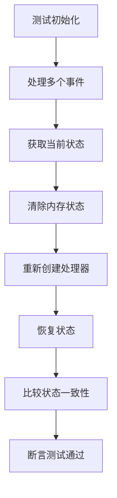

**图表来源**
- [IntegrationTest.java](file://event-sourcing/src/test/java/IntegrationTest.java#L64-L98)

**章节来源**
- [IntegrationTest.java](file://event-sourcing/src/test/java/IntegrationTest.java#L46-L98)