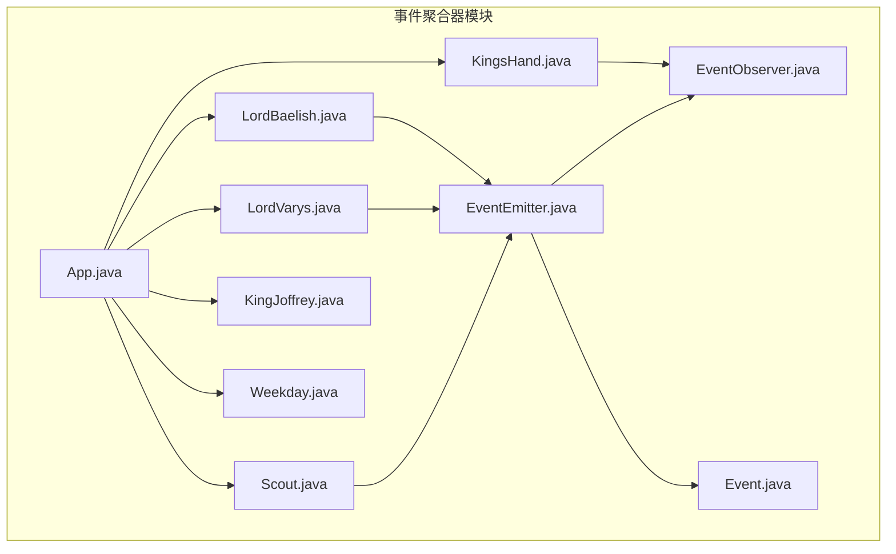
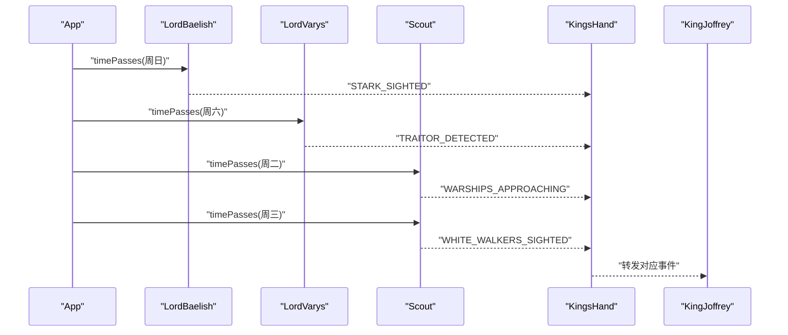
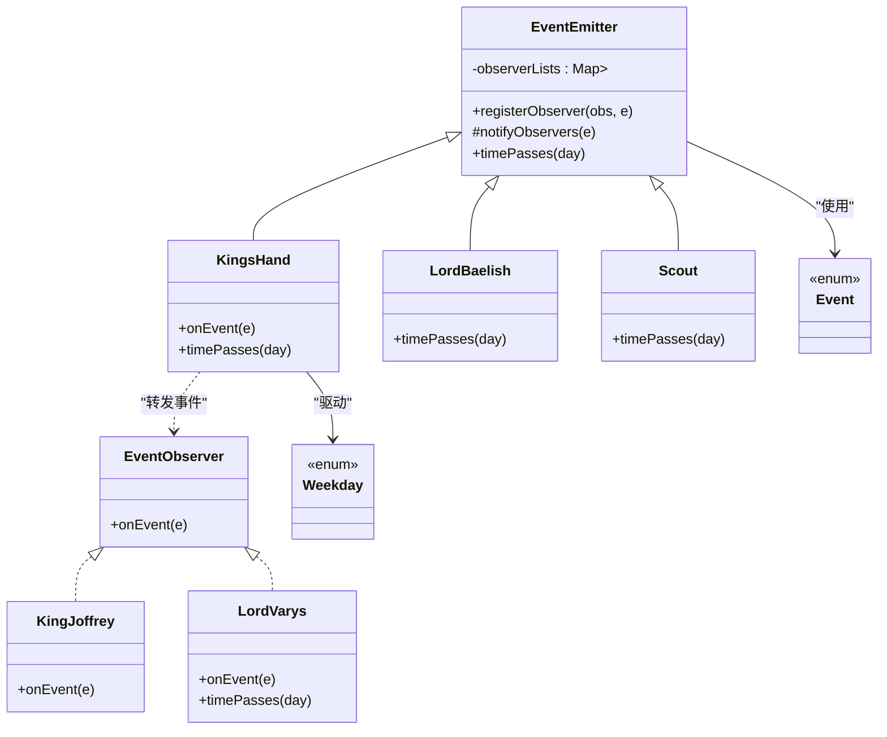
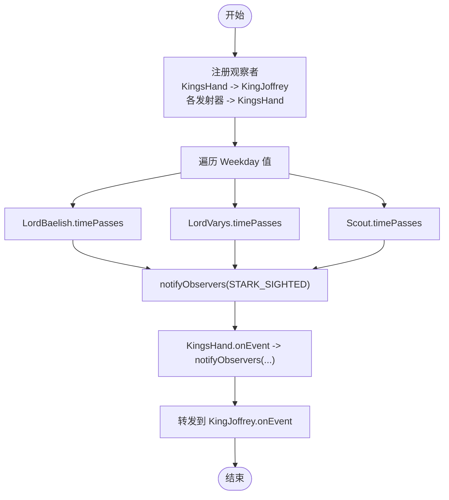
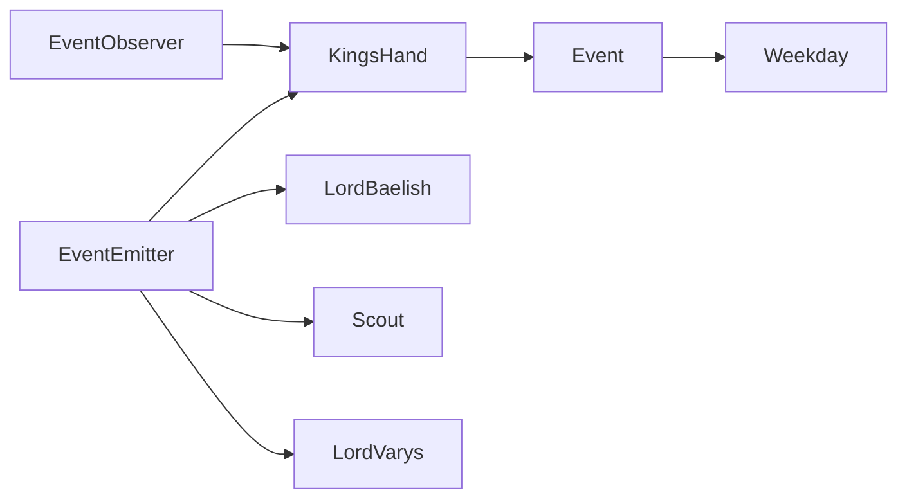
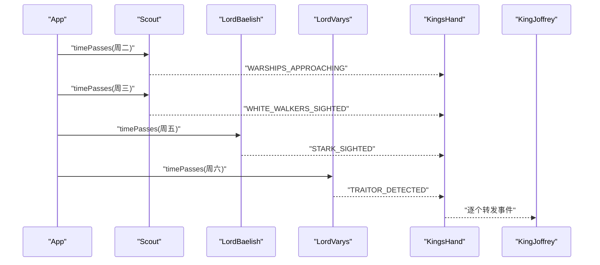

# 事件聚合器模式

<cite>
**本文引用的文件**
- [App.java](file://event-aggregator/src/main/java/com/iluwatar/event/aggregator/App.java)
- [Event.java](file://event-aggregator/src/main/java/com/iluwatar/event/aggregator/Event.java)
- [EventEmitter.java](file://event-aggregator/src/main/java/com/iluwatar/event/aggregator/EventEmitter.java)
- [EventObserver.java](file://event-aggregator/src/main/java/com/iluwatar/event/aggregator/EventObserver.java)
- [KingJoffrey.java](file://event-aggregator/src/main/java/com/iluwatar/event/aggregator/KingJoffrey.java)
- [KingsHand.java](file://event-aggregator/src/main/java/com/iluwatar/event/aggregator/KingsHand.java)
- [LordBaelish.java](file://event-aggregator/src/main/java/com/iluwatar/event/aggregator/LordBaelish.java)
- [LordVarys.java](file://event-aggregator/src/main/java/com/iluwatar/event/aggregator/LordVarys.java)
- [Scout.java](file://event-aggregator/src/main/java/com/iluwatar/event/aggregator/Scout.java)
- [Weekday.java](file://event-aggregator/src/main/java/com/iluwatar/event/aggregator/Weekday.java)
</cite>

## 目录
1. [引言](#引言)
2. [项目结构](#项目结构)
3. [核心组件](#核心组件)
4. [架构总览](#架构总览)
5. [组件详解](#组件详解)
6. [依赖关系分析](#依赖关系分析)
7. [性能与并发特性](#性能与并发特性)
8. [故障排查指南](#故障排查指南)
9. [结论](#结论)
10. [附录：维斯特洛政治体系示例](#附录维斯特洛政治体系示例)

## 引言
本指南围绕事件聚合器模式展开，系统阐述其在事件驱动系统中的作用与实现机制。通过维斯特洛王国政治体系的生动示例，展示事件发射器、观察者与事件聚合的协作方式；解释事件聚合器如何简化订阅管理、降低事件风暴影响并提升可维护性；并给出性能优化、内存管理与并发安全的实践建议。

## 项目结构
事件聚合器示例位于 event-aggregator 模块中，采用按功能分层的组织方式：
- 核心接口与抽象类：EventObserver、EventEmitter
- 事件定义：Event（枚举）
- 具体角色与场景：KingJoffrey（观察者）、KingsHand（事件聚合器）、LordBaelish/LordVarys/Scout（事件发射器）、Weekday（时间维度）
- 示例入口：App（演示事件流）

**图示来源**
- [App.java](file://event-aggregator/src/main/java/com/iluwatar/event/aggregator/App.java#L31-L80)
- [EventEmitter.java](file://event-aggregator/src/main/java/com/iluwatar/event/aggregator/EventEmitter.java#L35-L72)
- [EventObserver.java](file://event-aggregator/src/main/java/com/iluwatar/event/aggregator/EventObserver.java#L30-L34)
- [Event.java](file://event-aggregator/src/main/java/com/iluwatar/event/aggregator/Event.java#L33-L46)
- [KingJoffrey.java](file://event-aggregator/src/main/java/com/iluwatar/event/aggregator/KingJoffrey.java#L33-L39)
- [KingsHand.java](file://event-aggregator/src/main/java/com/iluwatar/event/aggregator/KingsHand.java#L30-L47)
- [LordBaelish.java](file://event-aggregator/src/main/java/com/iluwatar/event/aggregator/LordBaelish.java#L30-L45)
- [LordVarys.java](file://event-aggregator/src/main/java/com/iluwatar/event/aggregator/LordVarys.java#L33-L54)
- [Scout.java](file://event-aggregator/src/main/java/com/iluwatar/event/aggregator/Scout.java#L30-L48)
- [Weekday.java](file://event-aggregator/src/main/java/com/iluwatar/event/aggregator/Weekday.java#L33-L49)

**章节来源**
- [App.java](file://event-aggregator/src/main/java/com/iluwatar/event/aggregator/App.java#L31-L80)

## 核心组件
- 事件接口与抽象基类
  - EventObserver：观察者回调接口，定义 onEvent 方法。
  - EventEmitter：事件发射器基类，负责注册观察者、维护事件到观察者列表的映射，并统一通知逻辑。
- 事件类型
  - Event 枚举定义了具体事件（如白 Walkers 出现、史塔克出现、战舰接近、叛徒被发现）。
- 角色与职责
  - KingJoffrey：最终接收者，仅实现观察者接口。
  - KingsHand：事件聚合器，既作为观察者接收来自多个发射器的事件，又作为发射器向 KingJoffrey 转发事件。
  - LordBaelish/LordVarys/Scout：事件发射器，基于时间推进产生特定事件。
  - Weekday：时间维度枚举，驱动事件发射节奏。

**章节来源**
- [EventObserver.java](file://event-aggregator/src/main/java/com/iluwatar/event/aggregator/EventObserver.java#L30-L34)
- [EventEmitter.java](file://event-aggregator/src/main/java/com/iluwatar/event/aggregator/EventEmitter.java#L35-L72)
- [Event.java](file://event-aggregator/src/main/java/com/iluwatar/event/aggregator/Event.java#L33-L46)
- [KingJoffrey.java](file://event-aggregator/src/main/java/com/iluwatar/event/aggregator/KingJoffrey.java#L33-L39)
- [KingsHand.java](file://event-aggregator/src/main/java/com/iluwatar/event/aggregator/KingsHand.java#L30-L47)
- [LordBaelish.java](file://event-aggregator/src/main/java/com/iluwatar/event/aggregator/LordBaelish.java#L30-L45)
- [LordVarys.java](file://event-aggregator/src/main/java/com/iluwatar/event/aggregator/LordVarys.java#L33-L54)
- [Scout.java](file://event-aggregator/src/main/java/com/iluwatar/event/aggregator/Scout.java#L30-L48)
- [Weekday.java](file://event-aggregator/src/main/java/com/iluwatar/event/aggregator/Weekday.java#L33-L49)

## 架构总览
事件聚合器模式通过“单一聚合点”降低客户端订阅复杂度：客户端只需关注 KingsHand，由其统一对多地转发事件。下图展示了从时间推进到事件传播的关键流程。

**图示来源**
- [App.java](file://event-aggregator/src/main/java/com/iluwatar/event/aggregator/App.java#L50-L80)
- [LordBaelish.java](file://event-aggregator/src/main/java/com/iluwatar/event/aggregator/LordBaelish.java#L40-L44)
- [LordVarys.java](file://event-aggregator/src/main/java/com/iluwatar/event/aggregator/LordVarys.java#L43-L47)
- [Scout.java](file://event-aggregator/src/main/java/com/iluwatar/event/aggregator/Scout.java#L40-L47)
- [KingsHand.java](file://event-aggregator/src/main/java/com/iluwatar/event/aggregator/KingsHand.java#L40-L42)
- [KingJoffrey.java](file://event-aggregator/src/main/java/com/iluwatar/event/aggregator/KingJoffrey.java#L36-L38)

## 组件详解

### 类关系与继承结构

**图示来源**
- [EventObserver.java](file://event-aggregator/src/main/java/com/iluwatar/event/aggregator/EventObserver.java#L30-L34)
- [EventEmitter.java](file://event-aggregator/src/main/java/com/iluwatar/event/aggregator/EventEmitter.java#L35-L72)
- [KingJoffrey.java](file://event-aggregator/src/main/java/com/iluwatar/event/aggregator/KingJoffrey.java#L33-L39)
- [KingsHand.java](file://event-aggregator/src/main/java/com/iluwatar/event/aggregator/KingsHand.java#L30-L47)
- [LordBaelish.java](file://event-aggregator/src/main/java/com/iluwatar/event/aggregator/LordBaelish.java#L30-L45)
- [LordVarys.java](file://event-aggregator/src/main/java/com/iluwatar/event/aggregator/LordVarys.java#L33-L54)
- [Scout.java](file://event-aggregator/src/main/java/com/iluwatar/event/aggregator/Scout.java#L30-L48)
- [Event.java](file://event-aggregator/src/main/java/com/iluwatar/event/aggregator/Event.java#L33-L46)
- [Weekday.java](file://event-aggregator/src/main/java/com/iluwatar/event/aggregator/Weekday.java#L33-L49)

### 关键流程：事件发射与聚合
- 注册阶段：客户端为 KingJoffrey 在 KingsHand 上注册多种事件；同时为各发射器配置转发目标。
- 推进阶段：按周内每一天调用 timePasses，触发相应发射器产生事件。
- 聚合阶段：KingsHand 收到事件后统一通知最终观察者 KingJoffrey。

**图示来源**
- [App.java](file://event-aggregator/src/main/java/com/iluwatar/event/aggregator/App.java#L50-L80)
- [LordBaelish.java](file://event-aggregator/src/main/java/com/iluwatar/event/aggregator/LordBaelish.java#L40-L44)
- [LordVarys.java](file://event-aggregator/src/main/java/com/iluwatar/event/aggregator/LordVarys.java#L43-L47)
- [Scout.java](file://event-aggregator/src/main/java/com/iluwatar/event/aggregator/Scout.java#L40-L47)
- [KingsHand.java](file://event-aggregator/src/main/java/com/iluwatar/event/aggregator/KingsHand.java#L40-L42)
- [KingJoffrey.java](file://event-aggregator/src/main/java/com/iluwatar/event/aggregator/KingJoffrey.java#L36-L38)

### 维斯特洛政治体系示例（角色与事件）
- 白 Walkers 出现：Scout 在周三报告，KingsHand 转发给 KingJoffrey。
- 史塔克出现：LordBaelish 在周五报告，KingsHand 转发给 KingJoffrey。
- 战舰接近：Scout 在周二报告，KingsHand 转发给 KingJoffrey。
- 叛徒被发现：LordVarys 在周六报告，KingsHand 转发给 KingJoffrey。

该示例清晰体现了“多源输入、单一聚合、统一输出”的模式优势：客户端无需直接对接多个发射器，只需订阅 KingsHand 即可获得全量事件。

**章节来源**
- [App.java](file://event-aggregator/src/main/java/com/iluwatar/event/aggregator/App.java#L50-L80)
- [Scout.java](file://event-aggregator/src/main/java/com/iluwatar/event/aggregator/Scout.java#L40-L47)
- [LordBaelish.java](file://event-aggregator/src/main/java/com/iluwatar/event/aggregator/LordBaelish.java#L40-L44)
- [LordVarys.java](file://event-aggregator/src/main/java/com/iluwatar/event/aggregator/LordVarys.java#L43-L47)
- [KingsHand.java](file://event-aggregator/src/main/java/com/iluwatar/event/aggregator/KingsHand.java#L40-L42)
- [KingJoffrey.java](file://event-aggregator/src/main/java/com/iluwatar/event/aggregator/KingJoffrey.java#L36-L38)

## 依赖关系分析
- 组件耦合
  - KingsHand 对 EventObserver 的依赖是稳定的，用于向上游转发事件。
  - 各发射器对 EventEmitter 的继承带来一致的通知语义，便于替换与扩展。
- 外部依赖
  - 使用 Lombok 注解简化日志与构造代码（如 @Slf4j、@RequiredArgsConstructor）。
  - 日志框架用于运行时输出事件到达信息。
- 潜在循环与风险
  - 当前设计中，EventEmitter 仅单向通知下游，未见循环依赖。
  - 若未来引入双向链路（如观察者再注册其他发射器），需谨慎避免环形依赖。

**图示来源**
- [EventObserver.java](file://event-aggregator/src/main/java/com/iluwatar/event/aggregator/EventObserver.java#L30-L34)
- [EventEmitter.java](file://event-aggregator/src/main/java/com/iluwatar/event/aggregator/EventEmitter.java#L35-L72)
- [KingsHand.java](file://event-aggregator/src/main/java/com/iluwatar/event/aggregator/KingsHand.java#L30-L47)
- [LordBaelish.java](file://event-aggregator/src/main/java/com/iluwatar/event/aggregator/LordBaelish.java#L30-L45)
- [Scout.java](file://event-aggregator/src/main/java/com/iluwatar/event/aggregator/Scout.java#L30-L48)
- [LordVarys.java](file://event-aggregator/src/main/java/com/iluwatar/event/aggregator/LordVarys.java#L33-L54)
- [Event.java](file://event-aggregator/src/main/java/com/iluwatar/event/aggregator/Event.java#L33-L46)
- [Weekday.java](file://event-aggregator/src/main/java/com/iluwatar/event/aggregator/Weekday.java#L33-L49)

## 性能与并发特性
- 订阅表结构
  - 使用 Map<Event, List<EventObserver>> 维护事件到观察者列表的映射，注册与查询均摊时间复杂度较低。
- 通知路径
  - 通知采用顺序遍历列表的方式，适合中小规模观察者集合；大规模场景可考虑异步或批处理以降低阻塞。
- 并发安全
  - 当前实现未加锁，若存在多线程同时注册/注销或通知，可能出现竞态条件。建议：
    - 使用线程安全容器（如 ConcurrentHashMap + CopyOnWriteArrayList）。
    - 在关键路径上加锁或采用无锁队列+工作线程模型。
- 内存管理
  - 避免重复注册导致列表增长；可在注册前去重。
  - 及时移除不再使用的观察者，防止内存泄漏。
- 分布式扩展
  - 将事件序列化并通过消息中间件（如 Kafka/RabbitMQ）传输，聚合器作为消费者端进行本地转发。
  - 使用分区键确保同一事件类型的顺序性与可扩展性。

[本节为通用指导，不直接分析具体文件]

## 故障排查指南
- 症状：事件未到达 KingJoffrey
  - 检查是否在 App 中为 KingJoffrey 在 KingsHand 上注册了对应事件。
  - 确认发射器的 timePasses 是否在对应 Weekday 被调用。
- 症状：事件风暴导致性能下降
  - 评估观察者数量与通知频率，必要时引入背压、限速或异步处理。
- 症状：多线程下行为异常
  - 为注册/通知过程增加同步控制，或改用线程安全数据结构。
- 症状：内存占用持续上升
  - 审核是否存在未注销的观察者；定期清理无效订阅。

**章节来源**
- [App.java](file://event-aggregator/src/main/java/com/iluwatar/event/aggregator/App.java#L50-L80)
- [EventEmitter.java](file://event-aggregator/src/main/java/com/iluwatar/event/aggregator/EventEmitter.java#L54-L69)
- [KingsHand.java](file://event-aggregator/src/main/java/com/iluwatar/event/aggregator/KingsHand.java#L40-L42)

## 结论
事件聚合器模式通过集中式事件汇聚，显著降低了客户端订阅成本与事件风暴的影响面。结合维斯特洛示例可见，它在复杂角色网络中提供了清晰的事件通道与可扩展的转发机制。在生产环境中，应重视并发安全、内存管理与异步化策略，并在分布式场景中借助消息中间件实现水平扩展与高可用。

## 附录：维斯特洛政治体系示例
- 时间推进：App 遍历 Weekday，依次调用各发射器的 timePasses。
- 发射器行为：
  - Scout：周二发出“战舰接近”，周三发出“白 Walkers 出现”。
  - LordBaelish：周五发出“史塔克出现”。
  - LordVarys：周六发出“叛徒被发现”。
- 聚合与转发：KingsHand 收集上述事件并统一转发至 KingJoffrey。

**图示来源**
- [App.java](file://event-aggregator/src/main/java/com/iluwatar/event/aggregator/App.java#L70-L80)
- [Scout.java](file://event-aggregator/src/main/java/com/iluwatar/event/aggregator/Scout.java#L40-L47)
- [LordBaelish.java](file://event-aggregator/src/main/java/com/iluwatar/event/aggregator/LordBaelish.java#L40-L44)
- [LordVarys.java](file://event-aggregator/src/main/java/com/iluwatar/event/aggregator/LordVarys.java#L43-L47)
- [KingsHand.java](file://event-aggregator/src/main/java/com/iluwatar/event/aggregator/KingsHand.java#L40-L42)
- [KingJoffrey.java](file://event-aggregator/src/main/java/com/iluwatar/event/aggregator/KingJoffrey.java#L36-L38)