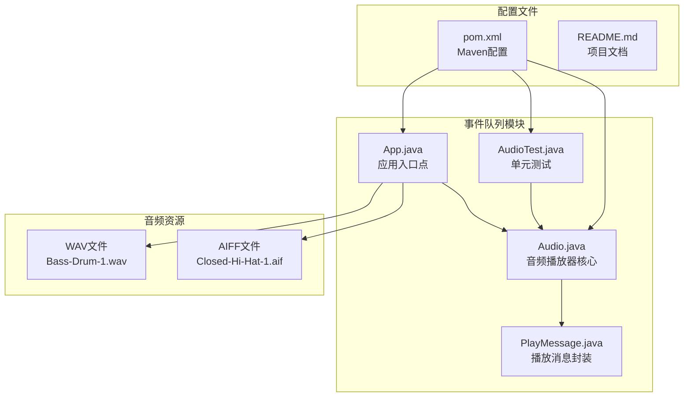
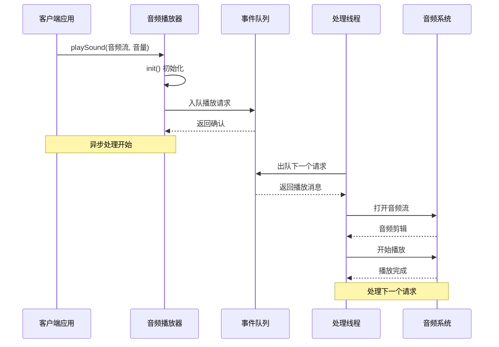
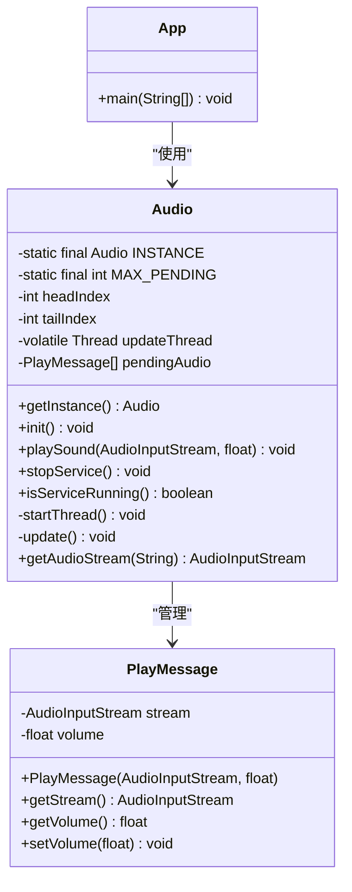
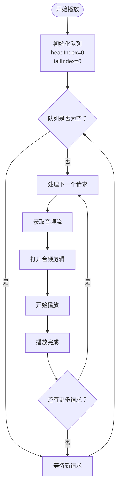
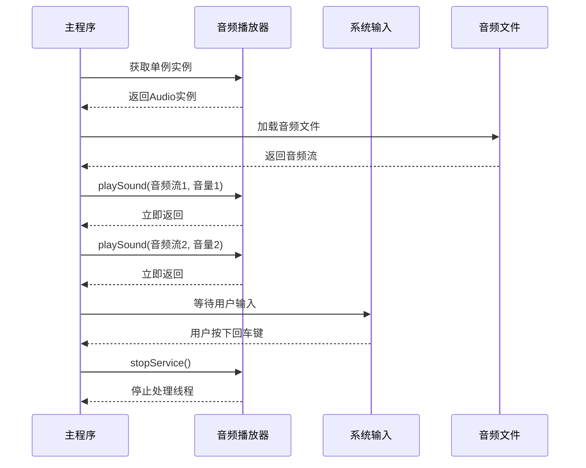
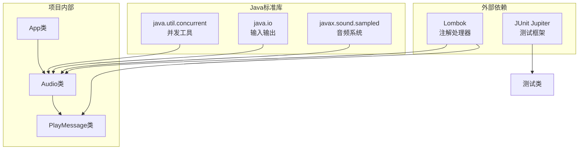

# 事件队列模式

<cite>
**本文档引用的文件**
- [App.java](file://event-queue/src/main/java/com/iluwatar/event/queue/App.java)
- [Audio.java](file://event-queue/src/main/java/com/iluwatar/event/queue/Audio.java)
- [PlayMessage.java](file://event-queue/src/main/java/com/iluwatar/event/queue/PlayMessage.java)
- [AudioTest.java](file://event-queue/src/test/java/com/iluwatar/event/queue/AudioTest.java)
- [README.md](file://event-queue/README.md)
- [pom.xml](file://event-queue/pom.xml)
</cite>

## 目录
1. [简介](#简介)
2. [项目结构](#项目结构)
3. [核心组件](#核心组件)
4. [架构概览](#架构概览)
5. [详细组件分析](#详细组件分析)
6. [依赖关系分析](#依赖关系分析)
7. [性能考虑](#性能考虑)
8. [故障排除指南](#故障排除指南)
9. [结论](#结论)

## 简介

事件队列模式是一种重要的设计模式，它通过在发送者和接收者之间引入缓冲区来实现异步通信协议。这种模式允许应用程序以非阻塞的方式处理操作，从而提高系统的可扩展性和性能。在音频播放系统中，事件队列模式被用来管理音效播放、音乐播放等异步任务，确保用户界面的响应性和系统的稳定性。

事件队列模式的核心思想是：发送者不需要与接收者同时交互，消息被存储在队列中直到接收者检索它们。队列按照先进先出（FIFO）的顺序存储通知或请求，发送通知时将请求入队并立即返回，然后由请求处理器在稍后时间从队列中处理这些项目。

## 项目结构

事件队列模式项目采用标准的Maven项目结构，专注于演示音频播放系统的事件队列实现：

**图表来源**
- [App.java](file://event-queue/src/main/java/com/iluwatar/event/queue/App.java#L1-L66)
- [Audio.java](file://event-queue/src/main/java/com/iluwatar/event/queue/Audio.java#L1-L169)
- [PlayMessage.java](file://event-queue/src/main/java/com/iluwatar/event/queue/PlayMessage.java#L1-L46)

**章节来源**
- [App.java](file://event-queue/src/main/java/com/iluwatar/event/queue/App.java#L1-L66)
- [Audio.java](file://event-queue/src/main/java/com/iluwatar/event/queue/Audio.java#L1-L169)
- [PlayMessage.java](file://event-queue/src/main/java/com/iluwatar/event/queue/PlayMessage.java#L1-L46)
- [pom.xml](file://event-queue/pom.xml#L1-L63)

## 核心组件

事件队列模式的实现主要由三个核心组件构成：

### 1. 音频播放器（Audio类）
Audio类实现了单例模式和事件队列的核心功能，负责：
- 维护固定大小的音频播放请求队列
- 管理后台处理线程的生命周期
- 提供线程安全的音频播放接口
- 实现事件队列的入队和出队机制

### 2. 播放消息（PlayMessage类）
PlayMessage类作为事件载体，封装了音频播放所需的信息：
- 音频输入流（AudioInputStream）
- 音量控制参数
- 不可变的音频流标识符

### 3. 应用入口（App类）
App类展示了事件队列模式的实际应用场景：
- 演示如何使用音频播放器
- 展示异步音频播放的典型工作流程
- 提供用户交互界面

**章节来源**
- [Audio.java](file://event-queue/src/main/java/com/iluwatar/event/queue/Audio.java#L36-L169)
- [PlayMessage.java](file://event-queue/src/main/java/com/iluwatar/event/queue/PlayMessage.java#L32-L46)
- [App.java](file://event-queue/src/main/java/com/iluwatar/event/queue/App.java#L33-L66)

## 架构概览

事件队列模式的架构设计体现了异步处理和任务调度的核心原则：

**图表来源**
- [Audio.java](file://event-queue/src/main/java/com/iluwatar/event/queue/Audio.java#L88-L154)
- [PlayMessage.java](file://event-queue/src/main/java/com/iluwatar/event/queue/PlayMessage.java#L38-L45)

该架构的关键特性包括：

1. **解耦设计**：客户端应用无需等待音频播放完成即可继续执行其他任务
2. **异步处理**：后台线程独立处理音频播放请求
3. **资源管理**：通过固定大小的队列限制内存使用
4. **线程安全**：使用适当的同步机制保护共享状态

## 详细组件分析

### 音频播放器组件分析

Audio类是事件队列模式的核心实现，采用了多种设计模式和技术：

**图表来源**
- [Audio.java](file://event-queue/src/main/java/com/iluwatar/event/queue/Audio.java#L41-L169)
- [PlayMessage.java](file://event-queue/src/main/java/com/iluwatar/event/queue/PlayMessage.java#L38-L45)
- [App.java](file://event-queue/src/main/java/com/iluwatar/event/queue/App.java#L44-L66)

#### 线程安全机制

Audio类通过以下机制确保线程安全：

1. **单例模式**：确保只有一个音频播放器实例
2. **同步方法**：对关键操作使用`synchronized`关键字
3. **volatile字段**：保证线程间可见性
4. **原子操作**：使用简单的索引操作避免复杂同步

#### 事件队列实现

音频播放器实现了固定大小的环形缓冲区：

**图表来源**
- [Audio.java](file://event-queue/src/main/java/com/iluwatar/event/queue/Audio.java#L136-L154)

#### 队列管理策略

Audio类实现了智能的队列管理策略：

1. **重复请求合并**：如果相同的音频流已经在队列中，会更新音量而不是添加新的请求
2. **固定容量限制**：最大支持16个待处理的音频播放请求
3. **循环索引**：使用模运算实现环形缓冲区

**章节来源**
- [Audio.java](file://event-queue/src/main/java/com/iluwatar/event/queue/Audio.java#L88-L154)

### 播放消息组件分析

PlayMessage类是一个简单的数据传输对象（DTO），用于封装音频播放请求：

| 字段 | 类型 | 描述 | 可变性 |
|------|------|------|--------|
| stream | AudioInputStream | 音频输入流 | 不可变 |
| volume | float | 音量级别 | 可变 |

该设计遵循了不可变性原则，确保音频流的完整性，同时允许动态调整音量设置。

**章节来源**
- [PlayMessage.java](file://event-queue/src/main/java/com/iluwatar/event/queue/PlayMessage.java#L38-L45)

### 应用入口组件分析

App类展示了事件队列模式的实际应用场景：

**图表来源**
- [App.java](file://event-queue/src/main/java/com/iluwatar/event/queue/App.java#L53-L64)

**章节来源**
- [App.java](file://event-queue/src/main/java/com/iluwatar/event/queue/App.java#L33-L66)

## 依赖关系分析

事件队列模式的依赖关系相对简单，主要依赖于Java标准库：

**图表来源**
- [pom.xml](file://event-queue/pom.xml#L36-L42)
- [Audio.java](file://event-queue/src/main/java/com/iluwatar/event/queue/Audio.java#L27-L34)

**章节来源**
- [pom.xml](file://event-queue/pom.xml#L36-L42)

## 性能考虑

事件队列模式在音频播放系统中的性能特点：

### 内存管理
- **固定容量**：MAX_PENDING常量限制了队列的最大长度，防止内存泄漏
- **对象复用**：PlayMessage对象在队列中重复使用，减少垃圾回收压力
- **流式处理**：音频流按需加载，避免一次性占用大量内存

### 线程性能
- **单线程处理**：使用单一的后台线程处理所有音频播放请求
- **无阻塞接口**：playSound方法立即返回，不阻塞调用线程
- **优雅停止**：支持线程中断和优雅关闭

### 同步开销
- **最小化同步**：只在必要的地方使用同步机制
- **原子操作**：索引操作使用简单的模运算，避免复杂的锁竞争
- **volatile优化**：使用volatile关键字确保线程间可见性

## 故障排除指南

### 常见问题及解决方案

#### 1. 音频播放失败
**症状**：playSound方法调用后没有声音输出
**可能原因**：
- 音频文件格式不受支持
- 音频系统资源不可用
- 线程未正确启动

**解决步骤**：
1. 检查音频文件路径和格式
2. 验证系统音频设备可用性
3. 确认updateThread已启动

#### 2. 队列溢出
**症状**：超过16个音频请求后出现异常
**可能原因**：队列容量不足
**解决方案**：
- 调整MAX_PENDING常量值
- 优化音频播放频率
- 实现背压处理机制

#### 3. 线程安全问题
**症状**：多线程环境下出现竞态条件
**可能原因**：缺少适当的同步机制
**解决方案**：
- 确保所有共享状态访问都使用同步
- 使用volatile关键字标记共享变量
- 避免在同步块中执行耗时操作

**章节来源**
- [Audio.java](file://event-queue/src/main/java/com/iluwatar/event/queue/Audio.java#L147-L153)

## 结论

事件队列模式为异步处理和任务调度提供了优雅的解决方案。在音频播放系统中，该模式成功地实现了以下目标：

1. **提升用户体验**：用户界面保持响应，音频播放在后台异步进行
2. **简化编程模型**：开发者可以像调用同步方法一样使用异步功能
3. **资源控制**：通过固定容量的队列限制内存使用
4. **线程安全**：内置的同步机制确保多线程环境下的安全性

该实现展示了事件队列模式的核心价值：通过在发送者和接收者之间引入缓冲区，实现系统的解耦和异步处理。虽然当前实现相对简单，但为更复杂的事件队列系统奠定了良好的基础。

对于生产环境的应用，建议进一步增强以下方面：
- 实现动态队列容量调整
- 添加事件优先级支持
- 增强错误恢复和重试机制
- 提供更丰富的监控和诊断功能