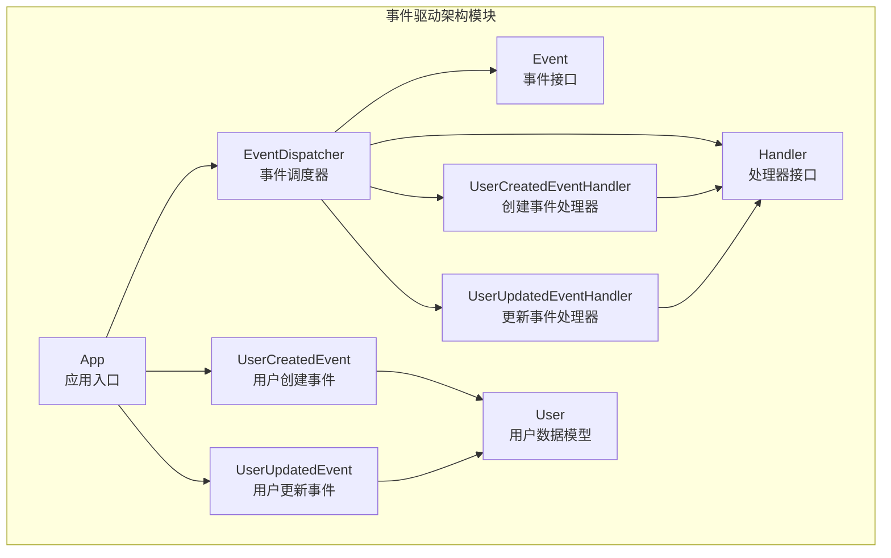
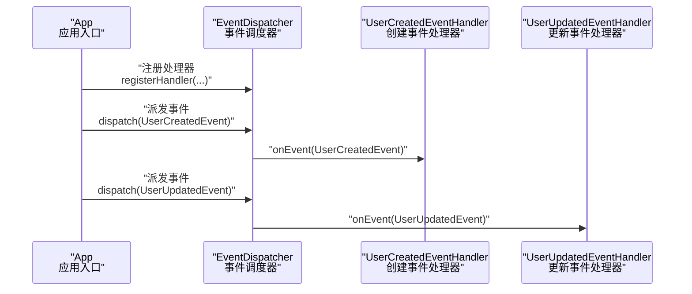
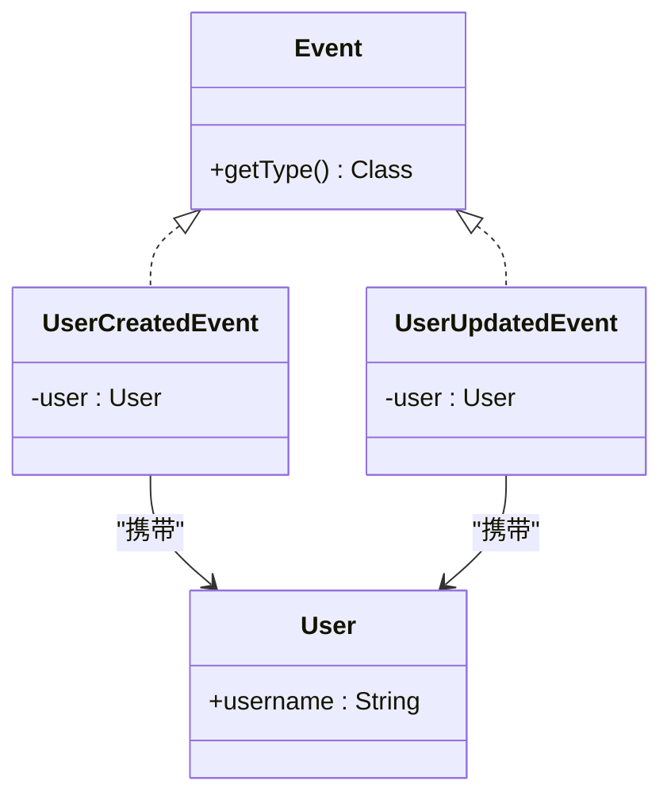
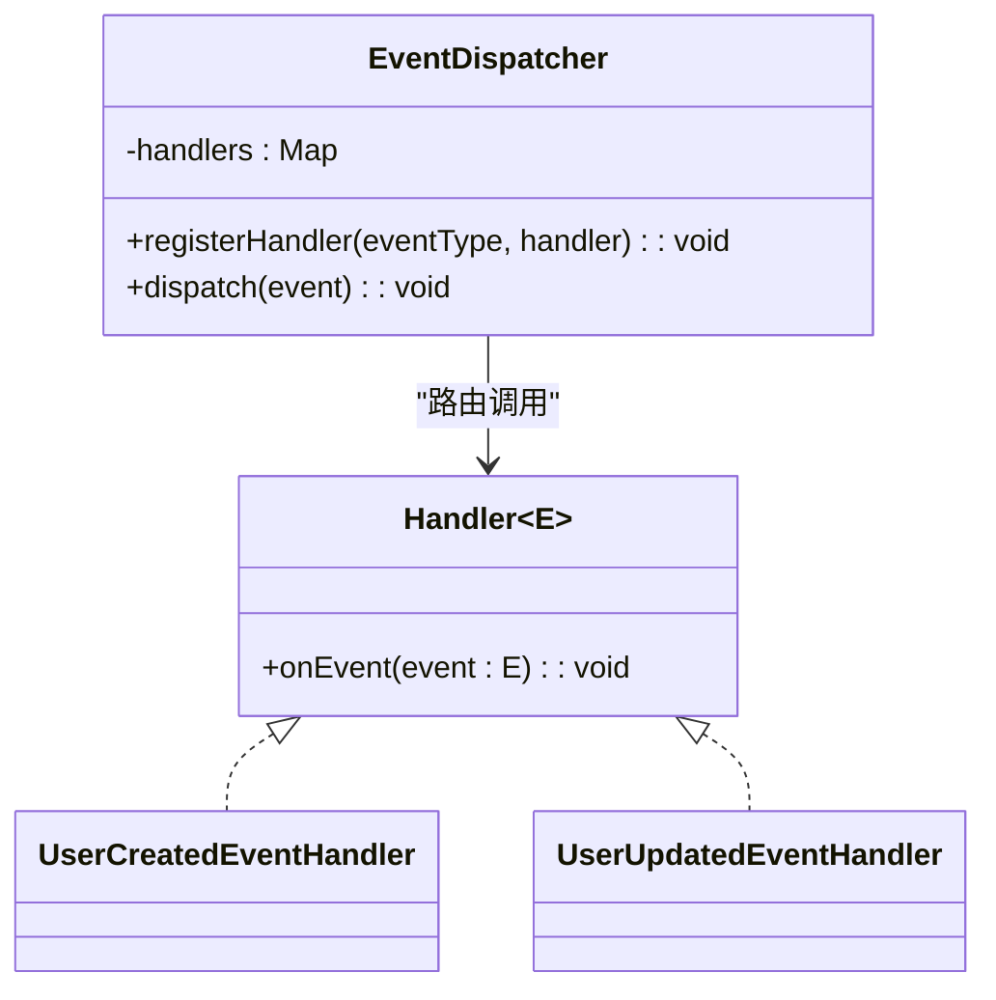
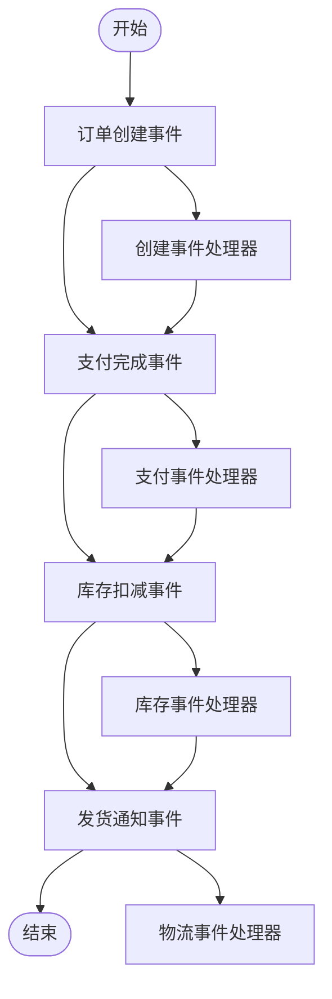
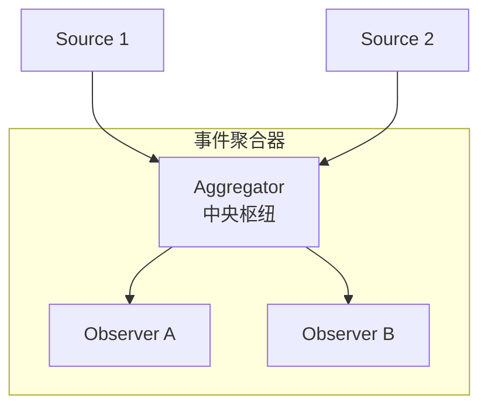
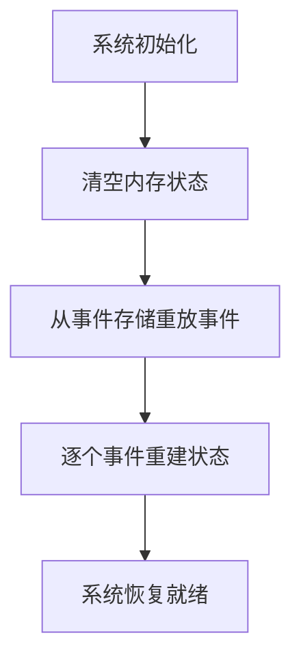
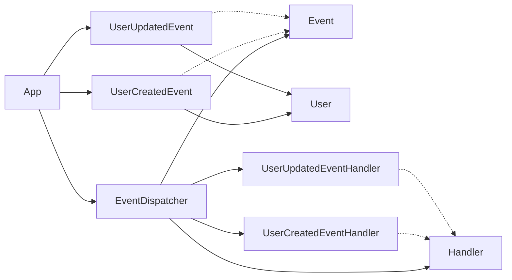

# 事件驱动架构模式

<cite>
**本文引用的文件**
- [README.md](file://event-driven-architecture/README.md)
- [Event.java](file://event-driven-architecture/src/main/java/com/iluwatar/eda/framework/Event.java)
- [Handler.java](file://event-driven-architecture/src/main/java/com/iluwatar/eda/framework/Handler.java)
- [EventDispatcher.java](file://event-driven-architecture/src/main/java/com/iluwatar/eda/framework/EventDispatcher.java)
- [App.java](file://event-driven-architecture/src/main/java/com/iluwatar/eda/App.java)
- [UserCreatedEvent.java](file://event-driven-architecture/src/main/java/com/iluwatar/eda/event/UserCreatedEvent.java)
- [UserUpdatedEvent.java](file://event-driven-architecture/src/main/java/com/iluwatar/eda/event/UserUpdatedEvent.java)
- [UserCreatedEventHandler.java](file://event-driven-architecture/src/main/java/com/iluwatar/eda/handler/UserCreatedEventHandler.java)
- [UserUpdatedEventHandler.java](file://event-driven-architecture/src/main/java/com/iluwatar/eda/handler/UserUpdatedEventHandler.java)
- [User.java](file://event-driven-architecture/src/main/java/com/iluwatar/eda/model/User.java)
- [README.md](file://event-sourcing/README.md)
- [README.md](file://event-aggregator/README.md)
- [README.md](file://event-queue/README.md)
</cite>

## 目录
1. [引言](#引言)
2. [项目结构](#项目结构)
3. [核心组件](#核心组件)
4. [架构总览](#架构总览)
5. [详细组件分析](#详细组件分析)
6. [依赖分析](#依赖分析)
7. [性能考虑](#性能考虑)
8. [故障排查指南](#故障排查指南)
9. [结论](#结论)
10. [附录](#附录)

## 引言
本文件系统性阐述事件驱动架构（EDA）的核心理念与实现要点，结合仓库中的事件驱动架构、事件聚合器与事件溯源等模块，给出从接口定义、调度分发到事件处理器与事件模型的完整实现视图，并通过订单处理系统的端到端示例说明事件的产生、传播与消费流程。同时覆盖事件溯源、事件聚合与事件序列化的设计模式，以及一致性、可靠性与错误处理策略，并提供性能优化、监控告警与故障恢复的实践建议。

## 项目结构
该仓库围绕“事件驱动架构”主题提供了多个相关模式示例，其中与本主题最直接相关的是 event-driven-architecture 模块，其采用最小但清晰的接口与类层次，演示了事件、处理器与调度器之间的解耦协作；此外，event-sourcing 与 event-aggregator 等模块分别展示了事件持久化与事件集中路由的设计思路。

图表来源
- [App.java](file://event-driven-architecture/src/main/java/com/iluwatar/eda/App.java#L54-L63)
- [EventDispatcher.java](file://event-driven-architecture/src/main/java/com/iluwatar/eda/framework/EventDispatcher.java#L34-L68)
- [Event.java](file://event-driven-architecture/src/main/java/com/iluwatar/eda/framework/Event.java#L31-L40)
- [Handler.java](file://event-driven-architecture/src/main/java/com/iluwatar/eda/framework/Handler.java#L33-L43)
- [UserCreatedEvent.java](file://event-driven-architecture/src/main/java/com/iluwatar/eda/event/UserCreatedEvent.java#L38-L41)
- [UserUpdatedEvent.java](file://event-driven-architecture/src/main/java/com/iluwatar/eda/event/UserUpdatedEvent.java#L38-L41)
- [UserCreatedEventHandler.java](file://event-driven-architecture/src/main/java/com/iluwatar/eda/handler/UserCreatedEventHandler.java#L35-L42)
- [UserUpdatedEventHandler.java](file://event-driven-architecture/src/main/java/com/iluwatar/eda/handler/UserUpdatedEventHandler.java#L35-L41)
- [User.java](file://event-driven-architecture/src/main/java/com/iluwatar/eda/model/User.java#L36-L36)

章节来源
- [README.md](file://event-driven-architecture/README.md#L41-L154)

## 核心组件
- 事件接口：定义事件类型识别能力，用于调度器按类型路由。
- 处理器接口：定义事件处理契约，具体处理器实现各自业务逻辑。
- 调度器：维护事件类型到处理器的映射，负责派发事件并调用对应处理器。
- 具体事件与处理器：以用户创建/更新为例，承载上下文数据并执行相应动作。
- 应用入口：初始化调度器、注册处理器、触发事件并观察输出。

章节来源
- [Event.java](file://event-driven-architecture/src/main/java/com/iluwatar/eda/framework/Event.java#L31-L40)
- [Handler.java](file://event-driven-architecture/src/main/java/com/iluwatar/eda/framework/Handler.java#L33-L43)
- [EventDispatcher.java](file://event-driven-architecture/src/main/java/com/iluwatar/eda/framework/EventDispatcher.java#L34-L68)
- [UserCreatedEvent.java](file://event-driven-architecture/src/main/java/com/iluwatar/eda/event/UserCreatedEvent.java#L38-L41)
- [UserUpdatedEvent.java](file://event-driven-architecture/src/main/java/com/iluwatar/eda/event/UserUpdatedEvent.java#L38-L41)
- [UserCreatedEventHandler.java](file://event-driven-architecture/src/main/java/com/iluwatar/eda/handler/UserCreatedEventHandler.java#L35-L42)
- [UserUpdatedEventHandler.java](file://event-driven-architecture/src/main/java/com/iluwatar/eda/handler/UserUpdatedEventHandler.java#L35-L41)
- [App.java](file://event-driven-architecture/src/main/java/com/iluwatar/eda/App.java#L54-L63)

## 架构总览
下图展示了事件驱动架构在本仓库中的运行时交互：应用入口创建调度器并注册处理器，随后构造事件对象并交由调度器派发，调度器依据事件类型查找处理器并回调 onEvent 执行业务逻辑。

图表来源
- [App.java](file://event-driven-architecture/src/main/java/com/iluwatar/eda/App.java#L54-L63)
- [EventDispatcher.java](file://event-driven-architecture/src/main/java/com/iluwatar/eda/framework/EventDispatcher.java#L48-L66)
- [UserCreatedEventHandler.java](file://event-driven-architecture/src/main/java/com/iluwatar/eda/handler/UserCreatedEventHandler.java#L37-L40)
- [UserUpdatedEventHandler.java](file://event-driven-architecture/src/main/java/com/iluwatar/eda/handler/UserUpdatedEventHandler.java#L37-L40)

## 详细组件分析

### 事件模型与事件流
- 事件接口提供 getType 以标识事件类型，便于调度器进行路由。
- 具体事件类承载业务上下文（如用户对象），作为处理器的输入数据载体。
- 事件流遵循“生产者-调度器-消费者”的单向链路：生产者仅负责生成事件，调度器负责路由，消费者仅关注自身事件类型。

图表来源
- [Event.java](file://event-driven-architecture/src/main/java/com/iluwatar/eda/framework/Event.java#L31-L40)
- [UserCreatedEvent.java](file://event-driven-architecture/src/main/java/com/iluwatar/eda/event/UserCreatedEvent.java#L38-L41)
- [UserUpdatedEvent.java](file://event-driven-architecture/src/main/java/com/iluwatar/eda/event/UserUpdatedEvent.java#L38-L41)
- [User.java](file://event-driven-architecture/src/main/java/com/iluwatar/eda/model/User.java#L36-L36)

章节来源
- [Event.java](file://event-driven-architecture/src/main/java/com/iluwatar/eda/framework/Event.java#L31-L40)
- [UserCreatedEvent.java](file://event-driven-architecture/src/main/java/com/iluwatar/eda/event/UserCreatedEvent.java#L38-L41)
- [UserUpdatedEvent.java](file://event-driven-architecture/src/main/java/com/iluwatar/eda/event/UserUpdatedEvent.java#L38-L41)
- [User.java](file://event-driven-architecture/src/main/java/com/iluwatar/eda/model/User.java#L36-L36)

### 处理器与调度器
- 处理器接口定义 onEvent 方法，具体处理器实现各自业务逻辑。
- 调度器维护事件类型到处理器的映射表，支持注册与派发两个关键操作。
- 派发时根据事件类型查找处理器并调用，若未找到则忽略（可扩展为日志或异常策略）。

图表来源
- [Handler.java](file://event-driven-architecture/src/main/java/com/iluwatar/eda/framework/Handler.java#L33-L43)
- [EventDispatcher.java](file://event-driven-architecture/src/main/java/com/iluwatar/eda/framework/EventDispatcher.java#L34-L68)
- [UserCreatedEventHandler.java](file://event-driven-architecture/src/main/java/com/iluwatar/eda/handler/UserCreatedEventHandler.java#L35-L42)
- [UserUpdatedEventHandler.java](file://event-driven-architecture/src/main/java/com/iluwatar/eda/handler/UserUpdatedEventHandler.java#L35-L41)

章节来源
- [Handler.java](file://event-driven-architecture/src/main/java/com/iluwatar/eda/framework/Handler.java#L33-L43)
- [EventDispatcher.java](file://event-driven-architecture/src/main/java/com/iluwatar/eda/framework/EventDispatcher.java#L34-L68)

### 订单处理系统示例（概念性）
以下流程图展示一个典型订单处理系统的事件驱动实现：订单创建、支付完成、库存扣减、发货通知等事件依次产生并被不同处理器消费，形成松耦合的处理流水线。

（本图为概念性流程示意，不对应具体源码文件）

### 事件聚合与集中路由
事件聚合器通过中央枢纽对多源事件进行收集与再分发，降低组件间直接耦合，提升可维护性与可扩展性。其核心在于“集中路由”和“订阅-发布”式的观察者模式变体。

（本图为概念性架构示意，不对应具体源码文件）

### 事件溯源与状态重建
事件溯源将系统状态变化记录为不可变事件序列，通过重放事件实现状态重建与审计。该模式强调“事件即事实”，适合需要强审计与可追溯性的场景。

（本图为概念性流程示意，不对应具体源码文件）

## 依赖分析
事件驱动架构模块内部依赖关系清晰：应用入口依赖调度器；调度器依赖处理器接口与事件接口；具体事件与处理器分别实现接口并被调度器引用；用户模型作为事件数据载体被事件类持有。

图表来源
- [App.java](file://event-driven-architecture/src/main/java/com/iluwatar/eda/App.java#L54-L63)
- [EventDispatcher.java](file://event-driven-architecture/src/main/java/com/iluwatar/eda/framework/EventDispatcher.java#L34-L68)
- [UserCreatedEvent.java](file://event-driven-architecture/src/main/java/com/iluwatar/eda/event/UserCreatedEvent.java#L38-L41)
- [UserUpdatedEvent.java](file://event-driven-architecture/src/main/java/com/iluwatar/eda/event/UserUpdatedEvent.java#L38-L41)
- [UserCreatedEventHandler.java](file://event-driven-architecture/src/main/java/com/iluwatar/eda/handler/UserCreatedEventHandler.java#L35-L42)
- [UserUpdatedEventHandler.java](file://event-driven-architecture/src/main/java/com/iluwatar/eda/handler/UserUpdatedEventHandler.java#L35-L41)
- [User.java](file://event-driven-architecture/src/main/java/com/iluwatar/eda/model/User.java#L36-L36)

章节来源
- [App.java](file://event-driven-architecture/src/main/java/com/iluwatar/eda/App.java#L54-L63)
- [EventDispatcher.java](file://event-driven-architecture/src/main/java/com/iluwatar/eda/framework/EventDispatcher.java#L34-L68)

## 性能考虑
- 路由效率：使用哈希映射维护事件类型到处理器的索引，派发时间复杂度近似 O(1)，适合高吞吐场景。
- 并发安全：在多线程环境下，建议对处理器注册与事件派发进行必要的同步控制，避免竞态条件。
- 扩展性：通过接口抽象处理器与事件，新增事件类型与处理器无需修改现有代码，利于水平扩展。
- 异步化：对于耗时业务，可将处理器内部处理异步化，配合线程池或消息队列进一步削峰填谷。
- 序列化与传输：事件数据应具备稳定且高效的序列化方案，减少网络与磁盘 IO 开销。

## 故障排查指南
- 事件未被处理：检查调度器是否正确注册了事件类型与处理器；确认事件类型匹配与处理器可用。
- 数据缺失：核对事件对象是否正确封装业务数据；确保处理器对空值与边界条件进行校验。
- 日志与可观测性：为处理器与调度器添加统一的日志埋点，记录事件入队、出队与处理耗时，便于定位瓶颈。
- 错误处理策略：为处理器提供失败重试、死信队列与熔断降级机制，避免局部异常影响整体系统稳定性。
- 一致性与幂等：在事件处理中引入幂等键与去重策略，防止重复事件导致的状态不一致。

## 结论
本仓库以简洁的接口与类层次展示了事件驱动架构的关键构件：事件、处理器与调度器。通过 App 的示例，读者可以理解事件的产生、传播与消费全过程。结合事件聚合器与事件溯源模块，可进一步扩展到复杂场景下的集中路由与状态重建需求。实践中应重视异步化、序列化、可观测性与容错策略，以获得高吞吐、低延迟与高可靠性的事件驱动系统。

## 附录
- 参考资料与扩展阅读可参见各模块 README 中的链接与示例说明。