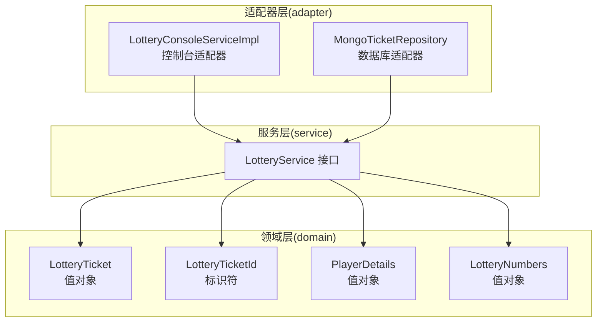
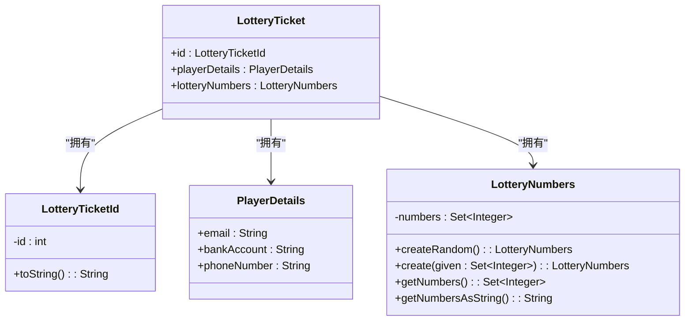
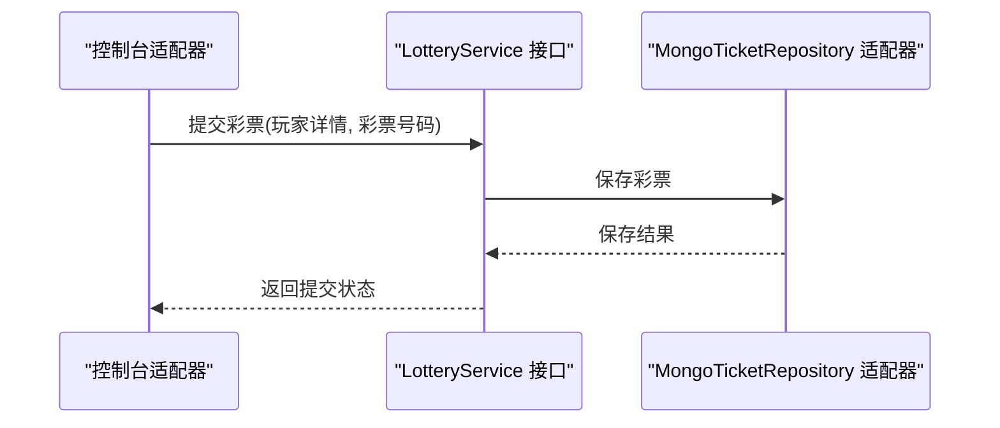
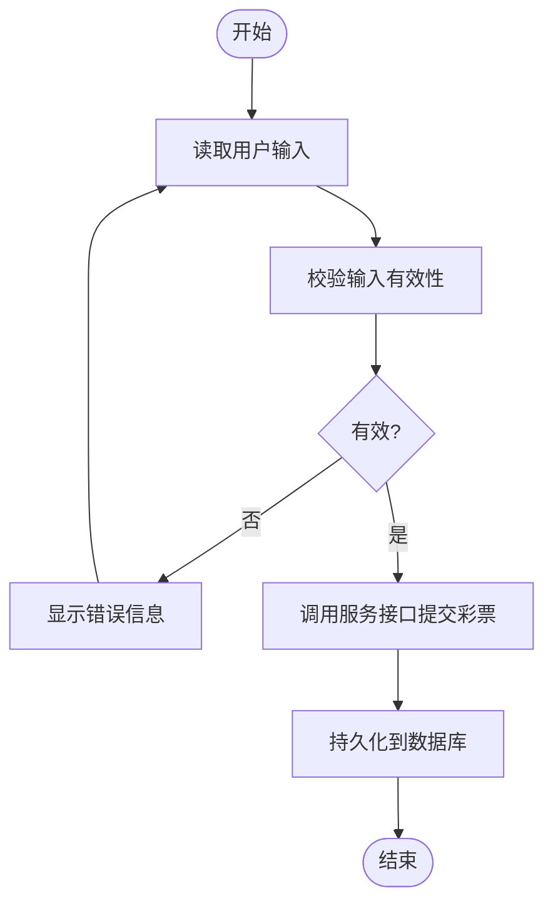
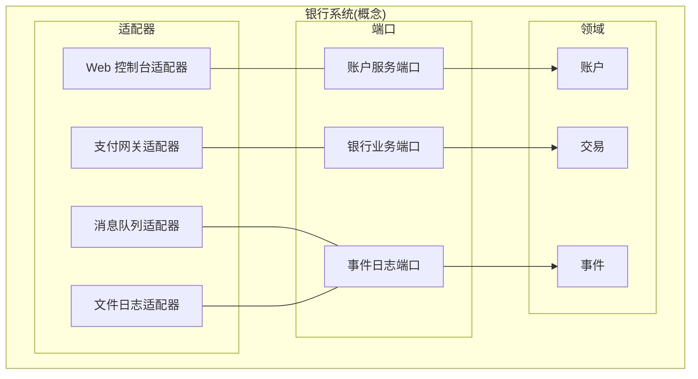
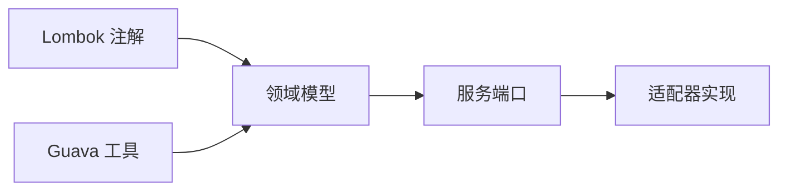

# 六边形架构模式

<cite>
**本文引用的文件**
- [README.md](file://hexagonal-architecture/README.md)
- [pom.xml](file://hexagonal-architecture/pom.xml)
- [LotteryTicket.java](file://hexagonal-architecture/src/main/java/com/iluwatar/hexagonal/domain/LotteryTicket.java)
- [LotteryTicketId.java](file://hexagonal-architecture/src/main/java/com/iluwatar/hexagonal/domain/LotteryTicketId.java)
- [PlayerDetails.java](file://hexagonal-architecture/src/main/java/com/iluwatar/hexagonal/domain/PlayerDetails.java)
- [LotteryNumbers.java](file://hexagonal-architecture/src/main/java/com/iluwatar/hexagonal/domain/LotteryNumbers.java)
</cite>

## 目录
1. [引言](#引言)
2. [项目结构](#项目结构)
3. [核心组件](#核心组件)
4. [架构总览](#架构总览)
5. [详细组件分析](#详细组件分析)
6. [依赖分析](#依赖分析)
7. [性能考量](#性能考量)
8. [故障排查指南](#故障排查指南)
9. [结论](#结论)
10. [附录](#附录)

## 引言
本指南围绕六边形架构（端口与适配器）在银行系统中的落地实践展开，结合仓库中现有的彩票域模型与基础设施，系统阐述领域核心、端口抽象与适配器实现的三层结构，以及如何通过依赖倒置实现可测试性与可扩展性。文档同时给出银行账户管理、银行业务与事件日志的架构设计思路，并总结外部依赖隔离与测试替身的使用策略。

## 项目结构
该模块采用标准 Maven 结构组织，核心域模型位于 domain 包，包含不可变值对象与标识符类型；服务层与数据库访问层在当前快照中以接口形式存在，便于通过适配器替换具体实现。整体布局遵循“领域驱动设计”的分层思想：领域层不依赖外部框架或基础设施，仅暴露端口供上层调用。



图表来源
- [LotteryTicket.java](file://hexagonal-architecture/src/main/java/com/iluwatar/hexagonal/domain/LotteryTicket.java#L30-L66)
- [LotteryTicketId.java](file://hexagonal-architecture/src/main/java/com/iluwatar/hexagonal/domain/LotteryTicketId.java#L35-L50)
- [PlayerDetails.java](file://hexagonal-architecture/src/main/java/com/iluwatar/hexagonal/domain/PlayerDetails.java#L30-L30)
- [LotteryNumbers.java](file://hexagonal-architecture/src/main/java/com/iluwatar/hexagonal/domain/LotteryNumbers.java#L42-L142)

章节来源
- [pom.xml](file://hexagonal-architecture/pom.xml#L1-L200)

## 核心组件
- 领域值对象与标识符
  - 不可变值对象用于表达业务概念，避免副作用并提升可读性与可测试性。
  - 标识符封装唯一性与生成逻辑，隐藏实现细节。
- 端口抽象
  - 服务接口作为端口，定义领域用例的契约，向上承接上层调用，向下接受适配器注入。
- 适配器实现
  - 控制台适配器负责用户交互与输入输出；
  - 数据库适配器负责持久化与查询。

章节来源
- [LotteryTicket.java](file://hexagonal-architecture/src/main/java/com/iluwatar/hexagonal/domain/LotteryTicket.java#L30-L66)
- [LotteryTicketId.java](file://hexagonal-architecture/src/main/java/com/iluwatar/hexagonal/domain/LotteryTicketId.java#L35-L50)
- [PlayerDetails.java](file://hexagonal-architecture/src/main/java/com/iluwatar/hexagonal/domain/PlayerDetails.java#L30-L30)
- [LotteryNumbers.java](file://hexagonal-architecture/src/main/java/com/iluwatar/hexagonal/domain/LotteryNumbers.java#L42-L142)

## 架构总览
下图展示了典型的六边形架构视图：领域位于中心，端口向外暴露；适配器分别对接外部系统（如数据库、控制台、消息队列等），通过依赖倒置实现解耦。

```mermaid
graph TB
subgraph "六边形外部"
EXT_DB["外部数据库"]
EXT_UI["外部UI/CLI"]
EXT_MSG["外部消息系统"]
end
subgraph "六边形内部"
subgraph "领域层"
D1["LotteryService 接口"]
D2["LotteryTicket"]
D3["LotteryTicketId"]
D4["PlayerDetails"]
D5["LotteryNumbers"]
end
subgraph "端口"
P1["提交彩票端口"]
P2["检查中奖端口"]
P3["事件日志端口"]
end
subgraph "适配器"
A1["控制台适配器"]
A2["MongoDB 适配器"]
A3["事件日志适配器"]
end
end
EXT_DB <- --> A2
EXT_UI <- --> A1
EXT_MSG <- --> A3
D1 --- P1
D1 --- P2
D1 --- P3
A1 --- P1
A2 --- P2
A3 --- P3
```

图表来源
- [LotteryTicket.java](file://hexagonal-architecture/src/main/java/com/iluwatar/hexagonal/domain/LotteryTicket.java#L30-L66)
- [LotteryTicketId.java](file://hexagonal-architecture/src/main/java/com/iluwatar/hexagonal/domain/LotteryTicketId.java#L35-L50)
- [PlayerDetails.java](file://hexagonal-architecture/src/main/java/com/iluwatar/hexagonal/domain/PlayerDetails.java#L30-L30)
- [LotteryNumbers.java](file://hexagonal-architecture/src/main/java/com/iluwatar/hexagonal/domain/LotteryNumbers.java#L42-L142)

## 详细组件分析

### 组件一：领域值对象与标识符
- 设计要点
  - 使用不可变值对象承载业务数据，避免共享可变状态带来的并发问题；
  - 标识符独立建模，统一生成与比较逻辑，降低跨模块耦合；
  - 值对象实现相等性与哈希一致性，确保集合与缓存行为可预期。
- 复杂度分析
  - 相等性与哈希计算为 O(n)（n 为字段数量），通常较小，影响可忽略；
  - 字符串序列化与集合拷贝为 O(k)（k 为数字个数），常量级开销。
- 优化建议
  - 对频繁比较的集合进行排序后缓存哈希；
  - 对字符串拼接使用更高效的构建器以减少临时对象。



图表来源
- [LotteryTicket.java](file://hexagonal-architecture/src/main/java/com/iluwatar/hexagonal/domain/LotteryTicket.java#L30-L66)
- [LotteryTicketId.java](file://hexagonal-architecture/src/main/java/com/iluwatar/hexagonal/domain/LotteryTicketId.java#L35-L50)
- [PlayerDetails.java](file://hexagonal-architecture/src/main/java/com/iluwatar/hexagonal/domain/PlayerDetails.java#L30-L30)
- [LotteryNumbers.java](file://hexagonal-architecture/src/main/java/com/iluwatar/hexagonal/domain/LotteryNumbers.java#L42-L142)

章节来源
- [LotteryTicket.java](file://hexagonal-architecture/src/main/java/com/iluwatar/hexagonal/domain/LotteryTicket.java#L30-L66)
- [LotteryTicketId.java](file://hexagonal-architecture/src/main/java/com/iluwatar/hexagonal/domain/LotteryTicketId.java#L35-L50)
- [PlayerDetails.java](file://hexagonal-architecture/src/main/java/com/iluwatar/hexagonal/domain/PlayerDetails.java#L30-L30)
- [LotteryNumbers.java](file://hexagonal-architecture/src/main/java/com/iluwatar/hexagonal/domain/LotteryNumbers.java#L42-L142)

### 组件二：端口抽象（服务接口）
- 设计要点
  - 将领域用例抽象为接口，定义稳定的对外契约；
  - 端口方法聚焦业务语义而非技术细节，便于替换实现。
- 实现策略
  - 提交彩票、检查中奖、记录事件等用例均通过接口暴露；
  - 上层控制器仅依赖接口，不感知具体实现。



图表来源
- [LotteryTicket.java](file://hexagonal-architecture/src/main/java/com/iluwatar/hexagonal/domain/LotteryTicket.java#L30-L66)
- [LotteryNumbers.java](file://hexagonal-architecture/src/main/java/com/iluwatar/hexagonal/domain/LotteryNumbers.java#L42-L142)

章节来源
- [LotteryTicket.java](file://hexagonal-architecture/src/main/java/com/iluwatar/hexagonal/domain/LotteryTicket.java#L30-L66)
- [LotteryNumbers.java](file://hexagonal-architecture/src/main/java/com/iluwatar/hexagonal/domain/LotteryNumbers.java#L42-L142)

### 组件三：适配器实现（控制台与数据库）
- 控制台适配器
  - 负责接收用户输入、格式化输出、编排领域用例；
  - 通过依赖注入接入服务接口，保证可替换性。
- 数据库适配器
  - 负责持久化与查询，屏蔽底层存储差异；
  - 通过仓储接口与领域解耦，支持多种存储后端。



图表来源
- [LotteryTicket.java](file://hexagonal-architecture/src/main/java/com/iluwatar/hexagonal/domain/LotteryTicket.java#L30-L66)
- [LotteryNumbers.java](file://hexagonal-architecture/src/main/java/com/iluwatar/hexagonal/domain/LotteryNumbers.java#L42-L142)

章节来源
- [LotteryTicket.java](file://hexagonal-architecture/src/main/java/com/iluwatar/hexagonal/domain/LotteryTicket.java#L30-L66)
- [LotteryNumbers.java](file://hexagonal-architecture/src/main/java/com/iluwatar/hexagonal/domain/LotteryNumbers.java#L42-L142)

### 银行系统架构映射（概念性说明）
- 账户管理
  - 领域：账户实体、余额、交易历史；
  - 端口：账户服务接口、账户仓储接口；
  - 适配器：Web 控制台适配器、JDBC/MongoDB 适配器。
- 银行业务
  - 领域：转账、存款、取款等业务规则；
  - 端口：银行业务服务接口；
  - 适配器：支付网关适配器、风控适配器。
- 事件日志
  - 领域：事件聚合器；
  - 端口：事件日志服务接口；
  - 适配器：消息队列适配器、文件日志适配器。



## 依赖分析
- 模块依赖
  - 当前模块使用 Lombok 注解简化对象实现；
  - 值对象依赖 Guava 的字符串连接工具，便于格式化输出。
- 外部依赖隔离
  - 通过接口与抽象类隔离具体实现，避免直接依赖第三方库；
  - 仓储与服务接口作为边界，便于替换不同实现。



图表来源
- [pom.xml](file://hexagonal-architecture/pom.xml#L1-L200)
- [LotteryNumbers.java](file://hexagonal-architecture/src/main/java/com/iluwatar/hexagonal/domain/LotteryNumbers.java#L27-L98)

章节来源
- [pom.xml](file://hexagonal-architecture/pom.xml#L1-L200)
- [LotteryNumbers.java](file://hexagonal-architecture/src/main/java/com/iluwatar/hexagonal/domain/LotteryNumbers.java#L27-L98)

## 性能考量
- 值对象不可变性带来内存与拷贝成本，但换取了线程安全与可缓存性；
- 随机数生成与集合操作为常量级复杂度，对吞吐影响有限；
- 仓储层应采用批量写入与索引优化，减少数据库往返；
- 适配器层尽量延迟初始化与复用连接，降低外部依赖开销。

## 故障排查指南
- 输入校验失败
  - 现象：提交失败或提示无效输入；
  - 排查：确认输入范围、唯一性与格式约束是否满足。
- 持久化异常
  - 现象：保存失败或数据不一致；
  - 排查：检查仓储实现、连接配置与事务边界。
- 事件日志缺失
  - 现象：事件未记录或重复记录；
  - 排查：核对事件发布顺序、幂等处理与重试策略。

## 结论
六边形架构通过端口与适配器清晰划分职责，使领域内核稳定、外部变化可控。结合依赖倒置与接口抽象，系统具备良好的可测试性与可扩展性。在银行系统中，可将账户、业务与事件日志分别建模为领域用例，通过端口暴露能力，再由适配器对接 Web、数据库与消息系统，从而实现高内聚、低耦合的可演进架构。

## 附录
- 快速上手
  - 在服务接口与仓储接口之上实现具体适配器；
  - 使用测试替身模拟外部依赖，专注于领域逻辑验证；
  - 逐步引入更多适配器（如支付网关、消息队列）而不侵扰领域。
- 技术栈建议
  - 领域层：纯 Java 或 Kotlin，避免框架耦合；
  - 适配器层：Spring Boot Starter、JPA/Mongo Reactive、RabbitMQ/Kafka；
  - 测试：JUnit 5、Mockito/JUnit 5 Extension、Testcontainers。
- 集成考虑
  - 保持端口稳定，避免频繁变更；
  - 通过适配器封装外部协议差异；
  - 采用异步与重试策略增强鲁棒性。