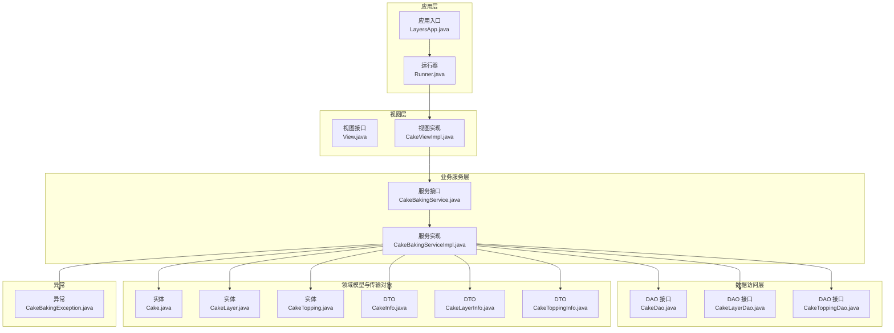
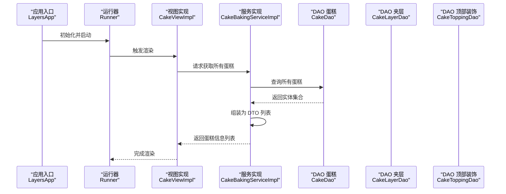
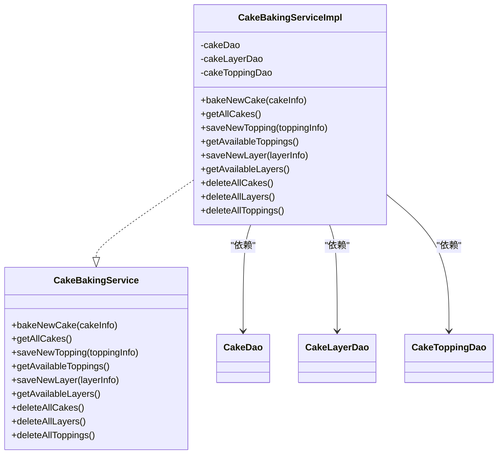
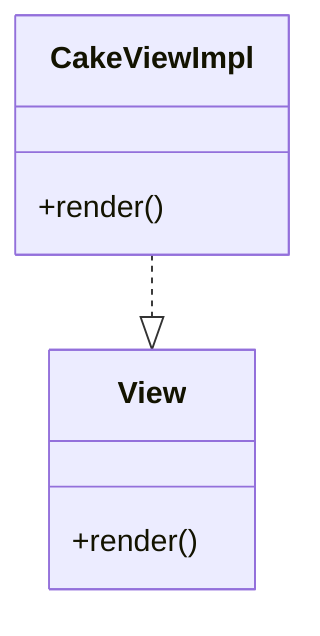
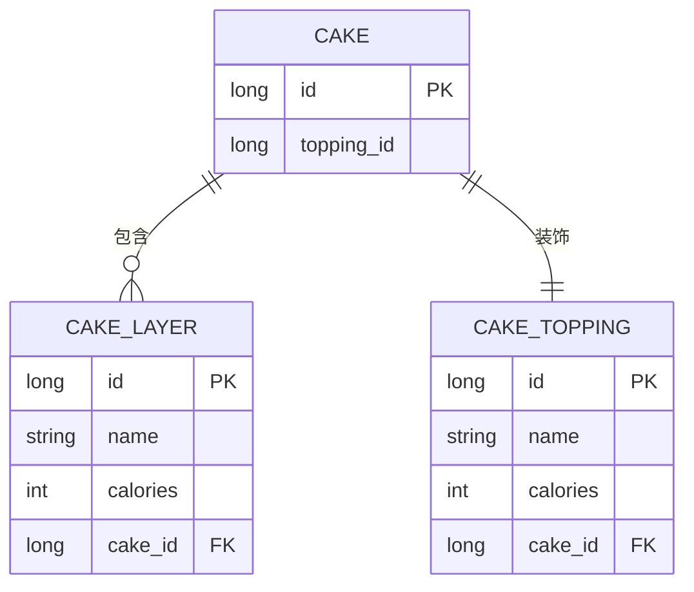
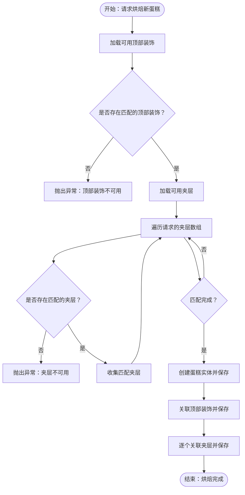
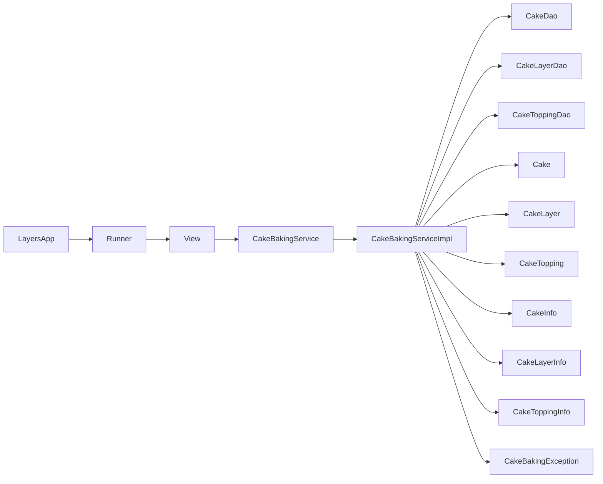

# 分层架构模式

<cite>
**本文引用的文件**
- [README.md](file://layered-architecture/README.md)
- [pom.xml](file://layered-architecture/pom.xml)
- [Cake.java](file://layered-architecture/src/main/java/entity/Cake.java)
- [CakeLayer.java](file://layered-architecture/src/main/java/entity/CakeLayer.java)
- [CakeTopping.java](file://layered-architecture/src/main/java/entity/CakeTopping.java)
- [CakeBakingService.java](file://layered-architecture/src/main/java/service/CakeBakingService.java)
- [CakeBakingServiceImpl.java](file://layered-architecture/src/main/java/service/CakeBakingServiceImpl.java)
- [View.java](file://layered-architecture/src/main/java/view/View.java)
- [CakeViewImpl.java](file://layered-architecture/src/main/java/view/CakeViewImpl.java)
- [CakeDao.java](file://layered-architecture/src/main/java/dao/CakeDao.java)
- [CakeLayerDao.java](file://layered-architecture/src/main/java/dao/CakeLayerDao.java)
- [CakeToppingDao.java](file://layered-architecture/src/main/java/dao/CakeToppingDao.java)
- [CakeInfo.java](file://layered-architecture/src/main/java/dto/CakeInfo.java)
- [CakeLayerInfo.java](file://layered-architecture/src/main/java/dto/CakeLayerInfo.java)
- [CakeToppingInfo.java](file://layered-architecture/src/main/java/dto/CakeToppingInfo.java)
- [CakeBakingException.java](file://layered-architecture/src/main/java/exception/CakeBakingException.java)
- [LayersApp.java](file://layered-architecture/src/main/java/app/LayersApp.java)
- [Runner.java](file://layered-architecture/src/main/java/Runner.java)
- [LayersAppTests.java](file://layered-architecture/src/test/java/com/iluwatar/layers/app/LayersAppTests.java)
- [CakeTest.java](file://layered-architecture/src/test/java/com/iluwatar/layers/entity/CakeTest.java)
- [CakeBakingExceptionTest.java](file://layered-architecture/src/test/java/com/iluwatar/layers/exception/CakeBakingExceptionTest.java)
- [CakeBakingServiceImplTest.java](file://layered-architecture/src/test/java/com/iluwatar/layers/service/CakeBakingServiceImplTest.java)
- [CakeViewImplTest.java](file://layered-architecture/src/test/java/com/iluwatar/layers/view/CakeViewImplTest.java)
</cite>

## 目录
1. [引言](#引言)
2. [项目结构](#项目结构)
3. [核心组件](#核心组件)
4. [架构总览](#架构总览)
5. [详细组件分析](#详细组件分析)
6. [依赖关系分析](#依赖关系分析)
7. [性能考量](#性能考量)
8. [故障排查指南](#故障排查指南)
9. [结论](#结论)
10. [附录](#附录)

## 引言
本文件系统化阐述分层架构模式在该示例中的设计与实现，重点说明数据层、业务逻辑层与服务层的职责划分、交互机制与边界约束，并结合 Cake 实体、CakeBakingService 接口与 View 接口的实现进行深入解析。同时总结分层架构在关注点分离、可维护性与可测试性方面的优势，以及在性能开销、复杂性与层次设计挑战等方面的权衡。

## 项目结构
该示例采用典型的分层组织方式：应用入口与运行器位于 app 层，视图层定义渲染契约，业务服务封装领域操作，DAO 层负责数据持久化，DTO 用于跨层传输，实体模型承载领域状态，异常处理独立于各层。

图表来源
- [LayersApp.java](file://layered-architecture/src/main/java/app/LayersApp.java#L1-L200)
- [Runner.java](file://layered-architecture/src/main/java/Runner.java#L1-L200)
- [View.java](file://layered-architecture/src/main/java/view/View.java#L1-L36)
- [CakeViewImpl.java](file://layered-architecture/src/main/java/view/CakeViewImpl.java#L1-L200)
- [CakeBakingService.java](file://layered-architecture/src/main/java/service/CakeBakingService.java#L1-L78)
- [CakeBakingServiceImpl.java](file://layered-architecture/src/main/java/service/CakeBakingServiceImpl.java#L1-L199)
- [CakeDao.java](file://layered-architecture/src/main/java/dao/CakeDao.java#L1-L200)
- [CakeLayerDao.java](file://layered-architecture/src/main/java/dao/CakeLayerDao.java#L1-L200)
- [CakeToppingDao.java](file://layered-architecture/src/main/java/dao/CakeToppingDao.java#L1-L200)
- [Cake.java](file://layered-architecture/src/main/java/entity/Cake.java#L1-L71)
- [CakeLayer.java](file://layered-architecture/src/main/java/entity/CakeLayer.java#L1-L74)
- [CakeTopping.java](file://layered-architecture/src/main/java/entity/CakeTopping.java#L1-L75)
- [CakeInfo.java](file://layered-architecture/src/main/java/dto/CakeInfo.java#L1-L200)
- [CakeLayerInfo.java](file://layered-architecture/src/main/java/dto/CakeLayerInfo.java#L1-L200)
- [CakeToppingInfo.java](file://layered-architecture/src/main/java/dto/CakeToppingInfo.java#L1-L200)
- [CakeBakingException.java](file://layered-architecture/src/main/java/exception/CakeBakingException.java#L1-L200)

章节来源
- [README.md](file://layered-architecture/README.md#L1-L200)
- [pom.xml](file://layered-architecture/pom.xml#L1-L200)

## 核心组件
- 数据层（DAO）：负责对实体的增删改查与聚合查询，隔离存储细节，向上提供稳定的数据访问接口。
- 业务逻辑层（Service）：编排领域操作，校验输入，协调 DAO 与实体，保证业务规则一致性与事务边界。
- 服务层（View）：抽象渲染契约，解耦 UI 或外部调用方与具体实现，便于替换与扩展。
- 领域模型（Entity）：承载业务状态与关系，如蛋糕、夹层、顶部装饰等。
- 传输对象（DTO）：在服务层与视图层之间传递数据，避免暴露实体细节。
- 应用入口与运行器：组织各层协作，驱动业务流程。

章节来源
- [CakeBakingService.java](file://layered-architecture/src/main/java/service/CakeBakingService.java#L1-L78)
- [CakeBakingServiceImpl.java](file://layered-architecture/src/main/java/service/CakeBakingServiceImpl.java#L1-L199)
- [View.java](file://layered-architecture/src/main/java/view/View.java#L1-L36)
- [Cake.java](file://layered-architecture/src/main/java/entity/Cake.java#L1-L71)
- [CakeLayer.java](file://layered-architecture/src/main/java/entity/CakeLayer.java#L1-L74)
- [CakeTopping.java](file://layered-architecture/src/main/java/entity/CakeTopping.java#L1-L75)
- [CakeInfo.java](file://layered-architecture/src/main/java/dto/CakeInfo.java#L1-L200)
- [CakeLayerInfo.java](file://layered-architecture/src/main/java/dto/CakeLayerInfo.java#L1-L200)
- [CakeToppingInfo.java](file://layered-architecture/src/main/java/dto/CakeToppingInfo.java#L1-L200)

## 架构总览
分层架构以“自顶向下”为交互方向：应用层触发视图层渲染；视图层调用服务层；服务层通过 DAO 访问数据并组合实体；最终返回 DTO 或直接更新实体状态。事务边界由服务层统一管理，确保业务原子性。

图表来源
- [LayersApp.java](file://layered-architecture/src/main/java/app/LayersApp.java#L1-L200)
- [Runner.java](file://layered-architecture/src/main/java/Runner.java#L1-L200)
- [CakeViewImpl.java](file://layered-architecture/src/main/java/view/CakeViewImpl.java#L1-L200)
- [CakeBakingServiceImpl.java](file://layered-architecture/src/main/java/service/CakeBakingServiceImpl.java#L1-L199)
- [CakeDao.java](file://layered-architecture/src/main/java/dao/CakeDao.java#L1-L200)
- [CakeLayerDao.java](file://layered-architecture/src/main/java/dao/CakeLayerDao.java#L1-L200)
- [CakeToppingDao.java](file://layered-architecture/src/main/java/dao/CakeToppingDao.java#L1-L200)

## 详细组件分析

### 数据层（DAO）
- 职责：封装对实体的 CRUD 操作与聚合查询，隐藏底层存储细节。
- 关键点：通过 Spring 注入与事务传播，确保服务层调用时具备一致的事务语义。
- 示例路径：
  - [CakeDao.java](file://layered-architecture/src/main/java/dao/CakeDao.java#L1-L200)
  - [CakeLayerDao.java](file://layered-architecture/src/main/java/dao/CakeLayerDao.java#L1-L200)
  - [CakeToppingDao.java](file://layered-architecture/src/main/java/dao/CakeToppingDao.java#L1-L200)

章节来源
- [CakeDao.java](file://layered-architecture/src/main/java/dao/CakeDao.java#L1-L200)
- [CakeLayerDao.java](file://layered-architecture/src/main/java/dao/CakeLayerDao.java#L1-L200)
- [CakeToppingDao.java](file://layered-architecture/src/main/java/dao/CakeToppingDao.java#L1-L200)

### 业务逻辑层（Service）
- 职责：编排业务流程、执行业务规则、协调 DAO 与实体、管理事务边界。
- 关键点：
  - 接口定义清晰的业务能力，便于替换与测试。
  - 实现类使用构造注入，降低紧耦合。
  - 使用事务注解保证业务原子性。
- 示例路径：
  - [CakeBakingService.java](file://layered-architecture/src/main/java/service/CakeBakingService.java#L1-L78)
  - [CakeBakingServiceImpl.java](file://layered-architecture/src/main/java/service/CakeBakingServiceImpl.java#L1-L199)

图表来源
- [CakeBakingService.java](file://layered-architecture/src/main/java/service/CakeBakingService.java#L1-L78)
- [CakeBakingServiceImpl.java](file://layered-architecture/src/main/java/service/CakeBakingServiceImpl.java#L1-L199)
- [CakeDao.java](file://layered-architecture/src/main/java/dao/CakeDao.java#L1-L200)
- [CakeLayerDao.java](file://layered-architecture/src/main/java/dao/CakeLayerDao.java#L1-L200)
- [CakeToppingDao.java](file://layered-architecture/src/main/java/dao/CakeToppingDao.java#L1-L200)

章节来源
- [CakeBakingService.java](file://layered-architecture/src/main/java/service/CakeBakingService.java#L1-L78)
- [CakeBakingServiceImpl.java](file://layered-architecture/src/main/java/service/CakeBakingServiceImpl.java#L1-L199)

### 服务层（View）
- 职责：定义渲染契约，屏蔽具体实现细节，支持多实现与替换。
- 关键点：接口最小化，仅暴露必要方法，便于测试与扩展。
- 示例路径：
  - [View.java](file://layered-architecture/src/main/java/view/View.java#L1-L36)
  - [CakeViewImpl.java](file://layered-architecture/src/main/java/view/CakeViewImpl.java#L1-L200)

图表来源
- [View.java](file://layered-architecture/src/main/java/view/View.java#L1-L36)
- [CakeViewImpl.java](file://layered-architecture/src/main/java/view/CakeViewImpl.java#L1-L200)

章节来源
- [View.java](file://layered-architecture/src/main/java/view/View.java#L1-L36)
- [CakeViewImpl.java](file://layered-architecture/src/main/java/view/CakeViewImpl.java#L1-L200)

### 领域模型（Entity）
- 职责：承载业务状态与关系，配合 JPA 注解描述映射。
- 关键点：
  - Cake 与 CakeTopping 一对一，与多个 CakeLayer 一对多。
  - 通过级联删除与懒/急加载策略控制关系一致性与性能。
- 示例路径：
  - [Cake.java](file://layered-architecture/src/main/java/entity/Cake.java#L1-L71)
  - [CakeLayer.java](file://layered-architecture/src/main/java/entity/CakeLayer.java#L1-L74)
  - [CakeTopping.java](file://layered-architecture/src/main/java/entity/CakeTopping.java#L1-L75)

图表来源
- [Cake.java](file://layered-architecture/src/main/java/entity/Cake.java#L1-L71)
- [CakeLayer.java](file://layered-architecture/src/main/java/entity/CakeLayer.java#L1-L74)
- [CakeTopping.java](file://layered-architecture/src/main/java/entity/CakeTopping.java#L1-L75)

章节来源
- [Cake.java](file://layered-architecture/src/main/java/entity/Cake.java#L1-L71)
- [CakeLayer.java](file://layered-architecture/src/main/java/entity/CakeLayer.java#L1-L74)
- [CakeTopping.java](file://layered-architecture/src/main/java/entity/CakeTopping.java#L1-L75)

### 传输对象（DTO）
- 职责：在服务层与视图层之间传递数据，避免泄露实体细节。
- 关键点：按需封装字段，减少序列化与网络传输成本。
- 示例路径：
  - [CakeInfo.java](file://layered-architecture/src/main/java/dto/CakeInfo.java#L1-L200)
  - [CakeLayerInfo.java](file://layered-architecture/src/main/java/dto/CakeLayerInfo.java#L1-L200)
  - [CakeToppingInfo.java](file://layered-architecture/src/main/java/dto/CakeToppingInfo.java#L1-L200)

章节来源
- [CakeInfo.java](file://layered-architecture/src/main/java/dto/CakeInfo.java#L1-L200)
- [CakeLayerInfo.java](file://layered-architecture/src/main/java/dto/CakeLayerInfo.java#L1-L200)
- [CakeToppingInfo.java](file://layered-architecture/src/main/java/dto/CakeToppingInfo.java#L1-L200)

### 异常处理（Exception）
- 职责：集中表达业务异常，便于上层捕获与处理。
- 关键点：异常类型与消息明确，利于定位问题与用户提示。
- 示例路径：
  - [CakeBakingException.java](file://layered-architecture/src/main/java/exception/CakeBakingException.java#L1-L200)

章节来源
- [CakeBakingException.java](file://layered-architecture/src/main/java/exception/CakeBakingException.java#L1-L200)

### 典型业务流程（烘焙新蛋糕）

图表来源
- [CakeBakingServiceImpl.java](file://layered-architecture/src/main/java/service/CakeBakingServiceImpl.java#L72-L113)

章节来源
- [CakeBakingServiceImpl.java](file://layered-architecture/src/main/java/service/CakeBakingServiceImpl.java#L72-L113)

## 依赖关系分析
- 层间依赖：应用层 → 视图层 → 业务服务层 → 数据访问层 → 领域模型。
- 内聚性：每层职责单一，内聚度高；跨层交互通过接口与 DTO 明确。
- 耦合度：通过接口与依赖注入降低耦合；DAO 与实体解耦，便于替换存储实现。
- 循环依赖：未见循环依赖迹象，符合分层架构要求。

图表来源
- [LayersApp.java](file://layered-architecture/src/main/java/app/LayersApp.java#L1-L200)
- [Runner.java](file://layered-architecture/src/main/java/Runner.java#L1-L200)
- [View.java](file://layered-architecture/src/main/java/view/View.java#L1-L36)
- [CakeBakingService.java](file://layered-architecture/src/main/java/service/CakeBakingService.java#L1-L78)
- [CakeBakingServiceImpl.java](file://layered-architecture/src/main/java/service/CakeBakingServiceImpl.java#L1-L199)
- [CakeDao.java](file://layered-architecture/src/main/java/dao/CakeDao.java#L1-L200)
- [CakeLayerDao.java](file://layered-architecture/src/main/java/dao/CakeLayerDao.java#L1-L200)
- [CakeToppingDao.java](file://layered-architecture/src/main/java/dao/CakeToppingDao.java#L1-L200)
- [Cake.java](file://layered-architecture/src/main/java/entity/Cake.java#L1-L71)
- [CakeLayer.java](file://layered-architecture/src/main/java/entity/CakeLayer.java#L1-L74)
- [CakeTopping.java](file://layered-architecture/src/main/java/entity/CakeTopping.java#L1-L75)
- [CakeInfo.java](file://layered-architecture/src/main/java/dto/CakeInfo.java#L1-L200)
- [CakeLayerInfo.java](file://layered-architecture/src/main/java/dto/CakeLayerInfo.java#L1-L200)
- [CakeToppingInfo.java](file://layered-architecture/src/main/java/dto/CakeToppingInfo.java#L1-L200)
- [CakeBakingException.java](file://layered-architecture/src/main/java/exception/CakeBakingException.java#L1-L200)

章节来源
- [pom.xml](file://layered-architecture/pom.xml#L1-L200)

## 性能考量
- 事务边界：服务层统一开启事务，避免频繁提交导致的性能损耗，但需注意长事务带来的锁竞争。
- 查询策略：实体关系使用急加载或懒加载策略，应根据使用场景选择，避免 N+1 查询与过度加载。
- DTO 传输：通过 DTO 减少不必要的字段序列化与网络传输，提升响应速度。
- 缓存与批处理：可在 DAO 层引入缓存与批量写入策略，进一步优化热点数据访问与写入吞吐。

## 故障排查指南
- 常见异常：
  - 顶部装饰或夹层不存在：检查可用资源查询逻辑与输入参数是否匹配。
  - 并发修改冲突：确认事务隔离级别与锁策略，避免重复装配导致的并发问题。
- 排查步骤：
  - 核对服务层日志与异常栈，定位具体失败环节。
  - 检查 DAO 查询结果与实体状态一致性。
  - 验证 DTO 组装过程中的字段映射与空值处理。
- 单元测试参考：
  - [CakeBakingServiceImplTest.java](file://layered-architecture/src/test/java/com/iluwatar/layers/service/CakeBakingServiceImplTest.java#L1-L200)
  - [CakeBakingExceptionTest.java](file://layered-architecture/src/test/java/com/iluwatar/layers/exception/CakeBakingExceptionTest.java#L1-L200)
  - [CakeViewImplTest.java](file://layered-architecture/src/test/java/com/iluwatar/layers/view/CakeViewImplTest.java#L1-L200)
  - [CakeTest.java](file://layered-architecture/src/test/java/com/iluwatar/layers/entity/CakeTest.java#L1-L200)
  - [LayersAppTests.java](file://layered-architecture/src/test/java/com/iluwatar/layers/app/LayersAppTests.java#L1-L200)

章节来源
- [CakeBakingServiceImplTest.java](file://layered-architecture/src/test/java/com/iluwatar/layers/service/CakeBakingServiceImplTest.java#L1-L200)
- [CakeBakingExceptionTest.java](file://layered-architecture/src/test/java/com/iluwatar/layers/exception/CakeBakingExceptionTest.java#L1-L200)
- [CakeViewImplTest.java](file://layered-architecture/src/test/java/com/iluwatar/layers/view/CakeViewImplTest.java#L1-L200)
- [CakeTest.java](file://layered-architecture/src/test/java/com/iluwatar/layers/entity/CakeTest.java#L1-L200)
- [LayersAppTests.java](file://layered-architecture/src/test/java/com/iluwatar/layers/app/LayersAppTests.java#L1-L200)

## 结论
该示例完整展示了分层架构在实际业务中的落地：数据层、业务层与服务层职责清晰、边界明确，配合实体与 DTO 的合理使用，实现了良好的关注点分离与可维护性。通过事务管理与依赖注入，既保证了业务一致性，又提升了可测试性与可替换性。在性能方面，建议结合查询策略、DTO 传输与缓存机制进行针对性优化；在复杂性方面，需平衡分层粒度与调用链深度，避免过度拆分导致的维护成本上升。

## 附录
- 最佳实践
  - 保持层间单向依赖，避免交叉调用。
  - 在服务层集中处理业务规则与异常，确保事务边界清晰。
  - 使用 DTO 与接口隔离内部实现细节，增强可测试性。
  - 对热点数据与高频操作引入缓存与批处理策略。
- 参考文件
  - [README.md](file://layered-architecture/README.md#L1-L200)
  - [pom.xml](file://layered-architecture/pom.xml#L1-L200)