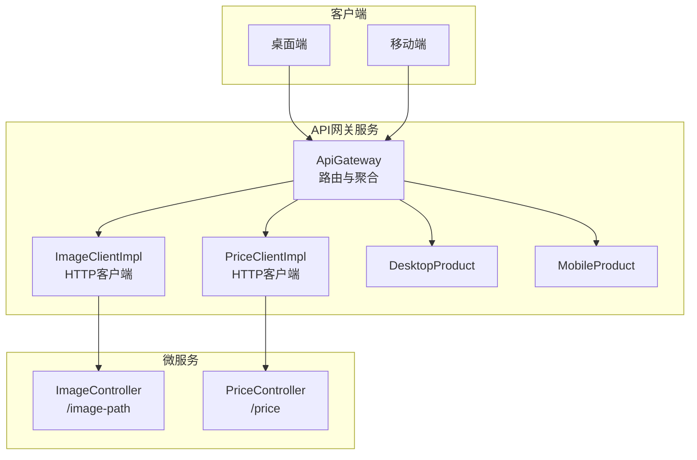
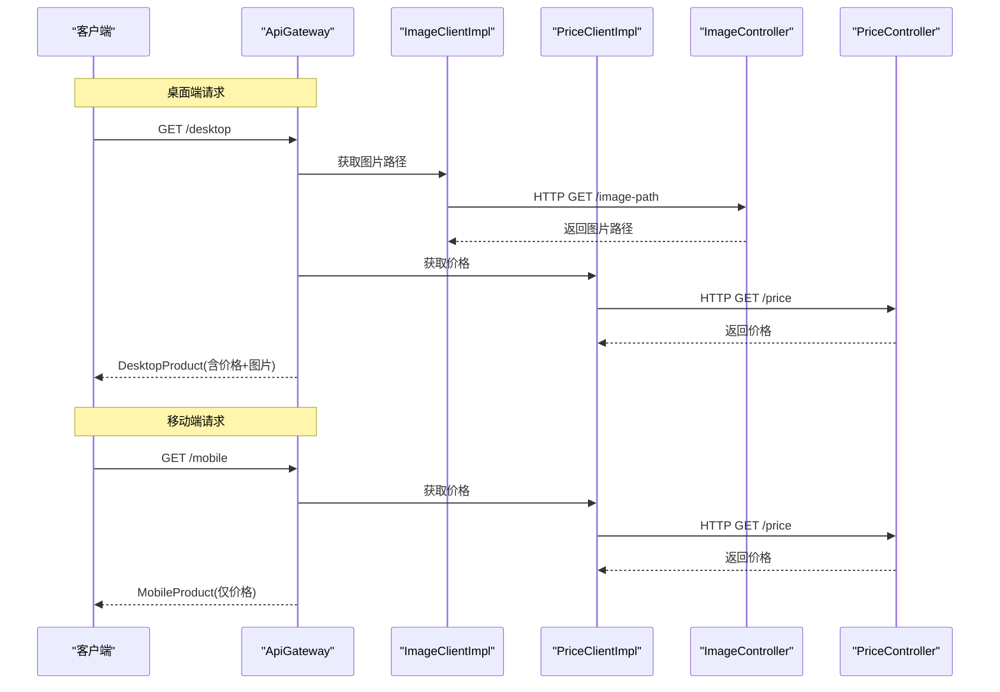
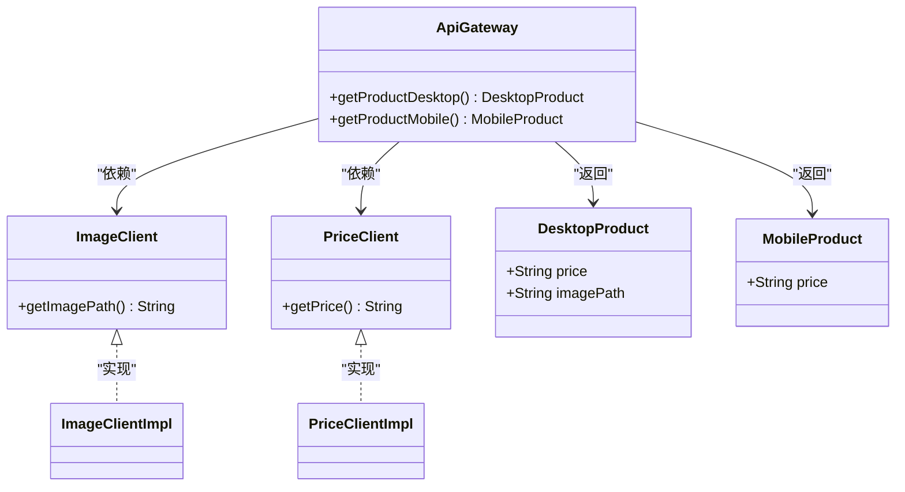
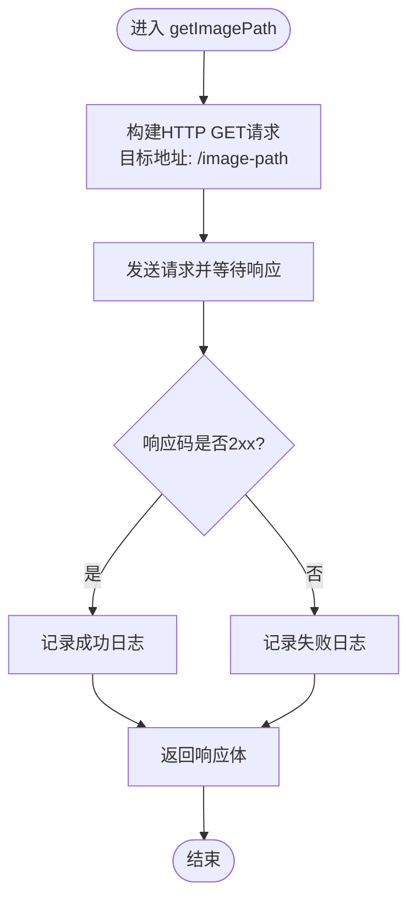
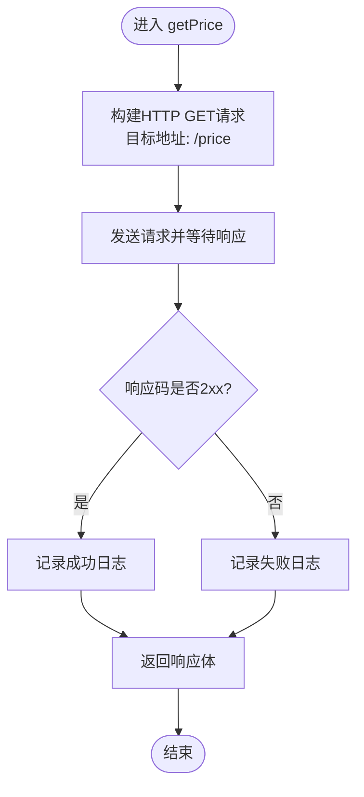
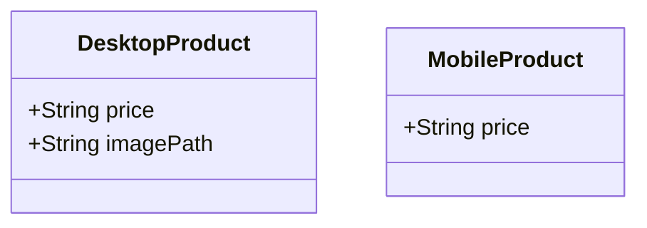
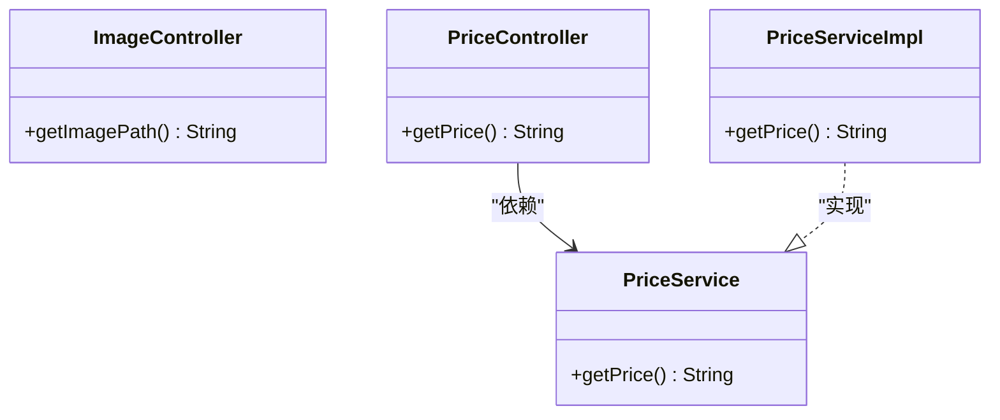
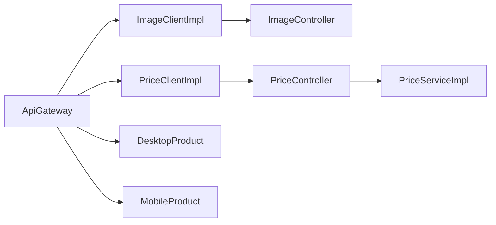

# API网关模式

<cite>
**本文引用的文件**
- [README.md](file://microservices-api-gateway/README.md)
- [App.java](file://microservices-api-gateway/api-gateway-service/src/main/java/com/iluwatar/api/gateway/App.java)
- [ApiGateway.java](file://microservices-api-gateway/api-gateway-service/src/main/java/com/iluwatar/api/gateway/ApiGateway.java)
- [ImageClient.java](file://microservices-api-gateway/api-gateway-service/src/main/java/com/iluwatar/api/gateway/ImageClient.java)
- [ImageClientImpl.java](file://microservices-api-gateway/api-gateway-service/src/main/java/com/iluwatar/api/gateway/ImageClientImpl.java)
- [PriceClient.java](file://microservices-api-gateway/api-gateway-service/src/main/java/com/iluwatar/api/gateway/PriceClient.java)
- [PriceClientImpl.java](file://microservices-api-gateway/api-gateway-service/src/main/java/com/iluwatar/api/gateway/PriceClientImpl.java)
- [DesktopProduct.java](file://microservices-api-gateway/api-gateway-service/src/main/java/com/iluwatar/api/gateway/DesktopProduct.java)
- [MobileProduct.java](file://microservices-api-gateway/api-gateway-service/src/main/java/com/iluwatar/api/gateway/MobileProduct.java)
- [ApiGatewayTest.java](file://microservices-api-gateway/api-gateway-service/src/test/java/com/iluwatar/api/gateway/ApiGatewayTest.java)
- [ImageController.java](file://microservices-api-gateway/image-microservice/src/main/java/com/iluwatar/image/microservice/ImageController.java)
- [PriceController.java](file://microservices-api-gateway/price-microservice/src/main/java/com/iluwatar/price/microservice/PriceController.java)
- [PriceService.java](file://microservices-api-gateway/price-microservice/src/main/java/com/iluwatar/price/microservice/PriceService.java)
- [PriceServiceImpl.java](file://microservices-api-gateway/price-microservice/src/main/java/com/iluwatar/price/microservice/PriceServiceImpl.java)
</cite>

## 目录
1. [引言](#引言)
2. [项目结构](#项目结构)
3. [核心组件](#核心组件)
4. [架构总览](#架构总览)
5. [详细组件分析](#详细组件分析)
6. [依赖关系分析](#依赖关系分析)
7. [性能考虑](#性能考虑)
8. [故障排查指南](#故障排查指南)
9. [结论](#结论)
10. [附录：与Spring Cloud Gateway的集成与最佳实践](#附录与spring-cloud-gateway的集成与最佳实践)

## 引言
本文件系统化阐述“API网关模式”的设计原理与实现机制，结合仓库中的Java示例，深入解析以下关键能力：
- 路由转发：将客户端请求定向到后端微服务
- 请求聚合：根据客户端类型（桌面/移动端）聚合多个微服务响应
- 安全控制：在统一入口进行鉴权、限流等横切关注点
- 错误处理：对下游异常进行降级与日志记录
- 性能优化：通过缓存、连接池、压缩等手段提升吞吐与延迟表现
- 与Spring Cloud Gateway的集成：从单体网关迁移到企业级网关的最佳实践

该实现以Spring Boot为基础，演示了如何通过网关为不同终端提供差异化的产品信息视图。

## 项目结构
该仓库采用多模块结构，围绕“API网关”与两个微服务展开：
- 网关服务模块：提供统一入口，聚合图像与价格信息
- 图像微服务模块：提供图片路径查询接口
- 价格微服务模块：提供价格查询接口

图表来源
- [ApiGateway.java](file://microservices-api-gateway/api-gateway-service/src/main/java/com/iluwatar/api/gateway/ApiGateway.java#L34-L67)
- [ImageClientImpl.java](file://microservices-api-gateway/api-gateway-service/src/main/java/com/iluwatar/api/gateway/ImageClientImpl.java#L39-L82)
- [PriceClientImpl.java](file://microservices-api-gateway/api-gateway-service/src/main/java/com/iluwatar/api/gateway/PriceClientImpl.java#L39-L83)
- [ImageController.java](file://microservices-api-gateway/image-microservice/src/main/java/com/iluwatar/image/microservice/ImageController.java#L35-L49)
- [PriceController.java](file://microservices-api-gateway/price-microservice/src/main/java/com/iluwatar/price/microservice/PriceController.java#L35-L50)

章节来源
- [README.md](file://microservices-api-gateway/README.md#L1-L178)
- [App.java](file://microservices-api-gateway/api-gateway-service/src/main/java/com/iluwatar/api/gateway/App.java#L30-L65)

## 核心组件
- 网关控制器：负责对外暴露REST端点，并按客户端类型聚合数据
- 客户端适配器：封装对图像与价格微服务的HTTP调用
- 数据模型：面向桌面端与移动端的聚合结果对象
- 微服务控制器：提供基础查询接口

章节来源
- [ApiGateway.java](file://microservices-api-gateway/api-gateway-service/src/main/java/com/iluwatar/api/gateway/ApiGateway.java#L34-L67)
- [ImageClient.java](file://microservices-api-gateway/api-gateway-service/src/main/java/com/iluwatar/api/gateway/ImageClient.java#L27-L32)
- [ImageClientImpl.java](file://microservices-api-gateway/api-gateway-service/src/main/java/com/iluwatar/api/gateway/ImageClientImpl.java#L39-L82)
- [PriceClient.java](file://microservices-api-gateway/api-gateway-service/src/main/java/com/iluwatar/api/gateway/PriceClient.java#L27-L32)
- [PriceClientImpl.java](file://microservices-api-gateway/api-gateway-service/src/main/java/com/iluwatar/api/gateway/PriceClientImpl.java#L39-L83)
- [DesktopProduct.java](file://microservices-api-gateway/api-gateway-service/src/main/java/com/iluwatar/api/gateway/DesktopProduct.java#L30-L47)
- [MobileProduct.java](file://microservices-api-gateway/api-gateway-service/src/main/java/com/iluwatar/api/gateway/MobileProduct.java#L30-L40)

## 架构总览
下图展示了从客户端到网关再到微服务的完整调用链路，以及桌面端与移动端的差异化聚合策略。

图表来源
- [ApiGateway.java](file://microservices-api-gateway/api-gateway-service/src/main/java/com/iluwatar/api/gateway/ApiGateway.java#L48-L66)
- [ImageClientImpl.java](file://microservices-api-gateway/api-gateway-service/src/main/java/com/iluwatar/api/gateway/ImageClientImpl.java#L48-L69)
- [PriceClientImpl.java](file://microservices-api-gateway/api-gateway-service/src/main/java/com/iluwatar/api/gateway/PriceClientImpl.java#L49-L69)
- [ImageController.java](file://microservices-api-gateway/image-microservice/src/main/java/com/iluwatar/image/microservice/ImageController.java#L44-L48)
- [PriceController.java](file://microservices-api-gateway/price-microservice/src/main/java/com/iluwatar/price/microservice/PriceController.java#L46-L49)

## 详细组件分析

### 组件A：ApiGateway（网关控制器）
职责
- 对外暴露REST端点
- 根据客户端类型选择性调用微服务
- 将结果封装为面向前端的数据模型

实现要点
- 使用注解驱动的Web层，基于方法映射提供接口
- 通过资源注入的方式组合客户端适配器
- 面向桌面端返回包含价格与图片路径的对象；面向移动端仅返回价格

图表来源
- [ApiGateway.java](file://microservices-api-gateway/api-gateway-service/src/main/java/com/iluwatar/api/gateway/ApiGateway.java#L34-L67)
- [ImageClient.java](file://microservices-api-gateway/api-gateway-service/src/main/java/com/iluwatar/api/gateway/ImageClient.java#L27-L32)
- [PriceClient.java](file://microservices-api-gateway/api-gateway-service/src/main/java/com/iluwatar/api/gateway/PriceClient.java#L27-L32)
- [DesktopProduct.java](file://microservices-api-gateway/api-gateway-service/src/main/java/com/iluwatar/api/gateway/DesktopProduct.java#L30-L47)
- [MobileProduct.java](file://microservices-api-gateway/api-gateway-service/src/main/java/com/iluwatar/api/gateway/MobileProduct.java#L30-L40)

章节来源
- [ApiGateway.java](file://microservices-api-gateway/api-gateway-service/src/main/java/com/iluwatar/api/gateway/ApiGateway.java#L34-L67)

### 组件B：ImageClientImpl（图像客户端）
职责
- 通过HTTP客户端访问图像微服务
- 记录请求与响应状态的日志
- 处理IO与中断异常

实现要点
- 基于JDK HTTP客户端发起GET请求
- 对响应码进行成功判定并记录日志
- 在异常情况下中断线程并记录错误

图表来源
- [ImageClientImpl.java](file://microservices-api-gateway/api-gateway-service/src/main/java/com/iluwatar/api/gateway/ImageClientImpl.java#L48-L82)

章节来源
- [ImageClientImpl.java](file://microservices-api-gateway/api-gateway-service/src/main/java/com/iluwatar/api/gateway/ImageClientImpl.java#L39-L82)

### 组件C：PriceClientImpl（价格客户端）
职责
- 通过HTTP客户端访问价格微服务
- 记录请求与响应状态的日志
- 处理IO与中断异常

实现要点
- 基于JDK HTTP客户端发起GET请求
- 对响应码进行成功判定并记录日志
- 在异常情况下中断线程并记录错误

图表来源
- [PriceClientImpl.java](file://microservices-api-gateway/api-gateway-service/src/main/java/com/iluwatar/api/gateway/PriceClientImpl.java#L49-L83)

章节来源
- [PriceClientImpl.java](file://microservices-api-gateway/api-gateway-service/src/main/java/com/iluwatar/api/gateway/PriceClientImpl.java#L39-L83)

### 组件D：数据模型（DesktopProduct 与 MobileProduct）
职责
- 封装面向不同客户端的聚合数据
- 提供字段访问器

实现要点
- 使用Lombok简化getter/setter
- DesktopProduct包含价格与图片路径
- MobileProduct仅包含价格

图表来源
- [DesktopProduct.java](file://microservices-api-gateway/api-gateway-service/src/main/java/com/iluwatar/api/gateway/DesktopProduct.java#L30-L47)
- [MobileProduct.java](file://microservices-api-gateway/api-gateway-service/src/main/java/com/iluwatar/api/gateway/MobileProduct.java#L30-L40)

章节来源
- [DesktopProduct.java](file://microservices-api-gateway/api-gateway-service/src/main/java/com/iluwatar/api/gateway/DesktopProduct.java#L30-L47)
- [MobileProduct.java](file://microservices-api-gateway/api-gateway-service/src/main/java/com/iluwatar/api/gateway/MobileProduct.java#L30-L40)

### 组件E：微服务控制器（ImageController 与 PriceController）
职责
- 暴露查询接口供网关调用
- 价格微服务进一步委托服务层

实现要点
- ImageController直接返回固定值（演示用途）
- PriceController委派至PriceService，PriceServiceImpl返回固定值

图表来源
- [ImageController.java](file://microservices-api-gateway/image-microservice/src/main/java/com/iluwatar/image/microservice/ImageController.java#L35-L49)
- [PriceController.java](file://microservices-api-gateway/price-microservice/src/main/java/com/iluwatar/price/microservice/PriceController.java#L35-L50)
- [PriceService.java](file://microservices-api-gateway/price-microservice/src/main/java/com/iluwatar/price/microservice/PriceService.java#L27-L38)
- [PriceServiceImpl.java](file://microservices-api-gateway/price-microservice/src/main/java/com/iluwatar/price/microservice/PriceServiceImpl.java#L33-L45)

章节来源
- [ImageController.java](file://microservices-api-gateway/image-microservice/src/main/java/com/iluwatar/image/microservice/ImageController.java#L35-L49)
- [PriceController.java](file://microservices-api-gateway/price-microservice/src/main/java/com/iluwatar/price/microservice/PriceController.java#L35-L50)
- [PriceService.java](file://microservices-api-gateway/price-microservice/src/main/java/com/iluwatar/price/microservice/PriceService.java#L27-L38)
- [PriceServiceImpl.java](file://microservices-api-gateway/price-microservice/src/main/java/com/iluwatar/price/microservice/PriceServiceImpl.java#L33-L45)

## 依赖关系分析
- 网关对客户端适配器存在运行时依赖，客户端适配器再对微服务发起HTTP调用
- 网关对数据模型存在输出依赖
- 微服务控制器对服务层存在依赖

图表来源
- [ApiGateway.java](file://microservices-api-gateway/api-gateway-service/src/main/java/com/iluwatar/api/gateway/ApiGateway.java#L34-L67)
- [ImageClientImpl.java](file://microservices-api-gateway/api-gateway-service/src/main/java/com/iluwatar/api/gateway/ImageClientImpl.java#L39-L82)
- [PriceClientImpl.java](file://microservices-api-gateway/api-gateway-service/src/main/java/com/iluwatar/api/gateway/PriceClientImpl.java#L39-L83)
- [ImageController.java](file://microservices-api-gateway/image-microservice/src/main/java/com/iluwatar/image/microservice/ImageController.java#L35-L49)
- [PriceController.java](file://microservices-api-gateway/price-microservice/src/main/java/com/iluwatar/price/microservice/PriceController.java#L35-L50)
- [PriceServiceImpl.java](file://microservices-api-gateway/price-microservice/src/main/java/com/iluwatar/price/microservice/PriceServiceImpl.java#L33-L45)

章节来源
- [ApiGateway.java](file://microservices-api-gateway/api-gateway-service/src/main/java/com/iluwatar/api/gateway/ApiGateway.java#L34-L67)
- [ImageClientImpl.java](file://microservices-api-gateway/api-gateway-service/src/main/java/com/iluwatar/api/gateway/ImageClientImpl.java#L39-L82)
- [PriceClientImpl.java](file://microservices-api-gateway/api-gateway-service/src/main/java/com/iluwatar/api/gateway/PriceClientImpl.java#L39-L83)
- [ImageController.java](file://microservices-api-gateway/image-microservice/src/main/java/com/iluwatar/image/microservice/ImageController.java#L35-L49)
- [PriceController.java](file://microservices-api-gateway/price-microservice/src/main/java/com/iluwatar/price/microservice/PriceController.java#L35-L50)
- [PriceServiceImpl.java](file://microservices-api-gateway/price-microservice/src/main/java/com/iluwatar/price/microservice/PriceServiceImpl.java#L33-L45)

## 性能考虑
- 连接与超时管理
  - 当前实现使用JDK默认HTTP客户端，未显式设置连接池与超时参数。建议在生产环境配置连接复用、读写超时与重试策略，避免阻塞与资源泄露。
- 并发与异步
  - 网关当前为同步调用图像与价格服务。可引入异步或并行执行以减少总延迟，但需注意错误聚合与异常传播。
- 缓存策略
  - 对于不频繁变化的数据（如商品图片路径、价格），可在网关层引入本地缓存或分布式缓存，降低下游压力并提升响应速度。
- 压缩与序列化
  - 启用GZIP压缩与高效的序列化格式（如JSON/MessagePack）可显著降低带宽占用。
- 负载均衡与高可用
  - 将微服务注册到服务发现组件，网关侧通过客户端负载均衡或外部LB实现流量分摊。
- 监控与可观测性
  - 埋点请求耗时、成功率、错误码分布，结合日志与追踪系统定位瓶颈。

## 故障排查指南
常见问题与处理建议
- 网络异常与超时
  - 症状：客户端长时间无响应或抛出IO异常
  - 排查：检查微服务端口与主机连通性、防火墙策略；确认网关侧超时配置
- 响应码非2xx
  - 症状：日志中出现失败告警
  - 排查：核对微服务端点是否正确、服务是否正常启动；检查网关对响应码的判定逻辑
- 线程中断
  - 症状：调用被中断
  - 排查：确认调用方未主动中断线程；在网关侧妥善处理中断状态并恢复
- 单元测试验证
  - 可通过模拟客户端返回值，验证网关聚合逻辑与数据模型填充是否正确

章节来源
- [ApiGatewayTest.java](file://microservices-api-gateway/api-gateway-service/src/test/java/com/iluwatar/api/gateway/ApiGatewayTest.java#L55-L82)
- [ImageClientImpl.java](file://microservices-api-gateway/api-gateway-service/src/main/java/com/iluwatar/api/gateway/ImageClientImpl.java#L61-L66)
- [PriceClientImpl.java](file://microservices-api-gateway/api-gateway-service/src/main/java/com/iluwatar/api/gateway/PriceClientImpl.java#L62-L67)

## 结论
本实现以最小代价演示了API网关的核心价值：统一入口、差异化聚合与横切关注点集中化。在实际生产环境中，建议结合Spring Cloud Gateway等企业级网关，完善路由规则、过滤器链、限流熔断、认证授权与可观测性体系，从而获得更高的可靠性与扩展性。

## 附录：与Spring Cloud Gateway的集成与最佳实践
- 集成步骤
  - 引入Spring Cloud Gateway起步依赖
  - 在配置文件中定义路由规则，将桌面端与移动端请求分别指向不同后端服务或同一服务的不同端点
  - 通过过滤器实现鉴权、限流、日志与头信息改写
- 最佳实践
  - 路由粒度：按业务域或终端类型划分路由，便于独立演进
  - 过滤器顺序：严格控制过滤器链顺序，确保鉴权在限流之前、日志在最后
  - 熔断与降级：对下游失败率设定阈值，触发熔断并在网关层返回降级响应
  - 缓存：对热点数据进行缓存，减少对下游的压力
  - 监控：采集RT、QPS、错误码与实例健康指标，建立告警与自愈机制

章节来源
- [README.md](file://microservices-api-gateway/README.md#L139-L142)