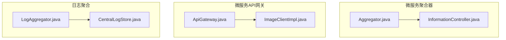
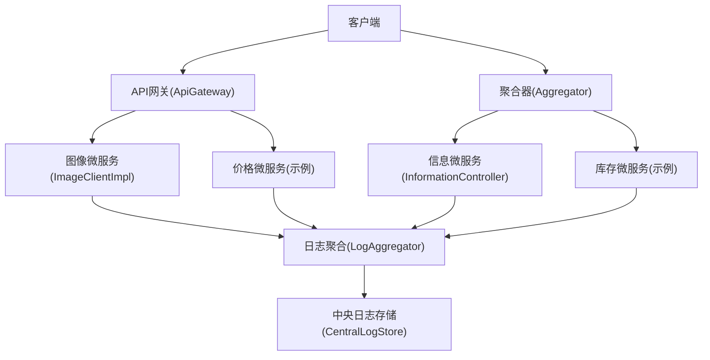
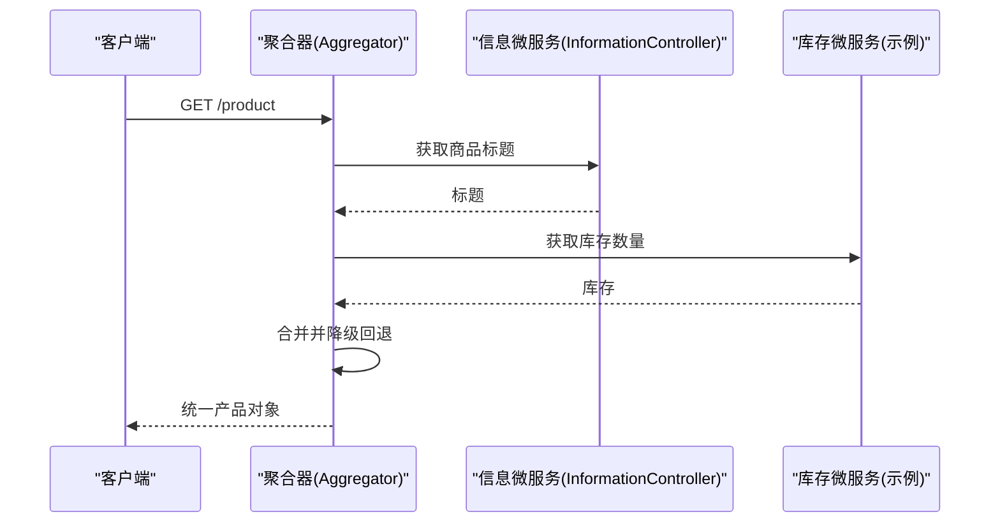
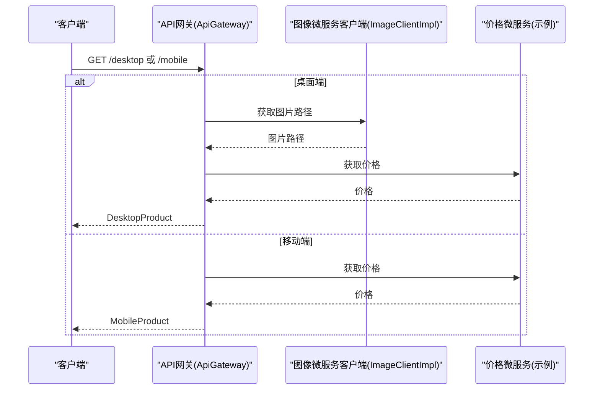
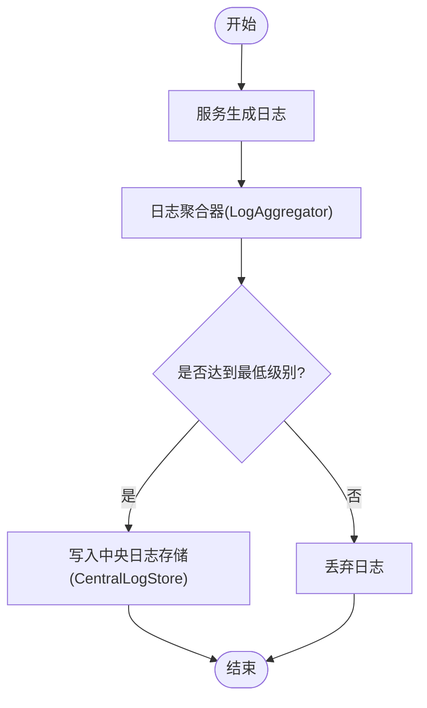
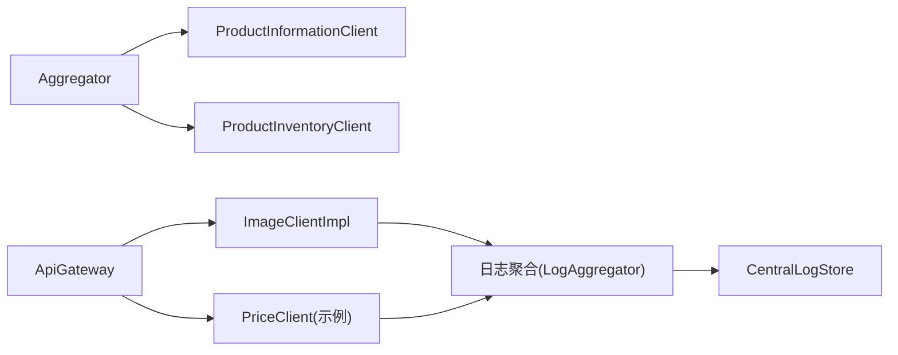

# 微服务架构模式

<cite>
**本文引用的文件**
- [微服务聚合器模式说明](file://microservices-aggregrator/README.md)
- [聚合器服务：Aggregator.java](file://microservices-aggregrator/aggregator-service/src/main/java/com/iluwatar/aggregator/microservices/Aggregator.java)
- [信息微服务：InformationController.java](file://microservices-aggregrator/information-microservice/src/main/java/com/iluwatar/information/microservice/InformationController.java)
- [微服务API网关模式说明](file://microservices-api-gateway/README.md)
- [API网关：ApiGateway.java](file://microservices-api-gateway/api-gateway-service/src/main/java/com/iluwatar/api/gateway/ApiGateway.java)
- [图像微服务客户端：ImageClientImpl.java](file://microservices-api-gateway/api-gateway-service/src/main/java/com/iluwatar/api/gateway/ImageClientImpl.java)
- [日志聚合模式说明](file://microservices-log-aggregation/README.md)
- [日志聚合器：LogAggregator.java](file://microservices-log-aggregation/src/main/java/com/iluwatar/logaggregation/LogAggregator.java)
- [中央日志存储：CentralLogStore.java](file://microservices-log-aggregation/src/main/java/com/iluwatar/logaggregation/CentralLogStore.java)
</cite>

## 目录
1. [引言](#引言)
2. [项目结构](#项目结构)
3. [核心组件](#核心组件)
4. [架构总览](#架构总览)
5. [详细组件分析](#详细组件分析)
6. [依赖关系分析](#依赖关系分析)
7. [性能考量](#性能考量)
8. [故障排查指南](#故障排查指南)
9. [结论](#结论)
10. [附录](#附录)

## 引言
本指南围绕微服务架构的关键模式展开，结合仓库中已有的“微服务聚合器”“微服务API网关”“微服务日志聚合”三个主题模块，系统讲解微服务的设计原则、服务拆分策略与通信机制，并通过具体代码级示例（以文件路径和类名标注）帮助读者理解如何在实际工程中落地这些模式。同时，文档覆盖聚合器如何整合多服务响应、API网关如何统一路由与适配不同客户端需求、日志聚合如何支撑分布式系统的可观测性与运维实践。

## 项目结构
该仓库采用多模块组织方式，每个模式独立为一个子目录，包含说明文档与最小可运行示例。与本指南目标直接相关的模块如下：
- microservices-aggregrator：展示聚合器模式，将来自多个微服务的数据合并为统一响应。
- microservices-api-gateway：展示API网关模式，作为统一入口路由请求并按客户端类型进行差异化聚合。
- microservices-log-aggregation：展示日志聚合模式，集中收集与过滤日志，支持监控与排障。

图表来源
- [聚合器服务：Aggregator.java](file://microservices-aggregrator/aggregator-service/src/main/java/com/iluwatar/aggregator/microservices/Aggregator.java#L37-L67)
- [信息微服务：InformationController.java](file://microservices-aggregrator/information-microservice/src/main/java/com/iluwatar/information/microservice/InformationController.java#L33-L45)
- [API网关：ApiGateway.java](file://microservices-api-gateway/api-gateway-service/src/main/java/com/iluwatar/api/gateway/ApiGateway.java#L34-L67)
- [图像微服务客户端：ImageClientImpl.java](file://microservices-api-gateway/api-gateway-service/src/main/java/com/iluwatar/api/gateway/ImageClientImpl.java#L39-L82)
- [日志聚合器：LogAggregator.java](file://microservices-log-aggregation/src/main/java/com/iluwatar/logaggregation/LogAggregator.java#L66-L82)
- [中央日志存储：CentralLogStore.java](file://microservices-log-aggregation/src/main/java/com/iluwatar/logaggregation/CentralLogStore.java#L49-L62)

章节来源
- [微服务聚合器模式说明](file://microservices-aggregrator/README.md#L21-L38)
- [微服务API网关模式说明](file://microservices-api-gateway/README.md#L18-L40)
- [日志聚合模式说明](file://microservices-log-aggregation/README.md#L23-L40)

## 核心组件
- 聚合器（Aggregator）
  - 作用：从多个微服务拉取数据，合并为统一响应，简化客户端调用。
  - 关键点：依赖注入两个下游客户端；对空值进行降级回退；对外暴露REST端点。
- 信息微服务（InformationController）
  - 作用：提供单一职责的信息查询端点，供聚合器调用。
- API网关（ApiGateway）
  - 作用：面向不同客户端（桌面/移动端）提供差异化聚合视图，统一入口路由。
- 图像微服务客户端（ImageClientImpl）
  - 作用：封装对图像微服务的HTTP调用，记录日志与错误处理。
- 日志聚合器（LogAggregator）
  - 作用：集中收集各服务日志，按级别过滤后写入中央存储。
- 中央日志存储（CentralLogStore）
  - 作用：统一存放日志条目，便于展示与检索。

章节来源
- [聚合器服务：Aggregator.java](file://microservices-aggregrator/aggregator-service/src/main/java/com/iluwatar/aggregator/microservices/Aggregator.java#L37-L67)
- [信息微服务：InformationController.java](file://microservices-aggregrator/information-microservice/src/main/java/com/iluwatar/information/microservice/InformationController.java#L33-L45)
- [API网关：ApiGateway.java](file://microservices-api-gateway/api-gateway-service/src/main/java/com/iluwatar/api/gateway/ApiGateway.java#L34-L67)
- [图像微服务客户端：ImageClientImpl.java](file://microservices-api-gateway/api-gateway-service/src/main/java/com/iluwatar/api/gateway/ImageClientImpl.java#L39-L82)
- [日志聚合器：LogAggregator.java](file://microservices-log-aggregation/src/main/java/com/iluwatar/logaggregation/LogAggregator.java#L66-L82)
- [中央日志存储：CentralLogStore.java](file://microservices-log-aggregation/src/main/java/com/iluwatar/logaggregation/CentralLogStore.java#L49-L62)

## 架构总览
下图展示了三类模式在系统中的协作关系：API网关负责路由与适配，聚合器负责跨服务合并，日志聚合负责集中观测。

图表来源
- [API网关：ApiGateway.java](file://microservices-api-gateway/api-gateway-service/src/main/java/com/iluwatar/api/gateway/ApiGateway.java#L34-L67)
- [图像微服务客户端：ImageClientImpl.java](file://microservices-api-gateway/api-gateway-service/src/main/java/com/iluwatar/api/gateway/ImageClientImpl.java#L39-L82)
- [聚合器服务：Aggregator.java](file://microservices-aggregrator/aggregator-service/src/main/java/com/iluwatar/aggregator/microservices/Aggregator.java#L37-L67)
- [信息微服务：InformationController.java](file://microservices-aggregrator/information-microservice/src/main/java/com/iluwatar/information/microservice/InformationController.java#L33-L45)
- [日志聚合器：LogAggregator.java](file://microservices-log-aggregation/src/main/java/com/iluwatar/logaggregation/LogAggregator.java#L66-L82)
- [中央日志存储：CentralLogStore.java](file://microservices-log-aggregation/src/main/java/com/iluwatar/logaggregation/CentralLogStore.java#L49-L62)

## 详细组件分析

### 聚合器模式（API组合）
- 设计意图
  - 将来自多个微服务的数据聚合为统一响应，减少客户端多次调用，提升延迟与耦合度方面的收益。
- 数据模型与流程
  - 聚合器通过两个客户端分别调用信息与库存微服务，组装产品对象并返回。
  - 对上游返回为空的情况进行降级回退，保证接口稳定性。
- 适用场景
  - 需要复合视图的电商、仪表盘等场景，显著简化客户端逻辑。

图表来源
- [聚合器服务：Aggregator.java](file://microservices-aggregrator/aggregator-service/src/main/java/com/iluwatar/aggregator/microservices/Aggregator.java#L51-L65)
- [信息微服务：InformationController.java](file://microservices-aggregrator/information-microservice/src/main/java/com/iluwatar/information/microservice/InformationController.java#L41-L44)

章节来源
- [微服务聚合器模式说明](file://microservices-aggregrator/README.md#L21-L38)
- [聚合器服务：Aggregator.java](file://microservices-aggregrator/aggregator-service/src/main/java/com/iluwatar/aggregator/microservices/Aggregator.java#L37-L67)
- [信息微服务：InformationController.java](file://microservices-aggregrator/information-microservice/src/main/java/com/iluwatar/information/microservice/InformationController.java#L33-L45)

### API网关模式（统一入口与差异化聚合）
- 设计意图
  - 提供统一入口，路由到后端微服务，并根据客户端类型（桌面/移动）进行差异化聚合。
- 实现要点
  - 桌面端：同时调用图像与价格微服务，返回包含图片路径与价格的视图对象。
  - 移动端：仅调用价格微服务，返回精简视图对象。
  - 客户端适配器封装HTTP调用，记录日志与错误处理。
- 与聚合器的关系
  - API网关可看作面向“客户端”的聚合器，聚合器更偏向“服务间”的数据合并。

图表来源
- [API网关：ApiGateway.java](file://microservices-api-gateway/api-gateway-service/src/main/java/com/iluwatar/api/gateway/ApiGateway.java#L48-L66)
- [图像微服务客户端：ImageClientImpl.java](file://microservices-api-gateway/api-gateway-service/src/main/java/com/iluwatar/api/gateway/ImageClientImpl.java#L48-L69)

章节来源
- [微服务API网关模式说明](file://microservices-api-gateway/README.md#L18-L40)
- [API网关：ApiGateway.java](file://microservices-api-gateway/api-gateway-service/src/main/java/com/iluwatar/api/gateway/ApiGateway.java#L34-L67)
- [图像微服务客户端：ImageClientImpl.java](file://microservices-api-gateway/api-gateway-service/src/main/java/com/iluwatar/api/gateway/ImageClientImpl.java#L39-L82)

### 日志聚合模式（集中化观测）
- 设计意图
  - 在分布式系统中集中收集、过滤与存储日志，提升可观测性与排障效率。
- 组件职责
  - 日志生产者：各服务生成日志条目并发送给聚合器。
  - 日志聚合器：按最低日志级别过滤后写入中央存储。
  - 中央日志存储：统一存放日志条目，支持展示与检索。
- 运维价值
  - 统一视图、合规审计、高可用与弹性（需额外基础设施支撑）。

图表来源
- [日志聚合器：LogAggregator.java](file://microservices-log-aggregation/src/main/java/com/iluwatar/logaggregation/LogAggregator.java#L77-L81)
- [中央日志存储：CentralLogStore.java](file://microservices-log-aggregation/src/main/java/com/iluwatar/logaggregation/CentralLogStore.java#L54-L61)

章节来源
- [日志聚合模式说明](file://microservices-log-aggregation/README.md#L23-L40)
- [日志聚合器：LogAggregator.java](file://microservices-log-aggregation/src/main/java/com/iluwatar/logaggregation/LogAggregator.java#L66-L82)
- [中央日志存储：CentralLogStore.java](file://microservices-log-aggregation/src/main/java/com/iluwatar/logaggregation/CentralLogStore.java#L49-L62)

## 依赖关系分析
- 聚合器依赖
  - 依赖信息与库存微服务客户端接口，通过资源注入在运行时装配。
- API网关依赖
  - 依赖图像与价格微服务客户端接口，按请求路径选择调用策略。
- 日志聚合依赖
  - 日志生产者向聚合器提交日志条目；聚合器写入中央存储。

图表来源
- [聚合器服务：Aggregator.java](file://microservices-aggregrator/aggregator-service/src/main/java/com/iluwatar/aggregator/microservices/Aggregator.java#L40-L44)
- [API网关：ApiGateway.java](file://microservices-api-gateway/api-gateway-service/src/main/java/com/iluwatar/api/gateway/ApiGateway.java#L37-L41)
- [图像微服务客户端：ImageClientImpl.java](file://microservices-api-gateway/api-gateway-service/src/main/java/com/iluwatar/api/gateway/ImageClientImpl.java#L39-L41)
- [日志聚合器：LogAggregator.java](file://microservices-log-aggregation/src/main/java/com/iluwatar/logaggregation/LogAggregator.java#L66-L75)
- [中央日志存储：CentralLogStore.java](file://microservices-log-aggregation/src/main/java/com/iluwatar/logaggregation/CentralLogStore.java#L49-L56)

章节来源
- [聚合器服务：Aggregator.java](file://microservices-aggregrator/aggregator-service/src/main/java/com/iluwatar/aggregator/microservices/Aggregator.java#L37-L67)
- [API网关：ApiGateway.java](file://microservices-api-gateway/api-gateway-service/src/main/java/com/iluwatar/api/gateway/ApiGateway.java#L34-L67)
- [图像微服务客户端：ImageClientImpl.java](file://microservices-api-gateway/api-gateway-service/src/main/java/com/iluwatar/api/gateway/ImageClientImpl.java#L39-L82)
- [日志聚合器：LogAggregator.java](file://microservices-log-aggregation/src/main/java/com/iluwatar/logaggregation/LogAggregator.java#L66-L82)
- [中央日志存储：CentralLogStore.java](file://microservices-log-aggregation/src/main/java/com/iluwatar/logaggregation/CentralLogStore.java#L49-L62)

## 性能考量
- 网络与延迟
  - 聚合器与API网关通过一次调用合并多次网络请求，降低客户端往返次数，但需关注下游服务的超时与重试策略，避免成为瓶颈。
- 并发与吞吐
  - 客户端适配器使用标准HTTP客户端，建议结合连接池、超时配置与并发限制，确保在高负载下的稳定性。
- 缓存与压缩
  - API网关可引入缓存与响应压缩，进一步优化跨服务聚合的性能。
- 可观测性
  - 日志聚合应配合指标与链路追踪，形成完整的性能分析闭环。

## 故障排查指南
- 聚合器降级
  - 当上游服务返回空值或异常时，聚合器进行降级回退，保障接口可用性。建议在日志中记录降级原因以便后续分析。
- API网关错误处理
  - 客户端适配器捕获IO与中断异常并记录错误日志，便于定位网络或服务端问题。
- 日志聚合
  - 使用最小日志级别过滤，确保关键错误与警告被保留；定期清理与归档，避免存储压力过大。

章节来源
- [聚合器服务：Aggregator.java](file://microservices-aggregrator/aggregator-service/src/main/java/com/iluwatar/aggregator/microservices/Aggregator.java#L58-L62)
- [图像微服务客户端：ImageClientImpl.java](file://microservices-api-gateway/api-gateway-service/src/main/java/com/iluwatar/api/gateway/ImageClientImpl.java#L61-L66)
- [日志聚合器：LogAggregator.java](file://microservices-log-aggregation/src/main/java/com/iluwatar/logaggregation/LogAggregator.java#L77-L81)

## 结论
本指南基于仓库中的聚合器、API网关与日志聚合三个模式，系统阐述了微服务架构中的关键实践：通过聚合器与API网关减少客户端复杂度、提升用户体验；通过日志聚合构建统一的可观测体系。在真实工程中，建议结合容错、限流、服务发现与部署策略，持续优化系统的可靠性与性能。

## 附录
- 术语
  - 聚合器：将多个服务的响应合并为统一视图的服务层组件。
  - API网关：统一入口，负责路由、协议转换与差异化聚合。
  - 日志聚合：集中收集、过滤与存储日志，支撑监控与排障。
- 参考资料
  - 微服务聚合器模式说明
  - 微服务API网关模式说明
  - 微服务日志聚合模式说明