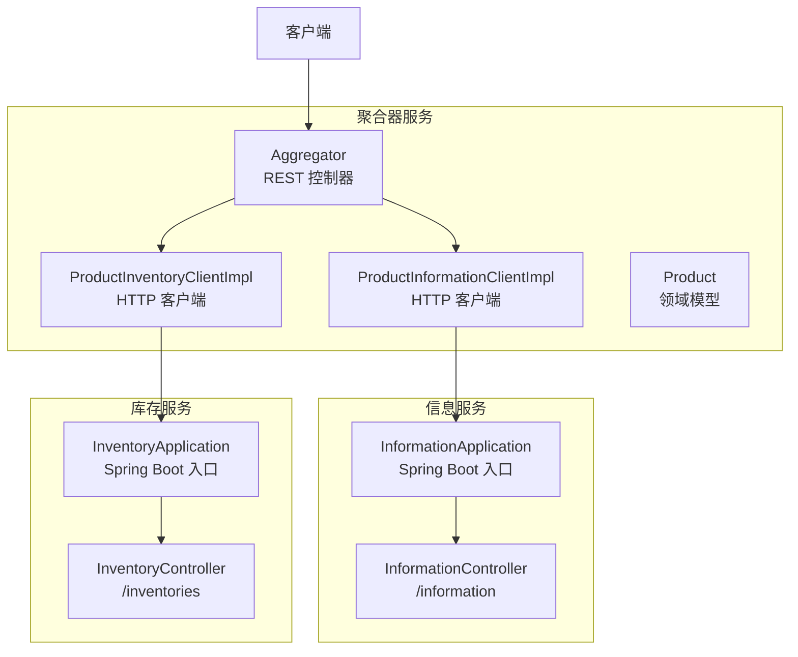
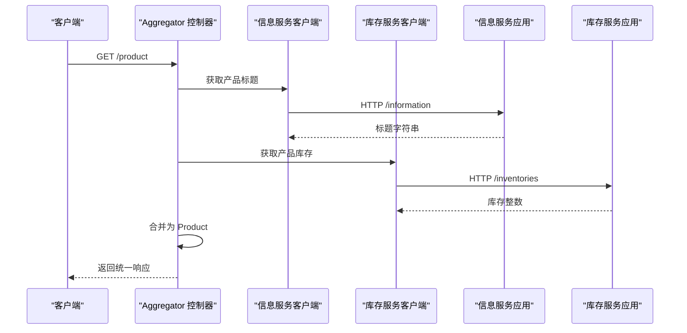
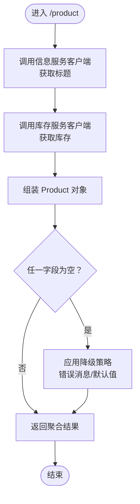
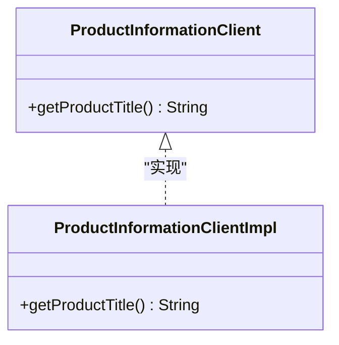
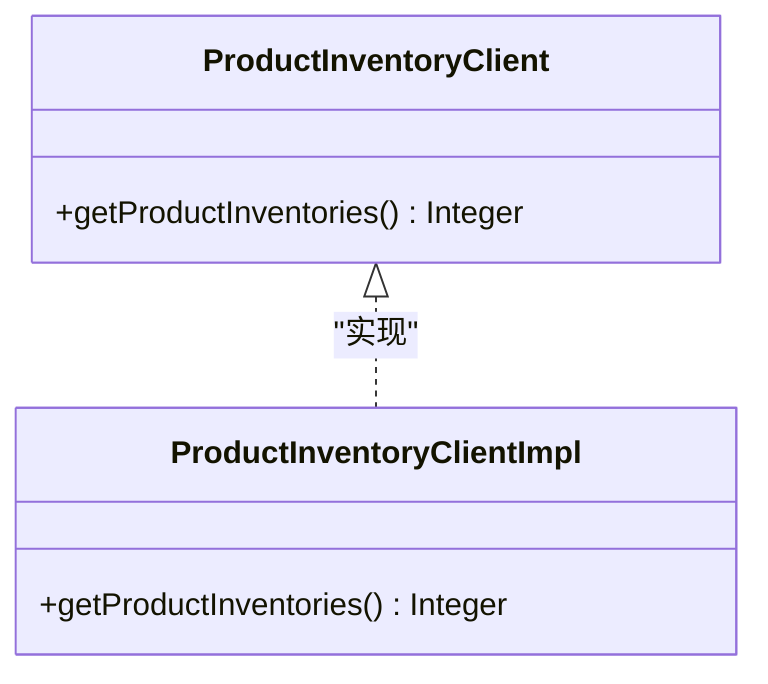
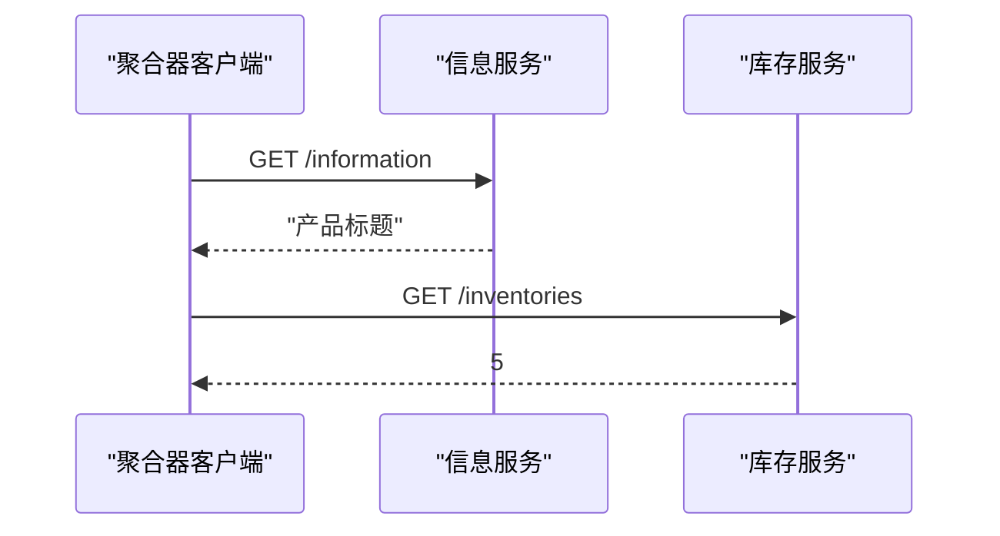
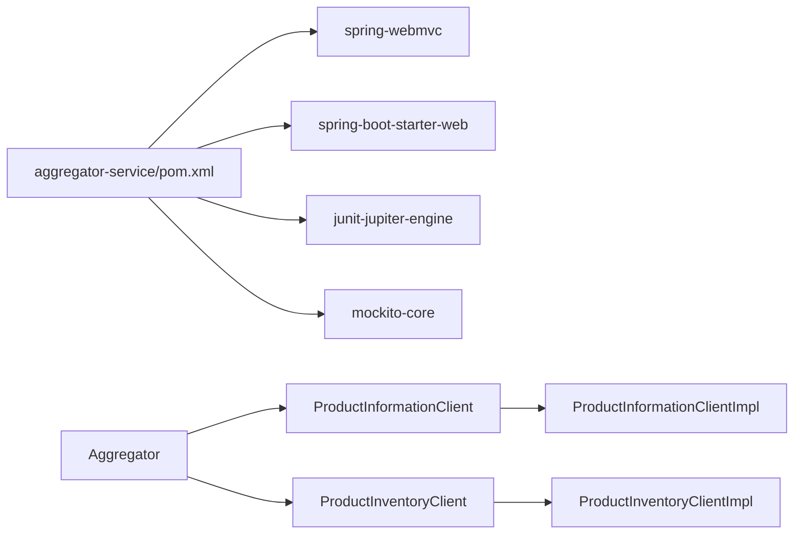

# 微服务聚合器模式

<cite>
**本文引用的文件**
- [README.md](file://microservices-aggregrator/README.md)
- [Aggregator.java](file://microservices-aggregrator/aggregator-service/src/main/java/com/iluwatar/aggregator/microservices/Aggregator.java)
- [ProductInformationClient.java](file://microservices-aggregrator/aggregator-service/src/main/java/com/iluwatar/aggregator/microservices/ProductInformationClient.java)
- [ProductInventoryClient.java](file://microservices-aggregrator/aggregator-service/src/main/java/com/iluwatar/aggregator/microservices/ProductInventoryClient.java)
- [ProductInformationClientImpl.java](file://microservices-aggregrator/aggregator-service/src/main/java/com/iluwatar/aggregator/microservices/ProductInformationClientImpl.java)
- [ProductInventoryClientImpl.java](file://microservices-aggregrator/aggregator-service/src/main/java/com/iluwatar/aggregator/microservices/ProductInventoryClientImpl.java)
- [Product.java](file://microservices-aggregrator/aggregator-service/src/main/java/com/iluwatar/aggregator/microservices/Product.java)
- [App.java](file://microservices-aggregrator/aggregator-service/src/main/java/com/iluwatar/aggregator/microservices/App.java)
- [InformationController.java](file://microservices-aggregrator/information-microservice/src/main/java/com/iluwatar/information/microservice/InformationController.java)
- [InventoryController.java](file://microservices-aggregrator/inventory-microservice/src/main/java/com/iluwatar/inventory/microservice/InventoryController.java)
- [InformationApplication.java](file://microservices-aggregrator/information-microservice/src/main/java/com/iluwatar/information/microservice/InformationApplication.java)
- [InventoryApplication.java](file://microservices-aggregrator/inventory-microservice/src/main/java/com/iluwatar/inventory/microservice/InventoryApplication.java)
- [AggregatorTest.java](file://microservices-aggregrator/aggregator-service/src/test/java/com/iluwatar/aggregator/microservices/AggregatorTest.java)
- [pom.xml](file://microservices-aggregrator/aggregator-service/pom.xml)
</cite>

## 目录
1. [简介](#简介)
2. [项目结构](#项目结构)
3. [核心组件](#核心组件)
4. [架构总览](#架构总览)
5. [详细组件分析](#详细组件分析)
6. [依赖关系分析](#依赖关系分析)
7. [性能考量](#性能考量)
8. [故障排查指南](#故障排查指南)
9. [结论](#结论)
10. [附录](#附录)

## 简介
本指南围绕微服务聚合器模式展开，系统阐述如何通过聚合器将来自多个微服务的响应整合为统一数据视图，从而简化客户端交互、降低网络往返次数，并提升整体系统的可扩展性与可维护性。文档以仓库中的示例工程为基础，逐层解析聚合器的编排逻辑、错误处理与超时管理机制，给出库存服务与信息服务的完整实现路径，并讨论与事件驱动架构的结合、故障恢复与监控方案。

## 项目结构
该示例工程由三个子模块组成：
- 聚合器服务：负责编排与聚合来自信息服务与库存服务的数据，对外暴露统一的 REST 接口。
- 信息服务：提供产品标题等信息查询接口。
- 库存服务：提供产品库存数量查询接口。

图表来源
- [Aggregator.java](file://microservices-aggregrator/aggregator-service/src/main/java/com/iluwatar/aggregator/microservices/Aggregator.java#L37-L67)
- [ProductInformationClientImpl.java](file://microservices-aggregrator/aggregator-service/src/main/java/com/iluwatar/aggregator/microservices/ProductInformationClientImpl.java#L38-L60)
- [ProductInventoryClientImpl.java](file://microservices-aggregrator/aggregator-service/src/main/java/com/iluwatar/aggregator/microservices/ProductInventoryClientImpl.java#L38-L66)
- [InformationController.java](file://microservices-aggregrator/information-microservice/src/main/java/com/iluwatar/information/microservice/InformationController.java#L33-L45)
- [InventoryController.java](file://microservices-aggregrator/inventory-microservice/src/main/java/com/iluwatar/inventory/microservice/InventoryController.java#L33-L46)

章节来源
- [README.md](file://microservices-aggregrator/README.md#L1-L141)
- [pom.xml](file://microservices-aggregrator/aggregator-service/pom.xml#L28-L79)

## 核心组件
- 领域模型 Product：封装聚合后的商品标题与库存数量，作为统一返回体。
- 聚合控制器 Aggregator：对外提供 /product 接口，协调调用信息服务与库存服务客户端。
- 信息服务客户端 ProductInformationClient 及实现 ProductInformationClientImpl：封装对信息服务的 HTTP 请求。
- 库存服务客户端 ProductInventoryClient 及实现 ProductInventoryClientImpl：封装对库存服务的 HTTP 请求。
- 信息服务与库存服务的 Spring Boot 应用入口与控制器：分别提供 /information 与 /inventories 接口。

章节来源
- [Product.java](file://microservices-aggregrator/aggregator-service/src/main/java/com/iluwatar/aggregator/microservices/Product.java#L30-L48)
- [Aggregator.java](file://microservices-aggregrator/aggregator-service/src/main/java/com/iluwatar/aggregator/microservices/Aggregator.java#L37-L67)
- [ProductInformationClient.java](file://microservices-aggregrator/aggregator-service/src/main/java/com/iluwatar/aggregator/microservices/ProductInformationClient.java#L27-L34)
- [ProductInformationClientImpl.java](file://microservices-aggregrator/aggregator-service/src/main/java/com/iluwatar/aggregator/microservices/ProductInformationClientImpl.java#L35-L60)
- [ProductInventoryClient.java](file://microservices-aggregrator/aggregator-service/src/main/java/com/iluwatar/aggregator/microservices/ProductInventoryClient.java#L27-L33)
- [ProductInventoryClientImpl.java](file://microservices-aggregrator/aggregator-service/src/main/java/com/iluwatar/aggregator/microservices/ProductInventoryClientImpl.java#L35-L66)
- [InformationController.java](file://microservices-aggregrator/information-microservice/src/main/java/com/iluwatar/information/microservice/InformationController.java#L30-L45)
- [InventoryController.java](file://microservices-aggregrator/inventory-microservice/src/main/java/com/iluwatar/inventory/microservice/InventoryController.java#L30-L46)

## 架构总览
聚合器模式在分布式系统中的定位是“API 组合层”，它将原本需要客户端直接访问多个微服务的复杂交互，收敛到单一入口，从而：
- 减少客户端网络往返与连接数；
- 提升用户体验与系统吞吐；
- 通过集中式编排实现跨服务的数据转换与合并；
- 为后续引入超时、熔断、重试、缓存与监控提供统一支点。

图表来源
- [Aggregator.java](file://microservices-aggregrator/aggregator-service/src/main/java/com/iluwatar/aggregator/microservices/Aggregator.java#L51-L65)
- [ProductInformationClientImpl.java](file://microservices-aggregrator/aggregator-service/src/main/java/com/iluwatar/aggregator/microservices/ProductInformationClientImpl.java#L42-L59)
- [ProductInventoryClientImpl.java](file://microservices-aggregrator/aggregator-service/src/main/java/com/iluwatar/aggregator/microservices/ProductInventoryClientImpl.java#L42-L65)
- [InformationController.java](file://microservices-aggregrator/information-microservice/src/main/java/com/iluwatar/information/microservice/InformationController.java#L41-L44)
- [InventoryController.java](file://microservices-aggregrator/inventory-microservice/src/main/java/com/iluwatar/inventory/microservice/InventoryController.java#L41-L44)

## 详细组件分析

### 聚合控制器 Aggregator
- 职责：接收客户端请求，调用信息服务与库存服务客户端，组装 Product 并返回。
- 编排逻辑：顺序调用两个客户端，分别获取标题与库存；若任一客户端返回空值，则采用降级策略（错误提示或默认值）。
- 错误处理：通过 requireNonNullElse 进行空值保护，避免空指针传播至客户端。

图表来源
- [Aggregator.java](file://microservices-aggregrator/aggregator-service/src/main/java/com/iluwatar/aggregator/microservices/Aggregator.java#L51-L65)

章节来源
- [Aggregator.java](file://microservices-aggregrator/aggregator-service/src/main/java/com/iluwatar/aggregator/microservices/Aggregator.java#L37-L67)

### 信息服务客户端与实现
- 接口职责：定义获取产品标题的方法。
- 实现要点：基于 JDK HttpClient 发起 GET 请求到信息服务应用的 /information 接口；捕获 IO 与中断异常并记录日志；异常时返回空值以便上层降级。

图表来源
- [ProductInformationClient.java](file://microservices-aggregrator/aggregator-service/src/main/java/com/iluwatar/aggregator/microservices/ProductInformationClient.java#L27-L34)
- [ProductInformationClientImpl.java](file://microservices-aggregrator/aggregator-service/src/main/java/com/iluwatar/aggregator/microservices/ProductInformationClientImpl.java#L35-L60)

章节来源
- [ProductInformationClient.java](file://microservices-aggregrator/aggregator-service/src/main/java/com/iluwatar/aggregator/microservices/ProductInformationClient.java#L27-L34)
- [ProductInformationClientImpl.java](file://microservices-aggregrator/aggregator-service/src/main/java/com/iluwatar/aggregator/microservices/ProductInformationClientImpl.java#L35-L60)

### 库存服务客户端与实现
- 接口职责：定义获取产品库存数量的方法。
- 实现要点：基于 JDK HttpClient 发起 GET 请求到库存服务应用的 /inventories 接口；解析响应字符串为整数；异常或空响应时返回空值以便上层降级。

图表来源
- [ProductInventoryClient.java](file://microservices-aggregrator/aggregator-service/src/main/java/com/iluwatar/aggregator/microservices/ProductInventoryClient.java#L27-L33)
- [ProductInventoryClientImpl.java](file://microservices-aggregrator/aggregator-service/src/main/java/com/iluwatar/aggregator/microservices/ProductInventoryClientImpl.java#L35-L66)

章节来源
- [ProductInventoryClient.java](file://microservices-aggregrator/aggregator-service/src/main/java/com/iluwatar/aggregator/microservices/ProductInventoryClient.java#L27-L33)
- [ProductInventoryClientImpl.java](file://microservices-aggregrator/aggregator-service/src/main/java/com/iluwatar/aggregator/microservices/ProductInventoryClientImpl.java#L35-L66)

### 信息服务与库存服务应用
- 应用入口：各自通过 Spring Boot 启动，暴露 REST 控制器。
- 控制器接口：
  - 信息服务：GET /information 返回产品标题。
  - 库存服务：GET /inventories 返回库存数量。

图表来源
- [InformationController.java](file://microservices-aggregrator/information-microservice/src/main/java/com/iluwatar/information/microservice/InformationController.java#L41-L44)
- [InventoryController.java](file://microservices-aggregrator/inventory-microservice/src/main/java/com/iluwatar/inventory/microservice/InventoryController.java#L41-L44)

章节来源
- [InformationController.java](file://microservices-aggregrator/information-microservice/src/main/java/com/iluwatar/information/microservice/InformationController.java#L30-L45)
- [InventoryController.java](file://microservices-aggregrator/inventory-microservice/src/main/java/com/iluwatar/inventory/microservice/InventoryController.java#L30-L46)
- [InformationApplication.java](file://microservices-aggregrator/information-microservice/src/main/java/com/iluwatar/information/microservice/InformationApplication.java#L27-L39)
- [InventoryApplication.java](file://microservices-aggregrator/inventory-microservice/src/main/java/com/iluwatar/inventory/microservice/InventoryApplication.java#L27-L40)

### 测试与验证
- 单元测试：通过 Mockito 注入模拟客户端，验证聚合器在不同组合下的输出是否符合预期。

章节来源
- [AggregatorTest.java](file://microservices-aggregrator/aggregator-service/src/test/java/com/iluwatar/aggregator/microservices/AggregatorTest.java#L36-L72)

## 依赖关系分析
- 聚合器服务依赖 Spring Web MVC 与 Spring Boot Starter Web。
- 聚合器通过客户端接口与具体实现解耦，便于替换底层通信方式或引入负载均衡、熔断等能力。
- 信息服务与库存服务独立部署，聚合器通过 HTTP 客户端访问，天然支持横向扩展。

图表来源
- [pom.xml](file://microservices-aggregrator/aggregator-service/pom.xml#L37-L55)
- [Aggregator.java](file://microservices-aggregrator/aggregator-service/src/main/java/com/iluwatar/aggregator/microservices/Aggregator.java#L37-L44)
- [ProductInformationClient.java](file://microservices-aggregrator/aggregator-service/src/main/java/com/iluwatar/aggregator/microservices/ProductInformationClient.java#L27-L34)
- [ProductInventoryClient.java](file://microservices-aggregrator/aggregator-service/src/main/java/com/iluwatar/aggregator/microservices/ProductInventoryClient.java#L27-L33)

章节来源
- [pom.xml](file://microservices-aggregrator/aggregator-service/pom.xml#L28-L79)

## 性能考量
- 并行化编排：当前实现为顺序调用，建议引入并行执行（如 CompletableFuture 或线程池），以减少总延迟。
- 超时与重试：为 HTTP 客户端设置合理超时时间与指数退避重试策略，避免慢调用拖垮主流程。
- 缓存策略：对稳定不变或变化较慢的数据（如产品标题）引入本地缓存或分布式缓存，降低重复请求。
- 负载均衡与熔断：在生产环境通过服务发现与熔断器（如 Resilience4j/Hystrix）提升可用性与稳定性。
- 监控与追踪：为聚合器与各下游服务埋点指标（延迟、错误率、吞吐）、链路追踪（Trace ID），并建立告警。

## 故障排查指南
- 常见问题
  - 下游服务不可用：聚合器应返回降级数据（错误消息/默认值），并记录日志。
  - 网络异常：捕获 IOException 与 InterruptedException，确保线程中断状态正确传递。
  - 响应解析失败：库存服务返回空字符串时，客户端应返回空值以便上层处理。
- 排查步骤
  - 检查聚合器日志，确认异常类型与堆栈。
  - 验证信息服务与库存服务的端点可达性与返回格式。
  - 使用单元测试覆盖边界条件（空标题、空库存、异常场景）。

章节来源
- [ProductInformationClientImpl.java](file://microservices-aggregrator/aggregator-service/src/main/java/com/iluwatar/aggregator/microservices/ProductInformationClientImpl.java#L49-L58)
- [ProductInventoryClientImpl.java](file://microservices-aggregrator/aggregator-service/src/main/java/com/iluwatar/aggregator/microservices/ProductInventoryClientImpl.java#L50-L65)
- [AggregatorTest.java](file://microservices-aggregrator/aggregator-service/src/test/java/com/iluwatar/aggregator/microservices/AggregatorTest.java#L55-L72)

## 结论
微服务聚合器模式通过集中编排与数据合并，显著简化了客户端交互、降低了网络开销，并为后续引入超时、重试、熔断、缓存与监控提供了统一支点。在实际落地中，应优先考虑并行化编排、完善的错误与超时处理、以及可观测性建设，以保障在高并发与复杂网络环境下的稳定性与性能。

## 附录
- 示例运行与验证
  - 启动信息服务与库存服务应用后，调用聚合器的 /product 接口，即可得到合并后的商品信息。
- 相关设计模式
  - 与 API 网关、外观模式、组合模式存在天然关联，可按需组合使用。

章节来源
- [README.md](file://microservices-aggregrator/README.md#L97-L105)