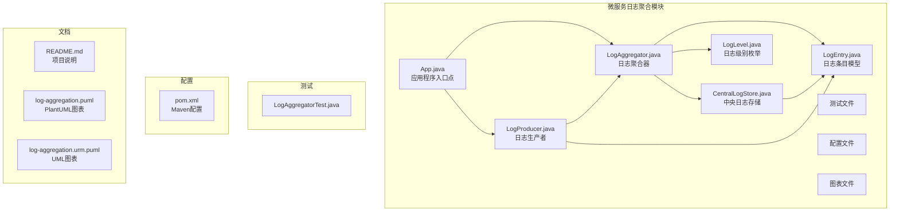
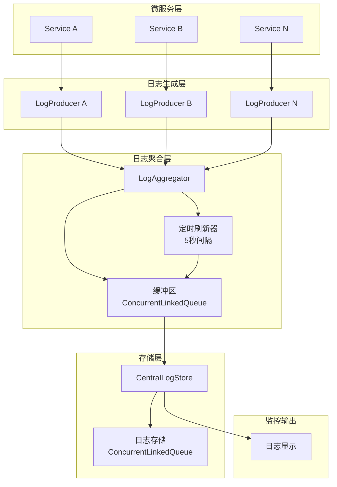
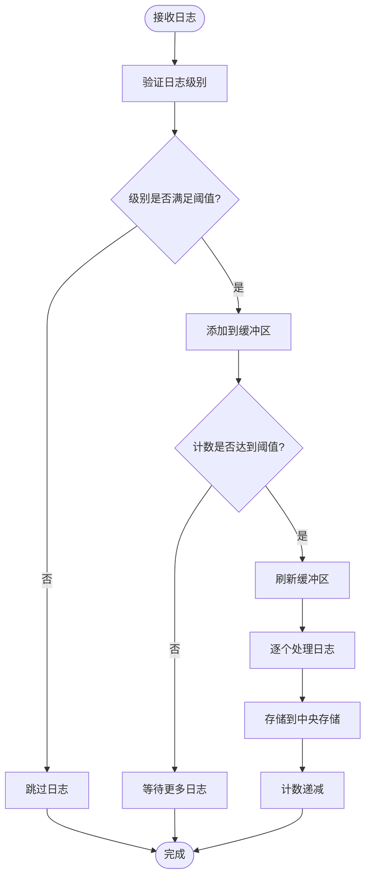
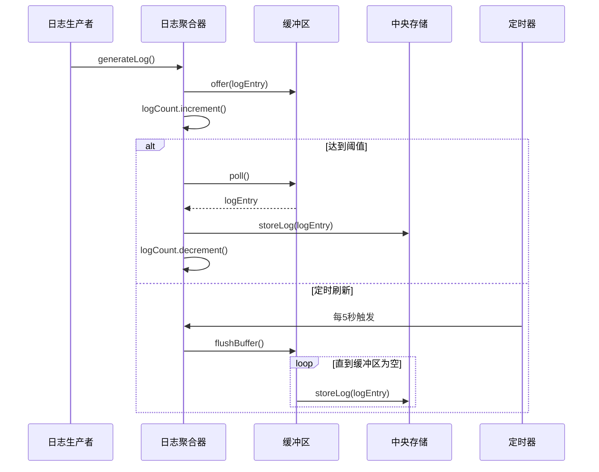
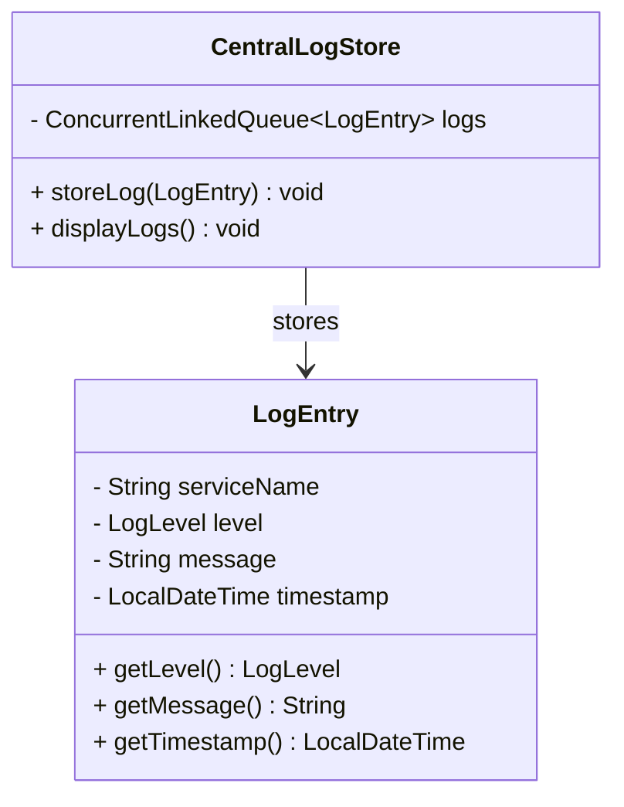
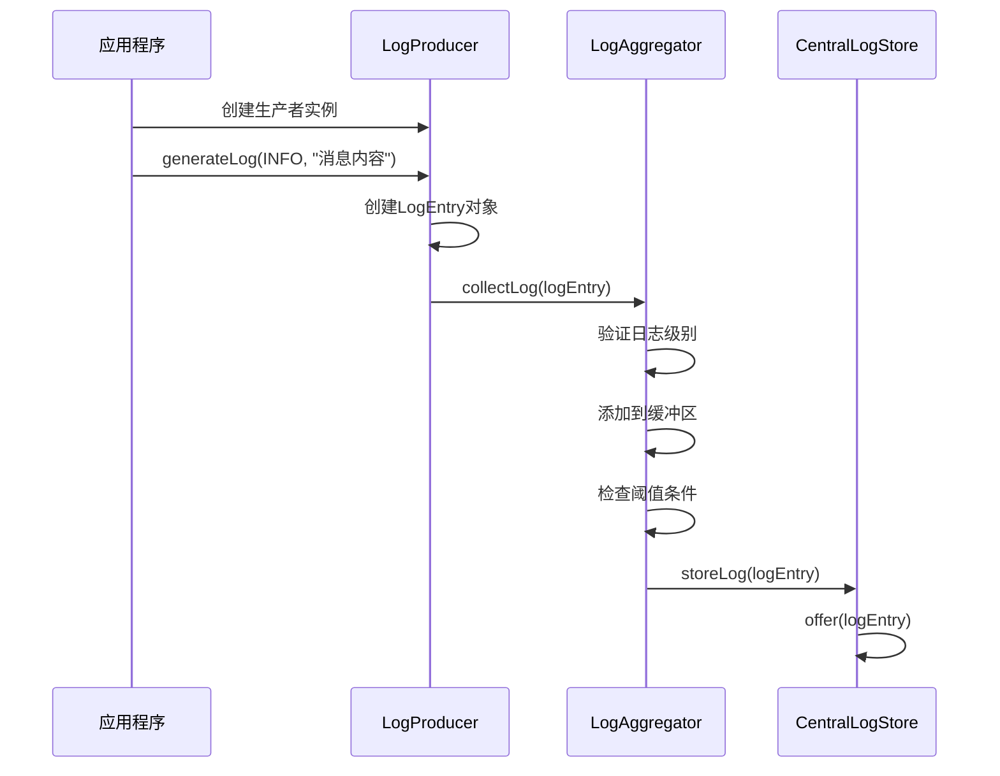
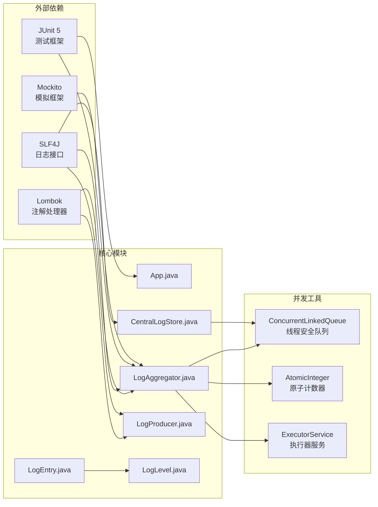
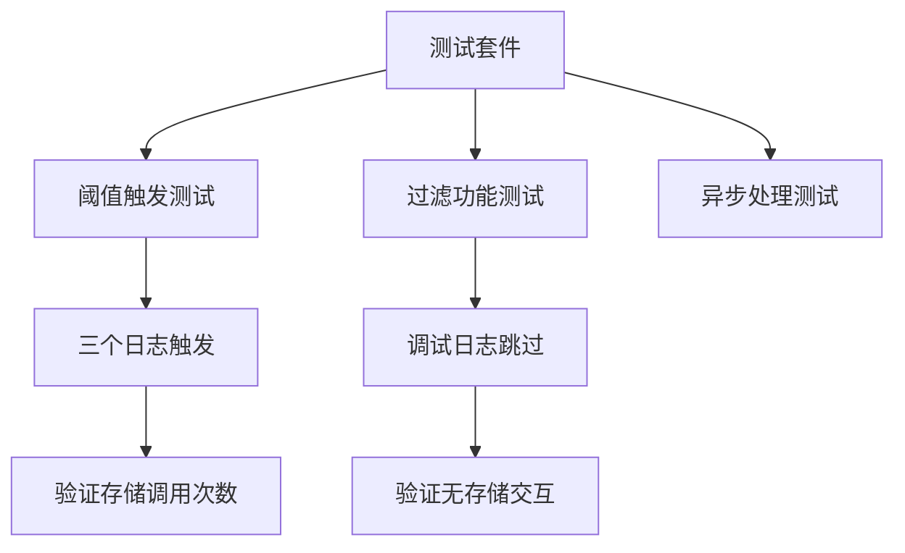

# 日志聚合模式

<cite>
**本文档引用的文件**
- [App.java](file://microservices-log-aggregation/src/main/java/com/iluwatar/logaggregation/App.java)
- [LogAggregator.java](file://microservices-log-aggregation/src/main/java/com/iluwatar/logaggregation/LogAggregator.java)
- [CentralLogStore.java](file://microservices-log-aggregation/src/main/java/com/iluwatar/logaggregation/CentralLogStore.java)
- [LogProducer.java](file://microservices-log-aggregation/src/main/java/com/iluwatar/logaggregation/LogProducer.java)
- [LogEntry.java](file://microservices-log-aggregation/src/main/java/com/iluwatar/logaggregation/LogEntry.java)
- [LogLevel.java](file://microservices-log-aggregation/src/main/java/com/iluwatar/logaggregation/LogLevel.java)
- [LogAggregatorTest.java](file://microservices-log-aggregation/src/test/java/com/iluwatar/logaggregation/LogAggregatorTest.java)
- [README.md](file://microservices-log-aggregation/README.md)
- [pom.xml](file://microservices-log-aggregation/pom.xml)
- [log-aggregation.puml](file://microservices-log-aggregation/etc/log-aggregation.puml)
- [log-aggregation.urm.puml](file://microservices-log-aggregation/etc/log-aggregation.urm.puml)
</cite>

## 目录
1. [简介](#简介)
2. [项目结构](#项目结构)
3. [核心组件](#核心组件)
4. [架构概览](#架构概览)
5. [详细组件分析](#详细组件分析)
6. [依赖关系分析](#依赖关系分析)
7. [性能考虑](#性能考虑)
8. [故障排查指南](#故障排查指南)
9. [结论](#结论)
10. [附录](#附录)

## 简介

日志聚合模式是分布式系统中一个关键的设计模式，它通过集中化收集、存储和分析来自多个来源的日志数据，简化了监控和故障排查过程。在微服务架构中，每个服务都会产生大量的日志信息，这些日志需要被统一管理以便于分析和审计。

本项目展示了如何实现一个完整的日志聚合系统，包括日志生成、缓冲、过滤和存储等核心功能。该系统采用异步处理和批量存储策略，确保在高并发场景下的性能和可靠性。

## 项目结构

该项目遵循标准的Maven项目结构，专注于展示日志聚合模式的核心实现：

**图表来源**
- [App.java](file://microservices-log-aggregation/src/main/java/com/iluwatar/logaggregation/App.java#L31-L53)
- [LogAggregator.java](file://microservices-log-aggregation/src/main/java/com/iluwatar/logaggregation/LogAggregator.java#L42-L61)
- [CentralLogStore.java](file://microservices-log-aggregation/src/main/java/com/iluwatar/logaggregation/CentralLogStore.java#L36-L51)
- [LogProducer.java](file://microservices-log-aggregation/src/main/java/com/iluwatar/logaggregation/LogProducer.java#L38-L53)

**章节来源**
- [pom.xml](file://microservices-log-aggregation/pom.xml#L38-L56)
- [README.md](file://microservices-log-aggregation/README.md#L1-L164)

## 核心组件

日志聚合系统由以下核心组件构成：

### 日志聚合器 (LogAggregator)
负责收集和缓冲来自不同服务的日志，支持阈值触发和定时刷新机制。

### 中央日志存储 (CentralLogStore)
提供线程安全的日志存储功能，支持并发访问和统一管理。

### 日志生产者 (LogProducer)
代表各个微服务生成日志条目，并将其发送到聚合器。

### 日志条目 (LogEntry)
封装单个日志的所有必要信息，包括服务名、级别、消息和时间戳。

### 日志级别 (LogLevel)
定义日志严重程度的枚举类型，用于过滤和优先级排序。

**章节来源**
- [LogAggregator.java](file://microservices-log-aggregation/src/main/java/com/iluwatar/logaggregation/LogAggregator.java#L42-L61)
- [CentralLogStore.java](file://microservices-log-aggregation/src/main/java/com/iluwatar/logaggregation/CentralLogStore.java#L36-L51)
- [LogProducer.java](file://microservices-log-aggregation/src/main/java/com/iluwatar/logaggregation/LogProducer.java#L38-L53)
- [LogEntry.java](file://microservices-log-aggregation/src/main/java/com/iluwatar/logaggregation/LogEntry.java#L35-L42)
- [LogLevel.java](file://microservices-log-aggregation/src/main/java/com/iluwatar/logaggregation/LogLevel.java#L36-L38)

## 架构概览

该日志聚合系统采用分层架构设计，实现了服务解耦和异步处理：

**图表来源**
- [App.java](file://microservices-log-aggregation/src/main/java/com/iluwatar/logaggregation/App.java#L39-L51)
- [LogAggregator.java](file://microservices-log-aggregation/src/main/java/com/iluwatar/logaggregation/LogAggregator.java#L108-L119)
- [CentralLogStore.java](file://microservices-log-aggregation/src/main/java/com/iluwatar/logaggregation/CentralLogStore.java#L56-L62)

## 详细组件分析

### LogAggregator 组件分析

LogAggregator 是整个日志聚合系统的核心组件，实现了以下关键功能：

#### 数据结构设计
- **缓冲区**: 使用 `ConcurrentLinkedQueue<LogEntry>` 实现线程安全的队列操作
- **计数器**: 使用 `AtomicInteger` 进行无锁计数操作
- **阈值控制**: 静态常量 `BUFFER_THRESHOLD = 3` 控制批量处理触发条件

#### 算法实现

**图表来源**
- [LogAggregator.java](file://microservices-log-aggregation/src/main/java/com/iluwatar/logaggregation/LogAggregator.java#L68-L84)
- [LogAggregator.java](file://microservices-log-aggregation/src/main/java/com/iluwatar/logaggregation/LogAggregator.java#L100-L106)

#### 异步处理机制

系统使用单线程执行器服务实现异步处理：

**图表来源**
- [LogAggregator.java](file://microservices-log-aggregation/src/main/java/com/iluwatar/logaggregation/LogAggregator.java#L108-L119)
- [LogAggregator.java](file://microservices-log-aggregation/src/main/java/com/iluwatar/logaggregation/LogAggregator.java#L100-L106)

**章节来源**
- [LogAggregator.java](file://microservices-log-aggregation/src/main/java/com/iluwatar/logaggregation/LogAggregator.java#L42-L121)

### CentralLogStore 组件分析

CentralLogStore 提供了线程安全的日志存储功能：

#### 存储策略
- **数据结构**: 使用 `ConcurrentLinkedQueue<LogEntry>` 实现无锁并发访问
- **线程安全**: 基于队列的原子操作保证多线程环境下的数据一致性
- **内存管理**: 采用内存存储，便于演示和测试，实际生产环境中可替换为持久化存储

#### 关键方法实现

**图表来源**
- [CentralLogStore.java](file://microservices-log-aggregation/src/main/java/com/iluwatar/logaggregation/CentralLogStore.java#L36-L62)
- [LogEntry.java](file://microservices-log-aggregation/src/main/java/com/iluwatar/logaggregation/LogEntry.java#L35-L42)

**章节来源**
- [CentralLogStore.java](file://microservices-log-aggregation/src/main/java/com/iluwatar/logaggregation/CentralLogStore.java#L36-L64)

### LogProducer 组件分析

LogProducer 代表各个微服务生成日志条目：

#### 生成机制
- **服务标识**: 每个生产者关联特定的服务名称
- **日志创建**: 使用当前时间戳创建 LogEntry 对象
- **异步发送**: 通过聚合器的 collectLog 方法异步发送日志

#### 示例用法

**图表来源**
- [LogProducer.java](file://microservices-log-aggregation/src/main/java/com/iluwatar/logaggregation/LogProducer.java#L49-L53)
- [App.java](file://microservices-log-aggregation/src/main/java/com/iluwatar/logaggregation/App.java#L43-L48)

**章节来源**
- [LogProducer.java](file://microservices-log-aggregation/src/main/java/com/iluwatar/logaggregation/LogProducer.java#L38-L54)

### LogEntry 和 LogLevel 组件分析

#### LogEntry 数据模型
- **服务名称**: 标识生成日志的具体服务
- **日志级别**: 使用 LogLevel 枚举定义日志严重程度
- **消息内容**: 实际的日志文本信息
- **时间戳**: 记录日志生成的时间

#### LogLevel 枚举定义
- **DEBUG**: 详细信息，主要用于调试问题诊断
- **INFO**: 确认系统正常运行
- **ERROR**: 指示需要关注的问题

**章节来源**
- [LogEntry.java](file://microservices-log-aggregation/src/main/java/com/iluwatar/logaggregation/LogEntry.java#L35-L42)
- [LogLevel.java](file://microservices-log-aggregation/src/main/java/com/iluwatar/logaggregation/LogLevel.java#L36-L38)

## 依赖关系分析

系统采用松耦合设计，各组件之间的依赖关系清晰明确：

**图表来源**
- [pom.xml](file://microservices-log-aggregation/pom.xml#L40-L51)
- [LogAggregator.java](file://microservices-log-aggregation/src/main/java/com/iluwatar/logaggregation/LogAggregator.java#L27-L32)
- [CentralLogStore.java](file://microservices-log-aggregation/src/main/java/com/iluwatar/logaggregation/CentralLogStore.java#L27-L28)

**章节来源**
- [pom.xml](file://microservices-log-aggregation/pom.xml#L40-L51)

## 性能考虑

### 并发性能优化

1. **无锁数据结构**: 使用 `ConcurrentLinkedQueue` 避免传统锁的性能开销
2. **原子操作**: `AtomicInteger` 提供高效的无锁计数功能
3. **单线程执行器**: 确保缓冲区刷新操作的串行化，避免竞态条件

### 内存管理策略

1. **批量处理**: 阈值触发机制减少存储调用次数
2. **定时刷新**: 5秒间隔的定期刷新平衡实时性和性能
3. **内存限制**: 当前实现为内存存储，适合演示用途

### 可扩展性设计

1. **插件化存储**: CentralLogStore 接口允许替换不同的存储后端
2. **水平扩展**: 多个 LogAggregator 实例可以并行处理不同服务的日志
3. **配置化参数**: 阈值、刷新间隔等参数可通过配置调整

## 故障排查指南

### 常见问题及解决方案

#### 日志丢失问题
- **原因**: 聚合器停止时未正确刷新缓冲区
- **解决方案**: 确保调用 `stop()` 方法进行优雅关闭

#### 性能瓶颈
- **症状**: 高延迟或内存占用过高
- **诊断**: 检查缓冲区大小和阈值设置
- **优化**: 调整 `BUFFER_THRESHOLD` 参数

#### 线程安全问题
- **症状**: 并发访问导致的数据不一致
- **检查**: 确认使用线程安全的数据结构

**章节来源**
- [LogAggregator.java](file://microservices-log-aggregation/src/main/java/com/iluwatar/logaggregation/LogAggregator.java#L92-L98)

### 测试策略

系统包含完整的单元测试，覆盖关键功能：

**图表来源**
- [LogAggregatorTest.java](file://microservices-log-aggregation/src/test/java/com/iluwatar/logaggregation/LogAggregatorTest.java#L50-L67)

**章节来源**
- [LogAggregatorTest.java](file://microservices-log-aggregation/src/test/java/com/iluwatar/logaggregation/LogAggregatorTest.java#L38-L81)

## 结论

日志聚合模式为分布式系统提供了强大的监控和故障排查能力。通过本项目的实现，我们可以看到：

1. **设计原则**: 松耦合、异步处理、批量存储的设计理念
2. **性能优化**: 无锁数据结构和原子操作的应用
3. **可扩展性**: 插件化架构和配置化的参数设置
4. **可靠性**: 线程安全和优雅关闭机制

该模式特别适用于微服务架构，在大规模分布式环境中能够有效提升系统的可观测性和可维护性。

## 附录

### 实际应用场景

1. **微服务监控**: 统一收集各服务的运行状态和错误信息
2. **故障排查**: 快速定位问题根因和影响范围
3. **性能分析**: 分析系统瓶颈和资源使用情况
4. **合规审计**: 提供完整的操作记录和审计轨迹

### 最佳实践建议

1. **日志格式标准化**: 统一日志字段和格式，便于后续分析
2. **异步处理**: 在高并发场景下使用异步处理提升性能
3. **批量存储**: 合理设置批量大小和刷新间隔
4. **监控告警**: 集成监控系统，及时发现异常情况
5. **数据保留**: 制定合理的日志保留策略和清理机制