# 架构模式

<cite>
**本文引用的文件**
- [README.md（微服务聚合器）](file://microservices-aggregrator/README.md)
- [README.md（微服务API网关）](file://microservices-api-gateway/README.md)
- [README.md（微服务日志聚合）](file://microservices-log-aggregation/README.md)
- [README.md（事件聚合器）](file://event-aggregator/README.md)
- [README.md（事件队列）](file://event-queue/README.md)
- [README.md（事件溯源）](file://event-sourcing/README.md)
- [README.md（分层架构）](file://layered-architecture/README.md)
- [README.md（六边形架构）](file://hexagonal-architecture/README.md)
- [README.md（事件驱动架构）](file://event-driven-architecture/README.md)
</cite>

## 目录
1. [引言](#引言)
2. [项目结构](#项目结构)
3. [核心组件](#核心组件)
4. [架构总览](#架构总览)
5. [详细组件分析](#详细组件分析)
6. [依赖关系分析](#依赖关系分析)
7. [性能与可扩展性](#性能与可扩展性)
8. [故障排查指南](#故障排查指南)
9. [结论](#结论)
10. [附录](#附录)

## 引言
本指南聚焦于企业级软件架构模式，围绕分层架构、六边形架构、事件驱动架构展开；同时结合微服务架构中的聚合器、API网关与日志聚合等集成模式，系统讲解设计原则、实现策略、部署考量与演进路径。文档以仓库中已有的示例为依据，辅以图示与流程说明，帮助读者在真实工程中落地这些模式。

## 项目结构
该仓库包含大量设计模式示例与架构模式文档，其中与“企业级架构模式”直接相关的内容主要集中在以下模块：
- 分层架构：强调层次化职责分离与可维护性
- 六边形架构：强调核心业务与外部接口解耦
- 事件驱动架构：强调异步、松耦合与响应式交互
- 微服务聚合器：统一聚合多服务响应
- API网关：统一入口、路由与横切关注点
- 日志聚合：集中化日志收集与分析
- 事件聚合器：集中事件分发与路由
- 事件队列：异步任务缓冲与解耦
- 事件溯源：基于事件的历史不可变记录与重放

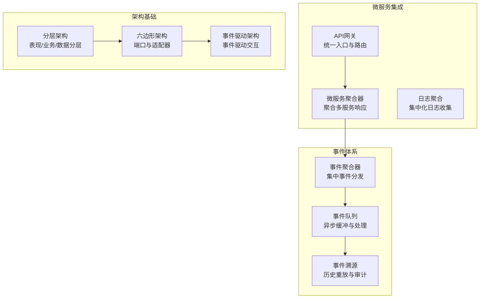

**图表来源**
- [README.md（微服务聚合器）](file://microservices-aggregrator/README.md#L21-L38)
- [README.md（微服务API网关）](file://microservices-api-gateway/README.md#L18-L40)
- [README.md（微服务日志聚合）](file://microservices-log-aggregation/README.md#L23-L43)
- [README.md（事件聚合器）](file://event-aggregator/README.md#L25-L37)
- [README.md（事件队列）](file://event-queue/README.md#L20-L36)
- [README.md（事件溯源）](file://event-sourcing/README.md#L26-L42)
- [README.md（分层架构）](file://layered-architecture/README.md#L33-L35)
- [README.md（六边形架构）](file://hexagonal-architecture/README.md#L16-L28)
- [README.md（事件驱动架构）](file://event-driven-architecture/README.md#L23-L35)

**章节来源**
- [README.md（微服务聚合器）](file://microservices-aggregrator/README.md#L1-L141)
- [README.md（微服务API网关）](file://microservices-api-gateway/README.md#L1-L178)
- [README.md（微服务日志聚合）](file://microservices-log-aggregation/README.md#L1-L164)
- [README.md（事件聚合器）](file://event-aggregator/README.md#L1-L207)
- [README.md（事件队列）](file://event-queue/README.md#L1-L182)
- [README.md（事件溯源）](file://event-sourcing/README.md#L1-L242)
- [README.md（分层架构）](file://layered-architecture/README.md#L1-L125)
- [README.md（六边形架构）](file://hexagonal-architecture/README.md#L1-L40)
- [README.md（事件驱动架构）](file://event-driven-architecture/README.md#L1-L84)

## 核心组件
- 分层架构（Layered Architecture）
  - 层次划分：表现层、业务层、数据层
  - 关注点分离，便于维护与测试
  - 示例涉及实体模型、服务接口与视图渲染
- 六边形架构（Hexagonal Architecture）
  - 核心业务逻辑通过“端口”暴露，“适配器”对接外部系统
  - 提升可测试性与可替换性
- 事件驱动架构（Event-Driven Architecture）
  - 围绕事件生产、检测、消费与反应进行编排
  - 实现高解耦、可扩展与动态响应
- 微服务聚合器（Microservices Aggregator）
  - 聚合多个微服务响应，简化客户端交互
  - 降低网络往返与客户端复杂度
- API网关（API Gateway）
  - 单一入口点，路由请求、聚合结果、实施安全与限流
- 日志聚合（Log Aggregation）
  - 集中收集与分析日志，提升可观测性与合规能力
- 事件聚合器（Event Aggregator）
  - 中心化事件管理，解耦事件源与事件处理器
- 事件队列（Event Queue）
  - 异步缓冲与处理，改善响应性与可扩展性
- 事件溯源（Event Sourcing）
  - 将状态变化记录为事件序列，支持审计与重放

**章节来源**
- [README.md（分层架构）](file://layered-architecture/README.md#L33-L120)
- [README.md（六边形架构）](file://hexagonal-architecture/README.md#L16-L36)
- [README.md（事件驱动架构）](file://event-driven-architecture/README.md#L23-L84)
- [README.md（微服务聚合器）](file://microservices-aggregrator/README.md#L21-L120)
- [README.md（微服务API网关）](file://microservices-api-gateway/README.md#L18-L150)
- [README.md（微服务日志聚合）](file://microservices-log-aggregation/README.md#L23-L130)
- [README.md（事件聚合器）](file://event-aggregator/README.md#L25-L190)
- [README.md（事件队列）](file://event-queue/README.md#L20-L160)
- [README.md（事件溯源）](file://event-sourcing/README.md#L26-L220)

## 架构总览
下图展示了从“入口到事件”的整体流转：API网关作为统一入口，聚合微服务响应；事件驱动贯穿系统，事件聚合器集中分发，事件队列异步处理，事件溯源保障历史可审计与可重放；分层与六边形架构支撑清晰的职责边界与可测试性。

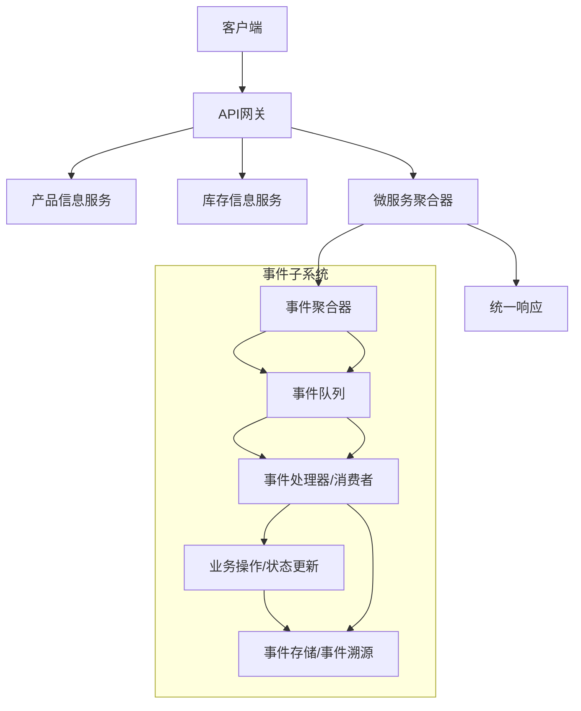

**图表来源**
- [README.md（微服务API网关）](file://microservices-api-gateway/README.md#L41-L127)
- [README.md（微服务聚合器）](file://microservices-aggregrator/README.md#L39-L82)
- [README.md（事件聚合器）](file://event-aggregator/README.md#L39-L153)
- [README.md（事件队列）](file://event-queue/README.md#L38-L136)
- [README.md（事件溯源）](file://event-sourcing/README.md#L44-L176)

## 详细组件分析

### 分层架构（Layered Architecture）
- 设计要点
  - 表现层负责用户交互与渲染
  - 业务层封装领域规则与流程
  - 数据层负责持久化与访问
- 优势与权衡
  - 优点：职责清晰、易于维护、技术栈隔离
  - 权衡：层间调用可能带来性能开销、层边界设计复杂
- 实践建议
  - 明确每层职责边界，避免跨层依赖
  - 使用接口隔离与依赖注入降低耦合

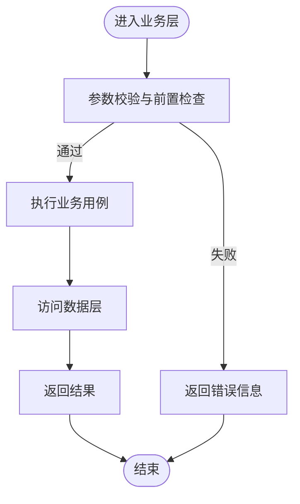

**图表来源**
- [README.md（分层架构）](file://layered-architecture/README.md#L41-L87)

**章节来源**
- [README.md（分层架构）](file://layered-architecture/README.md#L33-L120)

### 六边形架构（Hexagonal Architecture）
- 设计要点
  - 核心业务逻辑通过“端口”对外暴露
  - 外部系统通过“适配器”接入，如UI适配器、数据库适配器
- 优势与权衡
  - 优点：核心稳定、易测试、外部变更不影响核心
  - 权衡：需要良好的端口设计与适配器抽象
- 实践建议
  - 使用依赖注入与接口定义端口
  - 将UI、数据库、第三方服务分别实现为适配器

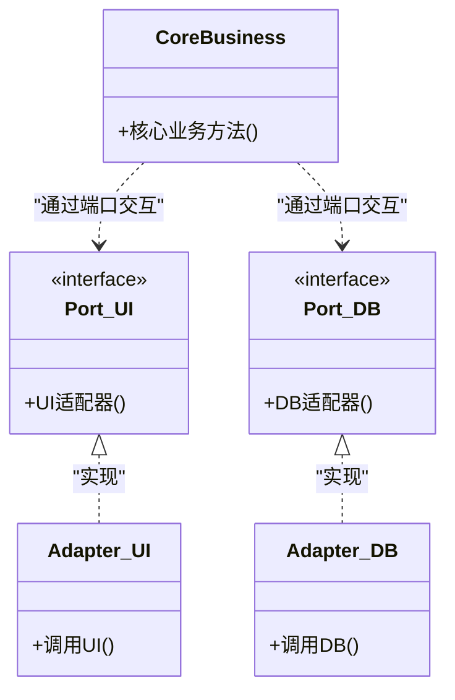

**图表来源**
- [README.md（六边形架构）](file://hexagonal-architecture/README.md#L34-L38)

**章节来源**
- [README.md（六边形架构）](file://hexagonal-architecture/README.md#L16-L36)

### 事件驱动架构（Event-Driven Architecture）
- 设计要点
  - 事件作为系统行为的触发器
  - 事件生产者、调度器与事件处理器解耦协作
- 优势与权衡
  - 优点：高解耦、可扩展、动态响应
  - 权衡：事件一致性与顺序处理更复杂
- 实践建议
  - 明确事件类型与处理器职责
  - 结合事件队列与事件聚合器实现可靠分发

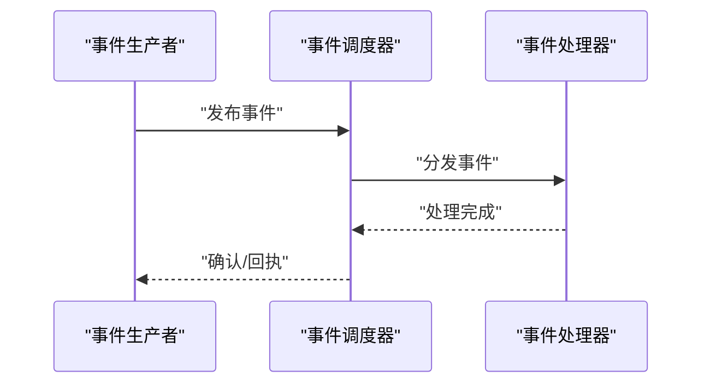

**图表来源**
- [README.md（事件驱动架构）](file://event-driven-architecture/README.md#L41-L84)

**章节来源**
- [README.md（事件驱动架构）](file://event-driven-architecture/README.md#L23-L84)

### 微服务聚合器（Microservices Aggregator）
- 设计要点
  - 客户端仅与聚合器交互，聚合来自多个微服务的数据
  - 支持降级与容错策略
- 优势与权衡
  - 优点：简化客户端、减少网络往返、集中转换逻辑
  - 权衡：聚合器成为单点风险与潜在瓶颈
- 实践建议
  - 与API网关配合，统一入口与路由
  - 引入熔断与超时策略，确保可用性

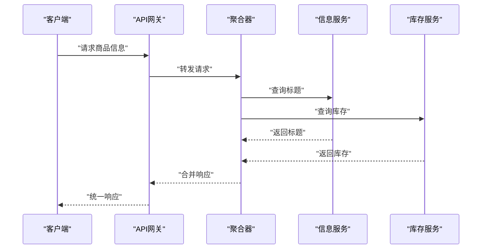

**图表来源**
- [README.md（微服务聚合器）](file://microservices-aggregrator/README.md#L39-L82)
- [README.md（微服务API网关）](file://microservices-api-gateway/README.md#L41-L127)

**章节来源**
- [README.md（微服务聚合器）](file://microservices-aggregrator/README.md#L21-L120)

### API网关（API Gateway）
- 设计要点
  - 统一入口、路由、鉴权、限流、压缩与缓存
  - 可与聚合器协同，按设备/场景差异化聚合
- 优势与权衡
  - 优点：集中治理、简化客户端、增强安全性
  - 权衡：单点风险、扩展与运维复杂度
- 实践建议
  - 高可用部署与弹性伸缩
  - 与熔断器、监控与日志聚合联动

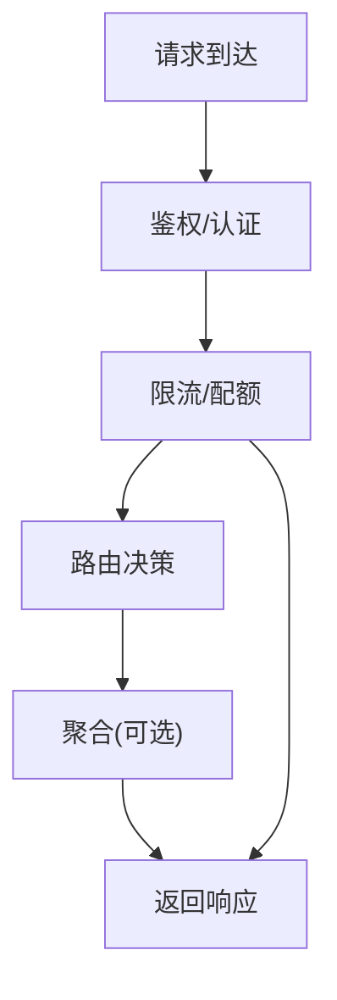

**图表来源**
- [README.md（微服务API网关）](file://microservices-api-gateway/README.md#L18-L150)

**章节来源**
- [README.md（微服务API网关）](file://microservices-api-gateway/README.md#L18-L150)

### 日志聚合（Log Aggregation）
- 设计要点
  - 各服务输出标准化日志，由聚合器收集与过滤
  - 支持分级与检索，便于监控与审计
- 优势与权衡
  - 优点：统一视图、便于排查、满足合规
  - 权衡：存储与处理成本、单点风险
- 实践建议
  - 采用分布式采集与去重
  - 建立最小日志级别与保留策略

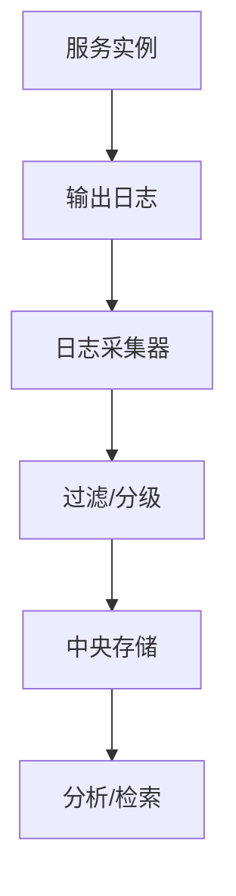

**图表来源**
- [README.md（微服务日志聚合）](file://microservices-log-aggregation/README.md#L41-L124)

**章节来源**
- [README.md（微服务日志聚合）](file://microservices-log-aggregation/README.md#L23-L130)

### 事件聚合器（Event Aggregator）
- 设计要点
  - 中心化事件路由，解耦事件源与订阅者
  - 支持多事件类型与多观察者
- 优势与权衡
  - 优点：集中管理、灵活扩展、降低耦合
  - 权衡：聚合器复杂度与潜在瓶颈
- 实践建议
  - 明确事件注册与通知机制
  - 与事件队列结合实现异步处理

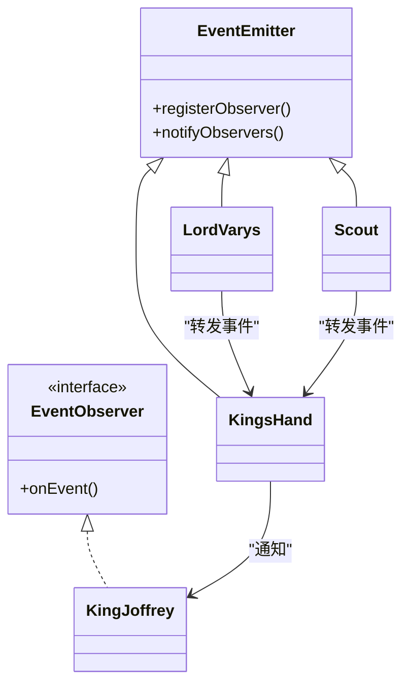

**图表来源**
- [README.md（事件聚合器）](file://event-aggregator/README.md#L47-L153)

**章节来源**
- [README.md（事件聚合器）](file://event-aggregator/README.md#L25-L190)

### 事件队列（Event Queue）
- 设计要点
  - 异步缓冲与处理，解耦发送方与接收方
  - 支持并发与线程生命周期管理
- 优势与权衡
  - 优点：降低耦合、提升响应性、可扩展
  - 权衡：异步调试难度、队列完整性与性能开销
- 实践建议
  - 合理设置容量与优先级
  - 与事件聚合器/事件溯源配合使用

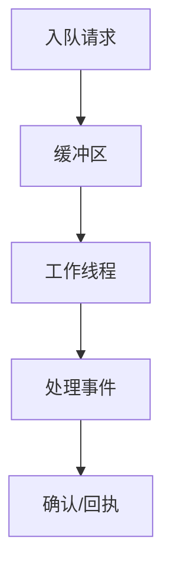

**图表来源**
- [README.md（事件队列）](file://event-queue/README.md#L38-L136)

**章节来源**
- [README.md（事件队列）](file://event-queue/README.md#L20-L160)

### 事件溯源（Event Sourcing）
- 设计要点
  - 状态变化以事件序列形式持久化，支持重放重建状态
- 优势与权衡
  - 优点：完整审计、可重放、高可扩展
  - 权衡：事件存储规模、版本演进与重放复杂度
- 实践建议
  - 与快照结合优化重放性能
  - 明确事件模型与版本兼容策略

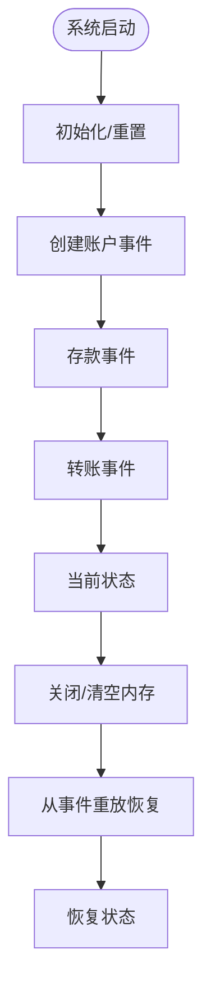

**图表来源**
- [README.md（事件溯源）](file://event-sourcing/README.md#L44-L176)

**章节来源**
- [README.md（事件溯源）](file://event-sourcing/README.md#L26-L220)

## 依赖关系分析
- 模块内聚与耦合
  - 分层与六边形架构强调“内聚高、耦合低”，通过接口与端口隔离外部依赖
  - 事件驱动与事件聚合器/队列/溯源形成“事件域内聚、外部解耦”
  - 微服务聚合器与API网关共同承担“入口与聚合”的职责，需注意高可用与弹性
- 外部依赖与集成点
  - API网关与聚合器依赖各微服务的客户端实现
  - 事件子系统依赖消息中间件或本地队列
  - 日志聚合依赖采集与存储基础设施

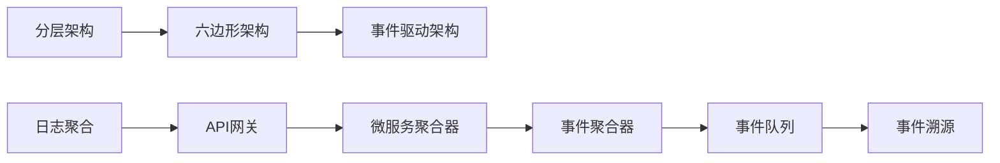

**图表来源**
- [README.md（分层架构）](file://layered-architecture/README.md#L33-L35)
- [README.md（六边形架构）](file://hexagonal-architecture/README.md#L16-L28)
- [README.md（事件驱动架构）](file://event-driven-architecture/README.md#L23-L35)
- [README.md（微服务API网关）](file://microservices-api-gateway/README.md#L18-L40)
- [README.md（微服务聚合器）](file://microservices-aggregrator/README.md#L21-L38)
- [README.md（事件聚合器）](file://event-aggregator/README.md#L25-L37)
- [README.md（事件队列）](file://event-queue/README.md#L20-L36)
- [README.md（事件溯源）](file://event-sourcing/README.md#L26-L42)
- [README.md（微服务日志聚合）](file://microservices-log-aggregation/README.md#L23-L43)

**章节来源**
- [README.md（分层架构）](file://layered-architecture/README.md#L33-L120)
- [README.md（六边形架构）](file://hexagonal-architecture/README.md#L16-L36)
- [README.md（事件驱动架构）](file://event-driven-architecture/README.md#L23-L84)
- [README.md（微服务聚合器）](file://microservices-aggregrator/README.md#L21-L120)
- [README.md（微服务API网关）](file://microservices-api-gateway/README.md#L18-L150)
- [README.md（微服务日志聚合）](file://microservices-log-aggregation/README.md#L23-L130)
- [README.md（事件聚合器）](file://event-aggregator/README.md#L25-L190)
- [README.md（事件队列）](file://event-queue/README.md#L20-L160)
- [README.md（事件溯源）](file://event-sourcing/README.md#L26-L220)

## 性能与可扩展性
- 分层与六边形架构
  - 通过接口隔离与端口抽象，降低层间耦合，提升可测试性与可替换性
  - 建议对热点层进行缓存与异步化改造
- 事件驱动与事件队列
  - 异步缓冲与批处理可显著提升吞吐
  - 合理设置队列容量与并发度，避免尾延迟放大
- 微服务聚合器与API网关
  - 引入熔断与超时，避免级联故障
  - 缓存热点数据与响应，减少下游压力
- 事件溯源
  - 与快照结合，缩短重放时间
  - 对事件存储进行分区与归档，控制体积增长

[本节为通用指导，无需列出具体文件来源]

## 故障排查指南
- 事件聚合器
  - 症状：事件未被分发或重复分发
  - 排查：检查事件注册与通知链路，确认观察者是否正确注册
- 事件队列
  - 症状：积压严重、处理延迟
  - 排查：检查工作线程生命周期、队列容量与处理耗时
- 事件溯源
  - 症状：重放失败或状态不一致
  - 排查：核对事件顺序、事件版本与快照一致性
- API网关与聚合器
  - 症状：超时、熔断频繁
  - 排查：检查下游健康状况、限流阈值与降级策略

**章节来源**
- [README.md（事件聚合器）](file://event-aggregator/README.md#L181-L194)
- [README.md（事件队列）](file://event-queue/README.md#L153-L166)
- [README.md（事件溯源）](file://event-sourcing/README.md#L216-L228)
- [README.md（微服务API网关）](file://microservices-api-gateway/README.md#L143-L156)
- [README.md（微服务聚合器）](file://microservices-aggregrator/README.md#L120-L124)

## 结论
- 选择标准
  - 业务复杂度与解耦需求决定是否采用事件驱动与聚合器
  - 微服务规模与客户端多样性决定是否引入API网关与聚合器
  - 审计与合规要求决定是否采用事件溯源
- 权衡考虑
  - 解耦与复杂度、性能与一致性、扩展性与运维成本
- 迁移策略
  - 从分层/六边形架构起步，逐步引入事件驱动与微服务
  - 先在非关键路径试点，再推广至核心链路
  - 以日志聚合与监控为抓手，持续观测与优化

[本节为总结性内容，无需列出具体文件来源]

## 附录
- 术语
  - 端口与适配器：六边形架构的核心概念
  - 事件驱动：以事件为中心的系统交互范式
  - 聚合器：统一聚合多来源响应
  - API网关：统一入口与路由
  - 日志聚合：集中化日志收集与分析
  - 事件聚合器：中心化事件分发
  - 事件队列：异步缓冲与处理
  - 事件溯源：基于事件的历史不可变记录与重放

[本节为概念性内容，无需列出具体文件来源]