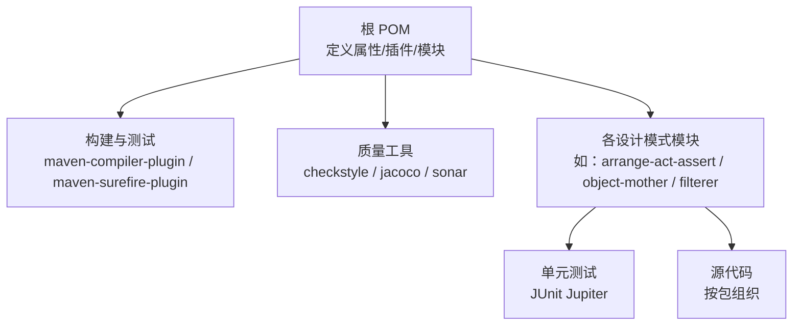
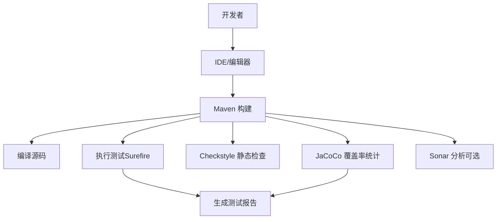
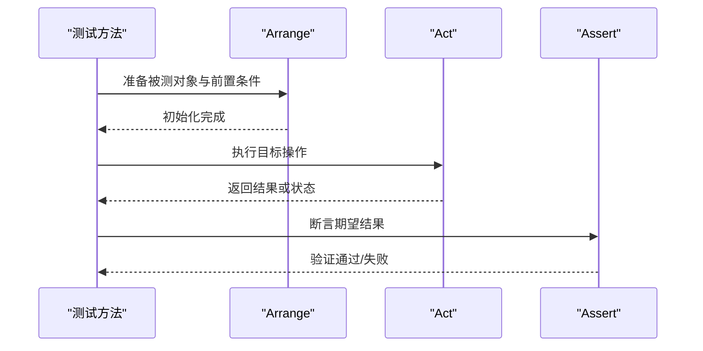
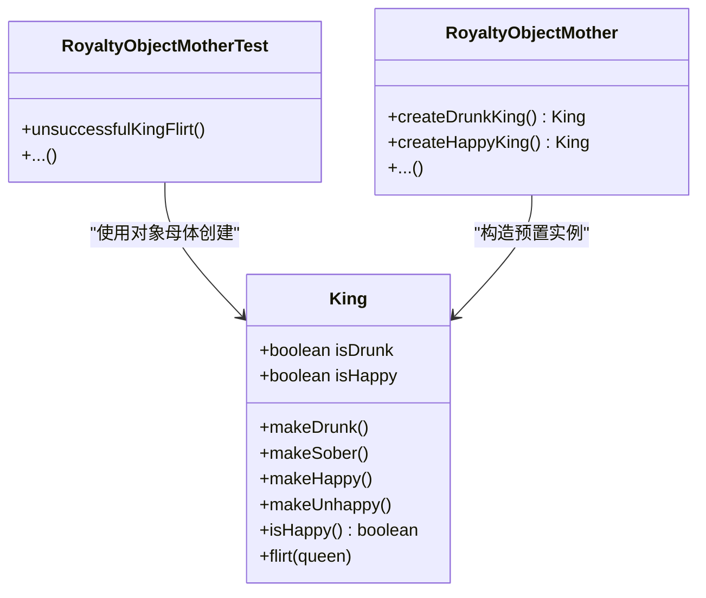
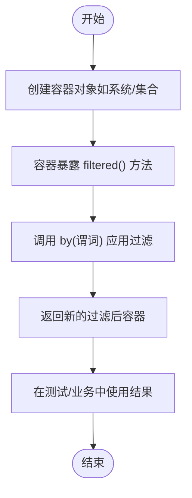
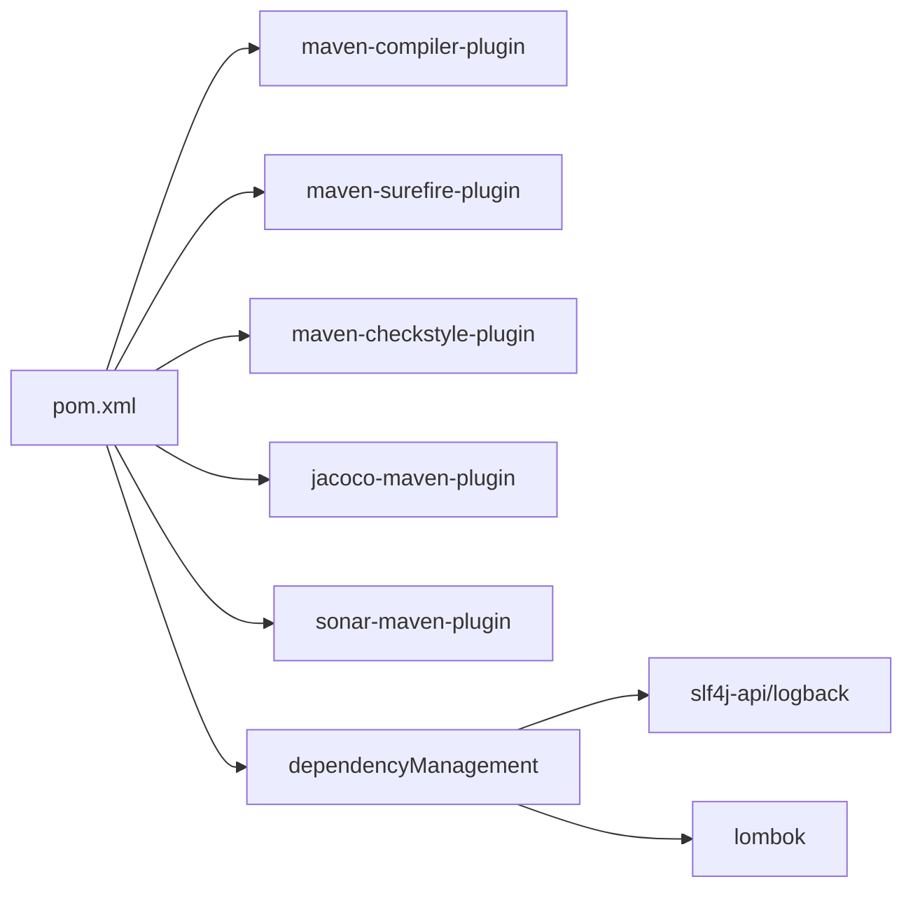

# 测试和开发工具

<cite>
**本文引用的文件**
- [README.md](file://README.md)
- [pom.xml](file://pom.xml)
- [CONTRIBUTING.MD](file://CONTRIBUTING.MD)
- [checkstyle-suppressions.xml](file://checkstyle-suppressions.xml)
- [arrange-act-assert/README.md](file://arrange-act-assert/README.md)
- [arrange-act-assert/src/test/java/com/iluwatar/arrangeactassert/CashAAATest.java](file://arrange-act-assert/src/test/java/com/iluwatar/arrangeactassert/CashAAATest.java)
- [arrange-act-assert/src/test/java/com/iluwatar/arrangeactassert/CashAntiAAATest.java](file://arrange-act-assert/src/test/java/com/iluwatar/arrangeactassert/CashAntiAAATest.java)
- [object-mother/README.md](file://object-mother/README.md)
- [filterer/README.md](file://filterer/README.md)
</cite>

## 目录
1. [简介](#简介)
2. [项目结构](#项目结构)
3. [核心组件](#核心组件)
4. [架构总览](#架构总览)
5. [详细组件分析](#详细组件分析)
6. [依赖关系分析](#依赖关系分析)
7. [性能考量](#性能考量)
8. [故障排查指南](#故障排查指南)
9. [结论](#结论)
10. [附录](#附录)

## 简介
本指南聚焦于测试与开发工具，围绕以下主题展开：  
- Arrange/Act/Assert（AAA）测试模式的最佳实践与实现技巧  
- 对象母体（Object Mother）模式在测试数据构造中的应用  
- 过滤器（Filterer）模式在测试场景中的设计思路与实现方案  
- 项目的测试策略、持续集成配置与自动化测试流程  
- 代码质量保证、静态分析与覆盖率工具的使用  
- 性能测试与基准测试的建议  
- 开发效率提升、代码审查与发布流程优化

## 项目结构
该仓库为“Java 设计模式”示例集合，采用多模块（Maven）组织方式，每个设计模式独立为一个子模块，包含源码与测试用例。  
- 根 POM 定义统一的构建、插件与质量门禁策略  
- 各模块遵循标准的 src/main 与 src/test 结构  
- 质量工具通过 Maven 插件集中管理（Checkstyle、JaCoCo、Sonar）

图表来源
- [pom.xml](file://pom.xml#L37-L59)
- [pom.xml](file://pom.xml#L285-L434)

章节来源
- [pom.xml](file://pom.xml#L37-L59)
- [pom.xml](file://pom.xml#L285-L434)

## 核心组件
- 测试框架与断言：使用 JUnit Jupiter（基于注解的测试与断言）
- 静态检查：Checkstyle（Google 规则），并允许对测试资源与生成代码进行抑制
- 覆盖率：JaCoCo（准备代理与报告）
- 分析平台：Sonar（通过插件接入）
- 模块化：多模块聚合工程，便于独立构建与测试

章节来源
- [pom.xml](file://pom.xml#L285-L434)
- [checkstyle-suppressions.xml](file://checkstyle-suppressions.xml#L1-L12)

## 架构总览
下图展示了测试与质量工具在整体工程中的位置与交互：

图表来源
- [pom.xml](file://pom.xml#L285-L434)

## 详细组件分析

### 组件一：Arrange/Act/Assert（AAA）测试模式
- 目标：以清晰的三段式结构组织单元测试，提升可读性与可维护性  
- 实践要点：
  - 明确划分 Arrange（准备）、Act（执行）、Assert（断言）阶段  
  - 每个测试方法聚焦单一行为，遵循单一职责原则  
  - 使用明确的断言与语义化命名，便于定位失败原因  
- 反例说明：将多个行为合并到一个测试方法中，违反单一职责，增加调试成本  

图表来源
- [arrange-act-assert/src/test/java/com/iluwatar/arrangeactassert/CashAAATest.java](file://arrange-act-assert/src/test/java/com/iluwatar/arrangeactassert/CashAAATest.java#L58-L100)
- [arrange-act-assert/src/test/java/com/iluwatar/arrangeactassert/CashAntiAAATest.java](file://arrange-act-assert/src/test/java/com/iluwatar/arrangeactassert/CashAntiAAATest.java#L44-L60)

章节来源
- [arrange-act-assert/README.md](file://arrange-act-assert/README.md#L17-L36)
- [arrange-act-assert/README.md](file://arrange-act-assert/README.md#L126-L136)
- [arrange-act-assert/src/test/java/com/iluwatar/arrangeactassert/CashAAATest.java](file://arrange-act-assert/src/test/java/com/iluwatar/arrangeactassert/CashAAATest.java#L33-L54)
- [arrange-act-assert/src/test/java/com/iluwatar/arrangeactassert/CashAntiAAATest.java](file://arrange-act-assert/src/test/java/com/iluwatar/arrangeactassert/CashAntiAAATest.java#L33-L39)

### 组件二：对象母体（Object Mother）模式
- 目标：集中化测试对象创建逻辑，减少重复与样板代码，提升一致性与可维护性  
- 实践要点：
  - 将复杂对象的构造封装在专用类或工厂方法中  
  - 提供不同状态的预置对象，便于在多种测试场景复用  
  - 支持在测试过程中对对象进行定制或更新  
- 适用场景：领域对象复杂、字段众多、状态组合较多的测试场景  

图表来源
- [object-mother/README.md](file://object-mother/README.md#L46-L84)
- [object-mother/README.md](file://object-mother/README.md#L88-L105)
- [object-mother/README.md](file://object-mother/README.md#L109-L122)

章节来源
- [object-mother/README.md](file://object-mother/README.md#L19-L32)
- [object-mother/README.md](file://object-mother/README.md#L126-L133)
- [object-mother/README.md](file://object-mother/README.md#L146-L158)

### 组件三：过滤器（Filterer）模式
- 目标：通过可组合的过滤器实现动态、灵活的数据筛选，提升可扩展性与可测试性  
- 实践要点：
  - 将过滤逻辑抽象为函数式接口，支持谓词组合  
  - 容器类暴露 filtered() 方法返回 Filterer，链式调用 by(...) 应用过滤  
  - 支持泛型与子类型扩展，便于新增威胁类型或属性  
- 适用场景：需要对集合进行多维度、可组合筛选的业务场景  

图表来源
- [filterer/README.md](file://filterer/README.md#L58-L65)
- [filterer/README.md](file://filterer/README.md#L90-L104)
- [filterer/README.md](file://filterer/README.md#L149-L163)

章节来源
- [filterer/README.md](file://filterer/README.md#L22-L35)
- [filterer/README.md](file://filterer/README.md#L229-L234)
- [filterer/README.md](file://filterer/README.md#L245-L257)

## 依赖关系分析
- 构建与测试
  - 编译与测试由 maven-compiler-plugin 与 maven-surefire-plugin 管理  
  - 单元测试使用 JUnit Jupiter 注解风格  
- 质量与合规
  - Checkstyle 基于 Google 规则，对测试资源与生成代码进行抑制  
  - JaCoCo 用于覆盖率采集与报告  
  - Sonar 插件用于代码质量分析（可通过 CI 集成）  
- 依赖管理
  - 通过 dependencyManagement 统一版本，确保模块间一致性  
  - 日志与 Lombok 等基础依赖集中声明  

图表来源
- [pom.xml](file://pom.xml#L285-L434)
- [checkstyle-suppressions.xml](file://checkstyle-suppressions.xml#L1-L12)

章节来源
- [pom.xml](file://pom.xml#L226-L284)
- [pom.xml](file://pom.xml#L285-L434)
- [checkstyle-suppressions.xml](file://checkstyle-suppressions.xml#L1-L12)

## 性能考量
- 单元测试性能
  - 避免外部依赖与 IO，优先使用内存数据与模拟对象  
  - 控制测试粒度，避免过长的测试链路  
- 覆盖率与质量
  - 使用 JaCoCo 报告识别低覆盖区域，有针对性地补充测试  
  - 通过 Checkstyle 保持代码风格一致，降低重构成本  
- 性能测试建议
  - 在独立模块中引入 JMH 或自定义基准测试，评估热点路径  
  - 利用容器化与本地缓存减少环境差异带来的波动  

## 故障排查指南
- 测试失败定位
  - 使用 AAA 模式清晰分段，结合断言信息快速定位失败阶段  
  - 若测试方法包含多个断言，建议拆分为更小的独立测试，遵循单一职责  
- 静态检查问题
  - Checkstyle 抑制规则仅对测试资源与生成代码生效，避免误伤生产代码  
  - 如需放宽规则，应在根目录或模块 POM 中显式调整  
- 覆盖率不足
  - 关注 JaCoCo 报告中的分支与行覆盖率，优先补齐关键路径  
  - 对异常分支与边界条件进行专项测试  

章节来源
- [arrange-act-assert/src/test/java/com/iluwatar/arrangeactassert/CashAAATest.java](file://arrange-act-assert/src/test/java/com/iluwatar/arrangeactassert/CashAAATest.java#L33-L54)
- [arrange-act-assert/src/test/java/com/iluwatar/arrangeactassert/CashAntiAAATest.java](file://arrange-act-assert/src/test/java/com/iluwatar/arrangeactassert/CashAntiAAATest.java#L33-L39)
- [checkstyle-suppressions.xml](file://checkstyle-suppressions.xml#L3-L11)

## 结论
- AAA 测试模式是组织单元测试的基石，应贯穿所有模块的测试编写  
- 对象母体模式显著降低测试数据构造成本，提升一致性与可维护性  
- 过滤器模式为动态筛选提供了可扩展的解决方案，适合复杂数据处理场景  
- 通过统一的构建与质量工具链，项目实现了从静态检查到覆盖率与分析的全链路保障  
- 建议在 CI 中集成上述工具，并将覆盖率阈值纳入质量门禁，持续提升代码质量与交付效率  

## 附录
- 贡献指南入口：参见贡献文档中的开发者 Wiki 链接  
- 项目主页与徽章：README 中包含 CI、覆盖率、社区等链接与徽章  

章节来源
- [CONTRIBUTING.MD](file://CONTRIBUTING.MD#L1-L4)
- [README.md](file://README.md#L1-L40)