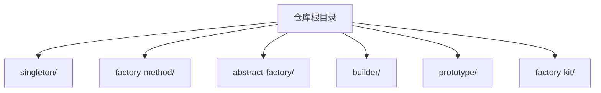
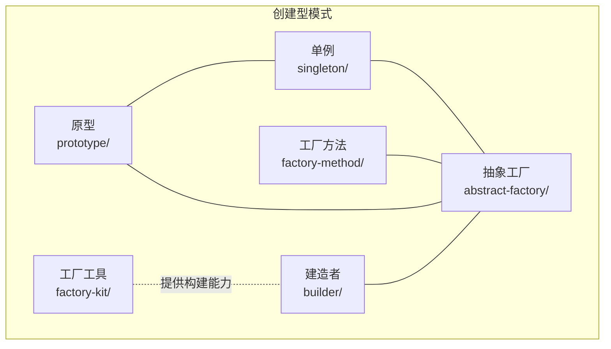
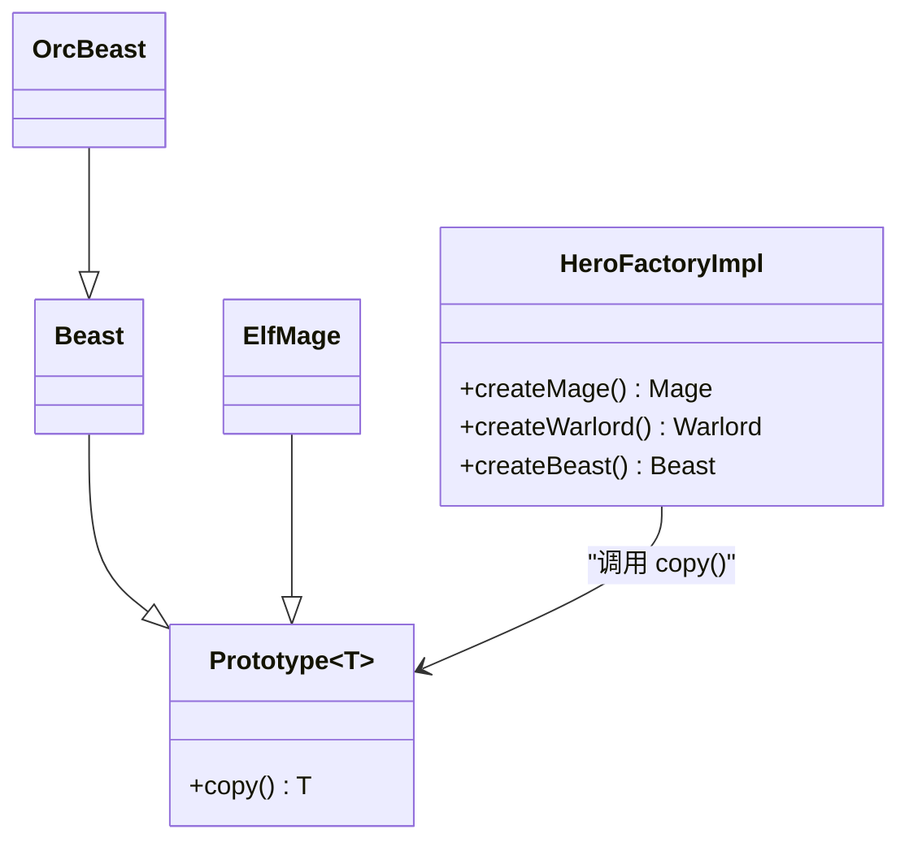
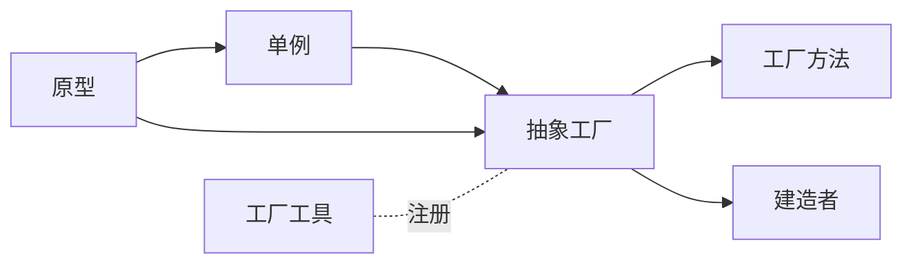

# 创建型模式

<cite>
**本文引用的文件**
- [singleton/README.md](file://singleton/README.md)
- [factory-method/README.md](file://factory-method/README.md)
- [abstract-factory/README.md](file://abstract-factory/README.md)
- [builder/README.md](file://builder/README.md)
- [prototype/README.md](file://prototype/README.md)
- [prototype/src/main/java/com/iluwatar/prototype/Prototype.java](file://prototype/src/main/java/com/iluwatar/prototype/Prototype.java)
- [factory-kit/src/main/java/com/iluwatar/factorykit/Builder.java](file://factory-kit/src/main/java/com/iluwatar/factorykit/Builder.java)
</cite>

## 目录
1. [引言](#引言)
2. [项目结构](#项目结构)
3. [核心组件](#核心组件)
4. [架构总览](#架构总览)
5. [详细组件分析](#详细组件分析)
6. [依赖分析](#依赖分析)
7. [性能考量](#性能考量)
8. [故障排查指南](#故障排查指南)
9. [结论](#结论)
10. [附录](#附录)

## 引言
本文件面向Java开发者，系统梳理五类创建型设计模式：单例、工厂方法、抽象工厂、建造者与原型。内容覆盖每种模式的设计意图、实现要点、线程安全与性能考量、典型应用场景与最佳实践，并对模式间的关系与组合使用进行对比分析，帮助读者在真实项目中做出合理的设计选择。

## 项目结构
本仓库以“按模式分模块”的方式组织，每个模式独立成章，包含：
- README.md：模式说明、意图、类图、何时使用、应用示例、优缺点与参考文献
- 源码：位于各模块的 src/main/java 下，通常包含接口、具体实现、工厂与示例入口

下图给出与本文件主题直接相关的五个模块在仓库中的位置关系：

**章节来源**
- file://singleton/README.md#L1-L110
- file://factory-method/README.md#L1-L133
- file://abstract-factory/README.md#L1-L228
- file://builder/README.md#L1-L205
- file://prototype/README.md#L1-L200

## 核心组件
本节从“模式意图—实现方式—线程安全—性能—适用场景”五个维度，对五种创建型模式进行概览性梳理。

- 单例（Singleton）
  - 设计意图：确保某类仅有一个实例，并提供全局访问点
  - 实现方式：推荐使用“单元素枚举”；也可采用“饿汉/懒汉/登记式/静态内部类/反射防护”等变体
  - 线程安全：枚举天然线程安全；其他方式需通过同步或延迟初始化策略保证
  - 性能：枚举与静态内部类通常开销较低；懒汉式需注意同步成本
  - 典型场景：日志、配置、连接池、运行时环境对象
  - 参考：[singleton/README.md](file://singleton/README.md#L18-L110)

- 工厂方法（Factory Method）
  - 设计意图：定义创建对象的接口，让子类决定实例化哪一个类
  - 实现方式：抽象产品+具体产品；抽象工厂+具体工厂；调用端只依赖抽象
  - 线程安全：与被创建对象无关；关注工厂自身是否可重入
  - 性能：避免了大量 if/switch 分支；扩展新类型只需新增子类
  - 典型场景：框架组件动态装配、UI控件工厂、资源加载器
  - 参考：[factory-method/README.md](file://factory-method/README.md#L19-L133)

- 抽象工厂（Abstract Factory）
  - 设计意图：为一个产品族提供统一的创建接口，使客户端不必指定具体类
  - 实现方式：抽象工厂+多个具体工厂；每个工厂产出一组相关产品
  - 线程安全：工厂对象通常无状态，易线程安全；注意产品对象状态
  - 性能：一次切换带来整族产品的一致性，减少耦合
  - 典型场景：Swing外观、XML解析器族、数据库驱动族
  - 参考：[abstract-factory/README.md](file://abstract-factory/README.md#L19-L228)

- 建造者（Builder）
  - 设计意图：将复杂对象的构建与其表示分离，使同样的构建过程可以创建不同表示
  - 实现方式：Director+Builder+ConcreteBuilder+Product
  - 线程安全：Builder通常非线程安全；Director应避免共享Builder
  - 性能：避免“胖构造器”；步骤化组装提升可读性与可维护性
  - 典型场景：StringBuilder、GUI构建器、复杂对象序列化配置
  - 参考：[builder/README.md](file://builder/README.md#L13-L205)

- 原型（Prototype）
  - 设计意图：通过复制现有实例来创建新对象
  - 实现方式：Cloneable接口或自定义clone方法；浅拷贝/深拷贝策略
  - 线程安全：取决于被克隆对象的状态；共享可变状态需谨慎
  - 性能：当对象创建代价高时，克隆更高效；深拷贝可能昂贵
  - 典型场景：游戏单位批量生成、配置模板复制、图形对象复制
  - 参考：[prototype/README.md](file://prototype/README.md#L18-L200)

**章节来源**
- file://singleton/README.md#L18-L110
- file://factory-method/README.md#L19-L133
- file://abstract-factory/README.md#L19-L228
- file://builder/README.md#L13-L205
- file://prototype/README.md#L18-L200

## 架构总览
下图展示五种模式在仓库中的定位与相互关系（概念示意）：

说明
- 单例常作为抽象工厂的实现载体之一
- 工厂方法是抽象工厂的组成单元
- 建造者可与抽象工厂协作完成复杂对象组装
- 原型可与单例/工厂结合，用于快速复制已有实例
- 工厂工具（如工厂Kit）提供函数式构建器接口，辅助对象注册与获取

## 详细组件分析

### 单例模式（Singleton）
- 设计意图与核心概念
  - 确保类仅有唯一实例，并提供全局访问点
  - 适合协调系统级行为与资源共享
- 实现方式对比
  - 枚举式：线程安全、防止反射破坏、序列化安全
  - 静态内部类：延迟初始化、线程安全、性能佳
  - 双重检查锁定：需谨慎处理 volatile 与指令重排
  - 饿汉式：简单但不延迟初始化
  - 懒汉式：需同步保护
- 线程安全与性能
  - 枚举与静态内部类通常最优
  - 懒汉式若无同步，存在竞态条件
- 实际应用场景
  - 日志记录器、配置中心、连接池、运行时环境对象
- 代码示例路径
  - 枚举式单例与使用示例参见：[singleton/README.md](file://singleton/README.md#L36-L80)
- 常见陷阱与最佳实践
  - 避免滥用导致全局状态与测试困难
  - 注意并发访问与序列化/反序列化场景
  - 可配合抽象工厂或注册表模式管理多实例族

**章节来源**
- file://singleton/README.md#L18-L110

### 工厂方法模式（Factory Method）
- 设计意图与核心概念
  - 将对象创建延迟到子类，客户端只依赖抽象接口
- 实现方式对比
  - 抽象工厂接口 + 多个具体工厂
  - 子类覆写创建逻辑，返回具体产品
- 线程安全与性能
  - 工厂本身通常无状态，易线程安全
  - 避免在工厂内执行耗时操作
- 实际应用场景
  - 动态加载、UI外观切换、资源格式解析
- 代码示例路径
  - 黑 smith 与武器制造示例参见：[factory-method/README.md](file://factory-method/README.md#L39-L91)
- 常见陷阱与最佳实践
  - 不要过度拆分子类，保持扩展点清晰
  - 与抽象工厂组合，形成“工厂的工厂”

**章节来源**
- file://factory-method/README.md#L19-L133

### 抽象工厂模式（Abstract Factory）
- 设计意图与核心概念
  - 为一个产品族提供统一创建接口，保证一致性
- 实现方式对比
  - 抽象工厂定义产品族接口
  - 具体工厂实现并产出一组相关产品
- 线程安全与性能
  - 工厂对象通常无状态，易线程安全
  - 产品对象状态需隔离
- 实际应用场景
  - GUI 外观、XML 解析器族、数据库驱动族
- 代码示例路径
  - 国王/城堡/军队与工厂族示例参见：[abstract-factory/README.md](file://abstract-factory/README.md#L39-L153)
- 常见陷阱与最佳实践
  - 新增产品族需修改抽象层，遵循开闭原则
  - 可与单例结合，确保工厂唯一性

**章节来源**
- file://abstract-factory/README.md#L19-L228

### 建造者模式（Builder）
- 设计意图与核心概念
  - 将复杂对象的构建与表示分离，支持逐步构建与不同表示
- 实现方式对比
  - Director 调度 Builder 步骤
  - Builder 维护内部状态，最终产出 Product
- 线程安全与性能
  - Builder 非线程安全；Director 应避免共享 Builder
  - 减少构造器参数数量，提升可读性
- 实际应用场景
  - 字符串拼接、GUI 组件构建、复杂对象序列化配置
- 代码示例路径
  - 英雄角色构建示例参见：[builder/README.md](file://builder/README.md#L43-L139)
- 常见陷阱与最佳实践
  - 避免 Builder 过度复杂化
  - 与抽象工厂组合，先由工厂产出部件，再由建造者组装

**章节来源**
- file://builder/README.md#L13-L205

### 原型模式（Prototype）
- 设计意图与核心概念
  - 通过克隆现有实例来创建新对象，隐藏创建细节
- 实现方式对比
  - Cloneable 接口或自定义 copy 方法
  - 浅拷贝 vs 深拷贝
- 线程安全与性能
  - 深拷贝成本较高；浅拷贝简单但需注意共享可变状态
- 实际应用场景
  - 游戏单位批量生成、配置模板复制、图形对象复制
- 代码示例路径
  - 原型基类与英雄工厂示例参见：
    - [prototype/README.md](file://prototype/README.md#L38-L153)
    - [prototype/src/main/java/com/iluwatar/prototype/Prototype.java](file://prototype/src/main/java/com/iluwatar/prototype/Prototype.java#L34-L44)

**图表来源**
- [prototype/src/main/java/com/iluwatar/prototype/Prototype.java](file://prototype/src/main/java/com/iluwatar/prototype/Prototype.java#L34-L44)
- [prototype/README.md](file://prototype/README.md#L82-L112)

**章节来源**
- file://prototype/README.md#L18-L200
- file://prototype/src/main/java/com/iluwatar/prototype/Prototype.java#L34-L44

### 工厂工具（Factory Kit）
- 设计意图与核心概念
  - 以函数式接口注册与获取对象，简化工厂配置
- 实现方式对比
  - Builder 接口通过 Supplier 注册对象
- 实际应用场景
  - 动态注册武器类型、组件装配
- 代码示例路径
  - Builder 接口定义参见：[factory-kit/src/main/java/com/iluwatar/factorykit/Builder.java](file://factory-kit/src/main/java/com/iluwatar/factorykit/Builder.java#L29-L34)

**章节来源**
- file://factory-kit/src/main/java/com/iluwatar/factorykit/Builder.java#L29-L34

## 依赖分析
- 模式间关系
  - 单例常作为抽象工厂的实现载体之一
  - 工厂方法是抽象工厂的组成单元
  - 建造者可与抽象工厂协作完成复杂对象组装
  - 原型可与单例/工厂结合，用于快速复制已有实例
- 代码依赖示意

**图表来源**
- file://abstract-factory/README.md#L216-L220
- file://singleton/README.md#L97-L101
- file://prototype/README.md#L188-L192
- file://factory-kit/src/main/java/com/iluwatar/factorykit/Builder.java#L29-L34

## 性能考量
- 单例
  - 枚举与静态内部类通常开销最低；懒汉式需同步成本
- 工厂方法
  - 避免分支判断，利于 JIT 优化；新增子类有少量开销
- 抽象工厂
  - 切换产品族成本低；注意产品对象生命周期管理
- 建造者
  - 步骤化组装提升可读性；避免过度嵌套与重复计算
- 原型
  - 对象创建昂贵时优先考虑；深拷贝成本高，需评估必要性

## 故障排查指南
- 单例
  - 并发下出现多实例：检查懒汉式同步策略与 volatile 使用
  - 反射破坏：采用枚举式或在构造器中拒绝重复初始化
- 工厂方法
  - 扩展新类型后未覆盖创建方法：编译期报错或运行期异常
- 抽象工厂
  - 产品族不一致：核验工厂与产品映射关系
- 建造者
  - 未设置必填参数导致运行时异常：在 build() 中校验
- 原型
  - 深浅拷贝混淆：明确字段语义，必要时实现深拷贝

## 结论
- 在需要严格控制实例数量时选单例；追求解耦与扩展性时选工厂方法/抽象工厂；对象构造复杂且步骤明确时选建造者；对象创建代价高或需要快速复制时选原型。
- 模式并非孤立存在，合理组合可显著提升系统的灵活性与可维护性。建议在架构初期明确边界，避免过度设计。

## 附录
- 模式选择速查
  - 控制全局唯一：单例
  - 延迟创建与多态：工厂方法
  - 产品族一致性：抽象工厂
  - 复杂对象分步构建：建造者
  - 快速复制已有实例：原型
- 参考资料
  - [singleton/README.md](file://singleton/README.md#L103-L110)
  - [factory-method/README.md](file://factory-method/README.md#L128-L133)
  - [abstract-factory/README.md](file://abstract-factory/README.md#L222-L228)
  - [builder/README.md](file://builder/README.md#L199-L205)
  - [prototype/README.md](file://prototype/README.md#L194-L200)