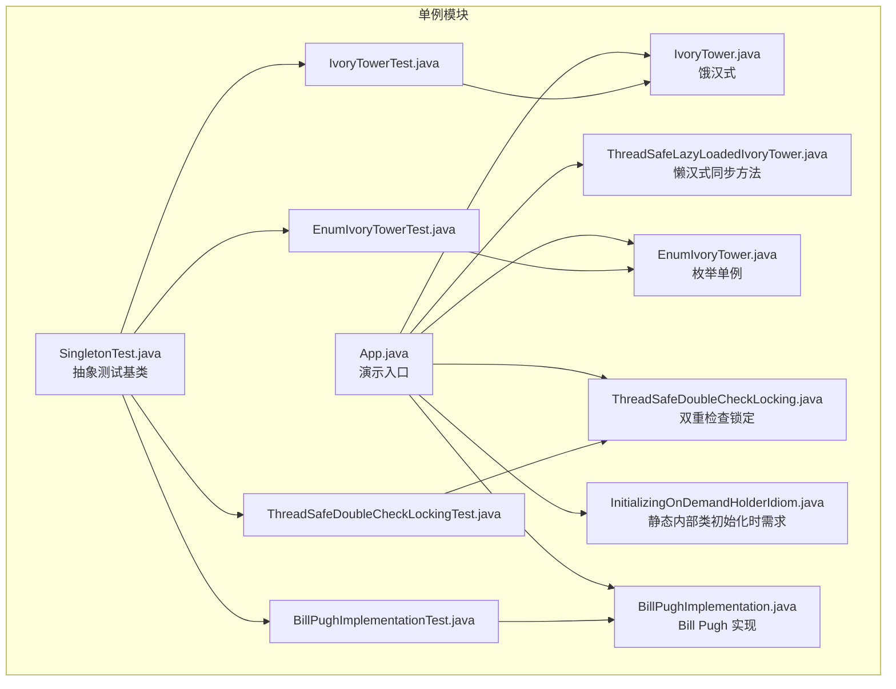
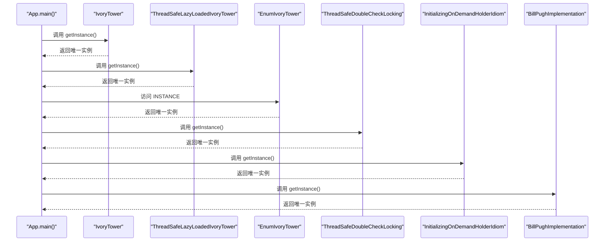
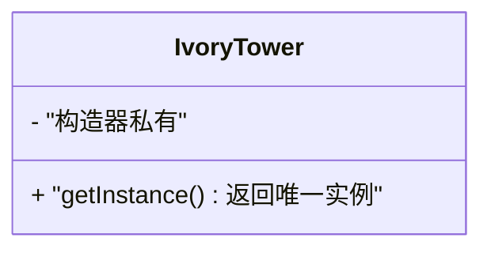
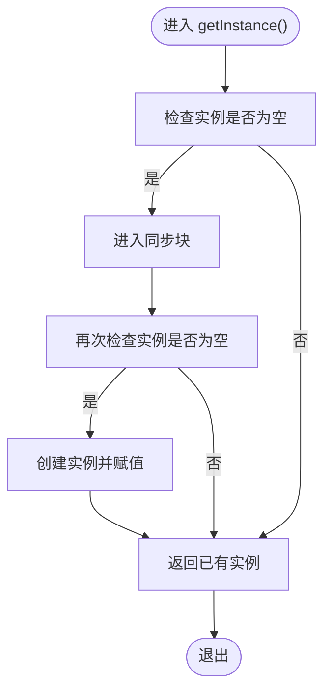
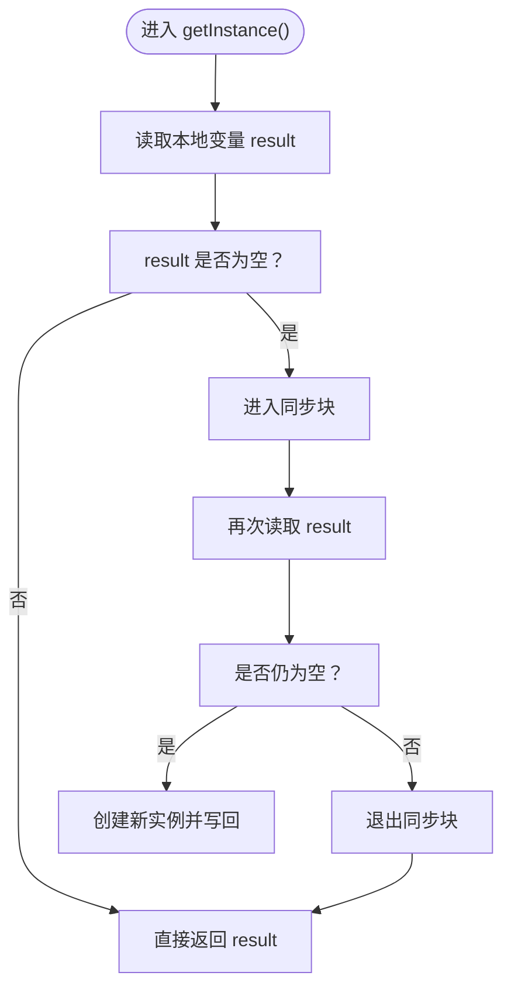
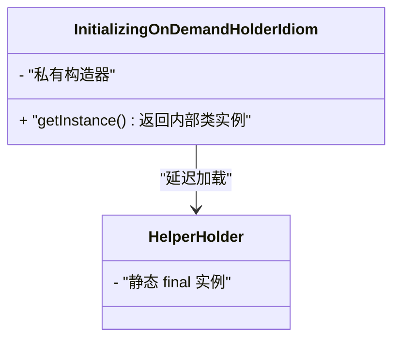
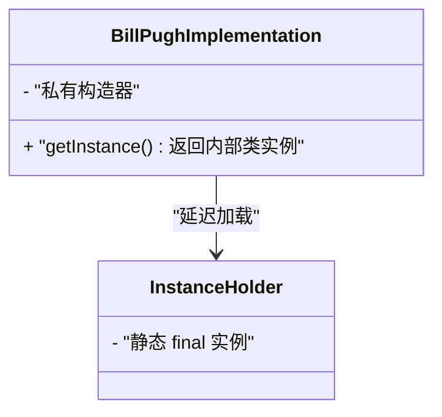
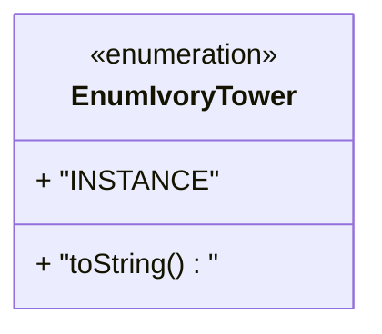
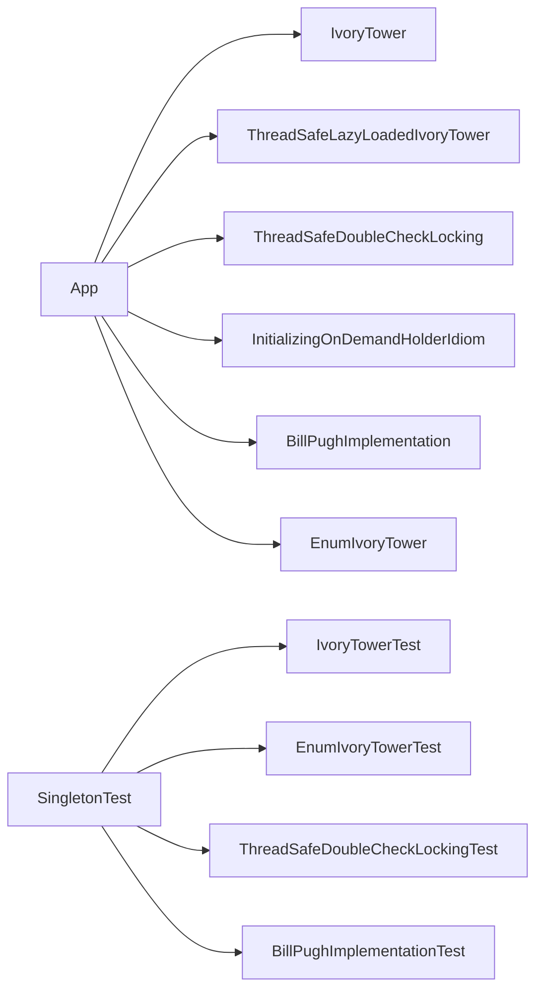

# 单例模式

<cite>
**本文引用的文件**
- [App.java](file://singleton/src/main/java/com/iluwatar/singleton/App.java)
- [IvoryTower.java](file://singleton/src/main/java/com/iluwatar/singleton/IvoryTower.java)
- [ThreadSafeLazyLoadedIvoryTower.java](file://singleton/src/main/java/com/iluwatar/singleton/ThreadSafeLazyLoadedIvoryTower.java)
- [ThreadSafeDoubleCheckLocking.java](file://singleton/src/main/java/com/iluwatar/singleton/ThreadSafeDoubleCheckLocking.java)
- [InitializingOnDemandHolderIdiom.java](file://singleton/src/main/java/com/iluwatar/singleton/InitializingOnDemandHolderIdiom.java)
- [BillPughImplementation.java](file://singleton/src/main/java/com/iluwatar/singleton/BillPughImplementation.java)
- [EnumIvoryTower.java](file://singleton/src/main/java/com/iluwatar/singleton/EnumIvoryTower.java)
- [SingletonTest.java](file://singleton/src/test/java/com/iluwatar/singleton/SingletonTest.java)
- [IvoryTowerTest.java](file://singleton/src/test/java/com/iluwatar/singleton/IvoryTowerTest.java)
- [EnumIvoryTowerTest.java](file://singleton/src/test/java/com/iluwatar/singleton/EnumIvoryTowerTest.java)
- [BillPughImplementationTest.java](file://singleton/src/test/java/com/iluwatar/singleton/BillPughImplementationTest.java)
- [ThreadSafeDoubleCheckLockingTest.java](file://singleton/src/test/java/com/iluwatar/singleton/ThreadSafeDoubleCheckLockingTest.java)
- [README.md](file://singleton/README.md)
</cite>

## 目录
1. [引言](#引言)
2. [项目结构](#项目结构)
3. [核心组件](#核心组件)
4. [架构总览](#架构总览)
5. [详细组件分析](#详细组件分析)
6. [依赖关系分析](#依赖关系分析)
7. [性能考量](#性能考量)
8. [故障排查指南](#故障排查指南)
9. [结论](#结论)
10. [附录](#附录)

## 引言
本技术文档围绕 Java 单例模式展开，系统阐述其设计意图、核心概念与实现原理，并对五种主流实现方式进行对比：饿汉式、懒汉式（同步方法）、双重检查锁定（DCL）、静态内部类（初始化时需求）与枚举。文档结合仓库中的具体实现与测试用例，给出线程安全性、性能表现、常见陷阱与最佳实践，覆盖日志管理、配置管理、连接池等典型应用场景，并提供测试注意事项与可复用的验证策略。

## 项目结构
该模块位于 singleton 子目录，包含一个演示应用与多种单例实现，以及对应的 JUnit 测试套件，用于验证单例在同线程与多线程场景下的正确性与一致性。

图表来源
- [App.java](file://singleton/src/main/java/com/iluwatar/singleton/App.java#L65-L110)
- [IvoryTower.java](file://singleton/src/main/java/com/iluwatar/singleton/IvoryTower.java#L30-L51)
- [ThreadSafeLazyLoadedIvoryTower.java](file://singleton/src/main/java/com/iluwatar/singleton/ThreadSafeLazyLoadedIvoryTower.java#L32-L60)
- [ThreadSafeDoubleCheckLocking.java](file://singleton/src/main/java/com/iluwatar/singleton/ThreadSafeDoubleCheckLocking.java#L35-L84)
- [InitializingOnDemandHolderIdiom.java](file://singleton/src/main/java/com/iluwatar/singleton/InitializingOnDemandHolderIdiom.java#L40-L68)
- [BillPughImplementation.java](file://singleton/src/main/java/com/iluwatar/singleton/BillPughImplementation.java#L37-L72)
- [EnumIvoryTower.java](file://singleton/src/main/java/com/iluwatar/singleton/EnumIvoryTower.java#L33-L44)
- [SingletonTest.java](file://singleton/src/test/java/com/iluwatar/singleton/SingletonTest.java#L49-L107)
- [IvoryTowerTest.java](file://singleton/src/test/java/com/iluwatar/singleton/IvoryTowerTest.java#L31-L39)
- [EnumIvoryTowerTest.java](file://singleton/src/test/java/com/iluwatar/singleton/EnumIvoryTowerTest.java#L31-L40)
- [ThreadSafeDoubleCheckLockingTest.java](file://singleton/src/test/java/com/iluwatar/singleton/ThreadSafeDoubleCheckLockingTest.java#L36-L56)
- [BillPughImplementationTest.java](file://singleton/src/test/java/com/iluwatar/singleton/BillPughImplementationTest.java#L31-L39)

章节来源
- [App.java](file://singleton/src/main/java/com/iluwatar/singleton/App.java#L29-L63)
- [README.md](file://singleton/README.md#L14-L110)

## 核心组件
- 饿汉式（IvoryTower）
  - 特点：类加载即实例化，天然线程安全；无延迟初始化开销。
  - 适用：实例创建成本低、生命周期长且全局常驻。
- 懒汉式（同步方法，ThreadSafeLazyLoadedIvoryTower）
  - 特点：调用时才创建，线程安全但整体方法同步导致性能较低。
- 双重检查锁定（DCL，ThreadSafeDoubleCheckLocking）
  - 特点：局部加锁提升性能；需 volatile 保证可见性与禁止指令重排。
- 初始化时需求（静态内部类，InitializingOnDemandHolderIdiom）
  - 特点：延迟加载、无需显式同步；利用类初始化的线程安全语义。
- Bill Pugh 实现（BillPughImplementation）
  - 特点：通过私有静态内部类持有实例，延迟加载且线程安全。
- 枚举单例（EnumIvoryTower）
  - 特点：实现简洁、天然线程安全、防止反射破坏与序列化问题；扩展性受限。

章节来源
- [IvoryTower.java](file://singleton/src/main/java/com/iluwatar/singleton/IvoryTower.java#L27-L51)
- [ThreadSafeLazyLoadedIvoryTower.java](file://singleton/src/main/java/com/iluwatar/singleton/ThreadSafeLazyLoadedIvoryTower.java#L27-L60)
- [ThreadSafeDoubleCheckLocking.java](file://singleton/src/main/java/com/iluwatar/singleton/ThreadSafeDoubleCheckLocking.java#L27-L84)
- [InitializingOnDemandHolderIdiom.java](file://singleton/src/main/java/com/iluwatar/singleton/InitializingOnDemandHolderIdiom.java#L27-L68)
- [BillPughImplementation.java](file://singleton/src/main/java/com/iluwatar/singleton/BillPughImplementation.java#L27-L72)
- [EnumIvoryTower.java](file://singleton/src/main/java/com/iluwatar/singleton/EnumIvoryTower.java#L27-L44)

## 架构总览
下图展示 App 的主流程如何依次调用五种单例实现，以演示不同实现的一致性与行为特征。

图表来源
- [App.java](file://singleton/src/main/java/com/iluwatar/singleton/App.java#L72-L109)
- [IvoryTower.java](file://singleton/src/main/java/com/iluwatar/singleton/IvoryTower.java#L48-L50)
- [ThreadSafeLazyLoadedIvoryTower.java](file://singleton/src/main/java/com/iluwatar/singleton/ThreadSafeLazyLoadedIvoryTower.java#L54-L59)
- [EnumIvoryTower.java](file://singleton/src/main/java/com/iluwatar/singleton/EnumIvoryTower.java#L38-L43)
- [ThreadSafeDoubleCheckLocking.java](file://singleton/src/main/java/com/iluwatar/singleton/ThreadSafeDoubleCheckLocking.java#L56-L83)
- [InitializingOnDemandHolderIdiom.java](file://singleton/src/main/java/com/iluwatar/singleton/InitializingOnDemandHolderIdiom.java#L53-L54)
- [BillPughImplementation.java](file://singleton/src/main/java/com/iluwatar/singleton/BillPughImplementation.java#L69-L71)

## 详细组件分析

### 饿汉式（IvoryTower）
- 设计要点
  - 类加载时创建静态实例，避免运行期竞争条件。
  - 构造器私有，防止外部实例化。
- 线程安全
  - 由 JVM 类加载机制保证，天然线程安全。
- 性能
  - 无延迟初始化开销；首次访问无需同步。
- 适用场景
  - 实例创建成本低、需要尽早占用资源或常驻内存。
- 常见陷阱
  - 若实例包含昂贵资源，可能造成启动时间增加。

图表来源
- [IvoryTower.java](file://singleton/src/main/java/com/iluwatar/singleton/IvoryTower.java#L30-L51)

章节来源
- [IvoryTower.java](file://singleton/src/main/java/com/iluwatar/singleton/IvoryTower.java#L27-L51)
- [IvoryTowerTest.java](file://singleton/src/test/java/com/iluwatar/singleton/IvoryTowerTest.java#L31-L39)

### 懒汉式（同步方法，ThreadSafeLazyLoadedIvoryTower）
- 设计要点
  - getInstance 整体同步，确保只创建一次。
  - 使用 volatile 修饰实例字段，保证可见性与禁止指令重排。
- 线程安全
  - 同步块内二次检查，避免重复创建。
- 性能
  - 首次调用存在同步开销；后续调用仍需同步，性能较差。
- 常见陷阱
  - 不要仅靠 volatile，必须配合同步控制并发创建。
  - 防御反射：在构造器中检测已存在实例并抛出异常。

图表来源
- [ThreadSafeLazyLoadedIvoryTower.java](file://singleton/src/main/java/com/iluwatar/singleton/ThreadSafeLazyLoadedIvoryTower.java#L54-L59)

章节来源
- [ThreadSafeLazyLoadedIvoryTower.java](file://singleton/src/main/java/com/iluwatar/singleton/ThreadSafeLazyLoadedIvoryTower.java#L27-L60)
- [ThreadSafeDoubleCheckLockingTest.java](file://singleton/src/test/java/com/iluwatar/singleton/ThreadSafeDoubleCheckLockingTest.java#L48-L54)

### 双重检查锁定（DCL，ThreadSafeDoubleCheckLocking）
- 设计要点
  - 局部加锁减少同步范围；使用 volatile 保障可见性。
  - 本地变量 result 提升性能。
- 线程安全
  - 利用 volatile 与两次 null 检查，避免竞态条件。
- 性能
  - 非首次调用无需进入同步块，显著优于同步方法版本。
- 常见陷阱
  - 在旧版 JVM 中存在指令重排风险，现代 JVM 已修复。
  - 需要防御反射：在构造器中检测并阻止重复实例化。

图表来源
- [ThreadSafeDoubleCheckLocking.java](file://singleton/src/main/java/com/iluwatar/singleton/ThreadSafeDoubleCheckLocking.java#L56-L83)

章节来源
- [ThreadSafeDoubleCheckLocking.java](file://singleton/src/main/java/com/iluwatar/singleton/ThreadSafeDoubleCheckLocking.java#L27-L84)
- [ThreadSafeDoubleCheckLockingTest.java](file://singleton/src/test/java/com/iluwatar/singleton/ThreadSafeDoubleCheckLockingTest.java#L36-L56)

### 初始化时需求（静态内部类，InitializingOnDemandHolderIdiom）
- 设计要点
  - 外层类仅提供 getInstance 访问点，内部静态类持有实例。
  - JVM 类初始化语义保证线程安全与延迟加载。
- 线程安全
  - 无需显式 volatile 或 synchronized，天然线程安全。
- 性能
  - 延迟到调用 getInstance 才加载内部类，避免早期开销。
- 适用性
  - 对延迟加载与线程安全都有要求的场景。

图表来源
- [InitializingOnDemandHolderIdiom.java](file://singleton/src/main/java/com/iluwatar/singleton/InitializingOnDemandHolderIdiom.java#L40-L68)

章节来源
- [InitializingOnDemandHolderIdiom.java](file://singleton/src/main/java/com/iluwatar/singleton/InitializingOnDemandHolderIdiom.java#L27-L68)

### Bill Pugh 实现（BillPughImplementation）
- 设计要点
  - 私有静态内部类持有实例，通过外层类的静态工厂方法访问。
  - 延迟加载且线程安全，无需 volatile 或同步。
- 线程安全
  - 基于类初始化的原子性与可见性保证。
- 性能
  - 与静态内部类类似，延迟加载且无额外同步成本。
- 适用性
  - 推荐用于延迟加载且追求简洁与安全的场景。

图表来源
- [BillPughImplementation.java](file://singleton/src/main/java/com/iluwatar/singleton/BillPughImplementation.java#L37-L72)

章节来源
- [BillPughImplementation.java](file://singleton/src/main/java/com/iluwatar/singleton/BillPughImplementation.java#L27-L72)
- [BillPughImplementationTest.java](file://singleton/src/test/java/com/iluwatar/singleton/BillPughImplementationTest.java#L31-L39)

### 枚举单例（EnumIvoryTower）
- 设计要点
  - 使用枚举定义唯一实例，实现简洁。
  - 天然防止反射与序列化破坏，线程安全。
- 线程安全
  - 枚举实例创建由 JVM 保证线程安全。
- 性能
  - 无延迟加载，启动即存在；访问开销极小。
- 适用性
  - 最佳实践推荐；若需扩展方法或状态，需谨慎评估。

图表来源
- [EnumIvoryTower.java](file://singleton/src/main/java/com/iluwatar/singleton/EnumIvoryTower.java#L33-L44)

章节来源
- [EnumIvoryTower.java](file://singleton/src/main/java/com/iluwatar/singleton/EnumIvoryTower.java#L27-L44)
- [EnumIvoryTowerTest.java](file://singleton/src/test/java/com/iluwatar/singleton/EnumIvoryTowerTest.java#L31-L40)

## 依赖关系分析
- 组件内聚与耦合
  - 各实现均通过私有构造器与静态工厂方法控制实例化，内聚度高。
  - App 作为演示入口，仅依赖各实现的公共访问接口，耦合度低。
- 测试基类
  - SingletonTest 抽象类统一了“同线程多次调用返回同一对象”和“多线程并发访问返回同一对象”的断言逻辑，便于扩展新的实现。
- 外部依赖
  - 日志使用 SLF4J（App 中使用 Lombok 注解），测试使用 JUnit 5。

图表来源
- [App.java](file://singleton/src/main/java/com/iluwatar/singleton/App.java#L72-L109)
- [SingletonTest.java](file://singleton/src/test/java/com/iluwatar/singleton/SingletonTest.java#L49-L107)
- [IvoryTowerTest.java](file://singleton/src/test/java/com/iluwatar/singleton/IvoryTowerTest.java#L31-L39)
- [EnumIvoryTowerTest.java](file://singleton/src/test/java/com/iluwatar/singleton/EnumIvoryTowerTest.java#L31-L40)
- [ThreadSafeDoubleCheckLockingTest.java](file://singleton/src/test/java/com/iluwatar/singleton/ThreadSafeDoubleCheckLockingTest.java#L36-L56)
- [BillPughImplementationTest.java](file://singleton/src/test/java/com/iluwatar/singleton/BillPughImplementationTest.java#L31-L39)

章节来源
- [SingletonTest.java](file://singleton/src/test/java/com/iluwatar/singleton/SingletonTest.java#L49-L107)

## 性能考量
- 创建时机
  - 饿汉式：启动即创建，无延迟；适合实例轻量、需要常驻。
  - 懒汉式（同步方法）：首次调用创建，同步开销大；不建议高频访问。
  - DCL：非首次调用无同步，性能优于同步方法；注意 volatile 语义。
  - 静态内部类/初始化时需求：延迟到首次调用，避免早期开销。
  - Bill Pugh：延迟加载，线程安全，无额外同步成本。
  - 枚举：启动即存在，访问极快。
- 并发访问
  - 静态内部类与枚举天然线程安全，无需额外同步。
  - 懒汉式（同步方法）与 DCL 需要同步或 volatile 保证可见性。
- 序列化与反射
  - 枚举天然防反射与序列化破坏。
  - 其他实现可通过构造器防御反射（如抛出非法状态异常）。

## 故障排查指南
- 多线程并发创建失败
  - 确认是否使用了 volatile 与双重检查；或采用静态内部类/枚举方案。
- 反射破坏单例
  - 在构造器中检测已存在实例并抛出异常，参考懒汉式实现。
- 测试验证
  - 使用 SingletonTest 的两个断言用例：同线程多次调用返回同一对象；多线程并发调用返回同一对象。
  - DCL 测试还覆盖了反射破坏的断言场景。

章节来源
- [ThreadSafeLazyLoadedIvoryTower.java](file://singleton/src/main/java/com/iluwatar/singleton/ThreadSafeLazyLoadedIvoryTower.java#L42-L47)
- [ThreadSafeDoubleCheckLockingTest.java](file://singleton/src/test/java/com/iluwatar/singleton/ThreadSafeDoubleCheckLockingTest.java#L48-L54)
- [SingletonTest.java](file://singleton/src/test/java/com/iluwatar/singleton/SingletonTest.java#L68-L107)

## 结论
- 最佳实践优先选择枚举单例，实现简洁、线程安全且抗破坏性强。
- 若需要延迟加载，推荐静态内部类或 Bill Pugh 实现，二者同样线程安全且性能优异。
- 懒汉式（同步方法）仅在简单场景使用，DCL 更适合高并发访问。
- 测试应覆盖单线程与多线程两种情形，并考虑反射破坏的边界情况。

## 附录
- 适用场景
  - 日志管理：枚举或静态内部类，确保全局唯一日志器。
  - 配置管理：饿汉式或枚举，启动即加载配置。
  - 连接池：静态内部类或 DCL，延迟到首次使用，降低启动成本。
- 设计权衡
  - 资源占用 vs 启动时间、延迟加载 vs 访问性能、线程安全 vs 同步开销。
- 测试注意事项
  - 断言同一性（assertSame）而非相等性。
  - 使用固定大小线程池并发执行大量 getInstance 调用。
  - 验证反射防护与异常抛出。

章节来源
- [README.md](file://singleton/README.md#L64-L110)
- [App.java](file://singleton/src/main/java/com/iluwatar/singleton/App.java#L72-L109)