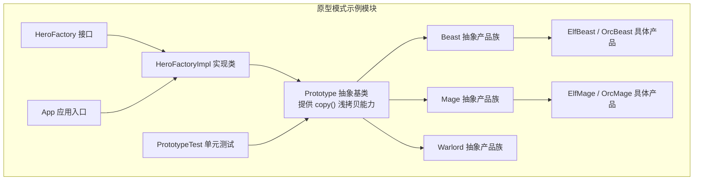
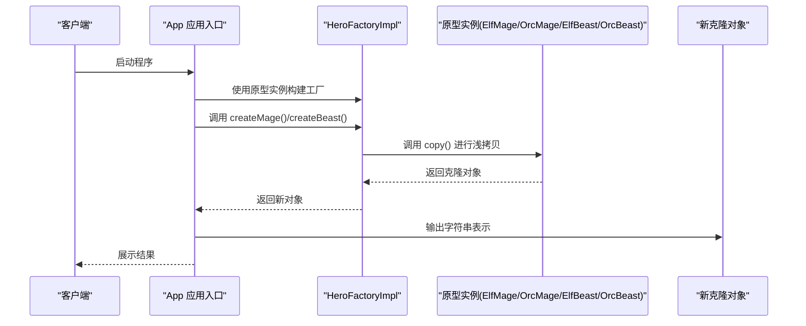
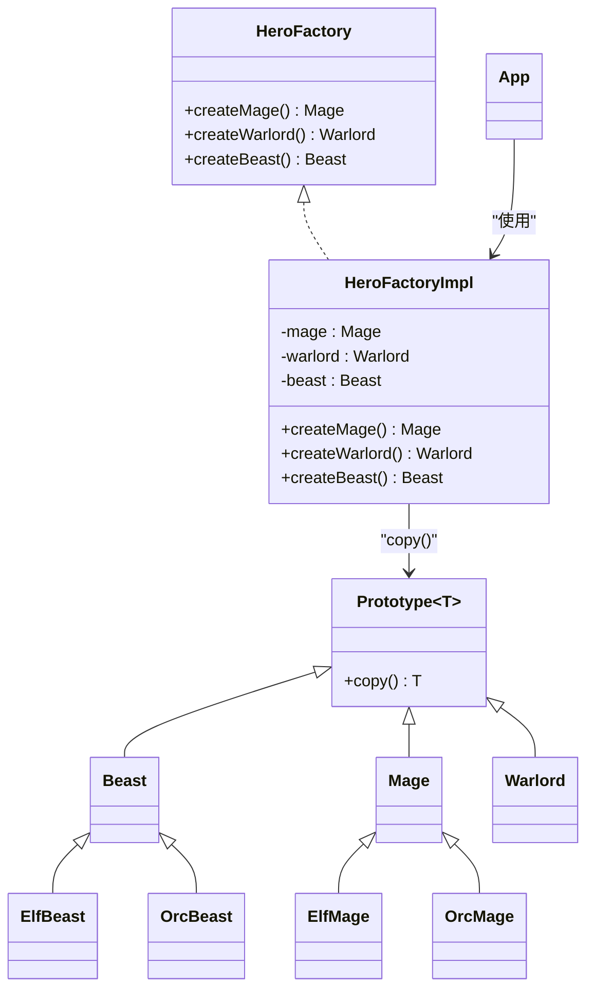
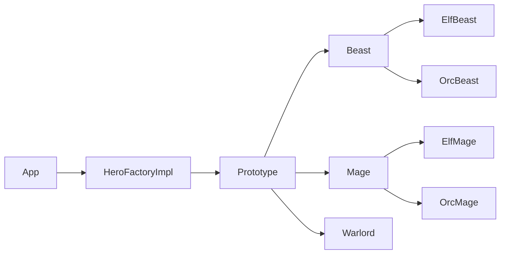
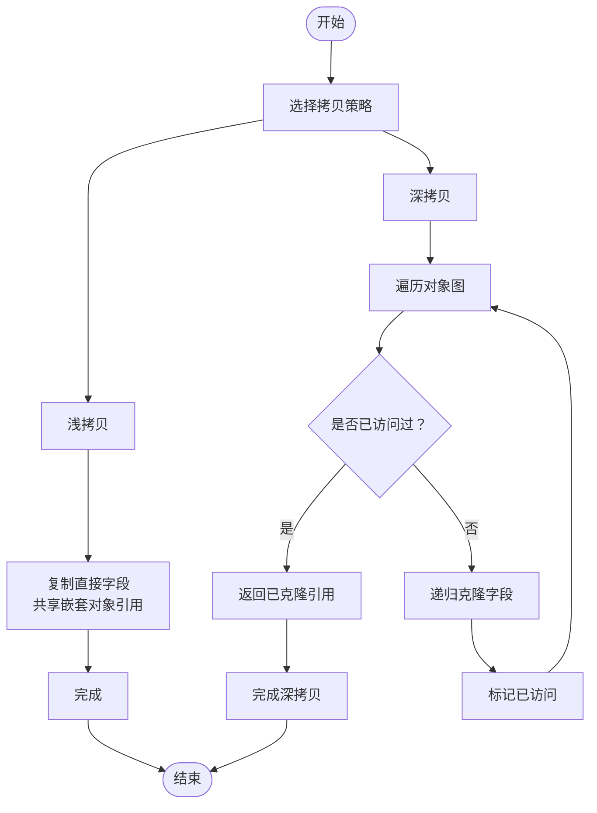

# 原型模式

<cite>
**本文引用的文件**
- [README.md](file://prototype/README.md)
- [Prototype.java](file://prototype/src/main/java/com/iluwatar/prototype/Prototype.java)
- [App.java](file://prototype/src/main/java/com/iluwatar/prototype/App.java)
- [Beast.java](file://prototype/src/main/java/com/iluwatar/prototype/Beast.java)
- [Mage.java](file://prototype/src/main/java/com/iluwatar/prototype/Mage.java)
- [Warlord.java](file://prototype/src/main/java/com/iluwatar/prototype/Warlord.java)
- [OrcBeast.java](file://prototype/src/main/java/com/iluwatar/prototype/OrcBeast.java)
- [ElfBeast.java](file://prototype/src/main/java/com/iluwatar/prototype/ElfBeast.java)
- [OrcMage.java](file://prototype/src/main/java/com/iluwatar/prototype/OrcMage.java)
- [ElfMage.java](file://prototype/src/main/java/com/iluwatar/prototype/ElfMage.java)
- [HeroFactory.java](file://prototype/src/main/java/com/iluwatar/prototype/HeroFactory.java)
- [HeroFactoryImpl.java](file://prototype/src/main/java/com/iluwatar/prototype/HeroFactoryImpl.java)
- [PrototypeTest.java](file://prototype/src/test/java/com/iluwatar/prototype/PrototypeTest.java)
</cite>

## 目录
1. [引言](#引言)
2. [项目结构](#项目结构)
3. [核心组件](#核心组件)
4. [架构总览](#架构总览)
5. [详细组件分析](#详细组件分析)
6. [依赖关系分析](#依赖关系分析)
7. [性能考量](#性能考量)
8. [故障排查指南](#故障排查指南)
9. [结论](#结论)
10. [附录](#附录)

## 引言
本文件围绕Java中的原型模式展开，系统阐述其设计动机、核心概念与实现策略，并以“羊群复制系统”（羊群、兽人与精灵英雄）为例，演示如何通过克隆现有实例高效创建新对象，从而规避复杂构造流程。文档同时深入对比浅拷贝与深拷贝的差异、实现方式与注意事项；并从对象创建视角对比原型模式与工厂模式的异同，总结其在性能优化与复杂对象初始化中的优势。最后给出原型注册表设计、克隆接口规范、适用场景、内存管理与序列化支持建议，以及在游戏开发、图形编辑器等领域的实践要点与扩展策略。

## 项目结构
该示例采用分层组织：抽象原型基类、具体产品族（兽人/精灵的法师、统帅、野兽）、工厂接口与实现，以及测试用例与说明文档。

图表来源
- [Prototype.java](file://prototype/src/main/java/com/iluwatar/prototype/Prototype.java#L34-L44)
- [Beast.java](file://prototype/src/main/java/com/iluwatar/prototype/Beast.java#L35-L40)
- [Mage.java](file://prototype/src/main/java/com/iluwatar/prototype/Mage.java#L35-L40)
- [Warlord.java](file://prototype/src/main/java/com/iluwatar/prototype/Warlord.java#L35-L40)
- [ElfBeast.java](file://prototype/src/main/java/com/iluwatar/prototype/ElfBeast.java#L35-L49)
- [OrcBeast.java](file://prototype/src/main/java/com/iluwatar/prototype/OrcBeast.java#L35-L49)
- [ElfMage.java](file://prototype/src/main/java/com/iluwatar/prototype/ElfMage.java#L35-L49)
- [OrcMage.java](file://prototype/src/main/java/com/iluwatar/prototype/OrcMage.java#L35-L49)
- [HeroFactory.java](file://prototype/src/main/java/com/iluwatar/prototype/HeroFactory.java#L30-L38)
- [HeroFactoryImpl.java](file://prototype/src/main/java/com/iluwatar/prototype/HeroFactoryImpl.java#L33-L60)
- [App.java](file://prototype/src/main/java/com/iluwatar/prototype/App.java#L47-L71)
- [PrototypeTest.java](file://prototype/src/test/java/com/iluwatar/prototype/PrototypeTest.java#L42-L66)

章节来源
- [README.md](file://prototype/README.md#L1-L200)
- [Prototype.java](file://prototype/src/main/java/com/iluwatar/prototype/Prototype.java#L34-L44)
- [HeroFactoryImpl.java](file://prototype/src/main/java/com/iluwatar/prototype/HeroFactoryImpl.java#L33-L60)

## 核心组件
- 抽象原型基类：提供统一的浅拷贝方法，作为所有可克隆产品的共同父类，确保类型安全与一致性。
- 抽象产品族：Beast、Mage、Warlord分别代表不同角色类型，均继承自Prototype，便于按族克隆。
- 具体产品：ElfBeast、OrcBeast、ElfMage、OrcMage等，体现不同种族与职责的差异化属性。
- 工厂接口与实现：HeroFactory定义创建方法，HeroFactoryImpl持有各原型实例并在运行时通过copy()生成新对象。
- 应用入口与测试：App演示工厂使用与输出效果；PrototypeTest验证克隆行为与相等性。

章节来源
- [Prototype.java](file://prototype/src/main/java/com/iluwatar/prototype/Prototype.java#L34-L44)
- [Beast.java](file://prototype/src/main/java/com/iluwatar/prototype/Beast.java#L35-L40)
- [Mage.java](file://prototype/src/main/java/com/iluwatar/prototype/Mage.java#L35-L40)
- [Warlord.java](file://prototype/src/main/java/com/iluwatar/prototype/Warlord.java#L35-L40)
- [ElfBeast.java](file://prototype/src/main/java/com/iluwatar/prototype/ElfBeast.java#L35-L49)
- [OrcBeast.java](file://prototype/src/main/java/com/iluwatar/prototype/OrcBeast.java#L35-L49)
- [ElfMage.java](file://prototype/src/main/java/com/iluwatar/prototype/ElfMage.java#L35-L49)
- [OrcMage.java](file://prototype/src/main/java/com/iluwatar/prototype/OrcMage.java#L35-L49)
- [HeroFactory.java](file://prototype/src/main/java/com/iluwatar/prototype/HeroFactory.java#L30-L38)
- [HeroFactoryImpl.java](file://prototype/src/main/java/com/iluwatar/prototype/HeroFactoryImpl.java#L33-L60)
- [App.java](file://prototype/src/main/java/com/iluwatar/prototype/App.java#L47-L71)
- [PrototypeTest.java](file://prototype/src/test/java/com/iluwatar/prototype/PrototypeTest.java#L42-L66)

## 架构总览
原型模式在此示例中通过“原型注册表式”的工厂实现：工厂在构造时注入若干原型实例，后续通过copy()克隆生成新对象，避免了对具体类的直接依赖与重复初始化成本。

图表来源
- [App.java](file://prototype/src/main/java/com/iluwatar/prototype/App.java#L47-L71)
- [HeroFactoryImpl.java](file://prototype/src/main/java/com/iluwatar/prototype/HeroFactoryImpl.java#L42-L58)
- [Prototype.java](file://prototype/src/main/java/com/iluwatar/prototype/Prototype.java#L41-L43)

## 详细组件分析

### 抽象原型基类与浅拷贝
- 设计要点
  - 统一的泛型接口：通过泛型参数约束copy()返回类型，保证类型安全。
  - 浅拷贝实现：基于Object.clone()进行浅拷贝，适用于不可变或值类型的成员。
  - 可扩展性：子类可覆盖clone()以实现深拷贝，但需谨慎处理嵌套对象与循环引用。
- 复杂度与性能
  - 时间复杂度近似O(k)，k为对象图中直接字段数量；空间复杂度与对象图大小成正比。
  - 对于大型对象图，浅拷贝显著优于逐字段重建，但需注意共享引用带来的副作用。

章节来源
- [Prototype.java](file://prototype/src/main/java/com/iluwatar/prototype/Prototype.java#L34-L44)

### 抽象产品族与具体产品
- Beast、Mage、Warlord作为抽象产品族，统一继承自Prototype，便于按族克隆。
- 具体产品（如ElfBeast、OrcBeast、ElfMage、OrcMage）通过构造函数接收原型实例，完成字段复制，体现“克隆而非新建”的思想。
- toString()用于验证克隆后的行为与状态一致。

章节来源
- [Beast.java](file://prototype/src/main/java/com/iluwatar/prototype/Beast.java#L35-L40)
- [Mage.java](file://prototype/src/main/java/com/iluwatar/prototype/Mage.java#L35-L40)
- [Warlord.java](file://prototype/src/main/java/com/iluwatar/prototype/Warlord.java#L35-L40)
- [ElfBeast.java](file://prototype/src/main/java/com/iluwatar/prototype/ElfBeast.java#L35-L49)
- [OrcBeast.java](file://prototype/src/main/java/com/iluwatar/prototype/OrcBeast.java#L35-L49)
- [ElfMage.java](file://prototype/src/main/java/com/iluwatar/prototype/ElfMage.java#L35-L49)
- [OrcMage.java](file://prototype/src/main/java/com/iluwatar/prototype/OrcMage.java#L35-L49)

### 工厂接口与实现
- HeroFactory定义创建方法，隔离客户端与具体产品类型。
- HeroFactoryImpl持有各原型实例，在运行时通过copy()克隆生成新对象，实现“原型注册表”的轻量级管理。

图表来源
- [Prototype.java](file://prototype/src/main/java/com/iluwatar/prototype/Prototype.java#L34-L44)
- [Beast.java](file://prototype/src/main/java/com/iluwatar/prototype/Beast.java#L35-L40)
- [Mage.java](file://prototype/src/main/java/com/iluwatar/prototype/Mage.java#L35-L40)
- [Warlord.java](file://prototype/src/main/java/com/iluwatar/prototype/Warlord.java#L35-L40)
- [ElfBeast.java](file://prototype/src/main/java/com/iluwatar/prototype/ElfBeast.java#L35-L49)
- [OrcBeast.java](file://prototype/src/main/java/com/iluwatar/prototype/OrcBeast.java#L35-L49)
- [ElfMage.java](file://prototype/src/main/java/com/iluwatar/prototype/ElfMage.java#L35-L49)
- [OrcMage.java](file://prototype/src/main/java/com/iluwatar/prototype/OrcMage.java#L35-L49)
- [HeroFactory.java](file://prototype/src/main/java/com/iluwatar/prototype/HeroFactory.java#L30-L38)
- [HeroFactoryImpl.java](file://prototype/src/main/java/com/iluwatar/prototype/HeroFactoryImpl.java#L33-L60)
- [App.java](file://prototype/src/main/java/com/iluwatar/prototype/App.java#L47-L71)

章节来源
- [HeroFactory.java](file://prototype/src/main/java/com/iluwatar/prototype/HeroFactory.java#L30-L38)
- [HeroFactoryImpl.java](file://prototype/src/main/java/com/iluwatar/prototype/HeroFactoryImpl.java#L33-L60)

### 程序执行流程与示例输出
- App在主方法中两次构建HeroFactoryImpl，分别注入不同原型实例，随后调用工厂方法克隆生成新对象并打印结果。
- 示例输出展示了不同种族与职责的字符串表示，验证克隆后的状态正确。

章节来源
- [App.java](file://prototype/src/main/java/com/iluwatar/prototype/App.java#L47-L71)
- [README.md](file://prototype/README.md#L116-L153)

### 测试用例与断言
- 测试覆盖多种具体原型（兽人/精灵的法师、统帅、野兽），验证：
  - toString()符合预期；
  - copy()返回非空且与原对象类型相同；
  - clone与原对象不为同一引用，但内容相等。

章节来源
- [PrototypeTest.java](file://prototype/src/test/java/com/iluwatar/prototype/PrototypeTest.java#L42-L66)

## 依赖关系分析
- 继承关系：具体产品均继承自对应的抽象产品族，抽象产品族再继承自Prototype，形成清晰的层次结构。
- 组合关系：HeroFactoryImpl组合多个原型实例，通过copy()进行对象创建。
- 耦合度评估：客户端仅依赖工厂接口，降低对具体类的耦合；原型实例可替换，提升灵活性。

图表来源
- [Prototype.java](file://prototype/src/main/java/com/iluwatar/prototype/Prototype.java#L34-L44)
- [Beast.java](file://prototype/src/main/java/com/iluwatar/prototype/Beast.java#L35-L40)
- [Mage.java](file://prototype/src/main/java/com/iluwatar/prototype/Mage.java#L35-L40)
- [Warlord.java](file://prototype/src/main/java/com/iluwatar/prototype/Warlord.java#L35-L40)
- [ElfBeast.java](file://prototype/src/main/java/com/iluwatar/prototype/ElfBeast.java#L35-L49)
- [OrcBeast.java](file://prototype/src/main/java/com/iluwatar/prototype/OrcBeast.java#L35-L49)
- [ElfMage.java](file://prototype/src/main/java/com/iluwatar/prototype/ElfMage.java#L35-L49)
- [OrcMage.java](file://prototype/src/main/java/com/iluwatar/prototype/OrcMage.java#L35-L49)
- [HeroFactoryImpl.java](file://prototype/src/main/java/com/iluwatar/prototype/HeroFactoryImpl.java#L33-L60)
- [App.java](file://prototype/src/main/java/com/iluwatar/prototype/App.java#L47-L71)

章节来源
- [HeroFactoryImpl.java](file://prototype/src/main/java/com/iluwatar/prototype/HeroFactoryImpl.java#L33-L60)
- [App.java](file://prototype/src/main/java/com/iluwatar/prototype/App.java#L47-L71)

## 性能考量
- 浅拷贝 vs 深拷贝
  - 浅拷贝：适合不可变或值类型字段，速度快、内存占用低；但共享引用可能导致修改互相影响。
  - 深拷贝：递归复制所有嵌套对象，避免共享引用，但实现复杂、成本较高；需处理循环引用与性能瓶颈。
- 适用场景
  - 当对象创建代价高（如初始化昂贵资源、解析配置、网络请求）时，优先选择原型模式。
  - 需要动态组合对象状态时，原型模式比工厂模式更灵活。
- 扩展与优化
  - 使用“原型注册表”集中管理常用原型，减少重复创建。
  - 在高频克隆路径上，可结合对象池与弱引用缓存，降低GC压力。
  - 对复杂对象图，采用选择性深拷贝（只对必要字段深拷贝）以平衡性能与正确性。

## 故障排查指南
- 克隆后状态异常
  - 检查是否遗漏对可变字段的深拷贝；确认构造函数中是否正确复制原型字段。
- 类型不匹配
  - 确保copy()返回类型与泛型参数一致；避免强制转换失败。
- 循环引用与无限递归
  - 深拷贝实现需维护访问集合，防止重复克隆导致栈溢出。
- 并发安全
  - 若原型实例在多线程下被共享，需确保克隆操作的原子性与可见性。

章节来源
- [PrototypeTest.java](file://prototype/src/test/java/com/iluwatar/prototype/PrototypeTest.java#L42-L66)

## 结论
原型模式通过“克隆而非新建”的方式，有效简化复杂对象的创建流程，尤其适用于需要频繁生成相似对象且初始化成本较高的场景。在本示例中，通过抽象原型基类与工厂实现，实现了类型安全、易于扩展与运行时灵活配置的对象创建体系。对于浅拷贝与深拷贝的选择，应根据对象图结构与业务需求权衡性能与正确性；在高并发与大规模克隆场景下，建议结合对象池与缓存策略进一步优化。

## 附录

### 原型模式与工厂模式的对比
- 关注点差异
  - 原型模式：关注“已有实例的复制”，强调运行时状态复用与快速克隆。
  - 工厂模式：关注“创建逻辑的封装”，强调解耦与可替换的创建策略。
- 选择建议
  - 当对象初始化成本高、状态稳定且可通过克隆复用时，优先原型模式。
  - 当对象创建涉及复杂条件分支、依赖注入或跨平台适配时，优先工厂模式。

章节来源
- [README.md](file://prototype/README.md#L188-L192)

### 原型注册表设计与克隆接口规范
- 原型注册表
  - 将常用原型集中管理，支持按类型或标识获取原型实例，便于工厂注入与替换。
- 克隆接口规范
  - 明确copy()语义：浅拷贝或深拷贝；约定返回类型与异常处理。
  - 子类重写clone()时，需保持与父类一致的类型签名与行为契约。

章节来源
- [HeroFactoryImpl.java](file://prototype/src/main/java/com/iluwatar/prototype/HeroFactoryImpl.java#L33-L60)
- [Prototype.java](file://prototype/src/main/java/com/iluwatar/prototype/Prototype.java#L34-L44)

### 适用场景与实践建议
- 游戏开发
  - 快速生成具有相似属性的敌人、道具或关卡元素；通过原型注册表统一管理模板。
- 图形编辑器
  - 基于现有图元克隆生成新实例，减少重复初始化开销。
- 配置与模板系统
  - 以模板为原型，批量生成实例并局部定制。

章节来源
- [README.md](file://prototype/README.md#L167-L171)

### 浅拷贝与深拷贝流程示意

图表来源
- [Prototype.java](file://prototype/src/main/java/com/iluwatar/prototype/Prototype.java#L41-L43)